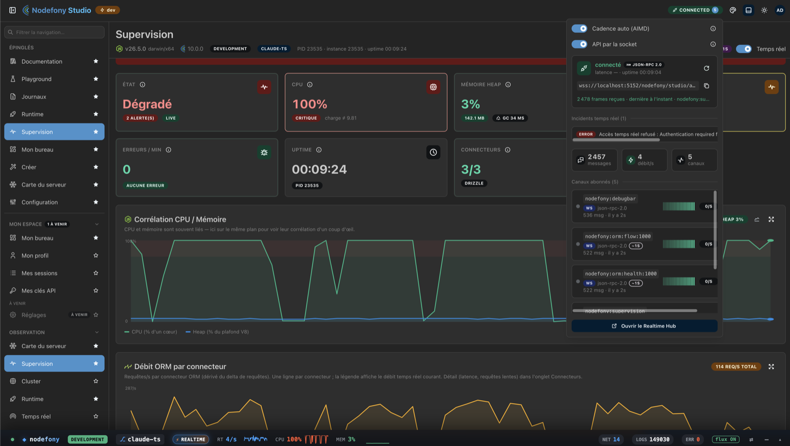
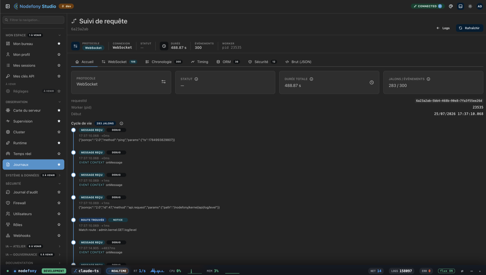

<div align="center">


# Nodefony

**Le framework Node.js fullstack : temps réel natif, développement agentic-ready, sur un socle TypeScript isomorphe.**

_Une action de contrôleur. Deux transports. La même session, la même sécurité, le même code._

[](LICENSE.txt)
[](package.json)
[](tsconfig.json)
[](package.json)

</div>

---

Nodefony est un framework serveur fullstack pour Node.js, écrit en TypeScript strict et bâti
directement sur les modules natifs de la plateforme — `node:http`, `node:http2`, WebSocket. Il
apporte un noyau à injection de dépendances, un système de modules, un pare-feu applicatif, une
persistance portable, une console d'administration et la construction des frontends.

Sa particularité tient en une propriété : **le WebSocket n'y est pas un ajout.** C'est un transport
de première classe, servi par le même pipeline, la même table de routes et la même sécurité que le
HTTP. Une application temps réel s'y écrit comme une application web ordinaire.

Les frontends ne sont pas laissés dehors. Nodefony pilote **Vite** : en développement il démarre
les serveurs de développement — React, Vue, Angular —, les surveille, relaie leur rechargement à
chaud et sert leurs pages ; en production il construit les bundles et les distribue. Une
application peut en porter plusieurs, chacun monté sur sa route.

Le socle, lui, est **isomorphe** : le même paquet s'importe côté serveur et côté navigateur. Le
client temps réel, les règles d'autorisation, les types d'une ressource sont écrits une fois et
s'exécutent là où ils servent — une règle corrigée l'est des deux côtés.

## D'où ça vient

Nodefony est publié depuis **2017**, en JavaScript, et a mûri jusqu'à sa version 7 : des
applications réelles tournent encore dessus. Fin 2023, plutôt que de le migrer par petits pas, le
choix a été fait d'une **réécriture complète en TypeScript**, fichier par fichier, en gardant les
concepts et en jetant tout le reste.

Pourquoi une réécriture et pas une migration progressive ? Parce qu'un framework ne se contente pas
d'exécuter du code : il **contraint** celui qu'on écrit contre lui. Une couche de types posée après
coup sur du JavaScript décrit ce que le code fait ; elle ne garantit rien. Les partis pris de cette
réécriture sont donc structurels, et chacun ferme une porte :

| Décision                          | Ce qu'elle rend impossible                                    |
| --------------------------------- | ------------------------------------------------------------- |
| TypeScript **strict**, zéro `any` | qu'un contrat se dégrade en silence entre deux modules        |
| **ESM** exclusivement             | la double résolution CommonJS/ESM et ses pièges de chargement |
| Décorateurs plutôt que convention | qu'une route existe sans être déclarée là où on la lit        |
| Configuration **validée** au boot | qu'une clé mal orthographiée soit ignorée sans un mot         |
| Un processus = une instance       | la supervision maison ; l'échelle revient à l'orchestrateur   |

La version 10 est l'aboutissement de cette réécriture. Ce n'est pas un portage : c'est le même
projet, repensé pour ce que Node.js et TypeScript sont devenus.

## Une action, deux transports

Ce contrôleur est celui que `nodefony create controller` produit. La première action répond en REST ;
la seconde est un point d'entrée WebSocket. Même classe, même session, mêmes règles d'accès :

```typescript
import {
  route,
  controller,
  Controller,
  CurrentUser,
} from "@nodefony/framework";
import type { ContextType } from "@nodefony/http";

@controller("/api/blog")
class BlogController extends Controller {
  constructor(context: ContextType) {
    super("blog", context);
  }

  @route("blog-index", { path: "", method: "GET" })
  async index(@CurrentUser() user?: { identifier?: string }) {
    return this.renderJson({
      hello: "blog",
      who: user?.identifier ?? "anonyme",
    });
  }

  // Même classe, même décorateur : seul le transport déclaré change.
  @route("blog-echo", {
    path: "/echo",
    requirements: { methods: ["WEBSOCKET"] },
  })
  async echo(message: string | Buffer | null) {
    if (!message) return this.renderJson({ handshake: true });
    return this.renderJson({ echo: message.toString() });
  }
}
```

<details>
<summary><b>Ce que ça implique sous le capot</b> — pourquoi ce n'est pas du sucre syntaxique</summary>

- La pseudo-méthode `WEBSOCKET` est traitée comme un verbe HTTP ordinaire : **une seule table de
  routes** pour les deux transports, un seul résolveur de contrôleur.
- Le WebSocket ouvre **la même bulle `AsyncLocalStorage`** que le HTTP et la propage à chaque
  message : l'identifiant de requête et l'utilisateur restent stables du handshake à la fermeture.
- Conséquence directe : une règle d'autorisation protège une action **quel que soit le transport**,
  et une session ouverte en HTTP est celle que voit la socket. Pas de passerelle, pas de seconde
  pile d'authentification, pas de logique dupliquée.
- C'est aussi ce qui fait du **streaming** — d'un fichier, d'un événement, d'un modèle de langage —
  un cas d'usage naturel plutôt qu'un montage : un générateur asynchrone branché sur un canal, dans
  le même contexte de sécurité que le reste de l'application.

</details>

## Un seul langage, du serveur au navigateur

Le client n'est pas une bibliothèque à part, publiée séparément et rattrapée à chaque version : il
est **dans le même paquet que le serveur**, et il partage ses types. Le contrat d'un canal, la forme
d'un message, la hiérarchie des rôles — on les écrit une fois, et les deux côtés en dépendent :

```typescript
import { RealtimeClient } from "nodefony/client";

const socket = RealtimeClient.shared({ url: "wss://localhost:5152" });

await socket.subscribe("chat:room"); // canaux
socket.on("chat:room", (message) => render(message));

const modules = await socket.request("/nodefony/kernel/api/modules"); // appel de service
```

Les mêmes sous-chemins servent le reste : `nodefony/react` pour les hooks, `nodefony/roles` pour
évaluer une autorisation dans l'interface **avec la règle exacte du serveur** — un bouton caché parce
que le rôle manque est caché par la même logique que celle qui refusera l'appel.

> **Pourquoi TypeScript, et pas un portage vers un langage plus rapide ?** Parce que l'isomorphisme
> se paierait exactement là. Réécrire le cœur ailleurs ferait gagner des microsecondes et perdre la
> seule chose qu'un framework fullstack peut vraiment offrir : un contrat unique, vérifié par le
> compilateur, du contrôleur jusqu'au composant. Ce qui coûte cher dans une application temps réel,
> ce n'est pas le langage — c'est la frontière entre deux mondes qui doivent se redire la même chose
> et finissent par diverger. Nodefony supprime la frontière plutôt que d'optimiser le passage.

## Prêt pour les agents — ce que ça veut dire ici

Une application est aujourd'hui écrite à deux mains : la personne et l'agent qu'elle pilote. Or un
agent lâché dans un projet bâti sur un framework qu'il connaît mal **invente**. Il produit du code
plausible : un CRUD écrit à la main là où un générateur existait, un import direct du driver de base
de données qui contourne la façade, une socket bas niveau là où le framework offre un canal. Ce code
compile, il passe même les tests — et il aura vieilli avant d'être relu.

La réponse de Nodefony n'est pas un assistant intégré. C'est de rendre **l'application capable de se
décrire**, pour que l'agent lise au lieu de deviner :

| Ce qui est posé                        | Ce que ça évite                                                                              |
| -------------------------------------- | -------------------------------------------------------------------------------------------- |
| Un **`AGENTS.md` généré** à la racine  | la convention périmée : le fichier est dérivé du projet réel, il ne peut pas mentir          |
| La **doc voyage dans les paquets npm** | l'agent qui cherche sur le web une version qui n'est pas la vôtre                            |
| Un **catalogue des briques** publié    | le choix de module fait au jugé, sans savoir ce qu'un adaptateur ne couvre pas               |
| `inspect` · `check` · `env`            | la déduction depuis le code de ce que l'application fait vraiment : routes, services, config |
| Des générateurs **pilotables en JSON** | l'imitation d'un fichier d'exemple, au lieu d'appeler l'outil qui produit le vrai code       |
| Un **graphe symbolique** du code       | la fouille par `grep` : qui étend quoi, qui implémente quoi, en une lecture                  |

Le standard retenu — [`AGENTS.md`](https://agents.md) — est celui que lisent la plupart des outils
de codage, avec la règle « le plus proche gagne ». Rien n'est propriétaire : le fichier est un
index, court par construction, qui **pointe** vers la documentation installée plutôt que de la
recopier.

<details>
<summary><b>Et surtout : c'est mesuré</b> — un banc de découvrabilité, pas une intention</summary>

Une application témoin est générée, puis un agent y reçoit des tâches réelles : « ajoute un CRUD
produit », « protège une route », « écris une commande CLI », « configure l'application par
l'environnement », « choisis la brique adaptée à ce besoin ». Le harnais lit ensuite le transcript
et le code produit, et répond à une seule question : **l'agent a-t-il lu, ou deviné ?**

La métrique n'est pas « le code marche » — il marche souvent, c'est bien le piège. C'est : a-t-il
lancé le générateur ? ouvert le catalogue ? interrogé la configuration effective plutôt que de la
supposer ? Le banc n'est pas entièrement vert aujourd'hui, et chaque échec désigne un endroit précis
où l'application ne se rend pas assez évidente. C'est exactement à ça qu'il sert.

</details>

Aucun framework backend Node n'offre aujourd'hui d'équivalent officiel. C'est un espace vide, et
c'est délibérément là que Nodefony se place.

## Démarrage

Les paquets `10.x` ne sont pas encore publiés sur npm ; le framework s'essaie depuis ce dépôt :

```bash
git clone https://github.com/nodefony/nodefony-core.git
cd nodefony-core
npm install && npm run build
npm run dev
```

L'application répond sur `http://127.0.0.1:5151`, la console d'administration sur `/nodefony`.

Générer du code — une application, un module, un contrôleur, une entité et toute sa chaîne :

```bash
nodefony create app mon-app
nodefony create module blog --frontend react
nodefony create entity Article title:string! body:text views:int
```

Chaque générateur montre **le plan et le diff avant d'écrire quoi que ce soit**. Un refus ne laisse
rien derrière lui. Il publie aussi son catalogue en JSON et accepte ses réponses par fichier : la
même porte sert la personne au terminal, la console d'administration et un agent.

## Le framework se regarde tourner

`@nodefony/studio` est une console d'administration livrée avec le framework : topologie du runtime,
journaux en direct avec rejeu, suivi d'une requête de bout en bout par son identifiant, schéma de la
base, graphe des classes par module, gouvernance de la sécurité (audit, pare-feu, rôles, sessions,
clés d'API), et les générateurs de code pilotables à la souris, la sortie diffusée comme un terminal.



Sa force est en dessous : **elle ne consomme aucune API privée.** Toutes ses données viennent d'un
plan de données JSON protégé par les mêmes règles d'accès que le reste, **auto-décrit** — un appel en
renvoie le catalogue — et **duplex** : le même point d'accès répond en HTTP et par la socket. Ce
qu'affiche la console, un script ou un agent peut le lire tel quel.

Le suivi d'une requête en est l'illustration la plus directe : chaque requête porte un identifiant
propagé dans tout le pipeline, et la console rejoue son trajet complet — phases, requêtes de base de
données, décisions du pare-feu.



## La sécurité, fermée par défaut

Le pare-feu découpe l'application en **zones**, chacune avec sa chaîne d'authentification. Il refuse
plutôt que d'ouvrir : une configuration invalide capture le trafic et répond 401.

|                   |                                                                                                      |
| ----------------- | ---------------------------------------------------------------------------------------------------- |
| **Identités**     | session serveur pour le web · jetons et clés d'API pour les machines · OAuth2/OIDC · WebAuthn · TOTP |
| **Cryptographie** | Argon2id pour les mots de passe · signatures Ed25519 · secrets chiffrés au repos                     |
| **Défenses**      | CSRF par métadonnées de requête · en-têtes de sécurité · limitation de débit · journal d'audit       |
| **Autorisation**  | hiérarchie de rôles vérifiée au démarrage, refus par défaut                                          |

### Équipe rouge, équipe bleue

Ces briques ne sont pas éprouvées par des cas nominaux — « le login fonctionne » ne prouve rien. Les
campagnes se mènent en **deux passes, et l'ordre est le cœur du dispositif** :

1. **Passe rouge — la menace d'abord.** La matrice d'attaque est construite depuis les standards et
   les faiblesses connues **avant d'avoir lu le code**. C'est un garde-fou contre son propre biais :
   qui lit l'implémentation en premier ne teste que ce qu'elle prévoit, et rate précisément ce
   qu'elle a oublié.
2. **Passe bleue — le code ensuite.** On lit l'implémentation, on couvre les branches restantes,
   on regarde les chemins que la passe rouge n'imaginait pas.
3. **Le cycle.** Faille trouvée → corrigée → **re-prouvée par un test qui échouait avant elle**. Un
   correctif sans son test de non-retour ne compte pas comme corrigé.

Ce qui distingue ces attaques d'un scan générique : beaucoup visent des surfaces **propres à cette
architecture** — les portées de l'injection de dépendances, les messages du pipeline WebSocket
partagé, le jeton porté par le contexte asynchrone, les zones du pare-feu et leurs contournements.
Aucun outil sur étagère ne connaît ces surfaces : il faut concevoir les attaques.

> ⚠️ **À savoir avant de concevoir votre application.** Le refus par défaut opère **par zone du
> pare-feu**, pas route par route : une route située hors de toute zone déclarée est publique.
> Déclarez vos zones.

## Ce qu'il y a dans la boîte

<!-- prettier-ignore -->
| Brique | Rôle |
| --- | --- |
| `nodefony` | Noyau : modules, injection de dépendances, configuration validée au démarrage, journalisation structurée corrélée, CLI — et le client temps réel partagé avec le navigateur |
| [`@nodefony/http`](src/packages/@nodefony/http) | Serveurs HTTP, HTTPS, HTTP/2 et WebSocket natifs, sessions, contextes de requête, certificats TLS |
| [`@nodefony/framework`](src/packages/@nodefony/framework) | Routeur, contrôleurs, décorateurs, vues — le modèle de programmation |
| [`@nodefony/security`](src/packages/@nodefony/security) · [`@nodefony/user`](src/packages/@nodefony/user) | Pare-feu par zones, authentification, autorisation par rôles, CSRF, audit |
| [`@nodefony/realtime`](src/packages/@nodefony/realtime) | Canaux, appels bidirectionnels, contre-pression, diffusion entre plusieurs instances |
| [`@nodefony/orm-core`](src/packages/@nodefony/orm-core) | Un contrat de dépôt de données, plusieurs moteurs : [Drizzle](src/packages/@nodefony/drizzle) (SQLite, PostgreSQL, MySQL), [Mongoose](src/packages/@nodefony/mongoose), [Redis](src/packages/@nodefony/redis) |
| [`@nodefony/frontend`](src/packages/@nodefony/frontend) | Construction et rechargement à chaud des frontends de chaque module |
| [`@nodefony/studio`](src/packages/@nodefony/studio) | Console d'administration |

Un processus Node égale une instance : pas de superviseur maison, le passage à l'échelle revient à
l'orchestrateur, et les journaux partent sur la sortie standard.

## Où aller ensuite

- [Par où commencer](docs/demarrer.md) — quatre parcours selon ce que vous venez faire
- [Documentation](docs/index.md) · [Guides](docs/guides/README.md) · [Première application](docs/tutoriels/premiere-application.md)
- [L'architecture en vue d'ensemble](docs/architecture/vue-ensemble.md) — ce que le framework est, et ce que ses partis pris coûtent
- [Performance](docs/performance/index.md) — ce qui a été mesuré, avec quel protocole, et ce que
  ces chiffres ne permettent pas de conclure
- [Décisions d'architecture](docs/adr/) — les choix structurants et leur pourquoi
- [Signaler une faille](SECURITY.md) — canal privé, jamais en ticket public
- Contribuer : ouvrez une discussion avant toute contribution substantielle. Le dépôt impose les
  _Conventional Commits_ et un `npm run typecheck` complet avant chaque envoi.

## État du projet

Le cœur — serveurs, routage, sécurité, temps réel, persistance, console d'administration,
construction des frontends — est couvert par des suites de tests exécutables sur infrastructure
réelle (`npm run test:all`), et le dépôt versionne des seuils de fuite mémoire et de charge
opposables à chaque exécution.

**Ce que ça donne en charge.** À travail égal — mêmes journaux, même contexte de requête, mêmes
en-têtes de sécurité, même protection CSRF — un processus rend **~92 % du débit d'un Express muni
des mêmes intergiciels** (12 226 requêtes/s, p99 9,57 ms sur la machine de référence), et vingt
minutes de charge continue laissent le tas plat. Le dossier
[Performance](docs/performance/index.md) porte le protocole, les scripts qui rejouent chaque
chiffre, les instruments qui ont menti avant qu'on s'en aperçoive, et ce que ces mesures
n'autorisent pas à conclure — aucun absolu pris derrière un chemin virtualisé n'est transposable.

Ce qu'il faut savoir avant de bâtir dessus : **il n'existe pas encore de système de migration de
schéma** — la base est dérivée au démarrage, ce qui convient au développement et pas à la
production. Les versions JavaScript historiques (≤ 7.x) ne reçoivent plus de correctifs. Projet
libre, développé bénévolement par une seule personne.

Licence [CeCILL-B](LICENSE.txt) — libre de droit français, compatible BSD.
**Christophe Camensuli** · [ccamensuli@gmail.com](mailto:ccamensuli@gmail.com)

---

<div align="center">

_La suite est une couche d'agents IA construite sur ce socle : le même pipeline, la même sécurité, le
même temps réel — et une application qui sait déjà se décrire à une machine._

</div>
