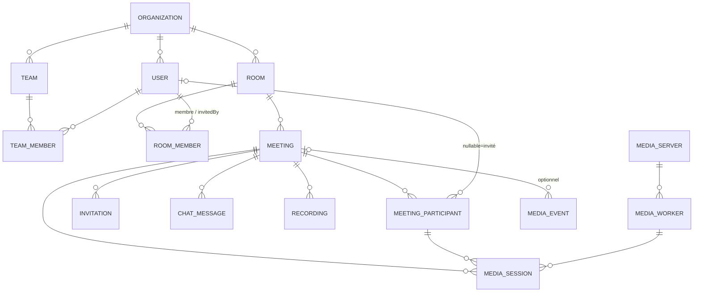

# ADR-0002 — Schéma DB conférence WebRTC (mediasoup)

## Statut

Accepté (2026-05-21). Superséde l'usage des entités legacy `nodefony-mediasoup`
(`User`/`Room`/`Calendar`/`Events`) comme référence — voir mémoire IA
`project_mediasoup_test_db`.

## Contexte

`@nodefony/orm-core` (P5.1 ✅) a besoin d'un **banc de test représentatif** pour
valider le multi-driver (Sequelize/Mongoose/Drizzle) et le test « CRITIQUE
multi-ORM » de la roadmap (P5.4 / 7.5 : _même entité, 2 stores_).

Plutôt qu'une base de démo générique (Chinook, Sakila), on conçoit le schéma
d'une **plateforme de visioconférence WebRTC type Teams-light** basée sur
mediasoup. Triple dividende : (1) valide orm-core sur un schéma réaliste, (2)
amorce `@nodefony/user` (P5.5), (3) amorce la migration **P15 mediasoup +
SIP/Asterisk**. Un **dashboard realtime de supervision mediasoup** est prévu :
décider ce qui mérite une table et ce qui reste live.

Rappel archi mediasoup : `Worker` (process C++/CPU) → `Router` (= une room
active) → `Transport` (WebRtc/Plain/Pipe) → `Producer`/`Consumer` (+ Data\*).
Ces objets sont **runtime in-memory**, jamais persistés.

## Décision

### Principes

1. **PK = UUID partout** (pas les clés naturelles `string` du legacy). Raison :
   cloud-native cluster (P16, pas de collision cross-pod), FK stables au renommage.
   Le nom lisible devient un `slug`/`username` **unique**, pas la clé primaire.
2. **`room` ≠ `meeting`** (décision structurante) : `room` = espace **persistant
   réutilisable** (lien permanent, droits d'accès — type Zoom PMI / salon Teams) ;
   `meeting` = **occurrence** (planifiée ou instantanée) se déroulant _dans_ une
   room. L'**accès** est porté par la room, la **présence** par le meeting.
3. **Multi-tenant léger** : `organization_id` scope les entités, **un seul niveau**
   (pas de hiérarchie Teams).
4. **Supervision = live sans table / historique avec tables** (voir plus bas).
5. **Soft-delete** (`deletedAt`) sur les entités métier longues (`user`, `room`).

### ERD



Cardinalités résumées :

```
organization 1─N user · room · team
user N─N team   → team_member (role)            [PK composite]
user N─N room   → room_member (role, invitedBy) [PK composite + self-ref]
room 1─N meeting 1─N meeting_participant N─1 user(nullable=invité)
meeting 1─N invitation · chat_message · recording
media_server 1─N media_worker
meeting 1─N media_session N─1 media_worker / N─1 meeting_participant
media_event → meeting? / server? / user?  (FK optionnelles, append-only)
```

Légende dictionnaire : `∎` unique · `→` FK · `?` nullable.

### Dictionnaire de données

**A. Identité & Organisation**

<!-- prettier-ignore -->
| Table | Colonnes |
| --- | --- |
| `organization` | id(UUID), name, slug∎, settings(JSON), createdAt, updatedAt |
| `user` | id(UUID), orgId→, username∎, email∎, passwordHash?, roles(JSON `["ROLE_USER"]`), enabled(bool), locked(bool), twoFactor(bool), name?, surname?, avatar?, lang, lastSeenAt?, createdAt, updatedAt, deletedAt? |
| `team` | id(UUID), orgId→, name, slug∎, description?, createdAt, updatedAt |
| `team_member` | **PK(teamId→, userId→)**, role(enum owner/admin/member), joinedAt |

**B. Salles & Réunions**

<!-- prettier-ignore -->
| Table | Colonnes |
| --- | --- |
| `room` | id(UUID), orgId→, ownerId→user, slug∎, displayName, type(enum webrtc), access(enum public/private/org), secure(bool), passwordHash?, lobbyEnabled(bool), maxParticipants(int), settings(JSON: layout, médias), persistent(bool), createdAt, updatedAt, deletedAt? |
| `room_member` | **PK(roomId→, userId→)**, role(enum host/cohost/presenter/member), invitedById→user?, addedAt |
| `meeting` | id(UUID), roomId→, orgId→, title, status(enum scheduled/live/ended/cancelled), scheduledStart?, scheduledEnd?, actualStart?, actualEnd?, recurrenceRule(JSON RRULE)?, createdById→user, settings(JSON), createdAt, updatedAt |
| `meeting_participant` | id(UUID), meetingId→, userId→**?**, guestName?, role(enum host/cohost/presenter/attendee), state(enum invited/joined/left/declined), joinedAt?, leftAt?, durationSec? |
| `invitation` | id(UUID), meetingId→, email, token∎, role(enum), status(enum pending/accepted/declined/expired), expiresAt, invitedById→user, createdAt |

**C. Contenu de réunion**

| Table          | Colonnes                                                                                                                                                                                                    |
| -------------- | ----------------------------------------------------------------------------------------------------------------------------------------------------------------------------------------------------------- |
| `chat_message` | id(UUID), meetingId→, senderId→user?, guestName?, body(text), type(enum text/file/system), createdAt, editedAt?, deletedAt? — index (meetingId, createdAt) pour pagination                                  |
| `recording`    | id(UUID), meetingId→, status(enum recording/processing/ready/failed), storageUrl?, sizeBytes(bigint)?, durationSec?, format(enum mp4/webm)?, workerId→media_worker?, createdById→user, createdAt, updatedAt |

**D. Supervision mediasoup (infra + historique)**

<!-- prettier-ignore -->
| Table | Colonnes |
| --- | --- |
| `media_server` | id(UUID), hostname∎, region, ip, status(enum up/draining/down), version, capacity(int), lastHeartbeatAt, registeredAt — MAJ par heartbeat |
| `media_worker` | id(UUID), serverId→, pid(int), workerIndex(int), status(enum), routersCount(int), lastHeartbeatAt |
| `media_session` | id(UUID), meetingId→, participantId→meeting_participant, workerId→media_worker, transportType(enum webrtc/plain/pipe), startedAt, endedAt?, durationSec?, bytesSent(bigint), bytesReceived(bigint), codecs(JSON), **qosSummary(JSON: rttAvg, packetLossAvg, jitterAvg)** — **1 ligne par connexion peer, écrite à la fermeture** |
| `media_event` | id(UUID), meetingId→?, serverId→?, userId→?, type(enum room.created/peer.joined/peer.left/producer.created/recording.started/server.down/…), payload(JSON), severity(enum), createdAt — append-only, rotation/archivage |

### Supervision — règle ferme (perf)

- 🟢 **Dashboard live = ZÉRO table.** L'état temps réel (rooms actives, peers,
  producers, charge worker via `worker.getResourceUsage()`, `transport.getStats()`)
  est **in-memory dans mediasoup** et poussé en **WS** (RealtimeService P13.4 /
  pattern Studio). Persister du live = pression GC + I/O inutile.
- 🟡 **Tables = uniquement ce qui doit survivre** : `media_server`/`media_worker`
  (registre cluster, faible cardinalité), `media_session` (résumé par connexion à
  la fermeture — analytics/billing/QoS), `media_event` (timeline/audit). La
  présence (`meeting_participant.join/leave`) fournit déjà l'historique d'assiduité.
- 🔴 **Interdit en table SQL** : échantillons QoS **par seconde** (RTT/jitter/loss).
  Le volume tue le SGBD. Soit agréger dans `media_session.qosSummary` à la
  fermeture, soit pousser vers une time-series dédiée (Prometheus/TimescaleDB)
  **hors ORM**. Le live lit le runtime, pas la base.

### Runtime, jamais persisté

`Worker`, `Router` (room active), `Transport`, `Producer`/`Consumer`,
`DataProducer`/`DataConsumer`, `Peer` connecté.

## Hors-scope (« moins complexe que Teams »)

Canaux/threads de chat persistants (Slack-like), présence riche, marketplace
bots/apps, fédération externe, versioning de fichiers, moteur calendaire complet
(la récurrence tient dans `meeting.recurrenceRule` JSON ; les entités legacy
`Calendar`/`Events` peuvent être ré-attachées plus tard si un vrai scheduling est
requis).

## Conséquences

- **Patterns ORM couverts par le banc de test** : 1-N, **N-N avec attributs + PK
  composite** (`team_member`, `room_member`), **self-ref** (`room_member.invitedBy`),
  **FK nullable** (`meeting_participant.userId` = invité anonyme), JSON, enum,
  bigint, UUID, soft-delete, unique/slug, index composite de pagination, statuts
  async. Bien plus représentatif que Chinook.
- **Limite** : richesse de schéma OUI, **volume NON**. Pour le stress perf/pagination,
  compléter en suite lourde avec un jeu volumineux (Chinook SQLite, MySQL
  `employees` ~4M lignes) — non bloquant.
- **P15** : `room`/`meeting`/`media_*` deviennent le socle du futur
  `@nodefony/mediasoup-bundle`. ⚠️ Divergence cas d'usage : le legacy fait de la
  visio **WebRTC navigateur** ; la cible P15 = **PlainTransport RTP + SIP/Asterisk**
  (agent IA vocal PSTN). Archi Worker/Router/Transport réutilisable, transport +
  signaling différents.

## Plan d'intégration

1. P5.2 `OrmRegistry` + `EntityRegistry` + `Orm`/`Entity` base classes.
2. P5.3 décorateurs `@entity` / `@repository`.
3. 1 adapter (Sequelize) branché sur orm-core.
4. **MVP banc-test** (`src/modules/test-orm`) : `organization`, `user`, `room`,
   `room_member`, `meeting`, `meeting_participant` → couvre 1-N + N-N + self-ref +
   nullable + enum + JSON. Le reste (chat, recording, supervision) par couches.
5. `user` migre ensuite vers `@nodefony/user` (P5.5).

## Alternatives écartées

- **Chinook / Sakila / Dolibarr** comme banc de test : génériques (pas de
  dividende P15) ; Dolibarr est **GPL** (contamination d'un repo CeCILL-B).
- **PK string naturelle** (legacy `username`/`room.name`) : fragile en cluster et
  au renommage des FK.
- **Persister les stats QoS live en SQL** : volume ingérable, viole la règle perf.

## Liens

- Mémoire IA `project_mediasoup_test_db` (cartographie legacy)
- `project_decisions_realtime_isomorphic` (P15 mediasoup + SIP)
- `project_nodefony_user_module` (P5.5), `project_decisions_p5_p6_orm`
- ADR-0001 (placement docs)
