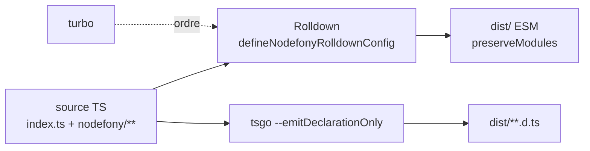

# Build & bundling (packages)

> Chaque package Nodefony se compile en ESM avec **Rolldown**, ses types en `.d.ts` avec **tsgo**, et
> l'ordre entre packages est piloté par **turbo**. À côté, un `Builder` génère le code de scaffolding
> (`nodefony create app|module|entity`) via des templates **Eta**. Ancré sur le code. _(Le build du
> frontend applicatif — Vite/HMR multi-framework — vit dans `@nodefony/frontend`, page séparée.)_

## Schéma général

## Lexique

| Terme           | Sens                                                               |
| --------------- | ------------------------------------------------------------------ |
| Rolldown        | Bundler (compatible Rollup, écrit en Rust) — compile le TS en ESM. |
| tsgo            | Compilateur TypeScript rapide — ici pour les déclarations `.d.ts`. |
| turbo           | Orchestrateur de tâches monorepo (ordonne les builds).             |
| preserveModules | Garder l'arborescence source dans `dist/` (1 fichier → 1 fichier). |
| Scaffolding     | Génération de fichiers de départ (app/module/entity).              |
| Eta             | Moteur de templates (rendu des squelettes).                        |

## Qu'est-ce que le build ici

Un monorepo de 19+ packages qui dépendent les uns des autres doit : compiler chacun en ESM propre,
émettre des types justes, dans le **bon ordre** (le core avant ceux qui l'importent), et sans se
tirer une balle dans le pied (self-import, tree-shaking qui casse `reflect-metadata`). C'est ce que la
config de build centralise.

## La vision Nodefony

La config Rolldown est **partagée** : `defineNodefonyRolldownConfig()` (`src/nodefony/src/bundler/index.ts:116`),
publiée via le subpath `nodefony/bundler` et consommée par les configs des packages + les apps générées.
Les entrées viennent de `nodefonyInput()` : `index.ts` + glob `nodefony/**/*.ts`, en excluant
`.d.ts`/`.test.ts`/`.spec.ts`/`tests/` (`bundler/index.ts:56,92-107`). La sortie est **ESM,
`preserveModules: true`**, `dir: "dist"`, `entryFileNames: "[name].js"` (`:140-148`) — l'arborescence
source est reproduite dans `dist/`. Le `rolldown.config.ts` racine (`:3`) appelle simplement cette
fabrique avec la liste `external` (`@nodefony/*`, `drizzle-orm`, `tslib`). Les **déclarations `.d.ts`
ne sont PAS produites par le bundler** : c'est `tsgo --emitDeclarationOnly` (`bundler/index.ts:22-23`).
L'ordre inter-packages est géré par **turbo** (le core d'abord ; le core importe le bundler en relatif
car il ne peut pas consommer son propre `dist`, `:7-10`).

## Scaffolding — le `Builder`

`Builder` (`src/nodefony/src/command/Builder.ts:52`) étend `Service` : ce n'est **pas** un bundler mais
un générateur de fichiers. Il matérialise des `BuilderObject` (`file`/`directory`/`copy`/`symlink`,
`:27-40`) via `build()` (`:162`), en rendant les squelettes avec **Eta** (`buildSkeleton`, `:114`).
Options Eta (`:45-50`) : `autoEscape: false` (on génère du TS/JSON, pas du HTML — échapper casserait
`<`, `&`, `'`), `useWith: true` (variables nues `<%= name %>`), `cache: false`.

## Pièges (symptôme → cause → correction)

| Symptôme                                             | Cause                                                    | Correction                                                           |
| ---------------------------------------------------- | -------------------------------------------------------- | -------------------------------------------------------------------- |
| `Reflect.defineMetadata is not a function`           | `reflect-metadata` tree-shaké (side-effect global perdu) | Préservé par `nodefonyTreeshake` (`bundler/index.ts:82`)             |
| Chunks `preserveModules` cassés                      | `nodefony` externalisé par préfixe                       | Externalisation en **exact-match** (`nodefonyExternalMatcher` `:68`) |
| Self-import dans le bundle                           | Le package s'importe lui-même                            | Le nom propre est toujours `external` (`:13-19`)                     |
| Scaffolding qui échappe le code généré               | `autoEscape` activé                                      | `autoEscape: false` (Builder.ts:45)                                  |
| `dist` obsolète après changement d'`index.ts` public | Cache turbo agressif                                     | `npm run clean && npm run build` du module                           |

## Tests & couverture

Le build est couvert par **26 cas** sur 2 fichiers (`src/nodefony/src/tests/`) : `bundler` (13, la
config Rolldown partagée — external exact-match, treeshake `reflect-metadata`, `preserveModules`) et
`Builder` (13, le scaffolding Eta). `bundler/index.ts` est à **100 %** de couverture lignes. Photo
régénérée depuis vitest (`npm run coverage`).

## Pour aller plus loin

- Build du frontend applicatif (Vite/HMR) → `src/packages/@nodefony/frontend/docs/`
- CLI (`nodefony build`, `create`) → `src/nodefony/docs/cli.md`
- Cycle de boot → [cycle-boot-kernel](./cycle-boot-kernel.md)
