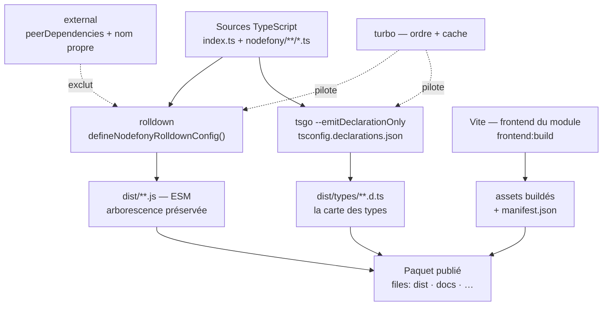
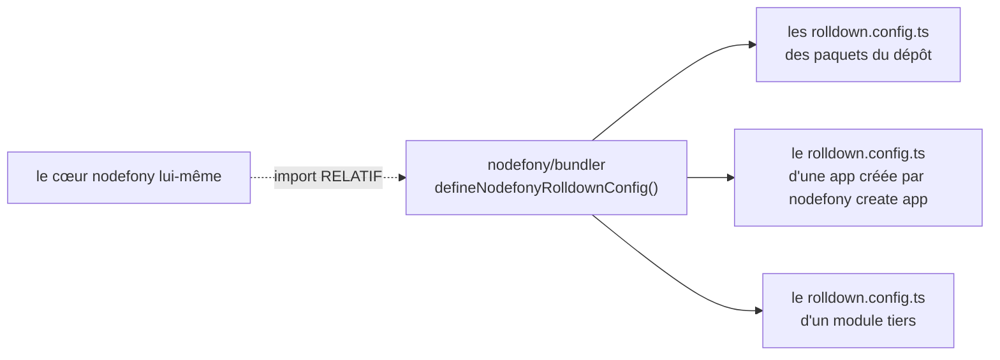
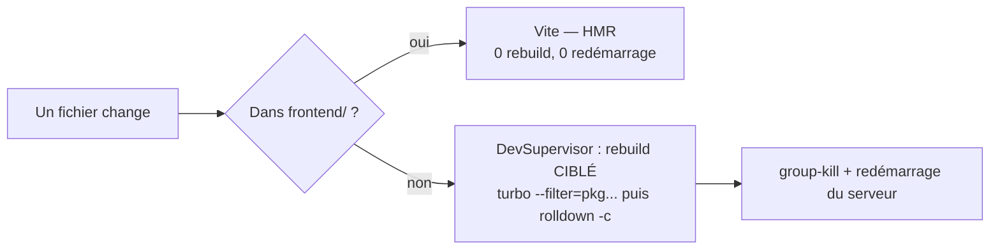

# Build & bundling — de la source au paquet publiable

> Un build Nodefony produit **deux artefacts distincts** : du JavaScript exécutable (`dist/`, par
> **rolldown**) et une carte des types (`dist/types/`, par **tsgo**), fabriqués par deux chaînes
> séparées que **turbo** ordonne et met en cache. Le même socle de configuration sert aux paquets du
> dépôt **et** aux applications générées. Ancré sur `src/nodefony/src/bundler/index.ts`.

📍 [Documentation](../index.md) › **Build & bundling**

## 🧠 Le modèle mental — deux chaînes parallèles, un seul dossier

Un paquet npm moderne doit répondre à deux publics qui ne lisent pas la même chose. **Node** veut du
JavaScript qu'il puisse exécuter ; **TypeScript** veut des déclarations qu'il puisse vérifier. Aucun
outil ne fait bien les deux, donc Nodefony ne demande à aucun outil de faire les deux.



Trois faits structurent tout le reste :

1. **Le bundler ne génère aucun `.d.ts`.** C'est écrit noir sur blanc en tête du socle partagé
   (`bundler/index.ts:22`) : les déclarations sortent de `tsgo`, jamais de rolldown.
2. **La configuration de build est du code publié**, pas un fichier copié de projet en projet :
   `defineNodefonyRolldownConfig()` (`bundler/index.ts:116`) vit dans le paquet `nodefony` et
   s'importe par le subpath `nodefony/bundler`.
3. **Le bundle ne contient que ton code.** Tout ce que le paquet déclare comme dépendance en sort par
   la liste `external`. Un paquet gonflé est presque toujours un `external` oublié.

## 📖 Lexique

| Terme                 | Sens                                                                                                  |
| --------------------- | ----------------------------------------------------------------------------------------------------- |
| **Bundler**           | L'outil qui lit tes sources TypeScript et écrit du JavaScript exécutable.                             |
| **rolldown**          | Le bundler du projet — compatible Rollup, écrit en Rust, même moteur (oxc) que Vite.                  |
| **tsgo**              | Le compilateur TypeScript natif, utilisé **uniquement** pour émettre les déclarations.                |
| **turbo**             | L'orchestrateur du monorepo : il décide de l'ordre des builds et de ce qu'il est inutile de refaire.  |
| **`preserveModules`** | Ne pas tout concaténer : un fichier source → un fichier de sortie, arborescence identique.            |
| **`external`**        | Ce que le bundler **ne recopie pas** dans la sortie : il laisse l'`import` intact, résolu au runtime. |
| **peerDependency**    | Une dépendance que **l'application** fournit, pas le paquet — donc toujours `external`.               |
| **Tree-shaking**      | L'élagage du code jamais utilisé. Utile, sauf sur un module dont l'effet de bord est le but.          |
| **`.d.ts`**           | Un fichier de déclaration : les types sans le code. Ce que lit ton éditeur.                           |
| **`exports`**         | La carte publique d'un paquet dans son `package.json` : quel fichier pour quel usage.                 |
| **Self-import**       | Un paquet qui s'importe par son propre nom — piège classique : le bundler avale sa propre sortie.     |
| **Manifeste Vite**    | Le `manifest.json` écrit au build front : quel fichier hashé correspond à quelle entrée source.       |
| **HMR**               | _Hot Module Replacement_ : Vite remplace un module dans la page sans recharger ni rebuilder.          |
| **TS2307**            | L'erreur TypeScript « Cannot find module » — ici, presque toujours un `dist/types` absent.            |

## Qu'est-ce qu'un build, ici

Écrire du TypeScript ne suffit pas : Node ne sait pas l'exécuter, et un autre paquet ne sait pas
l'importer. Le build transforme un dossier de sources en **objet livrable** — installable par
`npm install`, importable par `import`, vérifiable par l'éditeur.

L'analogie est celle de l'imprimerie. Tes sources sont le manuscrit ; le build en tire **le livre**
(le JavaScript qu'on exécute) et **l'index** (les `.d.ts` qu'on consulte). Deux presses, une seule
source, et l'obligation de rester d'accord.

Un monorepo ajoute sa difficulté propre : dix-neuf paquets qui s'importent mutuellement. Il faut donc
aussi décider **dans quel ordre** imprimer, et surtout **quand ne rien réimprimer** — c'est turbo.

## La vision Nodefony — un socle de build partagé, et publié

La plupart des monorepos copient un `rollup.config.js` dans chaque paquet, puis le laissent diverger.
Nodefony fait l'inverse : **une seule fonction**, dans le cœur, importée partout.



Quatre partis pris, tous lisibles dans le fichier :

- **Le socle est un subpath publié.** Le `package.json` du cœur expose `"./bundler"` — donc une
  application installée depuis npm importe **exactement la même fonction** que le dépôt, jamais un
  fichier interne recopié.
- **Le cœur s'importe lui-même en relatif**, et c'est délibéré : il ne peut pas consommer son propre
  `dist` avant de l'avoir construit (`bundler/index.ts:9`). C'est la seule exception du dépôt.
- **Les invariants sont gravés dans le socle, pas dans une note.** Le nom propre du paquet toujours
  externe, le side-effect de `reflect-metadata` préservé, `nodefony` externalisé en exact-match : les
  trois sont codés puis testés (`bundler/index.ts:12`).
- **Un `rolldown.config.ts` de paquet ne contient plus qu'une liste.** Tout le reste — entrées,
  format, `preserveModules`, tree-shaking — descend du socle.

## 🚀 Démarrage rapide

**Le besoin.** Tu viens de générer une application avec `nodefony create app`. Tu veux comprendre ce
que `npm run build` produit, et pouvoir en faire autant pour un module que tu publieras.

### Le fichier de build d'une application

C'est un fichier de deux lignes utiles, généré pour toi (`templates/app/base/rolldown.config.ts.tpl`) :

```ts
// rolldown.config.ts — à la racine de l'app
import { defineNodefonyRolldownConfig } from "nodefony/bundler";

// `externalDeps` externalise TOUT ce que le package.json déclare (dependencies
// + peerDependencies) : le runtime d'une app vient de node_modules, il n'y a
// rien à recopier dans le bundle. Seul TON code est compilé.
export default defineNodefonyRolldownConfig({ externalDeps: true });
```

### Le fichier de build d'un paquet du framework

Un paquet publié, lui, déclare sa liste **à la main** — c'est un choix éditorial, pas une omission
(voir plus bas la section `external`) :

```ts
// rolldown.config.ts — dans un module publiable
import { defineNodefonyRolldownConfig } from "nodefony/bundler";

// Liste EXPLICITE : chaque entrée est une dépendance que le consommateur
// fournira. Elle doit rester alignée sur les peerDependencies du package.json.
export default defineNodefonyRolldownConfig({
  external: [
    "nodefony",
    "@nodefony/http",
    "@nodefony/framework",
    "zod",
    "tslib",
  ],
});
```

### Les commandes, et ce qu'on observe

```bash
# 1) Build d'une app (rolldown seul — l'app ne publie pas de types).
npm run build
#   → dist/index.js + dist/nodefony/**/*.js, arborescence source préservée

# 2) Build du dépôt entier : turbo ordonne les 19 paquets, puis l'app racine.
npm run build

# 3) Build d'un seul paquet (turbo saute tout ce qui n'a pas bougé).
npm run build --workspace=src/packages/@nodefony/security

# 4) Ignorer le cache turbo et TOUT reconstruire.
npm run build:force        # ou : npx nodefony build --force

# 5) Repartir de zéro (voir « quand faire un clean »).
npm run clean && npm run build
```

Ce que tu trouves ensuite dans un paquet du framework :

```
dist/
├── index.js               ← le point d'entrée (main / exports.import)
├── nodefony/
│   ├── service/…​.js       ← 1 source → 1 fichier, MÊME chemin
│   └── src/…​.js
└── types/
    ├── index.d.ts         ← émis par tsgo, PAS par rolldown
    └── nodefony/…​.d.ts
```

> [!TIP]
> `npx nodefony build` ne construit rien lui-même : la commande délègue à `turbo run build`
> (`BuildCommand.ts:35`), et `--force` ajoute simplement le drapeau turbo (`BuildCommand.ts:36`). Une
> seule source de vérité pour le build, qu'on passe par npm ou par la CLI.

## 🏗️ Ce que produit un build — l'anatomie de `dist/`

### `preserveModules` — un fichier source, un fichier de sortie

Le socle impose `preserveModules: true` (`bundler/index.ts:146`) avec `entryFileNames: "[name].js"`
(`bundler/index.ts:143`) et une racine relative au paquet (`bundler/index.ts:147`). La sortie est
donc le **miroir** des sources, pas un gros fichier concaténé.

Ce n'est pas cosmétique. Trois conséquences directes :

- **Le consommateur peut élaguer.** Un `import { Firewall } from "@nodefony/security"` ne tire que
  les fichiers réellement atteints — un bundle unique aurait tout chargé.
- **Les subpaths deviennent possibles.** `nodefony/bundler`, `nodefony/react`, `nodefony/debugbar`
  n'existent que parce que chaque entrée reste un fichier distinct.
- **Une trace d'erreur reste lisible** : le chemin du `dist` correspond au chemin de la source.

### Les entrées — tout `nodefony/**`, jamais les tests

`nodefonyInput()` (`bundler/index.ts:92`) construit la carte des entrées : `index.ts` plus le glob
`nodefony/**/*.ts`, chaque fichier nommé par son chemin relatif. Le filtre `IGNORED`
(`bundler/index.ts:56`) écarte quatre familles : `.d.ts`, `.test.ts`, `.spec.ts` et tout ce qui vit
sous un dossier `tests/`.

C'est ce qui garantit qu'un paquet publié **ne contient pas ses tests** — ni le code, ni les fixtures
qu'ils traînent.

### Le cas particulier du cœur

Le cœur `nodefony` n'utilise pas la fabrique : son `rolldown.config.ts` déclare **quatre sorties**,
parce qu'il sert quatre publics — le runtime Node (`dist/node/`), l'exécutable CLI (`bin/nodefony`),
le navigateur (`dist/client/`, avec un shim pour `node:util` et `node:events`) et la barre de debug en
fichier unique, incluable par une simple balise de script. C'est l'unique paquet du dépôt dans ce cas.

## 🧰 Les types — une chaîne complètement séparée

Les déclarations sont produites par `tsgo -p tsconfig.declarations.json`, un fichier qui ne fait
qu'une chose : hériter du `tsconfig.json` du paquet et basculer trois options — `declaration: true`,
`emitDeclarationOnly: true`, et une sortie dédiée `declarationDir: "./dist/types"`.

Pourquoi ne pas laisser le bundler s'en charger ? Parce que **seul un vrai compilateur TypeScript sait
calculer un type** : un bundler manipule des modules et des identifiants, il ne résout ni les
génériques, ni l'inférence, ni les types conditionnels. Deux outils, c'est choisir la justesse plutôt
que la commodité.

Deux détails opérationnels, appris à la dure :

- **`declarationDir` doit être explicite.** Sans lui, tsgo écrit ses `.d.ts` dans le vrai `dist`, au
  milieu du JavaScript — le piège est consigné dans le plan de migration du bundler
  ([§10](../audits/rolldown-migration-plan-2026-07.md)).
- **Les tests sont exclus du `tsconfig.declarations.json`**, comme ils le sont des entrées du bundler.
  Les deux chaînes doivent voir le même périmètre, sinon le paquet publie des types pour du code
  absent.

Le cœur, encore une fois, en émet **deux jeux** : `tsconfig.declarations.json` pour le runtime Node,
`tsconfigClient.json` pour le bundle navigateur — d'où les deux entrées `types` de ses `exports`.

## ⚙️ `external` — ce que le bundle ne contient pas

### La règle

Une dépendance est `external` quand elle doit rester **un `import` dans la sortie**, résolu au runtime
depuis `node_modules`. Le bundler laisse la ligne intacte au lieu d'aspirer le paquet.

`defineNodefonyRolldownConfig()` construit cette liste en trois apports (`bundler/index.ts:122`) : le
**nom propre du paquet** (toujours, sans condition), la liste passée en option, et — si
`externalDeps` est vrai (`bundler/index.ts:39`) — toutes les `dependencies` et `peerDependencies`
lues dans le `package.json` courant.

| Type de projet                     | Mode                       | Pourquoi                                                                     |
| ---------------------------------- | -------------------------- | ---------------------------------------------------------------------------- |
| **Application** (`create app`)     | `externalDeps: true`       | Le runtime vient de `node_modules` : rien à recopier.                        |
| **Module d'app** (`create module`) | `externalDeps: true`       | Idem — le paquet est résolu au runtime par le manifeste `modules`.           |
| **Paquet du framework**            | liste `external` explicite | La liste est **auditable** et documente ce que le consommateur doit fournir. |

### Une peerDependency doit TOUJOURS être externalisée

C'est la règle qui coûte le plus cher quand on l'oublie. Une `peerDependency` déclare : « je ne
fournis pas ce paquet, l'application le fournira ». Si le bundler la recopie quand même, deux choses
cassent, dans cet ordre :

1. **Le build lui-même**, quand la dépendance porte du natif. Vécu : `@nodefony/user` absent de la
   liste `external` → rolldown suit la chaîne jusqu'à `@node-rs/bcrypt` (binaire natif) →
   `"hash" is not exported`.
2. **Le runtime**, plus insidieux : le processus se retrouve avec **deux copies** du même paquet, donc
   deux registres globaux distincts. Le symptôme consigné dans le plan de migration est un
   `EntityRegistry: entity "session" already registered` ([§10](../audits/rolldown-migration-plan-2026-07.md)).

> [!WARNING]
> La liste `external` du `rolldown.config.ts` et les `peerDependencies` du `package.json` sont
> maintenues **à deux endroits**. C'est une duplication assumée — donc une dérive garantie à terme.
> Le skill `nodefony-check-externals` compare les deux listes pour tous les paquets et signale les
> manquants comme les entrées périmées. À passer après tout ajout de dépendance.

### Les deux gardes codées dans le socle

- **Le nom propre est toujours externe** (`bundler/index.ts:122`). Un paquet qui s'importe par son
  propre nom ferait avaler son `dist` par le bundler — c'est le piège du self-import.
- **`nodefony` est externalisé en exact-match seulement.** `nodefonyExternalMatcher()`
  (`bundler/index.ts:68`) accepte le préfixe `<nom>/` pour tous les paquets **sauf** `nodefony` : avec
  `preserveModules`, les chunks internes s'appellent `nodefony/service/…`, et un match par préfixe les
  externaliserait à tort. Le test le verrouille (`bundler.test.ts:27`).

### Le tree-shaking et son exception

`nodefonyTreeshake` (`bundler/index.ts:82`) déclare les modules externes sans effet de bord — sauf
**un** : `reflect-metadata`. Sa raison d'être **est** son effet de bord (il patche l'objet global
`Reflect`), donc l'élaguer produit un `Reflect.defineMetadata is not a function` au premier
décorateur. Une seule ligne dans le socle, et le piège ne se rejoue plus jamais.

## 🧩 Les deux patterns d'`exports.types` — le piège n°1

C'est le point qui fait perdre le plus de temps dans ce dépôt. Il tient à une question simple :
**quand un paquet est typechecké, où TypeScript va-t-il chercher les types de ses voisins ?**

### Les deux réponses possibles

| Pattern                     | `exports["."].types` vaut…  | Ce que TypeScript lit     | Dépend d'un build préalable ? |
| --------------------------- | --------------------------- | ------------------------- | :---------------------------: |
| **Source TS** (anti-course) | `"./index.ts"`              | les **sources** du voisin |            **non**            |
| **Généré** (standard)       | `"./dist/types/index.d.ts"` | les `.d.ts` émis par tsgo |            **oui**            |

Le premier pattern est réservé aux paquets **consommés en source par un autre paquet** du dépôt : le
typecheck du consommateur n'a alors besoin d'aucun artefact construit, donc il ne peut ni voir un type
périmé, ni échouer parce qu'un `dist` manque. Le second est le standard npm, pour tout le reste.

### Qui utilise quoi, réellement

| Pattern                       | Paquets                                                                                                                                                 |
| ----------------------------- | ------------------------------------------------------------------------------------------------------------------------------------------------------- |
| **Source TS** (`./index.ts`)  | `@nodefony/http` · `@nodefony/framework` · `@nodefony/security` · `@nodefony/user` · `@nodefony/orm-core` · `@nodefony/frontend` · `@nodefony/realtime` |
| **Généré** (`./dist/types/…`) | `@nodefony/drizzle` · `@nodefony/mongoose` · `@nodefony/redis` · `@nodefony/llm` · `@nodefony/documentation`                                            |
| **Cas à part**                | `nodefony` (cœur) — deux conditions, `browser` et `import`, chacune avec ses types                                                                      |
| **Aucun type public**         | `@nodefony/studio` — une application d'administration, pas une bibliothèque                                                                             |

Les paquets en source forment une **chaîne** qui doit rester continue et se terminer sur le cœur :
`security → user → orm-core → nodefony`. Le cœur est le seul maillon en `dist/types`, et turbo le
construit en premier.

### Ce qui se passe quand on casse un maillon

**Le besoin vécu.** Tu ajoutes un type à `@nodefony/user`, tu bascules son `exports.types` vers
`./dist/types/index.d.ts` « pour faire comme drizzle », et tu relances un typecheck.

| Ce que tu fais                                        | Ce que tu observes                                                            |
| ----------------------------------------------------- | ----------------------------------------------------------------------------- |
| `npm run typecheck` à la racine                       | ✅ vert — turbo a construit les dépendances d'abord (`dependsOn: ["^build"]`) |
| `npm run clean`, puis `tsgo --noEmit` dans `security` | ❌ **TS2307** sur `@nodefony/user` : le `dist/types` visé n'existe pas        |
| tu modifies un type de `user` sans rebuilder          | ❌ `security` typecheck contre l'**ancien** `.d.ts` — vert à tort             |

Le symptôme trompeur est le troisième : rien n'échoue, mais la vérification ne prouve plus rien. C'est
exactement ce que le pattern source supprime.

> [!IMPORTANT]
> Le champ `types` à la racine du `package.json` et `exports["."].types` **coexistent** : le premier
> est un repli pour l'outillage antérieur à TypeScript 4.7, le second est ce que lisent tous les
> outils modernes en `moduleResolution: Bundler`. Quand les deux divergent, c'est `exports` qui gagne
> — donc c'est `exports` qu'il faut regarder pour comprendre un TS2307.

## ⚙️ turbo — décider de ne rien refaire

turbo ne compile rien : il **appelle** le script `build` de chaque paquet, dans le bon ordre, et saute
ceux dont rien n'a changé. Sa configuration tient en trois clés :

| Clé                     | Valeur                                                                | Ce que ça décide                                                   |
| ----------------------- | --------------------------------------------------------------------- | ------------------------------------------------------------------ |
| `dependsOn: ["^build"]` | « d'abord mes dépendances »                                           | L'ordre : le cœur avant ce qui l'importe. Rien à écrire à la main. |
| `inputs`                | `index.ts`, `src/**`, `nodefony/**`, `tsconfig*.json`, `package.json` | Ce qui, en changeant, **invalide** le cache.                       |
| `outputs`               | `dist/**`, `bin/nodefony`                                             | Ce que turbo restaure quand il rejoue un résultat en cache.        |

Le cache est ce qui rend un build de dix-neuf paquets supportable : un `npm run build` après une
modification isolée ne reconstruit que le paquet touché et ses dépendants.

> [!WARNING]
> Le cache turbo est aussi la cause n°1 de « mon `dist` ne correspond pas à mon code ». Deux réflexes :
> après un `git pull`, un merge, ou tout changement de l'`index.ts` **public** d'un paquet, faire
> `npm run clean && npm run build`. Et **une modification du seul `rolldown.config.ts` n'invalide
> aucun cache** — les `inputs` déclarés ne le couvrent pas : passer par `npm run build:force` (ou
> `npx nodefony build --force`) pour la prendre en compte.

Vérification rapide qu'un `dist` est bien à jour :

```bash
grep -E "export\s*\{" src/packages/@nodefony/<module>/dist/index.js | head -1
```

## 🔌 Le mode développement — ne pas rebuilder ce qui peut être remplacé à chaud

En développement, deux régimes cohabitent, et la frontière est nette : **le backend se rebuild, le
frontend se remplace à chaud**.



- **Le rebuild est ciblé, pas global.** `DevSupervisor.#build()` (`DevSupervisor.ts:1133`) reconstruit
  les seuls workspaces touchés et leurs dépendants (`turbo --filter=pkg...`), puis l'app racine
  (`rolldown -c`) si un fichier de la racine a bougé. Un `npm run build` complet coûtait plus de
  quatre-vingts secondes pour un fichier.
- **Le dossier `frontend/` est exclu de la surveillance** (`DevSupervisor.ts:397`) : une modification
  front ne doit surtout pas redémarrer le serveur, sinon on perd le HMR de Vite.
- **Hors monorepo**, le superviseur ne connaît qu'un seul build, celui de l'app — jamais turbo, qui
  n'a pas de workspaces à ordonner.

## 🎨 Le build du frontend — Vite, à côté et non dedans

Le JavaScript du navigateur ne passe **pas** par rolldown : il est bâti par **Vite**, piloté par
`@nodefony/frontend`. Les deux chaînes sont indépendantes et ne partagent que le dossier de sortie.

### En production — `nodefony frontend:build`

`ViteBuilder.buildViteConfig()` (`ViteBuilder.ts:41`) assemble la configuration Vite depuis les
entrées déclarées par les modules. Trois réglages font tout le travail :

- **`manifest: true`** (`ViteBuilder.ts:90`) : Vite écrit un `manifest.json` qui associe chaque entrée
  source à son fichier hashé. C'est lui que le rendu HTML relit — sans lui, aucune balise `<script>`
  ne peut être écrite correctement.
- **`base`** (`ViteBuilder.ts:79`) : en production seulement, préfixé par le `publicPath` (et par
  l'URL du CDN si elle est configurée). C'est ce qui aligne les URLs émises dans le HTML sur ce que
  sert réellement le serveur de fichiers statiques.
- **`rollupOptions.input`** (`ViteBuilder.ts:91`) : une carte d'entrées, donc plusieurs bundles dans
  une seule passe.

La commande (`frontend-build.ts:22`) est faite pour un pipeline d'intégration :

| Comportement                         | Détail                                                                                              |
| ------------------------------------ | --------------------------------------------------------------------------------------------------- |
| **Idempotent**                       | Une entrée dont le manifeste est plus récent que ses sources est ignorée (`FrontendService.ts:560`) |
| **`--force`**                        | Reconstruit tout, sans test de fraîcheur                                                            |
| **Un échec n'arrête pas les autres** | Les erreurs sont collectées dans `failures` (`FrontendService.ts:579`)                              |
| **Code de sortie**                   | Passe à `1` s'il reste un échec (`frontend-build.ts:103`) — la CI casse                             |

### Publier les assets — `assets:publish`

Un déploiement cloud-native veut souvent servir les fichiers statiques depuis un CDN plutôt que depuis
le processus Node. `planAssetPublish()` (`collectAssets.ts:43`) calcule le plan de copie : pour chaque
source — montage statique de module ou bundle front — le dossier cible **miroir du préfixe d'URL**.

La fonction est **pure, sans aucune entrée/sortie disque**, donc testable ; la copie réelle est faite
par la commande `assets:publish` (`assetsPublishCommand.ts:52`). L'envoi vers S3, un CDN ou un rsync
reste à l'orchestrateur : Nodefony assemble l'arbre, le déploiement le pousse.

### Le cas des modules distribués avec une interface

Un module publié sur npm avec son interface d'administration ne peut pas exiger que le consommateur
compile son front. `resolveUiDelivery()` (`prebuiltUi.ts:48`) arbitre trois modes via la molette `ui`
(`prebuiltUi.ts:10`) :

| Mode     | Comportement                                                                          |
| -------- | ------------------------------------------------------------------------------------- |
| `auto`   | Vite si c'est possible (dev + sources présentes + service `frontend`), sinon statique |
| `static` | Force les assets pré-buildés livrés dans le paquet npm                                |
| `vite`   | Force le serveur de développement — n'a de sens que là où les sources existent        |

Quand aucun mode n'est tenable, la résolution renvoie `none` **avec sa raison**, à journaliser telle
quelle : une interface indisponible doit se dire, jamais se deviner. C'est le patron universel des
interfaces d'administration embarquées.

## 📦 Ce que contient un paquet publié

Le champ `files` du `package.json` est la liste blanche de ce qui part sur npm. Tout le reste — les
sources, les tests, les configurations — **reste dans le dépôt**.

| Entrée      | Qui la déclare           | Pourquoi                                                          |
| ----------- | ------------------------ | ----------------------------------------------------------------- |
| `dist`      | tous les paquets publiés | Le JavaScript **et** les `.d.ts` — les deux artefacts du build.   |
| `docs`      | tous les paquets publiés | La documentation du module voyage **avec** lui (voir ci-dessous). |
| `bin`       | `nodefony`               | L'exécutable de la CLI.                                           |
| `templates` | `nodefony`               | Les squelettes de `nodefony create` (app, module, entité).        |
| `public`    | `@nodefony/studio`       | Les assets d'interface pré-buildés, servis en mode `static`.      |

L'entrée **`docs` n'est pas décorative** : c'est ce qui rend la documentation d'un module lisible
depuis une application qui l'a simplement installé. `listModuleDocs()` (`docsReader.ts:178`) lit le
dossier `docs/` **du module tel qu'installé**, et `readDependencies()` (`docsReader.ts:325`) résout
les versions réellement présentes dans `node_modules`. Un module publié sans son `docs/` devient muet
dans la console d'administration.

Enfin, un module n'est jamais chargé par un chemin de fichier mais **par son nom de paquet**, résolu
depuis l'application : `resolveModuleEntry()` (`resolveModuleEntry.ts:29`) construit une URL `file://`
à partir du `package.json` de l'app. C'est ce qui fait fonctionner les topologies non triviales —
`npm link`, pnpm, hoisting — où le paquet `nodefony` n'habite pas le même `node_modules` que les
modules de l'application.

## 🧩 Générer du code plutôt que le compiler — le `Builder`

À côté des deux chaînes de build, un troisième producteur de fichiers : le scaffolding. `Builder`
(`Builder.ts:52`) étend `Service` et n'a rien d'un bundler — il **matérialise des squelettes**.

Il consomme des descriptions `BuilderObject` (`Builder.ts:27`) — un fichier, un dossier, une copie ou
un lien symbolique — et les écrit via `build()` (`Builder.ts:162`), après rendu du squelette par le
moteur de templates Eta (`buildSkeleton()`, `Builder.ts:114`).

Trois options de rendu, et une seule mérite une explication (`Builder.ts:47`) :

- **`autoEscape: false`** — on génère du TypeScript et du JSON, pas du HTML. L'échappement casserait
  `<`, `&` et les apostrophes dans le code produit.
- `useWith: true` — les variables s'écrivent nues dans les squelettes (`<%= name %>`).
- `cache: false` — un squelette n'est rendu qu'une fois par génération.

C'est ce mécanisme qui produit les `rolldown.config.ts` montrés en Démarrage rapide : la
configuration de build d'une application générée **est** un squelette du framework, donc elle suit
automatiquement les évolutions du socle.

## ⚡ Performance & mémoire

Le build est un chemin froid : il ne coûte rien à la requête. Ses choix, eux, ont des conséquences
mesurables **au runtime** :

- **`preserveModules` réduit ce que le consommateur charge.** Un import ciblé n'évalue que les
  fichiers atteints, là où un bundle unique aurait tout évalué au premier `import`.
- **`external` garantit une seule copie de chaque paquet en mémoire.** Deux copies du même paquet dans
  un processus, ce n'est pas seulement de la mémoire perdue : les registres globaux (entités ORM,
  métadonnées de décorateurs) se dédoublent et le boot échoue.
- **Le cache turbo est ce qui rend la boucle de développement tenable** : un rebuild ciblé se compte
  en secondes, un rebuild complet du dépôt en dizaines de secondes.

## ⚠️ Pièges (symptôme → cause → correction)

| Symptôme                                                  | Cause                                                              | Correction                                                                           |
| --------------------------------------------------------- | ------------------------------------------------------------------ | ------------------------------------------------------------------------------------ |
| Le bundle explose après un `npm install`                  | Une nouvelle dépendance n'est pas dans `external`                  | L'ajouter à la liste ; auditer avec le skill `nodefony-check-externals`              |
| Build KO : `"hash" is not exported` (ou binaire natif)    | Une peerDependency est bundlée, le bundler a suivi jusqu'au natif  | Externaliser la peerDependency                                                       |
| `Reflect.defineMetadata is not a function`                | Le side-effect de `reflect-metadata` a été élagué                  | Déjà couvert par `nodefonyTreeshake` (`bundler/index.ts:82`) — ne pas le contourner  |
| `EntityRegistry: entity "…" already registered`           | Deux copies du même paquet dans le processus                       | Vérifier qu'il est bien `external` partout                                           |
| Chunks cassés / `dist` incohérent avec `preserveModules`  | `nodefony` externalisé par préfixe au lieu d'exact-match           | Passer par `nodefonyExternalMatcher()` (`bundler/index.ts:68`)                       |
| Le paquet publié contient ses tests                       | Le glob d'entrées ne les exclut pas                                | Utiliser la fabrique : `IGNORED` les écarte (`bundler/index.ts:56`)                  |
| **TS2307** sur un paquet du dépôt qu'on vient de modifier | Son `exports.types` pointe un `dist/types` absent ou périmé        | Le remettre en source (`./index.ts`) s'il est consommé en source                     |
| Typecheck vert alors que le type a changé                 | Le consommateur lit un `.d.ts` périmé                              | Même correction — ou rebuilder la dépendance avant                                   |
| `does not provide an export named 'X'` au démarrage       | `dist` périmé après un pull / merge                                | `npm run clean && npm run build`                                                     |
| Une modification du `rolldown.config.ts` reste sans effet | Il n'est pas dans les `inputs` de turbo → cache non invalidé       | `npm run build:force` (ou `npx nodefony build --force`)                              |
| Les `.d.ts` atterrissent au milieu du JavaScript          | `declarationDir` absent du `tsconfig.declarations.json`            | Le déclarer explicitement (`./dist/types`)                                           |
| `frontend:build` ne reconstruit rien                      | Comportement normal : le manifeste est plus récent que les sources | `--force` (`frontend-build.ts:103` casse l'exit code en cas d'échec réel)            |
| La documentation d'un module installé n'apparaît pas      | `docs` absent du champ `files` du paquet                           | L'ajouter — `listModuleDocs()` lit `docs/` dans `node_modules` (`docsReader.ts:178`) |
| Modification front qui redémarre le serveur               | Le fichier vit hors du dossier surveillé comme frontend            | Le placer sous `frontend/` (exclu, `DevSupervisor.ts:397`)                           |

## 🧪 Tests & couverture

Le build est couvert par deux familles — les compteurs exacts vivent dans la carte de l'aperçu,
régénérée depuis vitest, jamais figés ici :

- **Unitaires** — `bundler.test.ts` verrouille le socle partagé : externalisation en exact-match pour
  `nodefony`, préfixe `<nom>/` pour les paquets scopés, side-effect de `reflect-metadata` préservé,
  forme des entrées et de la sortie `preserveModules`. Côté frontend, `ViteBuilder.test.ts` et
  `ViteConfigGenerator.test.ts` couvrent la configuration Vite produite, `isolationGroups.test.ts` le
  découpage multi-bundle. Côté publication, `collectAssets.test.ts` (le plan de copie, fonction pure)
  et `prebuiltUi.test.ts` (l'arbitrage des trois modes de livraison d'interface).
- **Intégration** — `frontend-build.test.ts` exerce le build front réel, y compris l'idempotence et
  la collecte des échecs ; `ViteProcessSupervisor.test.ts` couvre le cycle de vie du processus Vite.

Ce qui **n'est pas couvert**, et mérite d'être su :

- **Le scaffolding** (`Builder.test.ts`, `create.test.ts`) est testé, mais ces suites ne sont pas
  rattachées à l'inventaire de ce sujet.
- **Le mode `watch` / développement** du bundler reste le seul angle du build sans couverture
  automatisée — il est validé manuellement ([§7 du plan de migration](../audits/rolldown-migration-plan-2026-07.md)).
- **Aucun test de charge** n'a de sens ici : le build est un chemin froid, absent de tout profil de
  requête.

Couverture : `npm run coverage` dans `src/nodefony`.

## 🔗 Pour aller plus loin

- ⬆️ **Retour** : [Toute la documentation](../index.md)
- 🧭 **Pages sœurs** : [Configuration](configuration.md) · [Cycle de boot du Kernel](cycle-boot-kernel.md) · [Vue d'ensemble](vue-ensemble.md)

- Le builder frontend en détail (presets, superviseur Vite, HMR) →
  [`@nodefony/frontend`](../../src/packages/@nodefony/frontend/docs/index.md)
- Les commandes du CLI, dont `build` et `create` → [CLI du cœur](../../src/nodefony/docs/kernel.md)
- Comment un module déclaré dans le manifeste est chargé → [Configuration](configuration.md)
- Les décisions et pièges de la migration du bundler →
  [plan de migration rolldown](../audits/rolldown-migration-plan-2026-07.md)
- Déployer le résultat (image, assets, CDN) → [guide Docker & cloud-native](../guides/docker-cloud-native.md)
