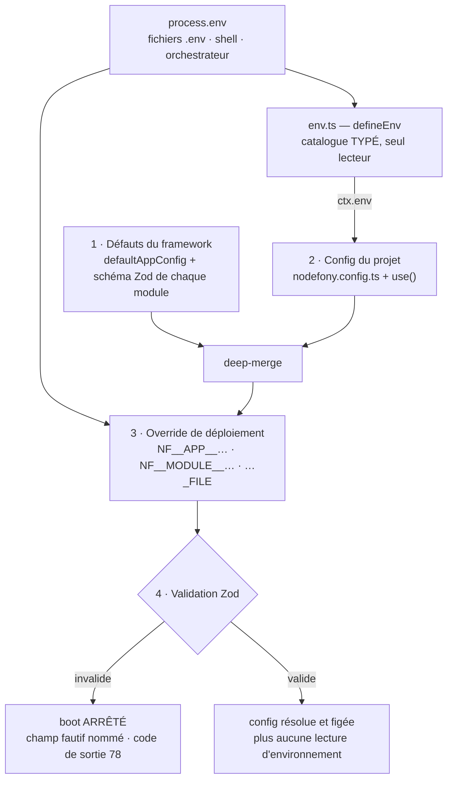
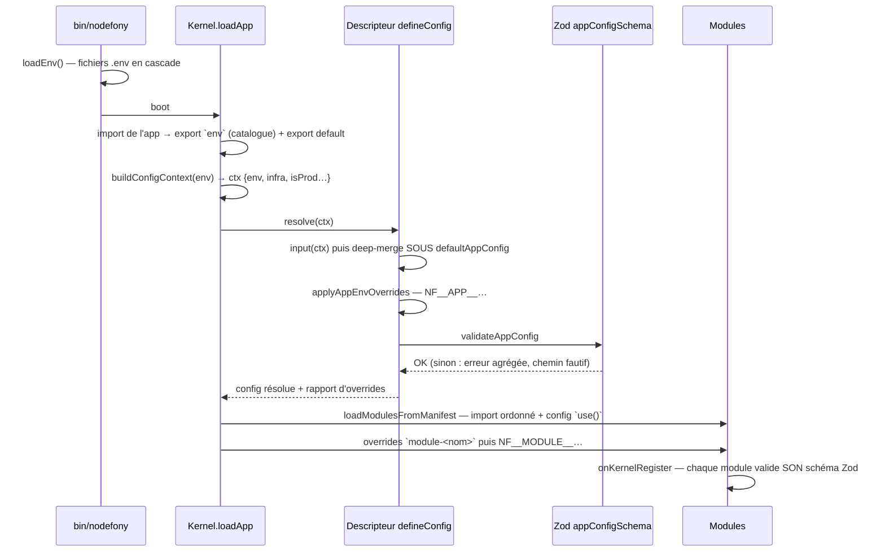

# Configuration — d'où vient chaque valeur, et qui la valide

> Une application Nodefony n'écrit **que ses écarts**. Tout le reste descend des défauts du framework,
> se superpose dans un ordre unique (défauts → projet → environnement), et passe une **validation Zod
> au boot** : une config fautive arrête le démarrage en nommant le champ, elle ne produit jamais un
> `undefined` qui explose trois heures plus tard. Cette page décrit le **modèle** ; le pas-à-pas est
> dans le [guide de configuration](../guides/configuration.md). Ancré sur `src/nodefony/src/config/`.

📍 [Documentation](../index.md) › **Configuration**

## 🧠 Le modèle mental — quatre couches, une config figée

Une configuration, c'est un empilement de décisions prises par des gens différents : le framework
décide des défauts, tu décides des écarts de ton projet, ton devops décide du déploiement. Le rôle du
moteur est de les empiler **dans un ordre connu**, une fois, et de figer le résultat.



Le fait structurant tient en une ligne : **un seul endroit lit `process.env`** — le catalogue
`defineEnv()` (`defineEnv.ts:270`). Partout ailleurs, la configuration est un objet typé, résolu au
boot. Cela supprime d'un coup toute une famille de pannes : le `process.env.X` lu au fond d'un
service, jamais validé, absent en production.

## 📖 Lexique

| Terme                | Sens                                                                                                         |
| -------------------- | ------------------------------------------------------------------------------------------------------------ |
| **`defineConfig`**   | Le builder de la config d'application. Accepte un objet, ou une fonction `(ctx) => objet`.                   |
| **Descripteur**      | Ce que `defineConfig` retourne : un objet opaque que le Kernel **résout** au boot, pas la config elle-même.  |
| **`ctx`**            | Le contexte passé à la forme fonction : `env`, `infra`, `appEnv`, `runtimeEnv`, `isProd`, `isDev`, `isTest`. |
| **`defineEnv`**      | Le catalogue de variables d'environnement typées — **seul** lecteur de `process.env`.                        |
| **`use()`**          | Déclare un module dans le manifeste `modules`, avec sa config colocalisée et typée.                          |
| **Deep-merge**       | Fusion récursive : les objets se complètent clé par clé, les tableaux se remplacent.                         |
| **Zod**              | La bibliothèque de schémas qui valide **et** type la config. Une source, pas deux.                           |
| **Override env**     | Surcharge d'un champ par une variable `NF__…`, sans toucher au code (métier du devops).                      |
| **`*_FILE`**         | Convention de secret monté : `NF_X_FILE=/run/secrets/x` fait lire le **contenu du fichier**.                 |
| **Infra déclarée**   | Les URLs de base/cache lues de l'environnement, qui pilotent les stores en `"auto"`.                         |
| **Provenance**       | L'origine d'une valeur résolue : défaut, projet, ou environnement. Affichée par Studio.                      |
| **`runtimeMutable`** | Métadonnée de champ : sa valeur est relue à l'usage, donc modifiable sans redémarrer.                        |
| **12-factor**        | La discipline « la config vit dans l'environnement, le code est identique partout ».                         |

## Qu'est-ce qu'on appelle « la configuration »

Prends une console de mixage. Chaque potentiomètre a une position d'usine ; le studio en règle
quelques-uns pour son local ; l'ingénieur du son en bouge deux pour la salle du soir. Personne ne
reconstruit la console entre deux concerts. C'est exactement le problème : **la même image de code
doit tourner en local, en test et en production**, avec d'autres ports, URLs et secrets.

Trois pièges classiques guettent, et Nodefony répond aux trois par le même mécanisme :

1. **Les défauts éparpillés** — chaque app duplique les valeurs « en dur », donc une correction du
   framework ne l'atteint jamais. → défauts **centralisés** dans le framework.
2. **La config non validée** — un port écrit `"8080"` au lieu de `8080` casse au premier `listen()`,
   loin de la cause. → un schéma qui **valide au boot**.
3. **Les secrets dans le code** — une clé committée est une clé compromise, et l'historique Git ne
   s'oublie pas. → un environnement qui **surcharge sans toucher au code**.

## La vision Nodefony — deux fichiers, un seul lecteur de l'environnement

La config d'une application tient dans **deux fichiers à la racine**, et rien d'autre. Pas de dossier
`config/` à découper, pas de `config.prod.ts` parallèle.

| Fichier              | Rôle                                                                               |
| -------------------- | ---------------------------------------------------------------------------------- |
| `nodefony.config.ts` | Les **écarts** du projet : `defineConfig((ctx) => …)` + le manifeste `modules`.    |
| `env.ts`             | Le **catalogue** des variables d'environnement (`defineEnv`) — seul `process.env`. |

Quatre partis pris, tous vérifiables dans le code :

- **`defineConfig()` ne retourne pas une config, mais un descripteur** (`defineConfig.ts:178`) : une
  marque privée (`CONFIG_DESCRIPTOR`, `defineConfig.ts:112`) et une seule méthode, `resolve(ctx)`,
  appelée par le Kernel au boot (`Kernel.resolveAppOptions()`, `Kernel.ts:1451`). Ta config
  **connaît donc son environnement** au moment où elle est calculée.
- **Le par-environnement passe par `ctx`, jamais par un fichier parallèle** (`ConfigContext`,
  `types.ts:339`). Un `config.prod.ts` séparé diverge silencieusement ; une expression ternaire, non.
- **Les défauts sont dans le framework, pas dans ton projet.** `defaultAppConfig` (`defaults.ts:34`)
  est deep-mergé **sous** ta config (`mergeAndValidate()`, `defineConfig.ts:147`) — une amélioration
  du framework te parvient sans que tu ne réécrives rien.
- **Le boot est fail-closed.** `validateAppConfig()` (`schema.ts:322`) agrège les erreurs Zod avec le
  chemin fautif ; l'échec devient un diagnostic présenté puis une sortie dédiée
  (`Kernel.bootConfigError()`, `Kernel.ts:1505`).

> [!IMPORTANT]
> Un fichier de config ne doit **jamais** déréférencer le kernel au moment de son import
> (`Nodefony.getKernel().path` au top-level). Le kernel n'existe pas encore quand le module est
> évalué : l'app crashe à l'import, et devient intestable sans serveur. Le Kernel le dit d'ailleurs
> explicitement dans son diagnostic d'erreur d'entrée (`Kernel.ts:1558`). La parade est un **getter**
> (résolu à la lecture, au boot) ou `ctx`, qui rend le déréférencement inutile.

## 🚀 Démarrage rapide

**Le besoin.** Tu viens de générer une app avec `nodefony create app`. Elle doit écouter sur le port
imposé par la plateforme en production, garder des logs bavards en développement, et charger l'ORM
uniquement si une base est déclarée. Le tout **sans** deux fichiers de config.

### Les deux fichiers racine

```ts
// ─────────────────────────── env.ts ───────────────────────────
// Catalogue TYPÉ et validé au boot. C'est le seul lecteur de process.env.
import {
  defineConfig,
  defineEnv,
  envEnum,
  envNumber,
  envString,
  use,
} from "nodefony";

export const env = defineEnv({
  // `optional: true` sans défaut → `number | undefined` : absente, le défaut
  // du framework (5151) s'applique. Une valeur non numérique fait échouer le boot.
  NF_PORT: envNumber({
    optional: true,
    description: "Port d'écoute HTTP (défaut framework 5151).",
  }),
  // Ensemble fermé : une faute de frappe (`stout`) est refusée AU BOOT,
  // pas silencieusement ignorée. `as const` est OBLIGATOIRE (voir Pièges).
  NF_LOG_DRIVER: envEnum(["stdout", "file", "null"] as const, {
    default: "stdout",
  }),
  // Infra déclarée : sa présence suffit à aiguiller les stores et à charger l'ORM.
  NF_DATABASE_URL: envString({
    optional: true,
    description: "URL unique de la base (sqlite: | postgres:// | mysql://).",
  }),
});

// ─────────────────── nodefony.config.ts ───────────────────
// Fichier SÉPARÉ dans une vraie app : il ouvre par
//   import { defineConfig, use } from "nodefony";
//   import type { env } from "./env";
// Le générique `<typeof env>` est ce qui type `ctx.env` clé par clé.
export default defineConfig<typeof env>((ctx) => ({
  // Par-environnement : une expression, pas un second fichier. Un conteneur
  // doit écouter toutes les interfaces — un bind 127.0.0.1 n'est jamais joignable.
  domain: ctx.isProd ? "0.0.0.0" : "127.0.0.1",
  // On n'écrit le port QUE si l'environnement l'impose : sinon le défaut gagne.
  servers: ctx.env.NF_PORT ? { http: { port: ctx.env.NF_PORT } } : {},
  log: { debug: ctx.isProd ? [] : "*", driver: ctx.env.NF_LOG_DRIVER },
  // Manifeste ORDONNÉ : l'ordre du tableau EST l'ordre de chargement.
  modules: [
    use("@nodefony/http", {}),
    "@nodefony/framework",
    // Chargé seulement si une base est déclarée — un module non listé
    // n'est même pas importé (0 coût, pas seulement 0 usage).
    use("@nodefony/drizzle", {}, { when: () => !!ctx.infra.database }),
  ],
}));
```

### Ce qu'on observe

```bash
# 1) Sans rien déclarer : les défauts du framework s'appliquent.
npx nodefony development
#   → écoute sur 127.0.0.1:5151, logs debug complets, drizzle NON chargé

# 2) Une variable du catalogue change le comportement, sans toucher au code.
NF_DATABASE_URL='postgres://user:pwd@db:5432/app' npx nodefony development
#   → drizzle chargé (`when` satisfait), stores "auto" aiguillés vers postgres

# 3) Une valeur HORS de l'énumération arrête le boot en la nommant.
NF_LOG_DRIVER=stout npx nodefony development
#   [nodefony] Variables d'environnement invalides : NF_LOG_DRIVER: Invalid option…

# 4) Le devops surcharge n'importe quel champ ayant un défaut, sans catalogue.
NF__APP__SERVERS__HTTP__PORT=8080 NF__APP__LOG__DRIVER=file npx nodefony production
```

Trois recettes pour faire grandir ce fichier (ajouter un module, extraire un bloc devenu gros,
conditionner une entrée) sont détaillées dans le [guide](../guides/configuration.md).

## ⚙️ L'ordre de superposition — et ses trois gardes

L'échelle est unique et vaut pour l'app comme pour les modules : **le plus bas perd, le plus haut
gagne**.

| #   | Couche               | Qui décide | Où ça se joue                                                                          |
| --- | -------------------- | ---------- | -------------------------------------------------------------------------------------- |
| 1   | Défauts du framework | Nodefony   | `defaultAppConfig` (`defaults.ts:34`) · le `.default()` du schéma Zod de chaque module |
| 2   | Config du projet     | toi        | `nodefony.config.ts` — deep-merge `extend(true, {}, …)` (`defineConfig.ts:148`)        |
| 3   | Déploiement          | le devops  | `NF__APP__…` (`defineConfig.ts:157`) · `NF__<MODULE>__…` (`Kernel.ts:1257`) · `*_FILE` |
| 4   | Invocation           | la CLI     | drapeaux de commande (`--workers`, …)                                                  |

L'override d'environnement est appliqué **entre le merge et la validation** : la valeur venue du
déploiement est donc validée par le même schéma que le reste. Un devops ne peut pas injecter une
valeur que ton code n'aurait pas acceptée — c'est le sens de « fail-closed ».

Trois gardes évitent les heures de débogage les plus classiques :

- **Un override n'écrit que sur un chemin DÉJÀ présent.** `applyResolvedPath()`
  (`envOverride.ts:126`) résout chaque segment contre les clés **réelles** (insensible à la casse,
  `resolveKey()`, `envOverride.ts:106`) et renvoie `false` si le chemin n'existe pas. Aucune clé
  fantôme n'est créée. À la place, un avertissement « vouliez-vous dire… » façon Git, calculé par
  distance d'édition (`closestMatch()`, `envOverride.ts:191`), monté en message par
  `resolveFailureHint()` (`envOverride.ts:266`).
- **La coercion est explicite.** `coerceEnvValue()` (`envOverride.ts:47`) traite `"true"`/`"false"`,
  les nombres, le JSON (`[…]`, `{…}`) et le CSV. Le piège `z.coerce.boolean("false") === true` est
  ainsi évité, et une chaîne vide compte comme **absente** (`isAbsent()`, `defineEnv.ts:133`).
- **Le schéma de l'app n'est pas strict.** Les clés inconnues (`module-<x>`, `App`, `cluster`) sont
  **ignorées, pas rejetées** (`schema.ts:11`) : chaque module valide **son** bloc avec **son** schéma.
  Une seule autorité par périmètre.

> [!WARNING]
> Un champ **opt-in sans défaut framework** (`domainCheck`, `domainAlias`) n'est pas surchargeable
> par `NF__APP__*` tant que ton `nodefony.config.ts` ne le déclare pas : le chemin n'existe pas dans
> l'objet fusionné, donc l'override est refusé et signalé. Ce n'est pas un bug, c'est la garde n°1
> qui fait son travail — déclare la clé (même à sa valeur neutre) pour la rendre adressable.

## 🧰 Le catalogue d'environnement — `defineEnv` et ses helpers

`defineEnv()` (`defineEnv.ts:270`) lit la source **une fois**, valide tout en bloc, et renvoie un
objet **gelé** (`Object.freeze`, `defineEnv.ts:302`). Une variable absente prend son défaut ; une
variable présente mais invalide **arrête le boot en la nommant** (`defineEnv.ts:283`).

Il déclare aussi ses propres métadonnées (`getEnvCatalog()`, `defineEnv.ts:88`), ce qui permet de
**générer** `.env.example` depuis le catalogue (`renderEnvExample()`, `envExample.ts:57`) au lieu de
le maintenir à la main — un fichier d'exemple qui ment est pire que pas d'exemple.

| Helper         | Type produit                        | Absente ⇒                | Refusé au boot                              |
| -------------- | ----------------------------------- | ------------------------ | ------------------------------------------- |
| `envString()`  | `string` (ou `string \| undefined`) | défaut, sinon **erreur** | rien (toute chaîne passe)                   |
| `envNumber()`  | `number`                            | défaut, sinon **erreur** | valeur non numérique                        |
| `envBoolean()` | `boolean`                           | défaut (`false`)         | tout ce qui n'est ni vrai ni faux 12-factor |
| `envEnum()`    | l'union littérale exacte            | défaut, sinon **erreur** | toute valeur hors de la liste               |

### `envString()` — la chaîne, requise ou non

Trois régimes selon les options (`defineEnv.ts:168`) : avec `default` la variable est toujours
présente ; avec `optional: true` le type devient `string | undefined` ; sans ni l'un ni l'autre elle
est **requise**, et son absence arrête le boot. C'est le helper des URLs et des secrets.

### `envNumber()` — le nombre, coercé puis vérifié

`envNumber()` (`defineEnv.ts:188`) convertit puis laisse Zod trancher : une valeur non numérique est
transmise **brute** au schéma, qui la rejette avec le nom de la variable. Un port mal orthographié ne
devient jamais `NaN` silencieusement.

### `envBoolean()` — les ensembles 12-factor

`envBoolean()` (`defineEnv.ts:214`) accepte `1/true/yes/on` et `0/false/no/off`, insensible à la
casse (`TRUTHY`/`FALSY`, `defineEnv.ts:129`). Tout le reste est une **erreur** : `tru` est une faute
de frappe, pas un « faux » implicite. Ce helper a toujours une valeur (défaut `false`).

### `envEnum()` — l'ensemble fermé, littéral préservé

`envEnum()` (`defineEnv.ts:243`) est le seul qui rende le type **exact** (`"stdout" | "file" |
"null"`), ce qui permet de le brancher directement sur un champ de config qui attend cette union.
C'est le helper des molettes : driver de log, mode, dialecte.

> [!TIP]
> Le `as const` sur la liste de valeurs n'est pas cosmétique : sans lui, TypeScript élargit l'union
> en `string`, et le champ ciblé (`log.driver`) refuse la valeur. C'est l'erreur de typage la plus
> fréquente sur `env.ts`.

### Les secrets — la convention `*_FILE`

`resolveFileEnv()` (`defineEnv.ts:107`) implémente la convention des secrets montés : si `NF_X` est
absente mais que `NF_X_FILE` pointe un fichier (secret Docker, `Secret` Kubernetes, Vault), c'est le
**contenu du fichier** qui est lu, retour à la ligne final retiré. Deux règles fermes :

- déclarer `NF_X` **et** `NF_X_FILE` en même temps est une **ambiguïté** → `resolveFileEnv()` lève
  une erreur explicite (`defineEnv.ts:115`) ;
- un fichier illisible est une erreur de boot, jamais un repli silencieux (`defineEnv.ts:122`).

Côté journal, les chemins qui ressemblent à un secret sont détectés (`pathLooksSecret()`,
`envOverride.ts:149`) et leur valeur est **rédigée** par `Kernel.surfaceAppEnvOverrides()`
(`Kernel.ts:1481`).

Les fichiers `.env` eux-mêmes sont chargés **avant** le boot par `loadEnv()` (`loadEnv.ts:59`), en
cascade : les variantes `*.local` (gitignorées) priment sur les fichiers committés, et **rien**
n'écrase une variable déjà posée dans `process.env` par le shell ou l'orchestrateur
(`loadEnv.ts:86`).

## 🧩 Déclarer un module — `use()`, le manifeste et son typage

Le tableau `modules` **est** la liste des modules chargés, dans l'ordre. Trois formes coexistent :

| Forme                                 | Signification                                          |
| ------------------------------------- | ------------------------------------------------------ |
| `"@nodefony/http"`                    | chaîne nue — équivaut à `{ name, policy: "optional" }` |
| `{ name, policy, when }`              | entrée détaillée, sans config                          |
| `use(name, config, { policy, when })` | entrée **+ config colocalisée et typée**               |

`use()` (`use.ts:88`) ne fait rien de magique : il construit l'entrée `{ name, config?, policy?,
when? }`. Toute son intelligence est dans le **type**. Le générique capture le nom au point d'appel
et contraint la config à `ConfigOf<N>` (`use.ts:61`), résolue via un registre **augmentable**,
`NodefonyModuleConfig` (`use.ts:52`).

### Pourquoi un registre plutôt qu'un type central

Un type central obligerait le cœur à connaître tous les modules — y compris ceux qui n'existent pas
encore. Le registre inverse la dépendance : chaque module **s'ajoute lui-même** par fusion de
déclarations (le patron de Nuxt et Pinia), donc un module tiers en bénéficie autant qu'un module du
dépôt.

```ts ignore
// dans @nodefony/drizzle/index.ts — l'augmentation tient en 5 lignes
declare module "nodefony" {
  interface NodefonyModuleConfig {
    "@nodefony/drizzle": IDrizzleConfigInput;
  }
}
```

Vérifié au source : `drizzle/index.ts:29`, `security/index.ts:27`, `http/index.ts:46`. Sans
augmentation, `use()` accepte quand même la config (`Record<string, unknown>`) — jamais bloquant,
simplement sans auto-complétion.

### Le filtrage — `policy` et `when`

`UseOptions` (`use.ts:67`) porte deux leviers qui **filtrent** sans jamais réordonner
(`Kernel.resolveModuleEntries()`, `Kernel.ts:1091`) :

- **`policy: "dev"`** → l'entrée est retirée quand le runtime est `production` (`Kernel.ts:1114`) ;
- **`when(config)`** → une garde évaluée sur la config résolue ; `false` retire l'entrée
  (`Kernel.ts:1118`).

Un module retiré n'est pas « chargé puis désactivé » : il n'est **jamais importé**. En ESM, un module
non importé n'existe pas — le gain est réel, en mémoire comme en temps de boot. Les entrées écartées
sont tout de même journalisées avec leur raison (`Kernel.recordModuleGated()`, `Kernel.ts:1138`), pour
qu'un module absent reste explicable.

## ⚙️ Mises en situation — varier sans dupliquer

Quatre besoins réels, la configuration qui y répond, et le comportement observable.

### Situation 1 — « je veux une valeur différente en production »

Ton serveur doit écouter `127.0.0.1` en local (rien ne fuit hors de ta machine) et `0.0.0.0` en
conteneur (sinon le mappage de ports ne l'atteint jamais).

```ts ignore
export default defineConfig((ctx) => ({
  domain: ctx.isProd ? "0.0.0.0" : "127.0.0.1",
  log: { debug: ctx.isProd ? [] : "*" },
}));
```

| `NODE_ENV` vaut… | `ctx.runtimeEnv` | `domain` résolu | logs debug |
| ---------------- | ---------------- | --------------- | ---------- |
| `development`    | `development`    | `127.0.0.1`     | tous       |
| `dev`            | `development`    | `127.0.0.1`     | tous       |
| `test`           | `test`           | `127.0.0.1`     | tous       |
| `production`     | `production`     | `0.0.0.0`       | aucun      |
| (absent)         | `production`     | `0.0.0.0`       | aucun      |

Deux détails qui comptent : `dev` est normalisé en `development` (`Kernel.ts:1363`), et **l'absence**
de `NODE_ENV` est traitée comme `production` — le défaut est le régime le plus prudent, jamais le plus
bavard.

> [!TIP]
> `ctx` porte **deux** axes distincts. `runtimeEnv` est le mode moteur (`NODE_ENV`) ; `appEnv` est un
> axe de déploiement libre (`APP_ENV`/`NF_ENV`, `Kernel.ts:1364`). Un pré-production tourne
> « comme la production » (`isProd` vrai) tout en se distinguant par `ctx.appEnv === "staging"`.
> C'est ce qui évite le faux dilemme « soit c'est prod, soit ça ne l'est pas ».

### Situation 2 — « je dois injecter un secret sans le committer »

Une clé de signature de webhooks ne doit exister ni dans Git, ni dans l'image Docker. Elle est montée
par l'orchestrateur en tant que **fichier**.

```ts ignore
// env.ts — on déclare la variable, jamais la valeur
export const env = defineEnv({
  NF_WEBHOOK_KEY: envString({
    optional: true,
    description: "Clé de chiffrement des secrets de signature webhook.",
  }),
});
```

| Le déploiement fournit…                         | Ce que vaut `env.NF_WEBHOOK_KEY`              |
| ----------------------------------------------- | --------------------------------------------- |
| `NF_WEBHOOK_KEY=abc…`                           | `"abc…"` (variable directe)                   |
| `NF_WEBHOOK_KEY_FILE=/run/secrets/webhook`      | le **contenu** du fichier, sans le saut final |
| les **deux**                                    | **erreur de boot** — ambiguïté refusée        |
| `NF_WEBHOOK_KEY_FILE` vers un fichier illisible | **erreur de boot** nommant le chemin          |
| rien                                            | `undefined` — à la brique de décider          |

En local, la même variable vit dans `.env.local`, qui est gitignoré et prime sur les fichiers
committés (`loadEnv.ts:67`). Un seul mécanisme, deux contextes.

### Situation 3 — « le devops doit changer un réglage sans redéployer le code »

Ton équipe d'exploitation veut basculer le driver de log en fichier et ouvrir un port différent,
sur une image déjà construite. Aucune ligne de TypeScript ne doit bouger.

```bash
NF__APP__LOG__DRIVER=file            # config APP — segment réservé `app`
NF__APP__SERVERS__HTTP__PORT=8080    # `__` = un niveau de profondeur
NF__HTTP__SESSION__STORE=redis       # config d'un MODULE : `NF__<MODULE>__<CHEMIN>`
NF__SECURITY__CORS__ORIGINS=https://a.com,https://b.com   # CSV → tableau
```

| Ce que le devops écrit              | Effet                                                                           |
| ----------------------------------- | ------------------------------------------------------------------------------- |
| un chemin existant, valeur valide   | appliqué, puis **validé par le même Zod** — et journalisé (`Kernel.ts:1480`)    |
| un chemin existant, valeur invalide | **boot rejeté** avec le chemin fautif — jamais de surcharge silencieuse         |
| un segment mal orthographié         | ignoré + « vouliez-vous dire… » + liste des clés réelles (`envOverride.ts:275`) |
| un chemin sans défaut framework     | ignoré + suggestion : déclare la clé dans `nodefony.config.ts` d'abord          |
| un chemin marqué secret             | appliqué, valeur **rédigée** au log (`envOverride.ts:149`)                      |

Le séparateur `__` vient de .NET et Docker : il ne peut pas être confondu avec le `camelCase` d'un nom
de clé. Les segments sont **insensibles à la casse** et résolus contre les clés réelles, donc
`ACCESSTTLS` retrouve `accessTtlS`.

### Situation 4 — le contre-exemple piégeux : « ma config plante à l'import »

Le symptôme est déroutant : l'app ne démarre pas, la trace pointe l'entrée du programme, et le
message parle d'une propriété lue sur `null`. La cause est presque toujours la même.

```ts ignore
// ❌ INTERDIT — déréférence à l'ÉVALUATION du module : le kernel n'existe pas encore
export default {
  connectors: {
    db: { filename: path.resolve(Nodefony.getKernel().path, "app.db") },
  },
};

// ✅ Getter — résolu à la LECTURE (au boot, kernel présent). Runtime identique.
export default {
  connectors: {
    db: {
      get filename() {
        return path.resolve(Nodefony.getKernel().path, "app.db");
      },
    },
  },
};
```

Le Kernel le suggère lui-même dans le diagnostic d'échec d'import de l'app : « un fichier de config
déréférence le kernel au top-level → différer en getter/lazy » (`Kernel.ts:1558`). Le coût caché du
premier code n'est pas seulement le crash : le module devient **non importable sans serveur**, donc
non testable. Avec la forme fonction `(ctx) => …`, le problème disparaît — `ctx` porte déjà ce qu'il
faut.

## 🧩 Exposer la config de SON module — la convention deux fichiers

Un module qui se configure porte **exactement deux fichiers**, aux mêmes noms partout. Le module de
référence est `@nodefony/drizzle`.

| Fichier                                 | Rôle           | Contenu                                                                        |
| --------------------------------------- | -------------- | ------------------------------------------------------------------------------ |
| `nodefony/config/config.ts`             | **le QUOI**    | le schéma Zod commenté : source **unique** des types, défauts et documentation |
| `nodefony/config/defineModuleConfig.ts` | **le COMMENT** | un builder pur : analyse l'entrée, superpose l'environnement, gèle             |

Le schéma est la seule source de vérité : le type (`z.infer`), la validation, le **défaut**
(`.default()`), la documentation (`.describe()`) et le formulaire d'administration
(`z.toJSONSchema()`) en dérivent tous. **Un défaut n'est jamais retapé ailleurs** — c'est ce qui rend
impossible la divergence entre la doc et le code.

```ts ignore
// nodefony/config/defineModuleConfig.ts — le builder, ~15 lignes, jamais un défaut
export function defineDrizzleConfig(
  config: IDrizzleConfigInput = {},
): IDrizzleConfig {
  const parsed = drizzleConfigSchema.parse(config);
  return Object.freeze(applyEnvOverrides(parsed));
}
```

Vérifié au source : `drizzleConfigSchema` (`drizzle/nodefony/config/config.ts:79`) et
`defineDrizzleConfig()` (`drizzle/nodefony/config/defineModuleConfig.ts:58`). Le module publie enfin
son JSON Schema en redéfinissant `Module.configSchema()` (`Module.ts:136`), et lit sa config validée
via le getter typé `Module.config` (`Module.ts:152`).

### Les métadonnées de champ — dire ce qu'une valeur EST

Au-delà de la description, un champ porte des **marqueurs opt-in** décrits par `IConfigFieldMeta`
(`configMeta.ts:32`). Ils ne changent rien au runtime : ils **informent les outils**.

| Marqueur         | Ce qu'il déclare                                | Ce que ça change concrètement                                        |
| ---------------- | ----------------------------------------------- | -------------------------------------------------------------------- |
| `secret`         | donnée sensible                                 | masquée dans Studio, rédigée dans les logs, **jamais** éditable live |
| `runtimeMutable` | valeur relue à chaque usage                     | modifiable à chaud, sans redémarrage                                 |
| `kernelDerived`  | défaut injecté depuis le kernel (chemins, tmp…) | Studio affiche « auto » plutôt qu'une valeur figée                   |
| `reserved`       | prévu, non lu en runtime                        | Studio grise le champ                                                |

Ces marqueurs vivent dans le `.meta()` **natif** de Zod. Le cœur ne fournit aucun helper : il augmente
le registre global de Zod (`GlobalMeta`, `configMeta.ts:54`), si bien que `.meta({ secret: true })`
est typé partout — dans le cœur, dans les modules **et** dans les applications. `z.toJSONSchema()`
les recopie tels quels, ce qui les rend lisibles par Studio sans code d'interface écrit à la main.

> [!WARNING]
> `.meta()` doit être **le dernier maillon de la chaîne**. Chaque méthode Zod retourne une nouvelle
> instance, et la métadonnée est attachée à l'instance : écrire `.meta({…}).default(x)` la perd
> **silencieusement** (`configMeta.ts:27`). L'ordre correct est `.default(x).meta({…})`.

### La réactivité déclarée

Un second axe, cousin mais distinct, classe les champs entre **applicables à chaud** et **figés au
boot** : `configReactivity` (`reactivity.ts:27`). Le défaut est volontairement conservateur — un champ
non listé vaut `boot` (`getConfigReactivity()`, `reactivity.ts:39`), parce qu'on ne prétend jamais
« à chaud » par erreur. Aujourd'hui, seuls les réglages de journalisation y figurent : c'est
exactement le cadre d'une fenêtre d'observation ouverte temporairement en production.

## 🏗️ Architecture interne — le parcours d'une valeur au boot



Les points de passage, dans l'ordre du code :

1. **`loadEnv()`** (`loadEnv.ts:59`) peuple `process.env` avant tout Kernel — les configs de modules
   lisent l'environnement au boot, il doit donc déjà être là.
2. **`Kernel.buildConfigContext()`** (`Kernel.ts:1361`) fabrique `ctx`. Le catalogue `env` exporté par
   l'app y est branché (`Kernel.ts:1570`) ; sans catalogue, `ctx.env` retombe sur `process.env` brut.
3. **`descriptor.resolve(ctx)`** (`Kernel.ts:1451`) enchaîne merge, overrides `NF__APP__*` et
   validation — les trois dans `mergeAndValidate()` (`defineConfig.ts:147`).
4. **Le rapport d'overrides est différé.** Le merge tourne **avant** que le logger existe : le rapport
   est rangé sur la config en clé non énumérable (`readAppEnvOverrideReport()`, `defineConfig.ts:96`)
   puis émis quand le logger est prêt (`Kernel.surfaceAppEnvOverrides()`, `Kernel.ts:1476`).
5. **Les modules suivent la même mécanique, un cran plus tard** : chargement dans l'ordre du manifeste
   et deep-merge de la config `use()` sur leurs défauts (`Kernel.loadModulesFromManifest()`,
   `Kernel.ts:1159`), puis overrides inter-modules `module-<nom>`
   (`Module.readOverrideModuleConfig()`, `Module.ts:258`) et d'environnement
   (`Kernel.applyEnvConfigOverrides()`, `Kernel.ts:1257`).
6. **Ces overrides tombent entre l'enregistrement et la validation** (`Kernel.ts:728`) — et l'ordre
   n'est pas anodin : posés plus tard, ils seraient silencieusement ignorés par tout module qui fige
   sa config tôt.

### L'infra déclarée — un signal, pas une devinette

`resolveInfra()` (`infra.ts:134`) lit les URLs déclarées (base, cache, journalisation) et les expose
en `ctx.infra`. Les briques dont le store vaut la sentinelle `"auto"` (`AUTO_STORE`, `infra.ts:161`)
s'y branchent via `resolveAutoStore()` (`infra.ts:241`).

La doctrine est explicite : `auto` ne choisit que parmi les backends **réellement enregistrés**, et
tout repli est **annoncé**, jamais silencieux. Une valeur explicite ne passe jamais par `auto`. La
résolution effective de chaque brique est enregistrée au boot (`Kernel.registerStoreResolution()`,
`Kernel.ts:1422`) — donc consultable après coup, plutôt que devinée.

### Quand la config est invalide — le boot s'arrête proprement

Une config cassée n'est pas récupérable : le framework ne peut pas deviner tes ports ni tes modules.
`Kernel.bootConfigError()` (`Kernel.ts:1505`) en fait un échec **soigné** plutôt qu'une trace brute :

- un diagnostic lisible : titre, cause, champ Zod nommé, **et les valeurs par défaut du framework**
  explicitées (`Kernel.formatDefaults()`, `Kernel.ts:1533`) ;
- pas de pile d'appels — c'est une faute de configuration, pas un bogue du framework ;
- un **code de sortie dédié** — `err.exitCode = SysExit.CONFIG`, soit `EX_CONFIG` (78)
  (`Kernel.ts:1527`) — pour qu'un orchestrateur
  distingue « mauvaise configuration » d'un plantage logiciel et ne relance pas en boucle.

Le message reste précis même dans les unions : `flattenZodIssues()` (`schema.ts:295`) descend dans les
branches pour éviter le très inutile « `servers.https`: Invalid input » et rendre
« `servers.http.port`: Expected number, received string ».

## Le cas à part — la topologie cluster

`nodefony/config/cluster/cluster.config.ts` **ne rejoint pas** `nodefony.config.ts`, et c'est
délibéré. Le processus maître doit décider **combien de processus forker** avant qu'aucun Kernel
n'existe : il importe donc ce fichier **seul**, compilé, sans rien booter (`loadClusterConfig()`,
`topology.ts:111`).

Conséquence directe : ce fichier doit rester **kernel-free**. Aucun `Nodefony.getKernel()`, aucun
import qui en déréférence un — sinon l'import échoue, et la lecture retombe silencieusement sur le
défaut. La résolution finale suit une précédence propre (`resolveTopology()`, `topology.ts:82`) :

1. le drapeau CLI `nodefony cluster --workers <n|auto>` ;
2. la variable `NF_WORKERS` (Docker, Kubernetes) ;
3. ce fichier (`cluster.workers`) — le défaut choisi par l'exploitation.

## 📡 Observabilité — Studio

La configuration **résolue** — celle qui tourne réellement, pas le fichier source — est exposée à la
console d'administration.

- **Page globale** `/nodefony/config` (`ConfigPage.tsx`) : la config agrégée de tous les modules,
  valeurs effectives **rédigées**, JSON Schema et provenance par champ. Data plane :
  `GET /nodefony/kernel/api/config` (`KernelAdminApi.ts:761`).
- **Provenance** : chaque valeur porte son origine — défaut, projet, ou environnement
  (`ConfigOrigin`, `configProvenance.ts:18`), calculée par `computeConfigProvenance()`
  (`configProvenance.ts:82`). C'est ce qui répond en dix secondes au « pourtant j'ai bien mis la
  valeur ».
- **Édition à chaud, bornée** : `PATCH /nodefony/kernel/api/config/{module}`
  (`KernelAdminApi.ts:881`) modifie **un** champ. La surface est fermée à chaque étape — réservée au
  développement, module doté d'un schéma requis, champ `runtimeMutable` **seul**, valeur validée
  contre le JSON Schema, application en mémoire (donc éphémère), et journalisation d'audit. L'ordre
  des refus est explicite : secret, puis réservé, puis dérivé du kernel, puis « boot seulement »
  (`notEditableReason()`, `configMutation.ts:238`).

Pour tout le reste, l'écran propose la **recette d'override** correspondante — un secret par la
variante `*_FILE`, un champ figé par `NF__…` au redéploiement. La console n'invente jamais un chemin
d'édition qui contournerait le modèle 12-factor.

## ⚡ Performance & mémoire

La configuration est **entièrement résolue au boot**, puis figée. Il n'en reste rien sur le chemin
d'une requête :

- **zéro lecture de `process.env` en production de trafic** — le catalogue est lu une fois et gelé
  (`defineEnv.ts:302`) ;
- **zéro deep-merge par requête** — `extend(true, …)` ne tourne qu'au `resolve()` (`defineConfig.ts:148`),
  sur une cible fraîche, sans muter ni les défauts ni l'entrée ;
- **zéro analyse d'override** au-delà du boot : `parseNfEnvOverrides()` (`envOverride.ts:80`) et
  `resolveInfra()` (`infra.ts:134`) sont appelés une seule fois, l'infra étant mémoïsée
  (`Kernel.infra`, `Kernel.ts:1389`) ;
- **zéro module inutile** : une entrée écartée par `policy`/`when` n'est **pas importée**, donc son
  code n'occupe ni le temps de boot ni la mémoire.

Le coût total se paie une fois, sur un chemin froid : rien à optimiser côté requête. C'est
précisément l'objectif du modèle « résoudre puis figer ».

## ⚠️ Pièges (symptôme → cause → correction)

| Symptôme                                               | Cause (dans le code)                                                 | Correction                                                                        |
| ------------------------------------------------------ | -------------------------------------------------------------------- | --------------------------------------------------------------------------------- |
| Crash à l'import : propriété lue sur `null`            | Déréférencement du kernel au top-level d'un fichier de config        | Passer en getter, ou utiliser `ctx` (`Kernel.ts:1558`)                            |
| `NF__APP__X=…` sans effet, avec « vouliez-vous dire »  | Le chemin n'existe pas dans les défauts (`applyResolvedPath` refuse) | Déclarer la clé dans `nodefony.config.ts` (`envOverride.ts:126`)                  |
| Le champ ciblé refuse la valeur d'un `envEnum`         | `as const` oublié → l'union littérale est élargie en `string`        | `envEnum([...] as const, …)`                                                      |
| `NF__…__ENABLED=false` interprété comme vrai           | Attendu d'une coercion naïve — ce n'est pas le cas ici               | Rien à faire : `coerceEnvValue()` est explicite (`envOverride.ts:47`)             |
| Boot rejeté : « Configuration d'application invalide » | Une valeur hors schéma (`validateAppConfig`)                         | Lire le chemin + la raison, corriger (`schema.ts:322`)                            |
| Diagnostic vague sur `servers.https`                   | Union Zod — la branche fautive est masquée                           | Le message descend déjà dans les unions (`schema.ts:295`)                         |
| `KEY` et `KEY_FILE` définis en même temps              | Ambiguïté de secret, refusée (`resolveFileEnv`)                      | N'en garder qu'un (`defineEnv.ts:115`)                                            |
| Une métadonnée `.meta()` disparaît                     | `.meta()` n'est pas en dernier — le clone Zod la perd                | `.default(x).meta({…})` (`configMeta.ts:27`)                                      |
| Un override `module-<nom>` semble ignoré               | Il était appliqué après la validation du module                      | Corrigé : appliqué avant (`Kernel.ts:728`) — vérifier l'orthographe du module     |
| Le cluster ignore `cluster.config.ts`                  | Le fichier déréférence le kernel → import KO → repli silencieux      | Le garder **kernel-free** (`topology.ts:111`)                                     |
| `.env.example` désynchronisé                           | `env.ts` modifié sans régénération                                   | Le régénérer depuis le catalogue (`envExample.ts:57`)                             |
| Une modification de config n'a aucun effet en dev      | Le boot lit le **dist**, pas la source                               | Rebuilder la racine avant de relancer (cf le [guide](../guides/configuration.md)) |

## 🧪 Tests & couverture

Quatre familles couvrent le moteur — les compteurs exacts vivent dans la carte de l'aperçu, régénérée
depuis vitest, jamais figés ici :

- **Le moteur de résolution** — `defineConfig.test.ts` (formes objet et fonction, deep-merge sous les
  défauts, invariants d'immuabilité), `configBoot.test.ts` (le boot réel : diagnostic, code de
  sortie, fail-fast) et `configUse.test.ts` (manifeste, `policy`/`when`, typage par le registre).
- **L'environnement** — `defineEnv.test.ts` (coercions, requis/optionnel, `*_FILE`, gel de l'objet),
  `loadEnv.test.ts` (la cascade `.env`) et `envExample.test.ts` (l'anti-dérive du fichier d'exemple).
- **Les gardes d'override** — `envOverride.test.ts`, la suite la plus fournie : coercions explicites,
  casse, refus des chemins inconnus, suggestions « vouliez-vous dire », rédaction des secrets.
- **La configuration côté modules** — `configProvenance.test.ts` (l'origine par champ), les bancs
  d'édition à chaud de `@nodefony/framework` (`configMutation.test.ts`,
  `configMutationEndpoint.test.ts`) et les builders des modules (`httpConfig.test.ts`,
  `defineSecurityConfig.test.ts`, `defineRealtimeConfig.test.ts`).

Ce qui **n'existe pas**, et n'est pas nécessaire : aucun test de charge dédié à la configuration — elle
est intégralement résolue sur un chemin froid, et n'apparaît dans aucun profil de requête.

Couverture : `npm run coverage` dans `src/nodefony`.

## 🔗 Pour aller plus loin

- ⬆️ **Retour** : [Toute la documentation](../index.md)
- 🧭 **Pages sœurs** : [Cycle de boot du Kernel](cycle-boot-kernel.md) · [Injection et portées](injection-portees.md) · [Vue d'ensemble](vue-ensemble.md)

- Le **pas-à-pas** (recettes, Docker, héritage quand Nodefony est une dépendance) →
  [guide de configuration](../guides/configuration.md)
- La décision d'architecture qui fixe l'échelle de précédence →
  [ADR-0006](../adr/0006-configuration-unifiee-env-override.md)
- Quand exactement la config est résolue dans la séquence de démarrage →
  [cycle-boot-kernel](cycle-boot-kernel.md)
- Où la config atterrit sur le chemin d'une requête → [pipeline-requete](pipeline-requete.md)
