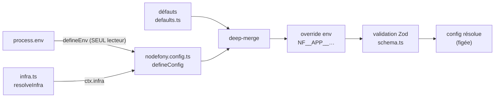

# Configuration (defineConfig, env, Zod)

> Le principe : **une source par niveau**. Le schéma Zod porte la _forme_, `defaults.ts` porte les
> _valeurs par défaut_, `nodefony.config.ts` porte les _choix de l'app_, et les _variables
> d'environnement_ surchargent en dernier. Le tout est **validé au boot** — une config invalide plante
> proprement avec le chemin fautif, jamais en `undefined.x` silencieux. Ancré sur
> `src/nodefony/src/config/`.

## Le modèle mental — un pipeline de résolution



Constat structurant : **un seul point lit `process.env`** (`defineEnv`, `config/defineEnv.ts:5`).
Partout ailleurs, la config est un objet typé et figé. Ça élimine la classe de bugs « un
`process.env.X` lu au fond d'un service, non validé, absent en prod ».

## Lexique

| Terme          | Sens                                                                               |
| -------------- | ---------------------------------------------------------------------------------- |
| `defineConfig` | Descripteur de config de l'app (objet, ou `(ctx) => objet` selon l'environnement). |
| `defineEnv`    | Catalogue de variables d'environnement typées ; **seul** lecteur de `process.env`. |
| Zod            | Bibliothèque de schémas : valide et type la config au boot.                        |
| `use()`        | Déclare un module dans le manifeste avec sa config.                                |
| Override env   | Surcharge d'une clé de config par une variable `NF__…` (ADR-0006).                 |
| Infra auto     | Détection de l'infra déclarée (Redis/DB) pour résoudre les sentinelles `"auto"`.   |

## Qu'est-ce que ce système résout

Un framework doit se configurer sans se réécrire : par environnement (dev/prod), par déploiement (URLs,
secrets), par module. Les pièges classiques qu'il élimine : des défauts éparpillés, des `process.env`
lus n'importe où, une config non validée qui casse au runtime, et des secrets en clair dans le code.

## La vision Nodefony

`defineConfig(input)` accepte un objet **ou** une fonction `(ctx) => objet` (`config/defineConfig.ts:178`)
— la forme fonction permet de différencier la config par environnement **sans fichier parallèle** (le
`ctx` porte `env`, `appEnv`, `isProd`, `ctx.infra`). Elle retourne un **descripteur brandé**
(`CONFIG_DESCRIPTOR`, `:112`) que le Kernel résout au boot via `resolve(ctx)` (`:183`). `defineEnv` lit
la source **une fois**, valide en bloc (`z.object(catalog).safeParse`) et retourne un objet **figé et
typé** (`config/defineEnv.ts:270`) : valeur absente → défaut, valeur présente invalide → **échec au
boot en nommant la variable** (`:279`). Les secrets Docker/K8s/Vault via `<KEY>_FILE` sont gérés, avec
erreur si `KEY` **et** `KEY_FILE` coexistent (`:107`). Le catalogue alimente la génération de
`.env.example` (anti-dérive, vérifiée par un hook).

## Démarrage rapide

**1) Déclarer ses variables d'env** (`env.ts`) — typées, avec défaut et doc :

```typescript
import { defineEnv, envString, envNumber, envBoolean } from "nodefony";
export const env = defineEnv({
  NF_HTTP_PORT: envNumber({ default: 5150 }),
  NF_DATABASE_URL: envString({ optional: true }), // absent → drizzle non forcé
  NF_LOG_PRETTY: envBoolean({ default: true }),
});
```

**2) Écrire la config de l'app** (`nodefony.config.ts`) — forme fonction pour dépendre de l'env :

```typescript
import { defineConfig, use } from "nodefony";
import { env } from "./env";
export default defineConfig((ctx) => ({
  servers: { http: { port: env.NF_HTTP_PORT } },
  modules: [
    use("@nodefony/http", { session: { store: "auto" } }),
    use("@nodefony/security", {/* areas… */}),
    use("@nodefony/studio", {}, { policy: "dev" }), // hors prod
  ],
  log: { pretty: ctx.isProd ? false : env.NF_LOG_PRETTY },
}));
```

**3) Surcharger sans toucher au code** — une variable d'env override une clé existante :

```bash
NF__APP__SERVERS__HTTP__PORT=8080      # servers.http.port = 8080
NF__HTTP__SESSION__STORE=redis         # override le module http (bloc session.store)
```

## Ordre de précédence (ADR-0006) — et ses gardes

1. **Défauts** : `defaultAppConfig` (`config/defaults.ts`) — le schéma ne porte **pas** de `.default()`
   (`schema.ts:9`) ; défauts et forme sont séparés.
2. **Config app** : deep-merge du `nodefony.config.ts` (`extend(true, {}, …)`, `defineConfig.ts:147`).
3. **Override env** : appliqué **entre le merge et la validation** — `NF__APP__<chemin>` pour l'app
   (`defineConfig.ts:154`), `NF__<MODULE>__<chemin>` pour un module (`config/envOverride.ts:11`).
4. **Validation Zod** (fail-closed) : `validateAppConfig` agrège les erreurs avec le chemin fautif
   (`schema.ts:322`).

Trois gardes non évidentes qui évitent des heures de debug :

- **Un override n'écrit que sur un chemin DÉJÀ présent** (`defineConfig.ts:60`). Sinon, pas d'écriture
  silencieuse : un **WARNING « did you mean »** (distance de Levenshtein sur les clés réelles,
  `envOverride.ts:266`). Conséquence : une clé opt-in sans défaut (`domainCheck`) n'est pas
  surchargeable tant qu'elle n'est pas déclarée — c'est voulu.
- **Coercion explicite** bool/number/JSON/CSV (`envOverride.ts:47`) — pas de `z.coerce.boolean("false")
=== true` ; une chaîne vide = variable absente (`defineEnv.ts:132`).
- **Schéma app non strict** : les clés inconnues (`module-<x>`, `App`, `cluster`) sont **ignorées**, pas
  rejetées (`schema.ts:11`) — chaque module valide **son** bloc avec son propre schéma.

## Déclarer un module — `use()`

`use(name, config, opts)` (`config/use.ts:88`) colocalise la config d'un module dans le manifeste
`modules`. `config` est typée via le registre augmentable `NodefonyModuleConfig` (declaration merging,
`:52`) → autocomplétion par module. `opts` : `policy` (`"optional"` défaut, `"dev"` = retiré hors prod)
et `when(config) => boolean` (garde ; `false` → module ignoré, `:67`). L'ordre du tableau = la priorité
de chargement (cf. cycle de boot).

## Infra auto — résoudre les sentinelles `"auto"`

`resolveInfra(env)` (`config/infra.ts:134`) lit les URLs déclarées (`NF_DATABASE_URL`, `NF_REDIS_URL`,
Loki/OpenSearch, `NF_STORE`), préfixe `NF_` prioritaire. `resolveAutoStore(kind, infra, available, …)`
(`:241`) résout `"auto"` : `NF_STORE` force toujours (`:251`) ; sinon préférence selon le type
(éphémère/session → Redis si présent ; durable → drizzle/mongoose selon la famille de base, `:258`) ;
repli sur un backend local persistant puis fallback (memory/files, `:288`). Constat de sûreté : `auto`
**ne borne que les backends réellement enregistrés** (`available`) — le repli est **annoncé**, jamais
silencieux. Une valeur explicite ne passe jamais par `auto`.

## Les blocs de config app (schéma)

`appConfigSchema` (`config/schema.ts:171`) valide : `modules`, `locale`, `templating`, `orm`,
`packageManager`, `domain`/`domainAlias`/`domainCheck`, `servers` (statics/http/https/ws/wss/portPolicy/
portRetryAttempts, `:94`), `cluster`, `timing`, `shutdownDeadline`, `log`. `flattenZodIssues` descend
dans les unions pour un diagnostic précis (`:295`).

## Observabilité — Studio

Chaque module expose son schéma en **JSON Schema** (`Module.configSchema()`) → le panneau de
configuration admin de Studio affiche chaque option avec type, défaut et description, depuis la **même**
source de vérité que le code. Aucune divergence doc/config possible.

## Performance & mémoire

La config est **entièrement résolue au boot** (chemin froid) puis figée — 0 coût au runtime, 0 lecture
`process.env` sur le hot path. `defineEnv` gèle son objet ; `resolveInfra` est appelé une fois. Rien à
optimiser côté requête.

## Pièges (symptôme → cause → correction)

| Symptôme                                             | Cause (dans le code)                                      | Correction                                             |
| ---------------------------------------------------- | --------------------------------------------------------- | ------------------------------------------------------ |
| `NF__APP__X=…` sans effet + WARNING « did you mean » | Le chemin n'existe pas dans les défauts (override refusé) | Déclarer la clé (même à `null`) dans `defaults`        |
| `NF__…__ENABLED=false` traité `true`                 | Coercion naïve                                            | La coercion est explicite ; `false`/`0` marchent       |
| Boot « Invalid config: `servers.http.port`… »        | Valeur hors schéma                                        | Lire le chemin + la raison, corriger                   |
| Sous-défauts d'un bloc non appliqués                 | `.default({})` plat en Zod 4                              | `.default(() => sub.parse({}))` (convention module)    |
| `KEY` et `KEY_FILE` définis en même temps            | Ambiguïté secret                                          | N'en garder qu'un (erreur au boot sinon)               |
| `.env.example` désynchronisé                         | `env.ts` modifié sans régénérer                           | `npx tsx scripts/gen-env-example.ts` (hook le vérifie) |

## Tests & couverture

La configuration est validée par **152 cas** sur 9 fichiers (`src/nodefony/src/tests/`) :
`defineEnv` (13), `defineConfig` (15), `envOverride` (33, les gardes de surcharge), `infra` (31,
résolution `"auto"`), `configBoot` (26), `configProvenance` (8, providers `{{ }}`), `configUse` (12),
`envExample` (7, anti-dérive) et `podEnvironment` (7). La couverture des fichiers de config est élevée
(voir la carte : `defineEnv` ~98 %, `envOverride` 100 %, `use` 100 %). Compteurs et couverture sont une
**photo** régénérée depuis vitest — la vérité vit dans `npm run coverage`.

## Pour aller plus loin

- Cycle de boot (quand la config est résolue, dans quel ordre) → [cycle-boot-kernel](./cycle-boot-kernel.md)
- ADR-0006 (config unifiée + override env) → `docs/adr/0006-configuration-unifiee-env-override.md`
- Config d'un module → le bloc Zod du module (ex. [session](../../src/packages/@nodefony/http/docs/session.md), [idempotence](../../src/packages/@nodefony/framework/docs/idempotence.md))
