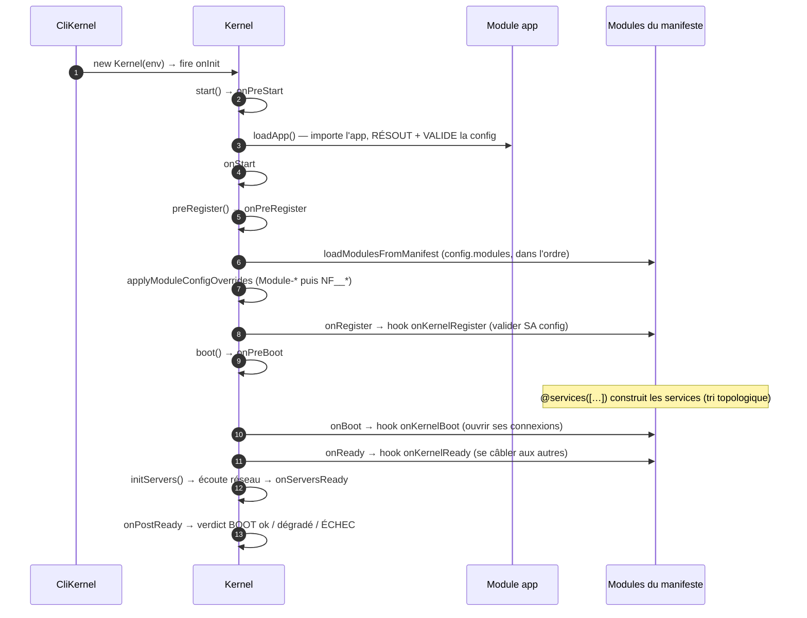
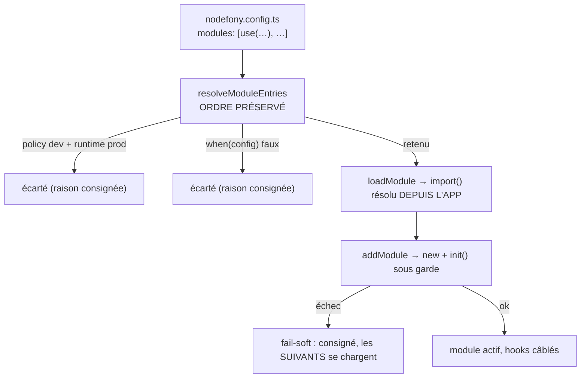
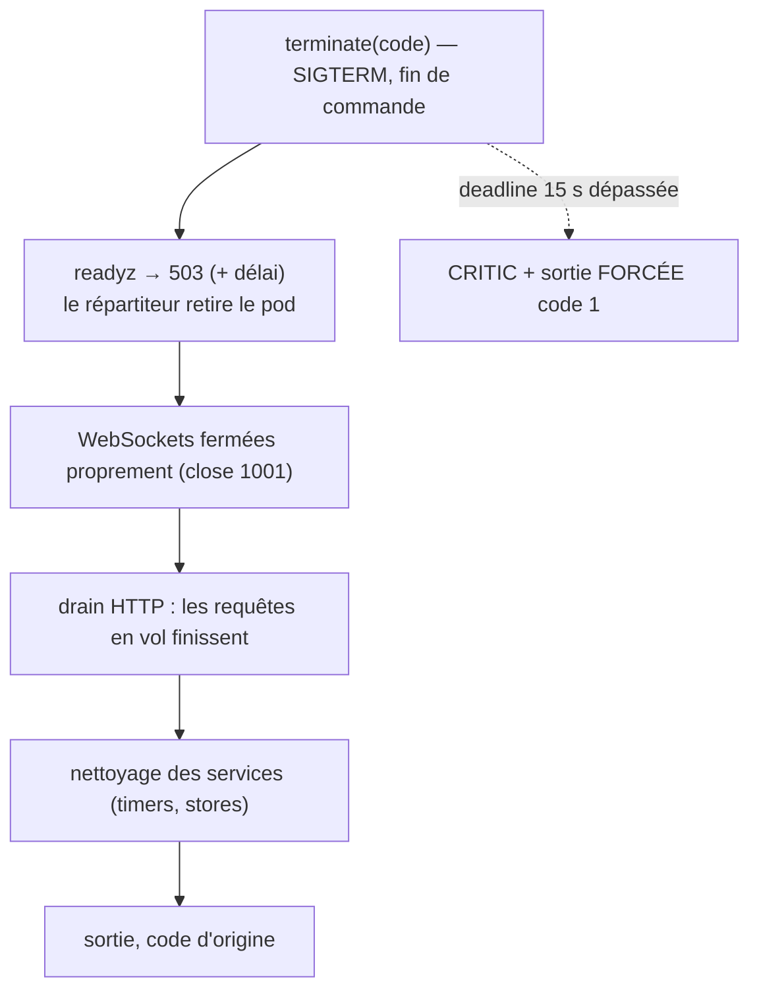

# Cycle de boot du Kernel

> Entre `npx nodefony development` et le premier octet servi, il se passe une dizaine d'étapes
> **nommées et ordonnées**. Cette page te dit dans quel ordre tes modules se chargent, quand ta
> configuration est résolue et validée, quand tes services sont construits, **à quel moment brancher
> ton code**, et ce qui se passe quand le process s'arrête. Tout est ancré sur
> `src/nodefony/src/kernel/`.

📍 [Documentation](../index.md) › **Cycle de boot du Kernel**

## 🧠 Le modèle mental — le boot est une chaîne de phases

Un framework ne peut pas tout faire en même temps. Il faut lire la configuration **avant** de charger
les modules, charger les modules **avant** de construire leurs services, construire les services
**avant** d'ouvrir les serveurs.

Nodefony ne cache pas cet ordre dans un gros `main()` : il le formalise en **phases nommées**. Chaque
phase émet un événement ; ton module s'y accroche sans rien savoir des autres.



## 📖 Lexique

| Terme          | Sens                                                                                           |
| -------------- | ---------------------------------------------------------------------------------------------- |
| Kernel         | Le noyau : cycle de vie, container d'injection, chargement des modules, serveurs.              |
| Module         | Unité chargeable (`@nodefony/http`, `@nodefony/security`…). **L'app est elle-même un module.** |
| Phase          | Étape ordonnée du boot. Chaque phase émet un événement écoutable.                              |
| Hook           | Ta méthode appelée à une phase (`onKernelRegister`, `onKernelBoot`, `onKernelReady`, `init`).  |
| Manifeste      | La liste `modules` de `nodefony.config.ts` — **ordonnée** : c'est la priorité de chargement.   |
| Descripteur    | L'objet rendu par `defineConfig(…)` ; le Kernel appelle son `resolve(ctx)` au boot.            |
| Criticité      | `Module.critical` : un module critique qui échoue **arrête** le boot en production.            |
| Fail-soft      | Un échec non fatal : consigné, annoncé, mais le boot continue.                                 |
| `BootReport`   | Le verdict agrégé du boot (modules chargés, serveurs en écoute, santé).                        |
| Drain          | L'arrêt ordonné : on cesse d'accepter, on laisse finir ce qui est en vol, puis on sort.        |
| Park           | Rester vivant sans serveur (daemon, worker de file) jusqu'à un signal.                         |
| DI / Container | Injection de dépendances : l'annuaire de services (voir la page dédiée).                       |

## Qu'est-ce que le boot — et pourquoi ça se raconte en phases

Un serveur qui démarre fait trois choses très différentes : il **lit** (config, fichiers, variables
d'environnement), il **construit** (modules, services, connexions), il **ouvre** (ports réseau).
Mélanger les trois produit des bugs d'ordre : un service qui cherche un autre service pas encore né,
une config lue avant d'être validée, un port ouvert avant que l'application soit prête à répondre.

Le contrat de Nodefony est simple : **chaque chose a son moment, et ce moment porte un nom.** Tu
n'écris jamais « attends un peu que l'ORM soit prêt » — tu écris ton code dans `onKernelReady`, et le
framework garantit que l'ORM y est.

## La vision Nodefony — phases nommées, hooks gardés, verdict unique

Trois décisions structurent tout le reste.

**1. Les phases sont un jeu figé.** Les événements de cycle de vie sont un bitmask gelé de onze
valeurs — `Events` (`Kernel.ts:283`). La chaîne réelle est
`start() → preRegister() → boot() → onReady() → initServers()`, chaque maillon appelant le suivant.

**2. Un hook de module ne peut pas geler le boot.** Les phases sensibles passent par
`Kernel.fireLifecycle()` (`Kernel.ts:3254`) et non par un `await` nu : chaque hook est **borné par un
timeout** et son échec est arbitré par une **politique de criticité**. Le chemin chaud HTTP/WS, lui,
garde l'émission nue — zéro timer, zéro allocation par requête.

**3. Le boot rend un verdict.** `Kernel.getBootReport()` (`Kernel.ts:2321`) agrège une vérité unique
— modules chargés, modules ignorés, serveurs réellement en écoute — consommée par le log, le code de
sortie, le superviseur de dev et Studio. Un boot ne meurt jamais en silence.

> [!IMPORTANT]
> Le rôle des hooks se lit dans **un seul** endroit du code : `Module.setEvents()` (`Module.ts:206`)
> câble `onKernelRegister`/`onKernelBoot`/`onKernelReady` sur les phases correspondantes. Si une
> méthode ne porte pas exactement l'un de ces trois noms, **elle n'est jamais appelée**.

## 🚀 Démarrage rapide

Vue depuis une application générée par `nodefony create app`. Objectif : un module qui fait quelque
chose **au bon moment**, et qu'on voit démarrer dans les logs.

### 1. Le module qui s'accroche au cycle

```typescript
// nodefony/modules/billing/index.ts
import {
  Kernel,
  Module,
  Service,
  Container,
  Event,
  services,
  injectable,
  inject,
} from "nodefony";

// Un service du module : sa dépendance est DÉCLARÉE (@inject), pas cherchée.
@injectable()
class InvoiceService extends Service {
  constructor(
    module: Module,
    @inject("sessions") private sessions: Service,
  ) {
    super(
      "invoices",
      module.container as Container,
      module.notificationsCenter as Event,
    );
  }

  // `init()` = le hook de démarrage d'un service (une seule fois, sous garde).
  async init(): Promise<this> {
    this.log(`invoices prêt (sessions = ${this.sessions.name})`, "INFO");
    return this;
  }
}

@services([InvoiceService])
class Billing extends Module {
  // Module optionnel : son échec n'abat pas le pod en production.
  static override critical = false;

  constructor(kernel: Kernel) {
    super("billing", kernel, import.meta.url, {});
  }

  // Phase onRegister — je valide MA config, je déclare ce qui m'appartient.
  override async onKernelRegister(): Promise<this> {
    this.log("billing: configuration validée", "INFO");
    return this;
  }

  // Phase onBoot — mes services existent : j'ouvre mes connexions.
  override async onKernelBoot(): Promise<this> {
    this.log("billing: connexions ouvertes", "INFO");
    return this;
  }

  // Phase onReady — TOUS les modules sont bootés : je me câble aux autres.
  override async onKernelReady(): Promise<this> {
    const invoices = this.get<InvoiceService>("invoices");
    this.log(`billing: câblé sur ${invoices?.name}`, "INFO");
    return this;
  }
}

export default Billing;
```

### 2. La configuration qui le charge

Le module n'est pas découvert « magiquement » : il est **déclaré**, dans l'ordre voulu.

```typescript
// nodefony.config.ts — extrait
export default defineConfig((ctx) => ({
  modules: [
    use("@nodefony/http", {}), // 1. le transport
    "@nodefony/framework", // 2. le routage (dépend du transport)
    { name: "@app/billing", policy: "dev" as const }, // 3. le tien, hors production
  ],
}));
```

### 3. Ce qu'on observe

```bash
npx nodefony development
```

```
MODULE ADD : http
MODULE ADD : framework
MODULE ADD : billing
billing: configuration validée          ← onKernelRegister
SERVICE ADD : invoices
invoices prêt (sessions = sessions)     ← init() du service
billing: connexions ouvertes            ← onKernelBoot
billing: câblé sur invoices             ← onKernelReady
BOOT ok — 4 module(s), 2 serveur(s) en écoute (http://127.0.0.1:5151, ws://127.0.0.1:5151)
```

La dernière ligne est le **verdict** (`Kernel.logBootVerdict()`, `Kernel.ts:2450`). Tant qu'elle n'est
pas là, le boot n'est pas fini.

## 🧩 Les points d'accroche — le catalogue des hooks

Choisir en cinq secondes :

| Hook                 | Phase        | Ce qui est GARANTI à ce moment                                 | On y met…                                     |
| -------------------- | ------------ | -------------------------------------------------------------- | --------------------------------------------- |
| `init(kernel?)`      | à l'ajout    | le module existe, le kernel aussi                              | l'équivalent d'un constructeur asynchrone     |
| `onKernelRegister()` | `onRegister` | tous les modules sont **instanciés** ; overrides posés         | valider sa config, déclarer entités et routes |
| `onKernelBoot()`     | `onBoot`     | les services `@services([…])` sont **construits**              | ouvrir ses connexions, armer ses timers       |
| `onKernelReady()`    | `onReady`    | **tous** les modules sont bootés ; serveurs pas encore ouverts | se câbler aux autres modules                  |
| `init()` (service)   | `onPreBoot`  | le service est construit, ses `@inject` résolus                | connexion, chargement de clés, warm-up        |
| `onTerminate`        | arrêt        | le drain commence                                              | fermer proprement, stopper ses timers         |

### `init(kernel?)` — le constructeur asynchrone d'un module

Appelé par `Kernel.addModule()` (`Kernel.ts:1193`), juste après le `new`. C'est le seul endroit qui
tourne **avant** toute phase, au moment même du chargement du module.

Il est exécuté **sous garde** (`Kernel.guardInitialize()`, `Kernel.ts:2624`) : borné par un timeout et
soumis à la criticité du module. Un `init` qui pend ne gèle plus rien.

### `onKernelRegister()` — « je valide ma config et je me déclare »

Phase `onRegister` (`Module.ts:212`). Deux garanties : **tous** les modules sont instanciés, et les
surcharges de configuration ont déjà été appliquées (`Kernel.applyModuleConfigOverrides()`,
`Kernel.ts:1238`).

C'est donc **ici** qu'un module valide sa configuration avec son schéma Zod (`defineXConfig()`) et la
gèle. Le décorateur `entities()` (`entitiesDecorator.ts:66`) inscrit ses entités ORM à cette même
phase — avant toute connexion.

### `onKernelBoot()` — « mes services existent »

Phase `onBoot` (`Module.ts:218`). Juste avant, à `onPreBoot`, le décorateur `services()`
(`kernelDecorator.ts:31`) a construit tous les services déclarés par le module. Tu peux donc les
récupérer et ouvrir ce qui doit l'être : connexion base, abonnement à un bus, chargement d'un cache.

### `onKernelReady()` — « tout le monde est là »

Phase `onReady` (`Module.ts:224`). C'est la phase du **câblage inter-modules** : un module qui doit
enrichir un autre (enregistrer un fournisseur, poser un intercepteur) le fait ici, parce que la
présence des autres est enfin garantie.

Les serveurs réseau, eux, ne sont **pas encore ouverts** : `Kernel.initServers()` (`Kernel.ts:1190`)
tourne après cette phase. C'est ce qui fait de `onKernelReady` la dernière fenêtre pour agir **avant
le premier octet servi**.

### `init()` d'un service — le hook standard, ne pas le réinventer

Un service qui expose `init()` est initialisé une fois au démarrage, via
`Kernel.guardServiceInitialize()` (`Kernel.ts:3322`) — même garde que les modules. C'est le hook
canonique : ne pas inventer de `boot()`, `connect()` ou `onConnect()` maison.

> [!WARNING]
> Un hook **doit être une méthode de prototype** — jamais une propriété fléchée
> (`onKernelBoot = async () => {}`). Le câblage se fait dans le constructeur de `Module`
> (`Module.setEvents()`, `Module.ts:206`), donc **avant** que les initialiseurs de champ de ta
> sous-classe ne tournent : une propriété fléchée n'existe pas encore, le hook n'est jamais attaché,
> et rien ne le signale.

## ⚙️ Mises en situation

### Situation 1 — « mon service a besoin d'un autre service au démarrage »

Ton `InvoiceService` a besoin du service `sessions` dès sa construction. La tentation est de le
chercher dans le container au bon moment. **Ne le fais pas** : déclare la dépendance.

```typescript
@injectable()
class InvoiceService extends Service {
  constructor(
    module: Module,
    @inject("sessions") private sessions: Service, // déclaré, pas cherché
  ) {
    super("invoices", module.container as Container);
  }
}
```

Pourquoi ça suffit : l'ordre d'instanciation n'est **pas** l'ordre que tu écris dans
`@services([...])`. Il est recalculé depuis les dépendances déclarées par
`orderServicesByDependencies()` (`kernelDecorator.ts:48`), un tri topologique **stable**. Une liste
déjà correcte sort inchangée ; une liste mal ordonnée est corrigée toute seule.

| Ce que tu écris                                 | Ce qui se passe                                                  |
| ----------------------------------------------- | ---------------------------------------------------------------- |
| `@services([A, B])` où `B` a besoin de `A`      | ordre respecté (il l'était déjà)                                 |
| `@services([B, A])` où `B` a besoin de `A`      | **`A` est construit d'abord** — le tri le déduit de `@inject`    |
| dépendance sur un service d'un **autre** module | le prendre à `onKernelBoot`/`onKernelReady`, pas au constructeur |

### Situation 2 — « je veux migrer la base avant d'accepter du trafic »

Le besoin : aucune requête ne doit arriver avant que le schéma soit à jour.

La fenêtre exacte est `onKernelReady` : tous les modules sont bootés (l'ORM est connecté), et
`Kernel.initServers()` (`Kernel.ts:1190`) n'a **pas encore** ouvert les ports.

```typescript
override async onKernelReady(): Promise<this> {
  await this.runMigrations();   // les ports ne sont pas encore ouverts
  return this;
}
```

Et si la migration échoue ? Le comportement dépend de la criticité déclarée, et c'est **voulu** :

| `static critical`    | En développement                          | En production                                     |
| -------------------- | ----------------------------------------- | ------------------------------------------------- |
| `true` (défaut)      | `WARNING` + **avertissement de sanction** | **boot interrompu** — le pod crashe et redémarre  |
| `false`              | `WARNING`, le boot continue               | `WARNING`, le boot continue (dégradé mais vivant) |
| _absent_ (non tagué) | `WARNING` + **avertissement de sanction** | **boot interrompu** — traité comme critique       |

⚠️ **La troisième ligne est le piège** : un écouteur posé à la main
(`kernel.on("onBoot", …)`, hors d'un `Module`) ne porte **aucune** étiquette de criticité. Il est
donc traité comme **critique** — toléré en développement, il **interrompt le boot en production**.
Même code, deux comportements, et l'écart ne se découvrait qu'au déploiement.

Le défaut reste strict — un pod à moitié booté est pire qu'un pod qui redémarre — mais le
développement **annonce désormais la sanction** :

```
boot lifecycle: en production, cet échec de "connectBillingDatabase" INTERROMPRAIT le boot
  — ce hook ne porte aucun tag de criticité (posé hors d'un Module ?), et un hook non tagué
  est traité comme CRITIQUE. Déclarer `static critical = false` sur le Module porteur si
  l'échec est tolérable.
```

Le message **nomme** le fautif : à défaut de module propriétaire, le nom de la fonction sert de
repli — sans quoi le journal écrivait « (anonyme) » et ne désignait personne, précisément là où
l'information compte le plus (en production, au moment où le boot s'arrête). `critical: false` reste
silencieux : c'est une décision assumée, et un avertissement qu'on apprend à ignorer ne protège plus.

L'arbitrage est fait par `Kernel.isBootErrorFatal()` (`Kernel.ts:2217`). Une exception : une erreur de
**configuration** (`BootConfigurationError`) est fatale **même en développement** — un serveur vivant
avec une config non honorée est un piège, pas un confort.

### Situation 3 — « mon module doit se désactiver proprement selon l'environnement »

Deux leviers, dans le manifeste, et **aucun `if` dans le code du module** :

```typescript
export default defineConfig((ctx) => ({
  modules: [
    "@nodefony/http",
    // A. policy "dev" : jamais chargé quand le runtime est en production.
    { name: "@nodefony/studio", policy: "dev" as const },
    // B. when(config) : garde évaluée sur la config résolue.
    use("@app/billing", {}, { when: (config) => Boolean(config.domainCheck) }),
  ],
}));
```

| Levier          | Évalué où                                          | Effet quand la garde est fausse                     |
| --------------- | -------------------------------------------------- | --------------------------------------------------- |
| `policy: "dev"` | `Kernel.resolveModuleEntries()` (`Kernel.ts:1380`) | jamais `import()` — donc jamais en mémoire          |
| `when(config)`  | `Kernel.resolveModuleEntries()` (`Kernel.ts:1380`) | idem, et sa config colocalisée est ignorée avec lui |

Le gain est réel : en ESM, un module importé n'est **jamais** déchargé. Ne pas l'importer est la seule
façon de ne pas le payer.

> [!TIP]
> Un module gaté n'est pas un module perdu. La raison est consignée
> (`Kernel.recordModuleGated()`, `Kernel.ts:1449`) et le verdict de boot l'affiche : « 4 module(s),
> 1 ignoré(s) (policy/when) ». Tu sais toujours **pourquoi** ton module manque.

### Situation 4 — « pourquoi ma config n'est pas encore là ? »

Le symptôme : `Cannot read properties of null` au démarrage, avant même le premier log de boot. La
cause est presque toujours la même — un fichier de configuration qui **déréférence le kernel au
moment de l'import**.

```typescript
// ❌ Résolu à l'IMPORT du module : le kernel n'existe pas encore → crash.
export default {
  db: { filename: path.resolve(Nodefony.getKernel().path, "app.db") },
};

// ✅ Getter paresseux : résolu à la LECTURE (au boot, kernel présent).
export default {
  db: {
    get filename() {
      return path.resolve(Nodefony.getKernel().path, "app.db");
    },
  },
};
```

Pourquoi ça casse : `Kernel.loadApp()` (`Kernel.ts:1543`) fait un `import()` du point d'entrée de
l'app **avant** que la config ne soit résolue — le code au premier niveau de tes fichiers de config
s'exécute donc à un instant où il n'y a pas encore de kernel utilisable. Effet de bord aggravant : le
module devient **non importable hors serveur**, donc intestable.

Le diagnostic est explicite : `Kernel.bootConfigError()` (`Kernel.ts:1505`) présente l'erreur en clair,
affiche les valeurs par défaut du framework et suggère exactement ce cas. Avec la forme fonction
`defineConfig((ctx) => …)`, le besoin de déréférencer disparaît : tout ce dont tu as besoin est dans
`ctx`.

## 🏗️ Architecture interne — les phases dans l'ordre

| #   | Événement        | Déclenché par                         | Ancrage          | Ce qui devient vrai                       |
| --- | ---------------- | ------------------------------------- | ---------------- | ----------------------------------------- |
| 1   | `onInit`         | constructeur                          | `Kernel.ts:284`  | le kernel existe, le container aussi      |
| 2   | `onPreStart`     | `Kernel.start()`                      | `Kernel.ts:637`  | `tmp/` et `var/` garantis, log initialisé |
| —   | (chargement app) | `Kernel.loadApp()`                    | `Kernel.ts:1543` | **config résolue + validée**              |
| 3   | `onStart`        | `Kernel.start()`                      | `Kernel.ts:668`  | profil d'exécution figé                   |
| 4   | `onPreRegister`  | `Kernel.preRegister()`                | `Kernel.ts:941`  | **modules du manifeste chargés**          |
| —   | (surcharges)     | `Kernel.applyModuleConfigOverrides()` | `Kernel.ts:1238` | `Module-*` puis `NF__*` appliqués         |
| 5   | `onRegister`     | `Kernel.preRegister()`                | `Kernel.ts:941`  | configs de module **validées et gelées**  |
| 6   | `onPreBoot`      | `Kernel.boot()`                       | `Kernel.ts:803`  | **services construits + `init()`**        |
| 7   | `onBoot`         | `Kernel.boot()`                       | `Kernel.ts:808`  | connexions des modules ouvertes           |
| 8   | `onReady`        | `Kernel.onReady()`                    | `Kernel.ts:830`  | câblage inter-modules terminé             |
| 9   | `onServersReady` | `Kernel.initServers()`                | `Kernel.ts:1190` | **les ports écoutent**                    |
| 10  | `onPostReady`    | `Kernel.onReady()`                    | `Kernel.ts:1090` | verdict de boot figé et logué             |
| 11  | `onTerminate`    | `Kernel.terminate()`                  | `Kernel.ts:3581` | le drain commence                         |

Une commande peut s'arrêter à n'importe laquelle de ces phases : `Kernel.setCommandComplete()`
(`Kernel.ts:2207`) compare la phase atteinte à la phase cible déclarée par la commande et coupe la
chaîne — voir la section « Le mode commande » plus bas.

### Comment les modules sont choisis et chargés

L'app est chargée **en premier** : c'est elle qui porte la configuration, donc le manifeste. Le reste
suit à `onPreRegister`.



Trois points qui comptent.

**L'ordre du tableau est la priorité.** `Kernel.resolveModuleEntries()` (`Kernel.ts:1380`) ne fait que
**filtrer** — il ne réordonne jamais. Mets le transport avant le routage, le routage avant ce qui en
dépend.

**La résolution part de l'application, pas du paquet `nodefony`.** `resolveModuleEntry()`
(`resolveModuleEntry.ts:29`) résout depuis le `package.json` de l'app : sans ça, un module local
(`modules/*`, workspace) devient introuvable dès que le cœur ne vit pas dans le `node_modules` de
l'app (mode lien symbolique, monorepo, pnpm).

**Un module qui échoue ne masque pas les suivants.** `Kernel.loadModulesFromManifest()`
(`Kernel.ts:1508`) capture l'échec par entrée, le consigne via `Kernel.recordBootFailure()`
(`Kernel.ts:2257`) et continue. Sans ça, un `dist/` périmé sur le premier module ferait disparaître
les dix autres en silence.

### Quand ma configuration est-elle résolue et validée ?

**Une seule fois, dans `Kernel.loadApp()` (`Kernel.ts:1543`), avant toute phase de registration.** Le
détail complet vit dans [Configuration](configuration.md) ; voici seulement la place dans le cycle.

1. Le point d'entrée de l'app est résolu depuis son `package.json` — `Kernel.resolveAppEntry()`
   (`Kernel.ts:2089`) — puis importé.
2. Le catalogue d'environnement de l'app (`export const env`) alimente le contexte rendu par
   `Kernel.buildConfigContext()` (`Kernel.ts:1789`) — `env`, `infra`, `appEnv`, `runtimeEnv`,
   `isProd`, `isDev`, `isTest`.
3. `Kernel.resolveAppOptions()` (`Kernel.ts:1880`) appelle le `resolve(ctx)` du descripteur produit
   par `defineConfig()` (`defineConfig.ts:178`).
4. Ce `resolve` fait, **dans cet ordre**, `mergeAndValidate()` (`defineConfig.ts:147`) : fusion
   profonde sous les défauts du framework → surcharges d'environnement `NF__APP__*` → **validation
   Zod** (`defineConfig.ts:161`).

La configuration des **modules**, elle, se valide plus tard, à `onKernelRegister` — après que les
surcharges `Module-<nom>` et `NF__<MODULE>__*` ont été appliquées
(`Kernel.applyEnvConfigOverrides()`, `Kernel.ts:1616`). C'est cet ordre qui rend une surcharge
effective au lieu d'être silencieusement écrasée.

| Ce qui est validé      | Quand                        | Par quoi                                     |
| ---------------------- | ---------------------------- | -------------------------------------------- |
| config de l'**app**    | `loadApp()`, avant `onStart` | le Zod du cœur, dans `resolve(ctx)`          |
| config d'un **module** | son `onKernelRegister`       | son propre `defineXConfig()` (Zod du module) |

En cas d'échec, pas de trace opaque : `Kernel.bootConfigError()` (`Kernel.ts:1505`) écrit un
diagnostic lisible, liste les valeurs par défaut appliquées aux champs omis, et sort avec un code
distinguant « mauvaise configuration » d'un plantage logiciel.

### Quand mes services sont-ils instanciés ?

À **`onPreBoot`**, phase 6 — donc après la validation des configs et avant `onKernelBoot`.

Le décorateur `services()` (`kernelDecorator.ts:31`) pose un écouteur unique sur `onPreBoot` ; à son
déclenchement il construit la liste, dans l'ordre calculé par `orderServicesByDependencies()`
(`kernelDecorator.ts:48`), via `Module.addService()` (`Module.ts:313`).

Pour chaque service : instanciation par l'injecteur → `init()` **sous garde** → enregistrement au
container. La **construction** est gardée au même titre que l'`init` —
`Module.handleServiceBootError()` (`Module.ts:365`) applique exactement la même politique de
criticité. Un service qu'on ne peut pas construire suit la règle de celui qu'on ne peut pas
initialiser ; il n'y a plus de boot amputé qui se déclare « up ».

Les portées (`singleton`, par requête…) sont un autre sujet : voir
[Injection & portées](injection-portees.md).

## Résilience — un boot qui ne gèle jamais

Un boot naïf attend chaque hook indéfiniment. Il suffit d'un `init` qui **pend** — une file Redis
hors ligne qui ne rejette jamais, un store bloqué — pour que le process reste figé jusqu'au `SIGKILL`
de l'orchestrateur. Nodefony borne ça sur trois axes.

- **Timeout par écouteur** — `NF_BOOT_TIMEOUT_MS` (`Kernel.ts:2177`), sinon **20 s en
  développement, 60 s en production**. Large à dessein : il borne la pendaison infinie, pas la
  lenteur normale.
- **Alerte de lenteur** — au-delà de `NF_BOOT_WARN_MS` (défaut **5 s**, `Kernel.ts:2189`), un
  `NOTICE` **nomme le hook lent** sans le tuer (`Kernel.ts:2564`).
- **Fatal ou fail-soft** — arbitré par `Kernel.isBootErrorFatal()` (`Kernel.ts:2217`) : fatal si le
  module est critique **et** (on est en production **ou** c'est une erreur de configuration) ; sinon
  `WARNING` et le boot continue.

La couche mécanique et la couche politique sont séparées : l'émission gardée ignore tout de la notion
de module, et ce sont les étiquettes posées par `tagListener()` (`lifecycleTags.ts:40`) puis relues
par `readListenerTags()` (`lifecycleTags.ts:60`) qui portent le propriétaire et la criticité.

> [!NOTE]
> Ces garanties s'arrêtent à la porte du chemin chaud. `Kernel.fireLifecycle()` (`Kernel.ts:3254`)
> ne remplace l'émission nue **que** sur la chaîne `onPreRegister` → `onPostReady`. Une requête HTTP
> ou WebSocket n'alloue aucun timer de garde : la résilience du boot ne se paie pas par requête.

## 📡 Observabilité — le verdict de boot

`Kernel.getBootReport()` (`Kernel.ts:2321`) produit un `IBootReport` (`bootReport.ts:64`) : durée,
modules chargés, modules en échec, modules gatés, comptes d'erreurs du journal, serveurs en écoute,
santé et remédiation suggérée.

Le point subtil : `booted` devient vrai dès `onBoot`, **avant** que les serveurs n'écoutent. Confondre
les deux faisait crier « dégradé » à tort pendant toute la montée des serveurs. D'où la distinction —
« pas encore mesuré » n'est pas « mesuré, vraiment zéro » :

- `healthy = false` **uniquement** si un profil serveur était attendu, que la mesure a été faite
  (`Kernel.captureBootServers()`, `Kernel.ts:2287`) et qu'**aucun** serveur n'écoute (`Kernel.ts:2329`) ;
- des modules ignorés **seuls** laissent le boot `healthy` : dégradé, mais vivant.

Le verdict est **toujours** logué, production comprise, en trois formes :

| Verdict        | Sévérité  | Signification                                                          |
| -------------- | --------- | ---------------------------------------------------------------------- |
| `BOOT ok`      | `NOTICE`  | modules chargés, serveurs en écoute (URLs listées), journal du boot    |
| `BOOT dégradé` | `WARNING` | des modules ont échoué en **fail-soft** — le service tourne quand même |
| `BOOT ÉCHEC`   | `CRITIC`  | profil serveur attendu mais **aucun serveur en écoute**                |

Deux aides s'y greffent. Une **remédiation** heuristique — `Kernel.bootRemediationHint()`
(`Kernel.ts:2430`) traduit un `import()` en échec de type « Cannot find package » en « dist périmé
probable ⇒ `npm run clean && npm run build` ». Et un **journal de boot** —
`Kernel.countBootLogIssues()` (`Kernel.ts:2342`) compte les `ERROR`/`WARNING` émis pendant le boot,
figés à `onPostReady` : après cet instant, le tampon mélange boot et exécution normale.

Le garde-fou zéro-serveur va jusqu'au code de sortie : un profil serveur qui finit sans écoute sort en
`EX_UNAVAILABLE`, pas en `0` trompeur (`Kernel.ts:873`). L'orchestrateur voit un pod en échec, le
superviseur de développement un message honnête.

## Arrêt propre — le drain borné

Symétrique du boot. `Kernel.terminate()` (`Kernel.ts:3581`) émet `onTerminate`, ce qui déclenche un
drain **ordonné** — l'ordre vient de l'ordre d'attachement des écouteurs, pas d'un orchestrateur
central.



L'ordre est obtenu par construction : la bascule de disponibilité est attachée **en tête**
(`prependOnceListener("onTerminate")`, `http-kernel.ts:426`), les serveurs WebSocket aussi, et les
serveurs HTTP en écouteur normal — donc en dernier. C'est nécessaire : le drain HTTP détruit les
sockets promues en WebSocket **sans** trame de fermeture, il faut donc que les WS aient déjà dit au
revoir (`createDrainTerminator()`, `serverShutdown.ts:25`).

Le tout est borné par une **échéance globale** : `DEFAULT_SHUTDOWN_DEADLINE` (`Kernel.ts:207`), 15 s
par défaut, choisi inférieur au délai de grâce d'un orchestrateur. Si un écouteur pend — flux SSE
ouvert, store bloqué, module tiers — l'échéance gagne la course (`Kernel.ts:2858`), on logue en
`CRITIC` et on **force la sortie en code 1**. Jamais de process zombie qui attend un `SIGKILL`
externe.

Deux détails qui évitent des bugs vicieux : le rejet éventuel du drain est capturé **hors** de la
course (sinon il deviendrait un rejet non géré), et le minuteur d'échéance est déréférencé de la
boucle d'événements (`Kernel.ts:2867`) pour ne pas retenir un process dont le drain a fini plus tôt.

## Le mode commande — un cycle qui s'arrête plus tôt

`nodefony build`, `nodefony security:user:add`, `nodefony --help` ne sont pas des serveurs. Ils
utilisent **la même chaîne de phases**, mais s'arrêtent à la phase dont ils ont besoin.

Deux mécanismes, à ne pas confondre.

**Le profil d'exécution** — `IRunProfile` (`Kernel.ts:319`) — décrit ce dont le run a besoin :
`{ servers, lifetime, interactive }`. Le défaut est console pur : `CONSOLE_RUN_PROFILE`
(`Kernel.ts:326`). Une commande le déclare via `CliKernel.setRunProfile()` (`CliKernel.ts:784`).

**La phase cible** — chaque commande déclare la phase qui lui suffit. Dès qu'elle est atteinte,
`Kernel.setCommandComplete()` (`Kernel.ts:2207`) coupe la chaîne et `Kernel.finishOrPark()`
(`Kernel.ts:975`) décide de la suite :

| Le run est…                              | Ce qui se passe à la phase cible                             |
| ---------------------------------------- | ------------------------------------------------------------ |
| ponctuel (`build`, `install`)            | `terminate(code)` — le process sort                          |
| durable **sans serveur** (démon, worker) | `Kernel.park()` (`Kernel.ts:955`) — vivant jusqu'à un signal |
| avec serveurs                            | rien : les sockets tiennent déjà le process vivant           |

> [!CAUTION]
> `CliKernel` **n'étend pas** `Kernel` — il étend `Cli`, et le `Kernel` lui est rattaché
> (`CliKernel.start()`, `CliKernel.ts:172`). Corollaire : dans le constructeur de `CliKernel`,
> `environment` peut être indéfini. Tout réglage conditionnel à l'environnement va dans le hook
> `onKernelStart()` de la commande, jamais dans le constructeur.

Certaines invocations **ne bootent rien du tout** : `--version`, la complétion shell,
`nodefony create`, `nodefony status`/`stop` sont traitées avant toute construction de `Kernel`
(`CliKernel.ts:172`). Une tabulation de complétion ne démarre pas un noyau.

Enfin, les commandes **de module** (`frontend:build`, `network`…) posent un problème d'ordre : elles
n'existent dans l'analyseur d'arguments qu'après `onPreRegister`. Leur exécution est donc **différée**
par `CliKernel.dispatchModuleCommand()` (`CliKernel.ts:608`) jusqu'à ce que les modules les aient
enregistrées. Le noyau reste en mode console — une commande inconnue termine en erreur, elle ne
démarre jamais un serveur par accident.

## Cluster et multi-process

Le multi-process n'ajoute **aucune phase**. `Kernel.initCluster()` (`Kernel.ts:2551`) est appelé
pendant `preRegister()` (`Kernel.ts:941`) et se contente de constater le rôle du process — primaire ou
travailleur — pour émettre `onCluster` et brancher le canal de messages inter-process.

Chaque travailleur boote donc **le cycle complet, indépendamment**. Conséquence pratique : un hook
`onKernelReady` qui écrit en base tournera **une fois par travailleur**. Ce qui doit être unique
(migration, tâche planifiée) se garde explicitement, ou se sort du process applicatif.

La supervision de process, elle, est déléguée à l'orchestrateur — un process Node = un conteneur.
Voir [Docker & cloud-native](../guides/docker-cloud-native.md).

## ⚠️ Pièges

| Symptôme                                     | Cause                                                                | Correction                                                          |
| -------------------------------------------- | -------------------------------------------------------------------- | ------------------------------------------------------------------- |
| `Cannot read properties of null` à l'import  | Déréférencement du kernel au premier niveau d'un fichier de config   | Getter paresseux, ou passer par `ctx` de `defineConfig`             |
| Mon hook n'est jamais appelé                 | Propriété fléchée au lieu d'une méthode de prototype                 | `async onKernelBoot(): Promise<this> { … }`                         |
| Mon hook n'est jamais appelé (bis)           | Nom approximatif (`onBoot`, `onKernelBooted`…)                       | Exactement `onKernelRegister` / `onKernelBoot` / `onKernelReady`    |
| Un module n'est pas chargé                   | `policy: "dev"` hors dev, ou `when(config)` faux                     | Lire la ligne « ignoré(s) (policy/when) » du verdict de boot        |
| `Cannot find package` sur un module          | `dist/` périmé après un `git pull`                                   | `npm run clean && npm run build` (la remédiation le dit déjà)       |
| Ordre de service inattendu                   | On croyait que l'ordre de `@services([…])` décidait                  | Il est recalculé depuis les `@inject` — déclarer la dépendance      |
| Service d'un autre module introuvable        | Récupéré dans le constructeur, trop tôt                              | Le prendre à `onKernelBoot` / `onKernelReady`                       |
| Boot figé, puis `SIGKILL` de l'orchestrateur | Un `init` qui pend au-delà du timeout                                | Vérifier l'infra ; ajuster `NF_BOOT_TIMEOUT_MS` si justifié         |
| Pod qui redémarre en boucle en production    | Module **critique** en échec → boot fatal (voulu)                    | Corriger la cause ; en dernier recours revoir `static critical`     |
| `BOOT ÉCHEC — aucun serveur en écoute`       | Profil serveur attendu, 0 serveur (port pris ? module http absent ?) | Lire les modules en échec listés + la remédiation                   |
| Une surcharge de config semble ignorée       | Elle vise un module absent du manifeste                              | Charger le module, ou retirer la clé (un `WARNING` le signale déjà) |
| `shutdown deadline exceeded — forcing exit`  | Un écouteur `onTerminate` pend au-delà de l'échéance                 | Fermer proprement flux et connexions ; ajuster `shutdownDeadline`   |
| Une migration tourne N fois                  | En cluster, chaque travailleur boote le cycle complet                | Garder l'unicité explicitement, ou sortir la tâche du process       |

## 🧪 Tests & couverture

Quatre familles couvrent le cycle — les **chiffres exacts vivent dans la carte de l'aperçu**
(régénérée par `gen-counters.mjs` depuis vitest, jamais figée ici) :

- **unitaires** — `Kernel` (le bitmask, les drapeaux, le rapport de boot), `KernelLifecycle` (l'ordre
  des phases, les timeouts, la criticité, l'échéance d'arrêt), `Module` (chargement, hooks,
  surcharges), `lifecycleTags` (les étiquettes propriétaire/criticité), `serviceOrder` (le tri
  topologique), `KernelCommands`, `CliKernel` et `CliKernelDispatch` (le cycle écourté et le dispatch
  différé) ;
- **intégration** — `httpKernel` (le cycle complet sur serveur réel), `lifecycle-init-crash` (un
  `init` qui plante), `lifecycle-als` (la propagation de contexte à travers les phases) ;
- **charge / mémoire** — le cycle est exercé par la porte d'entrée du pipeline HTTP : voir
  [Pipeline de requête](pipeline-requete.md) et le skill `nodefony-check-memory-health` ;
- **attaque** — pas de banc dédié au boot ; les bancs `injector.attack` et `services.attack` couvrent
  la construction des services.

Ce qui **manque** aujourd'hui, et qu'il faut savoir : aucun test de charge propre au boot (temps de
démarrage sous contrainte), et le chemin **cluster** n'est couvert qu'indirectement.

Couverture : `npm run coverage` dans `src/nodefony`.

## 🔗 Pour aller plus loin

- ⬆️ **Retour au hub** : [Toute la documentation](../index.md)
- 🧭 **Pages sœurs** : [Vue d'ensemble](vue-ensemble.md) · [Configuration](configuration.md) ·
  [Injection & portées](injection-portees.md) · [Pipeline de requête](pipeline-requete.md)

- Écrire `nodefony.config.ts` et `env.ts` (défauts, surcharges, `use()`) → [Configuration](configuration.md)
- Services, portées et résolution des dépendances → [Injection & portées](injection-portees.md)
- Ce qui se passe **après** le boot, requête par requête → [Pipeline de requête](pipeline-requete.md)
- Le socle du cœur (`Service`, `Container`, `Event`) → [Le cœur — hub](../../src/nodefony/docs/index.md)
- Vision architecturale du noyau → [kernel](../../src/nodefony/docs/kernel.md)
- Exécution en conteneur, sondes de vivacité, arrêt → [Docker & cloud-native](../guides/docker-cloud-native.md)
- Comment le `dist/` est produit (et pourquoi il périme) → [Build & bundling](build-bundling.md)
