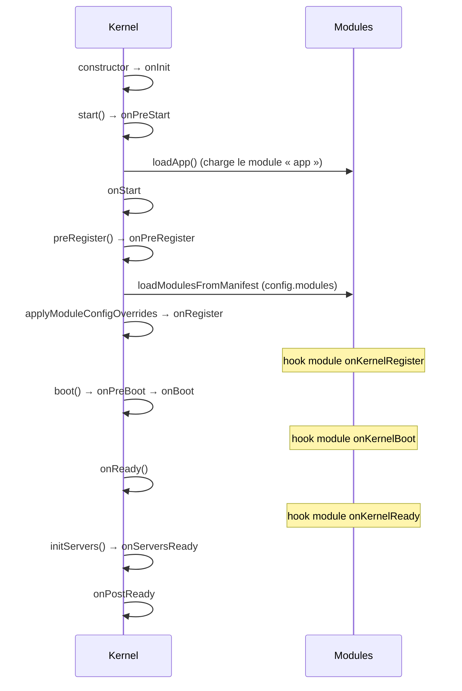
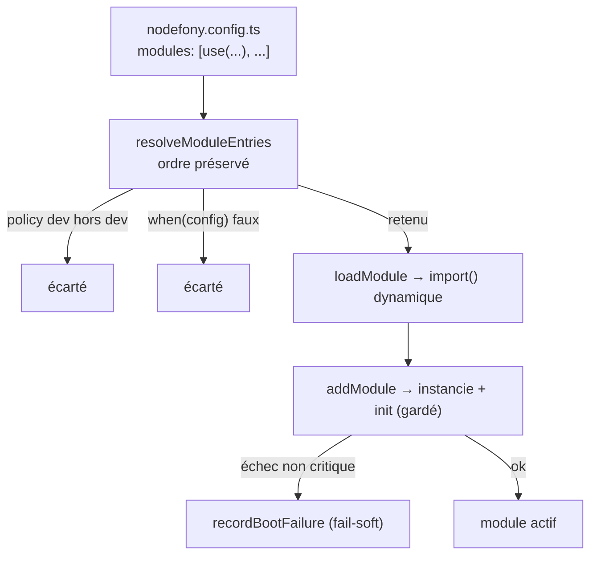

# Cycle de boot du Kernel

> Le `Kernel` est le chef d'orchestre : il lit la configuration, charge les modules dans l'ordre,
> instancie les services, ouvre les serveurs, puis arrête tout proprement. Le boot est une **chaîne de
> phases figées**, chacune émettant un événement que les modules peuvent capter. Chaque fait est ancré
> sur le code (`src/nodefony/src/kernel/Kernel.ts`).

## Schéma général

## Lexique

| Terme          | Sens                                                                                        |
| -------------- | ------------------------------------------------------------------------------------------- |
| Kernel         | Le noyau : cycle de vie, container DI, chargement des modules, serveurs.                    |
| Module         | Unité chargeable (`@nodefony/http`, `@nodefony/framework`…). L'app est elle-même un module. |
| Phase / hook   | Étape ordonnée du boot ; chaque phase émet un événement écoutable par les modules.          |
| Manifeste      | La liste `modules` de `nodefony.config.ts` (via `use()`), ordonnée = priorité de charge.    |
| Fail-soft      | Un module non critique qui échoue à booter ne tue pas le process.                           |
| DI / Container | Injection de dépendances : l'annuaire de services (voir la page dédiée).                    |

## Qu'est-ce que le boot — et pourquoi une chaîne de phases

Démarrer un framework fullstack, c'est orchestrer un ordre : lire la config avant de charger les
modules, charger les modules avant d'instancier leurs services, instancier les services avant d'ouvrir
les serveurs. Nodefony formalise cet ordre en **phases nommées**. Chaque module peut se greffer sur la
bonne phase (s'enregistrer, se câbler quand tout est prêt) sans connaître les autres — c'est ce qui
rend le système **modulaire** sans couplage d'ordre implicite.

## La vision Nodefony

Les événements de cycle de vie sont un **bitmask figé** (`Kernel.ts:222-234`). La chaîne réelle est
`start() → preRegister() → boot() → onReady() → initServers()`. Les hooks de module sont **mappés** sur
ces phases par `Module.setEvents()` (`src/nodefony/src/kernel/Module.ts:206`) — un module implémente
`onKernelRegister` / `onKernelBoot` / `onKernelReady` et le Kernel les appelle au bon moment. Les
phases sensibles passent par `fireLifecycle()` (`Kernel.ts:2513`), qui **garde chaque hook** par un
timeout et par la criticité du module : la résilience est native.

## Les phases, dans l'ordre

| #   | Événement        | Déclencheur (méthode)          | Ancrage                        |
| --- | ---------------- | ------------------------------ | ------------------------------ |
| 1   | `onInit`         | constructor (fin)              | `Kernel.ts:533`                |
| 2   | `onPreStart`     | `start()`                      | `Kernel.ts:637`                |
| —   | (loadApp)        | `start()` → `loadApp()`        | `Kernel.ts:646` (déf. `:1543`) |
| 3   | `onStart`        | `start()`                      | `Kernel.ts:668`                |
| 4   | `onPreRegister`  | `preRegister()`                | `Kernel.ts:699`                |
| —   | overrides config | `applyModuleConfigOverrides()` | `Kernel.ts:728`                |
| 5   | `onRegister`     | `preRegister()`                | `Kernel.ts:729`                |
| 6   | `onPreBoot`      | `boot()`                       | `Kernel.ts:803`                |
| 7   | `onBoot`         | `boot()`                       | `Kernel.ts:808`                |
| 8   | `onReady`        | `onReady()`                    | `Kernel.ts:830`                |
| 9   | `onServersReady` | `initServers()`                | `Kernel.ts:927`                |
| 10  | `onPostReady`    | `onReady()`                    | `Kernel.ts:853`                |
| —   | `onTerminate`    | (arrêt)                        | `Kernel.ts:233` (bitmask)      |

Mapping des hooks de module (`Module.ts:206-224`) : `onKernelRegister → onRegister` (`:212`),
`onKernelBoot → onBoot` (`:218`), `onKernelReady → onReady` (`:224`). En plus, un
`prependOnceListener("onPreBoot")` charge le `package.json` du module (`Module.ts:236`).

> [!TIP]
> Ordre d'usage courant : `onKernelRegister` pour **valider sa config** (ex. `defineXConfig`) et
> déclarer ses services ; `onKernelReady` pour **se câbler quand tout est booté** (les autres modules,
> l'ORM, le firewall sont prêts) — ex. le module `documentation` y enregistre ses providers `{{ }}`.

## Comment les modules sont choisis et chargés

Les modules ne sont pas découverts « magiquement » : ils sont **déclarés** dans `nodefony.config.ts`
sous `modules` (`nodefony.config.ts:100`), via des chaînes ou l'assistant `use(name, config, opts)`.
`loadApp()` branche `loadModulesFromManifest()` sur `onPreRegister` si un manifeste est présent
(`Kernel.ts:1616-1620`).

`resolveModuleEntries()` (`Kernel.ts:1091`) **préserve l'ordre** du tableau (= la priorité) et se
contente de **filtrer** : une entrée `policy: "dev"` est retirée hors dev (`:1114`), une entrée dont
`when(config)` est faux est écartée (`:1118`). Le chargement lui-même fait un `import()` dynamique
résolu depuis l'app (`Kernel.ts:1072`) → `addModule()` (`:1193`) instancie, stocke `modules[name]` et
appelle l'init du module sous garde (`:1205`). Un échec par entrée est **fail-soft**
(`recordBootFailure`, `Kernel.ts:1175`) : le process survit, l'erreur est consignée.

## Pièges (symptôme → cause → correction)

| Symptôme                                    | Cause                                                   | Correction                                          |
| ------------------------------------------- | ------------------------------------------------------- | --------------------------------------------------- |
| `Cannot read properties of null` à l'import | Déréférencement du kernel au top-level d'un `config.ts` | Getter lazy / optional chaining (jamais eager)      |
| Un module n'est pas chargé                  | `policy: "dev"` hors dev, ou `when(config)` faux        | Vérifier l'entrée `use()` dans `nodefony.config.ts` |
| Ordre de service inattendu                  | Dépendances entre `@services([...])`                    | L'ordre est un tri topologique (voir DI)            |

## Pour aller plus loin

- Injection de dépendances et portées → `src/nodefony/docs/injection.md` · [container](../../src/nodefony/docs/container.md)
- Configuration (`defineConfig` / `env.ts`) → `docs/guides/configuration.md`
- Vue d'ensemble → [vue-ensemble](./vue-ensemble.md)
