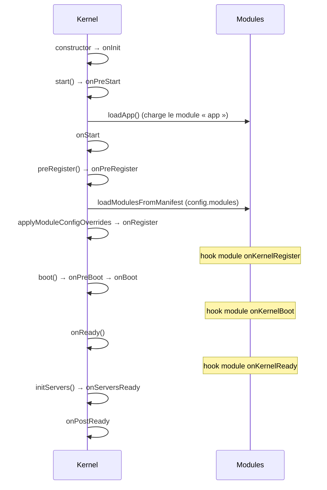
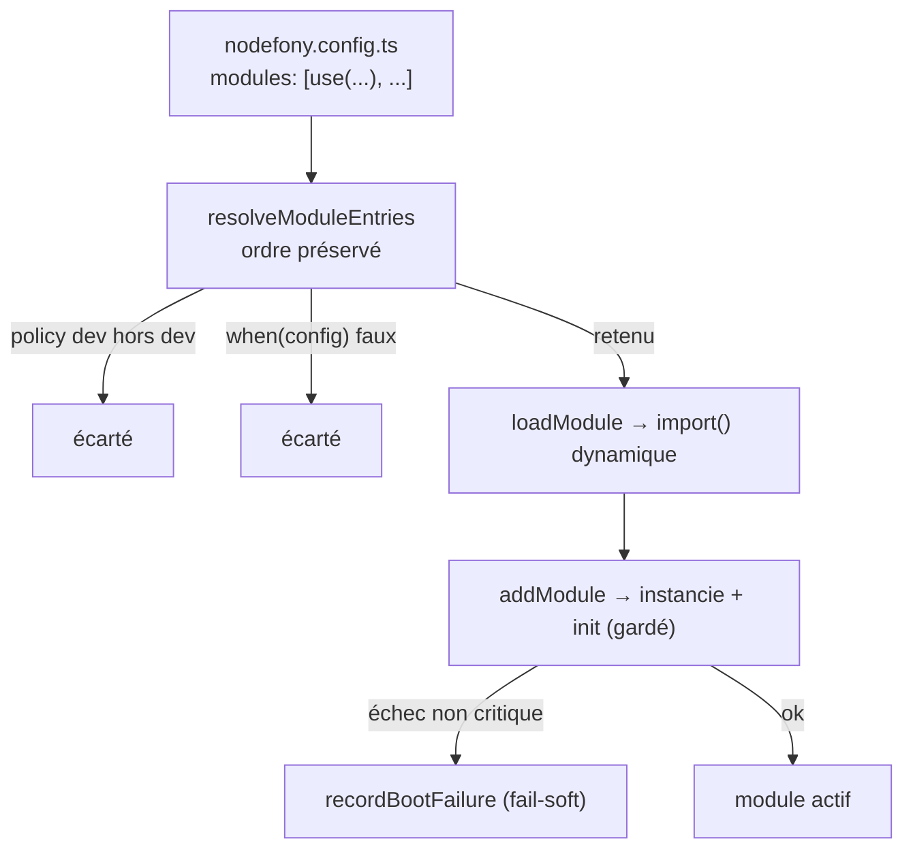

# Cycle de boot du Kernel

> Le `Kernel` est le chef d'orchestre : il lit la configuration, charge les modules dans l'ordre,
> instancie les services, ouvre les serveurs, puis arrête tout proprement. Le boot est une **chaîne de
> phases figées**, chacune émettant un événement que les modules peuvent capter. Chaque fait est ancré
> sur le code (`src/nodefony/src/kernel/Kernel.ts`).

## Schéma général

## Lexique

| Terme          | Sens                                                                                        |
| -------------- | ------------------------------------------------------------------------------------------- |
| Kernel         | Le noyau : cycle de vie, container DI, chargement des modules, serveurs.                    |
| Module         | Unité chargeable (`@nodefony/http`, `@nodefony/framework`…). L'app est elle-même un module. |
| Phase / hook   | Étape ordonnée du boot ; chaque phase émet un événement écoutable par les modules.          |
| Manifeste      | La liste `modules` de `nodefony.config.ts` (via `use()`), ordonnée = priorité de charge.    |
| Fail-soft      | Un module non critique qui échoue à booter ne tue pas le process.                           |
| DI / Container | Injection de dépendances : l'annuaire de services (voir la page dédiée).                    |

## Qu'est-ce que le boot — et pourquoi une chaîne de phases

Démarrer un framework fullstack, c'est orchestrer un ordre : lire la config avant de charger les
modules, charger les modules avant d'instancier leurs services, instancier les services avant d'ouvrir
les serveurs. Nodefony formalise cet ordre en **phases nommées**. Chaque module peut se greffer sur la
bonne phase (s'enregistrer, se câbler quand tout est prêt) sans connaître les autres — c'est ce qui
rend le système **modulaire** sans couplage d'ordre implicite.

## La vision Nodefony

Les événements de cycle de vie sont un **bitmask figé** (`Kernel.ts:222-234`). La chaîne réelle est
`start() → preRegister() → boot() → onReady() → initServers()`. Les hooks de module sont **mappés** sur
ces phases par `Module.setEvents()` (`src/nodefony/src/kernel/Module.ts:206`) — un module implémente
`onKernelRegister` / `onKernelBoot` / `onKernelReady` et le Kernel les appelle au bon moment. Les
phases sensibles passent par `fireLifecycle()` (`Kernel.ts:2513`), qui **garde chaque hook** par un
timeout et par la criticité du module : la résilience est native.

## Les phases, dans l'ordre

| #   | Événement        | Déclencheur (méthode)          | Ancrage                        |
| --- | ---------------- | ------------------------------ | ------------------------------ |
| 1   | `onInit`         | constructor (fin)              | `Kernel.ts:533`                |
| 2   | `onPreStart`     | `start()`                      | `Kernel.ts:637`                |
| —   | (loadApp)        | `start()` → `loadApp()`        | `Kernel.ts:646` (déf. `:1543`) |
| 3   | `onStart`        | `start()`                      | `Kernel.ts:668`                |
| 4   | `onPreRegister`  | `preRegister()`                | `Kernel.ts:699`                |
| —   | overrides config | `applyModuleConfigOverrides()` | `Kernel.ts:728`                |
| 5   | `onRegister`     | `preRegister()`                | `Kernel.ts:729`                |
| 6   | `onPreBoot`      | `boot()`                       | `Kernel.ts:803`                |
| 7   | `onBoot`         | `boot()`                       | `Kernel.ts:808`                |
| 8   | `onReady`        | `onReady()`                    | `Kernel.ts:830`                |
| 9   | `onServersReady` | `initServers()`                | `Kernel.ts:927`                |
| 10  | `onPostReady`    | `onReady()`                    | `Kernel.ts:853`                |
| —   | `onTerminate`    | (arrêt)                        | `Kernel.ts:233` (bitmask)      |

Mapping des hooks de module (`Module.ts:206-224`) : `onKernelRegister → onRegister` (`:212`),
`onKernelBoot → onBoot` (`:218`), `onKernelReady → onReady` (`:224`). En plus, un
`prependOnceListener("onPreBoot")` charge le `package.json` du module (`Module.ts:236`).

> [!TIP]
> Ordre d'usage courant : `onKernelRegister` pour **valider sa config** (ex. `defineXConfig`) et
> déclarer ses services ; `onKernelReady` pour **se câbler quand tout est booté** (les autres modules,
> l'ORM, le firewall sont prêts) — ex. le module `documentation` y enregistre ses providers `{{ }}`.

## Comment les modules sont choisis et chargés

Les modules ne sont pas découverts « magiquement » : ils sont **déclarés** dans `nodefony.config.ts`
sous `modules` (`nodefony.config.ts:100`), via des chaînes ou l'assistant `use(name, config, opts)`.
`loadApp()` branche `loadModulesFromManifest()` sur `onPreRegister` si un manifeste est présent
(`Kernel.ts:1616-1620`).

`resolveModuleEntries()` (`Kernel.ts:1091`) **préserve l'ordre** du tableau (= la priorité) et se
contente de **filtrer** : une entrée `policy: "dev"` est retirée hors dev (`:1114`), une entrée dont
`when(config)` est faux est écartée (`:1118`). Le chargement lui-même fait un `import()` dynamique
résolu depuis l'app (`Kernel.ts:1072`) → `addModule()` (`:1193`) instancie, stocke `modules[name]` et
appelle l'init du module sous garde (`:1205`). Un échec par entrée est **fail-soft**
(`recordBootFailure`, `Kernel.ts:1175`) : le process survit, l'erreur est consignée.

## Résilience — le boot ne gèle jamais

Un boot naïf `await`-e chaque hook de module. Un seul `init` qui **pend** (une file Redis offline qui
ne rejette jamais, un store bloqué) et le process reste figé indéfiniment, en attente du `SIGKILL` de
l'orchestrateur. Nodefony borne ça.

Les phases sensibles (`onPreRegister` → `onPostReady`) passent par `fireLifecycle()`
(`Kernel.ts:2513`) au lieu de `fireAsync` : chaque hook est exécuté **sous timeout** et son échec est
soumis à une **politique de criticité**. Le hot path HTTP/WS, lui, garde `emitAsync` nu — zéro timer,
zéro alloc (`Kernel.ts:2504-2505`).

- **Timeout par listener** : `NODEFONY_BOOT_TIMEOUT_MS` (env) sinon défaut par environnement —
  **dev 20 s, prod 60 s** (`Kernel.ts:2177-2183`). Large à dessein : il borne la _pendaison infinie_,
  pas la lenteur normale.
- **Alerte de lenteur** : un hook au-delà de `NODEFONY_BOOT_WARN_MS` (défaut **5 s**) émet un `NOTICE`
  nommant le hook lent, **sans le tuer** (`Kernel.ts:2189-2195`, `:2543`).
- **Fatal vs fail-soft** (`isBootErrorFatal`, `Kernel.ts:2197-2203`) : un échec est **fatal** si le
  module est **critique** ET (on est en **production** OU c'est une erreur de **configuration**
  `BootConfigurationError`) → le boot s'interrompt, le pod crashe, l'orchestrateur le redémarre
  (cloud-native). Sinon **fail-soft** : `WARNING`, le boot continue. La config est fatale **même en
  dev** : le fail-soft protège l'expérience de dev, pas une config cassée.

L'`init` **et la construction** (`new`) d'un service `@services([...])` passent par la même garde
(`guardServiceInitialize` / `serviceBootErrorFatal`, `Kernel.ts:2577`, `:2607`). Le code note le bug
corrigé : le `catch` du décorateur `@services` **avalait** tout échec en un simple `log(e,"ERROR")` —
jamais fatal même en prod, jamais remonté au `BootReport` : un boot amputé d'un service critique se
déclarait « UP » (`:2595-2600`).

## Le verdict de boot (`BootReport`) — savoir si on est vraiment « up »

`getBootReport()` (`Kernel.ts:2303`) agrège une **vérité unique**, recalculable pour Studio/IA. Le
constat clé : `booted` passe `true` dès `onBoot`, **avant** que les serveurs ne soient en écoute
(`initServers` à `onReady`). Confondre les deux faisait crier « dégradé » à tort pendant toute la
montée des serveurs (race vécue par la sonde DevSupervisor, `:2304-2308`). D'où la distinction :

- **`healthy = false`** uniquement si un **profil serveur** était attendu ET la mesure a été faite ET
  **aucun serveur** n'écoute (garde-fou 0-serveur, `:2329`). `bootServers === null` (pas encore mesuré)
  ≠ `[]` (mesuré, vraiment zéro).
- Des **modules ignorés seuls** laissent le boot `healthy` : **dégradé mais vivant**.

Le verdict est **toujours** loggé (prod incluse, indépendamment du `BootReporter` dev, `:2432`) en
trois formes :

| Verdict        | Sévérité  | Signification                                                          |
| -------------- | --------- | ---------------------------------------------------------------------- |
| `BOOT ok`      | `NOTICE`  | modules chargés, serveurs en écoute (URLs listées), journal du boot    |
| `BOOT dégradé` | `WARNING` | des modules ont échoué en **fail-soft** — le service tourne quand même |
| `BOOT ÉCHEC`   | `CRITIC`  | profil serveur mais **aucun serveur en écoute** (`healthy=false`)      |

Deux aides opérationnelles s'y greffent : une **remédiation** heuristique (un `import()` en échec type
« Cannot find package » ⇒ « dist périmé probable ⇒ `npm run clean && npm run build` », `:2412`), et un
**journal de boot** (compte des `ERROR`/`WARNING` du ring syslog, figé à `postReady`, `:2342`). En
multi-pod K8s, un `NOTICE` honnête avertit qu'un driver de vue **local** (memory/file) ne relit que
_ce_ pod — le core avertit, il ne devine ni le nombre de replicas ni la destination d'agrégation
(12-factor, `:2472-2477`).

## Arrêt propre — le drain borné (`terminate`)

Symétrique du boot : `terminate(code)` (`Kernel.ts:2833`) fire `onTerminate`, ce qui déclenche le
**drain** — bascule de la readiness → fermeture des WebSockets (code `1001`) → drain des requêtes
HTTP en vol → cleanup des services. Ce drain est borné par une **deadline globale** `shutdownDeadline`
(défaut **15 s**, choisi `<` grace period de l'orchestrateur, `:2826`) : si un listener pend (SSE
ouvert, store bloqué, module tiers), la deadline gagne la course, on **force la sortie code 1** — jamais
un process zombie qui attend le `SIGKILL` externe. Le rejet éventuel du drain est capturé **hors** de la
course pour ne pas devenir un `unhandledRejection` (`:2844-2851`), et le timer de deadline est `unref`
pour ne pas retenir l'event-loop si le drain finit avant (`:2867`).

## Pièges (symptôme → cause → correction)

| Symptôme                                     | Cause                                                                | Correction                                                            |
| -------------------------------------------- | -------------------------------------------------------------------- | --------------------------------------------------------------------- |
| `Cannot read properties of null` à l'import  | Déréférencement du kernel au top-level d'un `config.ts`              | Getter lazy / optional chaining (jamais eager)                        |
| Un module n'est pas chargé                   | `policy: "dev"` hors dev, ou `when(config)` faux                     | Vérifier l'entrée `use()` dans `nodefony.config.ts`                   |
| Ordre de service inattendu                   | Dépendances entre `@services([...])`                                 | L'ordre est un tri topologique (voir DI)                              |
| Boot figé, puis `SIGKILL` de l'orchestrateur | Un `init` qui pend (Redis/store offline) au-delà du timeout          | Vérifier l'infra ; ajuster `NODEFONY_BOOT_TIMEOUT_MS` si besoin       |
| Pod qui redémarre en boucle en prod          | Module **critique** en échec → boot fatal (voulu)                    | Corriger la cause ; en dernier recours, revoir la criticité du module |
| `BOOT ÉCHEC — aucun serveur en écoute`       | Profil serveur attendu, 0 serveur (port pris ? module http absent ?) | Lire les modules en échec listés + la remédiation                     |
| `shutdown deadline exceeded — forcing exit`  | Un listener `onTerminate` pend au-delà de `shutdownDeadline`         | Fermer proprement SSE/connexions ; ajuster la deadline                |

## Tests & couverture

Le boot est couvert par **343 cas** sur 4 fichiers (`src/nodefony/src/tests/`) : `Kernel` (118),
`KernelLifecycle` (80, les phases + la résilience), `KernelCommands` (40) et `Module` (105, le
chargement + les hooks). La couverture du `Kernel.ts` (~68 % lignes) reflète le poids des chemins
cluster/CLI moins sollicités en test unitaire ; `Module.ts` ~80 %. Photo régénérée depuis vitest
(`npm run coverage`).

## Pour aller plus loin

- Injection de dépendances et portées → `src/nodefony/docs/injection.md` · [container](../../src/nodefony/docs/container.md)
- Configuration (`defineConfig` / `env.ts`) → `docs/guides/configuration.md`
- Vue d'ensemble → [vue-ensemble](./vue-ensemble.md)
