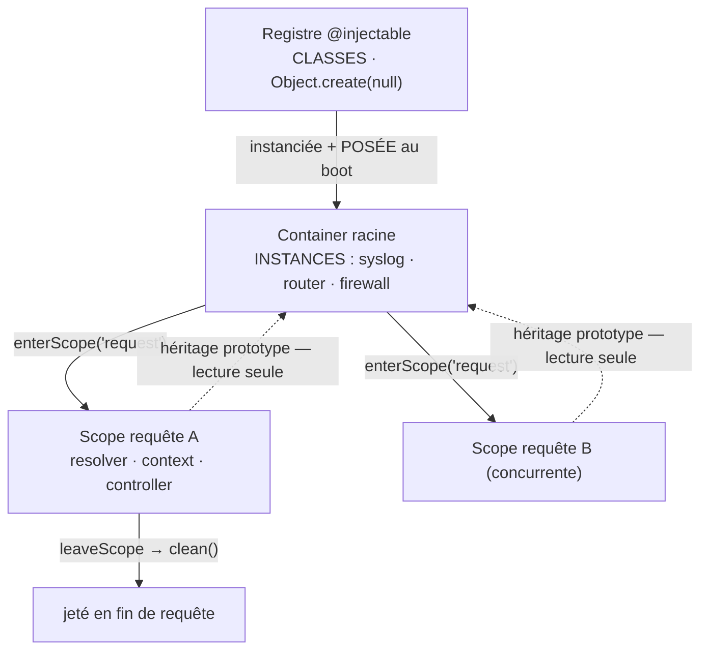
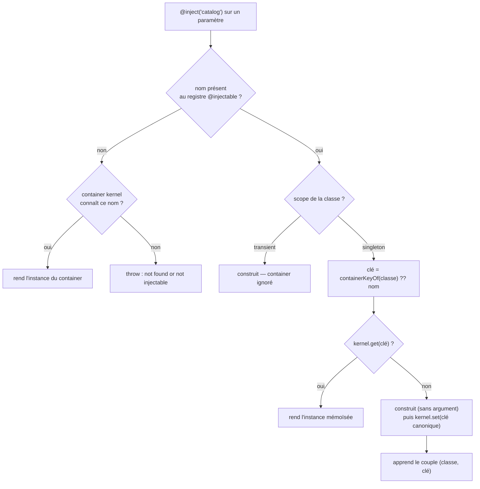
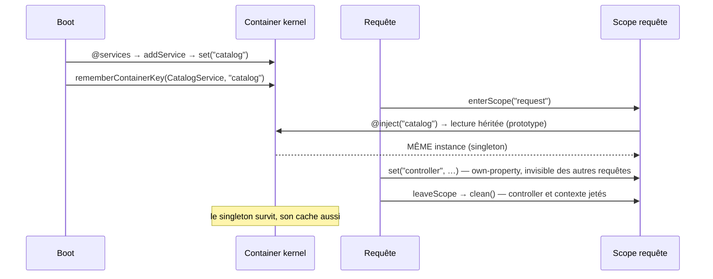

# Injection de dépendances et portées

> Un service ne construit pas ses dépendances : il les **reçoit**. Nodefony fournit un annuaire
> partagé (`Container`), un registre de classes injectables (`Injector`) et un **sous-container par
> requête** pour isoler l'état court. La question que cette page tranche : « combien d'instances de
> ce service existent, et qui les voit ? ». Ancré sur `src/nodefony/src/Container.ts` et
> `src/nodefony/src/kernel/injector/`.

📍 [Documentation](../index.md) › **Injection & portées**

## 🧠 Le modèle mental — deux annuaires, un sous-container

Le point qui coûte le plus de temps quand on l'ignore : Nodefony tient **deux annuaires
différents**, et ils ne portent pas les mêmes clés.



1. **Le registre** indexe des **classes** décorées `@injectable` (`injectables`, `injector.ts:25`).
2. **Le container** range des **instances** sous le nom passé à `super(nom, …)` (`Container.set()`,
   `Container.ts:195`).

Ces deux chaînes n'ont **aucune raison d'être égales** : la classe `Router` vit dans le container
sous `"router"`. Toute la mécanique de résolution existe pour réconcilier les deux.

### « Portée » veut dire quatre choses — les distinguer d'abord

Le mot est surchargé dans Nodefony. Les confondre produit des bugs qui ne plantent pas.

| Ce qu'on écrit                          | Ce que ça règle                                | Où c'est implémenté                                                               |
| --------------------------------------- | ---------------------------------------------- | --------------------------------------------------------------------------------- |
| `@injectable({ scope: "singleton" })`   | combien d'**instances** d'une classe           | `injector.ts:157`                                                                 |
| `container.enterScope("request")`       | un **sous-container** jeté en fin de requête   | `Container.ts:293`                                                                |
| `@Scope("singleton")` sur un controller | un controller partagé au lieu d'un par requête | `routerDecorators.ts:754`                                                         |
| `@RequireScope("users:write")`          | une **permission** — rien à voir avec le DI    | autorisation ([firewall](../../src/packages/@nodefony/security/docs/firewall.md)) |

Les trois premières sont **orthogonales** : un service `singleton` se lit depuis n'importe quel
scope-container. La quatrième est un faux ami — c'est un droit d'accès, pas un cycle de vie.

## 📖 Lexique

| Terme                 | Sens                                                                                             |
| --------------------- | ------------------------------------------------------------------------------------------------ |
| **DI**                | _Dependency Injection_ : fournir ses dépendances à un objet au lieu qu'il les construise.        |
| **Container**         | Annuaire nommé d'**instances** de services + arbre de paramètres pointés (`a.b.c`).              |
| **Registre**          | Annuaire de **classes** `@injectable`. Distinct du container, clés distinctes.                   |
| **Token / clé**       | Nom sous lequel une instance vit **réellement** dans le container — celui du `super(nom, …)`.    |
| **Scope (container)** | Sous-container créé par requête, hérité du parent par prototype, jeté à la fin.                  |
| **`singleton`**       | Portée DI : une instance, mémoïsée dans le container du kernel.                                  |
| **`transient`**       | Portée DI : une instance neuve à **chaque** résolution, le container est ignoré.                 |
| **Prototype**         | Mécanisme d'héritage JS — utilisé ici pour que la lecture parent soit résolue nativement par V8. |
| **Résolution**        | L'acte de trouver (ou fabriquer) l'instance qui satisfait une dépendance déclarée.               |
| **Tri topologique**   | Calcul d'un ordre d'instanciation où chaque service précède ceux qui le réclament.               |
| **ALS**               | _AsyncLocalStorage_ : le porteur Node.js de l'état par requête, hors du `this` d'un objet.       |

## Qu'est-ce que l'injection de dépendances — et le problème propre à un serveur

Une analogie : sans DI, chaque pièce d'une machine fabrique elle-même ses propres vis. Avec un
container, les vis sont dans un **casier commun** et chaque pièce déclare la taille qu'elle veut.

Le bénéfice n'est pas cosmétique : le code dépend d'un **contrat** (un nom, un type), plus d'une
construction. On peut donc remplacer une implémentation sans toucher au consommateur, et tester une
classe en lui donnant un faux.

Mais un serveur ajoute une contrainte que n'a pas un script :

- certaines choses sont **globales et durables** — le logger, le routeur, le firewall ;
- d'autres sont **par requête et éphémères** — le contexte HTTP, la session, le resolver ;
- et les requêtes tournent **en parallèle** dans un seul process.

D'où l'enjeu réel : la moindre fuite d'un objet « requête A » vers « requête B » est une faille de
confidentialité (session mélangée, données d'un autre utilisateur). Le design des portées existe
pour rendre cette fuite **structurellement impossible**, pas seulement improbable.

## La vision Nodefony — la portée par chaîne de prototypes

Le `Container` racine est créé au boot et le kernel y **pose** les services partagés. À chaque
requête, `Container.enterScope()` (`Container.ts:293`) ouvre un sous-container qui hérite du parent
par **chaîne de prototypes JS** (`Object.create(input.protoService.prototype)`, `Container.ts:127`).

Conséquence directe : lire un service parent depuis un scope (`scope.get("syslog")`) est une
**résolution native V8** — pas de hop logiciel, pas de wrapper, pas de remontée manuelle
(`Container.get()`, `Container.ts:212`).

Les services courts (resolver, context, controller) sont posés en **own-property** du scope
(`Scope.set()`, `Container.ts:466`) : ils **masquent** le parent localement sans jamais l'écrire.

### Le constat qui garantit l'isolation concurrente

`Scope` **redéfinit** `set()` pour n'écrire que sur son propre objet (`Scope.set()`,
`Container.ts:466`). La raison est explicite dans le code, et elle est vitale.

Depuis que le scope **adopte le prototype du parent** (optimisation qui évite deux allocations
mortes par requête, `Scope` constructeur, `Container.ts:453`), un `set()` de type `Container`
écrirait sur le **proto partagé**. Un service per-request deviendrait alors visible de **toutes** les
requêtes concurrentes.

La redéfinition en own-property est donc la barrière anti-fuite. Idem pour `Scope.remove()`
(`Container.ts:479`), qui ne touche jamais un service hérité.

> [!IMPORTANT]
> C'est ce qui rend l'isolation **structurelle** et non conventionnelle : ce n'est pas « on évite
> d'écrire dans le parent par discipline », c'est « écrire dans le parent depuis un scope est
> impossible par construction ».

## 🚀 Démarrage rapide

**Le besoin.** Ton app tient un catalogue produit coûteux à charger. Tu veux le charger **une fois**
et que tous les controllers lisent la **même** instance — pas une copie par requête, dont le cache
serait toujours vide.

Trois pièces suffisent : **le service**, **le module qui le déclare**, **le controller qui
l'injecte**. Les voici en un seul extrait — dans une vraie app, chaque partie vit dans le fichier
indiqué en commentaire.

```typescript
import {
  Service,
  Module,
  Container,
  Event,
  injectable,
  inject,
  services,
} from "nodefony";
import { Controller, controller, Get } from "@nodefony/framework";
import type { Context } from "@nodefony/http";

// ── nodefony/services/CatalogService.ts ─────────────────────────────────────
// Le nom du décorateur indexe la CLASSE au registre.
// Le nom du `super()` indexe l'INSTANCE au container. Les deux peuvent différer.
@injectable("catalog")
class CatalogService extends Service {
  // Cet état n'a de sens QUE s'il existe une seule instance —
  // c'est exactement ce que la portée `singleton` (défaut) garantit.
  private items: string[] | null = null;

  constructor(module: Module) {
    super(
      "catalog", // ← LA clé réelle dans le container
      module.container as Container,
      module.notificationsCenter as Event,
    );
  }

  // Chargement paresseux : payé à la 1ʳᵉ requête, jamais au boot.
  list(): string[] {
    if (this.items === null) {
      this.items = ["clavier", "souris", "écran"];
    }
    return this.items;
  }
}

// ── nodefony/controllers/CatalogController.ts ───────────────────────────────
@controller("/api/catalog")
class CatalogController extends Controller {
  constructor(
    context: Context,
    // Le nom retrouve la CLASSE au registre ; c'est ELLE qui dit
    // sous quelle clé l'instance vit dans le container.
    @inject("catalog") private catalog: CatalogService,
  ) {
    super("CatalogController", context);
  }

  @Get("/")
  async list() {
    // Même instance à chaque requête → le cache interne survit.
    return this.renderJson({ items: this.catalog.list() });
  }
}

// ── nodefony/index.ts (le module de l'app) ──────────────────────────────────
// @services instancie via le DI et POSE l'instance au container, au boot.
// L'ordre d'écriture n'est PAS l'ordre d'instanciation : il se calcule (voir plus bas).
@services([CatalogService])
class AppModule extends Module {
  static readonly path: string = import.meta.url;
}

export { CatalogService, CatalogController };
export default AppModule;
```

Le controller reçoit son `context` en premier argument — passé par le pipeline, il tombe dans le
fallback positionnel — et sa dépendance ensuite, résolue par le nom du `@inject`.

> [!WARNING]
> Le nom du `@inject` doit être celui du **registre** (`@injectable("catalog")`), pas celui de la
> classe. L'auto-injection par type existe (`injector.ts:304`) mais elle ne s'applique que si le
> **nom de la classe** est enregistré — ce qui n'est pas le cas dès qu'on écrit
> `@injectable("catalog")` sur une classe `CatalogService`. Nommer explicitement est la forme qui
> marche dans tous les cas.

### Ce qu'on observe

```bash
# Deux appels successifs : le second ne recharge rien (l'instance est partagée).
curl -s http://localhost:5151/api/catalog
# {"items":["clavier","souris","écran"]}

# Au boot, en mode debug, le service apparaît UNE fois sous sa clé réelle :
#   SERVICE ADD : catalog
```

> [!TIP]
> Le controller, lui, est **neuf à chaque requête** (défaut `"request"`,
> `Controller.scope`, `Controller.ts:119`). C'est voulu : il porte l'état de la requête. Le service
> injecté, lui, est partagé. Deux portées différentes dans le même appel — c'est normal.

## ⚙️ Les portées — mises en situation

Choisir en cinq secondes, puis lire la card correspondante.

| Ce que tu veux                                           | Ce que tu écris                            | Nombre d'instances           |
| -------------------------------------------------------- | ------------------------------------------ | ---------------------------- |
| un service partagé par toute l'app (cache, pool, client) | `@injectable()` (défaut)                   | **1** pour la vie du kernel  |
| un objet jetable sans état partagé                       | `@injectable({ scope: "transient" })`      | **1 par résolution**         |
| un état propre à **chaque requête**                      | rien à écrire — le pipeline ouvre le scope | **1 par requête**, puis jeté |
| un controller sans état, partagé (perf)                  | `@Scope("singleton")` sur la classe        | **1** pour la vie du kernel  |

### `singleton` — une instance, partagée par toute l'app

La portée par **défaut** (`injector.ts:158`). C'est ce que tu veux dès qu'un service porte un état
qui n'a de sens qu'unique : un cache, un compteur, une connexion, un pool.

La résolution suit un ordre précis (`Injector._resolveWithStack()`, `injector.ts:151`) :

1. le nom écrit dans `@inject` retrouve la **classe** au registre ;
2. la classe dit **où** son instance vit — clé apprise à la pose (`Injector.containerKeyOf()`,
   `injector.ts:100`) ;
3. si le container du kernel la porte, elle est **rendue telle quelle** (`injector.ts:171`) ;
4. sinon elle est construite **puis mémoïsée** sous sa clé canonique (`injector.ts:208`).

> [!WARNING]
> La mémoïsation range dans le container du **kernel** — jamais dans un cache statique (il fuirait
> d'un kernel à l'autre, tests compris). Corollaire assumé : **sans kernel, pas de mémoïsation
> possible** (`injector.ts:169`) → deux résolutions donnent deux instances. En test unitaire isolé,
> c'est le comportement attendu, pas un bug.

### `transient` — une instance neuve à chaque résolution

Le container est **entièrement ignoré** (`injector.ts:160`) : chaque résolution reconstruit. À
réserver aux objets sans état partagé, dont la duplication ne coûte rien et ne perd rien.

```typescript
@injectable({ scope: "transient" })
class RequestSigner extends Service {}
```

Piège de coût : `transient` sur un service qui ouvre une connexion, remplit un cache ou attache un
listener, c'est une fuite par requête. La portée décrit une intention, elle n'exonère pas du
nettoyage.

### `request` — le sous-container jeté en fin de requête

Ce n'est pas une portée DI : c'est un **niveau de container**. Tu n'as **rien à écrire** — le
pipeline HTTP/WS l'ouvre et le ferme pour toi.

- Déclaré une fois au boot (`Container.addScope()`, `http-kernel.ts:245`) ;
- ouvert à l'entrée de chaque requête (`Container.enterScope()`, `http-kernel.ts:636`) ;
- fermé au teardown (`Container.leaveScope()`, `http-kernel.ts:1062`), **y compris quand un hook
  lève** — le chemin d'erreur libère aussi le scope (`http-kernel.ts:1072`).

C'est là que vivent `resolver`, `context` et le `controller` per-request. Ils masquent le parent le
temps de la requête et disparaissent avec elle.

### `@Scope("singleton")` — le controller partagé, sous contrat strict

Un controller est **neuf par requête** par défaut. Le décorateur `Scope` (`routerDecorators.ts:754`)
permet d'en partager un seul, mis en cache par le routeur
(`Router.getSingletonController()`, `router.ts:161`).

Le gain est réel — plus d'instanciation ni de `initialize()` par requête — mais le **contrat est
strict** : l'action ne doit lire ni écrire **aucun** état de requête sur `this`. Tout passe par les
arguments décorés et les helpers, qui retrouvent la requête courante via l'ALS.

> [!CAUTION]
> Un champ muté par requête sur un controller `@Scope("singleton")` est une **data race
> silencieuse** entre deux requêtes concurrentes. Rien ne plante ; deux utilisateurs se marchent
> dessus. Le défaut per-request reste le bon choix tant que le profil ne prouve pas le contraire.

### Portées et concurrence — le tableau qui rassure

| Élément                          | Portée                       | Partagé entre requêtes ?            | Nettoyé quand ?                        |
| -------------------------------- | ---------------------------- | ----------------------------------- | -------------------------------------- |
| `syslog`, `router`, `firewall`   | Container racine             | **Oui** — lecture seule par requête | Au shutdown (`clean()` du kernel)      |
| Contrôleur, `context`, resolver  | Scope requête (own-property) | **Non** — isolé                     | `leaveScope` en fin de requête         |
| Service `@injectable` singleton  | Registre → mémoïsé au kernel | **Oui**                             | Vit tant que le kernel vit             |
| Service `@injectable` transient  | Aucune — neuf à chaque fois  | **Non**                             | Ramassé dès qu'il n'est plus référencé |
| Controller `@Scope("singleton")` | Cache du routeur             | **Oui** — d'où le contrat stateless | Vit tant que le kernel vit             |

### Situation 1 — « je veux un service partagé par toute l'app »

C'est le cas du Démarrage rapide. Rien à déclarer : le défaut est `singleton`.

```typescript
@injectable("catalog")
class CatalogService extends Service {}
```

| Deux controllers l'injectent…     | Ce qu'ils reçoivent                                         |
| --------------------------------- | ----------------------------------------------------------- |
| dans la **même** requête          | la **même** instance                                        |
| dans deux requêtes **parallèles** | la **même** instance (le cache est donc réellement partagé) |
| après un `leaveScope`             | la **même** instance — elle vit dans le container racine    |

### Situation 2 — « je veux un état propre à CHAQUE requête »

Le réflexe naturel est de chercher une portée `"request"` sur `@injectable`. **Elle n'existe pas** :
`DIScope` ne prend que `"singleton"` ou `"transient"` (`injector.ts:9`).

Ce n'est pas un manque, c'est un choix d'architecture : l'état par requête vit dans le
**scope-container** ou dans l'**ALS**, pas dans une portée de classe.

```typescript
// Dans un controller (per-request par défaut) : `this` EST déjà l'état de la requête.
@controller("/api/panier")
class PanierController extends Controller {
  private lignes: string[] = []; // sûr : une instance par requête
}
```

Pour un service qui doit lire la requête courante sans la recevoir en argument, la voie est l'ALS
(`RequestContext`), pas une nouvelle instance par requête. Le service reste `singleton` ; c'est la
**donnée** qui est per-requête, pas l'objet.

### Situation 3 — le contre-exemple piégeux : du per-request dans un singleton

C'est l'erreur qui ne se voit pas en développement, à un seul utilisateur.

```typescript
// ❌ PIÈGE — le contexte de la PREMIÈRE requête est capturé pour toujours
@injectable("audit")
class AuditService extends Service {
  private context: Context; // ← gelé à la première résolution
  constructor(module: Module, context: Context) {
    super("audit", module.container as Container);
    this.context = context;
  }
}

// ✅ Le service reste sans état de requête ; la requête arrive au moment de l'appel
@injectable("audit")
class AuditService extends Service {
  trace(context: Context, action: string): void {
    /* … */
  }
}
```

Deux mécanismes du moteur rendent la faute moins probable, sans l'empêcher :

- **une dépendance se résout SANS argument** — elle n'hérite jamais des arguments de son parent
  (`Injector._instantiateWithStack()`, `injector.ts:299`). Le bug vécu qui a motivé cette règle :
  `Fetch(module: Module)` construit avec un `HttpContext`, sans que TypeScript ne voie rien ;
- **le singleton se mémoïse** : capturer un contexte, c'est donc le geler pour toutes les requêtes
  suivantes — pas seulement pour la sienne.

## 🏗️ Architecture interne — comment une dépendance est résolue



### Le nœud du DI : registre de CLASSES vs container d'INSTANCES

`@injectable(nom)` indexe une classe dans un `Object.create(null)` (`injectables`, `injector.ts:25`)
— sans prototype, pour qu'aucun `toString` ou `__proto__` ne réponde comme un faux service.

Mais `super(nom, container)` range l'**instance** dans le container, sous un autre nom. Le décorateur
ne **peut pas** connaître ce second nom : il s'exécute au **chargement** de la classe, `super()`
seulement à la **construction**.

La solution est un apprentissage : au moment où le service est **posé** au container, le couple
(classe, clé) est enfin connu — il est mémorisé (`Injector.rememberContainerKey()`, `injector.ts:88`)
depuis `Module.addService()` (`Module.ts:346`) et `Kernel.addKernelService()` (`Kernel.ts:1048`).

Toute résolution ultérieure passe donc par la **classe**. Sans ce relais, `@inject("Router")`
interrogeait le container avec `"Router"` là où l'instance est rangée sous `"router"` : réponse
`null`, service **reconstruit silencieusement avec un cache vide**. Cinq des sept `@injectable` du
cœur divergent ainsi ; seul `HttpKernel` s'alignait, par coïncidence de casse.

### Deux sources de dépendances, une priorité

L'injecteur lit deux métadonnées (`Injector._instantiateWithStack()`, `injector.ts:270`) :

1. **`inject:services`** — posé par `@inject("nom")` (`inject()`, `kernelDecorator.ts:114`).
   **Prioritaire**, tableau creux indexé par position.
2. **`design:paramtypes`** — émis par TypeScript (`emitDecoratorMetadata`). Permet l'**auto-injection
   par type**, sans `@inject` explicite.

Un paramètre n'est auto-injecté que si son type est **enregistré** au registre ; sinon il reçoit
l'argument positionnel passé à la construction (`injector.ts:304`). C'est ce qui permet à un
controller de recevoir son `context` en premier argument tout en ayant des `@inject` ensuite.

### L'injection par propriété — présente dans le moteur, pas dans la surface publique

Le moteur applique une injection post-construction (`Injector._applyPropertyInjection()`,
`injector.ts:223`), alimentée par le décorateur `Inject` majuscule (`kernelDecorator.ts:143`) qui
écrit sur le **prototype** (là où `inject` minuscule écrit sur le constructeur).

En pratique, **préférer l'injection par constructeur** : elle est explicite, elle est couverte, et
c'est elle que le tri des services sait ordonner.

### Garde-fous du moteur

- **Dépendances circulaires** : la pile de résolution est propre à chaque arbre d'appel (copie par
  valeur, donc sûre en parallèle async) ; un nom déjà présent lève avec le **chemin complet**
  `A → B → A` (`injector.ts:262`).
- **Message actionnable** : quand un service `@injectable` absent du container est construit sans
  argument et que son constructeur casse, l'erreur nomme le demandeur et **la cause probable**
  — un ordre de déclaration (`injector.ts:188`).
- **`Fetch` « batteries incluses »** : déclaré **et** posé au container à la construction de
  l'injecteur (`injector.ts:57`). Le déclarer sans le poser laissait `kernel.get("Fetch")` vide,
  donc un `new Fetch()` à chaque résolution.

### Le cycle de vie, selon la portée



## 🧰 API du Container

| Méthode                           | Rôle                                                                                              |
| --------------------------------- | ------------------------------------------------------------------------------------------------- |
| `set(name, instance)`             | Enregistrer un service — racine : proto + own ; scope : own seulement (`Container.ts:195`)        |
| `get<T>(name)`                    | Résoudre un service — `null` si absent, narrower avant usage (`Container.ts:212`)                 |
| `has(name)` / `remove(name)`      | Test / suppression — la suppression **cascade** vers les scopes enfants (`Container.ts:225`)      |
| `addScope(name)`                  | **Déclarer** un type de scope, au boot (`Container.ts:272`)                                       |
| `enterScope(name)`                | **Ouvrir** une instance de scope — lève si non déclaré (`Container.ts:293`)                       |
| `leaveScope(scope)`               | Fermer et nettoyer une instance de scope (`Container.ts:312`)                                     |
| `scopeCount(name)`                | Instances vivantes — sonde de fuite bon marché (`Container.ts:330`)                               |
| `setParameters` / `getParameters` | Arbre pointé `a.b.c` ; côté scope, **merge profond** avec le parent (`Container.ts:500`)          |
| `clean()` / `reset()`             | Démontage / remise à zéro — après `clean()`, `get` rend `null` et `set` lève (`Container.ts:412`) |

Signatures complètes : générées depuis les TSDoc, jamais recopiées ici.

## 🧩 L'ordre des `@services([...])` se calcule, il ne se subit pas

`@services` instancie **séquentiellement** et pose chaque instance au container. Un service réclamé
par un autre doit donc exister **avant** lui — sinon le DI le reconstruit sans argument et son
constructeur casse.

Faire reposer ça sur l'ordre d'une liste écrite à la main est un piège documenté au code : déplacer
`HttpKernel` de trois lignes dans `@nodefony/http` suffisait à renvoyer un 499 sur **chaque** requête
(`orderServicesByDependencies()`, `serviceOrder.ts:71`).

Comme les dépendances sont déjà déclarées, l'ordre correct se **calcule** :

- **tri topologique stable** (Kahn) — à contrainte égale, l'ordre d'écriture est conservé, donc une
  liste déjà correcte sort **inchangée** (`serviceOrder.ts:100`) ;
- les entrées `string` (chemins à charger) et les classes hors registre **gardent leur position**
  (`serviceOrder.ts:79`) ;
- un cycle lève une erreur **nommant le cycle** (`serviceOrder.ts:125`).

Le tri est appliqué par le décorateur avant la boucle d'instanciation
(`services()`, `kernelDecorator.ts:48`). C'est l'équivalent du container compilé de Symfony ou de la
résolution de graphe de NestJS.

> [!NOTE]
> Le tri couvre les dépendances **déclarées dans la même liste**. Le message d'erreur de l'injecteur
> (`injector.ts:188`) reste le filet pour ce que le tri ne peut pas voir : une dépendance vers un
> autre module, ou une résolution au runtime.

## ⚡ Performance & mémoire

Nodefony est un framework runtime : ce chemin s'exécute à chaque requête. Trois choix assumés dans
`Container.ts`, tous motivés par ce fait.

- **Héritage par prototype plutôt que remontée logicielle** : lire un service parent depuis un scope
  est résolu par V8, sans code intermédiaire (`Container.ts:127`).
- **Adoption des protos parents par le scope** : évite deux closures et deux `Object.create` jetés à
  chaque requête (`Scope` constructeur, `Container.ts:453`).
- **`id` de scope = compteur monotone base 36**, pas un UUID v4 (`containerSeq`, `Container.ts:67`) :
  un appel crypto par requête pour une clé locale jamais exposée serait du gaspillage.
- **`Map` pour le bookkeeping des scopes**, pas un objet littéral `delete`-é (`Scopes`,
  `Container.ts:62`) : l'ajout/retrait à chaque requête fait « churner » la _shape_ d'un objet
  ordinaire et dégrade les inline caches V8.
- **Scopes alloués en lazy** — `null` tant qu'aucun `addScope` (`Container.ts:101`) : pas de bucket
  alloué d'office et jamais utilisé.

Côté portées, le coût se lit simplement :

| Portée                 | Coût par requête                                    |
| ---------------------- | --------------------------------------------------- |
| `singleton` résolu     | une lecture de propriété héritée — pas d'allocation |
| `transient`            | une construction **complète** à chaque résolution   |
| scope `request`        | un `Scope` + son `clean()` — le prix de l'isolation |
| controller per-request | une instanciation + `initialize()`                  |
| controller `@Scope`    | une lecture de `Map` (`router.ts:161`)              |

Toute modification de `Container.ts` ou du pipeline de requête passe par le gate mémoire
(`npm run test:memory` dans `@nodefony/http`) — un scope non libéré est une fuite qui grandit avec le
trafic. La sonde `scopeCount()` (`Container.ts:330`) existe pour la voir venir.

## ⚠️ Pièges (symptôme → cause → correction)

| Symptôme                                          | Cause (dans le code)                                                | Correction                                                             |
| ------------------------------------------------- | ------------------------------------------------------------------- | ---------------------------------------------------------------------- |
| Service reconstruit, cache vide, **aucun crash**  | Nom `@inject` ≠ clé container, résolution avant apprentissage       | Vérifier le `super(nom)` réel ; déclarer le service via `@services`    |
| Deux instances d'un `singleton` en test           | Pas de kernel → pas d'endroit où mémoïser (`injector.ts:169`)       | Attendu hors kernel ; monter un kernel de test si l'unicité est testée |
| État d'une requête visible dans une autre         | Écriture sur le container **parent** au lieu du scope               | Toujours `scope.set` per-request — jamais `container.set`              |
| `Scope "X" not declared`                          | `enterScope("X")` sans `addScope("X")` au boot (`Container.ts:296`) | Déclarer le scope au boot                                              |
| Fuite mémoire, `scopeCount` qui monte             | `leaveScope` non appelé (pipeline court-circuité)                   | Le kernel le fait aux deux sorties — ne pas contourner le teardown     |
| `Circular dependency detected: A → B → A`         | Cycle de résolution (`injector.ts:262`)                             | Casser le cycle : repenser la dépendance, ou la résoudre à l'appel     |
| `Circular service dependency in @services([...])` | Cycle entre services d'une même liste (`serviceOrder.ts:125`)       | Idem — un cycle n'a pas d'ordre valide                                 |
| 499 / `Cannot read properties of undefined`       | Un service posé après son consommateur                              | Rien à faire si la dépendance est **déclarée** — sinon la déclarer     |
| Une instance neuve à chaque résolution            | `@injectable({ scope: "transient" })` non voulu (`injector.ts:160`) | Repasser en `singleton` (le défaut)                                    |
| Deux utilisateurs voient les données de l'autre   | Champ muté sur un controller `@Scope("singleton")`                  | Retirer l'état de `this`, ou revenir au défaut per-request             |
| `@inject()` sans nom ne résout rien               | `design:paramtypes` absent selon le mode d'exécution                | Toujours passer le nom explicite : `@inject("catalog")`                |
| Un service `@services` manque au container        | Son erreur de boot a été rattrapée par la politique de criticité    | Lire les `ERROR` du boot ; vérifier avec `container.has(...)`          |

## 📡 Observabilité

L'identité réelle des services se vérifie **depuis l'intérieur du serveur** — un test HTTP ordinaire
ne la voit pas, parce qu'un doublon ne casse rien de visible : chaque copie « marche », seul son état
est dupliqué et perdu.

Le module de test expose une sonde (`DiController.probe()`, `DiController.ts:36`) qui répond à la
seule question qui compte : **les consommateurs d'un service partagent-ils la même instance ?** Elle
ne renvoie que des booléens d'identité, jamais un objet de service.

## 🧪 Tests & couverture

Trois familles couvrent la brique — les compteurs exacts vivent dans la carte de l'aperçu, régénérée
depuis vitest, jamais figés ici.

- **unitaires** — `Container.test.ts` et `Injector.test.ts` (`src/nodefony/src/tests/`) : le
  container, les scopes, la résolution, les portées, la détection de cycle. Côté framework,
  `scope.test.ts` (`src/packages/@nodefony/framework/nodefony/tests/unit/`) couvre le scope de
  controller : défaut `"request"`, `@Scope("singleton")`, cache de la **promesse** de création (deux
  requêtes concurrentes n'instancient pas deux fois), et dégradation en per-request sans routeur.
- **attaque (red-team)** — `injector.attack.test.ts` et `services.attack.test.ts`
  (`src/nodefony/src/tests/`) : registre sans prototype (aucun `toString`/`__proto__` ne doit
  répondre comme un service), non-propagation des arguments aux dépendances, résolution circulaire.
  `scope.attack.test.ts` exerce le scope de controller en conditions hostiles.
- **intégration (serveur réel)** — `di-singleton.test.ts`
  (`src/packages/@nodefony/http/nodefony/tests/integration/`) : la sentinelle. Elle interroge la
  sonde DI **dans le process serveur** et échoue si un consommateur détient une instance privée. Son
  garde-fou d'honnêteté : sans consommateur observé, « tous partagent » serait vrai par vacuité — le
  test l'exige explicitement.

Ce qui **n'existe pas** : pas de banc de charge dédié au DI. Le chemin chaud (lecture héritée par
prototype) est couvert par les bancs de charge HTTP généraux et par le gate mémoire, qui verrait un
scope non libéré. Charge et dimensionnement → skill `nodefony-load-test` ; gate mémoire →
`nodefony-check-memory-health`.

Couverture : `npm run coverage` dans `src/nodefony`.

## 🔗 Pour aller plus loin

- ⬆️ **Retour au hub** : [Toute la documentation](../index.md)
- 🧭 **Pages sœurs** : [Cycle de boot du Kernel](cycle-boot-kernel.md) · [Pipeline d'une requête](pipeline-requete.md)

- Quand et dans quel ordre le container racine est peuplé → [cycle-boot-kernel](cycle-boot-kernel.md)
- Où le scope de requête s'ouvre et se ferme → [pipeline-requete](pipeline-requete.md)
- La brique de base injectée → [service](../../src/nodefony/docs/service.md)
- L'API du cœur (Kernel, Module, CliKernel) → [kernel](../../src/nodefony/docs/kernel.md)
- Vue d'ensemble de l'architecture → [vue-ensemble](vue-ensemble.md)
