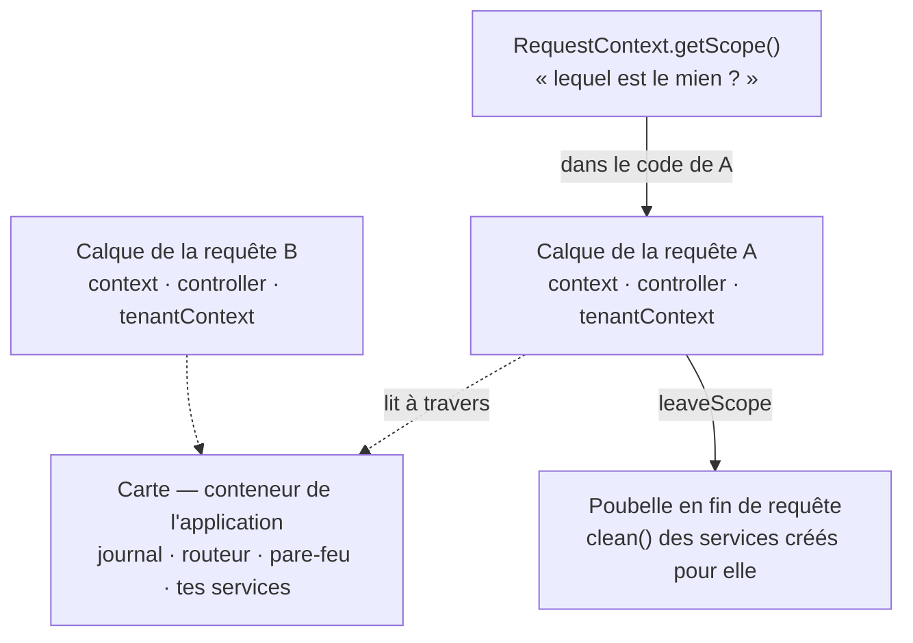
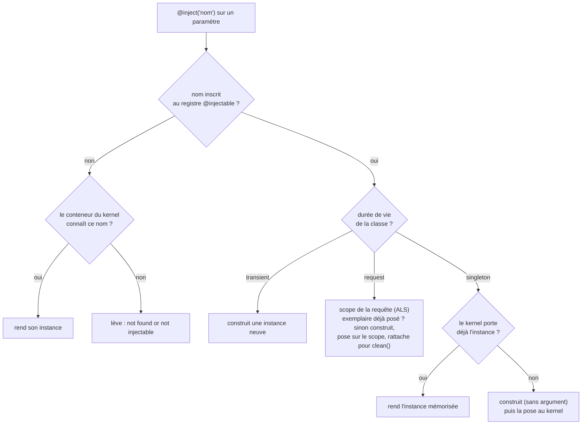
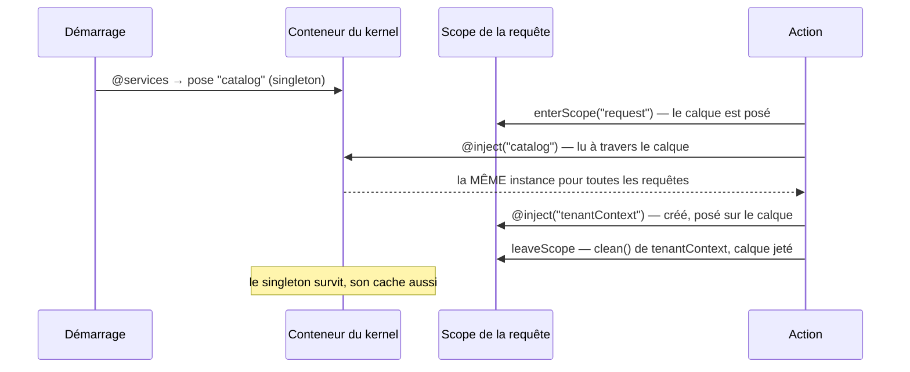

# Injection de dépendances et portées

> Chaque requête reçoit **son propre conteneur de services**, posé comme un calque transparent sur
> celui de l'application : elle y lit tout, n'écrit que sur le sien, et le calque part à la
> poubelle quand la réponse est partie. Cette page explique ce calque, les trois durées de vie d'un
> service (`singleton`, `transient`, `request`) et la façon d'atteindre « le calque de MA requête »
> depuis n'importe quel code. Ancré sur `src/nodefony/src/Container.ts`,
> `src/nodefony/src/kernel/injector/` et `src/nodefony/src/runtime/RequestContext.ts`.

📍 [Documentation](../index.md) › **Injection & portées**

## 🧠 Le modèle mental — la carte et les calques

Imagine une **carte imprimée** affichée au mur : c'est le conteneur de l'application, avec le
journal, le routeur, le pare-feu, tes services partagés. Chaque requête qui arrive pose dessus un
**calque transparent** — son _scope_.

- **À travers le calque, on lit toute la carte** : depuis une requête, `get("router")` rend le
  routeur de l'application.
- **On dessine sur le calque, jamais sur la carte** : ce qu'une requête pose (`set`) ne concerne
  qu'elle.
- **Deux requêtes, deux calques** : même lancées au même instant, elles ne voient jamais le dessin
  de l'autre.
- **En fin de requête, le calque part à la poubelle** : tout ce qui était dessiné dessus disparaît,
  et les services créés pour elle sont nettoyés.

Reste une question : dans un code qui ne reçoit pas la requête en argument, **lequel de ces calques
est le mien ?** C'est le contexte asynchrone de la requête (`RequestContext`, bâti sur
l'`AsyncLocalStorage` de Node) qui répond, par `RequestContext.getScope()`.



Ce modèle n'est pas une image : c'est exactement la mécanique du code. Un scope est un objet dont
le **prototype** est le conteneur de l'application — la lecture remonte la chaîne de prototypes de
JavaScript, l'écriture reste sur l'objet du scope (voir
[Le mécanisme](#le-mécanisme--une-chaîne-de-prototypes)).

## ❓ Les quatre questions d'une portée

Une « portée » répond à quatre questions. Les voici pour chaque durée de vie qu'un objet peut avoir.

| Durée de vie                      | Combien d'instances ?                 | Qui la voit ?            | Quand meurt-elle ?                        | Comment je l'obtiens ?                                     |
| --------------------------------- | ------------------------------------- | ------------------------ | ----------------------------------------- | ---------------------------------------------------------- |
| service `singleton` (défaut)      | **une** pour toute l'application      | toutes les requêtes      | à l'arrêt de l'application                | `@inject("nom")`                                           |
| service `transient`               | **une par résolution**                | celui qui l'a demandée   | quand plus rien ne la référence           | `@inject("nom")`                                           |
| service `request`                 | **une par requête** (créée si besoin) | la requête qui l'a créée | à la fin de la requête (`clean()` appelé) | `@inject("nom")`, ou `RequestContext.getScope()?.get(nom)` |
| objet posé à la main sur le scope | une, posée par ton code               | la requête qui l'a posée | à la fin de la requête (sans `clean()`)   | `RequestContext.getScope()?.get(nom)`                      |
| contrôleur (défaut)               | **un par requête**                    | la requête qu'il sert    | à la fin de la requête                    | construit par le routeur                                   |
| contrôleur `@Scope("singleton")`  | **un** pour toute l'application       | toutes les requêtes      | à l'arrêt de l'application                | construit par le routeur, mis en cache                     |

> [!IMPORTANT]
> **En WebSocket, « la requête » est la CONNEXION.** Un scope est ouvert au handshake et refermé à la
> fermeture de la socket : tous ses messages, et toutes ses invocations `api.request` — concurrentes
> comprises —, partagent le même calque et les mêmes services `request`. N'y poser que ce qui vaut
> pour la connexion entière.

### « Portée » veut dire cinq choses — les distinguer d'abord

Le mot est surchargé dans Nodefony. Les confondre produit des bugs qui ne plantent pas.

| Ce qu'on écrit                          | Ce que ça règle                                           | Où c'est implémenté                                                               |
| --------------------------------------- | --------------------------------------------------------- | --------------------------------------------------------------------------------- |
| `@injectable({ scope: "request" })`     | la **durée de vie** d'un service (`DIScope`)              | `DIScope` (`injector.ts:27`)                                                      |
| `RequestContext.getScope()`             | le **calque** de la requête en cours (un `Scope`)         | `RequestContext.getScope()` (`RequestContext.ts:232`)                             |
| `Injector.getScope("nom")`              | la durée de vie **déclarée** d'un service — pas un calque | `Injector.getScope()` (`injector.ts:132`)                                         |
| `@Scope("singleton")` sur un contrôleur | un contrôleur partagé au lieu d'un par requête            | `Scope()` (`routerDecorators.ts:777`)                                             |
| `@RequireScope("users:write")`          | une **permission** — rien à voir avec l'injection         | autorisation ([firewall](../../src/packages/@nodefony/security/docs/firewall.md)) |

Les quatre premières parlent de durée de vie ; la cinquième est un faux ami — c'est un droit
d'accès.

## 🚀 Démarrage rapide

**Le besoin.** Ton application sert plusieurs clients, reconnus à l'en-tête `x-tenant`. Plusieurs
morceaux de code ont besoin de savoir « quel client pour CETTE requête ». Une variable globale ne
marche pas : Node sert toutes les requêtes dans un seul processus, et pendant que la requête d'un
client attend sa base de données, celle d'un autre s'exécute et l'écraserait.

La réponse : un service de portée `request` — un exemplaire par requête, posé sur son calque, lu par
le contrôleur qui l'injecte **et** par une fonction qui ne reçoit rien.

```typescript
import { Service, injectable, inject, RequestContext } from "nodefony";
import type { Scope } from "nodefony";
import { Controller, controller, Get } from "@nodefony/framework";
import type { Context, HttpContext } from "@nodefony/http";

// ── nodefony/services/TenantContext.ts ──────────────────────────────────────
// Un exemplaire PAR REQUÊTE : créé à sa première résolution dans la requête,
// rangé sur son calque, nettoyé quand elle se termine.
@injectable({ name: "tenantContext", scope: "request" })
class TenantContext extends Service {
  readonly id: string;

  // Un service `request` reçoit le scope de la requête en premier argument.
  constructor(scope: Scope) {
    // Le MÊME nom qu'au décorateur : c'est la clé de l'exemplaire sur le calque.
    super("tenantContext", scope, false);
    const header =
      RequestContext.getContext<HttpContext>()?.request.getHeader("x-tenant");
    this.id = typeof header === "string" ? header : "public";
  }

  override clean(syslog = false): void {
    // Libérer ici ce que la requête a ouvert : connexion, verrou, fichier.
    super.clean(syslog);
  }
}

// ── n'importe où, sans recevoir la requête ──────────────────────────────────
// L'ALS dit quel calque est celui de la requête qui exécute ce code.
function currentTenantLabel(): string {
  const tenant = RequestContext.getScope()?.get<TenantContext>("tenantContext");
  return tenant ? `client ${tenant.id}` : "hors requête";
}

// ── nodefony/controllers/MeController.ts ────────────────────────────────────
@controller("/api/me")
class MeController extends Controller {
  constructor(
    context: Context,
    @inject("tenantContext") private tenant: TenantContext,
  ) {
    super("MeController", context);
  }

  @Get("/")
  whoami() {
    return this.renderJson({
      tenant: this.tenant.id,
      label: currentTenantLabel(),
    });
  }
}

export { TenantContext, MeController, currentTenantLabel };
```

Rien à déclarer dans le module : importer le contrôleur suffit, et le service n'est construit que
par les requêtes qui le réclament. Une requête qui ne le résout pas ne paie rien.

### Ce qu'on observe

```bash
curl -s -H "x-tenant: acme"   http://localhost:5151/api/me
# {"tenant":"acme","label":"client acme"}
curl -s -H "x-tenant: globex" http://localhost:5151/api/me
# {"tenant":"globex","label":"client globex"}
```

Lancées en même temps, mille fois, les deux requêtes ne se mélangent jamais : chacune lit son
propre calque. La preuve n'est pas ce `curl` : c'est le test
`requestScopeIsolation.test.ts` (`src/nodefony/src/tests/`), qui fait se chevaucher deux requêtes
autour d'une attente, montre qu'une variable de module est écrasée par l'autre, et que le scope,
lui, rend à chacune la sienne.

> [!TIP]
> Le contrôleur est lui aussi **neuf à chaque requête** (défaut `"request"`, `Controller.scope`,
> `Controller.ts:153`) : c'est ce qui lui permet d'injecter un service `request`. Un contrôleur
> `@Scope("singleton")` qui le tenterait est refusé **au démarrage**.

## 📖 Lexique

| Terme                  | Sens                                                                                                           |
| ---------------------- | -------------------------------------------------------------------------------------------------------------- |
| **DI**                 | _Dependency Injection_ : fournir ses dépendances à un objet au lieu qu'il les construise.                      |
| **Conteneur**          | Annuaire nommé d'**instances** de services (`Container`). Celui du kernel est la « carte ».                    |
| **Scope (calque)**     | Conteneur propre à une requête (`Scope`) : hérite de la carte par prototype, jeté en fin de requête.           |
| **Registre**           | Annuaire de **classes** `@injectable`. Distinct du conteneur, clés distinctes.                                 |
| **Clé**                | Nom sous lequel une instance vit **réellement** dans un conteneur — celui du `super(nom, …)`.                  |
| **`singleton`**        | Durée de vie : une instance, rangée dans le conteneur du kernel à sa première résolution.                      |
| **`transient`**        | Durée de vie : une instance neuve à **chaque** résolution.                                                     |
| **`request`**          | Durée de vie : une instance par requête (par connexion en WebSocket), rangée sur son scope, nettoyée à sa fin. |
| **Dépendance captive** | Un service qui vit plus longtemps qu'une dépendance qu'il garde — refusée par l'injecteur.                     |
| **ALS**                | _AsyncLocalStorage_ : le mécanisme de Node qui transporte l'état d'une requête à travers ses `await`.          |
| **Prototype**          | Mécanisme d'héritage de JavaScript — la lecture d'un scope remonte vers la carte par lui.                      |
| **Résolution**         | L'acte de trouver (ou fabriquer) l'instance qui satisfait une dépendance déclarée.                             |

## Pourquoi — le problème propre à un serveur Node

Une analogie : sans injection, chaque pièce d'une machine fabrique elle-même ses vis. Avec un
conteneur, les vis sont dans un **casier commun** et chaque pièce déclare celle qu'elle veut. Le code
dépend d'un **contrat** (un nom, un type), plus d'une construction : on remplace une implémentation
sans toucher au consommateur, et on teste une classe en lui donnant un faux.

Un serveur Node ajoute une contrainte qu'un script n'a pas : **un seul processus sert des centaines
de requêtes entrelacées**. À chaque `await` — une requête SQL, un appel réseau —, Node passe à une
autre requête. Certaines choses sont globales et durables (le journal, le routeur) ; d'autres
appartiennent à UNE requête (le client servi, l'utilisateur, une transaction). La moindre fuite de
l'une vers l'autre est une faille de confidentialité.

| Approche                                                           | Ce qui se passe                                                                                            |
| ------------------------------------------------------------------ | ---------------------------------------------------------------------------------------------------------- |
| une variable de module `currentTenant`                             | la requête B l'écrase pendant que A attend : A lit le client de B — une fuite silencieuse et intermittente |
| passer `tenant` en paramètre partout                               | chaque signature change ; ça casse aux rappels de bibliothèques tierces et aux écouteurs d'événements      |
| un singleton qui lit la requête **à l'appel** par `RequestContext` | juste : le singleton ne garde rien, il lit « la requête courante » au moment où on l'appelle               |
| un service `request`                                               | juste : un objet par requête, avec un cycle de vie — créé si besoin, nettoyé à la fin                      |

Les deux dernières lignes se combinent : **l'ALS porte les données** de la requête (son
identifiant, l'utilisateur, le client reconnu), la **portée `request` porte les objets à cycle de
vie** (une connexion de base liée au client, un journal d'audit à vider en fin de requête). La
plupart des applications n'ont besoin que de la première ; la seconde sert quand un objet doit
**naître et mourir avec** la requête.

## Le mécanisme — une chaîne de prototypes

Le conteneur du kernel est créé au démarrage, et le kernel y **pose** les services partagés. Le
pipeline HTTP déclare au démarrage un type de scope `"request"` (`Container.addScope()`,
`Container.ts:224`), puis, à chaque requête, en ouvre une instance (`Container.enterScope()`,
`Container.ts:245`).

Le scope **adopte le prototype du conteneur parent** (`Scope`, `Container.ts:344`) : son annuaire
de services est un objet dont le prototype est celui de la carte. Trois conséquences, toutes
voulues :

- **Lire, c'est remonter la chaîne** : `scope.get("syslog")` trouve le journal de l'application sans
  code intermédiaire (`Container.get()`, `Container.ts:168`). Un service ajouté à la carte **après**
  l'ouverture d'un scope y est aussitôt visible.
- **Écrire, c'est rester sur le calque** : `Scope.set()` (`Container.ts:389`) n'écrit que sur
  l'objet du scope. Le `set()` du conteneur racine, lui, écrit sur le prototype partagé
  (`Container.set()`, `Container.ts:151`) — c'est pourquoi `Scope` le **redéfinit** : sans cette
  redéfinition, un service posé pour une requête deviendrait visible de toutes les requêtes
  concurrentes.
- **Retirer ne touche que le calque** : `Scope.remove()` (`Container.ts:402`) ne retire qu'une clé
  posée sur le scope, jamais un service hérité.

> [!IMPORTANT]
> L'isolation est **structurelle**, pas une discipline : depuis un scope, aucune méthode du
> conteneur n'écrit sur la carte. Et la **configuration** partagée est protégée de la même façon :
> elle est figée à la fin du démarrage, et une requête qui veut sa variante pose un calque de
> configuration sur liste blanche
> ([ADR-0012](../adr/0012-calque-configuration-par-requete.md),
> [Configurer une application](../guides/configuration.md#figée-au-démarrage--et-surchargée-par-requête)).

Ce qu'un scope sait encore faire :

- **se fermer une fois** : `Container.leaveScope()` (`Container.ts:264`) le retire du registre
  **avant** de le nettoyer — un `clean()` qui lèverait ne l'épinglerait pas. Un scope fermé ne se
  rouvre pas : `closed` vaut `true` (`Container.ts:105`), `get()` rend `null`, `set()` lève ;
- **porter un calque sur le calque** : un scope ouvert depuis un scope chaîne sur les services de
  **son** parent (`Container.ts:365`), donc voit ce que la requête a posé ;
- **refuser `reset()`** : sur un scope, il lèverait plutôt que de le détacher en silence de sa carte
  (`Scope.reset()`, `Container.ts:375`) ;
- **ne pas confondre un nom de JavaScript avec un service** : les prototypes n'héritent pas
  d'`Object.prototype` (`createProto()`, `Container.ts:32`), donc `has("toString")` rend `false`.

## ⚙️ Les portées — mises en situation

Choisir en cinq secondes, puis lire la section correspondante.

| Ce que tu veux                                           | Ce que tu écris                           | Nombre d'instances                 |
| -------------------------------------------------------- | ----------------------------------------- | ---------------------------------- |
| un service partagé par toute l'application (cache, pool) | `@injectable("nom")` (défaut `singleton`) | **1** pour la vie de l'application |
| un objet jetable, sans état partagé                      | `@injectable({ scope: "transient" })`     | **1 par résolution**               |
| un objet qui naît et meurt avec la requête               | `@injectable({ scope: "request" })`       | **1 par requête**, puis nettoyé    |
| une donnée de la requête, lue partout                    | `RequestContext` (voir ci-dessous)        | aucune instance : une donnée       |
| un contrôleur sans état, partagé (performance)           | `@Scope("singleton")` sur la classe       | **1** pour la vie de l'application |

### `singleton` — une instance, partagée par toute l'application

La portée par **défaut**. C'est ce que tu veux dès qu'un service porte un état qui n'a de sens
qu'unique : un cache, un compteur, une connexion, un pool.

La résolution suit un ordre précis (`Injector._resolveWithStack()`, `injector.ts:241`) :

1. le nom écrit dans `@inject` retrouve la **classe** au registre ;
2. la classe dit **où** son instance vit — clé apprise à la pose
   (`Injector.containerKeyOf()`, `injector.ts:128`) ;
3. si le conteneur du kernel la porte, elle est **rendue telle quelle** ;
4. sinon elle est construite **puis mémorisée** sous sa clé canonique.

> [!WARNING]
> La mémorisation range dans le conteneur du **kernel** — jamais dans un cache statique, qui fuirait
> d'un kernel à l'autre, tests compris. Corollaire assumé : **sans kernel, pas de mémorisation** →
> deux résolutions donnent deux instances. En test unitaire isolé, c'est le comportement attendu.

### `transient` — une instance neuve à chaque résolution

Chaque résolution reconstruit ; aucun conteneur n'est consulté. À réserver aux objets sans état
partagé, dont la duplication ne coûte rien et ne perd rien.

```typescript
@injectable({ scope: "transient" })
class RequestSigner extends Service {}
```

Une dépendance `transient` vit aussi longtemps que celui qui la détient : un singleton qui la
reçoit la garde pour toujours. Et `transient` sur un service qui ouvre une connexion ou attache un
écouteur, c'est une fuite par résolution — la portée décrit une intention, elle n'exonère pas du
nettoyage.

### `request` — un exemplaire par requête

`@injectable({ scope: "request" })` donne **un exemplaire par requête** — par **connexion** en
WebSocket. Le contrat, tel que l'injecteur l'applique (`Injector._resolveRequestScoped()`,
`injector.ts:323`) :

- **créé à la première résolution** dans la requête, puis rendu à chaque résolution suivante de la
  même requête ; une requête qui ne le résout pas ne paie rien ;
- **rangé sur le scope** de la requête que l'ALS désigne, sous la clé de son `super(nom, …)` ;
- **son constructeur reçoit le scope** en premier argument — c'est le conteneur à passer à
  `super()` ;
- **nettoyé à la fermeture** : son `clean()` est appelé une fois, dans l'ordre **inverse** des
  créations (un service créé après ceux dont il dépend est nettoyé avant eux), par `Scope.clean()`
  (`Container.ts:468`). Un `clean()` qui lève est journalisé et n'empêche pas les suivants ;
- **refusé hors d'une requête** : résolu au démarrage, dans une commande, ou dans une promesse qui
  continue après la réponse, il lève en nommant la cause.

> [!WARNING]
> **Un singleton ne peut pas dépendre d'un service `request`** : mémorisé à sa première
> construction, il garderait l'exemplaire de la première requête et le servirait à toutes les
> suivantes. L'injecteur refuse cette **dépendance captive** au démarrage, par analyse des
> déclarations (`Injector.assertNoCaptiveDependency()`, `injector.ts:453`), et à la résolution pour
> le reste. Le message propose trois remèdes : passer le détenteur en `request`, en `transient`, ou
> lire le service à l'appel par `RequestContext.getScope()`.

Quatre règles pratiques :

- **Donne le même nom au décorateur et au `super()`** (`@injectable({ name: "tenantContext", … })`
  et `super("tenantContext", …)`). La clé cherchée sur le scope est apprise à la première création :
  avec deux noms différents, un exemplaire posé à la main n'est trouvé que sous l'un ou l'autre selon
  l'histoire du processus.
- **Ne réutilise pas le nom d'un objet du pipeline ou d'un service du kernel** (`context`,
  `controller`, `router`…) : l'injecteur refuse de le masquer pour toute la requête, et le dit.
- **`clean()` n'est pas attendu** : la fermeture reste synchrone. Un `async clean()` part en arrière-
  plan et son rejet est journalisé. Ce qui doit être **validé** (un `COMMIT`) appartient à l'action ;
  `clean()` est le filet qui annule et libère.
- **`clean()` s'exécute hors du contexte asynchrone de la requête** (en HTTP) : y lire le scope par
  `this.container`, pas par `RequestContext`.

Un service `request` peut être listé dans `@services([...])` : il y est **déclaré** (sa chaîne de
dépendances est vérifiée au démarrage) sans être instancié. `module.addService()`, qui construit
tout de suite, le refuse.

### Le scope de la requête — ce que le pipeline y pose

Tu n'ouvres jamais un scope toi-même dans une application : le pipeline le fait.

- **HTTP** : ouvert à l'entrée de chaque requête par `HttpKernel.handle()` (`enterScope`, `http-kernel.ts:734`),
  refermé au démontage **après** les hooks `onAfterResponse` et `onFinish`
  dans `HttpKernel.teardownHttp()` (`leaveScope`, `http-kernel.ts:1242`) — y compris quand un hook
  lève (`leaveScope`, `http-kernel.ts:1256`).
- **WebSocket** : ouvert au handshake par `HttpKernel.onWebsocketRequest()` (`enterScope`, `http-kernel.ts:1615`),
  refermé à la fermeture de la socket.
- Le pipeline y pose `context` (`set("context")`, `Context.ts:310`) puis `controller` (`Resolver.ts:280`). Le
  `resolver` n'y est **pas** : c'est un champ du contexte (`context.resolver`).

### `@Scope("singleton")` — le contrôleur partagé, sous contrat strict

Un contrôleur est **neuf par requête** par défaut. Le décorateur `Scope()`
(`routerDecorators.ts:777`) permet d'en partager un seul, mis en cache par le routeur
(`Router.getSingletonController()`, `router.ts:201`).

Le gain est réel — plus d'instanciation ni d'`initialize()` par requête — mais le **contrat est
strict** : l'action ne lit ni n'écrit **aucun** état de requête sur `this`. Tout passe par les
arguments décorés et les helpers, qui retrouvent la requête courante par l'ALS. Et il ne peut pas
injecter de service `request` : c'est une dépendance captive, refusée au démarrage.

> [!CAUTION]
> Un champ muté par requête sur un contrôleur `@Scope("singleton")` est une **concurrence
> silencieuse** entre deux requêtes. Rien ne plante ; deux utilisateurs se marchent dessus. Le
> défaut par requête reste le bon choix tant que le profil ne prouve pas le contraire.

### Portées et concurrence — le tableau qui rassure

| Élément                          | Où il vit                       | Partagé entre requêtes ?                  | Nettoyé quand ?                 |
| -------------------------------- | ------------------------------- | ----------------------------------------- | ------------------------------- |
| `syslog`, `router`, `firewall`   | conteneur du kernel             | **oui** — lus à travers le calque         | à l'arrêt (`clean()` du kernel) |
| service `singleton`              | conteneur du kernel (mémorisé)  | **oui**                                   | à l'arrêt                       |
| service `transient`              | nulle part — neuf à chaque fois | **non**                                   | quand plus rien ne le référence |
| service `request`                | scope de la requête             | **non** — sauf messages d'une même socket | `leaveScope` → son `clean()`    |
| contrôleur, `context`            | scope de la requête             | **non**                                   | `leaveScope` en fin de requête  |
| contrôleur `@Scope("singleton")` | cache du routeur                | **oui** — d'où le contrat sans état       | à l'arrêt                       |

### Situation 1 — « je veux un service partagé par toute l'application »

Rien à déclarer : le défaut est `singleton`.

```typescript
import { Service, Module, injectable, services } from "nodefony";
import type { Container, Event } from "nodefony";

// Le nom du décorateur indexe la CLASSE au registre ;
// celui du `super()` indexe l'INSTANCE au conteneur.
@injectable("catalog")
class CatalogService extends Service {
  private items: string[] | null = null; // n'a de sens qu'avec UNE instance

  constructor(module: Module) {
    super(
      "catalog",
      module.container as Container,
      module.notificationsCenter as Event,
    );
  }

  list(): string[] {
    this.items ??= ["clavier", "souris", "écran"]; // chargé une fois
    return this.items;
  }
}

// Le module de l'application le construit au démarrage et le pose au conteneur.
@services([CatalogService])
class AppModule extends Module {}
```

| Deux contrôleurs l'injectent…     | Ce qu'ils reçoivent                                         |
| --------------------------------- | ----------------------------------------------------------- |
| dans la **même** requête          | la **même** instance                                        |
| dans deux requêtes **parallèles** | la **même** instance (le cache est réellement partagé)      |
| après la fin d'une requête        | la **même** instance — elle vit dans le conteneur du kernel |

> [!WARNING]
> Le nom du `@inject` doit être celui du **registre** (`@injectable("catalog")`), pas celui de la
> classe. L'injection automatique par type ne s'applique que si le **nom de la classe** est inscrit —
> ce qui n'est pas le cas dès qu'on écrit `@injectable("catalog")` sur `CatalogService`. Nommer
> explicitement marche dans tous les cas.

### Situation 2 — « je veux un état propre à CHAQUE requête »

Trois outils, du plus simple au plus outillé :

1. **Dans un contrôleur**, `this` EST déjà l'état de la requête : il est neuf à chaque requête.
2. **Une donnée lue partout** (le client reconnu, un identifiant de corrélation) : la poser dans le
   contexte asynchrone (`RequestContext.set("tenantId", id)`) et la lire à l'appel
   (`RequestContext.get()?.tenantId`), depuis un singleton compris. Le détail :
   [RequestContext](../../src/nodefony/docs/request-context.md).
3. **Un objet qui naît et meurt avec la requête** (une connexion liée au client, un tampon à vider) :
   un service `@injectable({ scope: "request" })`, comme dans le
   [Démarrage rapide](#-démarrage-rapide).

### Situation 3 — le contre-exemple : de la requête capturée dans un singleton

C'est l'erreur qui ne se voit pas en développement, à un seul utilisateur.

```typescript
// ❌ PIÈGE — le contexte de la PREMIÈRE requête est gardé pour toujours
@injectable("audit")
class AuditService extends Service {
  private context: Context; // ← figé à la première résolution
  constructor(module: Module, context: Context) {
    super("audit", module.container as Container);
    this.context = context;
  }
}

// ✅ Le service ne garde rien de la requête : il la lit au moment de l'appel
@injectable("audit")
class AuditService extends Service {
  trace(action: string): void {
    const requestId = RequestContext.getRequestId();
    /* … */
  }
}
```

Le moteur rend la faute moins probable : une dépendance se résout **sans argument** — elle n'hérite
jamais des arguments de son parent (`Injector._instantiateWithStack()`, `injector.ts:549`) —, et un
singleton qui dépendrait d'un service `request` est refusé. Mais un contexte passé à la main reste
possible : c'est à toi de ne pas le garder.

### Situation 4 — un faux service pour UNE requête

En test, ou pour une requête de démonstration, on remplace un service `request` pour **cette
requête seulement** : poser sur son scope, **avant sa première résolution**, une instance d'une
**sous-classe** du service, sous sa clé.

```typescript
class FakeTenantContext extends TenantContext {
  override readonly id = "test";
}

const scope = RequestContext.requireScope();
scope.set("tenantContext", new FakeTenantContext(scope));
// Toute résolution de "tenantContext" dans CETTE requête rend le faux ;
// la requête suivante retrouve le vrai service.
```

L'injecteur ne rend jamais qu'une instance **de la classe déclarée** : un objet quelconque posé sous
la même clé est refusé, en le disant. Et un faux posé ainsi n'est pas rattaché au scope : si son
`clean()` compte, l'y rattacher par `scope.own(fake)`. Prouvé par `requestScopeIsolation.test.ts`.

> [!NOTE]
> Poser un objet sur le scope sous le nom d'un service **singleton** ne change pas ce que reçoit un
> `@inject` : un singleton se résout dans le conteneur du kernel. Seul le code qui lit le scope
> (`RequestContext.getScope()?.get(nom)`) voit la surcharge.

## 🧭 Atteindre le calque de sa requête — `RequestContext.getScope()`

Le scope est le même objet que `context.container` ; `RequestContext` le rend atteignable **sans
connaître le transport ni recevoir le contexte**, depuis n'importe quel code qui s'exécute pour la
requête — un service, un écouteur, une fonction utilitaire.

| Appel                           | Rend                                             | Quand l'utiliser                               |
| ------------------------------- | ------------------------------------------------ | ---------------------------------------------- |
| `RequestContext.getScope()`     | le scope ouvert, ou `undefined`                  | le code qui peut aussi tourner hors requête    |
| `RequestContext.requireScope()` | le scope ouvert, ou **lève** en nommant la cause | le code qui n'a pas de sens hors d'une requête |

`getScope()` (`RequestContext.ts:232`) rend `undefined` dans trois cas, et `requireScope()`
(`RequestContext.ts:246`) les **distingue** dans son message, parce que chacun appelle un geste
différent :

1. **aucune requête en cours** — démarrage, commande en ligne, minuterie armée hors requête ;
2. **une bulle ouverte sans scope** — un `RequestContext.run()` maison qui ne pose pas `scope` ;
3. **un scope déjà refermé** — le code continue après la fin de la requête.

Le moment compte : les hooks `onAfterResponse` voient encore le scope ouvert ; une promesse **non
attendue** qui continue après la réponse, non — elle tombe dans le troisième cas. Lire ce dont on a
besoin avant que la réponse parte.

Le pont `api.request` du temps réel pose lui aussi le scope dans sa bulle
(`RealtimeController.ts:1010`) : c'est celui de la **connexion**, partagé par les invocations
concurrentes de la même socket.

> [!NOTE]
> Ne pas confondre avec `Injector.getScope("nom")`, qui rend la **durée de vie déclarée** d'un
> service (`"singleton"`, `"transient"`, `"request"`), pas un conteneur.

## 🏗️ Architecture interne — comment une dépendance est résolue



### Le nœud de l'injection : registre de CLASSES, conteneur d'INSTANCES

Nodefony tient **deux annuaires différents**, et ils ne portent pas les mêmes clés.

1. **Le registre** indexe des **classes** décorées `@injectable` (`injectables`, `injector.ts:53`) —
   un objet sans prototype, pour qu'aucun `toString` ou `__proto__` ne réponde comme un faux
   service.
2. **Le conteneur** range des **instances** sous le nom passé à `super(nom, …)`.

Le décorateur ne **peut pas** connaître le second nom : il s'exécute au **chargement** de la classe,
`super()` seulement à la **construction**. La solution est un apprentissage : au moment où le
service est posé, le couple (classe, clé) est mémorisé (`Injector.rememberContainerKey()`,
`injector.ts:116`), et toute résolution ultérieure passe par la **classe**. Sans ce relais,
`@inject("Router")` interrogeait le conteneur avec `"Router"` là où l'instance est rangée sous
`"router"` : réponse `null`, service **reconstruit en silence avec un cache vide**.

### Deux sources de dépendances, une priorité

L'injecteur lit deux métadonnées (`Injector._instantiateWithStack()`, `injector.ts:549`) :

1. **`inject:services`** — posé par `@inject("nom")`. **Prioritaire**, indexé par position.
2. **`design:paramtypes`** — émis par TypeScript (`emitDecoratorMetadata`), pour l'**injection
   automatique par type**, sans `@inject`.

Un paramètre n'est injecté automatiquement que si son type est **inscrit** au registre ; sinon il
reçoit l'argument positionnel passé à la construction. C'est ce qui permet à un contrôleur de
recevoir son `context` en premier argument, et ses `@inject` ensuite.

### L'injection par propriété — présente dans le moteur, pas dans la surface publique

Le moteur applique une injection après construction (`Injector._applyPropertyInjection()`,
`injector.ts:514`), alimentée par le décorateur `Inject` majuscule. **Préférer l'injection par
constructeur** : elle est explicite, couverte, et c'est elle que le tri des services sait ordonner.

### Garde-fous du moteur

- **Dépendances circulaires** : la pile de résolution est propre à chaque arbre d'appel ; un nom
  déjà présent lève avec le **chemin complet** `A → B → A` (`injector.ts:557`).
- **Message actionnable** : quand un service `@injectable` absent du conteneur est construit sans
  argument et que son constructeur casse, l'erreur nomme le demandeur et **la cause probable** — un
  ordre de déclaration.
- **Dépendance captive** : refusée au démarrage et à la résolution, avec le chemin complet et trois
  remèdes (`Injector._captiveError()`, `injector.ts:418`).

### Le cycle de vie, selon la portée



## 🧰 API du conteneur

| Méthode               | Rôle                                                                                                                                                 |
| --------------------- | ---------------------------------------------------------------------------------------------------------------------------------------------------- |
| `set(name, instance)` | poser un service — racine : sur le prototype partagé ; scope : sur le scope seul (`Container.ts:151`, `:389`)                                        |
| `get<T>(name)`        | lire un service — `null` si absent ou si le conteneur est fermé (`Container.ts:168`)                                                                 |
| `has(name)`           | le nom est-il lisible, hérité compris ? (`Container.ts:198`)                                                                                         |
| `remove(name)`        | retirer — racine : les scopes cessent d'en hériter, leurs surcharges propres restent ; scope : sa clé propre seulement (`Container.ts:183`)          |
| `addScope(name)`      | **déclarer** un type de scope, au démarrage (`Container.ts:224`)                                                                                     |
| `enterScope(name)`    | **ouvrir** une instance de scope — lève si le type n'est pas déclaré (`Container.ts:245`)                                                            |
| `leaveScope(scope)`   | fermer et nettoyer une instance ; un second appel ne fait rien (`Container.ts:264`)                                                                  |
| `scopeCount(name)`    | nombre de scopes ouverts — sonde de fuite bon marché (`Container.ts:281`)                                                                            |
| `clean()` / `reset()` | démontage / remise à zéro de la racine ; `reset()` lève sur un scope (`Container.clean()`, `Container.ts:319` ; `Scope.reset()`, `Container.ts:375`) |
| `scope.hasOwn(name)`  | le nom est-il posé **sur ce scope** ? (`Container.ts:421`)                                                                                           |
| `scope.own(instance)` | rattacher un objet pour que son `clean()` soit appelé à la fermeture (`Scope.own()`, `Container.ts:438`)                                             |
| `scope.closed`        | `true` une fois le scope refermé (`Container.ts:105`)                                                                                                |

Signatures complètes : générées depuis les TSDoc, jamais recopiées ici.

## 🧩 L'ordre des `@services([...])` se calcule, il ne se subit pas

`@services` instancie **séquentiellement** et pose chaque instance au conteneur. Un service réclamé
par un autre doit donc exister **avant** lui — sinon l'injecteur le reconstruit sans argument et son
constructeur casse. Faire reposer cet ordre sur une liste écrite à la main est un piège : déplacer
`HttpKernel` de trois lignes dans `@nodefony/http` suffisait à renvoyer un 499 sur **chaque**
requête.

Comme les dépendances sont déjà déclarées, l'ordre se **calcule**
(`orderServicesByDependencies()`, `serviceOrder.ts:49`) :

- **tri topologique stable** — à contrainte égale, l'ordre d'écriture est conservé, donc une liste
  déjà correcte sort **inchangée** ;
- les entrées `string` (chemins à charger) et les classes hors registre **gardent leur position** ;
- un cycle lève une erreur **nommant le cycle**.

> [!NOTE]
> Le tri couvre les dépendances **déclarées dans la même liste**. Le message d'erreur de l'injecteur
> reste le filet pour ce que le tri ne voit pas : une dépendance vers un autre module, ou une
> résolution à l'exécution.

## ⚡ Performance & mémoire

Ce chemin s'exécute à chaque requête. Les choix de `Container.ts` suivent tous ce fait.

- **Héritage par prototype plutôt que remontée logicielle** : lire un service de la carte depuis un
  scope est résolu par le moteur JavaScript, sans code intermédiaire.
- **Adoption du prototype parent** : ouvrir un scope ne fabrique ni closure ni prototype jetés.
- **Registre des scopes ouverts = un `Set` par nom** (`Scopes`, `Container.ts:17`) : il sert à les
  compter et à tout refermer à l'arrêt, sans fabriquer ni hacher de clé à chaque requête.
- **Identifiant fabriqué à la première lecture** (`Container.id`, `Container.ts:89`) : une requête
  ordinaire ne le lit jamais, donc ne le paie jamais.
- **Rien d'alloué pour les services `request` tant qu'aucun n'est résolu** : le champ qui les
  rattache reste `null`.

Les ordres de grandeur, avec leur décor :

| Opération                                      | Coût mesuré                      | Décor de la mesure                                                  |
| ---------------------------------------------- | -------------------------------- | ------------------------------------------------------------------- |
| ouvrir puis fermer un scope                    | ≈ 1,43 µs                        | sonde dans le serveur, un processus en production, paires alternées |
| résoudre un service `request` dans une requête | ≈ 1 µs                           | micro-banc `micro-request-scope.mjs`                                |
| `RequestContext.getScope()`                    | ≈ 17 ns                          | médiane de 7 séries, code bâti, Node 26                             |
| lire un `singleton` depuis un scope            | une lecture de propriété héritée | —                                                                   |

Toute modification de `Container.ts` ou du pipeline de requête passe par le gate mémoire
(`npm run test:memory` dans `@nodefony/http`) : il compte les scopes restés ouverts et les services
`request` jamais libérés après chaque boucle. La sonde `scopeCount()` (`Container.ts:281`) existe
pour voir une fuite venir.

## ⚠️ Pièges (symptôme → cause → correction)

| Symptôme                                                      | Cause                                                                                                            | Correction                                                                          |
| ------------------------------------------------------------- | ---------------------------------------------------------------------------------------------------------------- | ----------------------------------------------------------------------------------- |
| service reconstruit, cache vide, **aucun plantage**           | nom `@inject` ≠ clé du conteneur, résolution avant apprentissage                                                 | vérifier le `super(nom)` réel ; déclarer le service par `@services`                 |
| deux instances d'un `singleton` en test                       | pas de kernel, donc nulle part où mémoriser                                                                      | attendu hors kernel ; monter un kernel de test si l'unicité est testée              |
| état d'une requête visible dans une autre                     | écriture sur le conteneur du kernel au lieu du scope, ou variable de module                                      | `RequestContext.requireScope().set(…)`, ou un service `request`                     |
| « dépendance captive » au démarrage                           | un singleton (ou un contrôleur `@Scope("singleton")`) dépend d'un service `request`                              | passer le détenteur en `request` ou `transient`, ou lire à l'appel par `getScope()` |
| « résolu hors d'une requête ouverte »                         | service `request` résolu au démarrage, en commande, ou après la réponse                                          | le résoudre dans la requête ; lire ce qu'il faut avant que la réponse parte         |
| « la clé … est déjà occupée »                                 | service `request` nommé comme un objet du pipeline ou un service du kernel, ou objet quelconque posé sous sa clé | renommer le service ; poser une instance de sa classe                               |
| faux posé sur le scope ignoré                                 | nom du `@injectable` ≠ nom du `super()`                                                                          | donner le même nom aux deux                                                         |
| `clean()` d'un service `request` ne voit pas `RequestContext` | la fermeture HTTP s'exécute hors du contexte asynchrone de la requête                                            | lire le scope par `this.container`                                                  |
| deux messages WebSocket voient le même exemplaire             | en WebSocket, la requête est la connexion                                                                        | attendu ; n'y ranger que ce qui vaut pour la connexion                              |
| `Scope "X" not declared`                                      | `enterScope("X")` sans `addScope("X")` au démarrage                                                              | déclarer le scope au démarrage                                                      |
| fuite mémoire, `scopeCount` qui monte                         | `leaveScope` jamais appelé (pipeline court-circuité)                                                             | le kernel le fait à toutes les sorties — ne pas contourner le démontage             |
| `Circular dependency detected: A → B → A`                     | cycle de résolution                                                                                              | casser le cycle, ou résoudre à l'appel                                              |
| deux utilisateurs voient les données de l'autre               | champ muté sur un contrôleur `@Scope("singleton")`                                                               | retirer l'état de `this`, ou revenir au défaut par requête                          |
| `@inject()` sans nom ne résout rien                           | `design:paramtypes` absent selon le mode d'exécution                                                             | toujours nommer : `@inject("catalog")`                                              |

## 📡 Observabilité

L'identité réelle des services se vérifie **depuis l'intérieur du serveur** — un test HTTP ordinaire
ne la voit pas, parce qu'un doublon ne casse rien de visible : chaque copie « marche », seul son état
est dupliqué et perdu.

Le module de test expose une sonde (`DiController.probe()`, `DiController.ts:36`) qui répond à la
seule question qui compte : **les consommateurs d'un service partagent-ils la même instance ?** Elle
ne renvoie que des booléens d'identité, jamais un objet de service. Pour la portée `request`, la
route `/nodefony/test/request-scope/probe` dit si l'exemplaire est le même dans toute la requête et
rangé sur son scope.

## 🧪 Tests & couverture

Les compteurs exacts vivent dans la carte de l'aperçu, régénérée depuis vitest, jamais figés ici.

- **unitaires** (`src/nodefony/src/tests/`) — `Container.test.ts` et `Injector.test.ts` : le
  conteneur, les scopes, la résolution, la détection de cycle ; `injectorRequestScope.test.ts` : la
  portée `request` (un exemplaire par requête, nettoyage dans l'ordre inverse, dépendance captive
  refusée au démarrage et à la résolution, clé occupée) ; `RequestContext.test.ts` : `getScope()` et
  les trois causes de `requireScope()` ; `requestScopeIsolation.test.ts` : la fuite d'une variable de
  module entre deux requêtes concurrentes, et le faux par requête.
- **attaque** — `injector.attack.test.ts` et `services.attack.test.ts` : registre sans prototype,
  non-propagation des arguments aux dépendances, résolution circulaire.
- **intégration (serveur réel)** (`src/packages/@nodefony/http/nodefony/tests/integration/`) —
  `di-singleton.test.ts` : chaque consommateur partage l'instance ; `request-scope.test.ts` : le
  scope est dans l'ALS, et un hook `onAfterResponse` le voit encore ouvert ;
  `request-service.test.ts` : la portée `request` en HTTP et en WebSocket (un exemplaire pour toute
  la connexion, nettoyé une fois).
- **mémoire** — `memory.test.ts` (`@nodefony/http`) : scopes drainés et services `request` réclamés
  après chaque boucle, comptés exactement.

Couverture : `npm run coverage` dans `src/nodefony`.

## 🔗 Pour aller plus loin

- ⬆️ **Retour au hub** : [Toute la documentation](../index.md)
- 🧭 **Pages sœurs** : [Cycle de boot du Kernel](cycle-boot-kernel.md) · [Pipeline d'une requête](pipeline-requete.md)

- Pourquoi un scope par copie prototypale → [ADR-0011](../adr/0011-scope-de-requete-par-copie-prototypale.md)
- La configuration figée et son calque par requête → [ADR-0012](../adr/0012-calque-configuration-par-requete.md)
- Le contexte asynchrone de la requête → [RequestContext](../../src/nodefony/docs/request-context.md)
- Où le scope de requête s'ouvre et se ferme → [pipeline-requete](pipeline-requete.md)
- La brique de base injectée → [service](../../src/nodefony/docs/service.md)
- Vue d'ensemble de l'architecture → [vue-ensemble](vue-ensemble.md)
