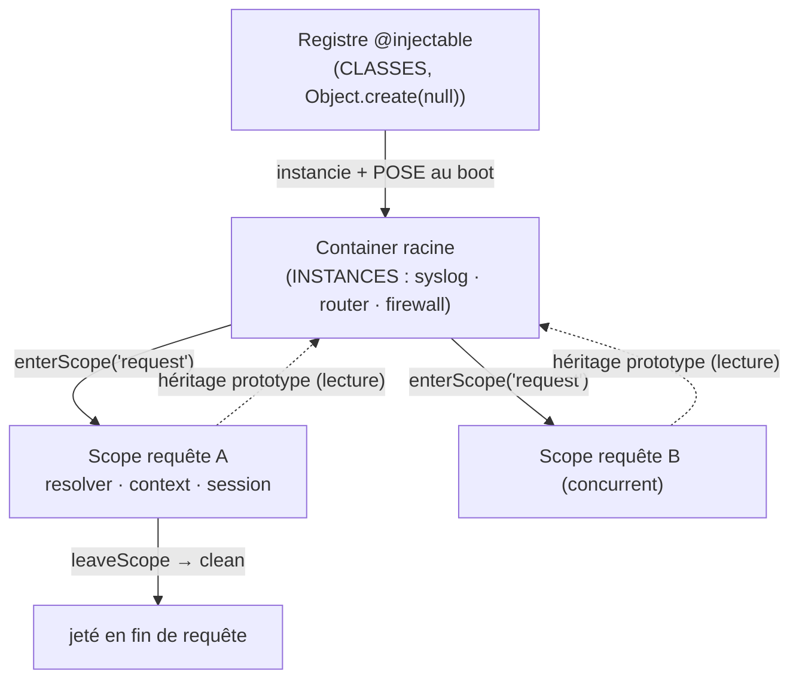

# Injection de dépendances et portées

> Un service ne crée pas ses dépendances : il les **reçoit**. Nodefony fournit un `Container`
> hiérarchique — un annuaire de services partagés au boot — et un **scope** (sous-container) par requête
> pour isoler l'état court sans jamais polluer le global ni fuiter d'une requête à l'autre.
> Deux mécanismes se superposent : la **résolution par prototype** (Container) et la **résolution par
> décorateurs** (Injector). Chaque fait est ancré sur `src/nodefony/src/Container.ts` et
> `src/nodefony/src/kernel/injector/`.

## Le modèle mental — deux annuaires, deux « scopes »

Le point le plus important à saisir : le mot **« scope » désigne deux choses différentes** dans
Nodefony, et les confondre coûte des heures.

1. **Le scope-container** (`enterScope`/`leaveScope`) : un sous-container **par requête**, jeté à la
   fin. C'est de l'isolation d'état court.
2. **Le scope-cycle-de-vie** du DI (`@injectable({ scope: "singleton" | "transient" })`) : combien
   d'instances d'une **classe** l'injecteur produit — une seule et mémoïsée (`singleton`), ou une
   neuve à chaque résolution (`transient`).

Les deux sont orthogonaux. On peut avoir un service `singleton` partagé lu depuis n'importe quel
scope-container.

## Lexique

| Terme                   | Sens                                                                                         |
| ----------------------- | -------------------------------------------------------------------------------------------- |
| DI                      | _Dependency Injection_ : fournir ses dépendances à un objet au lieu qu'il les crée lui-même. |
| Container               | Annuaire nommé d'**instances** de services + arbre de paramètres pointés.                    |
| Scope (container)       | Sous-container créé par requête, hérité du parent par prototype, jeté à la fin.              |
| Registre                | Annuaire de **classes** `@injectable` (`Injector.injectables`) — distinct du container.      |
| Token / clé             | Nom sous lequel une instance vit **réellement** dans le container (le `super(nom, …)`).      |
| `singleton`/`transient` | Cycle de vie DI d'une classe : une instance mémoïsée, ou une neuve à chaque résolution.      |
| Prototype               | Mécanisme JS d'héritage d'objets — utilisé ici pour la résolution parent en O(1) natif.      |

## Qu'est-ce que l'injection de dépendances — et le problème propre au serveur

Sans DI, chaque composant instancie ce dont il a besoin : couplage fort, tests difficiles, état
partagé accidentel. Avec un container, on **enregistre** les services une fois et on les **résout** par
nom (ou par type) : le code dépend d'un contrat, pas d'une construction.

Le défi spécifique d'un serveur : certaines choses sont **globales et durables** (le logger, le
routeur, le firewall) et d'autres sont **par requête et éphémères** (le contexte HTTP, la session, le
resolver). Sur un serveur qui traite N requêtes **en parallèle**, la moindre fuite d'un objet
« requête A » vers « requête B » est une faille de confidentialité (IDOR, session mélangée). Tout le
design des portées ci-dessous existe pour rendre cette fuite **structurellement impossible**, pas
seulement improbable.

## La vision Nodefony — la portée par chaîne de prototypes

Le `Container` racine est créé au boot ; le `Kernel` y **pose** les services partagés. À chaque requête,
`enterScope("request")` ouvre un **scope** : un sous-container qui hérite du parent par **chaîne de
prototypes JS** (`Object.create(parent.protoService.prototype)`, `Container.ts:127`). Conséquence
directe : lire un service parent depuis un scope (`scope.get("syslog")`) est une **résolution native
V8**, sans hop logiciel, sans wrapper, sans lookup explicite (`Container.ts:212`).

Les services courts (resolver, context, session) sont posés en **own-property** du scope
(`Container.ts:466`) : ils **masquent** le parent localement sans jamais l'écrire. En fin de requête,
`leaveScope(scope)` nettoie l'instance, casse le lien parent et la retire du bookkeeping
(`Container.ts:312`, `:521`). Ce cycle `enterScope → leaveScope` est appliqué **automatiquement** par
`@nodefony/http` (en `finally`, même si le contrôleur lève) ; le code applicatif n'ouvre jamais un scope
à la main.

### Le constat qui garantit l'isolation concurrente

`Scope` **redéfinit** `set()` pour n'écrire **que** sur son propre objet, jamais sur le prototype
partagé (`Container.ts:466-472`). La raison est explicite dans le code : depuis que le scope adopte le
prototype du parent (optimisation qui évite deux allocations mortes par requête, `:450-456`), un
`set()` prototype — celui du `Container` racine (`:197`) — écrirait sur le **proto partagé**. Un service
per-request (le contrôleur, le contexte) deviendrait alors **visible de toutes les requêtes
concurrentes**. La redéfinition en own-property est donc la barrière anti-fuite : c'est elle qui rend
l'isolation _structurelle_. Idem pour `Scope.remove` (`:479`), qui ne touche jamais un service hérité.

### Micro-optimisations assumées (chemin par-requête)

Trois choix, tous motivés par le fait que ce chemin s'exécute **à chaque requête** :

- **`id` de scope = compteur monotone base 36**, pas un UUID v4 (`Container.ts:64-67`) : un appel crypto
  par requête pour une clé locale jamais exposée hors du process serait du gaspillage.
- **`Map` pour le bookkeeping des scopes**, pas un objet littéral `delete`-é (`:62`) : l'ajout/retrait à
  chaque requête fait « churner » la _shape_ d'un objet ordinaire et dégrade les inline caches V8 ; la
  `Map` est faite pour ce motif.
- **Scopes alloués en _lazy_** (`null` tant qu'aucun `addScope`, `:99-101`) : pas de bucket alloué
  d'office et jamais utilisé.

Ces détails ne changent pas l'API, mais expliquent _pourquoi le code est écrit ainsi_ — utile le jour où
on relit `Container.ts` en se demandant « pourquoi une Map et un compteur ? ».

## API du Container (l'essentiel)

| Méthode                           | Rôle                                                                                          |
| --------------------------------- | --------------------------------------------------------------------------------------------- |
| `set(name, instance)`             | Enregistrer un service (racine : sur le proto + own ; scope : own seulement)                  |
| `get<T>(name): T \| null`         | Résoudre un service (typé, `null` si absent — narrower avant usage)                           |
| `has(name)` / `remove(name)`      | Test / suppression (la suppression **cascade** vers les scopes enfants, `:234`)               |
| `addScope(name)`                  | **Déclarer** un type de scope (au boot)                                                       |
| `enterScope(name)`                | **Ouvrir** une instance de scope (par requête) — throw si non déclaré (`:295`)                |
| `leaveScope(scope)`               | Fermer + nettoyer une instance de scope                                                       |
| `scopeCount(name)`                | Nombre d'instances vivantes — sonde de fuite bon marché (`:330`)                              |
| `setParameters` / `getParameters` | Arbre de paramètres pointé (`a.b.c`) ; côté scope, **merge profond** avec le parent (`:500`)  |
| `clean()` / `reset()`             | Démontage / remise à zéro (hot-reload) — après `clean()`, tout `get/set` renvoie `null`/throw |

Signatures complètes générées depuis le TSDoc : voir la référence API du Container. Internes détaillés :
[container](../../src/nodefony/docs/container.md).

## La résolution par décorateurs — l'Injector

Au-delà de la résolution par nom, le core expose des décorateurs (`@injectable`, `@inject`, `@services`)
consommés par l'`Injector` (`src/nodefony/src/kernel/injector/injector.ts`). C'est là que se cachent les
constats les plus subtils — et les erreurs les plus déroutantes quand on les ignore.

### Le nœud du DI : registre de CLASSES vs container d'INSTANCES

`@injectable(nom)` indexe une **classe** dans un registre (`injectables`, un `Object.create(null)` pour
qu'aucun `toString`/`__proto__` ne réponde comme un faux service, `injector.ts:25`). Mais `super(nom,
container)` range l'**instance** dans le container. **Rien ne garantit que les deux noms soient égaux** :
une classe `Router` décorée `@injectable("Router")` vit dans le container sous `"router"` (le nom de son
`super()`). Le décorateur ne _peut pas_ connaître ce second nom : il s'exécute au **chargement** de la
classe, `super()` seulement à la **construction** (`injector.ts:27-41`).

La résolution apprend donc le couple `(classe, clé réelle)` au moment où le service est posé
(`rememberContainerKey`, `:88`), et toute résolution ultérieure passe par la **classe**. Sans ce relais,
`@inject("Router")` interrogeait le container avec `"Router"` là où l'instance est sous `"router"` :
réponse `null`, service **reconstruit silencieusement, cache vide** (`:169-209`). Le commentaire du code
note qu'un seul des 7 `@injectable` échappait au piège — `HttpKernel`, par pure coïncidence de casse.
C'est le genre de bug qui ne plante pas : il _ralentit_ et _duplique de l'état_ sans un mot.

### `singleton` vs `transient`

`@injectable({ scope })` fixe le cycle de vie (`injector.ts:104-108`, défaut `singleton`) :

- **`transient`** : toujours une nouvelle instance, le container est **ignoré** (`:160`).
- **`singleton`** : container kernel d'abord ; si absent, on instancie **puis on mémoïse**
  (`:176-209`). Sans la mémoïsation, un `singleton` rendrait une instance neuve à chaque résolution,
  dupliquant l'état (cache, compteur, connexion) que le service est censé porter seul.

### Deux sources de dépendances, une priorité

L'injecteur lit deux métadonnées (`injector.ts:270-273`) : `inject:services` (posé par `@inject("nom")`,
**prioritaire**) et `design:paramtypes` (émis par TypeScript via `emitDecoratorMetadata`, qui permet
l'**auto-injection par type** sans `@inject` explicite). Un paramètre n'est auto-injecté que si son type
est **enregistré** au registre ; sinon il reçoit l'argument positionnel passé à la construction
(`:303-309`). S'ajoute la **property injection** post-construction (`@inject` sur une propriété,
`:222-235`).

### Garde-fous de l'injecteur

- **Détection de dépendance circulaire** : la pile de résolution est propre à chaque arbre d'appel
  (async-safe, jamais de mutation partagée) ; un nom déjà présent lève avec le **chemin complet**
  `A → B → A` (`injector.ts:262-266`).
- **Les arguments ne sont pas hérités par les dépendances** : une dépendance se **résout** (sans
  argument), elle n'**hérite** pas des arguments de son parent (`:290-301`). Le code cite le bug vécu :
  `Fetch(module: Module)` construit avec un `HttpContext` parce que les args étaient propagés — sans que
  TypeScript ne voie rien.
- **`Fetch` « batteries incluses »** : déclaré _et_ posé au container à la construction de l'injecteur
  (`:52-59`) ; le déclarer sans le poser laissait `kernel.get("Fetch")` vide, donc un `new Fetch()` à
  chaque résolution.

## L'ordre des `@services([...])` se calcule, il ne se subit pas

`@services` instancie les services **séquentiellement** et pose chaque instance au container. Un service
réclamé par un autre doit donc exister **avant** lui — sinon le DI le reconstruit sans argument et son
constructeur casse. Faire reposer ça sur l'ordre d'une liste écrite à la main est un piège : le code
note que **déplacer `HttpKernel` de trois lignes** dans `@nodefony/http` suffisait à renvoyer un 499 sur
**chaque** requête (`serviceOrder.ts:55`).

Comme les dépendances sont déjà déclarées (`@inject` / `design:paramtypes`), l'ordre correct se
**calcule** : `orderServicesByDependencies` fait un **tri topologique stable** (Kahn — à contrainte
égale, l'ordre d'écriture est conservé, `serviceOrder.ts:100-116`). Une liste déjà correcte sort
inchangée ; les entrées `string` (chemins à charger) et les classes hors registre gardent leur position
(`:64`). Un cycle lève une erreur **nommant le cycle** (`:118-129`). C'est l'équivalent du container
compilé de Symfony ou de la résolution de graphe de NestJS.

> Nuance à retenir : le tri topologique couvre les dépendances **déclarées** dans la même liste. Le gros
> message d'erreur de l'injecteur (`injector.ts:180-199` : « list it BEFORE its consumers ») reste le
> filet pour les cas que le tri ne peut pas voir (dépendance vers un autre module, résolution runtime).

## Portées & concurrence — le tableau qui rassure

| Élément                         | Portée                      | Partagé entre requêtes ?            | Nettoyé quand ?                   |
| ------------------------------- | --------------------------- | ----------------------------------- | --------------------------------- |
| `syslog`, `router`, `firewall`  | Container racine            | **Oui** (lecture seule par requête) | Au shutdown (`kernel` clean)      |
| Contrôleur, `context`, session  | Scope requête (own)         | **Non** (isolé)                     | `leaveScope` en fin de requête    |
| Service `@injectable` singleton | Registre → mémoïsé          | **Oui**                             | Vit tant que le kernel vit        |
| Service `@injectable` transient | Aucune (neuf à chaque fois) | **Non**                             | GC dès qu'il n'est plus référencé |

## Pièges (symptôme → cause → correction)

| Symptôme                                     | Cause (dans le code)                                                  | Correction                                                                             |
| -------------------------------------------- | --------------------------------------------------------------------- | -------------------------------------------------------------------------------------- |
| Service global « pollué » par une requête    | `set` sur le parent au lieu du scope                                  | Toujours `scope.set` per-request — jamais `container.set`                              |
| Fuite mémoire / `scopeCount` qui monte       | `leaveScope` non appelé (contournement du pipeline)                   | Le kernel l'appelle en `finally` — ne pas le court-circuiter                           |
| `Scope "X" not declared`                     | `enterScope("X")` sans `addScope("X")` au boot                        | Déclarer le scope au boot                                                              |
| Service reconstruit, cache vide, aucun crash | Nom `@inject` ≠ clé container (casse), résolution avant apprentissage | Utiliser la classe / vérifier le `super(nom)` réel                                     |
| 499 / `Cannot read properties of undefined`  | Ordre `@services` : un service posé après son consommateur            | Rien à faire si déclaré (`@inject`) — le tri topo range ; sinon déclarer la dépendance |
| `Circular dependency detected: A → B → A`    | Cycle de résolution                                                   | Casser le cycle (property injection tardive, ou repenser la dépendance)                |
| Une instance neuve à chaque résolution       | `@injectable({ scope: "transient" })` non voulu                       | Passer en `singleton` (défaut)                                                         |

## Tests & couverture

Le DI est couvert par **194 cas unitaires + 22 tests d'attaque** sur 6 fichiers
(`src/nodefony/src/tests/`) : `Container` (75), `Injector` (89), `serviceOrder` (11, le tri topologique),
`Decorators` (19), plus `injector.attack` (10) et `services.attack` (12) — ces derniers vérifient
justement les gardes (résolution circulaire, ordre, pollution de prototype). Couverture forte
(`Container` ~95 %, `injector` ~93 %, `serviceOrder` 100 %). Photo régénérée depuis vitest
(`npm run coverage`).

## Pour aller plus loin

- Container (détail + internes) → [container](../../src/nodefony/docs/container.md)
- Décorateurs d'injection (référence) → [injection](../../src/nodefony/docs/injection.md)
- Cycle de boot (quand la racine est peuplée, dans quel ordre) → [cycle-boot-kernel](./cycle-boot-kernel.md)
- Service (la brique de base injectée) → `src/nodefony/docs/service.md`
