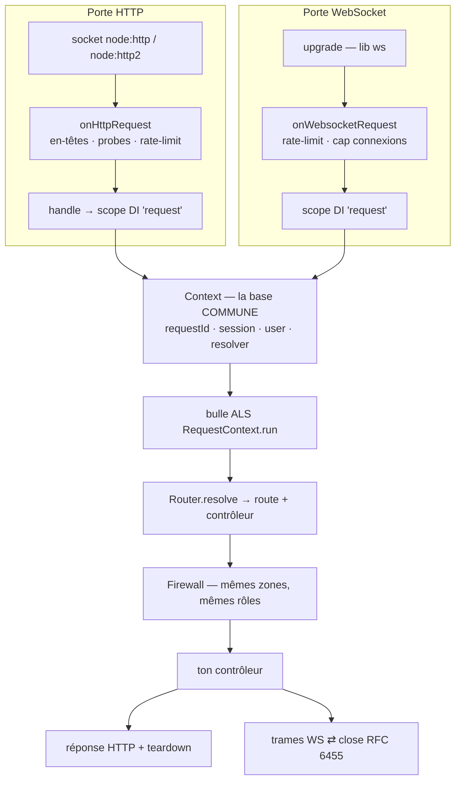
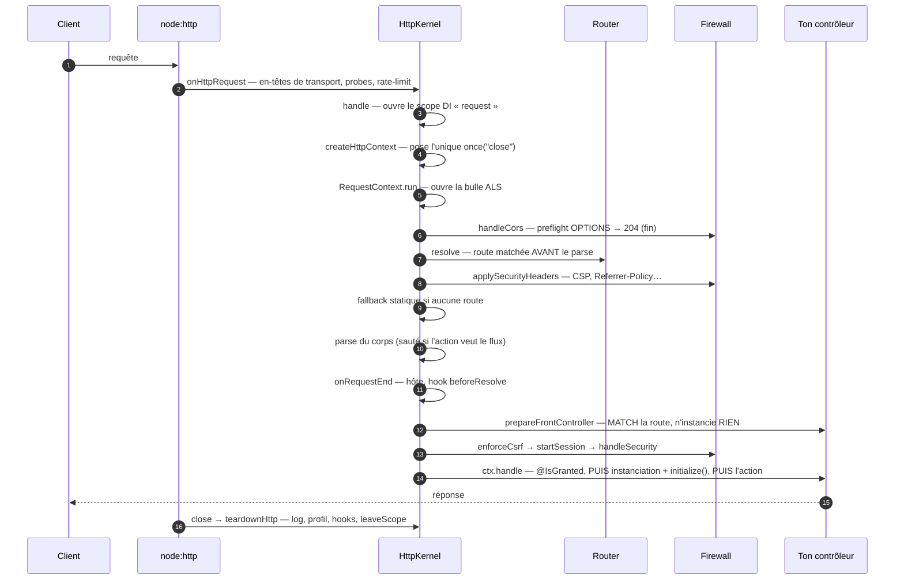
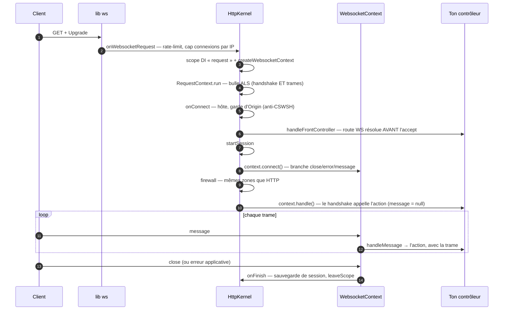
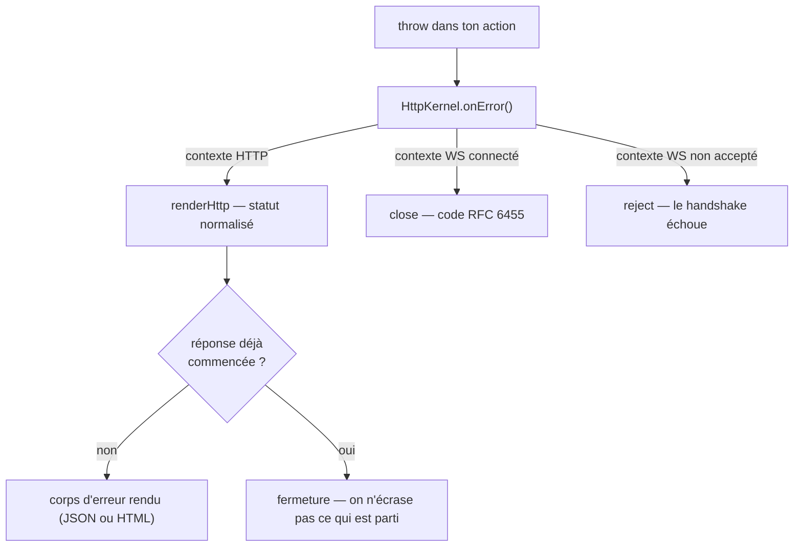

# Le pipeline d'une requête (HTTP et WebSocket)

> Entre l'octet reçu par la socket et l'octet renvoyé au client, une requête traverse une suite
> d'étapes **ordonnées et nommées**. Cette page te dit exactement dans quel ordre passent le
> parsing, le routage, la sécurité, ton contrôleur et la fin de réponse — et pourquoi une
> connexion **WebSocket** traverse le **même** moteur. Tout est ancré sur
> `src/packages/@nodefony/http/nodefony/service/http-kernel.ts` et `nodefony/src/context/`.

📍 [Documentation](../index.md) › **Pipeline de requête**

## 🧠 Le modèle mental — un seul moteur, deux portes d'entrée

Ailleurs, le web (requête → réponse) et le temps réel (connexion → messages) sont **deux piles
séparées** : deux routages, deux sessions, deux façons de vérifier un droit. Le coût caché, c'est la
divergence — une règle corrigée d'un côté, oubliée de l'autre.

Nodefony fait entrer les deux par des portes différentes, puis les fait converger sur **un contexte
commun**, un **routeur commun** et un **firewall commun**. Écrire du temps réel redevient aussi banal
qu'écrire une route web.



## 📖 Lexique

| Terme            | Sens                                                                                         |
| ---------------- | -------------------------------------------------------------------------------------------- |
| Pipeline         | La suite ordonnée d'étapes qu'une requête traverse, de la socket à la réponse.               |
| Contexte         | L'objet-requête (`HttpContext` / `WebsocketContext`), tous deux dérivés de `Context`.        |
| Scope            | Sous-container d'injection créé **par requête**, libéré à la fin (voir Injection & portées). |
| ALS              | _AsyncLocalStorage_ : la « bulle » qui suit la requête à travers tout l'asynchrone.          |
| `requestId`      | Identifiant de corrélation d'une requête — présent dans les logs et dans la réponse.         |
| Resolver         | L'objet produit par le routage : route matchée, contrôleur, action, variables d'URL.         |
| Front controller | L'étage qui transforme une URL en (contrôleur, action) — ici `prepareFrontController()`.     |
| Handshake        | La poignée de main d'ouverture d'une WebSocket (une requête HTTP `GET` + `Upgrade`).         |
| Trame (frame)    | Un message WebSocket, après le handshake.                                                    |
| Teardown         | La fin de requête : log, profil, hooks d'après-réponse, libération du scope.                 |
| CSWSH            | _Cross-Site WebSocket Hijacking_ : ouverture d'une WebSocket depuis une origine tierce.      |
| Preflight        | La requête `OPTIONS` que le navigateur envoie avant un appel cross-origine (CORS).           |
| Probe            | Sonde d'orchestrateur (`/livez`, `/readyz`) qui teste la vivacité du process.                |
| `traceparent`    | En-tête W3C Trace Context, qui relie ta requête à une trace distribuée.                      |

## Qu'est-ce qu'un pipeline de requête

Un serveur ne fait pas « une » chose quand une requête arrive : il en fait **une dizaine**, dans un
ordre qui n'est pas négociable. Décoder les en-têtes avant de router. Router avant d'authentifier —
sinon on ne sait pas quelle politique appliquer. Authentifier avant d'exécuter — sinon la protection
arrive trop tard.

Le pipeline, c'est ce contrat d'ordre rendu explicite. Il répond à trois questions que tout
développeur finit par se poser :

1. **Où** brancher mon code pour qu'il voie ce dont il a besoin (l'utilisateur ? le corps parsé ?).
2. **Pourquoi** telle étape n'a pas eu lieu (mon firewall sur un fichier statique, par exemple).
3. **Comment** relier entre eux tous les logs d'une même requête.

## La vision Nodefony — un contexte, deux transports

`HttpContext` (`HttpContext.ts:82`) et `WebsocketContext` (`WebsocketContext.ts:83`) héritent de la
**même** base `Context` (`Context.ts:158`). Cette base porte tout ce qui définit « une requête en
cours » : `requestId`, `session`, `user`, `resolver`, `sessionIntent`, le nonce CSP, les jetons CSRF,
le `traceparent` et la trace de décision du firewall (`Context.ts:184`).

Conséquence directe : un contrôleur ne sait pas — et n'a pas besoin de savoir — sur quel transport il
répond. HTTP/1.1, TLS, HTTP/2 et WebSocket convergent tous vers `router.resolve(context)` puis vers la
même instance de contrôleur.

Trois décisions structurent le reste.

**1. Le rejet coûte moins cher que l'acceptation.** Probes de santé, rate-limit et cap de connexions
sont traités **avant** toute allocation de contexte, de scope DI ou de bulle ALS
(`HttpKernel.onHttpRequest()`, `http-kernel.ts:944`). Un flood est refusé au prix d'une recherche dans
une `Map`.

**2. Le routage précède le parsing.** `Router.resolve()` (`router.ts:230`) est appelé **avant** de lire
le corps de la requête (`http-kernel.ts:1181`). C'est ce qui permet à une action de recevoir le flux
brut plutôt qu'un corps déjà chargé en mémoire — et ce qui évite de payer le disque sur une route qui
n'est pas un fichier.

**3. Tout tourne dans une bulle.** `RequestContext.run()` (`RequestContext.ts:126`) ouvre un
`AsyncLocalStorage` autour de la suite du pipeline. Chaque saut asynchrone en aval — log, requête ORM,
décorateur de sécurité — retrouve `requestId`, `traceparent` et le contexte, **sans** qu'on les passe
en paramètre.

> [!IMPORTANT]
> Le contexte WebSocket vit pour **toute la connexion**, pas pour une trame. Son `requestId` est donc
> stable du handshake à la fermeture (`WebsocketContext.ts:139`) — c'est la clé qui relie entre eux
> tous les messages d'une même socket.

## 🚀 Démarrage rapide

Vue depuis une application générée par `nodefony create app`. Objectif : un contrôleur qui **observe
son propre passage** dans le pipeline, en HTTP **et** en WebSocket.

### 1. Le contrôleur qui se regarde passer

```typescript
// nodefony/controllers/PipelineController.ts — complet, compile tel quel
import { Controller, controller, Get, route } from "@nodefony/framework";
import { Context } from "@nodefony/http";
import type { HttpContext, WebsocketContext } from "@nodefony/http";
import { RequestContext } from "nodefony";

@controller("/pipeline")
class PipelineController extends Controller {
  constructor(context: Context) {
    super("PipelineController", context);
  }

  // `initialize()` fait partie de la RÉSOLUTION : il tourne AVANT la session
  // et AVANT le firewall. N'y suppose jamais un utilisateur authentifié.
  async initialize(): Promise<this> {
    this.log(`résolution de ${this.route?.name}`, "DEBUG");
    return this;
  }

  @Get("/trace")
  async trace() {
    const ctx = this.context as HttpContext;
    // Ce hook tourne APRÈS le dernier octet envoyé — hors du chemin de réponse,
    // donc sans rien ajouter à la latence vue par le client.
    ctx.onAfterResponse(() => {
      this.log(`fin de requête ${ctx.requestId}`, "INFO");
    });
    return {
      // Exactement la valeur de l'en-tête `x-request-id` de la réponse.
      requestId: ctx.requestId,
      // Même valeur, lue depuis la bulle ALS : rien à porter sur `this`.
      depuisAls: RequestContext.getRequestId(),
      // Les étapes déjà chronométrées à cet instant.
      phases: ctx.phases.map((p) => p.name),
    };
  }

  // MÊME contrôleur, MÊME contexte de base : seule la déclaration change.
  @route("pipeline-ws", {
    path: "/ws",
    requirements: { methods: ["WEBSOCKET"] },
  })
  async ws(message: string | Buffer | null) {
    const ctx = this.context as WebsocketContext;
    // message === null → on est au HANDSHAKE ; sinon c'est une trame reçue.
    return this.renderJson({
      etape: message === null ? "handshake" : "trame",
      // Stable pour TOUTE la connexion — la clé de corrélation d'une socket.
      requestId: ctx.requestId,
      depuisAls: RequestContext.getRequestId(),
    });
  }
}

export default PipelineController;
```

(Wiring : `@controllers([PipelineController])` dans le module de l'app — `nodefony create controller`
le fait pour toi.)

### 2. Ce qu'on observe

```bash
# HTTP — l'identifiant de corrélation est réfléchi dans la réponse
curl -si http://localhost:5151/pipeline/trace | grep -i x-request-id
# x-request-id: 6f1c…

curl -s http://localhost:5151/pipeline/trace
# {"requestId":"6f1c…","depuisAls":"6f1c…","phases":["resolve","parse","initialize"]}
```

`depuisAls` vaut **toujours** `requestId` : c'est la preuve que la bulle ALS est ouverte autour de ton
action. Dans les logs du serveur, la même valeur apparaît sur chaque ligne émise pendant la requête.

### 3. Le même contrôleur, en WebSocket

```bash
# Handshake puis une trame, sur la MÊME route déclarée plus haut
npx wscat -c ws://localhost:5151/pipeline/ws
# < {"etape":"handshake","requestId":"a3d0…","depuisAls":"a3d0…"}
# > ping
# < {"etape":"trame","requestId":"a3d0…","depuisAls":"a3d0…"}
```

Le `requestId` ne change **pas** entre le handshake et la trame : le contexte WebSocket vit pour toute
la connexion.

## 🏗️ Le trajet HTTP, de l'octet reçu à l'octet renvoyé



Le tableau ci-dessous est la même séquence, avec ce qui devient vrai à chaque étape.

| #   | Étape                  | Ancrage                                                      | Ce qui devient vrai                                              |
| --- | ---------------------- | ------------------------------------------------------------ | ---------------------------------------------------------------- |
| 1   | `onHttpRequest()`      | `http-kernel.ts:944`                                         | en-têtes de transport posés (nosniff, frame, HSTS)               |
| 2   | probes de santé        | `HttpKernel.#respondHealth()` (`http-kernel.ts:473`)         | `/livez` et `/readyz` répondent **sans** entrer dans le pipeline |
| 3   | rate-limit par IP      | `http-kernel.ts:865`                                         | un flood est rejeté en 429, **sans** contexte ni scope           |
| 4   | `handle()`             | `HttpKernel.handle()` (`http-kernel.ts:721`)                 | le **scope DI « request »** est ouvert                           |
| 5   | `createHttpContext()`  | `http-kernel.ts:1218`                                        | le contexte existe ; le teardown est armé (`once("close")`)      |
| 6   | `traceparent`          | `http-kernel.ts:1304`                                        | la trace W3C est résolue (héritée ou générée)                    |
| 7   | `RequestContext.run()` | `http-kernel.ts:431`                                         | **la bulle ALS est ouverte** — `requestId` propagé partout       |
| 8   | CORS                   | `Firewall.handleCors()` (`firewall.ts:991`)                  | un **preflight** répond 204 et **sort** du pipeline              |
| 9   | routage                | `Router.resolve()` (`router.ts:230`)                         | `context.resolver` porte la route, le contrôleur, les variables  |
| 10  | en-têtes applicatifs   | `Firewall.applySecurityHeaders()` (`firewall.ts:1029`)       | CSP (avec le `@Csp` de la route), Referrer-Policy, COOP/COEP     |
| 11  | fallback statique      | `serverStatic` (`http-kernel.ts:241`)                        | **aucune route** matchée → le fichier est servi, fin du trajet   |
| 12  | parse du corps         | `request.initialize()` (`http-kernel.ts:1224`)               | corps et fichiers disponibles (sauté si flux brut demandé)       |
| 13  | `onRequestEnd()`       | `http-kernel.ts:1399`                                        | hôte vérifié, hook `beforeResolve` tiré                          |
| 14  | front controller       | `HttpKernel.prepareFrontController()` (`http-kernel.ts:767`) | la route est **matchée** ; rien n'est instancié encore           |
| 15  | CSRF                   | `Firewall.enforceCsrf()` (`firewall.ts:932`)                 | une mutation cross-site est refusée (403)                        |
| 16  | session                | `HttpKernel.startSession()` (`http-kernel.ts:1139`)          | `context.session` existe **si** la route ou un cookie l'exige    |
| 17  | firewall               | `Firewall.handleSecurity()` (`firewall.ts:738`)              | `context.user` est résolu — ou 401/403                           |
| 18  | action                 | `HttpContext.handle()` (`HttpContext.ts:206`)                | **ton code s'exécute**, la valeur retournée est rendue           |
| 19  | teardown               | `HttpKernel.teardownHttp()` (`http-kernel.ts:1163`)          | log, profil, hooks d'après-réponse, **scope libéré**             |

### Trois ordres qui surprennent (et pourquoi ils sont ainsi)

**Le routage passe avant le parsing du corps.** Le match d'une route n'utilise que la méthode et
l'URL : il est donc « pur ». En le hissant avant le parse (`http-kernel.ts:1181`), le kernel peut
décider de **ne pas** charger le corps quand l'action veut le flux brut — plus de pic mémoire sur un
gros téléversement. Le résolveur est ensuite **réutilisé**, jamais recalculé (`http-kernel.ts:666`).

**Le statique est un repli, pas un préambule.** Le kernel tente la route d'abord ; ce n'est que
faute de route qu'il essaie le disque (`http-kernel.ts:1200`). Une route d'API ne paie donc plus le
`stat` de `serve-static`. Corollaire important : un fichier servi **court-circuite tout ce qui suit**
— voir la mise en situation dédiée.

**Ton contrôleur n'est instancié qu'une fois la requête autorisée.** L'étape 14 se contente de
MATCHER la route — `prepareFrontController()` (`http-kernel.ts:767`) pose `sessionIntent` et
`bypassFirewall`, que le point session et le firewall lisent juste après, et rien de plus. La
construction de l'instance et l'appel d'`initialize()` exécutent du code utilisateur et résolvent
des dépendances : ils vivent dans `Resolver.executeAction()`, **après** la garde `@IsGranted`
(`Resolver.ts:327`), donc après CSRF, session et firewall. Un 403 court-circuite l'instanciation —
c'est ce qui rend la garde réellement Zero Trust, et non un contrôle posé sur un objet déjà
construit.

### Du retour d'action à l'octet

La valeur que retourne ton action n'est pas envoyée telle quelle :
`Resolver.returnController()` (`Resolver.ts:697`) la normalise.

| Ce que l'action retourne      | Ce qui part sur le fil                              |
| ----------------------------- | --------------------------------------------------- |
| une chaîne / un `Buffer`      | envoyé tel quel                                     |
| un objet ou un tableau simple | **auto-JSON** (`application/json`)                  |
| un nombre / un booléen        | auto-JSON — un scalaire est un document JSON valide |
| une promesse                  | déroulée, puis re-dispatchée sur les cas ci-dessus  |
| une réponse déjà envoyée      | rien (l'action a géré l'envoi elle-même)            |
| une instance de classe        | **rien** — c'est le piège du hang, voir Pièges      |

## 🔌 Le trajet WebSocket — handshake, trames, fermeture

Un handshake WebSocket **est** une requête HTTP `GET` avec `Upgrade`. C'est pourquoi il traverse les
mêmes gardes — mais son contexte, lui, survit à la poignée de main.



| #   | Étape                  | Ancrage                                                        | Ce qui devient vrai                                    |
| --- | ---------------------- | -------------------------------------------------------------- | ------------------------------------------------------ |
| 1   | `onWebsocketRequest()` | `http-kernel.ts:1505`                                          | rate-limit du handshake (close **1013**) et cap par IP |
| 2   | scope + contexte       | `HttpKernel.createWebsocketContext()` (`http-kernel.ts:1467`)  | scope DI ouvert ; `onFinish` armé pour le libérer      |
| 3   | bulle ALS              | `http-kernel.ts:1438`                                          | ouverte pour le handshake **et** toutes les trames     |
| 4   | hôte + Origin          | `HttpKernel.checkWebsocketOrigin()` (`http-kernel.ts:599`)     | origine tierce refusée → close **1008** (anti-CSWSH)   |
| 5   | front controller       | `HttpKernel.onConnect()` (`http-kernel.ts:1667`)               | route et protocole vérifiés **avant** l'accept         |
| 6   | session                | `http-kernel.ts:1550`                                          | même point d'activation unique qu'en HTTP              |
| 7   | `connect()`            | `WebsocketContext.connect()` (`WebsocketContext.ts:230`)       | listeners `close`/`error`/`message` branchés           |
| 8   | firewall               | `http-kernel.ts:1450`                                          | mêmes zones, mêmes rôles qu'en HTTP                    |
| 9   | handshake applicatif   | `WebsocketContext.handle()` (`WebsocketContext.ts:265`)        | ton action est appelée avec `message = null`           |
| 10  | trames                 | `WebsocketContext.handleMessage()` (`WebsocketContext.ts:479`) | ton action est rappelée par message reçu               |
| 11  | fermeture              | `WebsocketContext.onClose()` (`WebsocketContext.ts:523`)       | `onFinish` → session sauvegardée, **scope libéré**     |

### Ce que les deux trajets partagent, et ce qui diffère

<!-- prettier-ignore -->
| Dimension | HTTP | WebSocket |
| --- | --- | --- |
| Contexte | `HttpContext` | `WebsocketContext` — **même base `Context`** |
| Durée de vie | une requête | **toute la connexion** |
| `requestId` | par requête | **par connexion**, stable jusqu'au close |
| Routage | `Router.resolve()` | le **même** `Router.resolve()` |
| Firewall | `handleSecurity()` | le **même**, câblé au handshake |
| Session | `startSession()` | le **même** point d'activation |
| CORS | oui (preflight) | **non** — remplacé par la garde d'`Origin` |
| Parse du corps | oui | **non** — la trame est la donnée |
| Fin d'échange | statut HTTP | **code de fermeture** RFC 6455 |
| Libération du scope | `once("close")` de la réponse | `onFinish` déclenché par le `close` de la socket |

> [!TIP]
> Le `AsyncResource.bind()` posé sur les listeners `close`/`message`
> (`WebsocketContext.ts:243`) est ce qui fait que la bulle ALS **survit aux trames** : elles arrivent
> à des tours de boucle d'événements ultérieurs, hors de la bulle d'origine. Sans ce bind, un log
> émis au message n'aurait plus de `requestId`.

## ⚙️ Mises en situation

### Situation 1 — « je veux exécuter du code avant chaque requête »

Le besoin : mesurer, enrichir, refuser — avant que ton contrôleur ne soit choisi. Il n'y a pas de
« middleware » à empiler : il y a des **points d'accroche nommés** sur le kernel HTTP, que tu branches
une fois, au boot du module.

```typescript
// dans le module de ton app — hook onKernelReady : tout est construit
override async onKernelReady(): Promise<this> {
  const httpKernel = this.get<HttpKernel>("HttpKernel");
  // Tiré AVANT le routage, à chaque requête HTTP (et au handshake WS).
  httpKernel?.on("beforeResolve", (context: ContextType) => {
    this.log(`entrée ${context.method} ${context.url}`, "INFO");
  });
  return this;
}
```

Choisir son point d'accroche en cinq secondes :

| Tu veux…                                           | Point d'accroche            | Ce qui est déjà vrai                        |
| -------------------------------------------------- | --------------------------- | ------------------------------------------- |
| voir la requête brute, avant toute allocation      | `onServerRequest`           | rien — juste `request`/`response`           |
| enrichir le contexte dès sa création               | `onCreateContext`           | le contexte existe, l'ALS n'est pas ouverte |
| agir avant le routage                              | `beforeResolve`             | l'ALS est ouverte, corps parsé              |
| réagir à une authentification réussie              | `afterAuth`                 | `context.user` est résolu                   |
| réagir à un refus d'authentification               | `onAuthFailure`             | l'erreur d'auth est disponible              |
| faire quelque chose après la réponse (une requête) | `context.onAfterResponse()` | la réponse est partie                       |

> [!WARNING]
> Sur le chemin HTTP, trois de ces événements ne sont émis **que s'ils ont un abonné**
> (`listenerCount` : `http-kernel.ts:1030`, `:1280`, `:1421`). C'est délibéré — sans abonné, zéro
> microtâche par requête. Cela ne change rien pour toi : abonne-toi, et ils partent.

### Situation 2 — « pourquoi mon hook n'est pas appelé sur les fichiers statiques ? »

Le symptôme : ton `beforeResolve` (ou ton firewall) voit passer `/api/users`, mais jamais
`/img/logo.png`. Ce n'est pas un bug : c'est l'**ordre**.

Le service statique est un **repli du 404**, tenté juste après le routage (`http-kernel.ts:1200`).
Quand il sert un fichier, il termine la réponse lui-même — la suite du pipeline n'est jamais atteinte.

| Étape                         | Route API | Fichier statique servi |
| ----------------------------- | :-------: | :--------------------: |
| en-têtes de transport         |    ✅     |           ✅           |
| rate-limit par IP             |    ✅     |           ✅           |
| CORS                          |    ✅     |           ✅           |
| en-têtes applicatifs (CSP…)   |    ✅     |           ✅           |
| hook `beforeResolve`          |    ✅     |         **❌**         |
| CSRF · session · **firewall** |    ✅     |         **❌**         |
| ton contrôleur                |    ✅     |         **❌**         |

Ce qui en découle, et qu'il faut savoir : **un fichier statique n'est pas protégé par le firewall.**
Un actif qui doit être privé ne se sert pas depuis le dossier public — il se sert **par une route**,
derrière une zone protégée, en flux depuis ton contrôleur.

L'inverse est vrai aussi, et c'est une bonne nouvelle : les en-têtes de sécurité, eux, sont posés
**avant** le repli statique (`firewall.ts:835` appelé en `http-kernel.ts:1193`) — donc présents sur
un fichier comme sur une réponse d'API.

### Situation 3 — « mon erreur ne remonte pas comme je crois »

Le besoin : comprendre ce que voit le client quand ton action lève une exception. La réponse dépend
du transport, et Nodefony fait la traduction pour toi.



Côté HTTP, `HttpKernel.onError()` (`http-kernel.ts:874`) délègue à un **rendu remplaçable** : le
statut est normalisé (une erreur sans code devient 500), les en-têtes sont posés, puis le corps est
rendu — sauf si le client est déjà parti ou si l'envoi a commencé (`http-kernel.ts:773`). Tu peux
substituer ton propre rendu via `HttpKernel.setErrorRenderer()` (`http-kernel.ts:854`), par exemple
pour émettre du `application/problem+json`.

Côté WebSocket, il n'existe pas de « statut » : il faut un **code de fermeture** valide, et la plage
est piégeuse (`0-999` refusé, `1004/1005/1006/1015` réservés non émissibles). `toWsCloseCode()`
(`WebsocketContext.ts:55`) fait la traduction une fois pour toutes :

| Code applicatif / HTTP source                 | Code de fermeture WS | Sens (RFC 6455)                         |
| --------------------------------------------- | -------------------- | --------------------------------------- |
| déjà valide (1000-1003, 1007-1011, 3000-4999) | conservé             | tel quel                                |
| 401 / 403 / 421                               | **1008**             | Policy Violation                        |
| 5xx / interne / absent / hors plage           | **1011**             | Internal Error                          |
| autre 4xx (ex. 404)                           | **4004**             | plage privée applicative (§7.4.2)       |
| handshake au-delà du quota                    | **1013**             | Try Again Later (`http-kernel.ts:1377`) |
| origine tierce (anti-CSWSH)                   | **1008**             | Policy Violation (`http-kernel.ts:509`) |

En pratique : une action qui lève une erreur « 403 » produit un `close 1008` propre côté client, sans
que tu aies à connaître la table des codes.

Un dernier cas, visible dans les logs et souvent mal lu : le **499**. Ce n'est pas une erreur de ton
code — c'est le client qui a coupé avant d'avoir sa réponse. Le kernel l'enregistre pour
l'observabilité seulement, jamais sur le fil (la socket est déjà morte, `http-kernel.ts:1103`).

### Situation 4 — « comment corréler tous les logs d'une même requête »

Le besoin : dans un fichier de logs qui mélange 200 requêtes concurrentes, retrouver **les lignes
d'une seule**. La clé est le `requestId`, et tu n'as rien à câbler.

À la construction du contexte, `requestId` reçoit un UUID (`Context.ts:244`). Il est ensuite :

1. **propagé** à tout l'asynchrone via la bulle ALS (`http-kernel.ts:1151`) ;
2. **posé sur chaque ligne de log** émise pendant la requête (`Context.log()`, `Context.ts:442`) ;
3. **réfléchi au client** dans l'en-tête `x-request-id` de la réponse (`Response.ts:433`) ;
4. **stable pour toute une connexion** WebSocket, handshake et trames compris.

Depuis n'importe quel service, sans porter le contexte :

```typescript
import { RequestContext } from "nodefony";

const id = RequestContext.getRequestId(); // undefined hors requête
```

Si le client (ou ta passerelle) envoie déjà un `X-Request-Id`, Nodefony **l'adopte** — mais seulement
après validation : `sanitizeRequestId()` (`requestId.ts:38`) n'accepte que 128 caractères d'un
alphabet sûr. Une valeur exotique est **rejetée**, pas nettoyée, et l'UUID serveur est conservé. La
raison est concrète : cette valeur repart dans un en-tête et dans les logs — un `CR`/`LF` accepté ici
serait une injection de logs.

Pour relier ta requête à une trace **distribuée**, l'en-tête W3C `traceparent` suit le même chemin :
honoré s'il arrive, généré sinon (`http-kernel.ts:1304`), et réfléchi dans la réponse
(`Response.ts:386`).

## 🔐 Où s'insèrent les défenses

Chaque défense a une place précise dans l'ordre — et cette place **est** sa politique. Cette page dit
où ; les pages dédiées disent comment.

| Défense               | Position dans le trajet                                | Pourquoi là                                                            |
| --------------------- | ------------------------------------------------------ | ---------------------------------------------------------------------- |
| En-têtes de transport | tout premier (`http-kernel.ts:833`)                    | couvre **tout**, y compris statiques et réponses d'erreur              |
| Probes de santé       | avant le rate-limit (`http-kernel.ts:848`)             | un orchestrateur limité croirait le pod mort → redémarrages en cascade |
| Rate-limit par IP     | avant contexte et scope (`http-kernel.ts:998`)         | un flood doit coûter une recherche `Map`, pas une allocation           |
| CORS                  | avant le routage (`firewall.ts:797`)                   | un preflight n'a **pas** de route ; il ne s'authentifie pas            |
| En-têtes applicatifs  | après le routage (`http-kernel.ts:1342`)               | le CSP doit intégrer le `@Csp` de la route matchée                     |
| CSRF                  | après le routage, avant la session (`firewall.ts:741`) | rejet précoce d'une mutation cross-site, avant tout coût d'auth        |
| Session               | avant le firewall (`http-kernel.ts:1288`)              | l'authenticator de session lit la session reprise                      |
| Firewall              | juste avant l'action (`firewall.ts:561`)               | la zone dépend de la route, donc du routage                            |
| Idempotence           | dans l'appel d'action (`Resolver.ts:396`)              | seules les actions `@Idempotent` dévient — coût nul ailleurs           |
| Garde `@IsGranted`    | avant l'appel de la méthode (`Resolver.ts:317`)        | un 403 ne doit pas exécuter une ligne de ton action                    |
| Origin WebSocket      | au handshake (`http-kernel.ts:509`)                    | l'anti-CSWSH remplace le CORS, absent des WebSockets                   |

Détails : [Firewall](../../src/packages/@nodefony/security/docs/firewall.md) ·
[CSRF](../../src/packages/@nodefony/security/docs/csrf.md) ·
[CORS](../../src/packages/@nodefony/security/docs/cors.md) ·
[En-têtes](../../src/packages/@nodefony/security/docs/headers.md) ·
[Sessions](../../src/packages/@nodefony/http/docs/session.md) ·
[Idempotence](../../src/packages/@nodefony/framework/docs/idempotence.md).

## 📜 Normes appliquées

| Domaine                      | Norme             | Ancrage                                                 |
| ---------------------------- | ----------------- | ------------------------------------------------------- |
| Codes de fermeture WebSocket | RFC 6455 §7.4     | `toWsCloseCode()` (`WebsocketContext.ts:55`)            |
| Hôte non autoritaire → 421   | RFC 9110 §15.5.20 | `HttpKernel.checkValidDomain()` (`http-kernel.ts:1705`) |
| Message de statut US-ASCII   | RFC 7230 §3.1.2   | `Response.writeHead()` (`Response.ts:415`)              |
| Valeurs d'en-tête sûres      | RFC 9110 §5.5     | `sanitizeRequestId()` (`requestId.ts:38`)               |
| IP client derrière un proxy  | RFC 7239          | `http-kernel.ts:866`                                    |
| Contexte de trace distribuée | W3C Trace Context | `http-kernel.ts:1136` · `Response.ts:386`               |
| Réponse au-delà du quota     | RFC 6585 (429)    | `http-kernel.ts:881`                                    |
| Preflight cross-origine      | Fetch Standard    | `Firewall.handleCors()` (`firewall.ts:991`)             |

## ⚡ Performance & mémoire

Le pipeline est le chemin le plus chaud du framework : ce qui y est alloué l'est **par requête**. La
règle appliquée partout est la même — ne rien allouer tant que personne ne le lit.

- **Rejeter avant d'allouer** : probes, rate-limit et cap de connexions WS tranchent avant le
  contexte, le scope DI et l'ALS (`http-kernel.ts:848`, `:865`, `:1368`).
- **Un seul listener de fin de réponse** : `once("close")` remplace l'ancien couple `finish`/`close`
  avec ses deux `removeListener` (`http-kernel.ts:1238`).
- **Hooks tirés seulement s'ils ont un abonné** : `listenerCount` avant `fireAsync`
  (`http-kernel.ts:1030`, `:1280`, `:1421`) — zéro microtâche sur une app sans module de sécurité.
- **Allocation paresseuse systématique** : le nonce CSP n'est calculé qu'à la première lecture
  (`Context.ts:192`), le signal d'abandon qu'au premier accès (`Context.ts:402`), la liste des hooks
  d'après-réponse qu'au premier enregistrement (`Context.ts:367`).
- **Chronométrage désactivé par défaut en production** : sans lui, `phases` est un tableau gelé
  partagé et `phaseStart`/`phaseEnd` sont des no-ops (`Context.ts:435`).
- **Le délai d'inactivité est armé par socket, pas par requête** —
  `HttpContext.setTimeout()` (`HttpContext.ts:282`) : en keep-alive, ré-armer un minuteur à chaque
  requête coûtait pour une valeur constante.
- **Session paresseuse** : ni intention de route ni cookie entrant → aucune session, aucune écriture
  (`http-kernel.ts:1014`).

Les seuils sont tenus par le gate mémoire (`memory.test.ts`, skill `nodefony-check-memory-health`) et
les bancs de charge (`tests/load/**`, skill `nodefony-load-test`). Un dépassement est bloquant, pas
indicatif.

## 📡 Observabilité — Studio

- **Suivi de requête** : le profileur collecte un instantané par requête au teardown
  (`http-kernel.ts:1053`) — phases chronométrées, requêtes ORM, décision du firewall. Actif en
  développement seulement (`null` en production → zéro allocation).
- **Profil par trame WebSocket** : une connexion vit longtemps, donc chaque trame porte son propre
  profil, identifié `<requestId de la connexion>.<n° de trame>`
  (`WebsocketContext.beginFrame()`, `WebsocketContext.ts:423`).
- **Journal d'accès** : format remplaçable via `HttpKernel.setRequestLogger()`
  (`http-kernel.ts:866`) — JSON d'audit, ligne lisible, ou le tien.
- **Détail phase par phase** dans les logs : opt-in `timing.verbose`
  (`Context.logPhasesVerbose()`, `Context.ts:623`).

## ⚠️ Pièges

| Symptôme                                               | Cause                                                                       | Correction                                                                   |
| ------------------------------------------------------ | --------------------------------------------------------------------------- | ---------------------------------------------------------------------------- |
| Mon hook ne voit pas les fichiers statiques            | Le statique est un repli du 404 : il court-circuite la suite du pipeline    | Servir l'actif par une route si une politique doit s'y appliquer             |
| Un fichier « privé » est accessible sans être connecté | Idem : le firewall n'est pas atteint sur un fichier servi                   | Sortir l'actif du dossier public, le streamer depuis un contrôleur protégé   |
| La requête pend puis meurt en 408                      | L'action a retourné une valeur non rendable (instance de classe, `void`)    | Retourner un objet, une chaîne, un nombre, un `Buffer` — ou envoyer soi-même |
| `initialize()` ne voit ni session ni utilisateur       | Il tourne à la résolution, **avant** session et firewall                    | Déplacer la logique dans l'action, ou lire `context.user` là                 |
| 499 dans les logs                                      | Le client a coupé avant la réponse                                          | Normal ; jamais écrit sur le fil, uniquement observé                         |
| Ma WebSocket est fermée en 1008 dès le handshake       | Origine tierce refusée (anti-CSWSH)                                         | Déclarer l'origine dans la politique WebSocket du serveur                    |
| Ma WebSocket est fermée en 1013                        | Débit de handshakes ou nombre de connexions par IP au-delà du quota         | Réduire la reconnexion agressive côté client ; revoir les bornes             |
| Un client reçoit 421 au lieu de 404                    | L'en-tête `Host` n'est pas dans les hôtes de confiance (RFC 9110)           | Ajouter l'hôte à `trustedHosts`                                              |
| Mon `X-Request-Id` client est ignoré                   | Valeur rejetée (trop longue, ou hors de l'alphabet sûr)                     | Se limiter à 128 caractères `A-Za-z0-9._-`                                   |
| Mes logs de trames WS n'ont plus de `requestId`        | Un callback détaché de la bulle ALS                                         | Passer par les listeners du contexte — ils sont déjà liés à la bulle         |
| Le corps est vide alors que le client en envoie un     | La route demande le flux brut → le parse est délibérément sauté             | Lire le `Readable` dans l'action, ou retirer la demande de flux              |
| Un `OPTIONS` renvoie 405 au lieu de 204                | Le module de sécurité n'est pas chargé — pas de CORS, donc pas de preflight | Charger `@nodefony/security` et déclarer la politique CORS                   |

## 🧪 Tests & couverture

Le pipeline est le chemin le plus éprouvé du dépôt — les **chiffres exacts vivent dans la carte de
l'aperçu** (régénérée par `gen-counters.mjs` depuis vitest, jamais figée ici) :

- **unitaires** — `wsCloseCode` (la table RFC 6455), `requestId` (l'assainissement Zero Trust),
  `Profiler`, `RequestLogger`, `PrettyRequestLogger`, `ErrorRenderer`, `trace` (traceparent W3C),
  `trustProxy`, `clientError` ;
- **intégration** — `httpKernel` (le pipeline de bout en bout), `static`, `errors`, `headers`,
  `health`, `host-misdirected` (le 421), `client-abort-499`, `timeout-abort`, `abort-cleanup`,
  `auto-json`, `body-limit`, `bodyStream`, `forward`, `traceparent`, `timing`, `request-context` et
  `request-context-ws` (la bulle ALS), `after-response` et `after-response-als`, `security-hooks`
  (les points d'accroche), `lifecycle-als`, `lifecycle-init-crash` ;
- **WebSocket** — `websocket`, `websocket-protocol`, `websocket-limits`, `websocket-fragmentation`,
  `websocket-origin` (anti-CSWSH), `websocket-session`, `websocket-w3c`,
  `websocket-binary-broadcast`, `websocket-trace-logging` ;
- **attaque** — `ws-data-plane-attack` (le plan de données WebSocket en conditions hostiles) ;
- **charge et mémoire** — `als-load`, `session-load`, `stream-load`, `ws-connections-load`,
  `ws-latency-load`, `ws-messages-load`, plus le gate `memory.test.ts`. C'est le différenciateur
  temps réel : il est éprouvé **sous charge**, pas seulement en unitaire.

Ce qui **manque** aujourd'hui, et qu'il faut savoir : il n'existe pas de banc d'attaque dédié au
pipeline **HTTP** lui-même (les cas hostiles sont couverts indirectement par `resilience` et par les
bancs des briques de sécurité).

Skills utiles : `nodefony-check-memory-health` (gate mémoire), `nodefony-load-test` (charge et
dimensionnement), `nodefony-security-review` (revue de sécurité).

Couverture : `npm run coverage` dans `@nodefony/http`.

## 🔗 Pour aller plus loin

- ⬆️ **Retour** : [Toute la documentation](../index.md)
- 🧭 **Pages sœurs** : [Vue d'ensemble](vue-ensemble.md) · [Cycle de boot du Kernel](cycle-boot-kernel.md) ·
  [Injection & portées](injection-portees.md) · [Configuration](configuration.md)

- Ce qui se passe **avant** la première requête → [Cycle de boot du Kernel](cycle-boot-kernel.md)
- Le scope DI ouvert et libéré par requête → [Injection & portées](injection-portees.md)
- Serveurs, contextes et transports en détail → [Le module HTTP — hub](../../src/packages/@nodefony/http/docs/index.md)
- Routeur, contrôleurs et décorateurs → [Le framework — hub](../../src/packages/@nodefony/framework/docs/index.md)
- Zones, authentification, autorisation → [Firewall](../../src/packages/@nodefony/security/docs/firewall.md)
- Sessions, cookies et stockage → [Sessions](../../src/packages/@nodefony/http/docs/session.md)
- Rejouer une mutation sans double effet → [Idempotence](../../src/packages/@nodefony/framework/docs/idempotence.md)
- La socket Nodefony, au-dessus de ce pipeline → [Socket Nodefony](realtime-socket-nodefony.md)
