# Le pipeline d'une requête (HTTP et WebSocket)

> Une requête HTTP et une connexion WebSocket traversent **le même moteur** : même scope DI, même
> contexte de contrôleur, même firewall, même session. C'est le différenciateur de Nodefony, vu ici de
> bout en bout. Ancré sur le code (`src/packages/@nodefony/http/nodefony/service/http-kernel.ts`,
> `src/context/`).

## Schéma général

```mermaid
flowchart TB
  subgraph HTTP
    H1["onHttpRequest<br/>probes · rate-limit"] --> H2["enterScope + HttpContext"]
    H2 --> H3["ALS RequestContext.run"]
    H3 --> H4["CORS · route-match · parse"]
    H4 --> H5["onRequestEnd<br/>frontController · CSRF · session · firewall"]
    H5 --> H6["ctx.handle → contrôleur"]
    H6 --> H7["teardownHttp<br/>log · profiler · leaveScope"]
  end
  subgraph WS[WebSocket]
    W1["onWebsocketRequest<br/>rate-limit handshake · backstop"] --> W2["enterScope + WebsocketContext"]
    W2 --> W3["ALS RequestContext.run"]
    W3 --> W4["onConnect<br/>Origin anti-CSWSH · session"]
    W4 --> W5["firewall"]
    W5 --> W6["context.handle → contrôleur"]
    W6 --> W7["messages ⇄ close (code RFC 6455)"]
  end
```

## Lexique

| Terme    | Sens                                                                           |
| -------- | ------------------------------------------------------------------------------ |
| Pipeline | La suite ordonnée d'étapes qu'une requête traverse.                            |
| Scope    | Sous-container DI créé par requête (voir Injection & portées).                 |
| Context  | L'objet-requête partagé HTTP+WS (`HttpContext` / `WebsocketContext`).          |
| ALS      | AsyncLocalStorage : suit la requête (requestId, trace) à travers tout l'async. |
| Firewall | Le pare-feu applicatif (zones, authenticators) — voir @nodefony/security.      |
| CSWSH    | Cross-Site WebSocket Hijacking : ouverture WS depuis une origine tierce.       |
| teardown | Fin de requête : log, profiler, libération du scope.                           |

## Qu'est-ce que « le même pipeline » — et ce que ça change

Ailleurs, le web (requête→réponse) et le temps réel (connexion→messages) sont deux piles séparées :
deux routages, deux sessions, deux façons de vérifier un droit. Le coût caché, c'est la **divergence** :
une règle de sécurité corrigée d'un côté, oubliée de l'autre. Nodefony fait passer les deux par un
**contexte commun** — donc une session, un firewall, un routeur, réutilisés à l'identique. Écrire du
temps réel devient aussi banal qu'écrire une route web.

## La vision Nodefony — le contexte partagé

`HttpContext` (`src/context/http/HttpContext.ts:77`) et `WebsocketContext`
(`src/context/websocket/WebsocketContext.ts:83`) héritent de la **même** base `Context`
(`src/context/Context.ts:123`), qui porte `resolver`, `session`, `user`, `sessionIntent`, `requestId`,
le nonce CSP, les jetons CSRF, le `traceparent` et la décision du firewall (`Context.ts:160-199`). Les
deux passent par `router.resolve(this)` puis le contrôleur (HTTP `HttpContext.ts:206-226`, WS
`WebsocketContext.ts:265-290`). Même contrôleur, mêmes décorateurs.

Le partage ne s'arrête pas à HTTP/1.1 et WS : **HTTP/2 et HTTPS** passent par le même contexte — le
dossier `src/context/` porte `http/`, `http2/` et `websocket/` côte à côte (`Request`/`Response` par
protocole), tous convergeant vers la même base `Context` et le même `router.resolve`. Un contrôleur
n'a pas à savoir sur quel transport il répond.

## Pipeline HTTP (pas à pas)

`onHttpRequest` (`http-kernel.ts:819`) : en-têtes de sécurité, court-circuit des probes `/livez`/`/readyz`
(`:848`), rate-limit IP **avant** tout scope (`:865`), puis `handle()` (`:903`). `handle` ouvre le scope
`enterScope("request")` (`:631-636`) → `createHttpContext` (`:1078`) pose un unique `response.once("close")`
(`:1093`) qui pilotera le teardown/499. La suite tourne dans la bulle ALS `RequestContext.run` (`:1151`) :
CORS préflight 204 (`:1168`), **route-match hissé avant le parse** (`:1181`), `applySecurityHeaders`
(`:1193`), parse du corps (`:1221`), puis `onRequestEnd` (`:1250`) — front controller (`:1275`), **CSRF**
`enforceCsrf` (`:1283`), **session** `startSession` (`:1288`), **firewall** `handleSecurity` (`:1290-1308`)
— puis `ctx.handle()` exécute le contrôleur. Fin : `teardownHttp` (`:1029`) log la requête (`:1049`),
collecte le profiler (`:1053`), lance les hooks after-response (`:1056`), `leaveScope`+`clean` (`:1062`).

## Pipeline WebSocket (pas à pas)

`onWebsocketRequest` (`http-kernel.ts:1353`) : rate-limit du **handshake** (close `1013` si dépassé,
`:1377`), backstop connexions/IP avec release au `close` (`:1386`), `enterScope("request")` (`:1399`),
`createWebsocketContext` (`:1315`) — un `once("onFinish")` **sauve la session** et libère le scope
(`:1338-1348`). Dans la bulle ALS (`:1438`) : `onConnect` (`:1515`) fait le domainCheck (`:1527`), la
**garde d'Origin anti-CSWSH** `checkWebsocketOrigin` (`:509`, close `1008` `:546`), le front controller
(`:1537`), la session (`:1550`), puis `context.connect()` (`:1552`) ; le firewall s'applique (`:1450-1468`)
avant `context.handle()` (`:1472`). À la fermeture, le statut HTTP est traduit en **code de fermeture
RFC 6455 §7.4.1** (`WebsocketContext.ts:56-71`, ex. 401/403 → 1008).

## Fermer une WebSocket avec le bon code (RFC 6455)

Sur le web, une erreur se traduit par un **statut HTTP**. En WebSocket, il faut un **code de fermeture**
valide — et la plage est piégeuse : `0-999` est refusé par la lib `ws`, et `1004/1005/1006/1015` sont
réservés _non émissibles_. `toWsCloseCode` (`WebsocketContext.ts:56-72`) fait la traduction une fois
pour toutes, en préférant les codes standard §7.4.1 quand le sens existe :

| Code applicatif / HTTP source                 | Code de fermeture WS | Sens (RFC 6455)                         |
| --------------------------------------------- | -------------------- | --------------------------------------- |
| Déjà valide (1000-1003, 1007-1011, 3000-4999) | conservé             | tel quel                                |
| 401 / 403 / 421                               | **1008**             | Policy Violation                        |
| 5xx / interne / absent / hors plage           | **1011**             | Internal Error                          |
| autre 4xx (ex. 404)                           | **4004**             | plage privée applicative (§7.4.2)       |
| handshake rate-limité                         | **1013**             | Try Again Later (`http-kernel.ts:1377`) |
| Origin tierce (anti-CSWSH)                    | **1008**             | Policy Violation (`http-kernel.ts:546`) |

Conséquence pratique : un contrôleur qui `throw` une erreur « 403 » obtient un `close 1008` propre côté
client, sans que le développeur n'ait à connaître la table des codes WS.

## Performance & mémoire

Le chemin chaud est avare : réponses de santé pré-allouées (`http-kernel.ts:97-102`), en-têtes de
sécurité pré-calculés au boot (`Context.ts:256-280`), chaque hook optionnel gardé par `listenerCount`
(0 microtask sans abonné : `onCreateContext:1131`, `afterAuth:1297`, `onFinish:1059`), un seul
`once("close")` remplaçant l'ancien couple finish/close (~2% CPU, `:1086-1108`).

## Pièges (symptôme → cause → correction)

| Symptôme                       | Cause                                              | Correction                                             |
| ------------------------------ | -------------------------------------------------- | ------------------------------------------------------ |
| WS refusé en 1008 au handshake | Origin tierce (anti-CSWSH)                         | Autoriser l'origine dans la config WS                  |
| 499 dans les logs              | Client déconnecté avant la réponse                 | Normal ; le teardown nettoie via `once("close")`       |
| Fuite de scope                 | `leaveScope`/`clean` non atteints (throw non géré) | Le kernel les appelle en fin — ne pas contourner       |
| Droit non vérifié en WS        | Zone realtime en opt-out                           | Le firewall couvre WS si la zone n'exclut pas realtime |

## Tests & couverture

Le pipeline est l'un des chemins les plus éprouvés : **~102 cas unitaires**, **11 tests d'attaque** (WS
data-plane) et **18 tests de charge/mémoire** — `httpKernel` (38), timeouts de contexte, ALS
(`request-context`, `after-response-als`), CORS, `websocket-protocol` (28), origin anti-CSWSH, plus la
charge dédiée (`als-load`, `session-load`, `ws-connections-load`, `ws-latency-load`, `stream-load`,
`ws-messages-load`). C'est le différenciateur temps réel : il est testé **sous charge**, pas seulement
en unitaire. Photo régénérée depuis vitest (`npm run coverage` dans `@nodefony/http`).

## Pour aller plus loin

- Contexte HTTP/WS en détail → `src/packages/@nodefony/http/docs/index.md`
- Routage & contrôleurs → `src/packages/@nodefony/framework/docs/index.md`
- Firewall → `src/packages/@nodefony/security/docs/index.md` · Sessions → `src/packages/@nodefony/http/docs/session.md`
