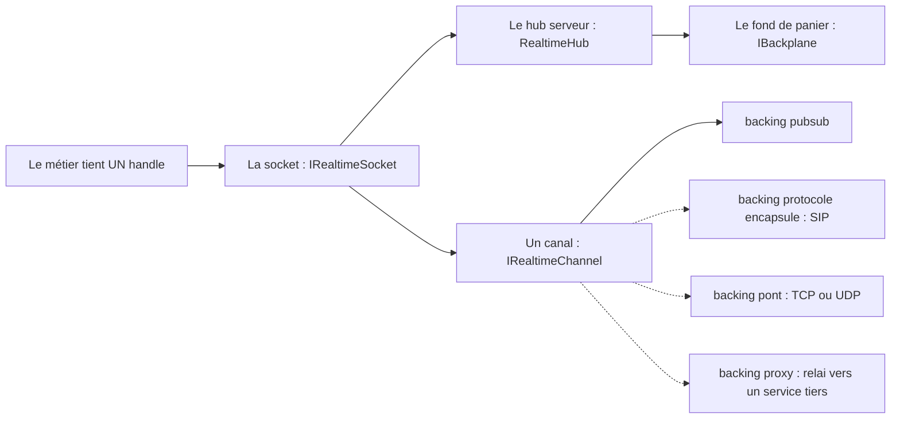
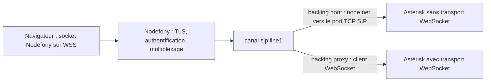

# La socket Nodefony — la trajectoire vers les protocoles

> Où va la socket Nodefony au-delà du pub/sub — encapsuler un autre protocole, ponter du TCP/UDP,
> proxifier un service tiers — pourquoi c'est crédible, et comment on y va sans big-bang. Cette page
> est une **direction**, pas une référence : le fonctionnement actuel de la socket est documenté,
> ancré au code, dans le module [`@nodefony/realtime`](../../src/packages/@nodefony/realtime/docs/index.md).

📍 [Documentation](../index.md) › [Architecture](README.md) › **La socket Nodefony — trajectoire**

## Schéma général

Trait plein = ce qui existe et tourne. Trait pointillé = la direction que cette page décrit.



## 📖 Lexique

| Terme              | Développé / traduction                       | En une ligne                                                                               |
| ------------------ | -------------------------------------------- | ------------------------------------------------------------------------------------------ |
| **socket**         | la prise                                     | Le handle unique que tient le métier — front ou back. Il ignore le transport.              |
| **canal**          | sous-flux nommé                              | Un tuyau duplex multiplexé sur la socket, identifié par son nom.                           |
| **backing**        | doublure, ce qui est derrière                | Ce à quoi un canal est raccordé côté serveur : pub/sub, protocole, pont, proxy.            |
| **fond de panier** | _backplane_                                  | Le médium qui relie plusieurs instances de la MÊME application (fan-out cross-pod).        |
| **pont**           | _bridge_                                     | Canal câblé vers une autre couche de transport (TCP, UDP).                                 |
| **proxy**          | mandataire                                   | Canal qui relaie vers un autre service, sans le remplacer.                                 |
| **SIP**            | _Session Initiation Protocol_                | Protocole texte de signalisation téléphonique (établir, modifier, raccrocher un appel).    |
| **SDP**            | _Session Description Protocol_               | La description des médias négociée à l'intérieur d'un échange SIP.                         |
| **B2BUA**          | _Back-to-Back User Agent_                    | Un intermédiaire SIP qui termine l'appel des deux côtés et peut réécrire la signalisation. |
| **SFU**            | _Selective Forwarding Unit_                  | Serveur média qui réachemine les flux WebRTC sans les ré-encoder.                          |
| **AIMD**           | _Additive Increase, Multiplicative Decrease_ | Boucle de cadence : on accélère par petits pas, on ralentit d'un coup (comme TCP).         |
| **NAT**            | _Network Address Translation_                | Traduction d'adresses qui casse les adresses annoncées dans la signalisation SIP.          |
| **WSS**            | WebSocket sur TLS                            | Le transport chiffré par lequel un navigateur ouvre la socket Nodefony.                    |

## Qu'est-ce que cette page — et ce qu'elle n'est pas

Cette page ne décrit **pas** le fonctionnement de la socket. Ce serait une seconde vérité, et une
seconde vérité dérive toujours de la première. Elle décrit **où la socket va**.

Si tu cherches comment ça marche aujourd'hui, va directement à la bonne page du module :

| Ce que tu cherches                                           | La page qui le dit                                                                                   |
| ------------------------------------------------------------ | ---------------------------------------------------------------------------------------------------- |
| Les couches (socket, hub, fond de panier) et leur assemblage | [Architecture du module](../../src/packages/@nodefony/realtime/docs/architecture.md)                 |
| Le sens exact de socket, canal, hub, backplane, pair         | [Vocabulaire](../../src/packages/@nodefony/realtime/docs/vocabulaire.md)                             |
| La grammaire des frames JSON-RPC 2.0 et les codes d'erreur   | [Protocole](../../src/packages/@nodefony/realtime/docs/protocole.md)                                 |
| `publish` / `subscribe` / `on` / `request` en situation      | [Actions RPC](../../src/packages/@nodefony/realtime/docs/actions.md)                                 |
| Le choix du driver de fond de panier et son réglage          | [Configuration](../../src/packages/@nodefony/realtime/docs/configuration.md)                         |
| La diffusion entre pods et la règle qui évite les boucles    | [Architecture, section « Le backplane »](../../src/packages/@nodefony/realtime/docs/architecture.md) |
| Ce que la socket dit d'elle-même (sonde, santé, écrans)      | [Observabilité](../../src/packages/@nodefony/realtime/docs/observabilite.md)                         |
| Qui entre, qui écoute, jusqu'à quand                         | [Sécurité du temps réel](../../src/packages/@nodefony/realtime/docs/securite.md)                     |
| Un exemple complet de bout en bout                           | [Cookbook — un chat temps réel](../../src/packages/@nodefony/realtime/docs/cookbook-chat.md)         |

## La vision Nodefony — un canal, plusieurs natures de backing

Le principe DX tient en une phrase : **la socket, c'est le patron**. Un consommateur ne parle jamais
au transport brut, il parle à sa socket — et cela vaut des deux côtés du fil. Côté navigateur,
`RealtimeClient` implémente le contrat ; côté serveur, `ServerRealtimeSocket` implémente
`IRealtimeSocket` (`ServerRealtimeSocket.ts:47`) au-dessus du hub, si bien qu'un service back code
comme une page front.

La trajectoire découle de ce contrat. Un canal est **duplex par nature**, et le contrat prévoit déjà
que ce qu'il y a derrière lui soit interchangeable : `IRealtimeChannel.kind` (`IRealtimeSocket.ts:94`)
annonce la nature du backing. **Le catalogue visé** :

### `pubsub` — la diffusion d'événements

Des notifications JSON-RPC sur un canal nommé (`dashboard:stats`, `room:42`). C'est le seul backing
qui existe aujourd'hui, et c'est celui qui porte tout le temps réel applicatif.

### `protocol` — l'encapsulation d'un autre langage

Le canal transporte un **autre protocole** tunnelé dans la socket : du SIP sur `sip:line1`, par
exemple. Le canal parle un autre langage ; la socket, elle, ne change pas.

### `bridge` — le pont vers une autre couche de transport

Le canal est câblé vers du **TCP ou de l'UDP** (`node:net`, `node:dgram`). Le client reste sur sa
socket WebSocket ; c'est le serveur qui traduit le cadrage d'un bout à l'autre.

### `proxy` — le relai vers un service tiers

Le canal relaie vers un autre service qui parle déjà le bon protocole. Nodefony reste le point
d'entrée (TLS, authentification, observabilité) sans se substituer au service.

> [!IMPORTANT]
> Le fond de panier n'est **pas** un backing de la même famille. Il fait passer un fan-out d'un pod à
> l'autre **à l'intérieur de la même application** ; un pont ou un proxy câble un canal vers
> l'**extérieur**. Confondre les deux mène à des architectures qui ne tiennent pas.

## 🧩 Le point d'accroche — pourquoi les couches d'après se branchent sur le handle

Un canal de type appel ou connexion est un **tuyau avec état**. C'est pourquoi la socket expose deux
formes d'adressage, en couches :

1. Les primitives par **nom de canal** (`subscribe` / `on` / `publish`) — le moteur.
2. Un **handle par canal**, `socket.channel(name)`, fine liaison au-dessus des primitives
   (`RealtimeClient.channel()` (`RealtimeClient.ts:499`)). Il porte son nom, sa nature, son cycle de vie.

Le handle est le bon point d'accroche parce qu'il permet d'ajouter des couches **sans retoucher le
hub** — c'est écrit dans le contrat lui-même (`IRealtimeChannel` (`IRealtimeSocket.ts:81`)) :

- le **codec de protocole** (SIP) ;
- le **pont** et le **proxy** ;
- la **cadence par canal** — la boucle AIMD existe déjà côté client (`AdaptiveRate`
  (`AdaptiveRate.ts:78`), branchée par `bindAdaptiveChannel()` (`AdaptiveRate.ts:239`)) : la lib
  accélère par petits pas et ralentit d'un coup quand le fil sature ;
- la **politique de débordement par canal** — `drop` (décimer : un canal d'état n'a besoin que de la
  dernière valeur), `coalesce` (fusionner les mises à jour d'un même tick), `batch` (grouper : un flux
  d'événements se batche, il ne se décime pas). C'est une direction, pas un réglage disponible.

## 🚧 Pourquoi c'est crédible

Le pari est ambitieux **en largeur** — un catalogue de backings — pas en difficulté d'algorithme.
Aucune de ces briques n'est de la recherche : chacune a une référence éprouvée ailleurs.

| Brique                  | Référence éprouvée                                       |
| ----------------------- | -------------------------------------------------------- |
| Pair JSON-RPC isomorphe | JSON-RPC 2.0, protocole texte trivial à corréler         |
| Canaux multiplexés      | Socket.IO rooms, Phoenix channels, ActionCable           |
| Fond de panier pub/sub  | `socket.io-redis-adapter`, `Phoenix.PubSub`              |
| Pont TCP / UDP          | `node:net` et `node:dgram` — Node pur, aucune dépendance |
| SIP sur WebSocket       | RFC 7118, SIP.js                                         |

Le principe qui dé-risque : **des seams indépendants, livrés un par un, avec un produit utile à
chaque étape**. Une socket qui multiplexe des canaux est déjà utile sans fond de panier ; un fond de
panier est déjà utile sans pont ; un pont est déjà utile sans SIP. Jamais de big-bang, jamais de
branche qui vit six mois.

Deux points demandent de la **rigueur** plutôt que de l'ambition. Le hub serveur, d'abord : canaux
partagés, duplex, fan-out — c'est la vraie viande, et elle se tient sous discipline mémoire (un
listener attaché sans nettoyage se paie en production). Le SIP et les médias, ensuite : on porte du
code déjà en production, on n'invente pas.

## 🏭 La preuve — une couche temps réel déjà en production chez un opérateur télécom

Le modèle n'est pas une hypothèse de laboratoire. Il valide une couche temps réel **qui tourne chez un
opérateur télécom** : la bibliothèque `nodefony-client` v6 (repo local `/Users/cci/repository/nodefony-client`).

Correspondance entre l'ancienne lib et le modèle actuel :

| `nodefony-client` (en production)                      | Le modèle Nodefony                        | Nature                         |
| ------------------------------------------------------ | ----------------------------------------- | ------------------------------ |
| `transports/websocket`, `transports/socket`            | `IRealtimeTransport`                      | **refait neuf** (pas porté)    |
| `sendAsync` + corrélation par `nodefonyId`             | `JsonRpcPeer.request` (JSON-RPC 2.0)      | **refait neuf**                |
| `transport.on("subscribe" / "unsubscribe")`            | `subscribe` / `unsubscribe` sur la socket | **refait neuf**                |
| `transport.on("sip", msg)`                             | `socket.channel("sip:…").on()`            | **contrat déjà posé**          |
| `protocols/sip` (parsing SDP, dialogues, transactions) | backing `protocol` d'un canal             | **à porter — le protocolaire** |
| `protocols/bayeux` (pub/sub CometD)                    | canaux JSON-RPC natifs                    | remplacé                       |
| `medias/webrtc` + le repo `nodefony-mediasoup`         | backing média, SFU                        | l'infrastructure existe        |

## 🔌 La directive de portage SIP — le protocolaire, jamais le transport

La règle est nette, et elle évite l'erreur la plus coûteuse du portage.

**On ne reprend pas** la couche `transports/` de l'ancienne bibliothèque. Le neuf est meilleur :
un seam d'octets propre plus un pair JSON-RPC isomorphe.

**On ne reprend que le protocolaire** de `protocols/sip` — parsing SDP, dialogues, transactions,
messages, timers de retransmission — et on le glisse comme backing d'un canal.

Pourquoi c'est sûr : SIP est **transport-agnostique par nature**. Il consomme et produit des messages
texte, rien d'autre. Dans l'ancienne bibliothèque il ne faisait déjà que recevoir sur
`transport.on("sip", msg)` et renvoyer des chaînes — donc **déjà découplé**. Dans le modèle actuel :

```ts ignore
// entrant : le canal livre les messages SIP au codec
channel.on((raw) => sip.receive(raw));

// sortant : le codec les renvoie par le canal
channel.send(sipText);
```

C'est même **plus propre** que l'original, où l'objet SIP tenait une référence directe au transport.
Ici il ne connaît que son canal.

## 🌉 Le pont vers Asterisk — legacy par le pont, moderne par le proxy

Le client parle **toujours** la socket Nodefony, en WSS. C'est le serveur qui branche le canal `sip:…`
sur le backing adéquat, selon ce que sait faire le serveur de téléphonie en face.



- **Asterisk sans transport WebSocket** → backing **pont**. La traduction de cadrage (frame WebSocket
  d'un côté, `Content-Length` sur TCP de l'autre) fait partie du protocolaire porté.
- **Asterisk avec transport WebSocket** (RFC 7118) → backing **proxy**, quasi-passthrough, bien plus
  simple.

Les **deux** backings sont visés, et ils valent aussi pour Kamailio ou FreeSWITCH.

**Pourquoi proxifier par Nodefony même quand Asterisk sait faire du WebSocket** — c'est de la valeur,
pas un contournement :

- un **point d'entrée TLS unique**, avec l'authentification et le pare-feu applicatif déjà en place ;
- le SIP **multiplexé sur la même socket** que les autres canaux de l'application (un seul handle
  pour la téléphonie et pour le métier) ;
- l'**observabilité** : les frames SIP passent par la sonde et les écrans, comme le reste ;
- le **cross-pod** : le canal profite du fond de panier sans rien savoir de lui.

Deux modes de proxy, les deux visés :

1. **Proxy simple** — relai d'octets, Nodefony ne parse pas le SIP. Trivial, et suffisant quand le
   serveur en face fait déjà tout.
2. **B2BUA** — Nodefony parse, réécrit `Via` et `Contact` pour traverser le NAT, enregistre les
   dialogues. C'est ce mode qui consomme le protocolaire porté.

## ⚠️ Pièges

| Symptôme                                                             | Cause                                                                             | Correction                                                                                                                                         |
| -------------------------------------------------------------------- | --------------------------------------------------------------------------------- | -------------------------------------------------------------------------------------------------------------------------------------------------- |
| « Le fond de panier me servira à joindre Asterisk »                  | Confusion entre fan-out interne et câblage externe                                | Le fond de panier relie les instances d'une même app ; un service tiers se joint par un pont ou un proxy.                                          |
| Un message publié sur un pod n'arrive pas aux clients de l'autre pod | La diffusion entre pods est **opt-in par préfixe**, pas automatique               | Déclarer le préfixe via `RealtimeHub.markBroadcastChannel()` (`RealtimeHub.ts:365`) — cf la page Architecture du module.                           |
| On veut porter aussi la couche `transports/` de l'ancienne lib       | Réflexe de portage exhaustif                                                      | Ne porter que le protocolaire. Le transport et la corrélation ont été refaits, et ils sont meilleurs.                                              |
| On lit `channel.kind` et il vaut `undefined`                         | Le champ est **déclaré** dans le contrat, mais seul le backing pub/sub existe     | Ne pas brancher de logique dessus tant qu'un backing ne l'annonce pas.                                                                             |
| « J'appelle l'utilisateur X où qu'il soit » ne marche pas cross-pod  | Le fond de panier est un plan **pub/sub**, pas un annuaire de pairs               | Un RPC ciblé vers un pair distant demande une couche en plus (savoir qui est où) — elle n'est pas offerte par la simple diffusion.                 |
| Le fan-out cross-pod ne part jamais                                  | Le médium partagé n'est pas joignable par tous les pods (question de déploiement) | C'est un problème d'infrastructure, pas d'architecture : réseaux isolés → prévoir un relai, qui est lui-même une implémentation du fond de panier. |

## 🧪 Tests

`tests: none` — **assumé**. Cette page est une page de **direction** : elle ne documente aucune API à
couvrir, et un compteur de tests y serait un chiffre sans objet.

Le socle sur lequel elle s'appuie, lui, est testé dans le module. La couverture réelle (unitaires,
intégration, cluster, backplane, sécurité) est inventoriée par la page
[Tests du module realtime](../../src/packages/@nodefony/realtime/docs/index.md) — c'est là que vit le
chiffre, régénéré, jamais recopié ici.

## 🔗 Pour aller plus loin

- ⬆️ **Retour** : [Architecture — concepts transverses](README.md) · [Toute la documentation](../index.md)
- [`@nodefony/realtime` — le hub du module](../../src/packages/@nodefony/realtime/docs/index.md) — la
  socket telle qu'elle fonctionne aujourd'hui, page par page.
- [Architecture du module](../../src/packages/@nodefony/realtime/docs/architecture.md) — les couches,
  le hub, le fond de panier.
- [Vocabulaire](../../src/packages/@nodefony/realtime/docs/vocabulaire.md) — les mots figés, pour ne
  pas confondre socket, canal, hub et fond de panier.
- [ADR-0002 — schéma de conférence WebRTC / mediasoup](../adr/0002-schema-conference-webrtc-mediasoup.md)
  — la brique média vers laquelle pointe le backing du même nom.
- Code de référence : le contrat isomorphe `IRealtimeSocket` (`IRealtimeSocket.ts:122`), la façade
  serveur `ServerRealtimeSocket` (`ServerRealtimeSocket.ts:47`), le registre de drivers de fond de
  panier `registerBackplaneDriver()` (`backplaneRegistry.ts:55`).
