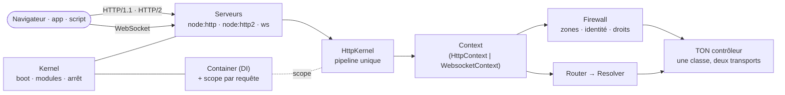
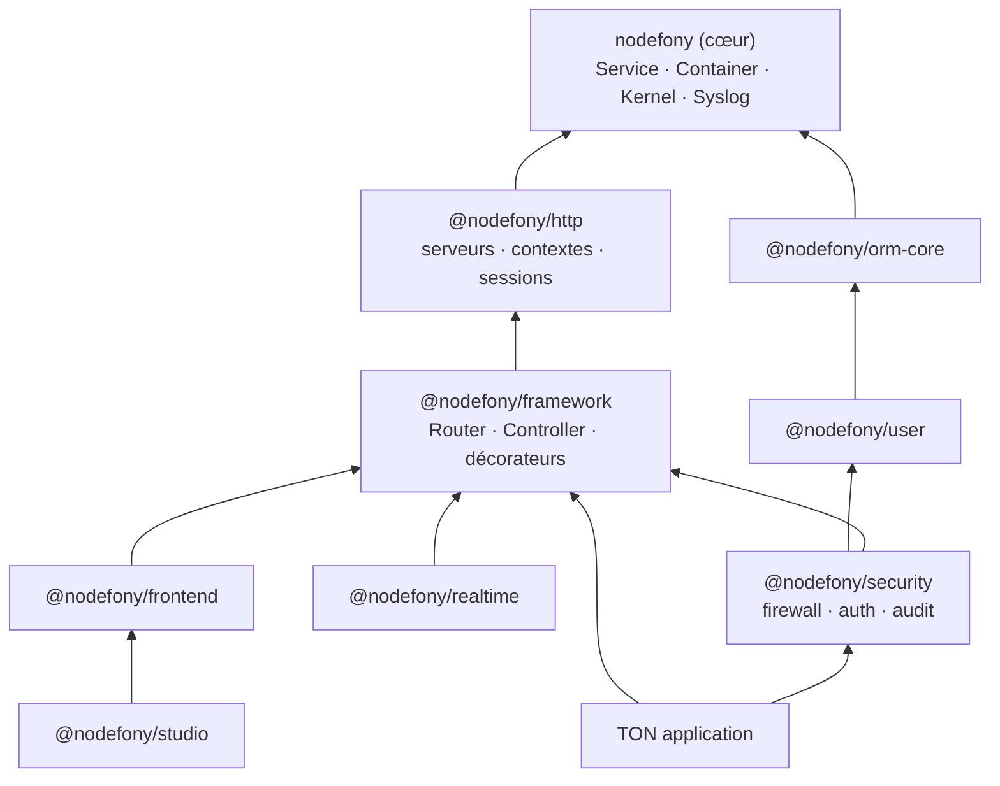
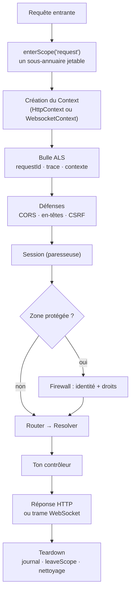
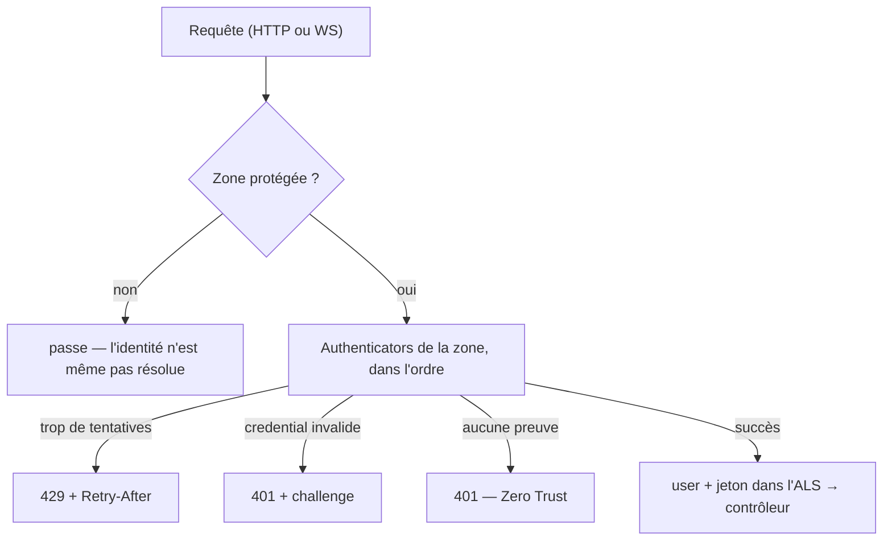

# Nodefony — vue d'ensemble

> Nodefony est un framework Node.js **fullstack** en TypeScript dont le parti pris tient en une
> phrase : **HTTP et WebSocket sont co-citoyens**. Même noyau, même conteneur de services, même
> routeur, même firewall, et surtout **le même contexte de contrôleur** — une route web et un canal
> temps réel s'écrivent dans la même classe, avec les mêmes décorateurs. Cette page pose la carte du
> territoire : ce qu'est le framework, ce qu'il n'est pas, ses partis pris et ce qu'ils coûtent.

📍 [Documentation](../index.md) › **Vue d'ensemble**

## 🧠 Le modèle mental — un moteur, deux portes d'entrée

La plupart des stacks Node ont **deux moteurs** : un pour le web (Express, Fastify) et un pour le
temps réel (Socket.IO). Deux routages, deux sessions, deux façons de vérifier un droit. Nodefony n'en
a qu'**un** — les transports sont deux portes sur le même couloir.



Trois pièces suffisent à tout comprendre :

1. le **Kernel** allume l'application et charge les **modules** ;
2. le **Container** distribue les services, avec un sous-annuaire jetable par requête ;
3. le **Context** porte la requête — qu'elle soit HTTP ou WebSocket — jusqu'à ton contrôleur.

## 📖 Lexique

| Sigle / terme | Développé                            | En une ligne                                                                           |
| ------------- | ------------------------------------ | -------------------------------------------------------------------------------------- |
| **Kernel**    | (noyau)                              | Le chef d'orchestre : lit la config, charge les modules, ouvre les serveurs, arrête.   |
| **Module**    | (unité chargeable)                   | Un paquet greffable sur le cycle de vie. Ton application **est** un module.            |
| **Container** | (conteneur de services)              | L'annuaire des services partagés, et le porteur des portées.                           |
| **Scope**     | (portée)                             | Sous-annuaire créé par requête, jeté à la fin — l'isolation entre requêtes.            |
| **Context**   | (contexte de requête)                | L'objet qui porte une requête de bout en bout, HTTP **ou** WebSocket.                  |
| **Resolver**  | (résolveur)                          | Ce qui traduit « route matchée » en « méthode de contrôleur appelée ».                 |
| HTTP/HTTPS    | HyperText Transfer Protocol (Secure) | Le protocole requête→réponse du web ; « S » = chiffré par TLS.                         |
| HTTP/2        | —                                    | Version multiplexée de HTTP (plusieurs échanges sur une seule connexion).              |
| WS/WSS        | WebSocket (Secure)                   | Canal bidirectionnel persistant ; « S » = chiffré par TLS.                             |
| TLS           | Transport Layer Security             | La couche de chiffrement sous HTTPS et WSS.                                            |
| DI            | Dependency Injection                 | Fournir à un objet ses dépendances au lieu qu'il les fabrique lui-même.                |
| ALS           | AsyncLocalStorage                    | Stockage Node.js qui suit une requête à travers tout l'asynchrone (id, trace, user).   |
| BFF           | Backend-For-Frontend                 | Le serveur gère session et jetons pour le front web (cookie opaque, pas de JWT au JS). |
| CSP           | Content-Security-Policy              | En-tête qui limite les sources de scripts (anti-XSS).                                  |
| CSRF          | Cross-Site Request Forgery           | Un site tiers déclenche une requête authentifiée à l'insu de la victime.               |
| CSWSH         | Cross-Site WebSocket Hijacking       | La variante CSRF appliquée à l'ouverture d'un WebSocket.                               |
| CORS          | Cross-Origin Resource Sharing        | Les règles qui autorisent (ou non) un site à lire la réponse d'une autre origine.      |
| RBAC          | Role-Based Access Control            | Des droits accordés selon le rôle porté par l'utilisateur.                             |
| JWT           | JSON Web Token                       | Jeton signé, auto-porté, présenté par un client machine.                               |
| ORM           | Object-Relational Mapping            | La couche qui traduit objets ↔ lignes de base de données.                              |
| HMR           | Hot Module Replacement               | Le rechargement à chaud du frontend, sans perdre l'état de la page.                    |
| RFC           | Request For Comments                 | Les standards officiels d'Internet (IETF).                                             |

## Qu'est-ce que Nodefony — et ce qu'il n'est pas

**Un framework applicatif complet**, au sens où il fournit d'emblée ce qu'une application de
production finit toujours par redemander : un cycle de vie de démarrage discipliné, une injection de
dépendances, un routeur à décorateurs, des sessions, un pare-feu applicatif, une couche ORM, un
builder frontend et une console d'administration.

Ce qu'il **n'est pas**, dit franchement :

- **Ce n'est pas un micro-framework HTTP.** Express et Fastify te donnent un routeur et te laissent
  assembler le reste ; Nodefony arrive avec le reste déjà assemblé. Si ton besoin est « servir trois
  routes JSON », Nodefony est surdimensionné — et c'est une réponse honnête.
- **Ce n'est pas un clone de Symfony ni de NestJS.** Des idées éprouvées sont reprises (conteneur de
  services, événements de cycle de vie, firewall par zones, contrôleurs à décorateurs), mais
  l'architecture, la terminologie et surtout le modèle de transport unifié lui sont propres.
- **Ce n'est pas un runtime alternatif.** Les serveurs s'appuient sur Node.js natif :
  `node:http` et `node:http2` (`ServerHttp.createServer()`, `server-http.ts:68`), `node:https`
  (`ServerHttps.createServer()`, `server-https.ts:80`), et la bibliothèque `ws` pour le WebSocket
  (`Websocket.createServer()`, `server-websocket.ts:62`). Pas de moteur maison, pas de `Bun.serve()`.
- **Ce n'est pas une bibliothèque temps réel greffée à côté.** Le WebSocket n'est pas un module
  optionnel branché sur le serveur web : il traverse **le même pipeline**, avec la même session et le
  même firewall.

> [!NOTE]
> Nodefony vise deux familles d'applications avec le même socle : les applications web temps réel
> (le web et le canal poussé cohabitent nativement) et les back-ends d'agents IA (jetons machine,
> scopes, idempotence, audit). Le cœur reste **générique** — aucune logique métier n'y vit.

## La vision Nodefony — HTTP et WebSocket, co-citoyens

L'affirmation se vérifie à trois endroits du code, pas dans un slogan.

**1. Une seule classe de base porte la requête.** `HttpContext` et `WebsocketContext` héritent tous
deux de `Context` — l'objet qui transporte session, utilisateur, identifiant de requête et décision
du firewall :

| Transport | Classe                                   | Ancrage                  |
| --------- | ---------------------------------------- | ------------------------ |
| Commun    | `class Context extends Service`          | `Context.ts:123`         |
| HTTP/2    | `class HttpContext extends Context`      | `HttpContext.ts:77`      |
| WebSocket | `class WebsocketContext extends Context` | `WebsocketContext.ts:83` |

**2. Les deux traversent le même résolveur.** `HttpContext.handle()` appelle `router.resolve(this)`
puis `resolver.callController()` (`HttpContext.ts:206`) ; `WebsocketContext.handle()` fait exactement
la même chaîne, en passant en plus les données de la trame (`WebsocketContext.ts:265`). Un seul
`Router` (`router.ts:124`), un seul `Resolver` (`Resolver.ts:86`).

**3. Une route déclare ses transports, elle ne choisit pas son monde.** Le transport est une
**exigence de route** parmi d'autres : `Route.match()` compare `context.method` — qui vaut
littéralement `"WEBSOCKET"` sur une socket — au `methodsSet` précompilé de la route
(`Route.ts:561`). Une même action peut donc déclarer `methods: ["GET", "WEBSOCKET"]` et répondre aux
deux portes.

Ce que ça change concrètement : **une** session, **un** modèle de droits, **un** identifiant de
requête tracé, **un** journal — que l'appel arrive en HTTP/1.1, en HTTP/2 ou par une trame WebSocket.
Ce que porte `Context` pour les deux transports : `router` (`Context.ts:159`), `resolver`
(`Context.ts:160`), `session` (`Context.ts:152`), `user` (`Context.ts:154`), la décision du firewall
(`Context.ts:125`), le `requestId` (`Context.ts:184`) et le nonce CSP paresseux (`Context.ts:192`).

## 🚀 Démarrage rapide

**Le besoin.** Tu veux une application qui serve une route JSON **et** un écho temps réel, sans
monter deux serveurs ni dupliquer ta configuration.

`npx nodefony create app mon-app` génère le squelette : `nodefony.config.ts` (les écarts aux défauts
du framework), `env.ts` (le catalogue typé des variables d'environnement), `index.ts` (le module de
l'app) et un premier contrôleur. Voici les deux fichiers qui comptent.

### 1. La configuration — `nodefony.config.ts`

```typescript
// nodefony.config.ts — UN fichier : seulement les ÉCARTS aux défauts du framework.
// Le par-environnement passe par `ctx`, jamais par un fichier parallèle.
export default defineConfig(() => ({
  // Un conteneur doit écouter toutes les interfaces : un bind 127.0.0.1
  // n'est jamais atteint par le port mapping Docker/k8s.
  domain: "127.0.0.1",
  // Manifeste ORDONNÉ : l'ordre du tableau EST l'ordre de chargement.
  modules: [
    // Socle serveur : HTTP/1.1, HTTP/2 et WebSocket natifs.
    use("@nodefony/http", {}),
    // Routeur + contrôleurs + décorateurs (@controller, @route).
    "@nodefony/framework",
  ],
}));
```

### 2. Le contrôleur — un fichier, deux transports

```typescript
// nodefony/controllers/HelloController.ts — complet, compile tel quel
import {
  route,
  controller,
  Controller,
  CurrentUser,
} from "@nodefony/framework";
import type { ContextType } from "@nodefony/http";

@controller("/api")
class HelloController extends Controller {
  constructor(context: ContextType) {
    super("hello", context);
  }

  // Route HTTP classique. `@CurrentUser()` injecte l'utilisateur résolu par la
  // zone firewall qui couvre ce chemin — hors zone, il n'est jamais résolu.
  @route("route-hello", { path: "/hello", method: "GET" })
  async hello(@CurrentUser() user?: { identifier?: string }) {
    return this.renderJson({
      hello: "mon-app",
      who: user?.identifier ?? "anonyme",
    });
  }

  // MÊME classe, MÊME décorateur : seul le transport déclaré change.
  // L'action reçoit en plus le contenu de la trame reçue.
  @route("route-echo", {
    path: "/echo",
    requirements: { methods: ["WEBSOCKET"] },
  })
  async echo(message: string | Buffer | null) {
    if (!message) return this.renderJson({ handshake: true });
    return this.renderJson({ echo: message.toString() });
  }
}

export default HelloController;
```

### 3. Ce qu'on observe

```bash
# Démarrage en développement (rebuild + redémarrage automatiques).
npx nodefony development

# 1) La porte HTTP
curl -s http://127.0.0.1:5151/api/hello
# {"hello":"mon-app","who":"anonyme"}

# 2) La porte WebSocket — MÊME contrôleur, même pipeline, même journal
wscat -c ws://127.0.0.1:5151/api/echo
# > bonjour
# < {"echo":"bonjour"}
```

Aucune passerelle à déclarer, aucun serveur temps réel à monter, aucune configuration en double.
C'est le différenciateur, en trente lignes.

## 🗂️ La carte des modules

Un module Nodefony est une unité **déclarée**, jamais découverte par magie : le manifeste
`modules` de `nodefony.config.ts` est lu par `Kernel.resolveModuleEntries()` (`Kernel.ts:1091`) puis
chargé par `Kernel.loadModulesFromManifest()` (`Kernel.ts:1150`). L'ordre du tableau **est** l'ordre
de chargement ; la résolution ne fait que **filtrer** (une entrée `policy: "dev"` disparaît hors
développement, une garde `when(config)` fausse écarte l'entrée).



> [!IMPORTANT]
> `@nodefony/http` ne peut **jamais** importer `@nodefony/framework` : ce serait une dépendance
> circulaire. Le transport accède au résolveur par le contexte, jamais par un import. C'est la
> contrainte qui garde le socle réutilisable.

### Choisir en cinq secondes

| Famille            | Modules                                                               | Tu en as besoin quand…                           |
| ------------------ | --------------------------------------------------------------------- | ------------------------------------------------ |
| **Cœur runtime**   | [`nodefony`](../../src/nodefony/docs/index.md) · `http` · `framework` | toujours — c'est le socle                        |
| **Sécurité**       | `security` · `user`                                                   | tu as des comptes, des droits, des jetons        |
| **Données**        | `orm-core` · `drizzle` · `mongoose` · `redis`                         | tu persistes quoi que ce soit                    |
| **Temps réel**     | `realtime`                                                            | tu multiplexes des canaux au-dessus du WebSocket |
| **Frontend**       | `frontend`                                                            | tu sers une SPA (Vite, HMR, multi-framework)     |
| **Administration** | `studio` · `documentation`                                            | tu veux voir l'instance tourner de l'intérieur   |

### [`nodefony`](../../src/nodefony/docs/index.md) — le socle

`Service` (`Service.ts:43`) est la classe de base de **tout** : Kernel, Module, contrôleurs, services
métier. Elle apporte l'accès au conteneur, l'émission d'événements et le journal structuré. Au-dessus
vivent `Kernel` (`Kernel.ts:350`), `Module` (`Module.ts:60`) et `Container` (`Container.ts:93`).
Commence par sa page si tu veux comprendre « pourquoi tout hérite de la même chose ».

### [`@nodefony/http`](../../src/packages/@nodefony/http/docs/index.md) — le transport

Serveurs HTTP/1.1, HTTP/2, HTTPS et WebSocket, contextes de requête, sessions, certificats TLS. C'est
ici que naît le `Context` que ton contrôleur reçoit, et ici que vit le pipeline unique
(`HttpKernel`, `http-kernel.ts:171`). À lire quand tu touches au transport, aux sessions ou aux
en-têtes.

### [`@nodefony/framework`](../../src/packages/@nodefony/framework/docs/index.md) — écrire des routes

`Router` (`router.ts:124`), `Controller` (`Controller.ts:112`), `Resolver` (`Resolver.ts:86`) et les
décorateurs que tu utilises tous les jours : `controller()` (`routerDecorators.ts:75`), `route()`
(`routerDecorators.ts:157`), `Get` (`routerDecorators.ts:361`), `IsGranted()`
(`routerDecorators.ts:663`), `CurrentUser` (`routerDecorators.ts:1001`). C'est la surface que tu
manipules le plus.

### [`@nodefony/security`](../../src/packages/@nodefony/security/docs/index.md) — protéger l'application

Pare-feu applicatif par zones, stratégies d'authentification, autorisation par rôles et voters,
CSRF/CORS/en-têtes, audit. La brique la plus fournie du dépôt — et la seule dont la mauvaise
configuration se paie en incident.

## 🏗️ Le moteur en marche

Trois mouvements, résumés ici ; chacun a sa page dédiée, plus détaillée.

### Le boot — une chaîne de phases, jamais un big-bang

Le démarrage est une suite d'**événements ordonnés**, déclarés en masque de bits
(`Events`, `Kernel.ts:222`) : `onInit` → `onPreStart` → `onStart` → `onPreRegister` → `onRegister` →
`onPreBoot` → `onBoot` → `onReady` → `onServersReady` → `onPostReady`. La chaîne est portée par
`Kernel.start()` (`Kernel.ts:548`), `Kernel.boot()` (`Kernel.ts:799`), `Kernel.onReady()`
(`Kernel.ts:829`) et `Kernel.initServers()` (`Kernel.ts:916`).

Un module se greffe sur ces phases en définissant `onKernelRegister`, `onKernelBoot` ou
`onKernelReady` : `Module.setEvents()` (`Module.ts:206`) les attache, et n'attache **que** ceux qui
existent — pas de listener orphelin.

> [!TIP]
> Les phases sensibles passent par `Kernel.fireLifecycle()` (`Kernel.ts:2513`), qui borne chaque hook
> par un délai et par la criticité du module. Un module non critique qui échoue à son boot ne tue pas
> le process (`Kernel.recordBootFailure()`, `Kernel.ts:2257`) : c'est la résilience « fail-soft ».
> Le détail complet, y compris le verdict de boot et l'arrêt drainé →
> [cycle de boot du Kernel](cycle-boot-kernel.md).

### Une requête — le trajet en gros plan



Les points d'ancrage, dans l'ordre réel (`http-kernel.ts`) : `HttpKernel.onHttpRequest()` (`:819`)
reçoit la requête et pose le socle d'en-têtes ; `HttpKernel.handle()` ouvre le scope
(`enterScope("request")`, `:636`) ; `HttpKernel.createHttpContext()` (`:1078`) construit le contexte
et pose **un unique** `response.once("close")` (`:1093`) qui déclenchera le teardown ;
`HttpKernel.handleHttp()` (`:1117`) entre dans la bulle `RequestContext.run` (`:1151`), applique CORS
(`:1168`), résout la route puis pose les en-têtes de sécurité (`:1193`) ; `HttpKernel.onRequestEnd()`
(`:1250`) enchaîne CSRF (`:1283`), session (`HttpKernel.startSession()`, `:1006`) et firewall
(`:1294`) ; enfin `HttpKernel.teardownHttp()` (`:1029`) journalise, quitte le scope et nettoie.

Côté WebSocket, la même partition : `HttpKernel.onWebsocketRequest()` (`:1353`) borne le handshake et
ouvre le scope, `HttpKernel.createWebsocketContext()` (`:1315`) pose un `once("onFinish")` (`:1322`)
qui sauvegarde la session et libère le scope, `HttpKernel.onConnect()` (`:1515`) vérifie l'origine
(`HttpKernel.checkWebsocketOrigin()`, `:509` — la garde anti-CSWSH) puis passe la main au firewall et
au contrôleur. À la fermeture, `toWsCloseCode()` (`WebsocketContext.ts:55`) traduit un statut HTTP en
code de fermeture conforme RFC 6455 §7.4 — un 401 devient un `1008`.

Le pas-à-pas exhaustif, avec le détail de chaque garde →
[pipeline de requête](pipeline-requete.md).

### L'injection — deux annuaires, un héritage natif

Le `Container` racine (`Container.ts:93`) tient les services partagés. À chaque requête,
`Container.enterScope()` (`Container.ts:293`) ouvre un **scope** : un sous-container qui hérite du
parent par **chaîne de prototypes JavaScript** (`Object.create(parent.protoService.prototype)`,
`Container.ts:127`). Résoudre un service du parent depuis un scope ne coûte donc aucun saut logiciel
— c'est le moteur JS qui remonte la chaîne.

Les services courts (résolveur, session, contexte) sont posés sur le scope en propriété propre
(`Scope.set()`, `Container.ts:466`) : ils **masquent** le parent sans le polluer, et
`Container.leaveScope()` (`Container.ts:312`) nettoie tout à la fin de la requête.

Les décorateurs, l'ordre d'instanciation et les pièges de portée →
[injection & portées](injection-portees.md). Comment la configuration alimente tout ça →
[configuration](configuration.md).

## 🔐 La sécurité en un coup d'œil

Le pare-feu applicatif de `@nodefony/security` raisonne par **zones** : un motif d'URL, une politique.
`Firewall.matchPath()` (`firewall.ts:529`) rattache la requête à la zone dont le motif est le plus
spécifique ; `Firewall.isSecure()` (`firewall.ts:538`) répond « protégée ou non » sur le chemin chaud ;
`Firewall.handleSecurity()` (`firewall.ts:561`) ne travaille que sur zone protégée.



Deux points à retenir dès maintenant :

- **La politique par défaut est Zero Trust** : sur une zone protégée, pas de preuve valide = 401. Une
  route « publique » qui veut néanmoins connaître l'utilisateur doit lister `anonymous`
  explicitement — c'est l'authenticator enregistré à `authenticatorRegistry.ts:72`.
- **Le WebSocket est couvert par le même firewall** : la zone est résolue pareil, et l'autorisation
  descend jusqu'aux canaux.

La carte complète (zones, authenticators, rôles, voters, audit) →
[hub sécurité](../../src/packages/@nodefony/security/docs/index.md) puis
[firewall](../../src/packages/@nodefony/security/docs/firewall.md).

## Je viens d'ailleurs — Express, NestJS, Symfony

Trois profils, trois façons d'atterrir. Ce qui se ressemble, ce qui change, ce qu'il faut désapprendre.

### Je viens d'Express

**Ce qui se ressemble.** Le routage reste « un chemin, une méthode, une fonction ». La stratégie de
résolution t'est même familière : Nodefony est **router-first** — si aucune route ne matche, on
retombe sur le service de fichiers statiques (`http-kernel.ts:1193` et suivantes), exactement comme
un `express.static()` placé en fin de chaîne.

**Ce qui change.** Il n'y a pas de `app.use(middleware)` empilable à volonté. Le pipeline est **fixe
et ordonné** (défenses → session → firewall → routage → contrôleur), et tu t'y greffes par des points
d'accroche nommés : `onCreateContext`, `beforeResolve`, `afterAuth`, `onAuthFailure`. Ces seams sont
gardés par `listenerCount` — sans écouteur, ils ne créent **aucune** microtask.

**Ce qu'il faut désapprendre.** Le réflexe « je poserai un middleware pour ça ». En Nodefony, une
préoccupation transverse est soit un **service** injecté, soit un **décorateur** sur l'action
(`@IsGranted`, `@Idempotent`, `@Csp`), soit un **module** qui s'abonne à une phase. L'ordre n'est
alors plus une propriété fragile de ton fichier d'entrée.

### Je viens de NestJS

**Ce qui se ressemble.** Beaucoup : les contrôleurs à décorateurs (`@controller`, `@Get`, `@Param`,
`@Body`, `@Query`), l'injection de dépendances, les gardes d'autorisation, l'idée de modules. Une
garde `@IsGranted` s'applique **avant** l'instanciation du contrôleur, au niveau du résolveur — même
contrat qu'un `CanActivate` : `Resolver.executeActionGuarded()` (`Resolver.ts:425`) enveloppe
l'action, et `Resolver._enforceSecurity()` (`Resolver.ts:576`) tranche, fail-closed en 403.

**Ce qui change.** Deux choses. D'abord, **pas de gateway WebSocket séparée** : là où Nest te
demande un `@WebSocketGateway()` distinct de tes contrôleurs, Nodefony te fait déclarer le transport
sur la route (`requirements: { methods: ["WEBSOCKET"] }`) — même classe, même session, même firewall.
Ensuite, le conteneur résout **par nom** dans un annuaire, pas par un graphe de providers compilé par
module ; la portée par requête est un scope réel, ouvert et fermé par le pipeline.

**Ce qu'il faut désapprendre.** L'idée qu'un « module » doit déclarer `imports`, `providers` et
`exports` pour que l'injection fonctionne. Ici un module déclare ses services avec `@services([...])`
et le Kernel les instancie dans un ordre calculé par tri topologique de leurs dépendances.

### Je viens de Symfony

**Ce qui se ressemble.** Le vocabulaire, et ce n'est pas un hasard : kernel avec des événements de
cycle de vie, conteneur de services, firewall par zones, rôles hiérarchiques, voters pour
l'autorisation. Si `security.firewalls` et `role_hierarchy` te parlent, tu liras la config de
`@nodefony/security` sans lexique.

**Ce qui change.** La configuration est du **TypeScript typé et validé** — un seul
`nodefony.config.ts` avec des fonctions `(ctx) => …` pour le par-environnement, plus un `env.ts` qui
est le seul lecteur de `process.env`. Il n'y a ni YAML, ni fichier par environnement, ni étape de
compilation du conteneur : les services sont instanciés au boot, dans l'ordre de leurs dépendances.

**Ce qu'il faut désapprendre.** Chercher un équivalent ligne à ligne. Nodefony **n'est pas** un
portage de Symfony en TypeScript : les invariants de sécurité sont proches parce qu'ils sont bons,
mais le modèle de transport unifié, le scope par chaîne de prototypes et l'orientation temps réel
n'ont pas d'équivalent côté PHP.

## Les partis pris — et ce qu'ils coûtent

Un choix d'architecture qui ne coûte rien n'est pas un choix. Voici les nôtres, avec leur facture.

| Parti pris                                  | Ce qu'il apporte                                                     | Ce qu'il coûte                                                                       |
| ------------------------------------------- | -------------------------------------------------------------------- | ------------------------------------------------------------------------------------ |
| **Pipeline fixe** plutôt que middlewares    | Ordre garanti, défenses jamais contournées par erreur                | Moins de liberté d'insertion : il faut passer par un seam ou un décorateur           |
| **HTTP et WS dans le même contexte**        | Une session, un firewall, un journal pour les deux                   | Le socle transport est plus gros qu'un simple serveur HTTP                           |
| **Node.js natif** (`node:http`, `ws`)       | Zéro couche d'abstraction exotique, conformité RFC directe           | Pas de gains « magiques » d'un runtime alternatif                                    |
| **Zero Trust par défaut** sur zone protégée | Aucune route protégée n'est ouverte par oubli                        | Une route publique dans une zone doit lister `anonymous` — sinon 401 surprenant      |
| **Modules déclarés** (manifeste ordonné)    | Chargement prévisible, filtrable par environnement, lisible en revue | Rien n'est découvert tout seul : un module oublié dans le manifeste n'existe pas     |
| **TypeScript strict, ESM uniquement**       | Types réels de bout en bout, tree-shaking                            | Pas de `require()`, pas de dépendance CommonJS non convertie                         |
| **1 process = 1 conteneur** (cloud-native)  | Scaling délégué à l'orchestrateur, logs vers la sortie standard      | Pas de superviseur de process intégré : c'est k8s, systemd ou Docker qui redémarre   |
| **Allocation paresseuse partout**           | Coût par requête très bas sur les chemins non utilisés               | Le code interne est plus verbeux (gardes `listenerCount`, initialisations différées) |

## 📜 Normes appliquées

| Domaine                      | Norme                          | Ancrage code                                              |
| ---------------------------- | ------------------------------ | --------------------------------------------------------- |
| Sémantique HTTP, 405         | RFC 9110                       | `Route.match()` (`Route.ts:561`)                          |
| Challenge d'authentification | RFC 7235                       | `Firewall.handleSecurity()` (`firewall.ts:561`)           |
| Fermeture WebSocket          | RFC 6455 §7.4                  | `toWsCloseCode()` (`WebsocketContext.ts:55`)              |
| Partage cross-origin         | Fetch Standard (WHATWG)        | `Firewall.handleCors()` (`http-kernel.ts:1168`)           |
| Anti-CSRF                    | Fetch Metadata + double-submit | `Firewall.enforceCsrf()` (`http-kernel.ts:1283`)          |
| Anti-CSWSH (origine WS)      | OWASP WSTG-CLNT-10             | `HttpKernel.checkWebsocketOrigin()` (`:509`)              |
| Journal structuré            | RFC 5424                       | `Pdu` (`Pdu.ts:114`) · `Service.log()` (`Service.ts:209`) |
| Propagation de trace         | W3C Trace Context              | `HttpKernel.handleHttp()` (`http-kernel.ts:1117`)         |

## ⚡ Performance & mémoire

Nodefony est un framework **runtime** : chaque allocation par requête se multiplie par le débit. La
règle interne est donc l'allocation paresseuse, et elle se lit dans le code.

- **Rien n'est alloué « au cas où ».** Les buckets de scopes du conteneur restent `null` tant
  qu'aucun scope n'est ouvert (`Container.scopes`, `Container.ts:101`) ; le tampon de requêtes ORM du
  profileur n'existe qu'en développement (`profilerQueries`, `http-kernel.ts:1144`) ; le nonce CSP
  n'est calculé que si une directive en a besoin (`Context.cspNonce`, `Context.ts:192`).
- **Zéro microtask pour un seam inutilisé.** Les points d'accroche optionnels sont gardés par
  `listenerCount` avant tout `await` — sans module de sécurité, ils ne planifient rien.
- **Un seul écouteur de fin de requête.** `createHttpContext()` pose un unique
  `response.once("close")` (`http-kernel.ts:1093`) qui déclenche le teardown : pas de paire
  `finish`/`close` à démonter à la main.

Ces choix sont **mesurés**, pas postulés. La suite `memory.test.ts` impose des plafonds de croissance
du tas côté serveur : 1000 GET séquentiels sous 35 MB (`memory.test.ts:117`), 100 connexions
WebSocket ouvertes puis fermées sous 30 MB (`memory.test.ts:214`), 100 crashs consécutifs sous 10 MB
(`memory.test.ts:127`). Un seuil qui saute est un blocage, pas un avertissement.

## 📡 Observabilité — Studio

Studio est la console d'administration du framework, servie sur `/nodefony`
(`StudioController.ts:45`). Elle montre l'instance **telle qu'elle tourne**, pas telle que les
fichiers la décrivent : configuration résolue, modules chargés, routes déclarées, sessions actives,
journal, firewall, temps réel — et cette documentation elle-même.

Les données viennent d'un plan de données conventionnel : tout module exposant une API
d'administration la publie sous `/nodefony/<module>/api/*`. C'est aussi ce qui permet à Studio
d'afficher les pages de doc d'un module à côté de son code.

En incident, le réflexe utile est toujours le même : **comparer ce que Studio affiche à ce que tu
crois avoir déployé**. Neuf « pourtant j'ai bien configuré ça » sur dix se règlent là.

## ⚠️ Pièges (symptôme → cause → correction)

| Symptôme                                     | Cause                                                                    | Correction                                                            |
| -------------------------------------------- | ------------------------------------------------------------------------ | --------------------------------------------------------------------- |
| Un module n'est pas chargé                   | Absent du manifeste, ou `policy: "dev"` hors dev, ou garde `when` fausse | Vérifier l'entrée dans `modules` de `nodefony.config.ts`              |
| `401` sur une route censée être publique     | Zone protégée + aucune preuve : c'est le Zero Trust                      | Lister `anonymous` dans la zone, ou revoir le motif de zone           |
| Une requête WebSocket n'atteint pas l'action | La route ne déclare pas le transport                                     | Ajouter `requirements: { methods: ["WEBSOCKET"] }`                    |
| `405` sur une action pourtant existante      | La méthode demandée n'est pas dans le `methodsSet` de la route           | Déclarer toutes les méthodes voulues (`["GET", "WEBSOCKET"]`)         |
| L'état d'une requête « fuit » sur une autre  | Service posé sur le conteneur racine au lieu du scope de requête         | Poser le service sur le scope, jamais sur le conteneur partagé        |
| `does not provide an export named 'default'` | `import nodefony from "nodefony"` — il n'y a pas d'export par défaut     | `import { Nodefony } from "nodefony"`                                 |
| `does not provide an export named 'kernel'`  | L'ancien singleton exporté n'existe plus                                 | `Nodefony.getKernel()`                                                |
| Le boot se fige au démarrage                 | Un service dont l'initialisation pend (base ou cache injoignable)        | Vérifier l'infrastructure ; cf [cycle de boot](cycle-boot-kernel.md)  |
| Une route ajoutée renvoie 404 au démarrage   | Artefact de build périmé après un changement d'export public             | Reconstruire proprement ; cf [build & bundling](build-bundling.md)    |
| `Cannot read properties of null` à l'import  | Le kernel est déréférencé au chargement d'un fichier de config           | Passer par un getter paresseux ; cf [configuration](configuration.md) |

## 🧪 Tests & couverture

Cette page est **transverse** : elle ne possède aucune suite propre, elle décrit un moteur couvert
par les suites de tous les modules. Les compteurs exacts vivent dans la carte de l'aperçu, régénérée
depuis vitest — jamais figés dans ce fichier.

Ce qui couvre réellement les affirmations de cette page :

- **unitaires** — le cœur (`src/nodefony/src/tests/`) pour `Service`, `Container`, scopes, Kernel et
  syslog ; `@nodefony/framework` pour le routeur, le résolveur et les décorateurs.
- **intégration (serveur réel)** — `@nodefony/http` pour le pipeline complet, HTTP comme WebSocket,
  ainsi que les défenses (CORS, CSRF, en-têtes) ; `src/modules/test` fournit les contrôleurs
  d'intégration exercés par ces bancs.
- **charge et mémoire** — `tests/load/**` et `memory.test.ts` de `@nodefony/http` : plafonds de tas,
  connexions WebSocket soutenues, latence. Suite **séparée** de la non-régression, à lancer avant
  tout changement touchant le pipeline. Outils : skills `nodefony-load-test` et
  `nodefony-check-memory-health`.
- **attaque** — les bancs `*.attack.test.ts` de `@nodefony/security` exercent le firewall et les
  défenses en conditions hostiles. Outil : skill `nodefony-security-review`.

Ce qui **n'existe pas ici** : aucun banc de contrat multi-backend n'est rattaché à cette page (elle
ne décrit aucun contrat à implémentations multiples — ceux-ci vivent dans les modules qui les
possèdent : stores de session, d'idempotence, adaptateurs ORM).

Couverture : `npm run coverage` dans chaque module concerné.

## 🔗 Pour aller plus loin

- ⬆️ **Retour au hub** : [Toute la documentation](../index.md)
- 🧭 **La suite du parcours « Je découvre Nodefony »** :
  [Cycle de boot du Kernel](cycle-boot-kernel.md) › [Injection & portées](injection-portees.md) ›
  [Le cœur](../../src/nodefony/docs/index.md)

- Le trajet exact d'une requête, pas à pas → [pipeline de requête](pipeline-requete.md)
- `nodefony.config.ts`, `env.ts`, `use()` et la validation au boot → [configuration](configuration.md)
- Comment le dépôt se construit et se distribue → [build & bundling](build-bundling.md)
- Écrire des routes et des contrôleurs → [`@nodefony/framework`](../../src/packages/@nodefony/framework/docs/index.md)
- Le transport, les contextes et les sessions → [`@nodefony/http`](../../src/packages/@nodefony/http/docs/index.md)
- Protéger l'application → [`@nodefony/security`](../../src/packages/@nodefony/security/docs/index.md)
- Choisir et brancher sa base → [persistance](../guides/persistence.md) ·
  [`@nodefony/orm-core`](../../src/packages/@nodefony/orm-core/docs/index.md)
- Exploiter en production → [Docker & cloud-native](../guides/docker-cloud-native.md)
- Pourquoi tel choix a été fait → les [décisions d'architecture](../adr/README.md)
