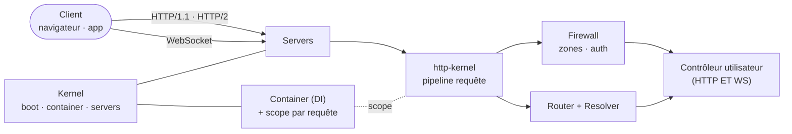
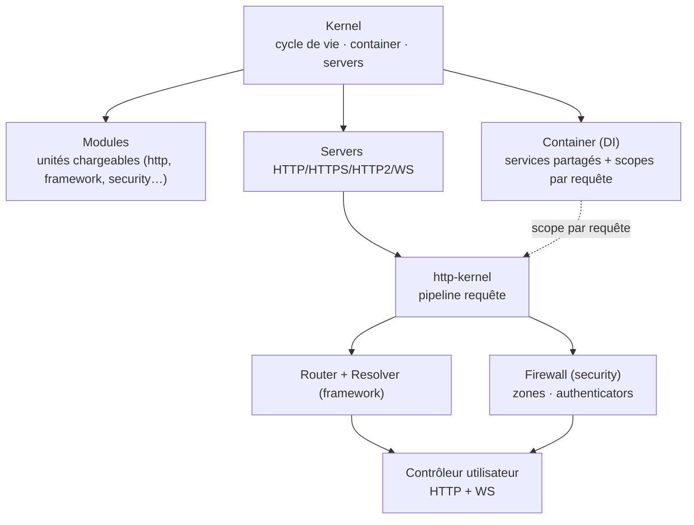
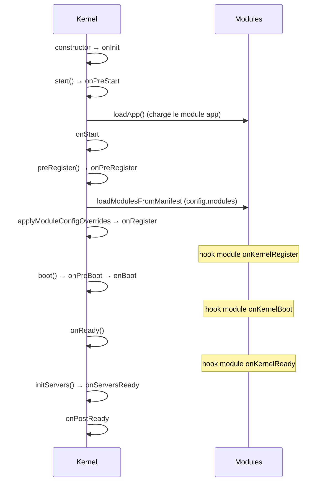
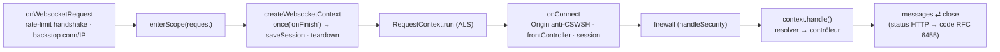
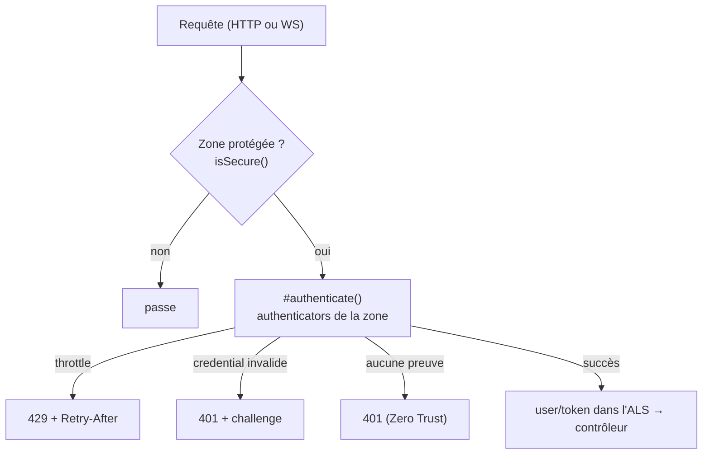

# Nodefony — vue d'ensemble

> Un framework Node.js fullstack en TypeScript où **HTTP et WebSocket partagent le même
> contrôleur, nativement**. Cette page donne la carte du moteur : le boot, le cycle d'une
> requête, l'injection de dépendances et le firewall — chaque affirmation ancrée sur le code.

## Schéma général

## Lexique

| Sigle      | Développé                            | En une ligne                                                              |
| ---------- | ------------------------------------ | ------------------------------------------------------------------------- |
| HTTP/HTTPS | HyperText Transfer Protocol (Secure) | Le protocole requête→réponse du web ; « S » = chiffré par TLS.            |
| HTTP/2     | —                                    | Version multiplexée de HTTP (plusieurs échanges sur une connexion).       |
| WS/WSS     | WebSocket (Secure)                   | Canal bidirectionnel persistant ; « S » = chiffré par TLS.                |
| TLS        | Transport Layer Security             | La couche de chiffrement sous HTTPS/WSS.                                  |
| DI         | Dependency Injection                 | Fournir à un objet ses dépendances au lieu qu'il les crée lui-même.       |
| Scope      | (portée)                             | Sous-annuaire de services créé par requête, jeté à la fin.                |
| ALS        | AsyncLocalStorage                    | Stockage Node.js qui suit une requête à travers tout l'async (id, trace). |
| CSP        | Content-Security-Policy              | En-tête qui limite les sources de scripts (anti-XSS).                     |
| CSRF       | Cross-Site Request Forgery           | Un site tiers force une requête authentifiée à l'insu de la victime.      |
| CSWSH      | Cross-Site WebSocket Hijacking       | Variante CSRF sur l'ouverture d'un WebSocket depuis une origine tierce.   |
| CORS       | Cross-Origin Resource Sharing        | Règles autorisant (ou non) un site à appeler une autre origine.           |
| RBAC       | Role-Based Access Control            | Droits accordés selon le rôle de l'utilisateur.                           |
| JWT        | JSON Web Token                       | Jeton signé porté par le client pour prouver son identité.                |
| RFC        | Request For Comments                 | Les standards officiels d'Internet (IETF).                                |
| UUID       | Universally Unique Identifier        | Identifiant unique (ici : l'id de chaque requête).                        |

## Qu'est-ce qu'un « framework fullstack temps réel » ?

Un serveur web classique répond à des **requêtes** (une question, une réponse, fin). Le temps réel,
lui, garde un **canal ouvert** pour pousser des messages dans les deux sens. La plupart des stacks
traitent ces deux mondes séparément : un outil pour le web, un autre pour le temps réel — donc deux
routages, deux sessions, deux façons de vérifier un droit. **Nodefony les unifie.**

## La vision Nodefony

Nodefony fait passer HTTP **et** WebSocket par **le même moteur** : même cycle de vie, même
injection de dépendances, même routeur, même firewall, et surtout **le même contexte de contrôleur**.
Écrire une fonctionnalité temps réel devient aussi simple qu'écrire une route web — on réutilise le
routage, la session et la sécurité au lieu de les réinventer. Le reste de cette page détaille ce
moteur, ancré au code.

## Le différenciateur en une image

Dans la plupart des stacks, le web « requête → réponse » (Express, Fastify) et le temps réel
« connexion → messages » (Socket.IO) vivent dans **deux mondes séparés** : deux serveurs, deux
modèles de routage, deux façons de lire la session ou de vérifier un droit. Nodefony les fait
tenir dans **un seul monde**.

Concrètement, `HttpContext` et `WebsocketContext` héritent de la **même** classe de base
`Context` :

- `HttpContext extends Context` — `src/packages/@nodefony/http/nodefony/src/context/http/HttpContext.ts:77`
- `WebsocketContext extends Context` — `src/packages/@nodefony/http/nodefony/src/context/websocket/WebsocketContext.ts:83`
- base commune `class Context` — `src/packages/@nodefony/http/nodefony/src/context/Context.ts:123`

Et les deux traversent **le même** résolveur pour appeler **le même** style de contrôleur :

- HTTP : `HttpContext.handle()` → `router.resolve(this)` → `resolver.callController()`
  (`HttpContext.ts:206`, `:221-226`)
- WS : `WebsocketContext.handle()` → même chaîne (`WebsocketContext.ts:265`, `:271-290`)

> [!NOTE]
> Un contrôleur déclare ses routes HTTP et WebSocket avec **les mêmes décorateurs**. La seule
> différence : une route WS pose `requirements: { methods: ["WEBSOCKET"], protocol }` et son
> action reçoit un argument `message` en plus des variables de route. Preuve côté code :
> `src/modules/test/nodefony/controller/RouteController.ts` (HTTP) et
> `src/modules/test/nodefony/controller/WebSocketController.ts:33-216` (WS), tous deux via `@route`.

Ce que ça change en pratique : une session, un modèle de sécurité, un routeur, un contexte
d'exécution — réutilisés à l'identique que la requête arrive en HTTP/1.1, HTTP/2 ou WebSocket.

## Les grandes pièces

Vocabulaire (les mots exacts du code, pas des synonymes) :

- **Kernel** — le chef d'orchestre : il lit la configuration, charge les modules dans l'ordre,
  instancie les services, ouvre les serveurs, et orchestre l'arrêt propre. Classe
  `Kernel` — `src/nodefony/src/kernel/Kernel.ts`.
- **Module** — une unité chargeable (`@nodefony/http`, `@nodefony/framework`, …). Une app est
  elle-même un module (`index.ts` racine `class App extends Module`). Classe `Module` —
  `src/nodefony/src/kernel/Module.ts`.
- **Container** — l'annuaire des services et le porteur des **scopes** (un sous-annuaire par
  requête). Classe `Container` — `src/nodefony/src/Container.ts`.
- **Context** — l'objet-requête partagé HTTP+WS décrit plus haut.

## Le cycle de boot

Le boot est une **chaîne de phases** dans un ordre figé ; chaque phase émet un événement que les
modules peuvent capter. La séquence réelle (méthodes du `Kernel`) :

Ancrages : bitmask des événements `Kernel.ts:222-234` ; `onInit` `Kernel.ts:533` ; `start/onPreStart`
`Kernel.ts:637` ; `loadApp` `Kernel.ts:646` (def `:1543`) ; `onStart` `Kernel.ts:668` ; `preRegister`
`Kernel.ts:699` ; `onRegister` `Kernel.ts:729` ; `boot/onPreBoot/onBoot` `Kernel.ts:803-808` ;
`onReady` `Kernel.ts:830` ; `initServers/onServersReady` `Kernel.ts:927` ; `onPostReady`
`Kernel.ts:853`. Les hooks de module sont mappés sur ces phases par `Module.setEvents()`
(`Module.ts:206`) : `onKernelRegister→onRegister` (`:212`), `onKernelBoot→onBoot` (`:218`),
`onKernelReady→onReady` (`:224`).

> [!TIP]
> Les phases sensibles passent par `fireLifecycle()` (`Kernel.ts:2513`), qui **garde chaque hook**
> par un timeout et par la criticité du module : un module non critique qui échoue à son boot ne
> tue pas le process (`recordBootFailure`, `Kernel.ts:1175`). C'est la résilience « fail-soft ».

### Comment les modules sont choisis

Les modules ne sont pas découverts « magiquement » : ils sont **déclarés** dans
`nodefony.config.ts` sous `modules` (`nodefony.config.ts:100`), via des chaînes ou l'assistant
`use(name, config, opts)`. `resolveModuleEntries()` (`Kernel.ts:1091`) **préserve l'ordre** du
tableau (= la priorité de chargement) et se contente de **filtrer** : une entrée `policy: "dev"`
est retirée hors dev (`:1114`), une entrée dont `when(config)` est faux est écartée (`:1118`).
Le chargement lui-même fait un `import()` dynamique résolu depuis l'app (`Kernel.ts:1072`).

## Le pipeline d'une requête HTTP

```mermaid
flowchart LR
  A["onHttpRequest<br/>headers sécu · probes · rate-limit"] --> B["handle()<br/>enterScope(request)"]
  B --> C["createHttpContext<br/>once('close') → teardown"]
  C --> D["RequestContext.run<br/>(ALS : requestId, trace)"]
  D --> E["CORS · route-match · parse body"]
  E --> F["onRequestEnd<br/>frontController · CSRF · session · firewall"]
  F --> G["ctx.handle()<br/>resolver → contrôleur"]
  G --> H["render / send"]
  H --> I["teardownHttp<br/>log · profiler · leaveScope · clean"]
```

Ancrages (`src/packages/@nodefony/http/nodefony/service/http-kernel.ts`) : entrée `onHttpRequest`
`:819` (probes santé `:848-859`, rate-limit IP `:865-892`) ; `handle` + `enterScope("request")`
`:631-636` ; `createHttpContext` `:1078` avec un unique `response.once("close")` `:1093` ; bulle ALS
`RequestContext.run` `:1151` ; CORS préflight `:1168` ; route-match hissé avant le parse `:1181-1184` ;
`onRequestEnd` `:1250` (front controller `:1275`, CSRF `enforceCsrf` `:1283`, session `startSession`
`:1288`, firewall `handleSecurity` `:1290-1308`) ; `teardownHttp` `:1029` (log `:1049`, profiler
`:1053`, `leaveScope`+`clean` `:1062-1063`).

> [!IMPORTANT]
> Le chemin chaud est **avare en allocations** (règle de perf du framework) : réponses de santé
> pré-allouées (`:97-102`), en-têtes de sécurité pré-calculés au boot (`Context.ts:256-280`),
> et chaque hook optionnel est gardé par `listenerCount` — zéro microtask créée si personne
> n'écoute (`onCreateContext` `:1131`, `afterAuth` `:1297`, `onFinish` `:1059`).

## Le pipeline WebSocket — et le contexte partagé

Ancrages : `onWebsocketRequest` `http-kernel.ts:1353` (rate-limit handshake close 1013 `:1377-1380`,
backstop connexions/IP `:1386-1393`, `enterScope` `:1399`) ; `createWebsocketContext` `:1315` avec
`once("onFinish")` qui **sauve la session** et libère le scope `:1322-1348` ; `onConnect` `:1515`
(garde d'Origin anti-CSWSH `checkWebsocketOrigin` `:509`+`:1532`, session `:1550`, `connect()` `:1552`) ;
firewall `:1450-1468`. À la fermeture, `WebsocketContext` traduit le statut HTTP en **code de
fermeture RFC 6455 §7.4.1** (`WebsocketContext.ts:56-71`, ex. 401/403 → 1008).

Ce que la base `Context` porte **pour les deux transports** (`Context.ts`) : `resolver` (`:160`),
`router` (`:159`), `session` (`:152`), `user` (`:154`), `sessionIntent` (`:166`), `requestId`
(`:184`), le nonce CSP paresseux (`:191`), les jetons CSRF (`:181-183`), le `traceparent` (`:199`),
la décision du firewall (`security`, `:124-127`) et les mesures de phases (`:223`). Un droit vérifié,
une session chargée, un identifiant de requête tracé : **le même mécanisme**, que ce soit une page
HTTP ou une trame WebSocket.

## Injection de dépendances et portées

Le `Container` racine tient les services partagés (syslog, router, firewall…). À chaque requête,
`enterScope("request")` ouvre un **scope** : un sous-container qui hérite du parent par **chaîne de
prototypes JS** (`Object.create(parent.protoService.prototype)`, `Container.ts:127`), donc la
résolution d'un service parent est native (0 hop logiciel). Les services courts (résolveur, session,
contexte) sont posés sur le scope en _own-property_ (`Container.ts:466`) — ils **masquent** sans
polluer le parent, et `leaveScope` nettoie tout (`Container.ts:312`). L'ordre d'instanciation des
`@services([...])` d'un module est un tri topologique stable (Kahn) des dépendances
(`serviceOrder.ts:71`).

Détails et pièges : voir [container](../../src/nodefony/docs/container.md) et
[injection](../../src/nodefony/docs/injection.md).

## La sécurité en un coup d'œil

Le **firewall applicatif** (`@nodefony/security`) est un pare-feu par **zones** : chaque requête est
rattachée à la zone dont le motif est le plus spécifique (`firewall.ts:223-232`, `matchPath`
`:529-535`). Sur une zone protégée, `handleSecurity()` (`:561-659`) applique une politique **Zero
Trust** : sans preuve d'identité valide, c'est 401 (`:613-626`). Les authenticators sont essayés dans
l'ordre déclaré par la zone (`:918-976`) ; les briques intégrées sont `anonymous`, `userpassword`,
`session`, `jwt`, `apikey` (`authenticatorRegistry.ts:72-117`).

Le même firewall couvre le WebSocket : un `SessionRealtimeAuthenticator` est câblé au handshake et un
`frameAuthorizer` filtre les trames par canal (`firewall.ts:253-331`).

## Normes appliquées (visibles dans le code)

| Domaine                | Norme                          | Ancrage code                            |
| ---------------------- | ------------------------------ | --------------------------------------- |
| Challenge d'auth (401) | RFC 7235                       | `firewall.ts:122`, `:559`, `:978`       |
| Rate limit (429)       | RFC 6585                       | `firewall.ts:585-587`                   |
| Méthodes sûres, 405    | RFC 9110                       | `firewall.ts:751` · `router.ts:261-291` |
| CSRF / anti-forgery    | Fetch Metadata + double-submit | `firewall.ts:764-784`                   |
| Backoff de connexion   | NIST SP 800-63B                | `authenticatorRegistry.ts:75-79`        |
| Fermeture WebSocket    | RFC 6455 §7.4.1                | `WebsocketContext.ts:56-71`             |

## Pour aller plus loin

- Le contexte partagé en détail → `src/packages/@nodefony/http/docs/`
- Routage, contrôleurs, décorateurs → `src/packages/@nodefony/framework/docs/`
- Le modèle de sécurité complet → `src/packages/@nodefony/security/docs/`
- DI et portées → [container](../../src/nodefony/docs/container.md)
- Le cycle de vie du kernel → [kernel](../../src/nodefony/docs/kernel.md)
