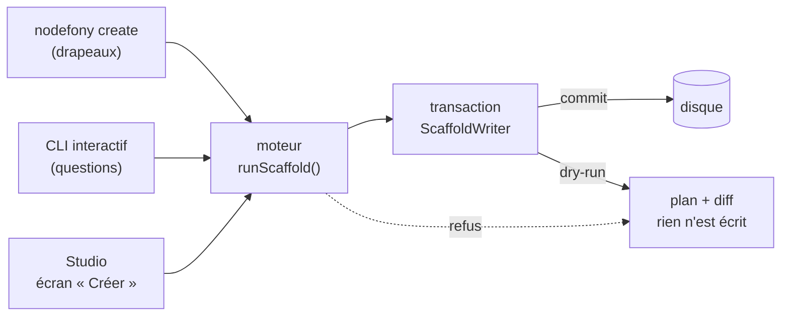

> **Ce que cette page vous donne** : comment créer une application, un module, un
> contrôleur, un frontend ou une entité sans écrire le squelette à la main — et
> surtout comment **voir ce qui va changer avant que ça change**. Elle s'adresse
> autant à la personne qui tape la commande qu'à l'agent qui l'appelle : les deux
> passent par la même porte, et cette porte sait se décrire.

📍 [Documentation](../index.md) › [Guides](README.md) › **Générer du code**

## Schéma général



Trois portes, **un** moteur. Le moteur ne parle jamais au terminal et n'ouvre
jamais de connexion : il transforme des réponses validées en fichiers. Tout ce
qu'il écrit passe d'abord par une transaction — c'est elle qui rend la
simulation possible, et qui garantit qu'un refus ne laisse rien derrière lui.

## Lexique

| Terme                      | Ce que ça veut dire                                                                                                                                        |
| -------------------------- | ---------------------------------------------------------------------------------------------------------------------------------------------------------- |
| **Scaffold** (échafaudage) | Génération d'un squelette de code prêt à tourner. Le résultat vous appartient : vous l'éditez, il n'est jamais régénéré par-dessus.                        |
| **Gabarit** (template)     | Fichier modèle rendu par le moteur. Ils vivent dans `src/nodefony/templates/`, un dossier par type de création.                                            |
| **Spec**                   | Description **déclarative** des questions d'un type (nom, valeurs permises, défaut). Elle est en JSON pur : les trois portes lisent la même.               |
| **Cible** (target)         | Où le code est écrit dans un projet existant : l'application racine, ou l'un de ses modules locaux (`modules/<nom>/`).                                     |
| **Câblage** (wiring)       | L'édition qui rend le code généré VIVANT : ajouter la classe au décorateur `@controllers([…])`, l'entité à `@entities([…])`, le module au manifeste.       |
| **Transaction**            | Les écritures sont retenues en mémoire et versées sur le disque en une seule fois, à la toute fin. Rien n'est écrit tant qu'une étape peut encore refuser. |
| **Simulation** (dry-run)   | La même exécution, sans le versement final. Rend le plan : fichiers à créer, et le diff de ceux qui seraient réécrits.                                     |

## Qu'est-ce que c'est ?

Un générateur de code est un **cuisinier qui prépare votre mise en place**. Il ne
cuisine pas le plat à votre place : il sort les bons ustensiles, coupe les
légumes dans le bon sens et pose tout à portée de main. Ce que vous obtenez est
un point de départ correct, pas une boîte noire — vous le modifiez librement dès
la seconde qui suit.

L'intérêt n'est pas de gagner les dix minutes qu'aurait pris la frappe. C'est
que le squelette soit **conforme** : les bons imports, la bonne structure de
dossiers, la validation branchée au bon endroit, le câblage fait. Ces détails-là
ne s'inventent pas, ils se copient — et une copie faite à la main copie aussi
les erreurs de l'exemple qu'elle a sous les yeux.

## La vision Nodefony

Le générateur est un **outil qu'on appelle**, pas une collection de fichiers
qu'on imite.

C'est une différence de nature. Un agent — ou un développeur pressé — qui imite
un fichier existant reproduit ce que cet exemple avait de particulier, y compris
ce qui a vieilli. Un appel, lui, part de la spec courante : `getScaffoldSpec()`
(`spec.ts:875`) décrit les types, leurs questions et leurs valeurs permises, et
`resolveAnswers()` (`engine.ts:464`) refuse tout ce qui sort de cette
description. Le générateur peut donc dire ce qu'il attend, et l'appelant n'a rien
à deviner.

Le second parti pris est qu'**un refus ne doit rien coûter**. Un scaffold est une
suite d'étapes dont plusieurs peuvent échouer tard : le nom de classe est déjà
pris, l'`index.ts` n'a pas de décorateur où insérer, un gabarit est cassé. Toutes
les écritures passent donc par une transaction (`ScaffoldWriter`,
`writer.ts:122`), et seul le scaffold racine la verse sur le disque
(`commit()`, `writer.ts:215`). Refuser redevient un non-événement.

## Démarrage rapide

```bash
# Une application neuve, hors de tout projet.
npx nodefony create app mon-app --preset minimal --frontend none
cd mon-app && npm run dev
```

Dans une application existante, on crée des briques :

```bash
# Un contrôleur HTTP + WebSocket dans la même classe.
npx nodefony create controller blog --kind hello

# Une entité et toute sa chaîne : table, schémas d'entrée, service, contrôleur REST, tests.
npx nodefony create entity Article title:string! body:text views:int
```

Le contrôleur produit par la première commande est exactement celui-ci — c'est le
même gabarit qui sert le contrôleur d'accueil d'une application neuve :

```typescript
// nodefony/controllers/BlogController.ts — extrait, compile tel quel
import {
  route,
  controller,
  Controller,
  CurrentUser,
} from "@nodefony/framework";
import type { ContextType } from "@nodefony/http";

@controller("/api/blog")
class BlogController extends Controller {
  constructor(context: ContextType) {
    super("blog", context);
  }

  @route("blog-index", { path: "", method: "GET" })
  async index(@CurrentUser() user?: { identifier?: string }) {
    return this.renderJson({
      hello: "blog",
      who: user?.identifier ?? "anonyme",
    });
  }

  // MÊME classe, MÊME décorateur : seul le transport déclaré change.
  @route("blog-echo", {
    path: "/echo",
    requirements: { methods: ["WEBSOCKET"] },
  })
  async echo(message: string | Buffer | null) {
    if (!message) return this.renderJson({ handshake: true });
    return this.renderJson({ echo: message.toString() });
  }
}

export default BlogController;
```

Ce qu'on observe :

```bash
curl http://127.0.0.1:5151/api/blog
# {"hello":"blog","pid":12345,"who":"anonyme"}
```

## Les cinq choses qu'on peut créer

| Type         | Ce que ça pose                                                                                                                                   | Où                        |
| ------------ | ------------------------------------------------------------------------------------------------------------------------------------------------ | ------------------------- |
| `app`        | Un projet complet : configuration, environnement typé, contrôleur d'accueil, tests, outillage. Deux presets, quatre frontends, quatre bases SQL. | Un dossier **neuf**       |
| `module`     | Un workspace npm sous `modules/<nom>/`, déclaré dans les workspaces et le manifeste `modules` de l'application.                                  | Dans le projet courant    |
| `controller` | Une classe de contrôleur, dans l'une des cinq saveurs (`hello`, `rest`, `duplex`, `realtime`, `example`), câblée à sa cible.                     | Application **ou** module |
| `front`      | Un frontend Vite : coquille HTML, point de montage, contrôleur de page, déclaration d'entrée.                                                    | Application **ou** module |
| `entity`     | La chaîne de persistance complète : table du dialecte, schémas d'entrée, service CRUD, contrôleur REST + socket, tests.                          | Application **ou** module |

Le détail des drapeaux de chaque type est dans `nodefony create --help`, et sous
forme lisible par une machine dans `--describe-json` (voir plus bas).

## Voir avant d'écrire

Créer une brique dans un projet existant ne fait pas qu'ajouter des fichiers :
ça **réécrit** les vôtres — l'`index.ts` gagne un import et une entrée de
décorateur, le `package.json` une dépendance, la configuration une ligne de
manifeste. `--dry-run` (ou `-n`) montre tout ça sans rien toucher :

```bash
npx nodefony create entity Article title:string --dry-run
```

```
🔍 simulation (--dry-run) — RIEN n'a été écrit

  5 fichier(s) à créer, 1 à réécrire

Créés :
  + nodefony/entity/Article.ts
  + nodefony/entity/Article.schema.ts
  + nodefony/service/ArticleService.ts
  + nodefony/controllers/ArticleController.ts
  + tests/article.test.ts

Réécrit : index.ts
  + import { ArticleEntity } from "./nodefony/entity/Article";
  + @entities([ArticleEntity])
  - @controllers([HelloController])
  + @controllers([HelloController, ArticleController])
```

Les créations sont listées à plat — leur contenu n'écrase rien. Les
**réécritures** montrent leur diff : c'est là que la simulation a de la valeur.

La simulation traverse le moteur en entier, gardes comprises : un scaffold qui
sera refusé l'est **déjà** ici, avec le même message. Elle ne peut donc pas
promettre un résultat que l'exécution refuserait.

## Un refus n'écrit rien

C'est une garantie, pas une intention. Quelle que soit l'étape qui refuse — nom
de classe déjà utilisé, `@controllers([…])` introuvable dans la cible, gabarit
cassé, dépendance manquante — le projet est dans l'état exact où vous l'avez
laissé.

```bash
npx nodefony create entity Article title:string
# create: ArticleEntity est déjà référencé dans index.ts — choisis un autre nom d'entité
# → aucun fichier créé, aucun fichier modifié
```

La garantie tient à la transaction, pas à la position des vérifications dans le
code : `runScaffold()` (`engine.ts:1034`) ouvre la transaction, chaque étape y
écrit, et le versement n'a lieu qu'après la dernière. Une garde ajoutée demain
est automatiquement sûre, où qu'elle soit placée.

> [!NOTE]
> Ce n'est pas de l'atomicité au sens du système de fichiers : aucune API
> portable ne l'offre pour un arbre de fichiers. Une panne disque en plein
> versement laisserait un résultat partiel. Ce que la transaction supprime, c'est
> le cas qui arrivait vraiment : une **décision** du moteur produisant un projet à
> moitié modifié.

## Piloter le générateur depuis un agent ou un script

Deux drapeaux suffisent, et ils fonctionnent pour les cinq types.

**Se faire décrire l'outil** — types, questions, valeurs permises, défauts,
capacités de l'environnement, et les cibles du projet courant si l'on est dans
une application :

```bash
npx nodefony create --describe-json           # tout le catalogue
npx nodefony create entity --describe-json    # ce type seulement
```

**Répondre en JSON**, depuis un fichier ou l'entrée standard :

```bash
echo '{"name":"Article","fields":"title:string! body:text"}' \
  | npx nodefony create entity --answers-json - --dry-run
```

Les drapeaux l'emportent sur le fichier : celui-ci porte le gros de la demande,
le drapeau est la retouche de l'appel.

> [!IMPORTANT]
> Une clé absente de la spec est **refusée** (code de sortie 64), pas ignorée.
> `resolveAnswers()` ne conserve que les clés déclarées : un `"prest"` écrit à la
> place de `"preset"` produirait un projet différent de celui demandé, sans un
> mot. Une personne relit le résultat ; un appelant automatique, non
> (`readAnswersJson()`, `create.ts:364`).

Combinés, ces trois drapeaux forment une boucle sûre pour un agent : se décrire
(`--describe-json`), proposer (`--answers-json … --dry-run`), puis exécuter.

## Depuis Studio

L'écran « Créer » de l'administration web passe par le **même moteur** : il
n'existe pas de seconde implémentation qui pourrait dériver. Il sert le
formulaire à partir de la spec (`/nodefony/studio/api/create/spec`), montre la
**préview** du plan avant d'exécuter (`preview()`,
`ScaffoldService.ts:333`), puis streame la progression du travail — écriture,
`npm install`, construction — sur un canal temps réel.

> [!WARNING]
> Ces routes écrivent sur le disque et lancent `npm`. Elles répondent **403 hors
> développement**, quel que soit le rôle : le refus est prononcé côté serveur, pas
> en masquant une entrée de menu. Les étapes exécutables sont une liste fermée —
> le client coche un identifiant d'étape, il n'envoie jamais une ligne de commande.

## Ce que le générateur ne fait pas

- **Il ne revient pas sur son travail.** Le code généré est copié dans votre
  projet, il vous appartient. Aucune commande ne le régénère par-dessus vos
  modifications — et c'est voulu : fusionner un gabarit avec du code édité est un
  problème sans bonne réponse.
- **Il ne produit pas de fichier de migration.** Une entité crée sa table au
  prochain démarrage en développement (`CREATE TABLE IF NOT EXISTS`) ; un champ
  ajouté qui **accepte le vide** y est posé au démarrage suivant, un champ
  **obligatoire** ne l'est jamais. En production, le schéma s'applique par
  `nodefony orm:migrate`, jamais par le générateur. La commande le dit dans ses
  notes de fin.
- **Il n'installe pas les dépendances d'une brique in-project.** Créer un
  contrôleur ou une entité n'appelle pas `npm`. Un **module**, si : sans le lien
  de workspace, le kernel ne peut pas l'importer par son nom.
- **Il n'édite pas votre code existant au-delà du câblage.** Un hook
  `onKernelBoot()` déjà présent n'est jamais réécrit : la commande rend une note
  avec le geste exact à faire à la main.

## Pièges

<!-- prettier-ignore -->
| Symptôme | Cause | Correction |
| --- | --- | --- |
| `aucun projet Nodefony ici` | Les types in-project remontent aux `nodefony.config.ts` depuis le dossier courant — vous êtes en dehors. | Se placer dans l'application, ou créer d'abord `nodefony create app`. |
| `X est déjà référencé dans index.ts` | Un contrôleur ou une entité porte déjà ce nom dans la cible. | Choisir un autre nom. Rien n'a été écrit : le projet est intact. |
| `@controllers([...]) introuvable` | L'`index.ts` de la cible n'a plus le décorateur où insérer la classe. | Le message donne l'édition exacte à faire à la main. Le fichier généré n'a pas été posé — pas d'orphelin. |
| Le module créé n'est pas chargé au démarrage | Un module est un **workspace npm** : sans `npm install`, le lien n'existe pas et le kernel ne le résout pas par son nom. | Lancer `npm install` à la racine de l'application, puis `npm run build`. |
| `npm run typecheck` échoue en `TS2882` sur un import de feuille de style | TypeScript ne connaît pas les fichiers que Vite sait importer. | `"types": ["node", "vite/client"]` dans le `tsconfig.json` — le scaffold le pose déjà quand il génère un front. |
| Une entité modifiée ne change pas la table | Le mode développement crée la table, il ne l'altère jamais. | Supprimer la base de développement, ou écrire la migration à la main. |

## Tests

Le générateur est couvert par **126 cas** répartis sur quatre suites unitaires —
aucune n'a besoin d'un serveur.

| Suite                                                          | Cas | Ce qu'elle verrouille                                                                                                                                                                                       |
| -------------------------------------------------------------- | --: | ----------------------------------------------------------------------------------------------------------------------------------------------------------------------------------------------------------- |
| `src/nodefony/src/tests/create.test.ts`                        |  90 | Analyse des drapeaux, spec déclarative, moteur sur les cinq types (2 presets × 4 frontends), front interactif sur flux factices, mode machine, simulation, **intégrité après refus**, catalogue de versions |
| `src/nodefony/src/tests/entityFields.test.ts`                  |  18 | Grammaire des champs d'entité et sa traduction dans les trois dialectes — module pur, testable sans disque                                                                                                  |
| `src/nodefony/src/tests/scaffoldDestination.test.ts`           |  12 | Où une application a le droit de naître : recomposition sous une racine autorisée, refus de toute traversée                                                                                                 |
| `@nodefony/studio/nodefony/tests/unit/scaffoldService.test.ts` |   6 | Refus hors développement, préview qui ne touche pas au disque, distinction créé/réécrit, refus du moteur répercuté                                                                                          |

Le contrôle qui compte le plus est celui de l'**intégrité** : il prend une
empreinte complète du projet, provoque un refus, et exige que rien n'ait bougé —
ni ajout, ni suppression, ni octet modifié. Un `assert.throws` seul ne dit rien
de ce que le moteur a écrit avant de lever.

```bash
cd src/nodefony && npx vitest run src/tests/create.test.ts
cd src/packages/@nodefony/studio && npx vitest run
```

## Pour aller plus loin

- ⬆️ **Retour au hub** : [Guides](README.md) · [Documentation](../index.md)
- [Première application](../tutoriels/premiere-application.md) — le pas à pas complet, de `create app` à une entité persistée.
- [Vue d'ensemble de l'architecture](../architecture/vue-ensemble.md) — ce que le squelette généré met en place, et pourquoi.
- [Configuration](configuration.md) — le `nodefony.config.ts` que `create app` produit.
- [Persistance](persistence.md) — ce que devient l'entité générée une fois branchée sur une vraie base.
