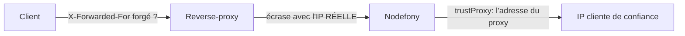

# Mettre un reverse-proxy devant Nodefony

📍 [Documentation](../index.md) › [Guides](README.md) › **Reverse-proxy**

[servers](../../src/packages/@nodefony/http/docs/servers.md) explique ce que l'**application**
attend d'un proxy : `trustProxy`, `trustedHosts`, l'origine des WebSockets. Cette page donne l'autre
moitié — ce qu'il faut poser **côté infrastructure** pour que ces réglages disent vrai.

## 🧠 Le modèle mental — deux moitiés d'un même contrat

Un proxy et une application se mentent par défaut, et chacun a raison de se méfier de l'autre.

- L'application **ignore** `X-Forwarded-For` tant que `trustProxy` vaut `false` : sans cela,
  n'importe quel client s'inventerait une IP, contournerait la limitation de débit et falsifierait
  l'audit.
- Le proxy, lui, doit **écraser** l'en-tête entrant plutôt que d'y ajouter sa ligne. Un proxy qui
  concatène laisse le client choisir le début de la chaîne.

Les deux réglages ne valent que **posés ensemble**. C'est la première cause d'une IP fausse en
production : l'un des deux a été fait, jamais l'autre.



## 📖 Lexique

- **Reverse-proxy** — le serveur qui reçoit le trafic public et le relaie à l'application. Il
  termine TLS, sert parfois les statiques, et décide de ce que l'application apprendra du client.
- **Edge** — le proxy le plus en amont, celui qui voit l'adresse réelle du client. C'est le seul
  qui a le droit d'écrire `X-Forwarded-For`.
- **Upgrade** — la bascule d'une requête HTTP vers le protocole WebSocket. Un proxy qui ne la
  relaie pas explicitement la transforme en réponse HTTP ordinaire.
- **Tunnel** — une connexion que le proxy ne fait que transporter, sans la comprendre. Un WebSocket
  en est un, et il vit bien plus longtemps qu'une requête.

## Qu'est-ce que ça résout — la configuration écrite à la main dérive

Une configuration nginx recopiée depuis un article vieillit mal : elle ne connaît ni vos ports, ni
vos domaines de confiance, ni les dossiers statiques que vos modules montent, ni la taille de corps
que l'application accepte. Chacun de ces écarts se manifeste **en production**, et jamais sous la
forme du problème réel.

D'où le geste par défaut de ce framework : **la configuration se dérive de l'application, elle ne
s'écrit pas.**

## 🚀 Démarrage rapide

```bash
# nginx — sur la sortie standard, pour lire avant d'installer
npx nodefony proxy:generate nginx

# HAProxy, écrit dans un fichier
npx nodefony proxy:generate haproxy -o /etc/haproxy/haproxy.cfg

# Le proxy n'est pas sur la même machine que l'application
npx nodefony proxy:generate nginx --backend 10.0.0.12 --listen 443

# TLS jusqu'au backend (re-chiffrement) plutôt qu'en clair sur le réseau interne
npx nodefony proxy:generate nginx --reencrypt
```

La commande lit l'application **réelle** (`proxyGenerateCommand.ts:31`) : ports effectifs, domaines
de confiance, dossiers statiques montés par chaque module, et deux réglages du serveur que le proxy
doit refléter sous peine d'imposer les siens **en silence** — la taille de corps acceptée et le
battement du WebSocket.

### Ce que le générateur pose, et pourquoi chaque ligne compte

| Ce qui est généré                                                                                                     | Ce que ça évite                                                                                                       |
| --------------------------------------------------------------------------------------------------------------------- | --------------------------------------------------------------------------------------------------------------------- |
| `X-Forwarded-For` **écrasé** avec l'adresse vue du client                                                             | un client qui s'invente une IP — le motif est écrit dans le générateur (`generateProxyConfig.ts:103`)                 |
| `Upgrade` / `Connection` relayés                                                                                      | un WebSocket qui « ne se connecte pas » sans le moindre message d'erreur                                              |
| `proxy_read_timeout` dérivé du battement WebSocket — quatre battements, plancher 300 s (`generateProxyConfig.ts:132`) | un proxy qui coupe des sockets **vivantes** parce que son inactivité par défaut est plus courte que le battement      |
| `client_max_body_size` dérivé de `maxBodySize`                                                                        | un `413` posé par nginx (1 Mo par défaut) que l'application n'a jamais vu passer                                      |
| une chaîne de `try_files` sur les racines statiques                                                                   | les statiques d'un module en `404`, alors qu'ils sont bien montés (`generateProxyConfig.ts:214`)                      |
| HAProxy : `Forwarded` entrant **effacé** avant le nôtre                                                               | un en-tête forgé conservé à côté du vrai (RFC 7239 §8.1)                                                              |
| HAProxy : le schéma **constaté** sur `ssl_fc`                                                                         | annoncer `proto=https` à un client venu en clair — le défaut a existé, il a été corrigé par le banc contre proxy réel |

### Et côté application — l'autre moitié

```typescript
// nodefony.config.ts (extrait) — sans ceci, le proxy parle dans le vide
use("@nodefony/http", {
  // L'adresse du proxy, jamais `true`, sauf s'il est l'unique point d'entrée.
  trustProxy: ["10.0.0.0/8"],
  // Le proxy filtre déjà le Host ? Alors la barrière applicative peut s'ouvrir.
  // Sinon, énumérez vos vhosts plutôt que de passer `true`.
  trustedHosts: ["app.example.com"],
});
```

Le détail de ces deux clés — préréglages, remontée de chaîne de droite à gauche, barrière `Host`
avant le routage — vit dans
[servers](../../src/packages/@nodefony/http/docs/servers.md).

## Traefik — la seule cible qui n'est pas générée

`proxy:generate` ne connaît que nginx et HAProxy. Pour Traefik, la déclaration vit là où vos
conteneurs sont décrits, et c'est à vous de l'écrire :

```yaml
# compose.yaml (extrait) — Traefik v3, découverte par labels
services:
  app:
    image: mon-app:10.0.0
    labels:
      - "traefik.enable=true"
      - "traefik.http.routers.app.rule=Host(`app.example.com`)"
      - "traefik.http.routers.app.entrypoints=websecure"
      - "traefik.http.routers.app.tls.certresolver=le"
      - "traefik.http.services.app.loadbalancer.server.port=5151"
      # 🔴 Le battement WebSocket de Nodefony est de 20 s par défaut. Une
      # inactivité plus courte que lui tranche des sockets VIVANTES : viser au
      # moins quatre battements, comme le fait `proxy:generate` (plancher 300 s).
      - "traefik.http.services.app.loadbalancer.responseforwarding.flushinterval=100ms"
      # La sonde de disponibilité, pas celle de vivacité : Traefik doit retirer
      # le pod du service dès le début de l'arrêt, pas quand le process meurt.
      - "traefik.http.services.app.loadbalancer.healthcheck.path=/readyz"
      - "traefik.http.services.app.loadbalancer.healthcheck.interval=5s"
```

Traefik pose `X-Forwarded-*` de lui-même et **ne fait confiance qu'aux adresses déclarées** dans
`entryPoints.<nom>.forwardedHeaders.trustedIPs`. Deux conséquences : l'`Upgrade` WebSocket est
relayé sans rien demander, mais un Traefik derrière un autre proxy (un équilibreur de charge
d'hébergeur) ne transmettra la bonne IP que si cet amont est déclaré.

## ⚠️ Pièges (symptôme → cause → correction)

| Symptôme                                                 | Cause                                                                                                              | Correction                                                                                       |
| -------------------------------------------------------- | ------------------------------------------------------------------------------------------------------------------ | ------------------------------------------------------------------------------------------------ |
| Toutes les IP des journaux sont celles du proxy          | `trustProxy` est resté à `false` — le **défaut sûr**                                                               | déclarer l'adresse ou le CIDR du proxy, jamais `true` s'il y a plusieurs entrées                 |
| Une IP cliente **forgée** apparaît dans l'audit          | `trustProxy: true` alors que l'application est joignable **directement**, ou un proxy qui ajoute au lieu d'écraser | fermer l'accès direct au port applicatif, et vérifier que le proxy pose `$remote_addr`           |
| Le WebSocket se ferme tout seul au bout d'une minute     | l'inactivité du proxy est plus courte que le battement de l'application                                            | régénérer la configuration — le délai en est **dérivé** — ou allonger l'inactivité à la main     |
| Le WebSocket ne s'ouvre pas, aucune erreur nulle part    | `Upgrade`/`Connection` ne sont pas relayés                                                                         | `proxy:generate` les pose ; sur Traefik c'est natif ; sur un proxy écrit à la main, les ajouter  |
| `413` sur un envoi que l'application accepte pourtant    | la limite de corps du proxy est plus basse que `maxBodySize`                                                       | régénérer : `client_max_body_size` est dérivé de la configuration applicative                    |
| Les statiques d'un module répondent `404` derrière nginx | une seule racine statique déclarée, alors que chaque module monte la sienne                                        | régénérer : la chaîne de `try_files` est construite depuis les montages réels                    |
| Le déploiement coupe des requêtes en cours               | le proxy interroge `/livez` au lieu de `/readyz`                                                                   | `/readyz` bascule en `503` **dès le début de l'arrêt** ; `/livez` reste à `200` pendant le drain |
| Les cookies de session ne reviennent jamais              | `X-Forwarded-Proto` annonce `http` alors que le client est en `https`, donc le cookie `Secure` est refusé          | le schéma se **constate** sur la connexion entrante, il ne se suppose pas                        |

> 🔴 **Le piège du proxy en cascade.** Un `X-Forwarded-For` correct chez le proxy de tête devient
> faux dès qu'un second proxy s'intercale sans être déclaré. La résolution remonte la chaîne **de
> droite à gauche** depuis la socket réelle : chaque saut de confiance doit être listé, sinon la
> remontée s'arrête au premier inconnu — ce qui est exactement le comportement voulu.

## 🧪 Tests & couverture

Les chiffres exacts vivent dans la carte de l'aperçu, régénérée en comptant — jamais figés ici.

<!-- prettier-ignore -->
| Type | Où | Ce qui est prouvé |
| --- | --- | --- |
| Unitaires — générateur | `unit/generateProxyConfig.test.ts` | ce que produisent les deux cibles, à partir d'une introspection donnée |
| Unitaires — confiance | `unit/trustProxy.test.ts` | CIDR, préréglages, listes — quelle socket a le droit d'être crue |
| Unitaires — résolution | `unit/forwarded.test.ts`, `unit/forwardedWiring.test.ts` | la remontée RFC 7239, et son câblage dans le pipeline |
| Intégration — proxys RÉELS | `integration/reverse-proxy.test.ts` | les raccords contre nginx **et** HAProxy en marche, derrière `PROXY_GATE` (`vitest.gates.ts:413`) |

> **Ce qui a été attrapé par le banc réel, et par rien d'autre** : `proxy:generate` annonçait
> `proto=https` à un client venu en clair. Aucun test unitaire ne pouvait le voir — il fallait un
> proxy qui termine vraiment TLS.
>
> Ce banc se **skippe sans son décor**, et un skip compte comme vert : ses trois variables
> (`NF_PROXY_NGINX_URL`, `NF_PROXY_HAPROXY_URL`, `NF_PROXY_HAPROXY_TLS_URL`) doivent être posées —
> `npm run test:all` s'en charge — avant de conclure qu'il est passé.

## 🔗 Pour aller plus loin

- ⬆️ **Retour au hub** : [Guides](README.md) · [Toute la documentation](../index.md)
- 🛡️ **Ce que l'application attend d'un proxy**, en détail :
  [servers](../../src/packages/@nodefony/http/docs/servers.md)
- 🐳 **Le conteneur et l'orchestrateur au-dessus** : [`docker-cloud-native.md`](./docker-cloud-native.md)
- 🗝️ **Pourquoi les sessions décident de votre scaling** : [`session-storage.md`](./session-storage.md)
- 📖 [Lexique général](../lexique.md) du framework.
