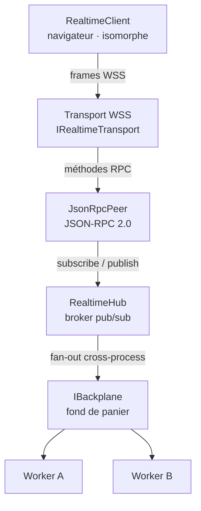
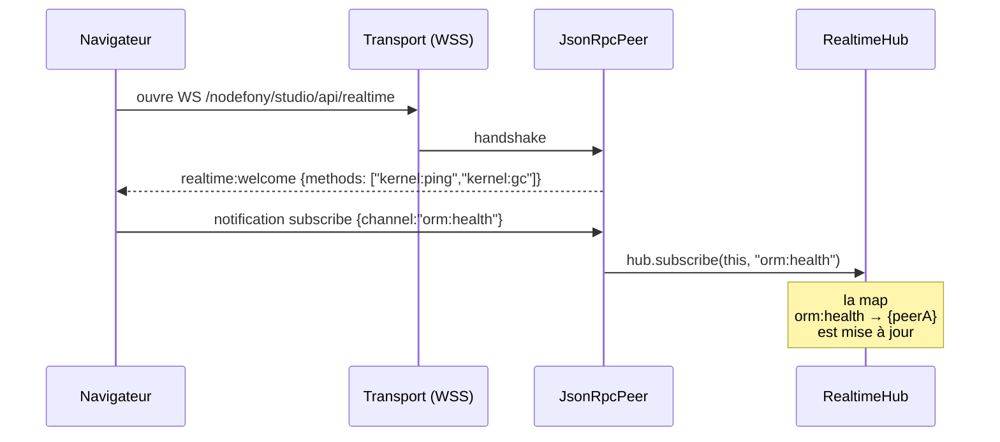
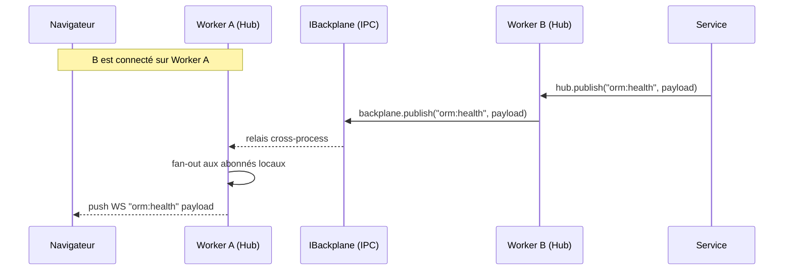

> [!NOTE]
> **TL;DR.** La Socket Nodefony est un **empilement de 6 couches** dont chacune
> ne sait qu'**une** chose. C'est ce qui rend la prise _isomorphe_ (même code des deux
> côtés) et le **fond de panier remplaçable** (mono-process → cluster IPC → Redis →
> Kafka) sans toucher au code applicatif.

## L'image mentale

Imagine la **prise de courant** dans le mur. Tu sais brancher dessus. Tu te fiches de
savoir si l'électricité vient d'une centrale nucléaire, d'éoliennes, ou d'un groupe
électrogène. La **prise** est ton interface ; tout ce qu'il y a _derrière_ est
remplaçable sans changer ta lampe.

La Socket Nodefony est cette prise. **Six couches** la composent — chacune
parle UNIQUEMENT à sa voisine. Pas de raccourci, pas de fuite.

## Les six couches



## Qui sait quoi — la séparation des responsabilités

| Couche             | Sait                                                              | NE sait PAS                                                                                             |
| ------------------ | ----------------------------------------------------------------- | ------------------------------------------------------------------------------------------------------- |
| **RealtimeClient** | `subscribe(channel)`, `publish(channel, data)`, `request(method)` | Le transport réel (WSS, IPC, …)                                                                         |
| **Transport**      | Comment écrire et lire des **octets** (WebSocket, TCP, …)         | Le sens des octets                                                                                      |
| **JsonRpcPeer**    | Le **protocole** JSON-RPC 2.0 (frames `method` / `id` / `params`) | Le transport ; les abonnés                                                                              |
| **RealtimeHub**    | La **map** `canal → Set<abonnés>` ; fan-out local                 | Les autres workers                                                                                      |
| **IBackplane**     | Comment **propager** un publish à tous les workers                | Le sens du payload (opaque)                                                                             |
| **Workers**        | Le code applicatif (tes services)                                 | Ils n'envoient JAMAIS un _publish_ directement au hub d'un autre worker — ils passent par le backplane. |

> [!TIP]
> **Règle d'or.** Chaque couche ne dépend que de son **interface inférieure**, jamais
> de l'implémentation. C'est ce qui rend la pile remplaçable. Tu peux substituer
> WSS par un transport TCP brut côté serveur → les couches au-dessus continuent.

## Le voyage d'un message — abonnement



## Le voyage d'un message — publication en cluster



> [!IMPORTANT]
> Le navigateur est abonné sur **Worker A** mais l'événement naît sur **Worker B**.
> Le backplane (ici l'**IPC du cluster Node**) fait traverser le message. Le client
> ne sait pas — et ne doit pas savoir — sur quel worker il est tombé. C'est
> l'invariant **« même prise, peu importe le worker »**.

## Le code en miroir (côté serveur, côté client)

```ts
// Côté SERVEUR (n'importe quel worker) — service métier
hub.publish("orm:health", { vendor: "sqlite", queries: 4304, ewmaMs: 0.05 });

// Côté CLIENT (navigateur)
client.subscribe("orm:health", (payload) => {
  // reçoit { vendor, queries, ewmaMs } quel que soit le worker qui a publié
});
```

> [!TIP]
> Côté serveur, le `hub` est **injecté** (`@inject("realtimeHub") hub: IRealtimeHub`).
> Côté client, le `client` est **partagé** (`RealtimeClient.shared({url})`). Dans
> les deux cas, **un seul handle** orchestre **N canaux** — c'est le multiplexing.

## Pièges récurrents

> [!WARNING]
> **Ne JAMAIS appeler `transport.send()` directement.** Tu courts-circuites le peer
> (frames invalides) et le hub (pas de comptage d'abonnés). Toujours
> `client.publish(channel, data)` côté navigateur, `hub.publish(channel, data)` côté
> serveur. La pile EST l'API.

> [!CAUTION]
> **Le `peer` n'est pas un canal.** Une frame `request` (avec `id`) est une _action
> RPC_ (cf [actions](./07-actions.md)) ; pas un message broadcastable. Distinguer
> nettement : pub/sub (sans `id`) ≠ contrôle (avec `id`).

## Suite

- [Protocole JSON-RPC 2.0](./03-protocole.md) — la grammaire exacte des frames.
- [Fan-out & pub/sub](./04-fan-out.md) — comment un publish atteint N abonnés.
- [Backplane (fond de panier)](./06-backplane.md) — Loopback / IPC / Redis / Kafka.
