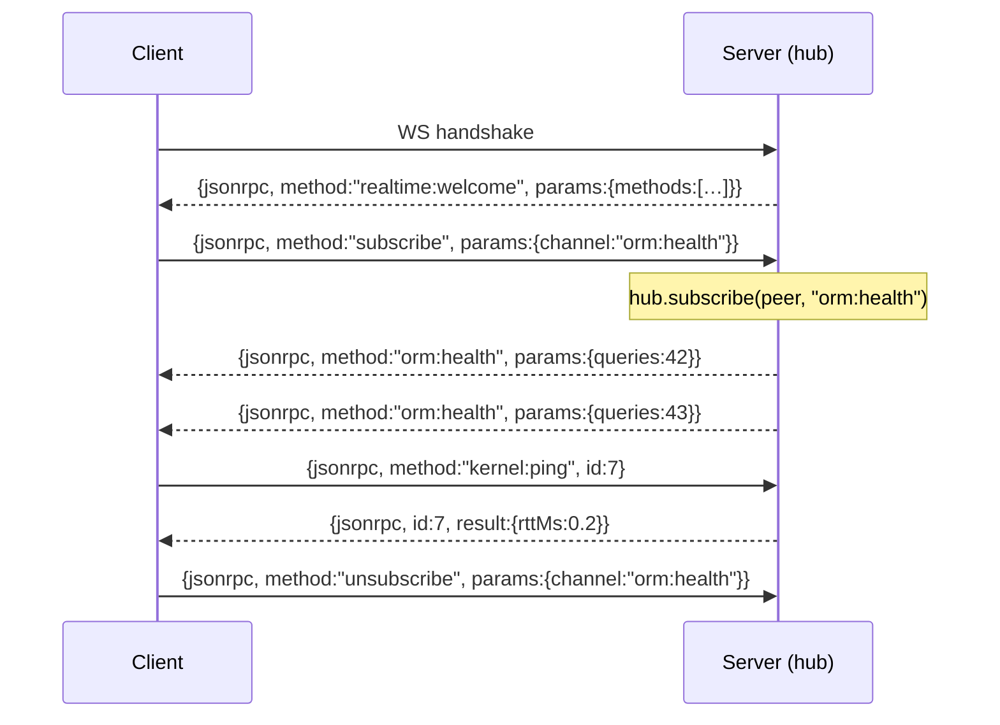

> [!NOTE]
> **TL;DR.** La Socket parle **JSON-RPC 2.0** dans les deux sens. Une frame **sans `id`** =
> notification (pub/sub) ; une frame **avec `id`** = requête RPC qui attend une réponse.
> Le même format des deux côtés permet à un client navigateur et un serveur Node de
> partager le code (`JsonRpcPeer`, isomorphe).

## Pourquoi JSON-RPC 2.0 et pas du custom ?

| Critère                     | JSON-RPC 2.0            | Format maison             |
| --------------------------- | ----------------------- | ------------------------- |
| Spécifié, stable            | ✅ depuis 2010          | ❌ à inventer + maintenir |
| Bi-directionnel (request ⇄) | ✅ natif                | ⚠️ à coder                |
| Batch (plusieurs ops/frame) | ✅ array de requêtes    | ⚠️ à coder                |
| Outillage (TS, debug)       | ✅ inspecteurs existent | ❌ zéro                   |
| Coût mental                 | ≈ nul (lisible à l'œil) | toujours plus             |

**Le multiplexing** (1 socket physique, N canaux logiques) **n'EST PAS** dans la norme
JSON-RPC — c'est Nodefony qui le construit dessus en utilisant la méthode comme dispatch :
`subscribe` / `unsubscribe` / `publish` / `<custom>`.

## Anatomie d'une frame

```jsonc
{
  "jsonrpc": "2.0", // signature de protocole (obligatoire)
  "method": "subscribe", // qu'est-ce qu'on demande
  "params": { "channel": "orm:health" },
  "id": 42, // ⬅ PRÉSENT = requête RPC, ABSENT = notification
}
```

- **`id` absent** → c'est une **notification**. Le serveur ne répondra **pas**. Utilisé pour pub/sub :
  - client : `subscribe`, `unsubscribe`, `publish`
  - serveur : `<channel>` (push d'un message)
- **`id` présent** → c'est une **requête**. Le serveur DOIT répondre exactement une fois :
  ```jsonc
  { "jsonrpc": "2.0", "id": 42, "result": { /* ... */ } }   // ou
  { "jsonrpc": "2.0", "id": 42, "error":  { "code": -32601, "message": "Method not found" } }
  ```

## Les méthodes nominales

| Méthode            | Direction     | `id` ?  | Rôle                                                        |
| ------------------ | ------------- | ------- | ----------------------------------------------------------- |
| `subscribe`        | client→server | non     | « abonne-moi à ce canal »                                   |
| `unsubscribe`      | client→server | non     | « désabonne-moi »                                           |
| `publish`          | client→server | non     | « diffuse ce payload sur ce canal »                         |
| `<channel>`        | server→client | non     | push d'un message (le nom de la méthode = le canal)         |
| `realtime:welcome` | server→client | non     | handshake — annonce les **actions disponibles** (`methods`) |
| `kernel:ping`, …   | client→server | **oui** | actions de contrôle (cf [actions](./07-actions.md))         |

> [!TIP]
> **Le welcome est ta carte du territoire.** Le serveur t'envoie `realtime:welcome` avec
> `params.methods = ["kernel:ping", "kernel:gc", ...]` dès l'ouverture. Tu sais ce que la
> socket sait faire sans hard-coding côté client. Studio s'en sert pour activer/griser
> les boutons de contrôle.

## Conversation type



## Côté code — le bon réflexe

```ts
// Pub/sub : ZÉRO id, fire-and-forget
client.subscribe("orm:health", (data) => render(data));
client.publish("chat:typing", { userId: "u42" });

// Action de contrôle : id géré pour toi par RealtimeClient.request()
const rtt = await client.request<{ rttMs: number }>("kernel:ping", {});
```

> [!IMPORTANT]
> `request()` renvoie une `Promise` qui se résout (ou rejette) quand le serveur
> répond avec le même `id`. Timeout par défaut **30 s** — au-delà, la promesse
> rejette avec `{ code: -32000, message: "Request timed out" }`. Adapte si tu fais
> du calcul long côté serveur, ou utilise le pub/sub si tu n'as pas besoin de la réponse.

## Codes d'erreur (RFC JSON-RPC 2.0 + extension Nodefony)

|     Code | Sens                          | Quand on le voit                                                               |
| -------: | ----------------------------- | ------------------------------------------------------------------------------ |
| `-32700` | Parse error                   | Frame non-JSON envoyée par un client cassé                                     |
| `-32600` | Invalid Request               | Manque `jsonrpc` ou `method`                                                   |
| `-32601` | Method not found              | Action demandée non enregistrée                                                |
| `-32602` | Invalid params                | `params` mal formés                                                            |
| `-32603` | Internal error                | Handler a `throw` — détail loggé serveur, **générique** au client (Zero Trust) |
| `-32000` | (custom) Timeout / annulation | Promise `request()` expirée                                                    |
| `-32403` | (custom) Forbidden            | Rôle insuffisant pour appeler cette méthode (P6)                               |

> [!WARNING]
> **Zero Trust — message d'erreur générique côté client.** Si un handler `throw`, on
> renvoie `-32603 "Internal error"` au navigateur, jamais la stack ou le message
> d'origine (fuite d'info). Le détail va dans les logs serveur. Vérifié dans
> `RealtimeController.dispatchRequest`.

## Sécurité protocole — règles tenues

1. **Pas d'auth dans le JSON-RPC.** L'authentification se fait au **handshake WS**
   (cookies HttpOnly, Origin check, futur firewall P6). Une fois le peer authentifié,
   il porte ses rôles avec lui.
2. **`subscribe` est une demande, pas un droit.** Le serveur peut refuser (`-32403`)
   si le canal exige un rôle. Tu ne peux PAS lire `admin:*` sans `ROLE_ADMIN`.
3. **`publish` côté client est désactivable.** Pour la plupart des canaux, seul le
   serveur publie. Activable canal par canal via politique (P6).

## Suite

- [Fan-out & pub/sub](./04-fan-out.md) — où le hub fait son boulot.
- [Actions RPC](./07-actions.md) — la direction « contrôle ».
- [Vue d'ensemble](./01-vue-ensemble.md) — retour au sommaire mental.
