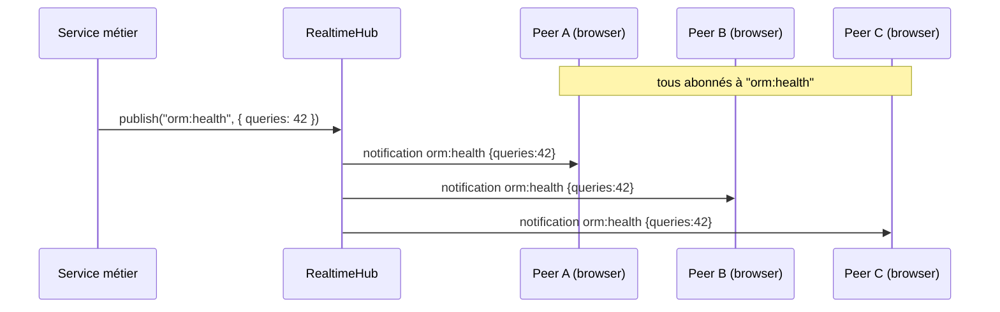
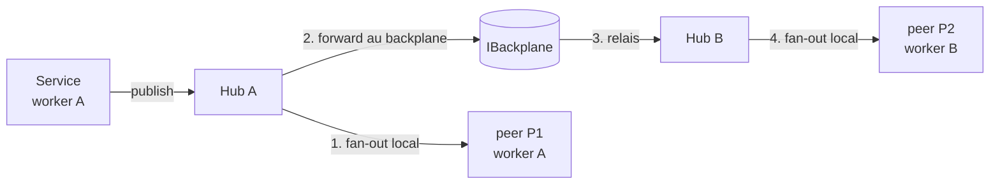

> [!NOTE]
> **TL;DR.** Le `RealtimeHub` côté serveur est une **map** `canal → Set<peers>`. Un
> `publish("orm:health", payload)` parcourt l'ensemble des peers abonnés et leur
> envoie une frame JSON-RPC. C'est le **fan-out** : 1 entrée, N sorties. Coût
> proportionnel au nombre d'abonnés locaux du canal.

## L'image mentale

Pense à la **radio FM**. Une seule antenne émet, mais N postes écoutent la même
fréquence. Aucun poste ne sait qui d'autre écoute, ni combien. C'est _broadcast_
— pas _peer-to-peer_.

Dans la Socket : la **fréquence** = le nom du canal (`orm:health`,
`syslog:stream`, …) ; la **liste des postes** = la map d'abonnés du hub.

## Le hub côté code (mental)

```ts
class RealtimeHub {
  // canal → ensemble de peers abonnés (1 peer = 1 socket ouverte)
  private subs = new Map<string, Set<JsonRpcPeer>>();

  subscribe(peer: JsonRpcPeer, channel: string) {
    if (!this.subs.has(channel)) this.subs.set(channel, new Set());
    this.subs.get(channel)!.add(peer);
  }

  unsubscribe(peer: JsonRpcPeer, channel: string) {
    this.subs.get(channel)?.delete(peer);
  }

  publish(channel: string, payload: unknown) {
    const peers = this.subs.get(channel);
    if (!peers) return; // personne n'écoute → drop
    for (const peer of peers) {
      peer.notify(channel, payload); // 1 frame WS par abonné
    }
  }
}
```

> [!TIP]
> Le hub réel ajoute la **comptabilité** (`subscribers`, `messages`, `fanoutTotal`)
> pour la sonde `realtime:health` (cf [sondes](./05-sondes.md)), le **backpressure**
> (drop ou queue si `bufferedAmount` explose côté WS), et le pont vers le **backplane**
> (cf [backplane](./06-backplane.md)) pour le cluster.

## Le voyage d'un publish (mono-process)



C'est **synchrone** côté code applicatif (on enchaîne les `peer.notify()`) mais
chaque écriture WS est mise en file par Node ; le `await` n'est pas nécessaire.

## Et en cluster ?

Le hub est **local au worker**. Un publish sur le worker A ne touche QUE les peers
connectés au worker A. Pour que les peers du worker B reçoivent l'événement, il
faut **traverser** les workers — c'est exactement le rôle du **backplane** (cf
[backplane](./06-backplane.md)).



L'ordre est important :

1. **Fan-out local d'abord** (les peers du worker qui publie reçoivent vite).
2. **Forward au backplane ensuite** (asynchrone : Redis publish / cluster `worker.send()` / …).
3. Le backplane relaie aux autres workers, qui fan-outent à LEURS abonnés locaux.

> [!IMPORTANT]
> **Pas d'aller-retour pour le worker source.** Quand un message revient du backplane,
> chaque hub filtre **son propre worker** pour ne pas double-livrer (`ignoreSelf=true`).
> Sinon les abonnés du worker A recevraient deux fois le message.

## Coût et garanties

| Caractéristique   | Comportement                                                               |
| ----------------- | -------------------------------------------------------------------------- |
| Délivrance        | **At-most-once** par socket (si la socket meurt, message perdu)            |
| Ordre             | Ordre **par canal et par peer** garanti (pas d'ordre global cross-peer)    |
| Personne n'écoute | **Drop** silencieux (pas de queue, pas de log — économise les ressources)  |
| Coût par publish  | **O(N)** où N = abonnés _locaux_ du canal + 1 hop backplane si cluster     |
| Memory footprint  | **O(C × P)** où C = canaux distincts, P = peers max par canal (lazy alloc) |

> [!CAUTION]
> **Pas de file persistante.** Si un client se reconnecte après une coupure réseau,
> il rate les messages publiés pendant l'absence. Pour un événement **critique non
> reprenable** (« commande payée »), utilise une queue (RabbitMQ, Kafka) — pas le
> hub Nodefony, qui est conçu pour le _signal éphémère_ (sondes, logs, présence).

## Backpressure — le piège silencieux

Si un client est lent (mauvaise connexion, onglet en background), le `bufferedAmount`
de sa socket WS grossit. Si tu pousses 1 000 msg/s sur 100 abonnés dont 1 est lent :
la mémoire serveur monte côté ce socket.

Stratégies du hub :

1. **Surveiller** : la sonde `realtime:health.backpressure.slowConsumers` compte les
   peers dont `bufferedAmount > seuil` (visible dans `/nodefony/hub`).
2. **Drop** : abandonner les messages pour un peer lent au-delà d'un seuil
   (par-canal politique).
3. **Coalesce** : ne garder que le _dernier_ message pour les canaux à granularité
   adaptative (`<canal>:<ms>`).
4. **Disconnect** : fermer la socket d'un peer trop lent (radical, dernier recours).

> [!TIP]
> En pratique, pour un panneau Studio à 1 Hz (cas usuel), le backpressure n'arrive
> pas. C'est en publishant **>100 msg/s sur un canal large** (logs, métriques fines)
> qu'il faut activer le coalescing ou la cadence adaptative (AIMD).

## Suite

- [Sondes & observabilité](./05-sondes.md) — comment voir le fan-out vivre.
- [Backplane (fond de panier)](./06-backplane.md) — Redis, Kafka, IPC, Loopback.
- [Actions RPC](./07-actions.md) — la direction « contrôle ».
