> [!NOTE]
> **TL;DR.** Une **sonde** = un thermomètre branché sur un sous-système (ORM, hub,
> kernel, …). Elle prend des **constantes vitales** et les publie sur un canal
> standard `<module>:health`. Studio s'abonne, affiche. Studio reste **générique**.

## Pourquoi un patron ?

Les outils d'observabilité existent (Prometheus, OpenTelemetry, Datadog…) mais
demandent du temps à brancher. La Socket Nodefony fournit **gratuitement** un canal
temps réel ; en posant une sonde tu obtiens **un dashboard live sans dev frontend**
— Studio détecte le canal et l'affiche selon des conventions partagées.

> [!TIP]
> Une sonde ne **remplace pas** Prometheus en prod — c'est _aussi_ utile, pour le
> debug en dev, le drill-down par worker, et pour ne pas dépendre d'un agent externe.
> Les deux coexistent : la sonde expose en interne ; un exporter agrège vers Prometheus.

## Les 5 pièces du patron

```mermaid
flowchart LR
  P[I&lt;X&gt;Probe<br/>service métier]
  H[build&lt;X&gt;Health&#40;&#41;<br/>agrégation]
  E[GET /api/&lt;x&gt;/health<br/>endpoint HTTP]
  T[Provider ticker<br/>setInterval+publish]
  CH[Canal &lt;x&gt;:health<br/>RealtimeHub]
  ST[Panneau Studio<br/>générique via broker]

  P -- métriques --> H
  H -- snapshot --> E
  H -- live --> T
  E --> CH
  T -- push --> CH
  CH -- abonnement --> ST
```



### 1. `I<X>Probe` — l'interface au plus près du code

```ts
export interface IOrmProbe {
  /** Best-effort. Ne JAMAIS throw. JAMAIS de credential dans le retour. */
  probe(): Promise<IOrmHealth>;
}

export interface IOrmHealth {
  vendor: "sqlite" | "postgres" | "mysql" | "mongodb";
  queries: number; // cumulatif depuis le boot
  reconnects: number;
  ewmaMs: number; // moyenne mobile exponentielle de la latence
  slowOps: number; // > 100 ms
}
```

Placée **directement** dans le service (`OrmService.probe()` lit ses propres
compteurs lazy). Pas de classe `Monitor` séparée — la sonde sait son métier.

### 2. `build<X>Health()` — l'agrégateur

Fonction pure (ou méthode service) qui appelle `probe()`, ajoute des **dérivés**
calculés à la volée (`status: "ok"|"warn"|"down"` selon seuils), et renvoie un
objet sérialisable.

### 3. Endpoint HTTP `GET /nodefony/<module>/api/health`

Pour le **1er paint** sans attendre le 1er tick. Réponse identique à celle du
canal (réutilisation `build<X>Health()`).

### 4. Provider ticker (canal live)

```ts
function createOrmHealthTicker(hub: IRealtimeHub, intervalMs = 1000) {
  const id = setInterval(async () => {
    hub.publish("orm:health", await buildOrmHealth());
  }, intervalMs).unref(); // ⬅ n'empêche pas Node de sortir
  return () => clearInterval(id); // dispose()
}
```

> [!IMPORTANT]
> **`unref()` est OBLIGATOIRE.** Sans lui, ton process Node ne sort jamais
> proprement (le ticker maintient la boucle vivante). Vérifié dans tous les
> providers de Studio.

### 5. Panneau Studio générique

Studio ne **connaît pas** ORM en particulier. Il connaît :

- un broker (`IAdminBroker`) pour trouver les endpoints `<module>/api/health`,
- les hooks (`useNodefonyChannel("<x>:health")`) pour s'abonner,
- des briques (`KpiCard`, `MiniChart`, …) pour rendre les métriques.

Conséquence : ajouter une sonde à un nouveau module **n'exige aucune modif de
Studio**. Le module pose son endpoint + son provider ticker → la convention
suffit, le panneau apparaît.

## Conventions de nommage des canaux

| Canal             | Producteur           | Fréquence par défaut |
| ----------------- | -------------------- | -------------------- |
| `realtime:health` | RealtimeHub lui-même | 1 Hz                 |
| `orm:health`      | OrmService           | 1 Hz                 |
| `orm:flow`        | OrmService           | 1 Hz                 |
| `dashboard:stats` | Supervision          | 1 Hz                 |
| `syslog:stream`   | Syslog (pdu → push)  | événement            |
| `<x>:health`      | Sonde de `<x>`       | 1 Hz (configurable)  |

> [!TIP]
> **Cadence adaptative.** Un client peut demander une fréquence différente en
> suffixant `<canal>:<ms>` (ex `orm:health:200` = 5 Hz). Le hub adapte le ticker.
> Le **mode AIMD** (Additive Increase Multiplicative Decrease) ralentit
> automatiquement quand l'event-loop sature (cf `[[project_realtime_granularity_clientlib]]`).

## Règles de sécurité tenues

1. **Jamais de credential dans une sonde.** Pas de mot de passe DB, pas de token,
   pas de chemin FS absolu (info-leak). Si une donnée doit être surveillée mais
   secrète, expose un **dérivé** (`status: "connected"`, pas la chaîne DSN).
2. **Best-effort.** Une sonde qui `throw` n'écrase pas son module. Toujours
   `try { … } catch { return defaultHealth() }`.
3. **Sondes lecture-seule.** Une sonde **ne mute pas** l'état du module qu'elle
   observe. Si tu veux exposer un compteur, lis-le ; ne l'incrémente pas
   dans `probe()`.
4. **Filtrage par rôle.** Le canal `<x>:health` doit être autorisé (`ROLE_SUPERVISOR`
   ou plus) — sinon `subscribe` renvoie `-32403`. P6.

## Patron complet — exemple ORM

```ts
// 1. La sonde
class OrmService implements IOrmProbe {
  async probe(): Promise<IOrmHealth> {
    return {
      vendor: this.driver.vendor,
      queries: this.metrics.queries,
      reconnects: this.metrics.reconnects,
      ewmaMs: this.metrics.ewmaLatency,
      slowOps: this.metrics.slowOps,
    };
  }
}

// 2. L'agrégateur
async function buildOrmHealth(orm: OrmService): Promise<IOrmHealth & { status: string }> {
  const h = await orm.probe();
  const status = h.reconnects > 5 ? "warn" : h.ewmaMs > 100 ? "warn" : "ok";
  return { ...h, status };
}

// 3. L'endpoint
@Get("/orm/api/health")
async getOrmHealth() {
  return this.renderJson(await buildOrmHealth(this.orm));
}

// 4. Le ticker (au boot du module)
onKernelBoot() {
  this.dispose = createOrmHealthTicker(this.hub, 1000);
}
onKernelStop() {
  this.dispose?.();
}

// 5. Studio s'abonne — RIEN à coder dans Studio,
//    convention + KpiCard + useNodefonyChannelData("orm:health")
```

## Anti-patterns

> [!CAUTION]
> **Sonde qui alloue par appel.** `probe()` doit lire des **compteurs déjà existants**,
> pas allouer un objet `{ queries, reconnects, … }` à chaque tick avec des `.push()`,
> `.map()`, `.filter()` sur des arrays vivants. Allouer 1 KB × 1 Hz × 24 h = ~85 MB
> alloués pour rien sur une journée. **Lazy alloc** : un `OrmHealthSnapshot` réutilisable
> mis à jour en place, ou alors juste un objet plat de primitives.

> [!CAUTION]
> **`setInterval` sans `.unref()`.** Empêche le process de sortir → tests d'intégration
> qui pendouillent, conteneurs qui ne respectent pas SIGTERM, kubernetes qui kill -9
> après le `terminationGracePeriodSeconds`. Le `.unref()` est **non négociable** sur
> les tickers de sonde.

## Suite

- [Backplane (fond de panier)](./06-backplane.md) — quand le ticker doit traverser N workers.
- [Actions RPC](./07-actions.md) — la direction contrôle (relancer une sonde, forcer GC).
- [Vue d'ensemble](./01-vue-ensemble.md) — retour au sommaire mental.
