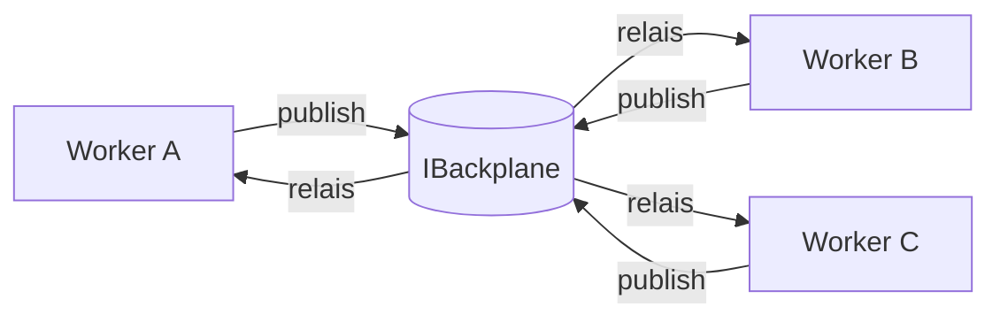
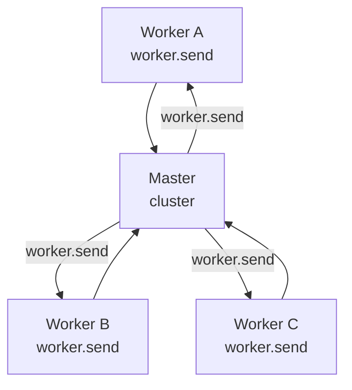
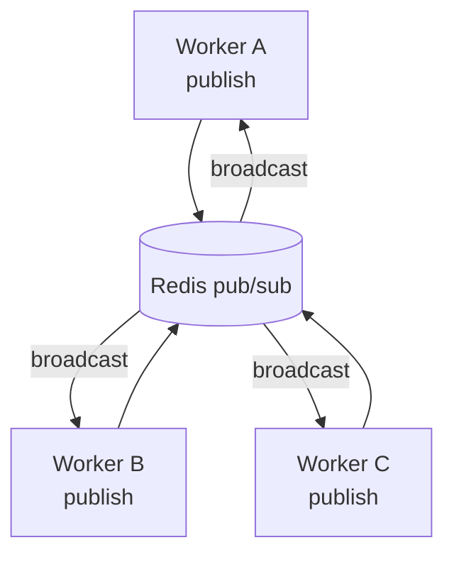
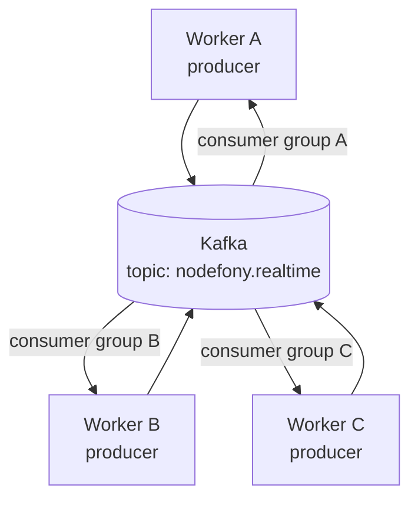
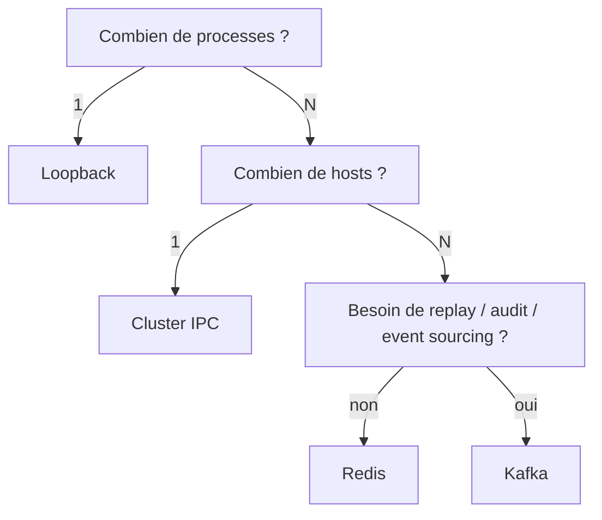

> [!NOTE]
> **TL;DR.** Le **backplane** (fond de panier) est l'abstraction qui permet à `N`
> processes Node de se comporter **comme un seul hub**. Quatre implémentations
> couvrent du laptop au cluster multi-DC : **Loopback** (mono-process),
> **Cluster IPC** (mono-host, multi-worker), **Redis pub/sub** (multi-host, simple),
> **Kafka** (event sourcing, audit, replay). On change le backplane, on ne change
> pas une ligne de code applicatif.

## L'image mentale — le rack serveur

Dans un **serveur rackable** (Dell PowerEdge, HPE ProLiant, …), il y a une carte au
fond du châssis : le **backplane**. Toutes les cartes (CPU, RAID, NIC) **s'enfichent
dedans**. Elles ne se câblent pas une à une. Le backplane fait la **distribution
électrique et le bus de communication**.

Dans Nodefony, le `IBackplane` joue exactement ce rôle entre les **workers Node** :
n'importe quel worker peut publier un message ; **tous** les autres workers le
reçoivent, comme s'ils étaient câblés directement.



**L'invariant** : un `hub.publish("orm:health", payload)` sur le worker A arrive
SUR LES MÊMES sockets que si tu l'avais publié sur le worker B. La couche
applicative ne connaît pas la topologie.

## Le contrat `IBackplane`

Minimal — 3 méthodes :

```ts
export interface IBackplane {
  /**
   * Publie un message sur un canal. Garantie at-most-once par défaut.
   * `meta` optionnel : timestamp, origineWorkerId (utilisé pour ignoreSelf).
   */
  publish(
    channel: string,
    payload: unknown,
    meta?: BackplaneMeta,
  ): Promise<void>;

  /**
   * S'abonne aux messages de TOUS les autres workers sur ce canal.
   * Le handler reçoit AUSSI les messages publiés localement, sauf si meta.from
   * matche notre workerId et qu'on filtre côté hub (pattern `ignoreSelf`).
   */
  subscribe(
    channel: string,
    handler: (payload: unknown, meta: BackplaneMeta) => void,
  ): () => void;

  /** Ferme proprement (déconnecte Redis/Kafka, libère les listeners cluster). */
  dispose(): Promise<void>;
}
```

> [!TIP]
> **`subscribe` renvoie sa fonction de dispose.** Pattern Nodefony universel pour
> éviter les fuites de listener. Le hub appelle ce `dispose` au `onKernelStop`.

## Les 4 drivers

### 1. `LoopbackBackplane` — mono-process (défaut dev)

```ts
class LoopbackBackplane implements IBackplane {
  private subs = new Map<string, Set<Handler>>();
  async publish(channel: string, payload: unknown, meta = {}) {
    queueMicrotask(() =>
      this.subs.get(channel)?.forEach((h) => h(payload, meta)),
    );
  }
  subscribe(channel, handler) {
    if (!this.subs.has(channel)) this.subs.set(channel, new Set());
    this.subs.get(channel)!.add(handler);
    return () => this.subs.get(channel)?.delete(handler);
  }
  async dispose() {
    this.subs.clear();
  }
}
```

**Caractéristiques :**

- **Latence** ≈ 0 (microtask, pas même un event-loop turn)
- **Garantie** : at-most-once (mais comme c'est la même mémoire, jamais perdu)
- **Ordering** : strict par canal (insertion order de la Set)
- **Cas d'usage** : dev, tests, scripts CLI, environnements mono-process
- **Limite** : un seul worker → aucun fan-out cross-process

> [!TIP]
> `queueMicrotask` plutôt qu'appel synchrone : évite la **récursion infinie** si
> un handler republie sur le même canal (bug classique). Le microtask laisse la
> pile se vider avant de continuer.

### 2. `ClusterIpcBackplane` — mono-host, multi-worker

S'appuie sur le **module `cluster` natif de Node**. Le master fait le relais :



**Implémentation :** chaque worker envoie un message typé `process.send({ kind: "bp", channel, payload, meta })`. Le master réagit au `worker.on("message")`,
diffuse à TOUS les autres workers via `worker.send()`.

**Caractéristiques :**

- **Latence** : 0.5 à 2 ms (Unix socket / pipe nommé)
- **Garantie** : at-most-once
- **Ordering** : par canal et par worker source
- **Cas d'usage** : 1 pod = 1 master + N workers (modèle reusePort, cf
  `nodefony cluster -w N`)
- **Limite** : **un seul host**. Si tu scales horizontalement à N pods, les pods
  ne communiquent pas entre eux. → passer à Redis ou Kafka.

> [!IMPORTANT]
> **JSON-serializable seulement.** `worker.send()` sérialise en JSON. Pas de
> `Buffer`, pas de `Function`, pas de class instance (au mieux ses props énumérables).
> Si tu publies un objet `Date`, il arrive comme string ISO. Toujours penser au
> _wire format_.

### 3. `RedisBackplane` — multi-host, simple

S'appuie sur **Redis pub/sub** (`PUBLISH` / `SUBSCRIBE` / `PSUBSCRIBE`).



**Implémentation :** chaque worker **2 connexions Redis** :

- une _publisher_ (Redis interdit de mélanger pub et sub sur la même connexion)
- une _subscriber_ qui appelle `SUBSCRIBE` au boot

```ts
import { createClient } from "redis";

class RedisBackplane implements IBackplane {
  private pub = createClient({ url });
  private sub = createClient({ url });
  async start() {
    await this.pub.connect();
    await this.sub.connect();
    await this.sub.pSubscribe(`${this.prefix}:*`, (msg, channel) => {
      const { channel: ch, payload, meta } = JSON.parse(msg);
      this.handlers.get(ch)?.forEach((h) => h(payload, meta));
    });
  }
  async publish(ch, payload, meta = {}) {
    await this.pub.publish(
      `${this.prefix}:${ch}`,
      JSON.stringify({
        channel: ch,
        payload,
        meta: { ...meta, from: this.workerId },
      }),
    );
  }
  /* … */
}
```

**Caractéristiques :**

| Critère             | Valeur                                               |
| ------------------- | ---------------------------------------------------- |
| Latence             | 1 à 5 ms (LAN), 10 à 50 ms (WAN cross-AZ)            |
| Garantie            | **At-most-once** (si le subscriber est down → perdu) |
| Ordering            | Par canal (Redis garantit l'ordre)                   |
| Persistance message | **AUCUNE** (pub/sub Redis ≠ Streams)                 |
| Fan-out scope       | Tous les abonnés du cluster Redis                    |
| Multi-host          | ✅                                                   |
| Coût opérationnel   | Faible (1 binaire, 1 port)                           |
| Throughput          | ~100k msg/s par instance Redis                       |
| Mémoire serveur     | Quasi-nulle (les messages ne sont pas stockés)       |

> [!WARNING]
> **Le pub/sub Redis n'est PAS Redis Streams.** Les commandes `PUBLISH` / `SUBSCRIBE`
> sont _fire-and-forget_ — aucun stockage. Si tous les subscribers d'un canal sont
> momentanément down, **le message est perdu**. Pour de l'event sourcing ou du
> replay, utilise **Redis Streams** (`XADD` / `XREAD`) ou passe à Kafka.

> [!CAUTION]
> **Auth & TLS obligatoires en prod.** Redis sans `requirepass` ni TLS sur un réseau
> exposé = **n'importe qui peut PUBLISH/SUBSCRIBE**. La sécurité minimum :
>
> 1. `requirepass <strong>` (ou ACL Redis 6+ avec `user:perm`)
> 2. TLS natif (`tls-port 6380`, certs server+client) ou stunnel
> 3. Réseau privé / VPC (jamais d'IP publique sans firewall)
>
> En cluster Redis (HA), considère **Redis Sentinel** ou **Redis Cluster** pour le
> failover. Pub/sub fonctionne dans les deux topologies mais doit re-subscribe au
> failover.

#### Cluster Redis et fan-out

Redis Cluster (hash slots) **propage pub/sub à TOUS les noeuds** par défaut depuis
Redis 7+. En Redis ≤ 6.2 : `cluster-allow-pubsubshard-when-down no` ; ou utiliser
`SPUBLISH`/`SSUBSCRIBE` (pub/sub sharded, scope = slot du channel name).

Pour Nodefony : **on préfère le pub/sub global** (plus simple, faible volume) ; si
le volume grandit, **shard manuel** en encodant un identifiant dans le canal
(`{tenant42}:orm:health`) — les accolades isolent le hash slot.

### 4. `KafkaBackplane` — event sourcing, audit, replay

S'appuie sur **Apache Kafka** (topics partitionnés, log persisté).



**Implémentation :** chaque worker est **producer** sur un topic central
(`nodefony.realtime` par défaut) ET **consumer** dans son **propre consumer group**
unique. Ainsi, **chaque worker reçoit tous les messages** (broadcast, pas
load-balancing).

```ts
import { Kafka } from "kafkajs";

class KafkaBackplane implements IBackplane {
  private kafka = new Kafka({ clientId: this.workerId, brokers });
  private producer = this.kafka.producer();
  // ⬇ consumer group UNIQUE = ce worker reçoit TOUT (broadcast)
  private consumer = this.kafka.consumer({
    groupId: `nodefony-${this.workerId}`,
  });

  async publish(channel, payload, meta = {}) {
    await this.producer.send({
      topic: this.topic,
      messages: [
        {
          key: channel, // ⬅ ordering garanti par canal
          value: JSON.stringify({ channel, payload, meta }),
        },
      ],
    });
  }
  /* consumer.run() dispatch vers this.handlers.get(channel) */
}
```

**Caractéristiques :**

| Critère             | Valeur                                                   |
| ------------------- | -------------------------------------------------------- |
| Latence             | 5 à 50 ms (selon batching et `acks`)                     |
| Garantie            | **At-least-once** par défaut ; **exactly-once** possible |
| Ordering            | Par **partition** (clé = `channel`)                      |
| Persistance message | Configurable (défaut **7 jours**, infini possible)       |
| Fan-out scope       | Tous les consumer groups                                 |
| Replay (history)    | ✅ (`seek` à un offset / timestamp)                      |
| Multi-host          | ✅ (cluster Kafka standard)                              |
| Coût opérationnel   | Élevé (ZooKeeper / KRaft, monitoring, tuning partitions) |
| Throughput          | M msg/s (linéaire avec partitions)                       |
| Mémoire client      | Plus que Redis (buffers, métadonnées)                    |

> [!TIP]
> **Quand choisir Kafka pour le backplane ?**
>
> 1. Tu en as **déjà un** dans la stack (event sourcing métier) → réutilise.
> 2. Tu veux **rejouer** les événements (`/nodefony/cluster` qui boot après un
>    crash et veut reconstruire l'état) — `consumer.seek(0)`.
> 3. Tu fais de l'**audit** : chaque publish est tracé, signé, immuable.
>
> Sinon **Redis** est largement suffisant pour du pub/sub temps réel.

> [!WARNING]
> **Choix des partitions = choix d'ordre.** Si tu mets `key: channel`, l'ordre est
> garanti **par canal** mais 2 canaux peuvent arriver dans n'importe quel ordre.
> Si tu veux un ordre global → 1 partition (mais throughput limité). En pratique,
> partition par canal = bon compromis. Toujours documenter ce choix côté ops.

> [!CAUTION]
> **Auth & TLS obligatoires en prod.** Kafka sur Internet sans auth = catastrophe.
> Choix minimum :
>
> 1. **SASL/SCRAM** ou **SASL/PLAIN** sur TLS (jamais PLAIN sans TLS, sniffable).
> 2. **mTLS** si tu peux gérer les certs (rotation Vault).
> 3. **ACL par topic** (`kafka-acls.sh --add --allow-principal User:nodefony --operation Read --topic nodefony.realtime`).
> 4. Réseau privé (jamais d'AdvertisedListener public).

## Tableau comparatif synthétique

| Critère          | Loopback     | Cluster IPC    | Redis                 | Kafka                     |
| ---------------- | ------------ | -------------- | --------------------- | ------------------------- |
| Topologie        | 1 process    | 1 host, N proc | N hosts               | N hosts                   |
| Latence          | ~0 µs        | 1-2 ms         | 1-5 ms                | 5-50 ms                   |
| Garantie         | **strict**   | at-most-once   | at-most-once          | at-least-once + replay    |
| Persistance      | mémoire      | aucune         | aucune                | **disque** (configurable) |
| Throughput       | illimité     | ~10k msg/s     | ~100k msg/s           | M msg/s                   |
| Ordering         | strict canal | par worker     | par canal             | par partition             |
| Replay (history) | ❌           | ❌             | ❌                    | **✅**                    |
| Coût ops         | 0            | 0              | faible                | élevé                     |
| Idéal pour…      | dev, tests   | 1 pod scalable | temps réel multi-host | event sourcing, audit     |

## Arbre de décision — lequel choisir ?



**En pratique :**

- **Dev local & tests** → Loopback (zero conf).
- **Mono-pod (1 container) cluster Node `-w N`** → Cluster IPC.
- **Multi-pod sans event sourcing** (Kubernetes HPA, Fargate scaling) → Redis.
- **Multi-pod + besoin de replay** (analytics, debug post-mortem, événements
  business immuables) → Kafka.

## Naming convention des canaux & topics

> [!TIP]
> **Préfixer par environnement** sur Redis/Kafka mutualisés : `prod:orm:health`,
> `staging:orm:health`. Évite qu'un dev qui se branche au Redis de prod (sic) ne
> pollue la prod ou ne « voie » des sondes confidentielles.

| Niveau             | Suffixe / préfixe                |
| ------------------ | -------------------------------- |
| Environnement      | `prod:` / `staging:` / `dev:`    |
| Service            | `orm:` / `kernel:` / `realtime:` |
| Sous-canal         | `:health` / `:flow` / `:stream`  |
| Granularité (perf) | `:200` (200 ms tick), `:1000`, … |
| Worker / instance  | `@<pid>` (`orm:rich@4242`)       |

Exemples valides : `prod:orm:health`, `dev:syslog:stream`, `staging:orm:rich@4242`.

## Pièges courants

> [!CAUTION]
> **Boucle infinie cross-driver.** Si Worker A publie → Redis → Worker A reçoit
> → republie sur Redis = explosion. **Toujours filtrer `meta.from === this.workerId`**
> au consumer pour ne pas se réécouter. Vérifié dans `RedisBackplane.subscribe()`.

> [!CAUTION]
> **Hot reload Redis = perte de subscribers.** Si tu relances Redis (upgrade, OOM
> kill), les `SUBSCRIBE` actifs sont coupés. Le client doit **détecter** et
> **re-subscribe**. `redis@4` (node-redis) fait ça automatiquement ; `ioredis`
> aussi. **Vérifie en chaos test** (`docker stop redis && docker start`).

> [!CAUTION]
> **Kafka et l'`auto.offset.reset`.** Par défaut `latest` → un consumer qui démarre
> rate les messages publiés avant. Pour la sonde Nodefony, c'est OK (on veut le
> temps réel). Pour de l'audit qui démarre **après** la prod : `earliest`.

> [!IMPORTANT]
> **`dispose()` doit être appelé au `SIGTERM`.** Redis garde des connexions ; Kafka
> garde un producer + consumer ; sans `dispose`, ton pod ne sort pas proprement
> (kubernetes envoie SIGKILL après `terminationGracePeriodSeconds`). Le hub appelle
> `backplane.dispose()` au `onKernelStop`. Vérifie le hook.

## Évolutivité — choisir aujourd'hui sans se condamner demain

> [!TIP]
> **Tu peux changer de backplane sans toucher au code applicatif** — c'est tout
> l'intérêt du contrat. Démarre en **Loopback** en dev, **Cluster IPC** en staging,
> **Redis** en prod ; si plus tard tu as besoin de replay → bascule en **Kafka**.
> La configuration vit dans `config.ts` :
>
> ```ts
> export default {
>   realtime: {
>     backplane: {
>       driver: process.env.NODE_ENV === "production" ? "redis" : "loopback",
>       redis: { url: process.env.REDIS_URL },
>     },
>   },
> };
> ```

## Suite

- [Vue d'ensemble](./01-vue-ensemble.md) — la prise + le fond de panier.
- [Architecture](./02-architecture.md) — les couches au-dessus du backplane.
- [Fan-out](./04-fan-out.md) — comment le hub local utilise le backplane.
- [Actions RPC](./07-actions.md) — la direction contrôle (au-dessus du pub/sub).
