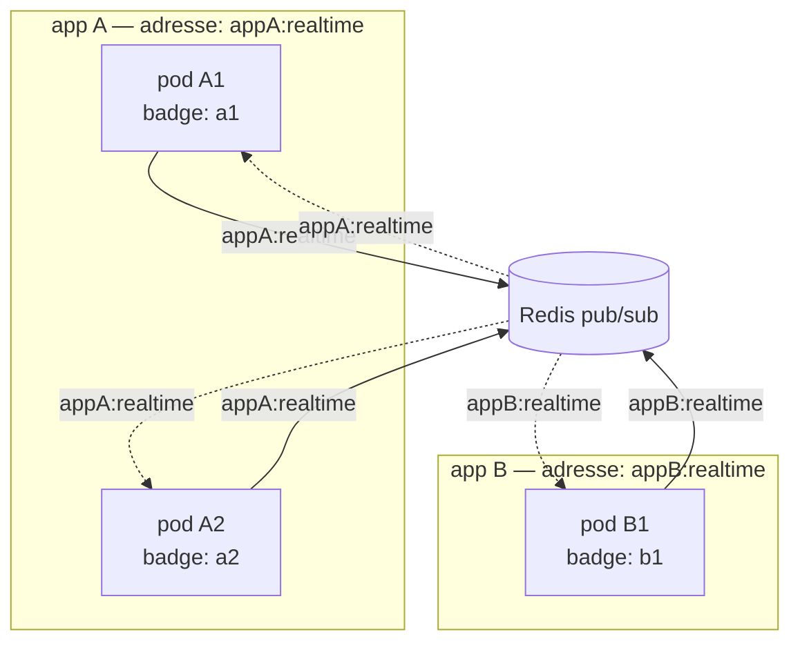
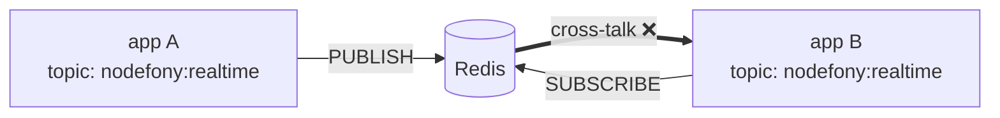
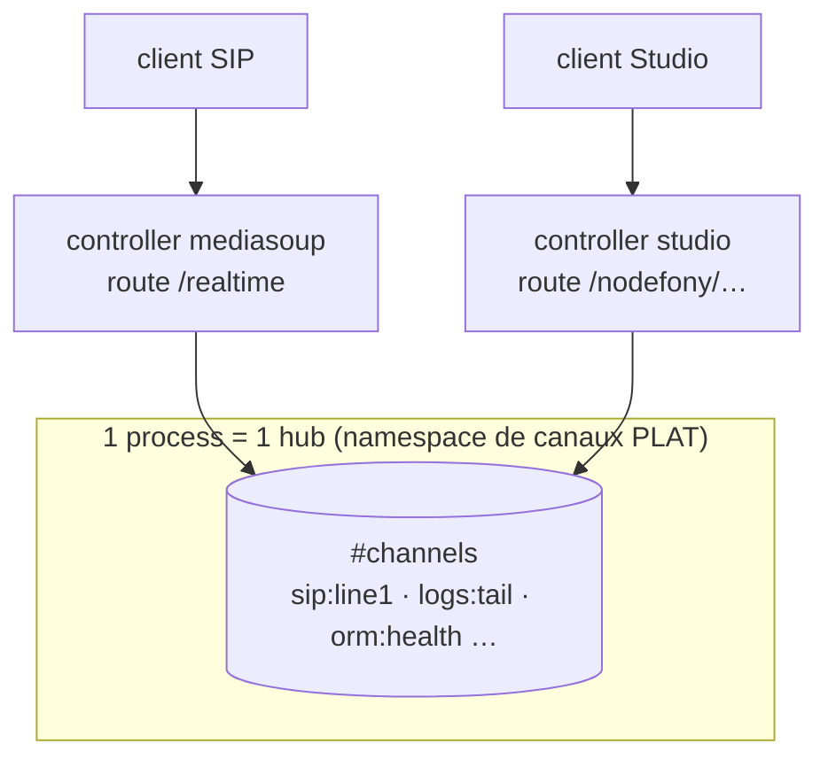

> [!NOTE]
> **TL;DR.** Quand plusieurs **apps** partagent un même backing (Redis/Kafka) et
> quand une app tourne sur plusieurs **pods** (Kubernetes), trois identifiants
> entrent en jeu et **ne doivent pas être confondus** :
>
> - le **namespace de transport** (le topic) — **partagé** par tous les pods d'une
>   même app, il **sépare les apps** entre elles ;
> - l'**`originId`** — **unique par pod**, il porte l'**anti-echo** ;
> - le **`channel`** du contrat (`chat:room1`…) — la conversation, **transportée
>   dans l'enveloppe**, triée par le hub récepteur.
>
> Deux dettes sont documentées ici (à corriger en P13) : le **namespace n'est pas
> encore câblé** (cross-talk multi-app possible) et l'**`originId = process.pid`
> n'est pas unique en Kubernetes** (anti-echo silencieusement cassé).

> [!TIP]
> Cette page suppose le [06 — backplane](./06-backplane.md) (les 4 drivers + le
> contrat `IBackplane`) et le [04 — fan-out](./04-fan-out.md) (hub local vs
> ventilation). Elle ne ré-explique pas les drivers : elle traite la **couche
> déploiement** — comment plusieurs apps et plusieurs pods cohabitent **sans se
> marcher dessus**.

## L'image mentale — l'immeuble, l'appartement, le badge

Reprends l'analogie postale du fan-out, et étends-la au distribué :

```
namespace de transport  =  l'ADRESSE de l'IMMEUBLE   (le facteur livre tout là)
channel (contrat)       =  le n° d'APPARTEMENT        (écrit sur l'enveloppe)
originId                =  le BADGE d'un résident      (qui a posté ; sert à ne pas
                                                        se re-livrer son propre courrier)
```

- Deux **immeubles** différents (deux apps) ne reçoivent pas le courrier l'un de
  l'autre — **à condition d'avoir des adresses différentes**.
- Dans un immeuble, le concierge (le **hub récepteur**) trie par n° d'appartement
  (`channel`) et distribue.
- Le **badge** (`originId`) sert à reconnaître son propre courrier pour ne pas le
  retraiter (anti-echo). Deux résidents avec **le même badge** = le système confond
  leurs courriers.



## Deux échelles, trois identifiants

C'est le nœud de tout le distribué. À garder en tête :

| Identifiant            | Source actuelle (code)       | Échelle               | Doit être            | Rôle                                  |
| ---------------------- | ---------------------------- | --------------------- | -------------------- | ------------------------------------- |
| **namespace** (topic)  | `REDIS_RT_CHANNEL` (constante) | l'**app** entière     | **partagé** (par app) | sépare les apps (la « fréquence »)    |
| **`originId`**         | `String(process.pid)`        | le **pod** / process  | **unique** (par pod)  | anti-echo (« mon propre courrier »)   |
| **`channel`** (contrat) | argument de `publish(channel, …)` | la **conversation** | libre                | routage par le hub récepteur          |

> [!IMPORTANT]
> **Partagé pour regrouper, unique pour distinguer.** Le namespace est partagé
> *exprès* (les pods d'une app doivent se retrouver). L'`originId` est unique
> *exprès* (chaque pod doit reconnaître ses propres messages). Un identifiant
> partagé qui sert à **distinguer** est un bug ; un identifiant unique qui sert à
> **regrouper** en est un aussi. La dette #2 ci-dessous est précisément ce
> deuxième cas.

## Le namespace de transport — séparer les apps

Rappel du [06](./06-backplane.md) : un backplane a **un seul canal de transport**
(1 topic Redis, 1 canal IPC, 1 topic Kafka). Les `channel` logiques voyagent
**dans** l'enveloppe `{ channel, payload, originId }`. Donc :

```js
// RedisBackplane.publish
publish(channel, payload) {                  // channel = "chat:room1"  (contrat)
  const env = { channel, payload, originId };
  this.#transport.publish(
    this.#redisChannel,                      // = "nodefony:realtime"   (TRANSPORT)
    JSON.stringify(env),
  );
}
```

`#redisChannel` est **le topic** ; `channel` est **dans l'enveloppe**. Deux choses
distinctes qui portent malheureusement le même mot.

### Pourquoi le `database` Redis ne suffit pas

> [!CAUTION]
> **Le pub/sub Redis est GLOBAL — il ignore le `SELECT <db>`.** Le `database`
> (`connections.*.database`) cloisonne uniquement les **commandes clé-valeur**
> (storage). Deux apps sur des bases différentes mais **le même topic** se voient
> quand même en pub/sub. Le seul cloisonnement pub/sub = **le nom du topic**.



Si A et B utilisent toutes deux le défaut `"nodefony:realtime"`, **B reçoit le
trafic de A**. Le `database` n'y change rien.

### ⚠️ Dette #1 — le namespace n'est pas câblé

**État réel du code (2026-06-05) :**

```js
// RedisBackplane.ts — défaut EN DUR
export const REDIS_RT_CHANNEL = "nodefony:realtime";
constructor(transport, originId, redisChannel = REDIS_RT_CHANNEL) { … }
//                               ▲ 3e arg : la capacité existe…

// index.ts — la factory de PRODUCTION
return new RedisBackplane(createRedisServiceTransport(pub, sub), ctx.originId);
//                                                              ▲ …mais le 3e arg
//                                                                n'est JAMAIS passé

// schema.ts — le backplane n'expose QUE :
backplaneSchema = { driver }   // aucun champ namespace / topic / channel
```

| Aspect          | Constat                                                           |
| --------------- | ---------------------------------------------------------------- |
| Capacité        | Le 3e argument du constructeur permet de surcharger le topic.    |
| Câblage         | **Absent** — la factory de prod ne le passe jamais.              |
| Config          | **Absente** — aucun champ pour l'exposer.                        |
| Conséquence     | Cross-talk multi-app sur Redis partagé **non protégé**.          |
| Sévérité        | Moyenne — n'impacte que les déploiements multi-app/Redis mutualisé. |

**Fix proposé** (deux options, B recommandée comme défaut) :

```ts
// Option A — champ config explicite (namespace partagé volontaire)
// schema realtime, backplaneSchema :
namespace: z.string().optional()        // ex. "appA"
// factory : new RedisBackplane(transport, originId, `${namespace}:realtime`)

// Option B — dérivation automatique du nom d'app (défaut anti-cross-talk) ✅
const ns = ctx.module.kernel?.name ?? "nodefony";
new RedisBackplane(transport, originId, `${ns}:realtime`);
```

> [!TIP]
> **B comme défaut, A comme override.** B donne à chaque app son namespace (son
> nom) automatiquement → **zéro cross-talk même sans config**. A reste utile pour
> *forcer* un namespace partagé entre plusieurs déploiements de la **même** app qui
> doivent communiquer. Voir aussi la convention de préfixes du
> [06 — naming](./06-backplane.md) (`prod:` / `staging:` / `dev:`).

## L'identité du pair (`originId`) — l'anti-echo

Le pub/sub renvoie au pod émetteur ce qu'il publie (publisher + subscriber sont
deux connexions du même pod). Le backplane filtre donc **son propre `originId`** à
la réception, sinon il referait un fan-out local d'un message qu'il a lui-même
émis :

```js
#ingress(raw) {
  const msg = JSON.parse(raw);
  if (msg.originId === this.originId) return;  // ◄ anti-echo
  this.#handler?.(msg);                         // → hub.publishLocal(...)
}
```

Pour que ce filtre soit correct, **`originId` doit être unique par process/pod**.

### ⚠️ Dette #2 — `process.pid` n'est pas unique en Kubernetes

**État réel du code :** l'`originId` par défaut est `String(process.pid)` (dans les
trois backplanes **et** dans le contexte de la factory `index.ts#wireBackplane`).

> [!CAUTION]
> **En Kubernetes, chaque conteneur a son propre namespace PID.** Beaucoup de pods
> démarrent avec **PID 1**. Deux pods distincts peuvent donc avoir le **même**
> `originId`. L'anti-echo les confond alors :

```mermaid
sequenceDiagram
  participant A as Pod A (pid 1)
  participant R as Redis
  participant B as Pod B (pid 1)
  A->>R: PUBLISH { channel, payload, originId:"1" }
  R->>B: message originId:"1"
  Note over B: if (msg.originId === this.originId) return;<br/>"1" === "1" → TRUE → message JETÉ
  Note over B: ❌ fan-out cross-pod perdu, SILENCIEUSEMENT
```

| Aspect          | Constat                                                                |
| --------------- | --------------------------------------------------------------------- |
| Source          | `String(process.pid)` (3 backplanes + `index.ts`).                    |
| Problème        | PID non unique cross-pod en k8s (namespace PID par conteneur).         |
| Conséquence     | Anti-echo casse → events cross-pod **jetés sans erreur ni log**.       |
| Sévérité        | **Haute** — bug latent, silencieux, spécifique multi-pod (le pire type). |

**Fix proposé** — un `originId` réellement unique cross-pod :

```ts
import os from "node:os";
import { randomUUID } from "node:crypto";

const originId =
  process.env.POD_NAME                  // k8s downward API : nom du pod (unique)
  ?? `${os.hostname()}:${process.pid}`  // hostname k8s = nom du pod = unique
  ?? randomUUID();                       // fallback généré au boot
```

> [!NOTE]
> En cluster mono-host (`nodefony cluster -w N`), `process.pid` **est** unique
> (même hôte, PID réels distincts) → la dette ne concerne **que** le multi-pod
> (Redis/Kafka cross-host). Mais le fix unifié (hostname/POD_NAME) est sûr dans
> les deux cas.

## namespace vs `originId` — le piège de symétrie

Le réflexe « un identifiant partagé est dangereux » est bon, mais il faut savoir
**à quoi sert** l'identifiant :

| Question posée par l'id      | Identifiant   | Doit être | En k8s                          |
| ---------------------------- | ------------- | --------- | ------------------------------- |
| « quelle **app** suis-je ? » | `kernel.name` | partagé   | identique partout ✅ (voulu)    |
| « quel **pod** suis-je ? »   | `originId`    | unique    | `POD_NAME`/`hostname` ✅         |

`kernel.name` identique sur tous les pods d'un Deployment est une **feature** (ils
doivent se regrouper sur le même topic). `process.pid` identique sur deux pods est
un **bug** (ils doivent se distinguer). Même symptôme apparent (« c'est pareil
partout »), conclusions opposées selon le rôle de l'identifiant.

## Isolation inter-module — un hub, plusieurs métiers

Un process = **un** hub singleton (`getRealtimeHub()`), **partagé par tous les
modules**. Exemple : un module `mediasoup` qui pousse `sip:line1` et un module
`studio` qui pousse `logs:tail` / `kernel:health` vivent dans **la même** `Map` de
canaux.



**Il n'y a pas de barrière dure au niveau du hub** — l'espace de noms des canaux
est plat. Les barrières réelles, par ordre de solidité :

1. **Isolation par connexion** (structurelle) — une connexion ne reçoit que les
   canaux qu'elle a `subscribe`. Pas de réception passive.
2. **Factory du controller** (partielle) — `createRealtimeChannel` /
   `@RealtimeChannel` renvoie `null` pour un canal inconnu → refus **à la
   création**. Ne protège **pas** un canal déjà ouvert par un autre module.
3. **Sécurité (seams)** — authenticator par matcher d'URL + voters / `@IsGranted`
   (P6). C'est la **vraie** barrière métier : qui a le droit de `subscribe` quoi.
4. **Convention de préfixe** (`sip:` / `logs:` / `orm:`) — hygiène, pas une barrière.

> [!CAUTION]
> **Le cas-fuite (« cas 2 »).** `RealtimeHub.subscribe` n'appelle la factory **que
> si le canal n'existe pas encore**. Si `sip:line1` a déjà été créé par un client
> mediasoup, une connexion d'un **autre** endpoint qui envoie `subscribe("sip:line1")`
> est **ajoutée comme sink sans repasser par aucune factory** → elle reçoit le flux
> SIP. Tant que P6 n'est pas branché, c'est une **fuite cross-module potentielle**.
>
> ```js
> subscribe(channel, sink, factory) {
>   let st = channels.get(channel);
>   if (st) { st.sinks.add(sink); return true; }   // ◄ canal existant → AUCUN contrôle
>   // sinon seulement : factory(channel) → null = refus
> }
> ```

**La frontière dure** (préfixe imposé par controller, ou voter par namespace de
canal dans `beforeDispatch`) fait l'objet de l'**audit d'isolation inter-module**
dédié (à venir) et du branchement P6. Cette page documente le **modèle** ; l'audit
établira l'**état factuel** (quel module expose quoi, où sont les fuites réelles).

## Récapitulatif des dettes (à corriger en P13)

| Dette | Sujet                              | Sévérité | Déclencheur                         | Fix                                            |
| ----- | ---------------------------------- | -------- | ----------------------------------- | ---------------------------------------------- |
| #1    | Namespace de topic non câblé       | Moyenne  | multi-app sur Redis/Kafka mutualisé | champ config OU dérivation `kernel.name`       |
| #2    | `originId = process.pid` (k8s)     | **Haute** | multi-pod cross-host (k8s)          | `POD_NAME` / `os.hostname()` / `randomUUID`    |
| #3    | Pas de frontière dure inter-module | Moyenne  | plusieurs métiers sur 1 hub         | préfixe imposé par controller / voter P6       |

> [!NOTE]
> Suivi dans `MIGRATION_STATUS.md` (section P13) et `@nodefony/realtime/MEMORY.md`
> (Gotchas). Les dettes #1 et #2 sont des **petits chantiers ciblés** ; la #3
> s'aligne sur le branchement P6 (sécurité).

## Pièges courants

> [!CAUTION]
> **Ne jamais dériver l'`originId` d'une valeur partagée par les pods**
> (`kernel.name`, `app.version`, nom du Deployment). Ça réintroduit la dette #2.
> L'`originId` doit venir d'une source **unique au process** (pod name, hostname,
> uuid de boot).

> [!CAUTION]
> **`database` ≠ isolation pub/sub.** Pour cloisonner des apps sur un Redis
> partagé, c'est **le topic** (namespace), pas le numéro de base.

> [!TIP]
> **Tester le cross-talk en local** : lancer deux apps avec le même Redis et le
> topic par défaut, publier sur l'une, observer l'autre. Tant que la dette #1
> n'est pas corrigée, le message fuit — c'est le test de non-régression du fix.

## Suite

- [Vue d'ensemble](./01-vue-ensemble.md) — la prise + le fond de panier.
- [Fan-out](./04-fan-out.md) — hub local vs ventilation (le « pourquoi » du distribué).
- [Backplane](./06-backplane.md) — les 4 drivers + le contrat `IBackplane`.
- [Sondes](./05-sondes.md) — observabilité per-pod (l'agrégat multi-pod = backplane).
