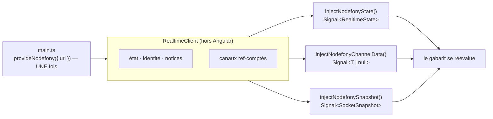

# Fonctions d'injection Angular — `nodefony/angular`

> Le subpath `nodefony/angular` branche un composant Angular sur la socket Nodefony **sans une ligne
> de glue** : un fournisseur posé dans les `providers` de l'application, puis des fonctions
> d'injection qui s'abonnent à la construction et rendent l'abonnement à la destruction. Elles ne
> gèrent **que** l'abonnement — ouvrir et maintenir la connexion reste le travail du client, décrit
> dans [Client isomorphe](client.md). Le pendant exact de [Hooks React](react-hooks.md) et de
> [Composables Vue](vue-composables.md) : même surface, mêmes noms, mêmes garanties. Ancré sur
> `src/nodefony/src/client/angular/index.ts`.

📍 [Documentation](../../../docs/index.md) › [Cœur — @nodefony/core](index.md) › **Fonctions d'injection Angular**

## 🧠 Le modèle mental — une prise, N composants branchés dessus

Un composant vit et meurt au gré de la navigation. Une socket, elle, doit rester ouverte. La liaison
tient les deux bouts : **le fil est unique et long**, **les branchements sont nombreux et courts**.



## 📖 Lexique

| Terme                    | Ce que c'est ici                                                                                                      |
| ------------------------ | --------------------------------------------------------------------------------------------------------------------- |
| **fournisseur**          | Un enregistrement d'injection de dépendances. C'est là que vit une politique, en Angular.                             |
| **fonction d'injection** | Une fonction appelée dans un contexte d'injection, qui installe des effets et rend de l'état. L'idiome d'Angular 20+. |
| **contexte d'injection** | Un initialiseur de champ, un constructeur, ou `runInInjectionContext` — le seul endroit où `inject()` a un sens.      |
| **`Signal<T>`**          | Une valeur lue par appel (`etat()`), dont toute lecture dans un gabarit déclenche sa réévaluation.                    |
| **`DestroyRef`**         | La durée de vie du composant. Ce qu'on y enregistre est rendu à sa destruction.                                       |
| **zone**                 | `zone.js`, l'ancien moteur de détection de changements d'Angular. Absent en `provideZonelessChangeDetection()`.       |

## Pourquoi un fournisseur, et pas un composant enveloppant

React publie un `<NodefonyProvider>` parce qu'en React tout est composant. Vue installe un plugin.
En Angular, une politique qui vaut pour l'application entière s'écrit dans ses `providers` :

```ts
bootstrapApplication(AppComponent, {
  providers: [provideNodefony({ url: "/api/live/realtime" })],
});
```

Traduire littéralement le fournisseur React aurait donné un composant de plus dans l'arbre, que
personne n'aurait pensé à chercher. **Une liaison idiomatique n'est pas une traduction mot à mot :
c'est la même garantie, dite dans la langue du framework.**

## 🔴 Pourquoi ce subpath ne publie AUCUN décorateur Angular

Il n'y a ni `@Injectable`, ni `NgModule`, ni classe décorée dans `nodefony/angular` — et ce n'est
pas un raccourci.

Un décorateur Angular n'est pas du JavaScript : c'est une instruction pour le compilateur d'Angular,
qui doit la **transformer**. Une bibliothèque qui en publie doit donc être bâtie par `ng-packagr`, au
format de paquet Angular (_partial compilation_, puis _linker_ côté application) — une seconde chaîne
de build pour un subpath sur quatre, et un couplage du paquet publié aux majeures d'Angular. Non
compilé, un décorateur marche parfois en développement, quand `@angular/compiler` se trouve chargé
dans la page, et **casse en production**, où il ne l'est pas : exactement le défaut qui ne se voit
jamais chez celui qui l'écrit.

La forme retenue — `InjectionToken`, `makeEnvironmentProviders`, fonctions `inject*()` — est celle
qu'Angular emploie **pour lui-même** : `provideHttpClient()`, `provideRouter()`,
`takeUntilDestroyed()`. C'est du TypeScript ordinaire, que le bundler du framework produit comme le
reste, avec une injection de dépendances et un `DestroyRef` intacts.

> ⚠️ **Cela ne restreint en rien ton application.** `@Component`, `@Injectable`, `@Directive`,
> `@Pipe` y sont compilés par le plugin Angular du builder Nodefony
> (`@analogjs/vite-plugin-angular`, qui embarque `@angular/compiler-cli`). Les fonctions ci-dessous
> s'appellent depuis tes propres classes décorées.

## La règle qu'Angular impose, et qui est chiffrée : hors zone

Avec `zone.js`, Angular remplace `WebSocket` pour savoir quand relancer la détection de changements.
Une socket ouverte **dans** la zone déclenche donc une détection **globale à chaque trame** : un
canal à 10 Hz coûte dix détections par seconde à toute l'application — et rien ne le dirait, la page
s'affiche parfaitement.

`provideNodefony` ouvre donc la connexion dans `NgZone.runOutsideAngular`
(`src/nodefony/src/client/angular/index.ts:202`). Les valeurs, elles, arrivent par des **signals**,
qui notifient leurs lecteurs sans zone : justes dans les deux mondes, `zone.js` ou
`provideZonelessChangeDetection()`.

## 🚀 Démarrage rapide

### 1. Le fournisseur, sur l'application

```ts
// frontend/src/main.ts
import { bootstrapApplication } from "@angular/platform-browser";
import { provideZonelessChangeDetection } from "@angular/core";
import { provideNodefony } from "nodefony/angular";
import { AppComponent } from "./app/app.component";

bootstrapApplication(AppComponent, {
  providers: [
    provideZonelessChangeDetection(),
    provideNodefony({ url: "/api/live/realtime" }),
  ],
}).catch((err) => console.error(err));
```

L'adresse est écrite **ici, et nulle part ailleurs**. Le framework n'en devine aucune : une adresse
devinée marche en développement et se trompe en production. Sans `url` ni `client`, le fournisseur
refuse — et il refuse **à la composition des providers**
(`src/nodefony/src/client/angular/index.ts:186`), pas au premier rendu d'un composant, où l'erreur
se lirait loin de sa cause.

### 2. La page

```ts
// frontend/src/app/app.component.ts
import { Component } from "@angular/core";
import {
  injectNodefony,
  injectNodefonyChannelData,
  injectNodefonyState,
} from "nodefony/angular";

interface Evenement {
  texte: string;
  ts: number;
}

@Component({
  selector: "app-root",
  template: `
    <p>connexion : {{ etat() }}</p>
    @if (dernier(); as e) {
      <p>{{ e.texte }}</p>
    }
    <button (click)="dire('bonjour')">envoyer</button>
  `,
})
export class AppComponent {
  private readonly live = injectNodefony();
  readonly etat = injectNodefonyState();
  readonly dernier = injectNodefonyChannelData<Evenement>("live:events");

  dire(texte: string): void {
    this.live.emit("live:dire", { texte });
  }
}
```

Il n'y a **rien à libérer** : `DestroyRef` rend les abonnements à la destruction du composant. C'est
la différence visible avec un câblage à la main, où il fallait tenir une liste de fonctions de
libération et n'en oublier aucune.

### 3. Quand l'application possède son cycle de connexion

```ts
import { RealtimeClient } from "nodefony/client";
import { provideNodefony } from "nodefony/angular";

declare const maSocket: RealtimeClient;

// La socket fournie l'emporte sur `url`, et son cycle n'est pas touché :
// ni `connect`, ni `disconnect`.
provideNodefony({ client: maSocket });
```

### 4. Un canal qui change

```ts
import { Component, signal } from "@angular/core";
import { injectNodefonyChannelData } from "nodefony/angular";

interface Message {
  texte: string;
}

@Component({ selector: "app-salon", template: `` })
export class SalonComponent {
  readonly salle = signal("salon:general");
  // L'abonnement SUIT le signal : l'ancien canal est rendu avant que le
  // nouveau soit pris. Aucun tableau de dépendances à tenir.
  readonly messages = injectNodefonyChannelData<Message>(this.salle);
}
```

Un argument constant ne coûte **aucun** effet : le branchement est direct, et seule une source
_fonction_ installe un `effect` (`src/nodefony/src/client/angular/index.ts:263`).

## 🧰 Les fonctions

Toutes rendent un `Signal` en lecture — on l'appelle (`etat()`), y compris dans un gabarit. La
socket, elle, n'est pas un signal : c'est un objet, pas un état.

| Fonction                                  | Rend                               | À quoi ça sert                                               |
| ----------------------------------------- | ---------------------------------- | ------------------------------------------------------------ |
| `provideNodefony(opts)`                   | `EnvironmentProviders`             | le fournisseur : enregistre la socket, connecte hors zone    |
| `injectNodefony()`                        | `RealtimeClient`                   | l'échappatoire : `emit`, `request`, `mutate`, `ping`         |
| `injectNodefonyState()`                   | `Signal<RealtimeState>`            | afficher l'état, griser un bouton pendant une reconnexion    |
| `injectNodefonyIdentity()`                | `Signal<RealtimeIdentity \| null>` | savoir qui est connecté — sans appeler `/auth/me`            |
| `injectNodefonyChannel(canal, onMessage)` | —                                  | réagir à chaque message (journal, son, animation)            |
| `injectNodefonyChannelData<T>(canal)`     | `Signal<T \| null>`                | la dernière valeur — le cas le plus courant                  |
| `injectNodefonyAdaptiveChannel(…)`        | `Signal<number>`                   | même chose, en cadence auto-ajustée ; rend la cadence        |
| `injectNodefonyAdaptiveChannelData<T>(…)` | `{ data, intervalMs }`             | la dernière valeur **et** la cadence                         |
| `injectNodefonyChannelStats(canal)`       | `Signal<MessageStats \| null>`     | débit et série d'un canal, pour un VU-mètre                  |
| `injectNodefonySnapshot()`                | `Signal<SocketSnapshot \| null>`   | ce que la socket sait d'elle-même : canaux, trames, dernière |
| `injectNodefonySyslog(opts?)`             | `Signal<unknown[]>`                | le flux de journal, anneau borné et filtre de sévérité       |
| `injectNodefonyNotifications(onNotice)`   | —                                  | les notices normalisées — à monter **une seule fois**        |
| `injectNodefonyNoticeLog(opts?)`          | `Signal<NodefonyNotice[]>`         | l'historique borné des incidents                             |

La déclaration de chacune se lit dans `src/nodefony/src/client/angular/index.ts:284` et suivantes.

Sont aussi réexportés depuis ce subpath : `NODEFONY_CLIENT` (le jeton, pour fournir une AUTRE socket
à un sous-arbre), `rateChannel`, `parseRate`, `isRateChannel` (fabriquer un nom de canal cadencé), et
les types `RealtimeIdentity`, `RealtimeState`, `NodefonyNotice`, `SocketSnapshot` — pour qu'un
composant puisse **nommer** ce qu'il reçoit.

Les arguments « canal » et « cadence » acceptent une valeur, un signal ou une fonction : l'abonnement
suit, sans liste de dépendances.

## 🏗️ Cycle de vie d'un abonnement

```
construction       → subscribe (si premier consommateur du canal)
message reçu       → le signal change → le gabarit se réévalue
canal qui change   → unsubscribe de l'ancien, subscribe du nouveau
reconnexion        → le client rejoue TOUS les abonnements, sans rien à faire
destruction        → unsubscribe (si dernier consommateur)
```

Ce qui est **partagé** et ne dépend pas d'Angular — le comptage de références, le rejeu après
reconnexion, l'appariement `on`↔`subscribe` — vit dans le socle agnostique et est prouvé une fois
pour les quatre fronts. Ce qui est **propre à Angular** — le contexte d'injection, les signals,
l'ouverture hors zone, la libération — est prouvé dans
`src/nodefony/src/tests/clientAngular.test.ts:1`.

La socket, elle, **n'est jamais coupée par un composant**. Elle appartient à la page : la fermer à la
destruction trancherait les requêtes en vol des autres consommateurs.

## ⚠️ Pièges (symptôme → cause → correction)

| Symptôme                                                            | Cause                                                                         | Correction                                                                    |
| ------------------------------------------------------------------- | ----------------------------------------------------------------------------- | ----------------------------------------------------------------------------- |
| `injectNodefony() : provideNodefony() n'est pas dans les providers` | La fonction est appelée dans une application où le fournisseur n'est pas posé | Ajouter `provideNodefony({ url })` aux `providers` de `bootstrapApplication`  |
| `NG0203: inject() must be called from an injection context`         | Appel dans un gestionnaire d'événement, un `setTimeout`, au niveau du module  | Appeler dans un initialiseur de champ ou le constructeur                      |
| Le fournisseur lève à la composition                                | Ni `url` ni `client` fourni — le framework ne devine aucune adresse           | Passer l'URL du serveur temps réel                                            |
| L'application rame dès qu'un canal débite                           | La socket a été ouverte DANS la zone (câblage manuel, `zone.js` actif)        | Passer par `provideNodefony`, qui ouvre hors zone                             |
| Rien n'arrive et l'état reste `disconnected`                        | Le serveur n'écoute pas cette adresse, ou la socket a été coupée              | Vérifier l'adresse du fournisseur, et qu'aucun code n'appelle `disconnect()`  |
| `Module 'nodefony' has no exported member 'RealtimeClient'`         | Condition d'export `browser` inactive dans le `tsconfig.json` de l'app        | Importer depuis `nodefony/client`, ou ajouter `customConditions: ["browser"]` |
| Le canal se ré-abonne sans raison                                   | Le nom du canal est recalculé par une fonction qui lit trop de signals        | Ne faire dépendre la source que de ce qui doit vraiment ré-abonner            |
| `needs to be compiled using the JIT compiler` dans un test          | Un contexte Angular est monté sans compilateur                                | `import "@angular/compiler";` en tête du banc — jamais dans le code livré     |
| Notices en double                                                   | `injectNodefonyNotifications` appelé dans plusieurs composants                | Un seul appel, au shell de l'application                                      |
| Une exception dans un rappel disparaît sans trace                   | Le dispatch du client isole les erreurs de handler                            | Envelopper le corps du rappel dans son propre `try`/`catch`                   |

## 🧪 Tests & couverture

- **Les règles du temps réel** (comptage de références, rejeu après reconnexion, dernier reçu gagne,
  anneaux, filtres) sont prouvées **une fois pour les quatre fronts** dans
  `src/nodefony/src/tests/clientObserve.test.ts`. Les rejouer à travers Angular mesurerait le socle.
- **La traduction Angular** est prouvée dans `src/nodefony/src/tests/clientAngular.test.ts` :
  contexte d'injection exigé, canal signal qui déplace l'abonnement, **ouverture hors zone** — jugée
  sur le moment où le transport est fabriqué, puisque c'est lui que `zone.js` remplace — et surtout
  **la destruction qui rend l'abonnement au serveur**, comptée sur les trames émises, seul juge
  d'une fuite.
- **La surface publiée** est tenue par `clientSubpathSurface.types.test.ts` : ce que les fonctions
  rendent doit pouvoir être **nommé** par un consommateur, et les quatre subpaths parlent des mêmes
  types, pas de jumeaux.
- **Le banc monte une vraie application** (`createApplication`, ce que `bootstrapApplication`
  appelle) : un injecteur fabriqué à la main n'exercerait pas le chemin réel — `effect()` y lève
  `NG0201`, faute du planificateur de détection de changements.

Couverture : `npm run coverage` dans `src/nodefony`.

## 🔗 Pour aller plus loin

- ⬆️ **Retour au hub** : [@nodefony/core — vue d'ensemble](index.md) · [Toute la documentation](../../../docs/index.md)
- 🧭 **Pages sœurs** : [Client isomorphe](client.md) — la socket, le transport, la reconnexion, les
  rôles · [Hooks React](react-hooks.md) · [Composables Vue](vue-composables.md) — la même surface,
  dans les autres langues · [Journalisation](syslog.md)
- Le vocabulaire commun aux deux bords du fil → [Vocabulaire de la socket](../../packages/@nodefony/realtime/docs/vocabulaire.md)
- Le module serveur qui pousse les canaux → [@nodefony/realtime](../../packages/@nodefony/realtime/docs/index.md)
- Qui sert et reconstruit ton interface → [@nodefony/frontend](../../packages/@nodefony/frontend/docs/index.md)
