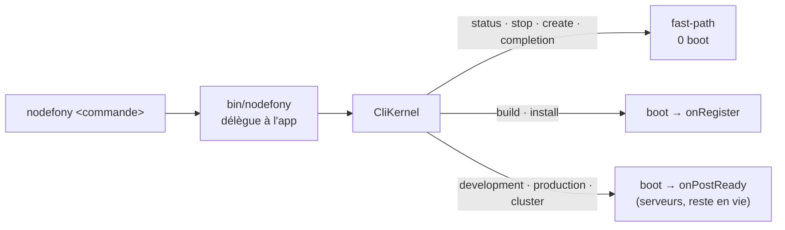

# CLI — piloter le framework en ligne de commande

> Une application Nodefony se pilote par **une seule porte** : le binaire `nodefony`. Il démarre le
> serveur en développement, le construit, le lance en production, ouvre un cluster, échafaude un
> projet ou un module, et accueille les commandes que **tes propres modules** ajoutent. Sous le
> capot, chaque commande est une classe qui s'accroche au cycle de vie du kernel et décide **jusqu'où
> le booter** — de « rien du tout » (un simple `status`) à « serveurs prêts » (`development`).

📍 [Documentation](../../../docs/index.md) › [Cœur — @nodefony/core](index.md) › **CLI**

## 🧠 Le modèle mental — un binaire, un kernel, des commandes

Trois idées suffisent à comprendre toute la CLI.

**Le binaire délègue à l'application.** Installé globalement, `nodefony` sert surtout à créer un
projet hors de tout dépôt. Mais **dans** une application, c'est la version des `node_modules` du projet
qui fait autorité — elle seule connaît ses modules et ses commandes. Le lanceur remonte donc au projet
(`findProjectRoot`) et, s'il y trouve un autre paquet `nodefony` que lui-même, lui passe la main dans
le **même processus** (`bin/nodefony.ts`). C'est le pattern du wrapper de projet (`gradlew`, `mvnw`) :
_le projet gagne_.

**Une commande choisit son point d'arrêt.** Chaque commande déclare un `kernelEvent` : la phase du
boot à laquelle elle s'exécute **et où le démarrage s'arrête**. Une commande qui n'a besoin de rien
(`status`, `stop`, `create`) ne boote **aucun** kernel — c'est un _fast-path standalone_. Une commande
qui introspecte la config booste jusqu'à `onReady`. Une commande serveur (`development`, `production`)
va jusqu'à `onPostReady`, où les serveurs écoutent, puis **reste** en vie.

**Deux familles de commandes.** Les **intégrées** (`development`, `build`, `create`…) sont posées par
le cœur au démarrage (`CliKernel.registerBuiltinCommands()`, `CliKernel.ts:416`). Les **commandes de
module** (`http:network`, `security:user:add`…) sont ajoutées par chaque module dans son constructeur —
elles suivent le namespace `<module>:<action>` et empruntent exactement le même chemin.



## 🚀 Démarrage rapide

### 1. Piloter une application

Toutes les commandes s'exécutent **depuis la racine du projet** (celle qui porte `nodefony.config.ts`) :

```bash
npx nodefony development     # serveur de dev : Vite/HMR + redémarrage auto (alias : dev)
npx nodefony build           # construit tous les paquets (alias : compile)
npx nodefony production -w 4 # runtime prod, 4 workers, au premier plan (cloud-native)
npx nodefony status          # les process en cours (dev/prod/cluster), sans rien démarrer
npx nodefony stop            # arrêt propre de tout runtime lancé depuis ce projet
npx nodefony --help          # la liste complète, commandes de module incluses
```

### 2. Ajouter sa propre commande

Une commande maison vit dans un **module** : on l'ajoute dans son constructeur avec `addCommand`. Le nom
suit la convention `<module>:<action>`, et `kernelEvent` dit à quelle phase elle s'exécute.

```ts
import { Module, Command } from "nodefony";
import type { Kernel, CliKernel } from "nodefony";

class GreetCommand extends Command {
  constructor(cli: CliKernel) {
    // Le kernel sera prêt (onReady) avant que generate() ne tourne.
    super("app:greet", "Saluer depuis la ligne de commande", cli, {
      kernelEvent: "onReady",
    });
    this.addArgument("<name>", "qui saluer");
  }

  override async generate(name: string): Promise<this> {
    // `log` est hérité de Service : ni import, ni logger à injecter.
    this.log(`bonjour ${name}`, "INFO");
    return this;
  }
}

class GreetModule extends Module {
  constructor(kernel: Kernel) {
    super("greet", kernel, import.meta.url, {});
    // Posé au constructeur du module (exécuté quand le manifeste le charge).
    this.addCommand(GreetCommand);
  }
}

export default GreetModule;
```

Une fois le module déclaré dans le manifeste `modules`, la commande apparaît dans `nodefony --help` et
s'invoque `npx nodefony app:greet Ada`.

## 📖 Lexique

| Terme                      | En clair                                                                                                                                                |
| -------------------------- | ------------------------------------------------------------------------------------------------------------------------------------------------------- |
| **`Cli`**                  | La façade au-dessus de Commander : enregistre les commandes, parse `argv`, porte les helpers d'affichage. Utilisable **sans kernel** (standalone).      |
| **`CliKernel`**            | Un `Cli` **relié au kernel** : c'est lui qui boote l'application pour les commandes qui en ont besoin, et qui classe intégrées vs modules.              |
| **`Command`**              | La classe de base d'une commande. On surcharge `generate()` (l'action) et, au besoin, les hooks de cycle de vie.                                        |
| **`kernelEvent`**          | La phase du boot où la commande s'exécute — **et** le point où le démarrage s'arrête (`onStart` → `onRegister` → `onBoot` → `onReady` → `onPostReady`). |
| **standalone (0 boot)**    | Une commande qui ne démarre aucun kernel : `status`, `stop`, `create`, `completion`, `--version`. Réponse immédiate.                                    |
| **runtime / long-running** | Une commande serveur (`development`, `production`, `cluster`) qui, une fois la phase atteinte, **reste** en vie au lieu de rendre la main.              |
| **scaffold**               | La génération de code à partir de gabarits (`create app/module/entity…`) — un moteur pur alimenté par une spec déclarative.                             |
| **dispatch différé**       | Les commandes de module ne sont connues qu'après leur enregistrement ; le kernel diffère le parse jusque-là, puis exécute la bonne.                     |

## 🗂️ Les commandes intégrées

Seize commandes posées par le cœur (`CliKernel.registerBuiltinCommands()`, `CliKernel.ts:416`). La
colonne **arrêt** indique jusqu'où le boot va — `0 boot` = fast-path standalone.

| Commande      | Alias         | Ce qu'elle fait                                                                                                                                                                                                                                                                                          | Arrêt         | Classe                    |
| ------------- | ------------- | -------------------------------------------------------------------------------------------------------------------------------------------------------------------------------------------------------------------------------------------------------------------------------------------------------- | ------------- | ------------------------- |
| `development` | `dev`         | Serveur de dev : Vite/HMR + redémarrage auto (`--detach/--wait/--health/--log`)                                                                                                                                                                                                                          | `onPostReady` | `DevCommand.ts:26`        |
| `production`  | `prod`        | Runtime prod au premier plan ; topologie via `-w, --workers`                                                                                                                                                                                                                                             | `onPostReady` | `ProdCommand.ts:37`       |
| `cluster`     | —             | Cluster de N workers (cgroup-aware, respawn) — `-w, --workers`                                                                                                                                                                                                                                           | `onPostReady` | `ClusterCommand.ts:36`    |
| `inspect`     | —             | **L'état RÉEL de l'app** : `routes` · `modules` · `services` · `config` · `stores` · `entities` · `graph`, `--json` — sans ouvrir de port                                                                                                                                                                | `onPostReady` | `InspectCommand.ts:136`   |
| `build`       | `compile`     | Construit tous les paquets (délègue à `turbo run build`) — `-f/--force`                                                                                                                                                                                                                                  | `onRegister`  | `BuildCommand.ts:16`      |
| `install`     | —             | `install` sur tous les modules — `-f/--force`                                                                                                                                                                                                                                                            | `onRegister`  | `InstallCommand.ts:9`     |
| `outdated`    | —             | `outdated` sur tous les modules                                                                                                                                                                                                                                                                          | `onRegister`  | `OutdatedCommand.ts:9`    |
| `start`       | —             | Menu interactif (TTY)                                                                                                                                                                                                                                                                                    | `onStart`     | `StartCommand.ts:70`      |
| `check`       | **`doctor`**  | **Diagnostic STATIQUE** : paquets importés non déclarés, câblage (entité / controller / service jamais enregistrés, nom réservé, brique manquante), segment `:id` qui répondra 404 — `--json`, `--cwd` ; **remonte à la racine de l'app**, donc lançable depuis n'importe quel sous-dossier (**0 boot**) | `0 boot`      | `CheckCommand.ts:37`      |
| `env`         | —             | Cascade des `.env`, valeurs effectives et **provenance** de chacune (**0 boot**)                                                                                                                                                                                                                         | `0 boot`      | `EnvCommand.ts:36`        |
| `status`      | —             | Introspecte les process dev/prod/cluster (**0 boot**)                                                                                                                                                                                                                                                    | `0 boot`      | `StatusCommand.ts:20`     |
| `stop`        | —             | Arrête proprement les runtimes du projet (**0 boot**) — `--all`                                                                                                                                                                                                                                          | `0 boot`      | `StopCommand.ts:20`       |
| `completion`  | —             | Script de complétion shell (**0 boot**)                                                                                                                                                                                                                                                                  | `0 boot`      | `CompletionCommand.ts:20` |
| `create`      | —             | Échafaude projet / module / entité (**0 boot**)                                                                                                                                                                                                                                                          | `0 boot`      | `CreateCommand.ts:19`     |
| `card`        | `devkit:card` | **Carte de visite** de l'app : identité, modules installés, où aller, quoi lancer — `--json`, `--cwd` (**0 boot**)                                                                                                                                                                                       | `0 boot`      | `CardCommand.ts`          |
| `symbols`     | —             | Signature et TSDoc d'un symbole du framework, depuis le graphe publié — `--module`, `--json` (**0 boot**)                                                                                                                                                                                                | `0 boot`      | `SymbolsCommand.ts`       |
| `ai:sync`     | —             | Pose dans `.agents/skills/` les **pointeurs** vers les skills livrés par les paquets installés — `--dry-run`, `--json`, `--cwd` (**0 boot**)                                                                                                                                                             | `0 boot`      | `cli/aiSync.ts`           |

`status` et `stop` sont détournées vers leur exécution réelle **avant** tout boot
(`CliKernel.ts:185`, via `isStandaloneDevCommand`) — leur `generate()` n'est qu'un filet.

**`check`/`doctor` et `env` prennent le même raccourci, et pour une raison qui se retient**
(`CliKernel.ts:230` et `:239`) : on lance ces deux commandes précisément quand l'application **ne
démarre plus**. Les faire booter les rendrait muettes au seul moment où elles servent — et le
rapport se noierait sous le journal du Kernel. `doctor` devait donc partager ce fast-path : sans
lui, commander ne le voit pas parmi les intégrées avant le chargement des modules, et l'alias
partirait en dispatch différé, c'est-à-dire en boot.

> **Deux verbes à retenir, et leur frontière** : `check` (ou `doctor`) est **statique** — il ne lit
> que des fichiers, donc il fonctionne sur une application cassée. `inspect` est **runtime** — il
> boote sans serveur et rend ce que l'application est VRAIMENT, pas ce que son code laisse croire.

**`ai:sync` pose des POINTEURS, pas des copies.** Les skills d'agent vivent dans les paquets
(`node_modules/@nodefony/*/skills/`, et les modules locaux de l'app) ; la commande écrit dans
`.agents/skills/` un fichier court qui les DÉSIGNE. Le contenu suit donc `npm update` sans qu'aucun
fichier du projet ne soit réécrit — une copie, elle, mentirait six mois plus tard sans casser le
build. Le dossier visé est celui que **tous** les clients conformes lisent, pas celui d'un seul.

`nodefony create app` fait ce geste à la création, juste avant le premier commit : les pointeurs
sont faits pour être **versionnés**, l'équipe et l'intégration continue disposent des mêmes skills.
Aucun `postinstall` ne l'appelle — `--ignore-scripts` est courant, les scripts d'installation sont
un vecteur d'attaque connu, et écrire dans un dossier versionné à chaque installation produirait
des différences surprises. Un pointeur identique n'est jamais réécrit (l'horodatage ne bouge pas) ;
un pointeur que plus aucun paquet ne livre est **nommé**, jamais supprimé — quelqu'un a pu en
écrire un à la main sous le même nom.

### Les commandes de module

Chaque module ajoute ses commandes dans son constructeur (`Module.addCommand()`, `Module.ts:508`),
sous le namespace `<module>:<action>`. Elles apparaissent dans `--help` comme les intégrées :

| Commande            | Ce qu'elle fait                                        | Classe                       |
| ------------------- | ------------------------------------------------------ | ---------------------------- |
| `http:network`      | Inventaire des interfaces réseau (`-j` pour du JSON)   | `networkCommand.ts:16`       |
| `http:certificates` | Génère les certificats TLS de dev (`-f/--force`)       | `certificatesCommand.ts:21`  |
| `proxy:generate`    | Émet une config nginx/haproxy pour l'app               | `proxyGenerateCommand.ts:31` |
| `frontend:build`    | Build de production des bundles Vite (`-f/--force`)    | `frontend-build.ts:22`       |
| `security:secrets`  | Vérifie / écrit les secrets de sécurité (`-w/--write`) | `security-secrets.ts:36`     |
| `security:user:add` | Crée un utilisateur (`-p`, `-r roles`, `-a` admin)     | `security-user-add.ts:36`    |

> Une commande introuvable rend le code `EX_USAGE` (64) — **jamais** un repli silencieux sur le
> serveur (`CliKernel.ts:573`).

## 🏗️ Échafauder — `create`

`create` prend un **type** en argument — **sept** (`app | module | controller | service | front |
entity | command`, `CREATE_TYPES`, `create.ts:43`) — et route vers un moteur de scaffold unique
(`runCreateCommand()`, `create.ts:503`) :

```bash
nodefony create app mon-app --preset complete --frontend react   # nouveau projet
nodefony create module blog --controller rest                    # module dans une app
nodefony create entity Article title:string body:text            # entité + service + controller + tests
nodefony create service Billing                                  # service @injectable + son interface
nodefony create command import --phase onReady                    # commande CLI <module>:import
```

> `service` et `command` existent parce qu'une mesure les a réclamés, pas par symétrie. Sans
> générateur de service, un agent produit une classe à méthodes `static` : elle compile, elle
> marche, et elle reste **invisible au conteneur**. Sans générateur de commande, il n'a aucun
> modèle et invente. Un type de scaffold manquant ne se voit pas — il se paie en code inventé.

Le moteur est **pur** et piloté par une spec déclarative 100 % JSON (`getScaffoldSpec()`, `spec.ts:686`),
partagée par trois fronts : le CLI rapide (flags), le CLI interactif (readline), et un futur formulaire
Studio. Ajouter une question = une entrée dans la spec, aucun front à toucher.

Le détail de chaque scaffold (options, gabarits, presets) vit dans les skills dédiés : `create app`
(preset `complete`/`minimal`, front React/Vue/Angular), `create module`, `create entity`. En résumé —
`create app` et `create entity` **exécutent** ce qu'ils génèrent au boot suivant (la table naît en
`CREATE TABLE IF NOT EXISTS`), et **aucune migration n'est produite** : modifier une entité déjà créée
n'altère pas la table.

Trois comportements de `create entity` qui surprennent si on ne les connaît pas :

- **Une colonne de relation (`ref:`) naît indexée.** C'est par elle que passent le chargement
  d'association (`?include=`) et les jointures que vous écrirez ensuite. En revanche la **clé
  étrangère n'est pas créée** : une jointure n'en a jamais eu besoin (elle compare deux colonnes),
  et une contrainte se déclare dans le `CREATE TABLE`, donc n'atteindrait jamais une base déjà
  créée. L'intégrité référentielle relève des migrations.
- **Les noms d'entités du framework sont refusés** (`User`, `session`, `access_token`,
  `audit_event`…). Le registre est plat : une entité homonyme prendrait la place de celle d'un
  module, et l'application ne démarrerait plus — avec un message parlant d'une colonne inconnue,
  jamais du doublon. Le refus arrive avant la moindre écriture et propose les voies possibles.
- **`drizzle-orm` est ajouté au `package.json`** s'il manque : le code produit l'importe
  directement, ce n'est donc pas une dépendance du seul module ORM. Un `npm install` est requis
  après coup, et la commande le dit.

## 🧩 Ajouter sa propre commande

Le squelette est en [Démarrage rapide](#-démarrage-rapide) ; voici les leviers.

**`generate()` est l'action.** On la surcharge (`command/Command.ts:291`) ; elle reçoit les arguments
positionnels déclarés par `addArgument()`, et l'instance Commander en dernier paramètre. Les hooks de
cycle de vie (`onKernelStart()`, `onKernelReady()`…) sont câblés à la demande par `setEvents()`
(`command/Command.ts:144`), idempotent.

**`kernelEvent` = jusqu'où booter.** C'est le choix structurant :

- `onPostReady` — les serveurs écoutent. Pour les runtimes (dev/prod/cluster).
- `onReady` — tout est booté **sauf** les serveurs. Pour introspecter la config/les services sans écouter.
- `onBoot` — les services du kernel existent (ex. certificats).
- `onRegister` (défaut) — les modules sont enregistrés (ex. build, install).
- `onStart` — rien n'est chargé : pour le vrai standalone.

**Enregistrer.** Un module appelle `this.addCommand(Ctor)` dans son constructeur (`Module.ts:545`) —
il exige que `kernel.cli` existe, sinon il lève `Kernel not ready` (`Module.ts:524`). Hors module, un
outil autonome construit un `Cli` et appelle `cli.addCommand(Ctor)` (`Cli.ts:585`). Dans les deux cas,
`addCommand` **instancie** la commande et l'enregistre sous le nom porté par son constructeur.

## ⚙️ La complétion shell

`nodefony completion <bash|zsh|fish>` imprime un script à sourcer (`renderCompletionScript()`,
`completion.ts:181` ; shells supportés `COMPLETION_SHELLS`, `completion.ts:173`) :

```bash
source <(nodefony completion zsh)     # essai immédiat (zsh)
nodefony completion install zsh       # installation gérée (bloc idempotent dans le rc)
```

Au TAB, le script appelle `nodefony __complete` (fast-path 0 boot, sort toujours `OK`). Les
suggestions viennent d'un **manifeste en cache** écrit au boot de dev (commandes de module comprises,
`CliKernel.writeCompletionManifest()`, `CliKernel.ts:443`) ; hors projet, le repli est la liste des
intégrées en mémoire.

## 🩺 Codes de sortie

La CLI suit la convention BSD `sysexits` (`SysExit`, `sysexits.ts:11`) — utile pour scripter et lire
un échec en CI :

| Code | Nom           | Quand                                                |
| ---- | ------------- | ---------------------------------------------------- |
| 0    | `OK`          | Succès.                                              |
| 64   | `USAGE`       | Mauvais usage : commande/argument inconnu.           |
| 65   | `DATAERR`     | Donnée d'entrée invalide.                            |
| 66   | `NOINPUT`     | Entrée attendue absente.                             |
| 69   | `UNAVAILABLE` | Un service requis est indisponible.                  |
| 70   | `SOFTWARE`    | Erreur interne pendant l'exécution.                  |
| 73   | `CANTCREAT`   | Impossible de créer un fichier de sortie (scaffold). |
| 78   | `CONFIG`      | Configuration invalide.                              |

## ⚠️ Pièges (symptôme → cause → correction)

| Symptôme                                            | Cause                                                                | Correction                                                             |
| --------------------------------------------------- | -------------------------------------------------------------------- | ---------------------------------------------------------------------- |
| Un « projet fantôme » démarre (1 module, 0 warning) | La CLI résout l'application depuis `process.cwd()`                   | Lancer **depuis la racine** du projet (celle du `nodefony.config.ts`). |
| `Kernel not ready` sur `module.addCommand(...)`     | `addCommand` appelé alors que `kernel.cli` n'existe pas encore       | L'appeler dans le **constructeur** du module, pas plus tôt.            |
| La commande n'apparaît pas / n'est pas reconnue     | `addCommand` après le parse, ou module absent du manifeste `modules` | Ordre add → parse ; déclarer le module dans `modules`.                 |
| `generate()` n'est jamais appelé                    | Le `kernelEvent` déclaré n'est pas atteint (mauvaise phase)          | Choisir la phase réelle (voir § « jusqu'où booter »).                  |
| Commande inconnue → un serveur démarre              | (n'arrive pas) le dispatch rend `EX_USAGE` 64                        | Vérifier le nom exact ; `--help` liste tout.                           |
| `create …` refuse de s'exécuter hors d'un projet    | `create module/controller/entity` sont **in-project**                | Les lancer dans une app ; seul `create app` s'utilise hors projet.     |

## 🧪 Tests

Le CLI est couvert par une suite dédiée du cœur, sans serveur pour la plupart :

- **Unitaires** — la façade `Cli` (`Cli.test.ts`), le `CliKernel` et son registre (`CliKernel.test.ts`),
  la classification intégrée/module sans boot (`CliKernelDispatch.test.ts`), la classe de base
  `Command` (`command/Command.test.ts`), les commandes runtime (`KernelCommands.test.ts`), le scaffold
  (`create.test.ts`, `entityFields.test.ts`, `scaffoldDestination.test.ts`), la complétion
  (`completion.test.ts`) et la délégation du binaire projet/global (`resolveLocalCli.test.ts`).
- **Intégration / bout en bout** — le binaire réel `node bin/nodefony <commande>` (`CliIntegration.test.ts`) :
  `--help`/`--version` sans condition, et les boots serveur derrière `RUN_CLI_BOOT=1`.

Le décompte exact (cas comptés, par fichier) est rendu dans la carte de tests de cette page — jamais
figé dans le texte, où il vieillirait. Pour le relancer : `cd src/nodefony && npm run test` (les boots
réels : `npm run test:boot`).

## 🔗 Pour aller plus loin

- ⬆️ **Retour au hub** : [@nodefony/core — vue d'ensemble](index.md) · [Toute la documentation](../../../docs/index.md)
- 🔄 [Kernel & Module](kernel.md) — le cycle de vie que les commandes accrochent (`onRegister` → `onPostReady`)
- 🚦 [Cycle de boot du kernel](../../../docs/architecture/cycle-boot-kernel.md) — l'ordre d'allumage détaillé
- 🏗️ Scaffolds : les skills `create app`, `create module`, `create entity` (options et gabarits)
- 📖 [Lexique général](../../../docs/lexique.md) — le vocabulaire transverse du framework
