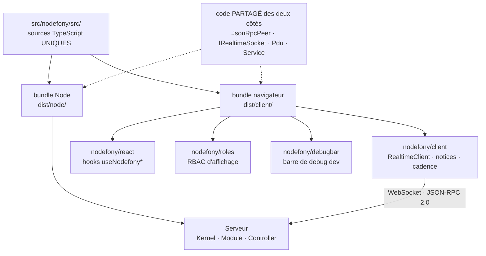
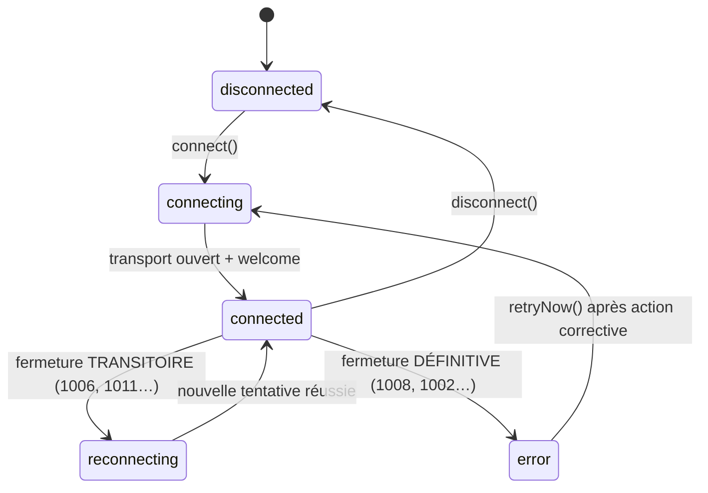

# Le client isomorphe — Nodefony dans le navigateur

> Le paquet `nodefony` ne s'arrête pas au serveur : une partie de son code est **compilée pour le
> navigateur** et publiée sous quatre points d'entrée (`nodefony/client`, `nodefony/react`,
> `nodefony/roles`, `nodefony/debugbar`). Ton front n'importe donc pas une bibliothèque cliente
> « compagnon » qu'il faudrait tenir à jour en parallèle du back — il importe **le même paquet**, avec
> les mêmes types, le même protocole et les mêmes règles de rôles. Ancré sur `src/nodefony/src/client/`.

📍 [Documentation](../../../docs/index.md) › [Cœur — @nodefony/core](index.md) › **Client isomorphe**

## 🧠 Le modèle mental — un paquet, deux compilations

Une application temps réel a toujours deux moitiés qui doivent **se mettre d'accord** : le serveur qui
pousse, le navigateur qui reçoit. La méthode habituelle consiste à écrire deux fois le contrat — une
fois en TypeScript côté back, une fois en JavaScript côté front — puis à réparer les divergences.

Nodefony supprime la deuxième écriture. Le même dépôt de code produit **deux sorties** depuis les
mêmes sources : un bundle Node et un bundle navigateur. Le champ `exports` du paquet aiguille selon
qui demande.



Trois idées portent toute la page :

1. **Le contrat n'est pas dupliqué, il est partagé.** Le moteur de protocole `JsonRpcPeer` est le
   **même objet** des deux côtés : le navigateur l'exécute dans son client, le serveur en instancie un
   par connexion.
2. **Le navigateur n'a droit qu'à ce qui a du sens pour lui.** Le barrel client ne réexporte pas le
   Kernel, ni les serveurs, ni la validation de schéma — on n'expédie pas 400 Kio de back au client.
3. **Ce que le client sait faire, le serveur n'a pas à le faire.** La reconnexion, la mémoire des
   abonnements et la **négociation de cadence** vivent côté navigateur : le serveur reste bête et
   sans état par connexion.

## 📖 Lexique

| Terme                  | Sens                                                                                                       |
| ---------------------- | ---------------------------------------------------------------------------------------------------------- |
| **Isomorphe**          | Un même code source qui s'exécute **des deux côtés** (serveur et navigateur), sans réécriture.             |
| **Subpath**            | Point d'entrée secondaire d'un paquet npm (`nodefony/client`), déclaré dans le champ `exports`.            |
| **Condition d'export** | Clé du champ `exports` (`browser`, `import`, `types`) qui choisit **quel fichier** un outil résout.        |
| **Barrel**             | Fichier `index.ts` qui réexporte la surface publique d'un dossier. C'est lui qui décide ce qui est public. |
| **JSON-RPC 2.0**       | Protocole d'appel de méthode par messages ; Nodefony l'emploie sur WebSocket dans les deux sens.           |
| **Canal**              | Sujet logique multiplexé sur l'unique connexion (`orders:new`). On s'y **abonne**, on y **publie**.        |
| **Notification**       | Message JSON-RPC **sans identifiant** — aucune réponse attendue. C'est la forme du pub/sub.                |
| **Ref-comptage**       | Compter les consommateurs d'un abonnement pour n'émettre le trafic qu'aux transitions 0↔1.                 |
| **Welcome**            | Première trame poussée par le serveur à l'ouverture : identité résolue + capacités annoncées.              |
| **Notice**             | Message normalisé prêt à afficher (`level`, `title`, `message`) — le format unique des alertes du client.  |
| **Close code**         | Code numérique de fermeture d'une WebSocket (RFC 6455 §7.4) : il dit **pourquoi** ça s'est fermé.          |
| **AIMD**               | _Additive Increase / Multiplicative Decrease_ — la loi de contrôle de congestion de TCP, reprise ici.      |
| **Famine**             | Les trames arrivent nettement plus lentement que la cadence demandée : le producteur est sous pression.    |
| **Latest-wins**        | Canal d'**état** où seule la dernière valeur compte — on peut décimer sans rien perdre.                    |
| **RBAC**               | _Role-Based Access Control_ — décider d'un droit à partir de rôles (`ROLE_ADMIN`).                         |
| **Shim**               | Petit remplacement d'une API absente du navigateur (`node:events`, `node:util`) pour que le code compile.  |
| **Tree-shaking**       | Élimination du code non importé au build : un subpath qu'on n'importe pas pèse **zéro octet**.             |
| **HMR**                | _Hot Module Replacement_ — remplacement d'un module à chaud pendant le développement, sans recharger.      |

## Qu'est-ce qu'un client isomorphe — et ce que ça change concrètement

Un « client » de framework, d'habitude, c'est un second paquet npm (`mon-framework-client`) publié à
côté du serveur. Il embarque sa propre copie du protocole, sa propre définition des types échangés, et
son propre calendrier de versions. Tant que les deux avancent ensemble, tout va bien. Le jour où le
serveur renomme un champ, la divergence ne se voit **qu'à l'exécution**, chez l'utilisateur.

Un client isomorphe supprime la question : il n'y a **qu'un** paquet, donc **qu'une** version. Trois
conséquences pratiques, dans l'ordre où on les rencontre.

- **Les types sont les mêmes objets, pas des copies.** Le contrat de socket `IRealtimeSocket` décrit
  la prise côté navigateur **et** côté serveur. Une méthode qui change de signature casse la
  compilation des deux côtés, au build, pas en production.
- **Les règles de rôles s'évaluent à l'identique.** `hasAnyRole()` (`client/roles/roles.ts:34`) est
  la fonction que le front appelle pour griser un bouton et que le back peut appeler dans un jury
  d'autorisation. Plus de « le front croyait que `ROLE_ADMIN` suffisait ».
- **Les erreurs se traduisent une seule fois.** Le serveur ferme la connexion avec un code RFC 6455 ;
  le client traduit ce code en message lisible via `closeCodeToNotice()` (`client/realtime/notice.ts:67`).
  La table de correspondance vit à un seul endroit.

> [!IMPORTANT]
> Isomorphe ne veut pas dire « identique ». Le navigateur n'a ni kernel, ni serveurs, ni accès à la
> base. Le barrel client publie une **sélection** — `RealtimeClient`, `Syslog`, `Pdu`, `Service`,
> `Container` (`client/index.ts:76`) : les briques qui ont un sens dans un onglet. Le reste n'est
> simplement pas là, et n'alourdit donc pas ton bundle.

## La vision Nodefony

Le champ `exports` du paquet est le pivot de tout le dispositif. Il déclare **quatre** points d'entrée
navigateur, plus une condition `browser` sur l'entrée principale.

| Ce que tu importes    | Ce que tu obtiens                                                        | Quand l'utiliser                                    |
| --------------------- | ------------------------------------------------------------------------ | --------------------------------------------------- |
| `nodefony/client`     | Le client temps réel, les notices, la cadence adaptative, `Syslog`/`Pdu` | Toujours — c'est le point d'entrée de référence     |
| `nodefony/react`      | Les hooks `useNodefony*` (peer optionnelle `react`)                      | App React qui consomme des canaux                   |
| `nodefony/roles`      | `hasRole` & co, `RoleSet`, `RoleRegistry`                                | Afficher/masquer selon les rôles                    |
| `nodefony/debugbar`   | La barre de debug de développement + son modèle pur                      | Dev, ou réutiliser le calcul de cascade             |
| `nodefony` (au front) | La **même chose** que `nodefony/client`, via la condition `browser`      | Code partagé front/back ; sinon préfère l'explicite |

Ces quatre entrées sont produites par une compilation dédiée — `clientConfig`
(`rolldown.config.ts:100`) déclare exactement ces quatre fichiers d'entrée, en conservant la structure
des modules pour que le client temps réel ne soit émis **qu'une fois** même s'il est tiré par deux
subpaths.

Deux choix méritent d'être explicités, parce qu'ils se voient dans ton bundle.

- **Les subpaths ne sont jamais réexportés depuis le barrel principal.** Importer `nodefony/client`
  ne tire ni React, ni la barre de debug. C'est ce qui permet à la barre de peser **zéro octet** en
  production : personne ne l'importe.
- **React est une dépendance externe, jamais empaquetée.** `clientExternal` (`rolldown.config.ts:94`)
  marque `react`/`react-dom` comme externes : c'est **ton** React qui sera utilisé, donc pas de double
  instance et pas de règle des hooks violée.

Le compromis assumé : côté navigateur, quelques API Node manquent. Nodefony ne charge pas de
polyfill lourd — il substitue au build deux **shims** minimaux, `browserShim`
(`rolldown.config.ts:80`), qui redirigent `node:events` et `node:util` vers des implémentations
navigateur de quelques dizaines de lignes.

## 🚀 Démarrage rapide

Le scénario : une application générée par `nodefony create app` avec un front servi par
`@nodefony/frontend`. On veut une socket ouverte, un canal écouté, et un appel d'API par cette même
socket.

### 1. La socket de l'application

Le client est une classe : on l'instancie, on la connecte.

```typescript
import { RealtimeClient } from "nodefony/client";

const socket = new RealtimeClient({ url: "/api/live/realtime" });
await socket.connect();
```

C'est ce que fait `shared()` — **plus une garantie** : une application veut **une seule** connexion
WebSocket pour toute la page, et `new` en ouvre une par appel. `RealtimeClient.shared({ url })` rend
donc la **même instance** pour la même URL, depuis n'importe quel fichier, sans passer la socket de
main en main.

> **Retenir** : `new` pour comprendre l'objet, `shared()` partout dans une application.

Un seul fichier, monté une fois au démarrage du front.

```typescript
// frontend/src/realtime.ts — la socket de l'app, importée partout ailleurs.
import { RealtimeClient } from "nodefony/client";
import type { NodefonyNotice } from "nodefony/client";

// Instance PARTAGÉE par URL : deux appels = la même socket, pas deux connexions.
// L'URL relative est normalisée (https → wss) avant l'ouverture.
export const socket = RealtimeClient.shared({
  url: "/api/live/realtime",
});

// Les criticités du temps réel arrivent déjà traduites et prêtes à afficher.
socket.onNotice((notice: NodefonyNotice) => {
  console.warn(`[${notice.level}] ${notice.message}`);
});

// `on` REÇOIT les messages ; `subscribe` DEMANDE au serveur de les pousser.
// Les deux sont nécessaires — et `subscribe` est ré-émis seul au reconnect.
socket.on("orders:new", (payload) => {
  console.log("nouvelle commande", payload);
});
socket.subscribe("orders:new");

// L'identité vient du serveur (trame « welcome ») : aucune route /auth/me.
socket.onIdentity((identity) => {
  if (!identity?.authenticated) console.log("visiteur anonyme");
});

await socket.connect();
```

### 2. Appeler l'API par la socket, pas par `fetch`

La même action de contrôleur répond en HTTP **et** en WebSocket. Un chemin qui commence par `/` est
routé vers le pont d'API ; les mutations exigent une clé d'idempotence, parce qu'une socket qui
reconnecte peut rejouer une trame en vol.

```typescript
// frontend/src/orders.ts
import { RealtimeClient } from "nodefony/client";

// MÊME URL ⇒ MÊME instance que dans `realtime.ts` : `shared()` se relit de
// n'importe quel fichier, sans passer la socket de main en main.
const socket = RealtimeClient.shared({ url: "/api/live/realtime" });

// Lecture — équivalent strict du GET REST sur la même route.
export async function loadModules(): Promise<{ name: string }[]> {
  return socket.request<{ name: string }[]>("/nodefony/kernel/api/modules");
}

// Écriture — la clé d'idempotence dédoublonne un éventuel rejeu.
export async function ship(orderId: string): Promise<void> {
  await socket.mutate(`/shop/api/orders/${orderId}/ship`, {
    method: "POST",
    idempotencyKey: crypto.randomUUID(),
  });
}

// Mesure du temps d'aller-retour — la convention `nodefony:kernel:ping` vit dans la lib.
export async function latency(): Promise<number> {
  const { rtt } = await socket.ping();
  return rtt;
}
```

### 3. Adapter l'affichage aux rôles

```typescript
// frontend/src/nav.ts — filtrer une navigation. ERGONOMIE, pas sécurité.
import { hasAnyRole, RoleSet } from "nodefony/roles";

export function visibleTabs(roles: readonly string[]): string[] {
  const tabs = ["Commandes"];
  // Contrôle ponctuel : zéro allocation, parcours linéaire.
  if (hasAnyRole(roles, ["ROLE_ADMIN", "ROLE_BILLING"]))
    tabs.push("Facturation");
  // Contrôles RÉPÉTÉS sur le même utilisateur : une allocation, puis O(1).
  const set = new RoleSet(roles);
  if (set.has("ROLE_ADMIN")) tabs.push("Administration");
  return tabs;
}
```

### Ce qu'on observe

```bash
npx nodefony development
```

Dans la console du navigateur, à l'ouverture de la page :

```text
visiteur anonyme                      # la trame welcome est arrivée, non authentifié
nouvelle commande { id: 'CMD-42' }    # le canal orders:new pousse
[warning] Connexion temps réel perdue # le réseau a sauté (close code 1006)
[success] Connexion temps réel rétablie
```

La dernière ligne mérite une remarque : elle n'est émise qu'après une **vraie** perte, jamais à la
première connexion. Le client distingue « je me connecte » de « je me reconnecte » — sinon toute page
afficherait un message de rétablissement au chargement.

> [!TIP]
> En React, ne câble rien à la main : les hooks du subpath `nodefony/react` font l'abonnement, le
> désabonnement et le re-rendu pour toi. Voir [Hooks React](react-hooks.md).

## 🔌 `RealtimeClient` — la socket vue du navigateur

C'est la brique centrale du subpath. `RealtimeClient` (`client/realtime/RealtimeClient.ts:161`)
implémente le contrat de socket isomorphe **et** le contrat de pair JSON-RPC : il sait donc à la fois
recevoir des messages poussés et **répondre** à des requêtes venues du serveur.

### Ouvrir, perdre, retrouver la connexion



La subtilité utile est la distinction entre fermeture **transitoire** et **définitive**.
`isReconnectableCloseCode()` (`client/realtime/notice.ts:156`) lit le code de fermeture : une perte
réseau (1006) ou un redémarrage serveur (1011) relancent la boucle de reconnexion ; un refus de
politique (1008, c'est-à-dire un 401/403 traduit) ne la relance **pas**. Sans cette règle, un visiteur
anonyme martèlerait indéfiniment un point d'entrée protégé.

Le délai entre tentatives double à chaque échec — `scheduleReconnect()`
(`client/realtime/RealtimeClient.ts:1251`) — plafonné à 30 secondes par défaut. La date de la
prochaine tentative est exposée en lecture, ce qui permet d'afficher un compte à rebours exact plutôt
qu'un sablier qui ment.

### Les canaux — ref-comptés, et remémorés

C'est le mécanisme qui évite la classe de bugs la plus pénible d'une application temps réel : deux
composants écoutent le même canal, l'un se démonte, et **coupe le flux de l'autre**.

`RealtimeClient.subscribe()` (`client/realtime/RealtimeClient.ts:162`) compte les consommateurs et
n'envoie la demande au serveur qu'au **premier**. `RealtimeClient.unsubscribe()`
(`client/realtime/RealtimeClient.ts:543`) ne coupe qu'au **dernier**. Entre les deux, le trafic réseau
est nul.

Second effet, tout aussi important : la liste des abonnements est **rejouée à chaque reconnexion**.
Le serveur repart d'un état vide après une coupure ; c'est le client qui se souvient de ce qu'il
écoutait, dans la routine d'ouverture de socket (`client/realtime/RealtimeClient.ts:1007`).

> [!WARNING]
> `on(canal, handler)` et `subscribe(canal)` ne font **pas** la même chose et ne se remplacent pas.
> Le premier installe un écouteur local ; le second demande au serveur de pousser. Écouter sans
> s'abonner donne un canal silencieux ; s'abonner sans écouter fait transiter des trames que personne
> ne lit.

### Les quatre façons de parler au serveur

| Appel                                 | Ancre                                   | Ce que ça fait                                                   |
| ------------------------------------- | --------------------------------------- | ---------------------------------------------------------------- |
| `RealtimeClient.emit()` / `publish()` | `client/realtime/RealtimeClient.ts:512` | Notification sans réponse — la forme du pub/sub                  |
| `RealtimeClient.request()`            | `client/realtime/RealtimeClient.ts:162` | Requête/réponse ; un argument commençant par `/` cible une route |
| `RealtimeClient.mutate()`             | `client/realtime/RealtimeClient.ts:162` | Écriture par le pont d'API — **clé d'idempotence obligatoire**   |

Deux compléments moins courants. `RealtimeClient.call()`
(`client/realtime/RealtimeClient.ts:162`) rend l'**enveloppe complète** — la valeur **et**
l'identifiant du profil serveur de cette trame, ce qui permet en développement d'aller lire la
radiographie de l'appel. Et `RealtimeClient.register()`
(`client/realtime/RealtimeClient.ts:162`) fait du navigateur un **appelé** : le serveur peut lui
adresser une requête et attendre son résultat. C'est le duplex réel, pas seulement du push.

### Identité et refus — l'interface sait sans demander

L'identité de la connexion n'est pas devinée par le front : le serveur l'annonce dans sa première
trame, et le client la retient. `RealtimeClient.identity`
(`client/realtime/RealtimeClient.ts:162`) vaut `null` tant que rien n'est reçu, puis porte un objet
dont `authenticated` vaut `false` pour un visiteur anonyme. Un écran de connexion se décide donc
**sans appeler aucune route**.

Le pendant côté refus : quand le serveur rejette un abonnement, il pousse un message dédié que le
client transforme en deux signaux — une notice générique pour le centre de notifications, et un
événement ciblé consommable par `RealtimeClient.onDenied()`
(`client/realtime/RealtimeClient.ts:162`) pour une réaction précise (griser le contrôle concerné). Le
motif reste volontairement générique : le serveur ne dit jamais **quel** rôle manquait, ce qui en
ferait un oracle.

### Le transport, et pourquoi il est aussi bête

`BrowserWsTransport` (`client/realtime/BrowserWsTransport.ts:12`) enveloppe la `WebSocket` native et
ne fait rien d'autre : ouvrir, envoyer, fermer, relayer quatre événements. Toute l'orchestration —
état, reconnexion, battement de cœur, statistiques — vit au-dessus.

Cette séparation a une conséquence directe et très utile : le client accepte une **fabrique de
transport** injectée en second argument de son constructeur
(`client/realtime/RealtimeClient.ts:223`). Les tests branchent un transport factice et exercent toute
la machine à états **sans ouvrir une seule socket**. C'est ce qui rend les 177 cas de test de cette
page possibles hors navigateur.

### Ce que le client alloue — et ce qu'il n'alloue pas

Un onglet ouvert huit heures ne pardonne pas les allocations gratuites. Les choix visibles au code :

- **Le journal de protocole est différé.** Chaque trame est poussée dans un anneau borné à 300
  entrées sous forme de **référence brute** ; la mise en forme et le masquage des secrets ne sont
  faits qu'à la **lecture** — `recordFrame()` (`client/realtime/RealtimeClient.ts:1308`). Un
  inspecteur qu'on n'ouvre jamais ne coûte donc presque rien.
- **Les secrets ne transitent pas en clair dans l'inspecteur.** `redactFrame()`
  (`client/realtime/RealtimeClient.ts:157`) remplace toute clé ressemblant à un jeton, un mot de
  passe ou une autorisation, avec une profondeur bornée.
- **Ce qui n'a pas servi n'existe pas.** L'anneau de trames, l'identité et les capacités annoncées
  démarrent à `null` et ne sont alloués qu'au premier usage.
- **L'échantillonnage de débit ne retient pas le processus.** Le minuteur de statistiques est
  déréférencé (`client/realtime/RealtimeClient.ts:949`) — utile quand le même code tourne dans un
  test Node.

## ⚡ Cadence adaptative — une capacité du CLIENT

Voici le point le plus contre-intuitif de la lib, et son meilleur argument : **c'est le navigateur
qui décide à quel rythme il veut être servi**, sans que le serveur n'apprenne quoi que ce soit.

Le principe repose sur une convention de nommage : la cadence vit **dans le nom du canal**
(`stats` à 1 s, `stats:2000` à 2 s…). Un canal = une cadence = un ticker serveur. Changer de cadence
revient donc à **changer de canal**, opération que le client sait faire tout seul.

`AdaptiveRate` (`client/realtime/AdaptiveRate.ts:78`) est la machine à états pure qui prend la
décision — aucun minuteur, aucune socket, donc parfaitement déterministe et testable. Elle applique la
loi AIMD de TCP :

| Situation observée                                     | Décision                           | Rythme   |
| ------------------------------------------------------ | ---------------------------------- | -------- |
| L'écart entre trames dépasse 1,8 × la cadence (famine) | on **grossit** d'un cran l'échelle | immédiat |
| L'écart reste sous 1,25 × la cadence, 4 fois de suite  | on **affine** d'un cran            | lent     |
| Entre les deux (bande morte)                           | on ne change rien                  | —        |

L'asymétrie est délibérée : on recule vite sous pression, on revient doucement. C'est exactement ce
qui empêche l'oscillation, et la bande morte empêche le va-et-vient autour du seuil.

Deux détecteurs se complètent. `AdaptiveRate.noteFrame()`
(`client/realtime/AdaptiveRate.ts:134`) mesure l'écart **à chaque trame reçue** ; mais si le flux
s'arrête complètement, il n'y a plus de trame pour déclencher quoi que ce soit — d'où le chien de
garde `AdaptiveRate.checkStarvation()` (`client/realtime/AdaptiveRate.ts:171`), appelé
périodiquement, qui voit la famine **totale**.

Le câblage à une socket réelle est séparé : `bindAdaptiveChannel()`
(`client/realtime/AdaptiveRate.ts:239`) s'abonne au nouveau canal **avant** de couper l'ancien, ce
qui évite le trou de quelques centaines de millisecondes qu'on obtiendrait dans l'ordre inverse.

```typescript ignore
// Un tableau de bord d'état : on VEUT 1 s, on ACCEPTE de reculer si ça souffre.
const binding = socket.adaptiveChannel(
  "nodefony:dashboard",
  (payload) => render(payload),
  {
    intervalMs: 1000,
    onRate: (ms, reason) => setBadge(`${ms} ms (${reason})`),
  },
);
// …plus tard
binding.dispose(); // coupe le chien de garde, l'écouteur ET l'abonnement
```

> [!CAUTION]
> Réservé aux canaux d'**état** (latest-wins : supervision, statistiques), où sauter une valeur
> intermédiaire est sans conséquence. Sur un canal d'**événements** (journal, messages de chat), chaque
> élément compte : décimer perdrait des données. Ces flux-là se **regroupent**, ils ne se décime pas.
> Le réglage `enabled: false` (`client/realtime/AdaptiveRate.ts:200`) bascule en abonnement fixe sans
> changer le code appelant.

## 🔐 Les rôles isomorphes — de l'ergonomie, jamais une garantie

Le subpath `nodefony/roles` fournit des fonctions **pures**, sans état ni dépendance, utilisables
telles quelles des deux côtés.

| Outil           | Ancre                         | Coût                               | Quand l'employer                              |
| --------------- | ----------------------------- | ---------------------------------- | --------------------------------------------- |
| `hasRole()`     | `client/roles/roles.ts:19`    | zéro allocation, parcours linéaire | Un contrôle ponctuel                          |
| `hasAnyRole()`  | `client/roles/roles.ts:34`    | idem                               | « L'un de ces rôles suffit »                  |
| `hasAllRoles()` | `client/roles/roles.ts:51`    | idem                               | « Tous ces rôles sont requis »                |
| `RoleSet`       | `client/roles/roles.ts:69`    | 1 allocation, puis O(1)            | Contrôles **répétés** sur le même utilisateur |
| `RoleRegistry`  | `client/roles/registry.ts:27` | masques binaires, O(1) sans alloc  | Ensemble **fixe** de rôles, chemin chaud      |

Deux conventions à connaître, parce qu'elles surprennent au premier essai :

- `hasAnyRole()` avec une liste d'exigences **vide** rend `false` — aucune exigence ne peut être
  satisfaite. `hasAllRoles()` avec une liste vide rend `true`, comme `Array.every`. Les deux sont
  cohérentes avec la logique, pas entre elles.
- `RoleRegistry` est plafonné à 31 rôles — `ROLE_MASK_CAPACITY`
  (`client/roles/registry.ts:11`) — parce que les opérateurs binaires de JavaScript travaillent sur
  des entiers 32 bits **signés**. Au-delà, on reste sur les chaînes. Il est aussi inadapté aux rôles
  **créés dynamiquement** en base : ils n'ont pas de bit fixe.

> [!IMPORTANT]
> Ces contrôles sont de l'**ergonomie**, jamais une sécurité. Le navigateur exécute du code que
> l'utilisateur contrôle : masquer un bouton n'empêche personne d'appeler la route. L'**autorité reste
> le serveur** — le pare-feu applicatif et les jurys d'autorisation décident, et refusent, quoi qu'ait
> affiché le front. Le bon usage : ne pas montrer une action qui sera de toute façon refusée. Voir
> [la sécurité du temps réel](../../../src/packages/@nodefony/realtime/docs/securite.md).

## 🧩 La barre de debug, le stockage et les shims

Trois briques secondaires, qu'on touche rarement — mais qu'il vaut mieux connaître avant de les
croiser.

### `nodefony/debugbar` — voir le framework respirer

Une barre de développement type « bandeau de profilage », montée par `mountDebugBar()`
(`client/debugbar/index.ts:46`). Elle ouvre **la même** socket temps réel que le reste de la page,
intercepte les appels réseau et affiche la cascade des phases serveur d'une requête. Rendue en Shadow
DOM, sans aucune dépendance d'interface.

En pratique tu ne l'appelles pas : en développement, `@nodefony/frontend` l'injecte lui-même dans la
page, en la résolvant depuis le paquet installé (`ViteConfigGenerator.ts:135`). Tu l'appelles à la
main uniquement sur une page **hors Vite**, où le bundle autonome fait office d'alternative.

Le subpath expose aussi son **modèle pur** — `computeWaterfall()`
(`client/debugbar/profile.ts:168`) et `NetworkModel` (`client/debugbar/profile.ts:91`) — sans une
ligne de DOM. C'est ce qui permet à Studio d'afficher la même cascade dans son écran de profilage
sans recopier le calcul.

### Les shims — pourquoi ton code Node compile dans un onglet

Deux modules Node sont remplacés au build par des équivalents navigateur de quelques dizaines de
lignes : `EventEmitter` (`client/shim/events.ts:15`) couvre exactement l'API que le bus d'événements
du cœur appelle réellement, et `inspect` (`client/shim/util.ts:5`) rend un affichage lisible via
`JSON.stringify`. La façade de couleur, elle, devient l'identité (`client/shim/util.ts:20`) : il n'y a
pas de terminal dans un navigateur, donc jamais de code d'échappement.

Tu ne les importes jamais — ils sont substitués au moment du build. Leur seul intérêt pour toi est de
savoir **où sont les limites** : ce sont des shims, pas des implémentations complètes. Le shim
d'événements ne distingue pas un écouteur « une fois » d'un écouteur ordinaire, et ne gère pas
l'événement `error` spécial de Node.

### Le kernel client — un contrat qui n'est pas encore publié

`IClientKernel` (`client/IClientKernel.ts:172`) décrit le futur chef d'orchestre de la couche
technique d'une application front : composition de services, cycle de vie navigateur, changement
d'identité. Le registre de services `NodefonyClientServices` (`client/IClientKernel.ts:100`) s'étend
par augmentation de module, comme le registre de configuration côté serveur.

**Tu ne peux pas encore l'importer**, et c'est délibéré : il a d'abord été publié en types seulement,
puis retiré de la surface avant que la 10.0.0 ne le gèle. Personne ne l'implémentait, donc le
compilateur ne l'avait jamais vérifié — et il portait deux défauts que la première implémentation
aurait révélés. Une fois publié, les corriger aurait demandé une version majeure ; l'ajouter une
fois qu'une application réelle l'exerce ne demandera qu'une mineure. La spécification, elle, vaut
toujours : elle est dans le dépôt, et l'ADR-0007 en donne les onze décisions.

## 🏗️ Comment la lib arrive dans ton bundle

Rien de spécial à configurer : `@nodefony/frontend` pilote Vite, et Vite résout `nodefony/client`
comme n'importe quel paquet du dossier `node_modules`. Trois points valent d'être connus.

1. **La condition `browser` fait le tri.** Dans un bundle navigateur, `import … from "nodefony"`
   résout le barrel client ; dans un fichier serveur, le barrel Node. Le même import, deux
   destinations — c'est le mécanisme central, et aussi la source du piège numéro un de cette page.
2. **La barre de debug est autorisée explicitement.** Vite refuse par défaut de servir un fichier hors
   de la racine du projet. Le générateur de configuration ajoute le dossier de la lib cliente à la
   liste autorisée (`ViteConfigGenerator.ts:135`), sans quoi une application liée en développement
   verrait la barre répondre en refus d'accès.
3. **En production, seul ce que tu importes part.** Les quatre subpaths sont des entrées séparées :
   ce que tu n'importes pas n'est pas dans le bundle.

Le détail du builder, du rechargement à chaud et du rendu de la page côté serveur est dans
[la doc de `@nodefony/frontend`](../../../src/packages/@nodefony/frontend/docs/index.md).

## ⚠️ Pièges (symptôme → cause → correction)

| Symptôme                                                        | Cause (dans le code)                                                                                         | Correction                                                                                   |
| --------------------------------------------------------------- | ------------------------------------------------------------------------------------------------------------ | -------------------------------------------------------------------------------------------- |
| `Cannot find module 'nodefony/realtime'`                        | Ce subpath **n'existe pas** — le champ `exports` n'en déclare que quatre                                     | Importer depuis `nodefony/client`                                                            |
| `has no exported member 'RealtimeClient'` dans un fichier front | Import depuis `"nodefony"` typé par la condition **Node** (outil sans condition `browser`)                   | Importer explicitement depuis `nodefony/client`                                              |
| `RealtimeIdentity` introuvable à l'import                       | Version antérieure : le type n'était réexporté ni par `nodefony/client` ni par `nodefony/react`              | Corrigé — `import type { RealtimeIdentity } from "nodefony/client"` (ou `nodefony/react`)    |
| Le canal est silencieux, aucun message                          | `on()` installé sans `subscribe()` — le serveur ne pousse pas                                                | Appeler les deux (`client/realtime/RealtimeClient.ts:485`)                                   |
| Un composant démonté coupe le flux d'un autre                   | Attendu et **déjà traité** : les abonnements sont ref-comptés                                                | Ne pas contourner l'API en émettant `unsubscribe` à la main                                  |
| Après une reconnexion, plus rien n'arrive                       | Le serveur repart d'un état vide ; le client ré-émet ses abonnements                                         | Comportement natif ; vérifier que l'abonnement passe bien par `subscribe()`                  |
| La reconnexion ne repart jamais                                 | Fermeture **définitive** (1008 = 401/403 traduit), reconnexion volontairement coupée                         | Corriger la cause (se connecter) puis `retryNow()` (`client/realtime/RealtimeClient.ts:370`) |
| Deux connexions WebSocket pour la même page                     | Deux `new RealtimeClient(…)` au lieu de l'instance partagée                                                  | `RealtimeClient.shared()` (`client/realtime/RealtimeClient.ts:295`)                          |
| Les trames envoyées juste après la connexion sont perdues       | `send()` abandonne la trame tant que le transport n'est pas ouvert (`client/realtime/RealtimeClient.ts:188`) | Émettre après la résolution de `connect()`                                                   |
| La cadence adaptative « perd » des messages                     | Employée sur un canal d'**événements**, où décimer supprime des éléments                                     | La réserver aux canaux d'état, ou passer `enabled: false`                                    |
| `hasAnyRole(roles, [])` rend `false` et surprend                | Aucune exigence ne peut être satisfaite (`client/roles/roles.ts:34`)                                         | Convention assumée ; `hasAllRoles` avec une liste vide rend `true`                           |
| `RoleRegistry` lève au 32ᵉ rôle                                 | Limite des entiers 32 bits signés (`client/roles/registry.ts:11`)                                            | Rester sur les chaînes / `RoleSet` au-delà de 31 rôles                                       |
| Un bouton masqué au front reste appelable                       | Le RBAC client est de l'ergonomie, pas un contrôle                                                           | Protéger la route côté serveur — c'est lui l'autorité                                        |
| Deux instances de React après ajout de `nodefony/react`         | React empaqueté au lieu d'être externe                                                                       | Déjà traité au build (`rolldown.config.ts:94`) ; vérifier ses propres alias                  |

## 🧪 Tests & couverture

Le client isomorphe est couvert par **177 cas** répartis sur **15 fichiers**, tous unitaires et tous
exécutés **hors navigateur** — c'est l'injection de transport qui le permet.

- **La machine à états et le transport** : ouverture, reconnexion à délai croissant, battement de
  cœur, transport factice, distinction transitoire/définitif
  (`RealtimeClientTransport.test.ts`, `RealtimeClientCoverage.test.ts`).
- **Le routage des trames** : classification requête/notification/réponse, dispatch vers les
  écouteurs, joker, ingestion de la trame de bienvenue (`RealtimeClientDispatch.test.ts`,
  `RealtimeClientIdentity.test.ts`).
- **Le protocole lui-même** : corrélation d'identifiants, délais, erreurs, flux en morceaux, actions
  entrantes (`JsonRpcPeer.test.ts` — 30 cas, le plus fourni).
- **Les types comme test** : deux fichiers vérifient des propriétés de typage, dont la limite connue
  de la surcharge historique de `request` (`RealtimeClient.types.test.ts`,
  `JsonRpcPeer.types.test.ts`).
- **Les notices et les codes de fermeture** : la table RFC 6455 cas par cas, le silence sur les
  fermetures propres, la reconnectabilité (`RealtimeNotice.test.ts` — 19 cas).
- **La cadence adaptative** : décrue immédiate, reprise après fenêtre, bande morte, chien de garde,
  échelle dérivée — avec horloge et planificateur injectés (`AdaptiveRate.test.ts` — 17 cas).
- **Les rôles** (`roles.test.ts`), **le shim d'événements** (`clientShimEvents.test.ts`), **la barre
  de debug** et **son modèle de profilage** (`DebugBar.test.ts`, `Profiler.client.test.ts`).

Ce qui **manque**, et qu'il faut savoir :

- **Aucun test de bout en bout dans un vrai navigateur.** Tout est exercé en Node avec un transport
  factice. Les comportements réellement navigateur — normalisation d'URL par `window.location`,
  `sessionStorage`, montage en Shadow DOM — ne sont donc pas couverts par une exécution réelle.
- **Aucun banc de charge ni de mémoire côté client.** Les choix d'allocation décrits plus haut sont
  lisibles au code mais ne sont pas mesurés par une suite : pas d'équivalent client au gate mémoire du
  pipeline serveur (skill `nodefony-check-memory-health`).
- **Aucun test d'attaque** (`*.attack.test.ts`) sur le masquage de l'inspecteur de trames — un
  candidat naturel pour une campagne `nodefony-security-review`.

Couverture : `npm run coverage` dans `src/nodefony`. Les chiffres exacts vivent dans le rapport
vitest, jamais figés ici.

## 🔗 Pour aller plus loin

- ⬆️ **Retour au hub** : [@nodefony/core — vue d'ensemble](index.md) · [Toute la documentation](../../../docs/index.md)
- 🧭 **Pages sœurs** : [Hooks React `nodefony/react`](react-hooks.md) — les bindings qui câblent tout
  ça dans un composant · [Service et événements](service.md) — la classe de base, isomorphe elle
  aussi · [Journalisation](syslog.md) — le `Syslog` qui tourne aussi dans l'onglet
- Le serveur en face : [la socket Nodefony](../../../src/packages/@nodefony/realtime/docs/index.md) ·
  [son architecture](../../../src/packages/@nodefony/realtime/docs/architecture.md) ·
  [son vocabulaire](../../../src/packages/@nodefony/realtime/docs/vocabulaire.md)
- Un exemple complet de bout en bout → [Cookbook — un chat](../../../src/packages/@nodefony/realtime/docs/cookbook-chat.md)
- Comment le bundle arrive au navigateur → [`@nodefony/frontend`](../../../src/packages/@nodefony/frontend/docs/index.md)
