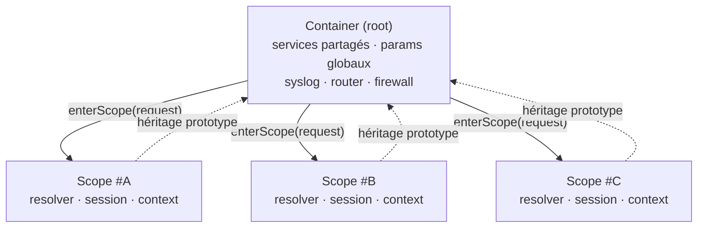

# Container — Dependency Injection

> Container DI hiérarchique : registre nommé de services + arbre de paramètres + scopes courts pour isoler le state par requête.

## Vue d'ensemble

Le `Container` est la racine de l'injection de dépendances dans Nodefony. Le `Kernel` instancie un container global au boot, y enregistre les services partagés (`syslog`, `router`, `firewall`, …), et chaque requête HTTP/WS ouvre un **scope** (sous-container hérité) pour ses services courts (résolveur, session, contexte).



> 1 scope par requête HTTP/WS. Les scopes héritent du root par chaîne de prototype (résolution V8 native, sans hop logiciel).

Chaque scope est un `Container` enfant : ses lookups remontent au parent quand la clé manque localement (chaîne de prototypes JS, donc résolution O(1) sans hop logiciel).

## API publique

| Méthode                                  | Rôle                                                                   |
| ---------------------------------------- | ---------------------------------------------------------------------- |
| `set(name, instance)`                    | Enregistrer un service                                                 |
| `get<T>(name): T \| null`                | Résoudre un service (typed)                                            |
| `has(name): boolean`                     | Test d'existence                                                       |
| `remove(name): boolean`                  | Supprimer un service (cascade vers tous les scopes enfants)            |
| `keys() / entries()`                     | Introspection                                                          |
| `addScope(name)`                         | Déclarer un scope (par convention au boot)                             |
| `enterScope(name): Scope`                | Ouvrir une nouvelle instance de scope (par requête)                    |
| `leaveScope(scope)`                      | Fermer une instance de scope (cleanup automatique)                     |
| `setParameters(path, value)`             | Écrire dans l'arbre de paramètres (chemin pointé)                      |
| `getParameters(path)`                    | Lire dans l'arbre de paramètres                                        |
| `clean() / reset()`                      | Fin de vie : libère services et scopes                                 |

Voir la TSDoc inline sur `src/nodefony/src/Container.ts` pour la signature complète (extraite dans `.ai/symbols.json` → `symbols.Container.description`).

## Pattern type — boot kernel

```typescript
const container = new Container();
container.addScope("request");

container.set("syslog", new Syslog(...));
container.set("router", new Router(container));
container.setParameters("kernel.environment", "development");
```

## Pattern type — pipeline requête HTTP

```typescript
// http-kernel.ts : handle()
const scope = container.enterScope("request");      // 1 scope frais
scope.set("resolver", router.resolve(request));     // service per-request
scope.set("session", await sessionService.load(request));

// … exécution du controller …

container.leaveScope(scope);                        // libère tout
```

Le pattern `enterScope` → `leaveScope` est appliqué par `@nodefony/http` automatiquement (voir `http-kernel.ts:handle` et `createHttpContext`). Le code utilisateur n'ouvre **jamais** un scope manuellement dans le pipeline standard.

## Paramètres — arbre pointé

`setParameters("a.b.c", 42)` crée à la volée `a` et `a.b` si nécessaire :

```typescript
container.setParameters("kernel.log.requestFormat", "auto");
container.setParameters("kernel.environment", "production");

container.getParameters("kernel.log.requestFormat");  // "auto"
container.getParameters("kernel");                     // { log: {...}, environment: "production" }
```

Côté **Scope**, `getParameters` fait par défaut un **merge profond** avec le parent : un scope peut surcharger seulement quelques clés sans perdre le reste de la config héritée.

## Internals — pourquoi un prototype JS ?

Les services sont stockés sur le prototype de `protoService` (`function () {}`) et copiés sur `services` (l'instance). Les scopes héritent en faisant `Object.create(parent.protoService.prototype)` → l'accès `scope.services.syslog` remonte au parent **sans hop logiciel** (résolution prototype native V8).

Ce design vient de l'ancien framework JS et fonctionne très bien : 0 méthode wrapper, 0 lookup explicite, pas de fuite mémoire tant que `leaveScope` est appelé.

## Gotchas

| Symptôme                                | Cause                                                       | Fix                                         |
| --------------------------------------- | ----------------------------------------------------------- | ------------------------------------------- |
| `Container bad argument name`           | `set("", …)` ou container déjà `clean()`-é                   | Vérifier le nom + le cycle de vie           |
| `Scope "X" not declared`                | `enterScope("X")` sans `addScope("X")` au préalable          | Déclarer au boot                            |
| Fuite mémoire après requête             | `leaveScope` non appelé (controller qui throw avant cleanup) | Toujours dans un `try/finally` côté kernel  |
| Service global pollué par un scope      | `set` sur le parent au lieu du scope                         | Toujours `scope.set`, jamais `container.set` per-request |

## Liens

- **Code source** : `src/nodefony/src/Container.ts`
- **Interfaces** : `src/nodefony/src/types/IContainer.ts` (IContainer, IScope)
- **MEMORY.md** : `src/nodefony/MEMORY.md` (notes IA bas niveau)
- **Injection (decorators)** : [`injection.md`](./injection.md) · `src/nodefony/src/kernel/injector/MEMORY.md`
- **Cycle de vie scope HTTP** : `src/packages/@nodefony/http/CLAUDE.md` → section "Pipeline HTTP"
- **Graphe symbolique** : `jq '.symbols.Container' .ai/symbols.json` (description extraite de la TSDoc)
