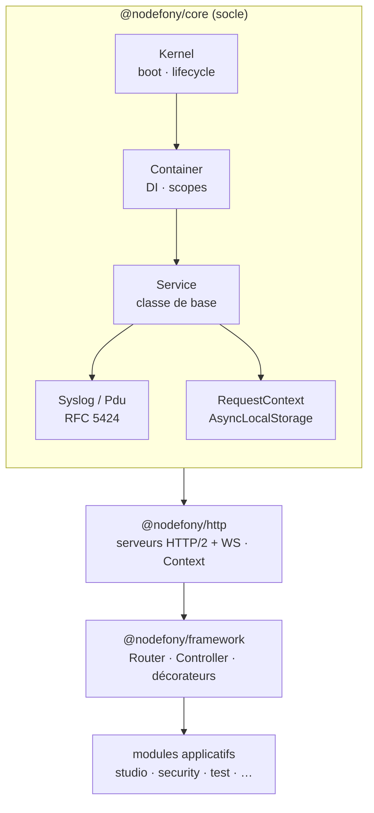

# @nodefony/core

> Socle de Nodefony — la brique dont **tous** les autres packages dépendent (`@nodefony/http`, `framework`, `security`, adapters ORM, plateforme IA). Publié sous le nom npm `nodefony` (héritage JS). Fournit l'injection de dépendances, le cycle de vie kernel/modules, le logging structuré et les utilitaires runtime.

## Pourquoi le core a une carte « Core » à part dans Studio

Le core n'est **pas** un module chargé (`kernel.getModules()` n'a pas de clé `core`) : c'est le fondement, jamais activé comme un module applicatif. Studio l'expose donc via une **carte dédiée** dont les docs sont lues dans `src/nodefony/docs/` et l'API dans `.ai/symbols.json` (symboles `@nodefony/core`).

## Architecture — graphe de dépendances

Chaque couche ne dépend que des couches inférieures : `framework` connaît `http`, jamais l'inverse (l'accès au resolver depuis http se fait par duck-typing pour éviter le cycle).

## Briques principales

| Brique | Source | Rôle |
| --- | --- | --- |
| `Service` | `src/Service.ts` | Classe de base de tout composant (DI + EventEmitter + logging). |
| `Container` | `src/Container.ts` | DI hiérarchique : services nommés, paramètres dot-notation, scopes par requête. |
| `Kernel` | `src/kernel/Kernel.ts` | Orchestration boot, modules, lifecycle events. |
| `Module` | `src/kernel/Module.ts` | Classe de base d'un module Nodefony. |
| `Syslog` / `Pdu` | `src/syslog/` | Logger RFC 5424, ring buffer O(1), transports pluggables. |
| `RequestContext` | `src/runtime/RequestContext.ts` | Façade `AsyncLocalStorage` — propage `requestId`/`user`/`traceparent`. |
| `Nodefony` | `src/Nodefony.ts` | Façade statique (`getKernel()`, `version`, `generateId()`). |

## Pages de doc

- [`container.md`](./container.md) — DI Container, scopes, paramètres (page de référence du format doc).
- [`service.md`](./service.md) — classe de base, DI/Events/Logging.
- [`kernel.md`](./kernel.md) — boot lifecycle, modules, CliKernel, commands.
- [`injection.md`](./injection.md) — `@injectable`/`@inject`, 5 phases, gotchas.
- [`syslog.md`](./syslog.md) — Pdu, ring buffer, transports, SSE.
- [`request-context.md`](./request-context.md) — ALS, `AsyncResource.bind`, BUG-001/002.

## Décisions figées

- Nom npm = `nodefony` (pas `@nodefony/core`). ESM only, named exports, `nodefonyError` (pas `Error`), `Nodefony.getKernel()` (singleton supprimé).
- Voir `CLAUDE.md` / `MEMORY.md` du workspace pour les internals et interdits.
