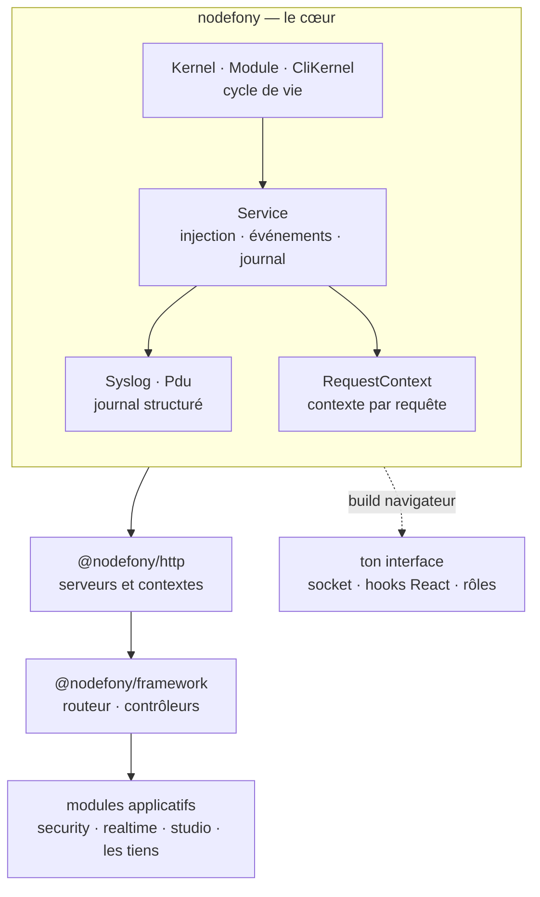

# nodefony — le cœur du framework

> Le socle dont **tous** les autres paquets dépendent : `@nodefony/http` pour parler HTTP,
> `@nodefony/framework` pour router, `@nodefony/security` pour garder, les adaptateurs de base de
> données pour persister. Il apporte cinq choses et rien d'autre : une **classe de base** commune à
> tout composant, un **conteneur de services**, un **cycle de vie** (le kernel et ses modules), une
> **journalisation** structurée, et un **contexte de requête** qui suit le code jusque dans ses
> recoins asynchrones. Il est aussi la seule brique du framework qui tourne **dans le navigateur**.

📍 [Documentation](../../../docs/index.md) › **Cœur — @nodefony/core**

> [!IMPORTANT]
> **Le paquet npm s'appelle `nodefony`, pas `@nodefony/core`.** C'est le piège d'identité numéro un :
> on lit `@nodefony/core` partout — dans cette documentation, dans les fiches de module, dans Studio —
> parce que c'est le **nom interne** de la brique. Mais dans un `package.json` et dans un `import`,
> c'est `nodefony` tout court :
>
> ```ts ignore
> import { Module, Service, Nodefony } from "nodefony"; // ✅ le vrai nom du paquet
> import { Module } from "@nodefony/core"; // ❌ ce paquet n'existe pas sur npm
> ```
>
> L'héritage vient de l'ère JavaScript du framework, et le renommage serait cassant pour tout
> l'écosystème. Deux autres pièges d'import vivent au même endroit : il n'y a **pas d'export par
> défaut** (`import nodefony from "nodefony"` échoue — écrire `import { Nodefony } from "nodefony"`),
> et la classe d'erreur s'appelle `nodefonyError`, pas `Error`, pour ne pas entrer en collision avec
> celle du langage.

## 🧭 Par où commencer

Quatre parcours selon ce que tu viens faire. L'ordre compte : chaque étape suppose la précédente.

**Je découvre le framework** — comprendre le modèle avant d'écrire une ligne.

1. [Kernel, Module et CliKernel](kernel.md) — **commence ici**. Trois classes suffisent à décrire une
   application Nodefony : ce que tu écris, ce qui te porte, et la façade qui relie les deux.
2. [Service](service.md) — la classe dont hérite absolument tout, kernel et modules compris. Comprendre
   `Service`, c'est comprendre pourquoi chaque composant sait s'injecter, émettre des événements et
   écrire dans le journal sans qu'on le lui apprenne.
3. [Le cycle de boot](../../../docs/architecture/cycle-boot-kernel.md) — l'ordre d'allumage réel, les
   hooks où brancher son code, et l'arrêt propre.
4. [Vue d'ensemble du framework](../../../docs/architecture/vue-ensemble.md) — où se pose le cœur par
   rapport aux autres modules.

**J'écris mon premier module** — le chemin le plus court vers du code à toi qui tourne.

1. [Démarrage rapide](#-démarrage-rapide) — le manifeste de modules, un module, un service injecté.
   Copiable tel quel.
2. [Injection et portées](../../../docs/architecture/injection-portees.md) — déclarer un service,
   l'injecter, et surtout **choisir sa portée** : partagé pour tout le processus, ou recréé à chaque
   requête. C'est la page canonique du conteneur de dépendances.
3. [Kernel, Module et CliKernel](kernel.md) — les hooks de cycle de vie (`onKernelBoot`,
   `onKernelReady`), et ce qu'on peut supposer à chacun.
4. [Configuration](../../../docs/architecture/configuration.md) — `defineConfig`, `use()`,
   l'environnement typé, et la validation au boot.

**Je veux du temps réel dans mon front** — le différenciateur du framework, vu du navigateur.

1. [Le client isomorphe](client.md) — le même paquet `nodefony`, importé côté navigateur. La socket,
   les canaux, la cadence adaptative, les rôles évalués côté client.
2. [Les hooks React](react-hooks.md) — la même socket, en idiomes React : abonnement, désabonnement au
   démontage, comptage de références. Ne câble pas le client à la main si tu es en React.
3. [Les composables Vue](vue-composables.md) — la même surface, en idiomes Vue : un plugin sur
   l'application, puis des composables dont la portée rend l'abonnement. Même chose si tu es en Vue.
4. [Les fonctions d'injection Angular](angular-services.md) — la même surface encore, en idiomes
   Angular : un fournisseur dans les `providers`, puis des fonctions qui rendent des signals et
   libèrent l'abonnement à la destruction du composant. La connexion y est ouverte hors zone.
5. [La réactivité Svelte](svelte-reactivite.md) — la même surface, une dernière fois : une
   configuration de module, puis des valeurs qui se lisent `.current` et dont l'abonnement est rendu
   par le système d'effets. Aucune rune n'est publiée, et l'abonnement y est paresseux.
6. [`@nodefony/realtime`](../../packages/@nodefony/realtime/docs/index.md) — le serveur en face : le
   hub qui distribue les canaux, et le backplane quand l'application passe à plusieurs répliques.

**Je veux tracer une requête de bout en bout** — l'enquête, quand quelque chose s'est mal passé.

1. [Journalisation](syslog.md) — la structure d'une entrée de journal, le tampon circulaire qui garde
   les dernières sans jamais grossir, et les transports qui l'expédient ailleurs.
2. [RequestContext](request-context.md) — ce qui fait qu'un identifiant de requête se retrouve dans
   une ligne de journal écrite par un service appelé six niveaux plus bas, sans l'avoir passé en
   paramètre.
3. [Le pipeline de requête](../../../docs/architecture/pipeline-requete.md) — le trajet complet, de
   l'octet reçu à l'octet renvoyé, HTTP comme WebSocket.

## 🗂️ Les pages du cœur

Le tableau pour choisir en cinq secondes ; les cards en dessous pour savoir ce qu'on y trouve.

| Page                                     | Ce qu'elle résout                                     | Tu en as besoin quand…                         |
| ---------------------------------------- | ----------------------------------------------------- | ---------------------------------------------- |
| [Service](service.md)                    | la classe de base : injection, événements, journal    | tu écris n'importe quel composant              |
| [Journalisation](syslog.md)              | ce qui s'écrit, où ça part, ce qu'on garde en mémoire | tu instrumentes, ou tu enquêtes                |
| [Kernel & Module](kernel.md)             | l'API du cœur : démarrer, brancher, étendre           | tu écris un module ou une commande             |
| [CLI](cli.md)                            | piloter le framework en ligne de commande             | tu lances, construis, échafaudes, ou étends    |
| [RequestContext](request-context.md)     | suivre une requête à travers l'asynchrone             | tu corrèles des journaux, ou tu lis l'identité |
| [Client isomorphe](client.md)            | le même paquet, dans le navigateur                    | tu écris du front qui parle au serveur         |
| [Hooks React](react-hooks.md)            | la socket en idiomes React                            | ton front est en React                         |
| [Composables Vue](vue-composables.md)    | la socket en idiomes Vue                              | ton front est en Vue 3                         |
| [Injection Angular](angular-services.md) | la socket en idiomes Angular                          | ton front est en Angular                       |

```nodefony-cards
[
  { "icon": "🧩", "title": "service", "href": "service.md",
    "desc": "La brique de base : kernel, modules, contrôleurs et adaptateurs de base de données en héritent tous. Trois capacités obtenues gratuitement — être injectable, émettre et écouter des événements, écrire dans le journal — et le cycle de vie qui va avec, nettoyage compris.",
    "meta": "à lire en premier : elle rend les autres évidentes" },
  { "icon": "📓", "title": "syslog", "href": "syslog.md",
    "desc": "Une entrée de journal n'est pas une chaîne de caractères : c'est un enregistrement typé, horodaté, attribué à un module et à une sévérité. Avec le tampon circulaire qui garde les dernières à coût constant, et les transports vers un fichier, un agrégateur ou l'écran de Studio.",
    "meta": "tu instrumentes, ou tu enquêtes" },
  { "icon": "🔄", "title": "kernel", "href": "kernel.md",
    "desc": "Kernel (ce qui te porte), Module (ce que tu écris), CliKernel (la même chose pour une commande en ligne), et la façade Nodefony qui te rend le kernel courant depuis n'importe où.",
    "meta": "la référence des objets — le récit du démarrage vit dans le cycle de boot" },
  { "icon": "⌨️", "title": "cli", "href": "cli.md",
    "desc": "Le binaire `nodefony` : démarrer en développement, construire, lancer en production ou en cluster, échafauder un projet ou un module, et accueillir les commandes que tes propres modules ajoutent. Chaque commande choisit jusqu'où booter le kernel.",
    "meta": "tu pilotes, tu échafaudes, ou tu ajoutes ta commande" },
  { "icon": "🧵", "title": "request-context", "href": "request-context.md",
    "desc": "Plusieurs requêtes traversent le même processus en même temps, et chacune garde son identité à travers les await, les rappels et les minuteries. Ce qu'on peut y ranger — identifiant de requête, utilisateur, trace distribuée — et le piège des écouteurs qui se déclenchent plus tard.",
    "meta": "tu corrèles des journaux, ou tu lis l'identité" },
  { "icon": "🌐", "title": "client", "href": "client.md",
    "desc": "Le cœur est isomorphe : un sous-ensemble compile pour le navigateur, ce qui donne la socket temps réel côté client sans importer un second paquet. La connexion et sa reprise, les canaux, la cadence auto-ajustée, l'évaluation des rôles côté interface.",
    "meta": "le même paquet, dans le navigateur" },
  { "icon": "⚛️", "title": "react-hooks", "href": "react-hooks.md",
    "desc": "Le fournisseur de contexte et les hooks : état de connexion, abonnement à un canal, données du dernier message, flux du journal, notifications. Dix composants qui écoutent dix canaux ouvrent une connexion, pas dix.",
    "meta": "tout le désabonnement au démontage est géré" },
  { "icon": "💚", "title": "vue-composables", "href": "vue-composables.md",
    "desc": "Un plugin sur l'application, puis les mêmes capacités en composables : état, identité, canaux, cadence adaptative, journal, notices. La portée du composant rend l'abonnement — il n'y a rien à libérer, et une fuite d'abonnement ne se voit jamais à l'écran.",
    "meta": "ton front est en Vue 3" },
  { "icon": "🅰️", "title": "angular-services", "href": "angular-services.md",
    "desc": "Un fournisseur dans les providers de l'application, puis les mêmes capacités en fonctions d'injection qui rendent des signals. La connexion est ouverte hors zone — sans quoi, avec zone.js, chaque trame reçue relancerait une détection de changements sur toute l'application.",
    "meta": "ton front est en Angular" },
  { "icon": "🔥", "title": "svelte-reactivite", "href": "svelte-reactivite.md",
    "desc": "Une configuration de module, puis les mêmes capacités en valeurs qui se lisent .current. Aucune rune n'est publiée — une bibliothèque qui en publierait imposerait au consommateur de la compiler. L'abonnement est pris à la première lecture et rendu quand plus personne ne lit.",
    "meta": "ton front est en Svelte 5" }
]
```

> [!NOTE]
> **L'injection de dépendances n'a pas de page ici, et c'est voulu.** Le conteneur, les portées et
> les décorateurs `@injectable` / `@inject` / `@services` sont documentés une seule fois, au niveau
> transverse : [Injection et portées](../../../docs/architecture/injection-portees.md). Le sujet
> traverse tous les modules — le confiner dans la doc du cœur obligerait chaque autre module à le
> répéter, et trois vérités valent moins qu'une.

## 🧩 Ce que le cœur apporte

Quatre propriétés, toutes vérifiables dans le code — c'est ce qui distingue le cœur d'une simple
boîte à outils.

**Tout composant partage la même classe de base.** `Service` (`Service.ts:43`) porte à la fois le
conteneur d'injection, le bus d'événements et l'accès au journal. Conséquence pratique : un module,
un contrôleur et un adaptateur de base de données s'observent, se configurent et se nettoient de la
même façon. Il n'y a pas de composant « à part » dans une application Nodefony.

**Le kernel possède les modules, jamais l'inverse.** `Kernel.boot()` (`Kernel.ts:799`) charge le
manifeste, construit les modules, puis fait passer tout le monde par les mêmes phases. Un `Module`
(`Module.ts:60`) déclare s'il est **critique** — un module non critique dont le démarrage échoue
n'emporte pas le processus, il annonce sa dégradation et le reste continue. Les commandes en ligne
empruntent le même chemin par `CliKernel` (`CliKernel.ts:84`).

**Le journal est structuré, borné, et il part où tu veux.** `Syslog` (`Syslog.ts:628`) écrit des
enregistrements typés plutôt que des chaînes, et les conserve dans un tampon circulaire
(`CircularBuffer`, `Syslog.ts:273`) : les dernières entrées restent lisibles à chaud, sans que la
mémoire enfle avec le temps de fonctionnement. Les transports décident ensuite de la destination —
sortie standard, fichier, agrégateur.

**Le contexte d'une requête voyage sans être passé en paramètre.** `RequestContext`
(`RequestContext.ts:115`) s'appuie sur le stockage asynchrone de Node : un service appelé profondément
peut lire l'identifiant de requête ou l'utilisateur courant sans que personne n'ait threadé
d'argument. C'est ce qui rend les journaux corrélables et l'identité disponible partout.

Enfin, le cœur est le **seul** paquet du framework qui tourne aussi côté navigateur : la même
distribution publie un build client, ce qui permet de partager du code — et surtout le client temps
réel — entre le serveur et l'interface. Le détail des sous-chemins est en
[Surface publique](#-surface-publique).

## 🚀 Démarrage rapide

Vu depuis une application créée par `nodefony create app`. Deux fichiers suffisent à voir le cœur
travailler : le manifeste qui décide **ce qui est chargé**, et un module qui apporte **son propre
service**.

### 1. Déclarer ce que l'application charge

`nodefony.config.ts` est l'orchestrateur : un seul fichier, et seulement les **écarts** aux valeurs
d'usine du framework. Le tableau `modules` est **ordonné** — c'est l'ordre de chargement.

```ts
// nodefony.config.ts — à la racine de l'application
export default defineConfig((ctx) => ({
  // Un conteneur doit écouter toutes les interfaces : un port publié par
  // l'orchestrateur n'atteint jamais une écoute limitée à la boucle locale.
  domain: ctx.isProd ? "0.0.0.0" : "127.0.0.1",
  // Le par-environnement passe par `ctx`, jamais par un fichier parallèle.
  log: { debug: ctx.isProd ? [] : "*" },
  modules: [
    "@nodefony/http",
    "@nodefony/framework",
    // `use()` colocalise la configuration d'un module avec son chargement.
    use("@nodefony/realtime", { backplane: { driver: "cluster" } }),
  ],
}));
```

### 2. Écrire un module et son service

Un module est une classe qui étend `Module` ; un service est une classe qui étend `Service`. Le
décorateur `@services` enregistre le second auprès du premier — le conteneur s'occupe de la
construction et des dépendances.

```ts
// nodefony/modules/catalog/index.ts
import { Module, Service, injectable, services } from "nodefony";
import type { Kernel, Container } from "nodefony";

// `@injectable` rend la classe constructible par le conteneur. La portée par
// défaut est partagée : une seule instance pour tout le processus.
@injectable()
class CatalogService extends Service {
  constructor(container: Container) {
    // Le nom est aussi celui qui apparaît dans le journal — choisis-le lisible.
    super("catalog", container);
  }

  find(sku: string): string {
    // Hérité de Service : pas d'importation, pas d'injection de logger.
    this.log(`recherche de ${sku}`, "INFO");
    return sku;
  }
}

// `critical = false` : si ce module échoue à démarrer, l'application monte quand
// même et la dégradation est annoncée. Statique, car lue avant les initialiseurs.
@services([CatalogService])
class CatalogModule extends Module {
  static override critical = false;

  constructor(kernel: Kernel) {
    super("catalog", kernel, import.meta.url, {});
  }

  // Le kernel est prêt : les autres modules et leurs services existent.
  override async onKernelReady(): Promise<this> {
    this.log("catalogue prêt", "INFO");
    return this;
  }
}

export { CatalogService };
export default CatalogModule;
```

Ce qu'on observe ensuite :

1. Au démarrage, chaque phase du kernel est annoncée dans le journal, module par module — c'est le
   premier endroit à regarder quand quelque chose ne se charge pas.
2. Les deux appels à `this.log(…)` sortent avec le nom `catalog` en identifiant de message : c'est ce
   qui permet de filtrer par module dans l'écran **Journaux** de Studio.
3. `CatalogService` devient injectable ailleurs sous le nom `catalog` — un contrôleur le reçoit sans
   jamais l'instancier lui-même. La mécanique complète est en
   [Injection et portées](../../../docs/architecture/injection-portees.md).

## 🏛️ Place dans le framework



Chaque couche ne dépend que de celles du dessous : `@nodefony/framework` connaît `@nodefony/http`,
jamais l'inverse — ce serait un cycle. Le cœur, lui, ne connaît personne : c'est ce qui lui permet
d'être aussi le paquet qu'on importe dans le navigateur.

## 🧰 Surface publique

Le paquet publie plusieurs **sous-chemins** (_subpaths_). Chacun est une porte d'entrée distincte, et
c'est le sous-chemin qui décide de ce qui atterrit dans ton bundle.

<!-- prettier-ignore -->
| Import | Ce qu'on y trouve | Où ça tourne |
| --- | --- | --- |
| `nodefony` | `Kernel`, `Module`, `Service`, `Container`, `Syslog`, `Pdu`, `defineConfig`, `use`, les décorateurs d'injection, `Cli` et `Command` | serveur (Node.js) |
| `nodefony/client` | `RealtimeClient`, le pair JSON-RPC, la cadence adaptative, et les briques isomorphes | navigateur |
| `nodefony/react` | `NodefonyProvider` et les hooks (`useNodefony`, `useNodefonyChannel`, …) | navigateur (React) |
| `nodefony/roles` | `hasRole`, `RoleSet`, `RoleRegistry` — la même évaluation de rôles des deux côtés | isomorphe |
| `nodefony/debugbar` | la barre de débogage embarquable dans une page | navigateur |
| `nodefony/bundler` | le socle de configuration du bundler, partagé par tous les paquets et par les applications | outillage de build |

L'import racine `nodefony` est **conditionnel** : un bundler qui cible le navigateur y trouve
automatiquement le build client, là où Node.js reçoit le build serveur. C'est ce qui rend
l'isomorphisme transparent — tu importes le même nom, tu obtiens la variante qui convient.

> [!WARNING]
> **`nodefony/realtime` n'existe pas.** Ce sous-chemin apparaît dans plusieurs exemples au fil du
> dépôt, mais il n'est pas publié : l'import échoue à la résolution. Le client temps réel se prend
> sur **`nodefony/client`**, ou directement sur `nodefony` dans un contexte navigateur.
>
> ```ts ignore
> import { RealtimeClient } from "nodefony/client"; // ✅ le sous-chemin publié
> import { RealtimeClient } from "nodefony/realtime"; // ❌ non résolu
> ```

Les signatures exactes ne sont jamais recopiées ici — elles divergeraient en silence. Elles vivent
dans les types générés et dans le graphe symbolique du dépôt (`jq '.symbols.Service' .ai/symbols.json`).

## ⚙️ Configuration

Le cœur ne se configure pas comme un module : il porte les **valeurs d'usine** de l'application
entière (domaine, serveurs, journal, manifeste de modules), sur lesquelles ta configuration vient se
fondre au démarrage. Deux fichiers seulement, tous deux à la racine de l'application :

- `nodefony.config.ts` — l'orchestrateur. Le par-environnement s'y exprime par une **fonction** qui
  reçoit son contexte, jamais par un fichier parallèle.
- `env.ts` — le seul endroit qui lit l'environnement du processus, sous forme de catalogue typé et
  validé au démarrage.

La recette complète — `defineConfig`, `use()`, `defineEnv`, la validation, et comment un module
publie ses propres clés typées — est en
[Configuration](../../../docs/architecture/configuration.md).

## 📡 Observabilité — Studio

Le cœur n'est **pas** un module chargé : il n'apparaît donc pas dans la liste des modules, mais dans
une **carte dédiée** (`/nodefony/modules/core`) qui rend ces pages et le graphe de ses symboles. Ce
qu'il produit se lit ailleurs dans l'administration : l'écran **Journaux** montre les entrées émises
par `Syslog`, l'écran **Configuration** montre les valeurs effectives après fusion, et le suivi par
identifiant de requête s'appuie sur ce que `RequestContext` propage.

## 🔗 Pour aller plus loin

- ⬆️ **Remonter** : [Toute la documentation](../../../docs/index.md)
- 📄 **Les pages du cœur** : [Service](service.md) · [Journalisation](syslog.md) ·
  [Kernel & Module](kernel.md) · [CLI](cli.md) · [RequestContext](request-context.md) ·
  [Client isomorphe](client.md) · [Hooks React](react-hooks.md) ·
  [Composables Vue](vue-composables.md) · [Injection Angular](angular-services.md) ·
  [Réactivité Svelte](svelte-reactivite.md)
- 🏛️ **Transverse** : [injection et portées](../../../docs/architecture/injection-portees.md) (la
  page canonique du conteneur) · [cycle de boot](../../../docs/architecture/cycle-boot-kernel.md) ·
  [pipeline de requête](../../../docs/architecture/pipeline-requete.md) ·
  [configuration](../../../docs/architecture/configuration.md) ·
  [build et distribution](../../../docs/architecture/build-bundling.md) ·
  [vue d'ensemble](../../../docs/architecture/vue-ensemble.md)
- 🧭 **Modules voisins** : [`@nodefony/http`](../../packages/@nodefony/http/docs/index.md) (le
  transport) · [`@nodefony/framework`](../../packages/@nodefony/framework/docs/index.md) (routes et
  contrôleurs) · [`@nodefony/realtime`](../../packages/@nodefony/realtime/docs/index.md) (le serveur
  de la socket) · [`@nodefony/studio`](../../packages/@nodefony/studio/docs/index.md) (l'admin qui
  rend tout ça visible)
- 📖 [Lexique général](../../../docs/lexique.md) du framework.
