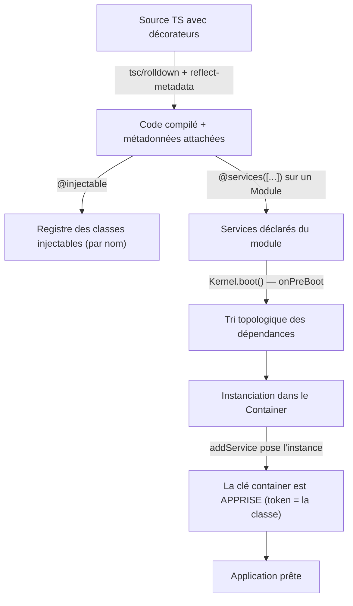

# Dependency Injection — `@injectable`, `@inject`, `@services`

> Système d'injection de dépendances décorateur-driven de Nodefony. Les décorateurs posent des métadonnées via `Reflect.metadata` ; l'`Injector` résout le graphe au boot et instancie dans le Container DI hiérarchique. Inspiré de NestJS (decorators) + Symfony (modèle mental services).

## Vue d'ensemble



## Décorateurs disponibles

### `@injectable(nameOrOptions?)`

Marque une classe comme service injectable et l'enregistre dans le registre des classes.

```typescript
import { injectable } from "nodefony";

// Forme courte — le nom d'enregistrement explicite
@injectable("user-service")
export class UserService extends Service {}

// Forme objet — nom + scope
@injectable({ name: "user-service", scope: "singleton" })
export class UserService2 extends Service {}
```

`InjectableOptions` (source : `src/kernel/injector/injector.ts`) :

| Option  | Type                         | Défaut             | Effet                                               |
| ------- | ---------------------------- | ------------------ | --------------------------------------------------- |
| `name`  | `string`                     | `constructor.name` | Nom d'enregistrement dans le registre des classes   |
| `scope` | `"singleton" \| "transient"` | `"singleton"`      | 1 instance mémoïsée vs nouvelle à chaque résolution |

> ⚠️ Il n'y a **pas** d'option `singleton: boolean`, **pas** de `factory`, et le scope ne prend que `"singleton"` ou `"transient"`. Le `@injectable` sans argument enregistre la classe sous son propre nom, en `singleton`.

### `@inject(name)`

Injecte une dépendance par nom dans un **paramètre de constructeur**. Le nom est **obligatoire**.

```typescript
import { injectable, inject } from "nodefony";

@injectable("order-service")
export class OrderService extends Service {
  constructor(
    @inject("user-service") private users: UserService,
    @inject("Fetch") private fetch: Fetch,
  ) {
    super("order-service" /* container, notificationsCenter */);
  }
}
```

### `@Inject(name?)`

Injecte sur une **propriété** de classe (property injection). `!` (definite assignment) requis. Sans nom explicite, il tente de résoudre depuis `design:type` — mais ce dernier n'est pas émis sous `tsx`, donc **toujours passer le nom** pour un code portable.

```typescript
@injectable()
export class ReportService extends Service {
  @Inject("Fetch") private fetch!: Fetch;
}
```

### `@services([...])`

Décorateur de **Module** : déclare les services que le module enregistre au boot (phase `onPreBoot`). Accepte des classes injectables et/ou des chemins de service.

```typescript
import { Module, services } from "nodefony";

@services([UserService, OrderService])
export class MyModule extends Module {
  static readonly path: string = import.meta.url; // OBLIGATOIRE
}
```

> Un `Module` ne se décore **pas** pour « être un singleton » (`@Service({ singleton: true })` n'existe pas). Il l'est par construction. Le seul décorateur utile ici est `@services([...])`.

## Le token de résolution est la CLASSE

C'est le nœud du DI. **Deux annuaires distincts** :

- `@injectable(nom)` indexe des **CLASSES** (registre `injectables`).
- `super(nom, container)` indexe des **INSTANCES** (le Container).

Rien ne garantit que les deux noms coïncident (`@injectable("Router")` vs `super("router")`), et le décorateur **ne peut pas** connaître le second : il s'exécute au **chargement** de la classe, `super()` seulement à la **construction**.

Résolution : la clé container d'une classe est **apprise** au moment où l'instance est posée (`Module.addService` / `Kernel.addKernelService` → `Injector.rememberContainerKey(Ctor, instance.name)`). Toute résolution ultérieure passe par la **classe** ; le nom écrit dans `@inject` ne sert plus qu'à retrouver la classe.

> Sans cet apprentissage, `@inject("Router")` interrogeait le container avec `"Router"` alors que l'instance y vit sous `"router"` → le container répondait `null`, le service était **reconstruit** (cache vide) en silence, et un doublon coexistait avec l'original — invisible tant qu'on ne sonde pas l'**identité** (deux instances « marchent » chacune).

## Scopes DI

| Scope       | Lifecycle                                  | Use case                            |
| ----------- | ------------------------------------------ | ----------------------------------- |
| `singleton` | 1 instance, mémoïsée sous sa clé canonique | Défaut — database, logger, security |
| `transient` | Nouvelle instance à chaque résolution      | Cas rare — objets paramétrés        |

Le scope `singleton` mémoïse sous la clé **canonique** (`instance.name`), jamais sous le nom demandé — sinon on recrée le doublon qu'on cherche à éviter.

> **Ne pas confondre** avec les **scopes du Container hiérarchique** (`enterScope("request")` → sous-container par requête pour `resolver`/`session`/`context`). Ceux-ci relèvent du Container, pas du DIScope. Voir [`container.md`](./container.md).

## Découverte et instanciation au boot

```typescript
// 1. Services injectables
@injectable("foo")
class FooService extends Service {}

@injectable("bar")
class BarService extends Service {
  constructor(@inject("foo") private foo: FooService) {
    super("bar" /* … */);
  }
}

// 2. Un Module les déclare (l'ORDRE écrit ne décide plus du boot)
@services([BarService, FooService]) // volontairement « à l'envers »
export class MyModule extends Module {
  static readonly path: string = import.meta.url;
}

// 3. Boot
//    → les modules sont chargés depuis config.modules (manifeste ordonné) à onPreRegister
//    → @services fire à onPreBoot
//    → orderServicesByDependencies() calcule l'ordre réel depuis @inject / design:paramtypes
//      (tri STABLE : une liste déjà correcte sort inchangée ; un cycle → erreur qui NOMME le cycle)
//    → chaque service est instancié, posé au container, sa clé apprise
```

L'ordre d'instanciation se **calcule** depuis les dépendances déclarées — il ne se lit plus dans la liste `@services`. Faire reposer le boot sur l'ordre écrit à la main était un piège (déplacer un service de 3 lignes suffisait à casser toutes les requêtes).

## Résolution — comment ça marche

```
1. Métadonnées (Reflect.metadata)
   @injectable(nom)                  → enregistre la classe + pose "di:scope"
   @inject("name") param constructeur → "inject:services" = [name, …] par index
   @Inject("name") propriété          → "inject:properties" = [{ key, name }, …]

2. Injector.instantiate(Ctor, ...args)
   ├── détection de cycle par la pile (stack passée par VALEUR — async-safe)
   ├── singleton déjà au container (via la clé apprise) → court-circuit
   ├── lire "inject:services", résoudre chaque nom → CLASSE → clé container
   ├── new Ctor(...resolvedArgs)
   ├── property injection : lire "inject:properties" sur le prototype, set props
   └── si .initialize() existe → l'appeler

3. Le Container mémorise l'instance sous sa clé canonique ; Injector apprend
   (classe → clé) pour les résolutions suivantes.
```

## Échec d'un service = politique de boot

Un service qui échoue dans `@services` passe par `Module.handleServiceBootError` → `Kernel.serviceBootErrorFatal` : **fatal en production** (un pod amputé ne doit pas se déclarer « UP »), **fail-soft ANNONCÉ** ailleurs (consigné au BootReport). Un simple `log(e, "ERROR")` n'atteignait ni la politique de criticité ni le BootReport → un boot cassé s'affichait sain. Cf [`project_resilience_no_silent_degradation`] (mémoire IA).

## ⚠️ Gotchas connus

| Symptôme                                    | Cause                                              | Fix                                                          |
| ------------------------------------------- | -------------------------------------------------- | ------------------------------------------------------------ |
| `Service X not found or not injectable`     | `@injectable` oublié ou nom incorrect              | Vérifier le nom d'enregistrement + `container.has()` au boot |
| `@inject()` sans nom ne résout pas          | Sous `tsx`, `design:paramtypes` n'est pas émis     | Toujours passer le nom : `@inject("database")`               |
| Deux instances d'un même service coexistent | Clé demandée ≠ clé container, apprentissage absent | Vérifier que l'instance est bien posée (`addService`)        |
| Property `@Inject` reste `undefined`        | Property injection partielle                       | Préférer l'injection par constructeur                        |
| Cycle de dépendance                         | A ↔ B via `@inject`                                | Erreur au boot qui **nomme** le cycle → désaccoupler         |

## Pattern type — service avec dépendances

```typescript
import { injectable, inject, Service } from "nodefony";
import type Fetch from "nodefony";

@injectable("user-service")
export class UserService extends Service {
  constructor(@inject("Fetch") private fetch: Fetch) {
    super("user-service" /*, container, notificationsCenter */);
  }
}

@services([UserService])
export class MyModule extends Module {
  static readonly path: string = import.meta.url;
}
```

Au boot, `kernel.get<UserService>("user-service")` (ou la classe, via la clé apprise) retourne l'instance prête, ses dépendances injectées.

## Liens

- **Code source** : `src/nodefony/src/kernel/injector/` (`injector.ts`, `serviceOrder.ts`) + `src/nodefony/src/kernel/decorators/kernelDecorator.ts`
- **MEMORY.md** : `src/nodefony/src/kernel/injector/MEMORY.md`
- **Container** (scopes hiérarchiques, distincts du DIScope) : [`container.md`](./container.md)
- **Kernel** (démarre l'`Injector` au boot) : [`kernel.md`](./kernel.md)
- **Chargement des modules** (manifeste `config.modules`) : `project_module_loading_architecture` (mémoire IA)
- **Graphe symbolique** : `jq '.symbols.injectable' .ai/symbols.json`
