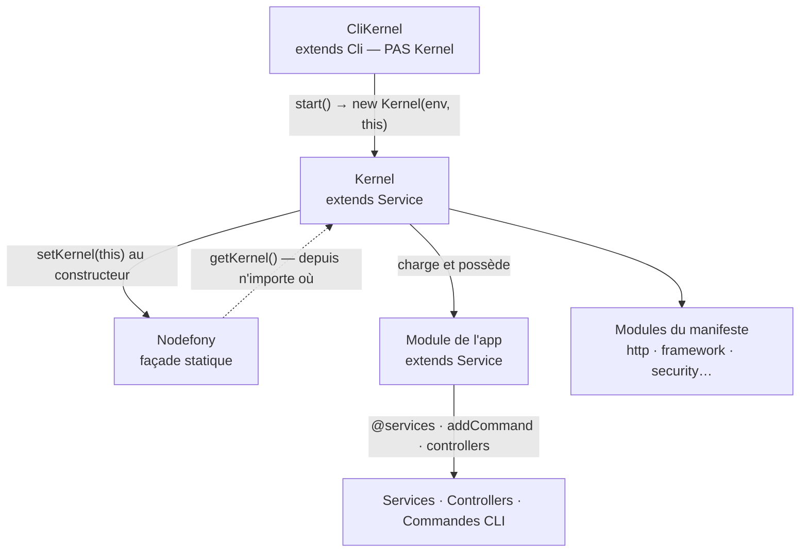

# Kernel, Module et CliKernel — l'API du cœur

> Trois classes suffisent à écrire une application Nodefony : `Module` (ce que **tu** écris),
> `Kernel` (ce qui te **porte**), `Nodefony` (la façade qui te rend le kernel depuis n'importe où).
> Cette page est leur **surface d'API** — les objets, leurs membres, comment on s'en sert. Le
> **récit du boot** (phases, ordre, résilience, arrêt) vit dans une page dédiée, liée plus bas.
> Ancré sur `src/nodefony/src/kernel/` et `src/nodefony/src/Nodefony.ts`.

📍 [Documentation](../../../docs/index.md) › [Cœur — @nodefony/core](index.md) › **Kernel, Module et CliKernel**

## 🧠 Le modèle mental — qui possède quoi

Le cœur tient en une phrase : **le `CliKernel` fabrique un `Kernel`, le `Kernel` possède des
`Module`, et la façade `Nodefony` sert de raccourci vers le kernel courant.**



Trois idées portent toute la page :

1. **Un module est un `Service`.** Il hérite du container, du journal et du bus d'événements — il
   n'a rien à recâbler, seulement à déclarer ce qu'il apporte.
2. **Le kernel n'est jamais importé, il est demandé.** Aucun `import { kernel }` : on passe par
   l'injection quand elle est disponible, par `Nodefony.getKernel()` quand elle ne l'est pas.
3. **Écrire un module, c'est remplir des seams.** Un constructeur à quatre arguments, des hooks
   nommés, un décorateur pour les services. Rien à découvrir, rien à deviner.

## 📖 Lexique

| Terme                 | Sens                                                                                                 |
| --------------------- | ---------------------------------------------------------------------------------------------------- |
| Façade statique       | Une classe sans instance dont on n'appelle que les membres `static` (`Nodefony.getKernel()`).        |
| Kernel                | Le noyau : container racine, registre des modules, émetteur des phases, chemins de travail.          |
| Module                | Unité chargeable qui apporte services, controllers, routes, entités, commandes. **L'app en est un.** |
| CliKernel             | Le point d'entrée en ligne de commande. Il **fabrique** le kernel, il n'en est pas un.               |
| Manifeste             | La liste `modules` de `nodefony.config.ts` — ordonnée, c'est elle qui décide ce qui est chargé.      |
| Hook                  | Une méthode de ton module appelée à une phase précise (`onKernelRegister`, `onKernelBoot`, …).       |
| Seam                  | Un point d'extension prévu par le framework : on le remplit, on ne le contourne pas.                 |
| DI / Container        | Injection de dépendances : l'annuaire nom → instance, hérité de `Service`.                           |
| Bus d'événements      | L'`EventEmitter` étendu du cœur. Le kernel s'en sert pour annoncer ses phases.                       |
| Émission synchrone    | `fire()` : les écouteurs tournent immédiatement, aucun `await`, **0 microtask**.                     |
| Émission séquentielle | `fireAsync()` : les écouteurs asynchrones sont attendus **l'un après l'autre**.                      |
| Émission gardée       | `fireLifecycle()` : chaque écouteur est isolé (try/catch + délai maximal). Réservée au boot.         |
| Listener tagué        | Un écouteur portant son propriétaire et sa criticité — posé par le câblage des hooks de module.      |
| Criticité             | `Module.critical` : un module critique qui échoue **arrête** le boot en production.                  |
| Fail-soft             | Un échec non fatal : consigné, annoncé au verdict de boot, mais le boot continue.                    |
| `runProfile`          | Ce dont un run a besoin : `{ servers, lifetime, interactive }`. Un `build` n'ouvre aucun port.       |
| Commande de module    | Une commande CLI apportée par un module (`frontend:build`), par opposition aux commandes intégrées.  |
| `msgid`               | La catégorie d'une ligne de journal. Un module la remplit avec `MODULE <son nom>`.                   |

## Qu'est-ce que le cœur — et pourquoi une façade plutôt qu'un singleton

Un framework doit répondre à une question banale : **« comment mon code atteint-il le
framework ? »** La réponse historique de Nodefony, héritée de sa version JavaScript, était un objet
exporté : `import { kernel } from "nodefony"`.

Cette réponse ne tient pas en ESM. Un `import` est résolu au **chargement** du fichier, alors que le
kernel n'existe qu'après avoir été **construit**. Les fichiers importés tôt recevaient donc un
kernel non initialisé, et l'erreur ne se voyait qu'au runtime, loin de sa cause.

D'où la bascule vers une **façade statique**. `Nodefony` n'est jamais instanciée — constructeur
privé (`Nodefony.ts:27`) — et n'expose que des membres `static`. On ne demande plus le kernel au
chargement : on le demande **au moment de s'en servir**, quand il existe.

> [!IMPORTANT]
> `Nodefony.getKernel()` (`Nodefony.ts:34`) rend `Kernel | **null**`. Le `null` n'est pas
> théorique : hors serveur — dans un test unitaire, un script, un fichier importé avant le boot —
> il n'y a pas de kernel. Toujours `?.`, jamais un `!`.

## La vision Nodefony

Trois décisions expliquent la forme de l'API.

**1. Tout hérite de `Service`.** `Kernel` et `Module` en descendent tous les deux. Un module reçoit
donc gratuitement `this.log()`, `this.get()`, `this.on()`, `this.fire()` — le socle est décrit dans
[Service](service.md), et cette page ne le répète pas. Écrire un module, c'est écrire un service qui
sait en plus se charger et s'accrocher au cycle de vie.

**2. Le kernel s'enregistre lui-même, une fois.** Son constructeur (`Kernel.ts:489`) appelle
`Nodefony.setKernel(this)` (`Kernel.ts:525`) et se pose au container sous la clé `kernel`
(`Kernel.ts:527`). Deux chemins d'accès, une seule instance — l'injection pour le code câblé, la
façade pour le reste.

**3. Le CLI n'est pas le noyau.** `CliKernel` (`CliKernel.ts:84`) étend `Cli`, **pas** `Kernel` : il
analyse `argv`, choisit une commande, puis **construit** le kernel (`CliKernel.ts:238`). Séparation
utile — beaucoup d'invocations (`--version`, la complétion, `nodefony create`) n'ont aucun kernel à
démarrer, et n'en démarrent effectivement aucun.

Le compromis assumé : la surface publique du `Kernel` est **large** (registre de modules, chemins,
config, réseau, cluster, verdict de boot). C'est le prix d'un noyau qui centralise ; en contrepartie,
une application n'en touche qu'une petite partie — celle décrite plus bas.

## 🚀 Démarrage rapide

Vue depuis une application générée par `nodefony create app`. Objectif : **un module complet**, avec
sa configuration typée, un service et une commande CLI.

### Le module, de bout en bout

```typescript
// nodefony/modules/billing/index.ts — un module d'app, complet.
import { Module, Service, Command, injectable, services } from "nodefony";
import type { CliKernel, Container, Event, Kernel } from "nodefony";

// Ce que MON module accepte comme configuration.
// ⚠️ Un `type`, PAS une `interface` — voir la section Pièges : `@services()`
// exige une forme assignable à `Record<string, unknown>`.
type IBillingConfig = {
  currency: string;
  vatRate: number;
};

// `@injectable("invoices")` inscrit la CLASSE au registre DI sous ce nom.
@injectable("invoices")
class InvoiceService extends Service {
  // Le module porteur transmet SES ressources : même container, MÊME bus.
  constructor(module: Module) {
    super(
      "invoices",
      module.container as Container,
      module.notificationsCenter as Event,
    );
  }

  totalTTC(amountHT: number, cfg: IBillingConfig): number {
    return Math.round(amountHT * (1 + cfg.vatRate) * 100) / 100;
  }
}

// Une commande CLI apportée par le module : `npx nodefony billing:report`.
class BillingReportCommand extends Command {
  constructor(cli: CliKernel) {
    // `kernelEvent` = la phase APRÈS laquelle `generate()` est appelé.
    super("billing:report", "Édite le rapport de facturation", cli, {
      kernelEvent: "onPostReady",
    });
  }

  override async generate(): Promise<void> {
    this.log("rapport édité", "INFO");
  }
}

// `Module<IBillingConfig>` type `this.config` — plus aucun cast au point d'usage.
@services([InvoiceService])
class Billing extends Module<IBillingConfig> {
  // Module optionnel : son échec n'abat pas le pod en production.
  static override critical = false;

  constructor(kernel: Kernel) {
    // 4 arguments, toujours les mêmes : nom · kernel · emplacement · config.
    super("billing", kernel, import.meta.url, {
      currency: "EUR",
      vatRate: 0.2,
    });
    // Les commandes se posent DANS le constructeur : le CLI doit les connaître
    // avant même que les phases ne commencent.
    this.addCommand(BillingReportCommand);
  }

  override async onKernelBoot(): Promise<this> {
    // `this.config` est typé IBillingConfig ; `this.get` interroge le container.
    const invoices = this.get<InvoiceService>("invoices");
    const ttc = invoices?.totalTTC(100, this.config);
    this.log(`100 HT → ${ttc} ${this.config.currency}`, "INFO");
    return this;
  }
}

export default Billing;
```

### Le déclarer — un module non déclaré n'existe pas

```typescript
// nodefony.config.ts — le manifeste est ORDONNÉ : c'est la priorité de chargement.
export default defineConfig(() => ({
  modules: [
    "@nodefony/http",
    "@nodefony/framework",
    // `use()` colocalise la config du module avec son chargement : elle écrase
    // les défauts posés dans le constructeur ci-dessus.
    use("@app/billing", { currency: "EUR", vatRate: 0.055 }),
  ],
}));
```

### Atteindre le kernel là où l'injection ne va pas

```typescript
// nodefony/services/DiagnosticService.ts — la façade, en dernier recours.
import { Nodefony, Service } from "nodefony";

export class DiagnosticService extends Service {
  snapshot(): { version: string; env: string; modules: string[] } {
    // `getKernel()` rend `Kernel | null` : le `?.` n'est pas décoratif —
    // hors serveur (test, script, import précoce) il n'y a pas de kernel.
    const kernel = Nodefony.getKernel();
    return {
      version: Nodefony.version,
      env: kernel?.environment ?? "(hors kernel)",
      modules: Object.keys(kernel?.getModules() ?? {}),
    };
  }
}
```

### Ce qu'on observe

```bash
npx nodefony development
```

```text
MODULE ADD : billing
SERVICE ADD : invoices                    # Module.addService a posé l'instance
MODULE billing   100 HT → 105.5 EUR       # msgid = « MODULE <nom> », automatique
```

Le `msgid` de la dernière ligne est `MODULE billing` sans qu'on l'ait écrit : `Module.log()`
(`Module.ts:591`) le remplit par défaut, là où un `Service` nu emploie son seul nom. Le taux appliqué
est **0.055** et non 0.2 — la config du manifeste a écrasé le défaut du constructeur.

Et la commande est là :

```bash
npx nodefony billing:report      # elle n'existe QUE parce que le module l'a posée
```

## 🧩 Écrire un module — le geste central

### Le constructeur — quatre arguments, aucun mystère

`Module` (`Module.ts:60`) impose la même signature à tout le monde (`Module.ts:102`) :

| Argument  | Rôle                                                                                       |
| --------- | ------------------------------------------------------------------------------------------ |
| `name`    | Clé du module dans `kernel.modules`, et préfixe de ses logs. Court, sans espace.           |
| `kernel`  | Le kernel porteur — il fournit container, journal et bus. Reçu, jamais cherché.            |
| `path`    | **Toujours `import.meta.url`.** Normalisé par `Module.setPath()` (`Module.ts:163`).        |
| `options` | Les **défauts** de ta configuration. Le manifeste et l'environnement les écrasent ensuite. |

Le constructeur fait trois choses et rien d'autre : il range les options dans l'arbre de paramètres
sous `modules.<nom>`, il résout le chemin, puis il câble les hooks via `Module.setEvents()`
(`Module.ts:206`).

> [!TIP]
> `path` mérite son `import.meta.url` littéral. `setPath()` remonte au-dessus d'un dossier `dist/`
> quand il en détecte un (`Module.ts:169`) — c'est ce qui fait qu'un module trouve ses fichiers
> aussi bien depuis les sources que depuis son paquet publié.

### Les hooks — trois noms, exactement

`setEvents()` n'attache un écouteur que si la méthode **existe** sur ton prototype : aucun listener
orphelin pour un hook que tu n'écris pas.

| Hook                 | Ce qui est garanti à ce moment                             | On y met…                                     |
| -------------------- | ---------------------------------------------------------- | --------------------------------------------- |
| `onKernelRegister()` | tous les modules sont instanciés, surcharges appliquées    | valider sa config, déclarer entités et routes |
| `onKernelBoot()`     | les services de `@services([…])` sont construits           | ouvrir ses connexions, armer ses timers       |
| `onKernelReady()`    | **tous** les modules sont bootés, ports pas encore ouverts | se câbler aux autres modules                  |
| `init(kernel?)`      | le module vient d'être ajouté au kernel                    | l'équivalent d'un constructeur asynchrone     |

Le moment exact de chaque phase, ce qui devient vrai entre deux, et la politique appliquée quand un
hook échoue : [Cycle de boot](../../../docs/architecture/cycle-boot-kernel.md).

> [!WARNING]
> Un hook **doit être une méthode de prototype**. Écrit en propriété fléchée
> (`onKernelBoot = async () => {}`), il n'existe pas encore quand `setEvents()` s'exécute depuis le
> constructeur de `Module` — l'écouteur n'est jamais attaché, et **rien ne le signale**. Même
> conséquence pour un nom approximatif (`onBoot`, `onKernelBooted`) : `setEvents()` teste ces trois
> noms-là et pas d'autres.

### Sa configuration — `this.config`, typée

Déclare le type en paramètre de la classe et l'accès devient typé partout :

```typescript ignore
class Billing extends Module<IBillingConfig> {}
// puis, n'importe où dans le module :
this.config.currency; // string — 0 cast, 0 `as`
```

`Module.config` (`Module.ts:152`) est un getter qui renvoie `this.options` : la config **validée et
gelée** par le module à sa phase `onKernelRegister`. Coût nul — une référence, aucune allocation.

> [!CAUTION]
> Déclare ce type avec `type`, **jamais** avec `interface`. Le décorateur `@services()` contraint son
> argument à `new (…) => Module` (`kernelDecorator.ts:21`), soit `Module<Record<string, unknown>>` :
> or TypeScript n'accorde d'index signature implicite qu'aux **alias de type**, pas aux interfaces.
> Une `interface IBillingConfig` fait donc échouer la compilation du décorateur, avec un message qui
> ne pointe pas la vraie cause. C'est la forme employée par les modules du framework, dont les types
> de config sont des alias dérivés de leur schéma Zod.

Un module qui valide sa config par un schéma Zod peut en publier la forme via `Module.configSchema()`
(`Module.ts:136`). Studio affiche alors des réglages documentés (type, défaut, valeur effective) au
lieu d'un dépotoir clé/valeur. Le défaut est `null` : rien n'est obligatoire.

### Déclarer ses services

Deux chemins, un seul recommandé.

| Geste                        | Ancre           | Quand                                                       |
| ---------------------------- | --------------- | ----------------------------------------------------------- |
| `@services([A, B])`          | —               | **Le cas normal.** Construits à `onPreBoot`, ordre calculé. |
| `Module.addService(Ctor, …)` | `Module.ts:313` | Ajout conditionnel, décidé à l'exécution.                   |
| `Module.loadService(chemin)` | `Module.ts:405` | Service optionnel chargé par `import()` dynamique.          |
| `Module.getServiceNames()`   | `Module.ts:393` | Introspection — ce que **ce** module a posé au container.   |

L'ordre écrit dans `@services([…])` n'a **pas** d'importance : il est recalculé depuis les
dépendances déclarées. Détail du tri et des portées :
[Injection & portées](../../../docs/architecture/injection-portees.md).

`addService()` fait plus que construire : il initialise le service **sous garde** —
`Kernel.guardServiceInitialize()` (`Module.ts:350`) —, apprend au registre DI le lien entre la classe
et sa clé de container, puis range l'instance. C'est
la raison pour laquelle on ne fait jamais un `new` manuel — un service construit à la main n'est
connu de personne.

> [!CAUTION]
> `@injectable({ singleton: true })` **n'existe pas**. Les options acceptées sont `{ name?, scope? }`
> où `scope` vaut `singleton` (défaut) ou `transient` ; une clé `singleton` est **acceptée et
> ignorée en silence**. De même, `@Inject` (injection de propriété) existe dans le moteur mais
> **n'est pas ré-exporté** par le paquet `nodefony` : `import { Inject } from "nodefony"` échoue.
> Injecte par **constructeur**, avec `@inject("nom")`.

### Ajouter une commande CLI

`Module.addCommand()` (`Module.ts:508`) enregistre une commande rattachée au module — c'est ainsi
que `frontend:build`, `security:user:add` ou `network` existent. Convention de nom :
`<module>:<action>`.

Elle se pose **dans le constructeur**, comme le font les modules du framework : le CLI doit connaître
la commande avant que les phases ne commencent.

```typescript ignore
constructor(kernel: Kernel) {
  super("billing", kernel, import.meta.url, defaults);
  this.addCommand(BillingReportCommand);   // ← ici, pas dans un hook
}
```

Deux comportements à connaître :

- **Sans CLI, elle lève.** `addCommand` exige `kernel.cli` ; un module instancié hors invocation en
  ligne de commande (test unitaire, kernel embarqué) reçoit `Error("Kernel not ready")`.
- **En cluster, le worker se tait.** Une exception d'enregistrement est propagée sur le process
  primaire et **avalée** sur un travailleur (`Module.ts:517`) — seul le primaire tient le terminal.

### Les controllers du module

Le registre des controllers est global au process mais **indexé par module** — clé
`<module>:<Classe>` — de sorte que deux modules peuvent porter un `DefaultController` sans collision.

| Appel                | Ancre           | Rend                                                       |
| -------------------- | --------------- | ---------------------------------------------------------- |
| `getController("X")` | `Module.ts:473` | le constructeur, ou **lève** si absent de **ce** module    |
| `getControllers()`   | `Module.ts:488` | vue filtrée `{ NomDeClasse: Ctor }`, préfixe module retiré |

### Surcharger la config d'un autre module

Une clé `Module-<nom>` dans la config d'un module reconfigure **un autre** module, sans toucher à son
code — `Module.readOverrideModuleConfig()` (`Module.ts:258`), appliqué par le kernel entre le
chargement et la validation.

```typescript ignore
// Dans la config de MON module : je reconfigure http sans le modifier.
{ "Module-http": { port: 8080 } }
```

Le niveau du journal dépend de qui parle : une **application** qui vise un module absent obtient un
`WARNING` (config morte, comptée au verdict de boot) ; un **module** obtient un `INFO`, parce qu'il
peut légitimement embarquer un réglage pour une cible optionnelle (`Module.ts:275`).

### Rendre son module optionnel

```typescript ignore
static override critical = false;   // statique, jamais une propriété d'instance
```

Un module non critique n'abat jamais le boot : son échec est consigné, annoncé au verdict, et le
serveur démarre dégradé plutôt que mort. La lecture se fait dans le constructeur de `Module`
(`Module.ts:211`) — **avant** que les initialiseurs de champ de ta sous-classe ne tournent, d'où le
`static`. Arbitrage complet : [Cycle de boot](../../../docs/architecture/cycle-boot-kernel.md).

## 🧰 La surface du Kernel utile à une application

Le `Kernel` expose beaucoup. Voici ce qu'une application touche réellement.

### Trouver un module

| Appel            | Ancre            | Rend                                                   |
| ---------------- | ---------------- | ------------------------------------------------------ |
| `getModule(nom)` | `Kernel.ts:1502` | le module, ou `undefined` s'il n'est pas chargé        |
| `getModules()`   | `Kernel.ts:1562` | la table complète, **par référence** (ne pas la muter) |
| `modules`        | `Kernel.ts:494`  | le même objet, en accès direct                         |

`getModule()` est une lecture de table, sans garde : un module gaté par le manifeste rend
`undefined`, pas une erreur. Le tester est donc à ta charge — c'est aussi le bon moyen de rendre une
intégration facultative.

### Les chemins de travail

Trois dossiers, trois durées de vie. Tous sont garantis **créés** au démarrage — un checkout frais,
un conteneur neuf ou un premier boot ne les ont pas.

| Membre   | Ancre           | Ce qu'on y met                                                                   |
| -------- | --------------- | -------------------------------------------------------------------------------- |
| `path`   | `Kernel.ts:461` | La racine du projet (le répertoire de travail). Base de tout le reste.           |
| `varDir` | `Kernel.ts:414` | Données runtime **persistées** : stores fichier, bases SQLite. Survit au reboot. |
| `tmpDir` | `Kernel.ts:408` | Éphémère. Tout ce qui peut disparaître sans conséquence.                         |

`varDir` et `tmpDir` sont des `FileClass`, pas des chaînes : leur chemin est sous `.path`.

```typescript ignore
const dbFile = path.resolve(kernel.varDir!.path, "app.db"); // persiste
const scratch = path.resolve(kernel.tmpDir!.path, "build"); // jetable
```

### Configuration, environnement, container

| Membre                      | Ancre            | Note                                                                   |
| --------------------------- | ---------------- | ---------------------------------------------------------------------- |
| `options`                   | —                | La config de l'app, résolue et validée au chargement de celle-ci.      |
| `environment`               | `Kernel.ts:325`  | Le mode **moteur** : `"development"` ou `"production"`.                |
| `domain`                    | `Kernel.ts:503`  | Le nom d'hôte retenu, résolu au boot.                                  |
| `get()` / `set()` / `has()` | —                | La façade container héritée de `Service` — voir [Service](service.md). |
| `getBootReport()`           | `Kernel.ts:2733` | Le verdict du dernier boot : modules, serveurs, santé.                 |

> [!WARNING]
> Ne **jamais** déréférencer le kernel au premier niveau d'un fichier de configuration : il est
> importé **avant** que le kernel n'existe, et le fichier plante à l'import — donc devient
> intestable. Emploie le `ctx` de `defineConfig((ctx) => …)`, ou un getter paresseux. Le cas est
> détaillé dans [Configuration](../../../docs/architecture/configuration.md).

### La façade `Nodefony`

Quatre membres, tous statiques (`Nodefony.ts:22`).

| Membre                 | Ancre            | Usage                                                                    |
| ---------------------- | ---------------- | ------------------------------------------------------------------------ |
| `getKernel()`          | `Nodefony.ts:34` | Le kernel courant, ou `null`. **Toujours** tester.                       |
| `version`              | `Nodefony.ts:24` | La version du paquet `nodefony`, lue au build.                           |
| `generateId()`         | `Nodefony.ts:54` | UUID **v4** — aléatoire. Pour un identifiant qui doit être imprévisible. |
| `generateSortableId()` | `Nodefony.ts:79` | UUID **v7** — horodaté, donc **ordonné**. Pour une clé primaire.         |

`setKernel()` (`Nodefony.ts:44`) existe mais appartient au boot : l'appeler soi-même écrase la
référence globale sans avertissement.

> [!CAUTION]
> Ces deux générateurs ne sont pas interchangeables. Un **v7** groupe les insertions côte à côte dans
> l'index (là où un v4 fragmente l'arbre), mais il **fuit l'instant de création** et la RFC 9562
> interdit explicitement de s'en servir comme secret. Clé primaire → v7. Jeton, identifiant deviné →
> **v4**. Et l'ordre n'est **pas** garanti à l'intérieur d'une même milliseconde : trier des
> créations se fait sur `createdAt`, jamais sur l'identifiant.

## Les événements — `fire()` vs `fireAsync()`

Le kernel annonce chaque phase sur son bus. Trois émetteurs cohabitent, et ils ne servent **pas** la
même chose.

| Émetteur                | Ancre            | Comportement                                                     | Employé pour           |
| ----------------------- | ---------------- | ---------------------------------------------------------------- | ---------------------- |
| `fire(nom, …)`          | `Kernel.ts:2148` | Synchrone. Les écouteurs tournent tout de suite, **0 microtask** | le chemin chaud        |
| `fireAsync(nom, …)`     | `Kernel.ts:2166` | Attend les écouteurs asynchrones, **en séquence**                | pipeline HTTP/WS, boot |
| `fireLifecycle(nom, …)` | `Kernel.ts:2980` | Isole chaque écouteur : délai maximal + politique de criticité   | **le boot seulement**  |

La règle de choix tient en une ligne : **si le résultat de l'écouteur t'importe, `fireAsync` ; sinon
`fire`.** `fire()` ne t'apprend rien de ce qui s'est passé — il rend un booléen « quelqu'un
écoutait ». Une promesse rejetée dans un écouteur appelé par `fire()` devient un rejet non géré.

`fireLifecycle()` n'est pas un troisième choix à ta disposition : le kernel l'emploie sur la chaîne
`onPreRegister` → `onPostReady`, et **uniquement** là. Le chemin chaud garde l'émission nue — aucun
timer, aucune allocation par requête. La résilience du boot ne se paie pas au prix de la requête.

> [!NOTE]
> Les trois émetteurs journalisent une ligne `DEBUG` par événement émis (`Kernel.ts:2149`). Utile
> pour suivre un boot ; c'est aussi pourquoi un `NF__DEBUG` large rend le démarrage très bavard.

### Le piège du listener non tagué

C'est **le** piège de la page, et il ne se voit qu'en production.

Quand tu déclares un hook (`onKernelBoot`), `setEvents()` l'attache **tagué** : l'écouteur porte le
nom de son module et sa criticité (`Module.ts:215`). En cas d'échec, le kernel relit ces étiquettes
et applique **ta** politique — un module `critical = false` échoue en fail-soft.

Quand tu attaches le même code à la main, il n'y a **aucune** étiquette :

```typescript ignore
// ❌ Non tagué : propriétaire inconnu, criticité inconnue.
kernel.on("onBoot", async () => {
  await this.connect();
});

// ✅ Tagué par le framework, avec ta criticité.
override async onKernelBoot(): Promise<this> {
  await this.connect();
  return this;
}
```

La conséquence est asymétrique, et c'est ce qui la rend traître. La criticité manquante est traitée
comme **critique par défaut** (`Kernel.ts:2629` : l'échec est fatal dès lors que `critical !== false`
et qu'on est en production). Donc :

| Environnement  | Hook déclaré, `critical = false` | Écouteur posé à la main   |
| -------------- | -------------------------------- | ------------------------- |
| Développement  | fail-soft, boot dégradé          | fail-soft — **identique** |
| **Production** | fail-soft, boot dégradé          | **boot interrompu**       |

En développement les deux formes se comportent pareil : le piège est invisible pendant tout le
développement, et se déclenche au premier déploiement. Le journal, lui, ne peut nommer personne — il
écrit `"(anonyme)"` (`Kernel.ts:2225`), ce qui rend le diagnostic difficile au pire moment.

**La règle** : sur les phases de boot, on déclare un hook. `kernel.on(...)` est réservé aux
événements hors cycle de vie.

## ⚙️ CliKernel — le noyau des commandes

`CliKernel` (`CliKernel.ts:84`) est ce que `npx nodefony <commande>` instancie. Il n'étend **pas**
`Kernel` : il étend `Cli`, analyse `argv` via Commander, et fabrique le kernel dans `start()`
(`CliKernel.ts:172`).

### Ce qu'il apporte

| Membre                  | Ancre              | Rôle                                                                  |
| ----------------------- | ------------------ | --------------------------------------------------------------------- |
| `runProfile`            | `CliKernel.ts:85`  | `{ servers, lifetime, interactive }` — ce dont le run a besoin.       |
| `setRunProfile(profil)` | `CliKernel.ts:784` | Déclaré par une commande ; recopié dans le kernel à `onStart`.        |
| `packageManager`        | `CliKernel.ts:87`  | `pnpm` par défaut ; commutable en `npm` / `yarn`.                     |
| `addCommand(Ctor)`      | `CliKernel.ts:670` | Enregistre une commande intégrée (les modules passent par `Module`).  |
| `quietBoot`             | `CliKernel.ts:95`  | Boot silencieux : seules les erreurs sortent. Pour une sortie propre. |
| `parseCommand(argv?)`   | `CliKernel.ts:143` | Analyse Commander synchrone.                                          |

Le défaut de `runProfile` est **console pur** : `{ servers: false, lifetime: "oneshot" }`. Une
commande n'ouvre donc aucun port tant qu'elle ne le demande pas — un `nodefony build` ne démarre
jamais un serveur par accident, et une commande inconnue termine en erreur au lieu de retomber sur un
runtime.

### Le piège du constructeur

> [!WARNING]
> `environment` peut être **`undefined`** dans le constructeur de `CliKernel` (`CliKernel.ts:100`) :
> ce sont les sous-commandes qui le posent, plus tard. Ne conditionne jamais du code sur
> `this.environment` dans un constructeur — le réglage va dans le hook `onKernelStart()` de la
> commande, qui tourne avant le boot.

```typescript ignore
class DevCommand extends Command {
  override async onKernelStart(): Promise<void> {
    (this.cli as CliKernel).setRunProfile({
      servers: true,
      lifetime: "longrunning",
      interactive: false,
    });
    this.cli.environment = "development"; // ← ici, jamais au constructeur
  }
}
```

### Les invocations qui ne bootent rien

Certaines commandes sont traitées **avant** toute construction de kernel (`CliKernel.ts:172`) :
`--version`, la complétion shell, `nodefony create`, `nodefony status` et `nodefony stop`. Elles
tournent hors de tout projet et en quelques millisecondes — une tabulation de complétion ne démarre
pas un noyau.

Le cycle écourté d'une commande (phase cible, `park`, arrêt) appartient au récit du boot :
[Cycle de boot](../../../docs/architecture/cycle-boot-kernel.md).

## ⚠️ Pièges (symptôme → cause → correction)

| Symptôme                                                  | Cause (dans le code)                                                             | Correction                                                           |
| --------------------------------------------------------- | -------------------------------------------------------------------------------- | -------------------------------------------------------------------- |
| `does not provide an export named 'kernel'`               | L'ancien singleton exporté n'existe plus                                         | `Nodefony.getKernel()` (`Nodefony.ts:34`), avec un `?.`              |
| `Cannot read properties of null` sur le kernel            | `getKernel()` rend `null` hors serveur                                           | Tester le retour ; en service, préférer l'injection                  |
| Mon hook n'est jamais appelé                              | Propriété fléchée, ou nom approximatif                                           | Méthode de prototype nommée exactement (`Module.ts:212`)             |
| Le boot casse **en production seulement**                 | Écouteur de phase posé à la main → non tagué → critique par défaut               | Déclarer un hook de module (`Module.ts:215`)                         |
| Journal de boot : échec de `"(anonyme)"`                  | Même cause : aucun propriétaire à nommer (`Kernel.ts:2225`)                      | Idem — le hook porte l'identité                                      |
| `Error("Kernel not ready")` sur `addCommand`              | `kernel.cli` absent — module hors invocation CLI (`Module.ts:511`)               | N'appeler `addCommand` que dans un module chargé par le CLI          |
| Ma commande de module n'apparaît pas                      | `addCommand` appelé dans un hook, trop tard                                      | La poser dans le **constructeur**, comme les modules du framework    |
| `import { Inject } from "nodefony"` échoue                | Le décorateur de propriété n'est pas ré-exporté par le paquet                    | Injection par constructeur : `@inject("nom")`                        |
| `@injectable({ singleton: true })` sans effet             | La clé n'existe pas — elle est acceptée puis **ignorée**                         | `{ scope: "singleton" }` (défaut) ou `{ scope: "transient" }`        |
| `@services()` refuse ma classe : « not assignable »       | Config déclarée en `interface` — pas d'index signature (`kernelDecorator.ts:21`) | Déclarer le type de config avec `type`, pas `interface`              |
| `getModule("x")` rend `undefined`                         | Lecture de table sans garde (`Kernel.ts:1559`)                                   | Tester ; un module gaté par le manifeste est légitimement absent     |
| Config du module ignorée                                  | Défauts du constructeur écrasés par `use()` puis par l'environnement             | Comportement voulu — lire `this.config`, pas les défauts écrits      |
| Override `Module-x` ignoré, `WARNING` au boot             | Le module cible n'est pas au manifeste (`Module.ts:275`)                         | Charger le module, ou retirer la clé                                 |
| `Cannot read 'environment' of undefined` au démarrage CLI | `environment` non résolu au constructeur (`CliKernel.ts:100`)                    | Déplacer le réglage dans `onKernelStart()`                           |
| Un `await` dans un écouteur de `fire()` n'est pas attendu | `fire()` est synchrone par conception (`Kernel.ts:2148`)                         | `fireAsync()` si le résultat compte                                  |
| Boot très bavard en `DEBUG`                               | Une ligne par événement émis (`Kernel.ts:2149`)                                  | Cibler le debug par module plutôt que `*` — voir [syslog](syslog.md) |
| Fichier de config qui plante à l'import                   | Kernel déréférencé au premier niveau                                             | `defineConfig((ctx) => …)` ou getter paresseux                       |

## 🧪 Tests & couverture

Sept fichiers couvrent le cœur — les **chiffres exacts vivent dans la carte de l'aperçu**, régénérée
depuis vitest, jamais figés ici :

- **Le kernel lui-même** — `Kernel.test.ts` (le bitmask des phases, les drapeaux, les chemins, le
  registre de modules, le rapport de boot) et `KernelLifecycle.test.ts` (l'ordre des phases, les
  délais maximaux, la criticité, l'échéance d'arrêt).
- **Les modules** — `Module.test.ts` : chargement, câblage des hooks, ajout et initialisation des
  services, surcharges de configuration inter-modules, registre des controllers.
- **Le CLI** — `KernelCommands.test.ts` (les commandes intégrées), `CliKernel.test.ts` (profil
  d'exécution, analyse d'`argv`, cycle écourté) et `CliKernelDispatch.test.ts` (le dispatch différé
  des commandes de module, qui n'existent qu'après le chargement des modules).
- **La résolution** — `resolveModuleEntry.test.ts` : un module est résolu **depuis l'application**,
  jamais depuis le paquet `nodefony` — sans quoi un module local devient introuvable en monorepo.

Ce qui **manque** aujourd'hui, et qu'il faut savoir :

- **Aucun test d'attaque** propre au kernel. La construction des services est couverte par
  `services.attack` et `injector.attack` ; la surface d'administration relève du skill
  `nodefony-security-review`.
- **Aucun banc de charge dédié au boot** (temps de démarrage sous contrainte). La pression réelle se
  mesure en bout de chaîne, par le gate mémoire du pipeline (skill `nodefony-check-memory-health`).
- **Le chemin cluster** n'est couvert qu'indirectement.

Couverture : `npm run coverage` dans `src/nodefony`.

## 🔗 Pour aller plus loin

- ⬆️ **Retour au hub** : [@nodefony/core — vue d'ensemble](index.md) · [Toute la documentation](../../../docs/index.md)
- 🧭 **Pages sœurs** : [Service et événements](service.md) — le socle dont `Kernel` et `Module`
  héritent · [Journalisation](syslog.md) — d'où vient `this.log()` ·
  [Contexte de requête](request-context.md) — l'ALS qui traverse le pipeline ·
  [Client isomorphe](client.md) — ce que le cœur expose côté navigateur

- **Quand** chaque phase se déclenche, la résilience, l'arrêt propre, le mode commande →
  [Cycle de boot du Kernel](../../../docs/architecture/cycle-boot-kernel.md)
- Écrire `nodefony.config.ts` et `env.ts`, les surcharges, `use()` →
  [Configuration](../../../docs/architecture/configuration.md)
- Portées, tri des dépendances, cycle des scopes →
  [Injection & portées](../../../docs/architecture/injection-portees.md)
- Ce qui se passe **après** le boot, requête par requête →
  [Pipeline d'une requête](../../../docs/architecture/pipeline-requete.md)
- Comment le `dist/` d'un module est produit (et pourquoi il périme) →
  [Build & bundling](../../../docs/architecture/build-bundling.md)
