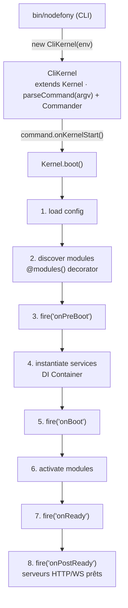

# Kernel — Boot, Modules, Lifecycle

> Le `Kernel` est l'orchestrateur central de Nodefony. Il instancie le container DI racine, charge les modules de l'application, déclenche les phases du boot, et expose un EventEmitter (`fire`/`fireAsync`) auquel toutes les briques se branchent.

## Vue d'ensemble



## Classes

| Classe | Fichier | Rôle |
|--------|---------|------|
| **`Kernel`** | `src/nodefony/src/kernel/Kernel.ts` | Kernel de base (extends `Service`) — boot/modules/events |
| **`CliKernel`** | `src/nodefony/src/kernel/CliKernel.ts` | Kernel spécialisé CLI — `setType("CLI" \| "SERVER")`, `setEnv()`, Commander |
| **`Module`** | `src/nodefony/src/kernel/Module.ts` | Classe de base d'un module Nodefony — hooks lifecycle, registration |
| **`@modules(...)`** | `src/nodefony/src/kernel/injector/decorators.ts` | Décorateur classe pour déclarer les modules à charger |

## Phases de boot — events firés

Le `Kernel` étend `Service` qui étend `Event` (EventEmitter). Les phases sont annoncées via `fire()` (sync) ou `fireAsync()` (async), permettant aux services/modules de s'y abonner via `kernel.once("onX", ...)` ou `kernel.on("onX", ...)`.

| Event | Quand | Use case typique |
|-------|-------|------------------|
| `onPreBoot` | Avant chargement modules | Pré-config, init logger, lecture env vars |
| `onCluster` | Si mode cluster détecté | Init cluster awareness (legacy PM2 — DEPRECATED) |
| `onRegister` | Phase d'enregistrement | Modules se déclarent au container DI |
| `onPreBoot` | Avant boot des services | Pré-allocation ressources |
| `onBoot` | Boot des services | Init connexions DB, certificates, etc. |
| `onReady` | Services bootés | Cross-wiring inter-services |
| `onPostReady` | Serveurs prêts à recevoir | Logs "Server Listen on ..." |
| `onTerminate` | Shutdown | Cleanup, close DB, save sessions |

```typescript
// Exemple : un service qui s'abonne au boot
class MyService extends Service {
  async initialize(kernel: IKernel): Promise<void> {
    kernel.once("onReady", async () => {
      this.log("Tous les services sont bootés, je peux cross-wire", "INFO");
      const db = kernel.get<Database>("database");
      await this.connectTo(db);
    });
  }
}
```

## Modules — pattern `@modules()`

```typescript
// index.ts (application racine)
import { Nodefony, modules } from "nodefony";
import { Http } from "@nodefony/http";
import { Framework } from "@nodefony/framework";
import { Security } from "@nodefony/security";
import { TestModule } from "./src/modules/test";

@modules([Http, Framework, Security, TestModule])
class App {}
```

Le décorateur `@modules()` stocke la liste via `Reflect.metadata`. Lors du boot, le Kernel itère, instancie chaque classe via le Container DI, et appelle leurs hooks lifecycle (`initialize()`, `boot()`, `ready()`).

## Pattern Module type

```typescript
// src/modules/test/index.ts
import { Module, Service } from "nodefony";

@Service({ singleton: true })
export class TestModule extends Module {
  static readonly path: string = import.meta.url;

  async initialize(): Promise<void> {
    this.log("TestModule init", "INFO");
    // Registration controllers, routes, services...
  }

  async boot(): Promise<void> {
    this.log("TestModule boot", "INFO");
  }

  async ready(): Promise<void> {
    this.log("TestModule ready — peut consommer les autres modules", "INFO");
  }
}
```

## CliKernel — spécificités

`CliKernel` est utilisé pour toutes les commandes CLI (`npx nodefony development`, `nodefony build`, `nodefony test`, etc.).

**Différences vs `Kernel`** :
- Possède un Commander.js sous-jacent pour le parsing argv
- Concept de `type: "CLI" | "SERVER"` — `"SERVER"` déclenche le démarrage des serveurs HTTP/WS via `@nodefony/http`
- `setEnv()` peut être appelé par sous-commande (chaque command sait son env cible)

**⚠️ Piège connu** (cf mémoire `project_clikernel_lifecycle`) : `new CliKernel()` est appelé avant `setEnv()`. Ne **jamais** conditionner dans le constructor sur `this.environment` — il est `undefined` à ce moment. Tout setup conditionnel doit être dans `onKernelStart()` (hook fire par chaque Command avant `generate()`).

## Lifecycle Command

Une commande CLI étend `Command` (cf `src/command/Command.ts`) :

```typescript
class Dev extends Command {
  constructor(cli: CliKernel) {
    super("development", "Démarre serveur dev", cli, { kernelEvent: "onPostReady" });
    this.alias("dev");
  }

  override async onKernelStart(): Promise<void> {
    (this.cli as CliKernel).setType("SERVER");
    this.cli.environment = "development";
  }

  override async generate(options: any): Promise<void | Kernel> {
    // Boot du kernel + démarrage serveurs
    return this.kernel as Kernel;
  }
}
```

**Hooks** :
- `onKernelStart()` — appelé AVANT `Kernel.boot()`. Config dynamique de l'env.
- `generate(options)` — appelé APRÈS la phase `kernelEvent` configurée (défaut `onPostReady`). Exécution principale.

## Commandes core listées

Cf `src/nodefony/src/kernel/commands/` :

| Command | Alias | Rôle |
|---------|-------|------|
| `Start` | — | Mode "boot puis interactive" |
| `Dev` | `dev` | Serveur dev avec watch Rollup |
| `Build` | — | Build tous workspaces |
| `Prod` | `prod` | Serveur production (PM2 deprecated, foreground recommandé) |
| `Staging` | — | Serveur staging |
| `Install` | — | npm install workspaces |
| `Outdated` | — | npm outdated |
| `Pm2` | — | 🪦 DEPRECATED — wrapper PM2 (retrait Phase 16) |
| `Kill` | — | Tue les process Nodefony actifs |

> Tests d'intégration des commandes : Phase 11 — **non finalisée**.

## Pattern type — instanciation et boot

```typescript
// bin/nodefony.ts (simplifié)
import { CliKernel } from "nodefony";

const kernel = new CliKernel();
kernel.addCommand(DevCommand);
kernel.addCommand(BuildCommand);
// ... autres

await kernel.parseCommand(process.argv);
// → matche la commande
// → command.onKernelStart()
// → kernel.boot()
// → command.generate()
```

## Internals — `kernel.fire()` vs `kernel.fireAsync()`

`fire(eventName, ...args)` = alias `emit()` synchrone (EventEmitter standard).
`fireAsync(eventName, ...args)` = parcourt les listeners séquentiellement avec `await` — utile pour des hooks pipeline où l'ordre + le résultat compte.

```typescript
// Synchrone (fire-and-forget)
kernel.fire("onBoot", payload);

// Asynchrone (attend que tous les handlers soient terminés)
await kernel.fireAsync("beforeResolve", context);
```

Le pipeline HTTP utilise massivement `fireAsync` : `onCreateContext`, `beforeResolve`, `afterAuth`, `onAuthFailure`, `onFinish`. Voir [`pipeline-http.md`](./pipeline-http.md) (à venir).

## Gotchas

| Symptôme | Cause | Fix |
|----------|-------|-----|
| `Cannot read 'environment' of undefined` au constructor | `CliKernel.environment` undefined avant `setEnv()` | Conditionner dans `onKernelStart()`, pas dans constructor |
| `fire()` sans listener — silencieux | EventEmitter standard, pas de warning | Confirmer le binding ailleurs avant `fire()` |
| Modules pas chargés | `@modules([...])` absent ou mal placé | Vérifier décorateur sur la classe racine de l'app |
| Boot bloqué sans erreur | Service qui ne resolve pas une Promise dans `boot()` | Toujours wrapper en try/catch et `throw` explicite |

## Liens

- **Code source** : `src/nodefony/src/kernel/Kernel.ts`, `CliKernel.ts`, `Module.ts`
- **Interfaces** : `src/nodefony/src/types/IKernel.ts`, `IModule.ts`
- **MEMORY.md** : `src/nodefony/src/kernel/MEMORY.md`
- **Container** : [`container.md`](./container.md)
- **Service** : [`service.md`](./service.md) (à venir)
- **Graphe symbolique** : `jq '.symbols.Kernel' .ai/symbols.json`
