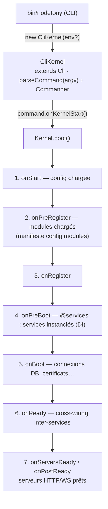

# Kernel — Boot, Modules, Lifecycle

> Le `Kernel` est l'orchestrateur central de Nodefony. Il instancie le Container DI racine, charge les modules déclarés dans le manifeste `config.modules`, déclenche les phases du boot, et expose un EventEmitter (`fire`/`fireAsync`) auquel toutes les briques se branchent.

## Vue d'ensemble



## Classes

| Classe          | Fichier                                | Rôle                                                      |
| --------------- | -------------------------------------- | --------------------------------------------------------- |
| **`Kernel`**    | `src/nodefony/src/kernel/Kernel.ts`    | Kernel de base (extends `Service`) — boot/modules/events  |
| **`CliKernel`** | `src/nodefony/src/kernel/CliKernel.ts` | Runner CLI — **extends `Cli`** (pas `Kernel`), Commander  |
| **`Module`**    | `src/nodefony/src/kernel/Module.ts`    | Unité fonctionnelle (extends `Service`) — hooks lifecycle |
| **`Command`**   | `src/nodefony/src/command/Command.ts`  | Base d'une commande CLI (`onKernelStart`, `generate`)     |

> ⚠️ `CliKernel` étend **`Cli`**, pas `Kernel`. Le `Kernel` est instancié séparément et linké à `CliKernel.kernel`.

## Phases de boot — events firés

Le `Kernel` étend `Service` → `Event` (EventEmitter). Les phases sont annoncées via `fire()` (sync) ou `fireAsync()` (séquentiel await). Les services/modules s'y abonnent (`kernel.once("onReady", …)`).

Le champ `progress` est un bitmask cumulatif (OR) des events franchis :

| Event            | Bit  | Quand                            | Use case typique                      |
| ---------------- | ---- | -------------------------------- | ------------------------------------- |
| `onInit`         | 1    | Kernel construit                 | —                                     |
| `onPreStart`     | 2    | Avant start                      | —                                     |
| `onStart`        | 4    | Config chargée                   | `runProfile` recopié                  |
| `onPreRegister`  | 8    | Avant enregistrement des modules | Dispatch des commandes de module      |
| `onRegister`     | 16   | Modules enregistrés              | Modules se déclarent au Container DI  |
| `onPreBoot`      | 32   | Avant boot des services          | `@services` instancie (DI + tri topo) |
| `onBoot`         | 64   | Boot des services                | Init connexions DB, certificats       |
| `onReady`        | 128  | Services bootés                  | Cross-wiring inter-services           |
| `onServersReady` | 256  | Serveurs montés                  | —                                     |
| `onPostReady`    | 512  | Serveurs prêts à recevoir        | Logs « Server Listen on … »           |
| `onTerminate`    | 1024 | Shutdown                         | Cleanup, close DB, save sessions      |

```typescript
// Un service qui s'abonne au boot
class MyService extends Service {
  async initialize(kernel: IKernel): Promise<void> {
    kernel.once("onReady", async () => {
      this.log("Tous les services sont bootés, je peux cross-wire", "INFO");
    });
  }
}
```

## Chargement des modules — manifeste `config.modules`

La liste des modules vit dans le **manifeste ordonné** `config.modules` (racine `nodefony.config.ts`, via `defineConfig` + `use()`), avec gating `policy`/`when`/env. Le Kernel la résout et charge les modules à `onPreRegister` (`resolveModules` / `loadModulesFromManifest`).

```typescript
// nodefony.config.ts (application)
import { defineConfig, use } from "nodefony";

export default defineConfig((ctx) => ({
  modules: [
    use(
      "@nodefony/http",
      { trustedHosts: ["localhost"] },
      { policy: "mandatory" },
    ),
    "@nodefony/framework",
    { name: "@nodefony/test", policy: "dev" },
  ],
}));
```

> Il n'y a **plus** de décorateur `@modules([...])` (retiré) : le chargement est piloté par la donnée (manifeste), pas par un décorateur de classe racine. Cf `project_module_loading_architecture` (mémoire IA) et [`configuration.md`](../../../docs/guides/configuration.md).

## Pattern Module

```typescript
import { Module, services } from "nodefony";

// `@services([...])` = le seul décorateur utile ici. Un Module est singleton par
// construction — `@Service({ singleton: true })` N'EXISTE PAS.
@services([MyService])
export class MyModule extends Module {
  static readonly path: string = import.meta.url; // OBLIGATOIRE — sert setPath()

  async onKernelRegister(): Promise<this> {
    this.log("Registering MyModule", "DEBUG");
    return this;
  }

  async onKernelBoot(): Promise<this> {
    this.log("Booting MyModule", "DEBUG");
    return this;
  }

  async onKernelReady(): Promise<this> {
    this.log("MyModule ready — peut consommer les autres modules", "INFO");
    return this;
  }
}
```

> ⚠️ Les hooks lifecycle (`onKernelRegister`/`onKernelBoot`/`onKernelReady`) **doivent** être des méthodes prototype — pas des arrow functions ni des property initializers : `super()` tourne AVANT les initializers, le hook serait perdu.

## CliKernel — spécificités

`CliKernel` porte toutes les commandes CLI (`npx nodefony development`, `nodefony build`, …).

**Construction** : `new CliKernel(environment?)` — `environment` peut être `undefined` au constructor.

> ⚠️ **Piège** (cf `project_clikernel_lifecycle`) : ne **jamais** conditionner sur `this.environment` dans le constructor (undefined à cet instant). Tout setup conditionnel va dans `onKernelStart()` (hook de commande, fire avant `Kernel.boot()`).

**Profil d'exécution** (`runProfile`) : `{ servers, lifetime, interactive }` (défaut console `{ false, "oneshot", false }`). `setRunProfile(...)` côté commande → recopié dans `kernel.runProfile` à `onStart`. `isConsole()` = `!runProfile.servers`. `lifetime: "longrunning"` fait parker le kernel (`Kernel.finishOrPark`) au lieu de terminer.

```typescript
class DevCommand extends Command {
  override async onKernelStart(): Promise<void> {
    (this.cli as CliKernel).setRunProfile({
      servers: true,
      lifetime: "longrunning",
      interactive: false,
    });
    this.cli.environment = "development"; // ← set ici, pas au constructor
  }
}
```

## Lifecycle Command

Une commande CLI étend `Command` :

```typescript
import Command, { OptionsCommandInterface } from "../../command/Command";

class MyCommand extends Command {
  constructor(cli: CliKernel) {
    super("mycommand", "Description", cli, { kernelEvent: "onPostReady" });
    this.alias("mc");
  }

  override async onKernelStart(): Promise<void> {
    this.cli.environment = "development"; // setup pré-boot
  }

  override async generate(options: any): Promise<void | Kernel> {
    // exécution principale — appelée APRÈS la phase kernelEvent
    return this.kernel as Kernel;
  }
}
```

- `onKernelStart()` — AVANT `Kernel.boot()` (config dynamique de l'env).
- `generate(options)` — APRÈS la phase `kernelEvent` configurée (défaut `onPostReady`).

## Commandes built-in

Source : `src/nodefony/src/kernel/commands/`.

| Command    | Alias  | Rôle                                                                   |
| ---------- | ------ | ---------------------------------------------------------------------- |
| `Start`    | —      | Boot puis interactif                                                   |
| `Dev`      | `dev`  | Serveur dev — auto-restart via `DevSupervisor` (watch sources backend) |
| `Build`    | —      | Build de tous les workspaces (turbo + rolldown)                        |
| `Prod`     | `prod` | Serveur production foreground cloud-native (topologie via `--workers`) |
| `Cluster`  | —      | Cluster multi-worker cgroup-aware (respawn backoff, graceful shutdown) |
| `Install`  | —      | `install` des workspaces                                               |
| `Outdated` | —      | `outdated` des workspaces                                              |
| `Status`   | —      | Introspection runtime (dev/prod/cluster + ports) — standalone          |
| `Stop`     | —      | Arrêt propre de tout runtime Nodefony (group-kill) — standalone        |

> Les commandes de module (`frontend:build`, `network`, …) sont posées par les modules à `onPreRegister` (`addCommand`) et dispatchées après le chargement des modules. Tests d'intégration CLI : Phase 11 (non finalisée).

## Internals — `fire()` vs `fireAsync()`

`fire(eventName, ...args)` = `emit()` synchrone (fire-and-forget). `fireAsync(eventName, ...args)` = parcourt les listeners séquentiellement avec `await` — pour les hooks où l'ordre et le résultat comptent.

```typescript
kernel.fire("onBoot", payload); // synchrone
await kernel.fireAsync("beforeResolve", ctx); // attend tous les handlers
```

Le pipeline HTTP utilise massivement `fireAsync` (`onCreateContext`, `beforeResolve`, `afterAuth`, `onAuthFailure`, `onFinish`).

## Gotchas

| Symptôme                                                | Cause                                                | Fix                                            |
| ------------------------------------------------------- | ---------------------------------------------------- | ---------------------------------------------- |
| `Cannot read 'environment' of undefined` au constructor | `CliKernel.environment` undefined avant `setEnv()`   | Conditionner dans `onKernelStart()`            |
| Hook lifecycle jamais appelé                            | Arrow function / property init au lieu de prototype  | Méthode prototype `async onKernelBoot() {}`    |
| Modules pas chargés                                     | Manifeste `config.modules` absent ou mal gaté        | Vérifier `nodefony.config.ts` (`use()`/policy) |
| Boot bloqué sans erreur                                 | Service qui ne resolve pas une Promise dans `boot()` | Wrapper try/catch + `throw` explicite          |

## Liens

- **Code source** : `src/nodefony/src/kernel/Kernel.ts`, `CliKernel.ts`, `Module.ts`
- **Interfaces** : `src/nodefony/src/types/IKernel.ts`
- **MEMORY.md** : `src/nodefony/src/kernel/MEMORY.md`
- **DI** : [`injection.md`](./injection.md)
- **Container** : [`container.md`](./container.md)
- **Chargement des modules** : `project_module_loading_architecture` (mémoire IA)
- **Graphe symbolique** : `jq '.symbols.Kernel' .ai/symbols.json`
