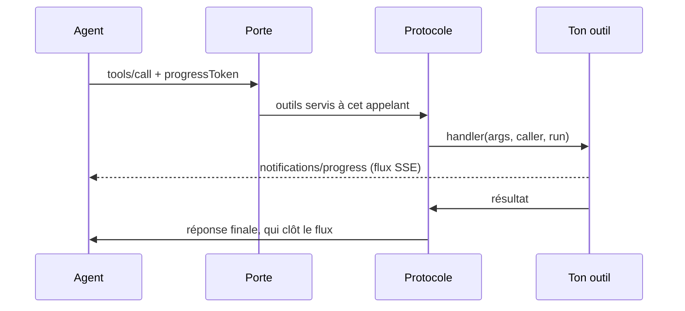

# Boîte à outils MCP — exposer les outils d'une application à un agent

> Un agent d'intelligence artificielle (Claude Code, Cursor, un agent maison) appelle les
> **outils** d'un logiciel par le _Model Context Protocol_. Cette boîte à outils fait de chaque
> module Nodefony un fournisseur d'outils : tu écris une fonction, elle décrit ce qu'elle rend, et
> le protocole — versions, erreurs, autorisation, progression, annulation — est tenu pour toi, une
> fois, selon la norme. Ancrée sur `src/nodefony/src/mcp/` et `src/nodefony/src/types/IMcpTool.ts`.

📍 [Documentation](../../../docs/index.md) › [Cœur — @nodefony/core](index.md) › **Boîte à outils MCP**

## 🗺️ Schéma général



Trois étages, trois responsabilités : le **protocole** (ce fichier le décrit), la **porte** (une
route HTTP qui le sert), les **outils** (ce que tes modules déclarent). Le protocole ne sait rien
du transport ; la porte ne sait rien des outils ; un outil ne sait rien des deux.

## 📖 Lexique

| Terme                    | Développé                           | En une ligne                                                                                               |
| ------------------------ | ----------------------------------- | ---------------------------------------------------------------------------------------------------------- |
| **MCP**                  | _Model Context Protocol_            | le protocole par lequel un agent découvre et appelle les outils d'un logiciel                              |
| **JSON-RPC**             | _JSON Remote Procedure Call_        | le format des messages : une requête `{ id, method, params }`, une réponse `{ id, result }` ou `{ error }` |
| **SSE**                  | _Server-Sent Events_                | une réponse HTTP qui reste ouverte et pousse des événements au fil de l'eau, dans un seul sens             |
| **Porte**                | —                                   | la route qui reçoit les messages MCP et les confie au protocole                                            |
| **Outil**                | _tool_                              | une capacité appelable par l'agent : un nom, une description, un schéma d'arguments, une fonction          |
| **Appelant**             | _caller_                            | ce que la porte a ÉTABLI de qui appelle : authentifié ou non, ses scopes, ses rôles                        |
| **Scope**                | —                                   | un droit porté par un jeton OAuth (`admin:read`) ; un outil peut en exiger                                 |
| **Jeton de progression** | `progressToken`                     | l'étiquette que l'agent pose sur sa requête pour recevoir des nouvelles en route                           |
| **Révision**             | _protocol version_                  | la version datée de la norme (`2026-07-28`) que client et serveur négocient                                |
| **RFC 9728**             | _OAuth Protected Resource Metadata_ | le document qui dit à un client quel serveur d'autorisation délivre les jetons de cette porte              |

## Qu'est-ce que MCP — et pourquoi un agent en a besoin

Un agent qui travaille sur ton application a deux façons de la connaître : **lire ses sources**, ou
**lui demander**. Lire les sources donne ce que le code _dit_ ; demander à l'application qui tourne
donne ce qu'elle _fait_ — les routes réellement montées, la configuration effective, la donnée en
base. Un guichet plutôt qu'un plan : le plan peut être périmé, le guichetier ne l'est jamais.

MCP standardise ce guichet. L'agent demande la liste des outils (`tools/list`), lit leur description
— c'est elle qui décide s'il s'en servira — puis en appelle un (`tools/call`) avec des arguments
conformes au schéma publié. La réponse est du contenu (souvent du texte), et un échec métier se dit
dans la réponse (`isError`) plutôt que par une erreur de protocole : « ta demande est recevable,
voici pourquoi elle n'aboutit pas » est une phrase que l'agent sait corriger seul.

## La vision Nodefony

- **Le protocole est une fonction pure.** `handleMcpMessage()` (`server.ts:330`) reçoit un message
  et rend un statut et un corps : ni socket, ni conteneur, ni horloge. Tout le protocole s'éprouve
  sans serveur, et une seconde porte (HTTP de production, `stdio`) appelle la même fonction.
- **Un outil est un objet ordinaire.** Le contrat `IMcpTool` (`IMcpTool.ts:157`) est le même pour
  les outils du framework et pour les tiens : le serveur n'a aucun cas particulier.
- **Rien n'est enregistré au démarrage.** La porte ramasse les outils à chaque requête
  (`collectMcpTools()`, `tools.ts:1295`) en parcourant les modules : un module ajouté ou rechargé
  apparaît sans cache à invalider. La révision `2026-07-28` a retiré les sessions, et c'est ce qui
  rend ce choix possible : chaque requête porte tout ce qu'il faut pour être servie.
- **L'autorisation se décide à la collecte, une fois.** Un outil réservé est absent de
  `tools/list` ET inappelable en le nommant ; le refus dit « outil inconnu », pas « interdit ».
- **Les règles de la norme vivent dans la boîte à outils, pas dans les outils.** Progression,
  annulation, forme des résultats selon la révision du client, refus normés : un outil n'écrit que
  sa logique, et ne peut pas enfreindre la norme par oubli.

## 🚀 Démarrage rapide

Un module d'application qui expose deux outils : une lecture courte, et une opération longue qui
signale son avancement et s'arrête si l'agent abandonne.

```ts
import { Kernel, Module, mcpText, type IMcpTool } from "nodefony";

/** Le module « shop » d'une application — il offre deux outils à l'agent. */
export class ShopModule extends Module {
  constructor(kernel: Kernel) {
    super("shop", kernel, import.meta.url, {});
  }

  /** Les outils MCP de ce module — relus à chaque requête de la porte. */
  getMcpTools(): IMcpTool[] {
    return [
      {
        name: "shop_stock",
        description:
          "Stock réel d'une référence produit, lu en base. À utiliser avant " +
          "de proposer une commande — la réponse ne vient pas d'un cache.",
        inputSchema: {
          type: "object",
          properties: { sku: { type: "string", description: "Référence" } },
          required: ["sku"],
        },
        handler: (args) => {
          const sku = typeof args.sku === "string" ? args.sku : "";
          if (sku === "") return mcpText("`sku` est requis", true);
          return mcpText({ sku, available: 12 });
        },
      },
      {
        name: "shop_reindex",
        description:
          "Réindexe le catalogue, lot par lot. Long : signale chaque lot, et " +
          "s'arrête proprement si l'appel est abandonné.",
        inputSchema: { type: "object", properties: {} },
        handler: async (_args, _caller, run) => {
          const lots = 5;
          for (let i = 1; i <= lots; i++) {
            if (run?.signal.aborted) return mcpText("interrompu", true);
            await new Promise((resolve) => setTimeout(resolve, 200));
            run?.progress(i, lots, `lot ${i}/${lots} réindexé`);
          }
          return mcpText(`${lots} lots réindexés`);
        },
      },
    ];
  }
}
```

Ce qu'on observe sur la porte de développement (`@nodefony/devkit`, `POST /nodefony/mcp`) — en
JSON pour la lecture courte, en flux pour l'outil long quand l'agent le demande :

```bash
# Lecture courte : une réponse JSON
curl -sk https://localhost:5152/nodefony/mcp -H 'content-type: application/json' \
  -d '{"jsonrpc":"2.0","id":1,"method":"tools/call","params":{"name":"shop_stock","arguments":{"sku":"A-12"}}}'

# Outil long : jeton de progression + flux accepté → notifications, puis la réponse qui clôt le flux
curl -skN https://localhost:5152/nodefony/mcp -H 'content-type: application/json' \
  -H 'accept: application/json, text/event-stream' \
  -d '{"jsonrpc":"2.0","id":2,"method":"tools/call","params":{"name":"shop_reindex","arguments":{},"_meta":{"progressToken":"r1"}}}'
# data: {"jsonrpc":"2.0","method":"notifications/progress","params":{"progressToken":"r1","progress":1,"total":5,"message":"lot 1/5 réindexé"}}
# …
# data: {"jsonrpc":"2.0","id":2,"result":{"content":[{"type":"text","text":"5 lots réindexés"}]}}
```

Interrompre le second `curl` (Ctrl+C) ferme le flux : `run.signal` est abattu, et l'outil rend la
main au lot suivant.

## ✍️ Écrire un outil

### Le contrat

| Champ          | Rôle                                                                                                          |
| -------------- | ------------------------------------------------------------------------------------------------------------- |
| `name`         | identifiant d'appel, forme `[a-zA-Z0-9_-]{1,64}` (`NAME_PATTERN`, `tools.ts:526`) ; préfixe-le par ton module |
| `description`  | **le premier critère de déclenchement** : ce que l'outil REND et QUAND s'en servir                            |
| `inputSchema`  | schéma JSON des arguments ; tout argument non déclaré est REFUSÉ, jamais ignoré                               |
| `scopes`       | scopes OAuth exigés — tous ; absent = outil public                                                            |
| `requiresAuth` | exige une identité prouvée, sans scope particulier                                                            |
| `handler`      | `(args, caller, run?) => IMcpToolResult` — synchrone ou promesse                                              |

Trois règles qui évitent les défauts les plus coûteux :

- **Un échec métier se rend en `isError`, jamais en exception.** `mcpText(message, true)`
  (`tools.ts:218`). Une exception devient une erreur de protocole (`-32603`), que l'agent lit comme
  « le serveur est cassé » au lieu de « corrige ta demande ». Elle est de plus **opaque** : l'agent
  ne reçoit qu'un message qui nomme l'outil, le message de l'exception part au journal du serveur
  (`ERROR`) — il pourrait porter un chemin ou un secret. `isError` est le seul canal qui parvient à
  l'agent.
- **Un argument non déclaré est refusé.** `unknownArguments()` (`tools.ts:1425`) rend un `isError`
  qui le nomme : un paramètre accepté puis jeté donnerait une réponse qui _a l'air_ d'avoir honoré la
  demande. Un outil qui veut des arguments libres l'écrit (`additionalProperties: true`).
- **Un outil n'invente rien.** Il appelle la brique qui répond déjà à une autre porte (un service,
  le plan d'administration) : un outil qui recalcule sa réponse finit par diverger de la commande
  du même nom.

Un outil écarté à la collecte — nom hors forme, nom déjà pris, handler absent, déclaration qui
lève — le dit en `WARNING` dans le journal du serveur ; les outils intégrés gagnent toute collision.

### Réserver un outil

```ts
const invoice: IMcpTool = {
  name: "shop_invoice",
  description: "Facture d'une commande du client authentifié.",
  inputSchema: { type: "object", properties: { id: { type: "string" } } },
  scopes: ["shop:billing"],
  handler: (args, caller) =>
    mcpText({ id: args.id, owner: caller.subject ?? null }),
};
```

`caller` (`IMcpCaller`, `IMcpTool.ts:45`) porte ce que la porte a **établi** — jamais ce que la
requête prétend : `authenticated`, `scopes`, `roles`, `subject`. Une porte qui n'authentifie personne
rend un appelant anonyme, et un outil à scopes n'y sort jamais : fermé par défaut.

### Un outil LONG — progression et annulation

Le troisième paramètre, `run` (`IMcpToolRun`, `IMcpTool.ts:83`), sert l'outil qui dure :

- **`run.signal`** est abattu quand l'agent abandonne l'appel. Le consulter entre deux étapes, ou le
  passer à ce qu'on attend (`fetch`, une requête de base) ;
- **`run.progress(progress, total?, message?)`** donne signe de vie. Il est sans effet quand
  l'agent n'en a pas demandé, quand la porte ne sait pas tenir de flux, ou une fois l'outil
  terminé : l'outil n'a jamais à s'en soucier.

`run` est optionnel pour l'appelant (un test qui appelle `handler(args, caller)` directement s'en
passe), d'où l'écriture `run?.progress(…)`.

Ce qu'il ne faut PAS chercher : le journal `notifications/message`. La révision `2026-07-28` le
déprécie (« New implementations SHOULD NOT adopt it ») ; ce qu'un outil veut dire en route passe
par le `message` de la progression, et ce qui doit atteindre le **modèle** va dans la réponse
finale — rien ne garantit qu'un client fasse entrer les notifications dans son contexte.

## 🚪 Monter une porte

La porte de développement est une route de `@nodefony/devkit` (`McpController.mcp()`,
`McpController.ts:180`). Toute autre porte — celle d'une application en production, un transport
`stdio` — suit le même gabarit, en quatre appels à la boîte à outils :

```ts
// 1. La garde de transport : un appel distant, ou une page web hors allowlist, est refusé.
const verdict = checkMcpAccess(
  { origin, remoteAddress },
  { allowedOrigins: [], allowRemote: false },
);
if (!verdict.allowed) return refuse(403);

// 2. Les outils servis à CET appelant — l'autorisation se décide ici, une fois.
const tools = collectMcpTools({
  builtins: [],
  deps,
  modules: kernel.modules,
  caller,
});

// 3. Le flux de réponse : la porte ne fournit que l'ouverture de SON flux.
const stream = createMcpResponseStream({
  signal: context.signal,
  open: clientAcceptsSse ? () => openEventStream() : undefined,
});

// 4. Le protocole, puis la réponse : en flux si quelque chose a été dit en route, sinon en objet.
const reply = await handleMcpMessage(body, {
  tools,
  caller,
  serverInfo,
  transport: stream.transport,
});
const sink = await stream.finish(reply.body);
return sink !== null ? sink.close() : respondJson(reply.status, reply.body);
```

- **`checkMcpAccess()`** (`guard.ts:76`) : un client MCP légitime est un _process_ et n'envoie
  aucun `Origin` ; une page web malveillante en pose toujours un. _Absent_ → on passe, _présent et
  hors allowlist_ → `403`. C'est ce qui referme le DNS rebinding contre un serveur local.
- **`createMcpResponseStream()`** (`stream.ts:63`) ouvre le flux au **premier** envoi seulement,
  enchaîne les envois dans l'ordre, et `finish()` écrit la réponse finale qui le clôt. Rien envoyé
  en route → `null`, la porte répond en JSON comme pour une lecture courte.
- **L'annulation** est le signal de la requête : sur le transport HTTP, fermer le flux de réponse
  EST l'annulation. Une porte Nodefony passe `context.signal`, que le noyau abat quand la réponse se
  ferme avant sa fin — aucun écouteur à ajouter.
- **Une porte protégée** dérive l'appelant d'un jeton OAuth (`authorizeProtectedResource()`,
  `protectedResource.ts:505`) et publie son document RFC 9728 ; les rôles viennent des scopes
  (`mcpCallerRoles()`, `caller.ts:59`), jamais d'une valeur par défaut.

## 📏 Normes appliquées — ce que la boîte à outils tient pour toi

Révision de référence : `2026-07-28` (`MCP_PROTOCOL_VERSION`, `protocol.ts:16`), servie avec les
révisions antérieures que les clients déployés emploient encore (`MCP_SUPPORTED_VERSIONS`,
`protocol.ts:50`).

| Exigence de la norme                                                          | Comment elle est tenue                                                                                    |
| ----------------------------------------------------------------------------- | --------------------------------------------------------------------------------------------------------- |
| une notification acceptée → `202` sans corps                                  | `handleMcpMessage()` rend `{ status: 202, body: null }`                                                   |
| l'`id` d'une requête est une chaîne ou un entier, jamais `null`               | refus `400` + `-32600` avant tout autre contrôle                                                          |
| `params` est un objet nommé                                                   | un tableau → `-32602`, une valeur primitive → `-32600`                                                    |
| en-tête `MCP-Protocol-Version` ≠ `_meta` → refus                              | `400` + `-32020` (`McpProtocolError`, `protocol.ts:122`) — deux sources de vérité pour une même requête   |
| révision inconnue → refus avec la liste servie                                | `400` + `-32022` et `supported` (`checkProtocolVersion()`, `server.ts:268`)                               |
| `initialize` répond la révision DEMANDÉE quand elle est servie                | `negotiateVersion()` (`server.ts:241`) — annoncer la sienne rendait la porte injoignable                  |
| ère moderne : `resultType` sur chaque résultat                                | `eraResult()` (`server.ts:159`) donne au résultat la forme de l'ère du CLIENT                             |
| méthode non implémentée → `404` + `-32601`                                    | cas par défaut du protocole                                                                               |
| progression : jeton fourni, valeur croissante, cadence bornée, arrêt à la fin | `createProgressReporter()` (`progress.ts:75`) ; arrêt dans le `finally` de `tools/call` (`server.ts:506`) |
| flux : notifications liées à la requête, réponse finale qui le termine        | `createMcpResponseStream()` (`stream.ts:63`)                                                              |
| sur HTTP, fermer le flux = annuler                                            | `run.signal` = le signal de la requête                                                                    |
| le catalogue peut varier selon l'autorisation, jamais selon la connexion      | collecte à chaque requête, sur les identifiants de CETTE requête                                          |

## 🚫 Ce qui n'est pas servi — et pourquoi

| Méthode / capacité                | Réponse                       | Raison                                                                                                                                                                  |
| --------------------------------- | ----------------------------- | ----------------------------------------------------------------------------------------------------------------------------------------------------------------------- |
| `subscriptions/listen`            | `404` + `-32601`, raison dite | le catalogue ne change qu'au rechargement de l'application, qui redémarre son process : le flux casserait au lieu de notifier ; le `tools/list` suivant est à jour      |
| `notifications/message` (journal) | jamais émis                   | déprécié par la révision `2026-07-28`                                                                                                                                   |
| `server/discover`                 | `-32601`                      | servi, il faisait basculer le client dominant sur un fil qu'il n'achève pas (aucun outil enregistré) ; le repli vers `initialize` que prévoit la norme, lui, fonctionne |
| `GET` / `DELETE` sur la porte     | `405` + `Allow: POST`         | flux autonome et fin de session, retirés par la révision `2026-07-28`                                                                                                   |

## 🔐 Sécurité

- **Fermé par défaut.** Appelant anonyme tant que la porte n'authentifie pas ; un outil qui exige
  quoi que ce soit n'est alors ni listé ni appelable.
- **Le catalogue ne se divulgue pas.** Un outil retenu répond « outil inconnu » ; l'annonce
  d'`initialize` dit seulement _combien_ d'outils sont réservés — de quoi faire demander un jeton à
  un agent, sans nommer ce qu'on protège.
- **Un outil lit ce que l'appelant peut lire.** Les outils d'administration intégrés exigent
  `admin:read` et rendent les réponses du plan d'administration, redaction des secrets comprise.
- **Avant d'exposer une donnée**, se demander si elle supporterait d'être lue par qui atteint la
  porte. En développement, la porte est bornée par sa garde de transport et par la politique
  `dev` de son module.

## ⚡ Performance & mémoire

- **Rien au démarrage, rien entre deux appels** : aucun registre, aucun cache, aucun état retenu.
- **Une lecture courte ne paie pas le flux** : il n'est ouvert qu'au premier envoi.
- **La progression ne réveille rien par défaut** : sans jeton ou sans flux, le rapporteur est un
  objet partagé qui ne fait rien ; avec, il coûte un appel d'horloge et se tait sous 100 ms
  d'intervalle (`MCP_PROGRESS_MIN_INTERVAL_MS`, `progress.ts:21`).
- **Aucun écouteur ajouté pour l'annulation** : le signal est celui du contexte, alloué à la
  première lecture et abattu par le noyau.

## ⚠️ Pièges

| Symptôme                                                    | Cause                                                                                         | Correction                                                                                  |
| ----------------------------------------------------------- | --------------------------------------------------------------------------------------------- | ------------------------------------------------------------------------------------------- |
| mon outil n'apparaît pas dans `tools/list`                  | il exige des scopes, et la porte n'authentifie pas — ou son nom est hors forme                | lire le journal : `WARNING` (écarté) ou `DEBUG` (retenu, avec la raison)                    |
| l'agent reçoit « outil inconnu » sur un outil existant      | même cause : un outil retenu est inconnu pour cet appelant, c'est voulu                       | présenter un jeton portant les scopes déclarés                                              |
| aucune notification de progression n'arrive                 | la requête ne porte pas `_meta.progressToken`, ou le client n'accepte pas `text/event-stream` | les deux sont nécessaires ; sans eux la réponse reste du JSON, c'est le comportement normal |
| la progression s'arrête alors que l'outil avance            | des valeurs qui ne croissent pas, ou plus d'une par 100 ms                                    | passer une valeur strictement croissante ; regrouper les étapes rapprochées                 |
| un argument passé « ne fait rien »                          | il n'est pas déclaré dans `inputSchema` — l'appel est refusé en `isError`                     | le déclarer, ou `additionalProperties: true` si l'outil prend des arguments libres          |
| un échec métier apparaît comme une panne serveur (`-32603`) | le handler a levé une exception                                                               | rendre `mcpText(message, true)`                                                             |
| l'outil continue de tourner après l'abandon de l'agent      | il ne consulte pas `run.signal`                                                               | le tester entre deux étapes, ou le passer aux appels qui l'acceptent                        |

## 🧪 Tests & couverture

**171 cas sur 5 fichiers**, dont 27 tests d'attaque :

- `src/nodefony/src/tests/mcp.test.ts` (95) — le protocole entier en fonctions pures : refus
  normés, négociation de révision, forme des résultats par ère, collecte et rétention, arguments
  non déclarés, collisions de noms ;
- `src/nodefony/src/tests/mcpProgress.test.ts` (12) — jeton, croissance, cadence, arrêt après la
  réponse (y compris quand l'outil lève), signal transmis, refus de `subscriptions/listen` ;
- `src/nodefony/src/tests/mcpStream.test.ts` (7) — ouverture au premier envoi, ordre, réponse
  finale, flux fermé par le client, ouverture en échec qui retombe sur une réponse en objet ;
- `src/nodefony/src/tests/mcpAdminPlane.attack.test.ts` (27) — les outils d'administration face à
  un appelant sans droits ;
- `src/packages/@nodefony/devkit/tests/mcp-http.test.ts` (30) — la porte sur un serveur réel :
  route montée, garde `Origin`, statuts traversant le contrôleur, outils d'un module de
  l'application, flux SSE et annulation par fermeture.

Chaque garde de la progression et du flux a été vue échouer en la débranchant. Ce qui **n'est pas
couvert** : aucun banc de charge dédié à la porte, et aucun test du flux derrière un proxy inverse
(la tenue d'un flux SSE par un proxy est traitée dans [Server-Sent Events](../../packages/@nodefony/http/docs/sse.md)).
Couverture : `npm run coverage` dans `src/nodefony`.

## 🔗 Pour aller plus loin

- ⬆️ **Retour au hub** : [@nodefony/core — vue d'ensemble](index.md) · [Toute la documentation](../../../docs/index.md)
- La porte de développement, ses outils intégrés et son autorisation OAuth →
  [devkit](../../packages/@nodefony/devkit/docs/index.md)
- Le flux d'événements serveur sur lequel la porte répond → [Server-Sent Events](../../packages/@nodefony/http/docs/sse.md)
- Le contexte de requête, dont le signal sert l'annulation → [Contexte de requête](request-context.md)
- La norme, hors ligne : skill `nodefony-rfc` (`references/mcp-2026-07-28/`)
