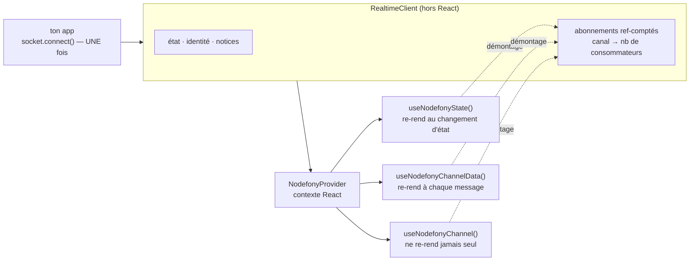
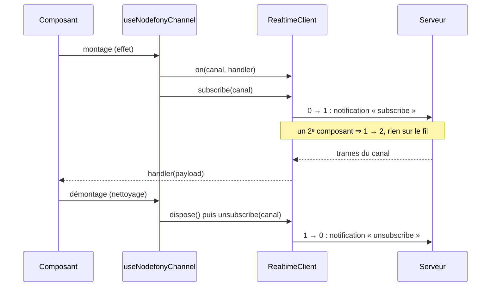

# Hooks React — `nodefony/react`

> Le subpath `nodefony/react` branche un composant React sur la socket Nodefony **sans une ligne de
> glue** : un fournisseur au-dessus de l'arbre, puis des hooks ciblés qui s'abonnent au montage et se
> débranchent au démontage. Ils ne gèrent **que** l'abonnement — ouvrir et maintenir la connexion
> reste le travail du client, décrit dans [Client isomorphe](client.md). Ancré sur
> `src/nodefony/src/client/react/index.ts`.

📍 [Documentation](../../../docs/index.md) › [Cœur — @nodefony/core](index.md) › **Hooks React**

## 🧠 Le modèle mental — une prise, N composants branchés dessus

Un composant React vit et meurt au gré de la navigation. Une socket, elle, doit rester ouverte. Le
binding tient les deux bouts : **le fil est unique et long**, **les branchements sont nombreux et
courts**.



Trois idées portent toute la page :

1. **Les hooks s'abonnent, ils ne connectent pas.** `socket.connect()` est appelé une fois par l'app ;
   monter ou démonter un écran ne ferme jamais la socket.
2. **Le comptage de références vit dans le client, pas dans React.** Dix composants sur le même canal
   = **un** `subscribe` sur le fil ; le `unsubscribe` part au dernier qui se démonte.
3. **Un hook = une responsabilité.** Il n'y a pas de god-hook qui re-rend tout l'écran à chaque
   message : on compose exactement ce que la vue affiche.

## 📖 Lexique

| Terme                      | Sens                                                                                                                                 |
| -------------------------- | ------------------------------------------------------------------------------------------------------------------------------------ |
| **Binding**                | La fine couche qui adapte une brique agnostique (ici la socket) à un framework d'interface (ici React).                              |
| **Fournisseur** (provider) | Composant qui met une valeur à disposition de tout son sous-arbre via le contexte React.                                             |
| **Canal** (channel)        | Sous-flux nommé de la socket (`"chat:general"`). Voir [vocabulaire realtime](../../packages/@nodefony/realtime/docs/vocabulaire.md). |
| **Abonnement ref-compté**  | Un compteur par canal : le message réseau ne part qu'aux transitions 0↔1.                                                            |
| **Snapshot**               | Valeur lue à un instant donné par `useSyncExternalStore` pour décider s'il faut re-rendre.                                           |
| **Tearing**                | Deux parties d'un même rendu affichant deux versions d'une donnée qui a changé en cours de route.                                    |
| **StrictMode**             | Mode de développement de React qui monte, démonte, puis remonte chaque composant pour révéler les fuites.                            |
| **Mémoïsation**            | Garder la même référence entre deux rendus (`useMemo`, `useCallback`) pour éviter un travail répété.                                 |
| **Cadence**                | Fréquence d'un canal d'état, portée par son **nom** (`nodefony:orm:health:2000` = toutes les 2 s).                                   |
| **AIMD**                   | _Additive Increase, Multiplicative Decrease_ — on ralentit vite sous pression, on réaccélère lentement.                              |
| **Latest-wins**            | Canal où seule la dernière valeur compte : en décimer est sans perte (supervision, stats).                                           |
| **Coalescence**            | Regrouper N événements en une seule trame — le journal arrive par lots, pas ligne à ligne.                                           |
| **Notice**                 | Événement normalisé destiné à l'utilisateur (perte de connexion, refus, rétablissement).                                             |
| **Welcome**                | Première trame poussée par le serveur après la poignée de main ; elle annonce l'identité de la connexion.                            |
| **Identité**               | Ce que le serveur dit de cette connexion : authentifiée ou non, rôles, scopes.                                                       |
| **Subpath**                | Point d'entrée secondaire d'un paquet npm (`nodefony/react`), déclaré dans le champ `exports`.                                       |
| **Condition d'export**     | Variante d'un subpath choisie selon l'environnement (`browser`, `import`) — décide quels types sont lus.                             |

## Qu'est-ce qu'un binding React — et pourquoi pas un simple `useEffect`

Brancher une socket sur React « à la main » tient en dix lignes… qu'on réécrit dans chaque composant,
et qui contiennent toutes le même bug. Trois pièges reviennent systématiquement.

- **Le désabonnement qui coupe le voisin.** Deux composants écoutent `"metrics"` ; le premier se
  démonte, envoie `unsubscribe`, et le second cesse silencieusement de recevoir.
- **Le ré-abonnement en boucle.** Le handler est recréé à chaque rendu, il entre dans les dépendances
  de l'effet, l'effet se rejoue, l'abonnement se refait — à chaque frappe au clavier.
- **La fuite au démontage.** L'écouteur reste attaché à un composant mort, qui continue d'appeler
  `setState` et de retenir tout son arbre en mémoire.

Le binding existe pour que ces trois cas soient traités **une fois**, au bon endroit, et prouvés.

## La vision Nodefony

Le parti pris est de mettre l'intelligence **sous** React, pas dedans. Le comptage de références et
le ré-abonnement après coupure vivent dans `RealtimeClient.subscribe()`
(`client/realtime/RealtimeClient.ts:162`) et `RealtimeClient.unsubscribe()`
(`client/realtime/RealtimeClient.ts:543`), au-dessus d'une carte `_subscriptions`
(`client/realtime/RealtimeClient.ts:196`).

Conséquence directe : cette autorité est **partagée**. Les hooks et un store applicatif (MobX, Zustand,
Redux) peuvent tenir le même canal sans se marcher dessus — chacun compte pour un.

Le binding lui-même reste volontairement pauvre. Il ne fait que trois choses :

1. **Publier le client** dans le contexte React — `NodefonyProvider` (`client/react/index.ts:116`)
   au-dessus d'un `NodefonyContext` (`client/react/index.ts:77`).
2. **Capturer les handlers par référence** — `handlerRef` (`client/react/index.ts:126`) : un handler
   redéfini à chaque rendu ne re-déclenche jamais l'abonnement, donc **aucun `useCallback` requis**.
3. **Lire l'état sans tearing** — `useNodefonyState()` (`client/react/index.ts:149`) passe par
   `useSyncExternalStore`, qui garantit une valeur cohérente en rendu concurrent.

Le fichier n'écrit **aucun JSX** : le fournisseur est construit par `createElement`. C'est ce qui
permet au cœur `nodefony` d'être bâti sans transformation JSX, tout en livrant des hooks React.

Le compromis assumé : **les hooks ne pilotent pas la connexion**. Ils n'appellent ni `connect()` ni
`disconnect()`. Un écran ne peut donc pas couper le temps réel du reste de l'application. C'est le
**fournisseur** qui ouvre la connexion, une fois, quand tu lui donnes une adresse.

## 🚀 Démarrage rapide

### 1. Le fournisseur, au-dessus de l'arbre

Donne-lui l'adresse du serveur temps réel : il fabrique la socket et la connecte.

```tsx ignore
// frontend/src/main.tsx
import { createRoot } from "react-dom/client";
import { NodefonyProvider } from "nodefony/react";
import { Shell } from "./Shell";

createRoot(document.getElementById("root")!).render(
  <NodefonyProvider url="/api/live/realtime">
    <Shell />
  </NodefonyProvider>,
);
```

C'est tout le câblage : **deux concepts**, ce fournisseur et un hook. L'URL est relative, donc
résolue contre la page — `ws://` en http, `wss://` en https. Une application générée par
`nodefony create app` monte `/api/live/realtime` ; la console d'administration,
`/nodefony/studio/api/realtime`.

> [!IMPORTANT]
> **Il n'y a pas d'adresse par défaut.** Sans `url` ni `client`, le client refuse de démarrer avec
> un message qui nomme la route attendue. C'est délibéré : la route dépend de ton application, pas
> du framework, et une adresse devinée donnait une socket qui ne se connecte jamais et se contente
> de retenter — sans un mot.

Deux fournisseurs qui reçoivent la **même URL** partagent la **même socket** : une seule connexion
WebSocket pour toute la page, quel que soit le nombre d'écrans montés.

### 2. Quand l'application possède son cycle de connexion

Passe `client` au lieu de `url`. Le fournisseur ne touche alors ni à `connect()` ni à
`disconnect()` : c'est toi qui décides. C'est le cas de la console d'administration, qui
re-négocie sa socket à chaque changement d'identité (anti-élévation de privilège).

```ts
// frontend/src/realtime.ts — LA socket de l'application.
import { RealtimeClient } from "nodefony/client";

// `shared` réutilise l'instance existante pour une même URL : le shell, un widget
// et la barre de debug ouvrent UNE socket, pas trois.
export const socket = RealtimeClient.shared({
  url: "/api/live/realtime", // relative → ws:// ou wss:// selon la page
  autoReconnect: true,
});

/** À appeler une seule fois, au démarrage de l'app. */
export async function startRealtime(): Promise<void> {
  await socket.connect();
}
```

```tsx ignore
// frontend/src/main.tsx
import { NodefonyProvider } from "nodefony/react";
import { socket, startRealtime } from "./realtime";

void startRealtime(); // la connexion s'ouvre ici, et nulle part ailleurs

createRoot(document.getElementById("root")!).render(
  <NodefonyProvider client={socket}>
    <Shell />
  </NodefonyProvider>,
);
```

> [!IMPORTANT]
> Importe `RealtimeClient` depuis **`nodefony/client`**, pas depuis `"nodefony"`. Le point d'entrée
> racine n'expose le client qu'à travers la condition d'export `browser` : sans
> `customConditions: ["browser"]` dans le `tsconfig.json`, TypeScript lit les types serveur et
> répond `has no exported member 'RealtimeClient'`. Le subpath `nodefony/client`, lui, résout
> partout.

### 3. Un hook métier, bâti sur les hooks Nodefony

C'est la forme recommandée : les hooks Nodefony restent bas niveau, ton hook porte le vocabulaire de
ton domaine.

```ts
// frontend/src/useRoomPresence.ts
import { useNodefonyChannelData, useNodefonyState } from "nodefony/react";

export interface Presence {
  online: number;
  typing: string[];
}

/** Présence d'un salon : `null` tant qu'aucune trame n'est arrivée. */
export function useRoomPresence(room: string): {
  presence: Presence | null;
  live: boolean;
} {
  const live = useNodefonyState() === "connected";
  // Le nom du canal dépend de `room` → l'abonnement suit le changement de salon.
  const presence = useNodefonyChannelData<Presence>(`chat:${room}:presence`);
  return { presence, live };
}
```

### 4. L'écran qui consomme

```tsx ignore
// frontend/src/RoomHeader.tsx
import { useRoomPresence } from "./useRoomPresence";

export function RoomHeader({ room }: { room: string }) {
  const { presence, live } = useRoomPresence(room);

  if (!live) return <p>Temps réel indisponible…</p>;
  if (!presence) return <p>Connexion au salon…</p>;
  return <p>{presence.online} personnes en ligne</p>;
}
```

### Ce qu'on observe

Sur le fil, un montage produit exactement deux échanges — l'accueil, puis la demande d'abonnement :

```text
← {"jsonrpc":"2.0","method":"realtime:welcome","params":{"identity":{"authenticated":false,…}}}
→ {"jsonrpc":"2.0","method":"subscribe","params":{"channel":"chat:general:presence"}}
← {"jsonrpc":"2.0","method":"chat:general:presence","params":{"online":3,"typing":[]}}
```

Au démontage du **dernier** consommateur du canal, et seulement à ce moment :

```text
→ {"jsonrpc":"2.0","method":"unsubscribe","params":{"channel":"chat:general:presence"}}
```

Ces trames se lisent en direct dans la console temps réel de Studio (`/nodefony/hub`).

## 🧰 Les hooks

Onze hooks et un fournisseur. La colonne **re-rend quand** est celle qui compte : c'est elle qui
décide du coût de ton écran.

| Hook                                  | Rend                       | Re-rend quand                                 | Ancre                       |
| ------------------------------------- | -------------------------- | --------------------------------------------- | --------------------------- |
| `NodefonyProvider`                    | le sous-arbre              | quand `client` change                         | `client/react/index.ts:50`  |
| `useNodefony()`                       | le client                  | **jamais** (référence stable)                 | `client/react/index.ts:67`  |
| `useNodefonyState()`                  | l'état de connexion        | à chaque changement d'état                    | `client/react/index.ts:149` |
| `useNodefonyIdentity()`               | l'identité, ou `null`      | à l'accueil et au logout                      | `client/react/index.ts:166` |
| `useNodefonyChannel()`                | rien                       | **jamais** — ton handler décide               | `client/react/index.ts:182` |
| `useNodefonyChannelData<T>()`         | la dernière valeur         | à chaque message du canal                     | `client/react/index.ts:210` |
| `useNodefonyAdaptiveChannel()`        | la cadence effective (ms)  | à chaque changement de cadence                | `client/react/index.ts:244` |
| `useNodefonyAdaptiveChannelData<T>()` | `{ data, intervalMs }`     | à chaque message **ou** changement de cadence | `client/react/index.ts:221` |
| `useNodefonyChannelStats()`           | débit, série, total        | ⚠️ une seule fois — voir Pièges               | `client/react/index.ts:315` |
| `useNodefonySyslog()`                 | un tampon de lignes de log | à chaque lot retenu par le filtre             | `client/react/index.ts:373` |
| `useNodefonyNotifications()`          | rien                       | **jamais** — ton handler décide               | `client/react/index.ts:382` |
| `useNodefonyNoticeLog()`              | un tampon de notices       | à chaque notice retenue                       | `client/react/index.ts:407` |

### `NodefonyProvider` — publier le client dans l'arbre

Le seul composant du subpath. Il prend l'instance créée par ton app et la met à disposition de tout
son sous-arbre. Tous les hooks ci-dessous **lèvent** s'ils sont montés en dehors
(`client/react/index.ts:69`) — un oubli se voit immédiatement, il ne se traduit pas par un écran vide.

À monter une seule fois, aussi haut que possible. Un second fournisseur imbriqué avec un autre client
est possible (deux endpoints distincts), mais chaque sous-arbre ne voit alors que le sien.

### `useNodefony()` — l'échappatoire

Rend le client brut, pour tout ce que les hooks ne couvrent pas : un appel aller-retour
(`socket.request(…)`), une publication, un flux de réponse. La référence est **stable** — l'utiliser
n'ajoute aucun rendu.

```tsx
const socket = useNodefony();
const ask = () => void socket.request("chat:ask", { prompt });
```

### `useNodefonyState()` — l'état de la connexion

Rend `"disconnected" | "connecting" | "connected" | "reconnecting" | "error"`. Lu via
`useSyncExternalStore`, donc **sans tearing** en rendu concurrent : le snapshot est une chaîne, la
comparaison est exacte.

Le re-rendu suit `RealtimeClient.setState()` (`client/realtime/RealtimeClient.ts:162`), qui
court-circuite si l'état est inchangé — un état stable ne coûte rien, même sous un flux dense.

C'est le hook des badges de connexion et des écrans dégradés (« temps réel indisponible »).

### `useNodefonyIdentity()` — qui est cette connexion

Rend l'identité **annoncée par le serveur** dans la trame d'accueil : `authenticated`,
`userIdentifier`, `roles`, `scopes` (`RealtimeEventMap.ts:185`). `null` tant qu'aucun accueil n'a été
reçu ; une fois reçu, un visiteur anonyme vaut `authenticated: false` — jamais `null`.

Elle est rafraîchie à chaque (re)connexion par `ingestWelcome()`
(`client/realtime/RealtimeClient.ts:1022`) et remise à `null` au `disconnect()` volontaire.

L'intérêt pratique : basculer anonyme ↔ authentifié **sans appeler la moindre route** `/auth/me`. La
socket porte déjà l'information.

> [!WARNING]
> Une perte réseau **conserve** la dernière identité jusqu'au prochain accueil. C'est délibéré : sans
> ça, chaque micro-reconnexion ferait clignoter un écran de connexion. Ne déduis donc pas « déconnecté
> de la session » d'une identité présente — croise avec `useNodefonyState()`.

### `useNodefonyChannel()` — écouter un canal

Le primitif : il s'abonne, appelle ton `onMessage` à chaque trame, se désabonne au démontage. Il ne
rend **rien** et ne provoque **aucun** rendu par lui-même.

```tsx
useNodefonyChannel("orders:new", (payload) => {
  playSound();
  queue.push(payload);
});
```

Deux propriétés à connaître :

- **Le handler n'a pas besoin d'être mémoïsé** : il est capturé par référence à chaque rendu
  (`client/react/index.ts:126`). Le passer en fonction fléchée inline est le bon usage.
- **`deps` est réservé au nom du canal.** Le troisième argument est concaténé aux dépendances de
  l'effet (`client/react/index.ts:185`) : n'y mets que ce qui doit provoquer un **ré-abonnement**.

### `useNodefonyChannelData<T>()` — la dernière valeur

Le cas le plus courant, et la surcouche la plus mince : garder la dernière valeur reçue dans un état
local. `null` tant que rien n'est arrivé, sauf si tu fournis une valeur initiale (utilisée au premier
rendu seulement).

```tsx
const stats = useNodefonyChannelData<Stats>("nodefony:dashboard");
if (!stats) return <p>en attente…</p>;
```

Le composant se re-rend à **chaque** trame. Sur un canal rapide, préfère la variante adaptative
ci-dessous, ou remonte le hook dans un composant parent minuscule.

### `useNodefonyAdaptiveChannel()` — la cadence qui s'ajuste toute seule

Même contrat que `useNodefonyChannel()`, mais la cadence du canal est pilotée par un régulateur
**client** (`bindAdaptiveChannel()`, `client/realtime/AdaptiveRate.ts:239`). Si les trames arrivent
plus lentement que demandé, la lib se ré-abonne à une cadence plus grossière ; quand le flux
redevient sain, elle réaccélère par paliers.

Le hook **rend la cadence effective en millisecondes** — exactement ce qu'il faut pour l'afficher en
badge (« mise à jour toutes les 2 s »).

```tsx
const intervalMs = useNodefonyAdaptiveChannel(
  "nodefony:orm:health",
  (payload) => setHealth(payload as Health),
  1000, // cadence désirée, la plus fine
);
```

Réglages disponibles (quatrième argument, dérivés de `AdaptiveRateOptions`,
`client/realtime/AdaptiveRate.ts:49`) :

| Réglage            | Défaut  | Effet                                                                  |
| ------------------ | ------- | ---------------------------------------------------------------------- |
| `enabled`          | `true`  | `false` = cadence fixe, aucun régulateur, aucun ré-abonnement          |
| `ladder`           | ×2      | Échelle de cadences ; dérivée en doublant jusqu'à `maxMs`              |
| `maxMs`            | `60000` | Plafond de l'échelle dérivée                                           |
| `starvationFactor` | `1.8`   | Au-delà de ce multiple de la cadence, on considère qu'on est en famine |
| `healthyFactor`    | `1.25`  | En deçà, l'échantillon compte comme sain                               |
| `recoveryWindow`   | `4`     | Nombre d'échantillons sains consécutifs avant de réaccélérer           |

> [!CAUTION]
> Réservé aux canaux d'**état** (latest-wins : supervision, métriques). Sur un canal d'**événements**
> — journal, messages de chat, trames de protocole — ralentir la cadence **perd** des éléments. Ces
> canaux se regroupent côté serveur, ils ne se décimen't pas.

### `useNodefonyAdaptiveChannelData<T>()` — dernière valeur **et** cadence

La composition des deux précédents : `{ data, intervalMs }`. C'est le primitif des tuiles de
supervision — une valeur à afficher, une cadence à annoncer.

```tsx
const { data, intervalMs } = useNodefonyAdaptiveChannelData<Health>(
  "nodefony:orm:health",
  2000,
);
```

### `useNodefonyChannelStats()` — débit et série d'un canal

Rend `{ msgCount, lastMessage, rate, series }` pour un canal, calculé par le client à partir des
trames reçues (`getChannelStats()`, `client/realtime/RealtimeClient.ts:975`). La série glisse sur 32
points — `STATS_SERIES_POINTS` (`client/realtime/RealtimeClient.ts:131`) —, échantillonnés une fois par seconde par
`startStatsSampler()` (`client/realtime/RealtimeClient.ts:1139`).

> [!WARNING]
> Ce hook ne se rafraîchit **pas** tout seul après sa première valeur. Le client réutilise le même
> objet de statistiques et le mute en place (`trackFrame()`, `client/realtime/RealtimeClient.ts:982`) :
> l'état React reçoit une référence identique, et React court-circuite le rendu. La valeur affichée
> n'est correcte que si le composant se re-rend pour une autre raison. Pour un VU-mètre fiable,
> compte toi-même sur `useNodefonyChannel()`.

### `useNodefonySyslog()` — le flux de journal

Un tampon borné des lignes de journal poussées par le serveur. Il comprend les deux formes du canal :
le lot groupé `{ logs, dropped }` — c'est la forme normale, produite par `createSyslogBridge()`
(`realtime/providers.ts:145`) — et l'entrée isolée.

| Option       | Défaut              | Effet                                                         |
| ------------ | ------------------- | ------------------------------------------------------------- |
| `max`        | `500`               | Taille du tampon ; au-delà, les plus anciennes lignes sortent |
| `severities` | toutes              | Ne conserver que ces sévérités                                |
| `channel`    | `"nodefony:syslog"` | Canal source                                                  |

Le tableau `severities` n'a pas besoin d'être mémoïsé : la dépendance de l'effet est la **chaîne**
jointe (`sevKey`, `client/react/index.ts:376`), pas le tableau.

> [!CAUTION]
> Le filtre compare la valeur du champ `severity` de chaque entrée aux chaînes fournies
> (`client/react/index.ts:358`). Or une entrée de journal Nodefony porte sa sévérité **numérique**
> dans `severity` et son nom dans `severityName` (`Pdu.ts:137`) : filtrer sur `["ERROR"]` ne retient
> donc rien du flux standard. Filtre côté rendu tant que ce n'est pas aligné, ou lis
> [Journalisation](syslog.md) pour la forme exacte d'une entrée.

### `useNodefonyNotifications()` — les notices, une seule fois

S'abonne aux **notices normalisées** du client : fermeture anormale de la socket (code RFC 6455
interprété par `closeCodeToNotice()`, `client/realtime/notice.ts:67`), erreur serveur poussée,
rétablissement de la connexion, refus de canal. Chaque notice porte `level`, `message`, `source` et
un horodatage (`NodefonyNotice`, `client/realtime/notice.ts:20`).

```tsx
// Dans le shell de l'app, UNE fois — sinon chaque incident lève N toasts.
useNodefonyNotifications((notice) =>
  toast({ type: notice.level, message: notice.message }),
);
```

Le handler est capturé par référence, comme partout : pas de `useCallback`.

### `useNodefonyNoticeLog()` — l'historique des incidents

Le pendant persistant du précédent : un tampon borné (50 par défaut) des dernières notices,
filtrable par source (`"realtime" | "api" | "server"`). Utile pour un panneau « incidents » à côté
des toasts, qui eux disparaissent.

Comme pour le journal, la liste `sources` n'a pas besoin d'être mémoïsée (`srcKey`,
`client/react/index.ts:399`).

### Fabriquer un nom de canal cadencé

Le subpath réexporte la convention de nommage partagée avec le serveur
(`client/react/index.ts:31`) — pas un hook, mais utile au même endroit :

| Fonction                           | Ancre                        | Rôle                                                             |
| ---------------------------------- | ---------------------------- | ---------------------------------------------------------------- |
| `rateChannel(base, ms?)`           | `realtime/channelRate.ts:44` | Construit `base:<ms>`, ou `base` nu si la cadence vaut le défaut |
| `parseRate(channel, base, bounds)` | `realtime/channelRate.ts:63` | Extrait et **borne** la cadence — usage serveur                  |
| `isRateChannel(channel, base)`     | `realtime/channelRate.ts:75` | Teste si un canal est une variante cadencée d'une base           |

Le point important : **un canal = une cadence = un compteur de références**. `nodefony:orm:health:2000` et
`nodefony:orm:health:5000` sont deux flux distincts, jamais réconciliés.

## 🏗️ Cycle de vie d'un abonnement

### Le trajet complet, du montage au démontage



Le nettoyage retire **d'abord** le handler, **puis** décrémente le compteur
(`client/react/index.ts:134`). L'ordre importe : un message en vol ne peut plus atteindre un composant
démonté.

### Ce qui survit à une coupure

Après une perte de connexion, le client se reconnecte avec un délai croissant et **rejoue tous les
abonnements encore comptés** (`client/realtime/RealtimeClient.ts:1007`). Un composant monté avant la
coupure retrouve son flux sans une ligne de code — et sans même savoir qu'il y a eu coupure.

Corollaire utile : s'abonner **avant** que la socket ne soit ouverte est sûr. Le compteur est posé,
la notification partira à l'ouverture.

Le détail de la boucle de reconnexion, des codes de fermeture définitifs et du battement de cœur vit
dans [Client isomorphe](client.md) — pas ici.

### Le double montage de StrictMode

En développement, React monte, démonte, puis remonte chaque composant. Le binding **n'a aucun
traitement particulier** pour ce cas : il est simplement symétrique.

| Étape                | Compteur | Sur le fil    |
| -------------------- | -------- | ------------- |
| 1ᵉʳ montage          | 0 → 1    | `subscribe`   |
| Démontage StrictMode | 1 → 0    | `unsubscribe` |
| Remontage            | 0 → 1    | `subscribe`   |

À retenir :

- **Aucune fuite** — le compteur revient exactement à sa valeur, l'écouteur est retiré.
- **Un aller-retour visible** sur le fil, uniquement en développement. Il disparaît en production, où
  React ne double pas le montage.
- **Si un autre consommateur tient déjà le canal** (un store, un autre écran), le compteur ne
  redescend jamais à zéro : rien du tout ne passe sur le fil.
- **L'état local repart de zéro** : un `useNodefonyChannelData` réaffiche `null` jusqu'à la trame
  suivante. Sur un canal lent, l'écran semble « vide » plus longtemps en développement qu'en
  production.

## ⚡ Temps réel « calme » — ne pas faire clignoter l'écran

Un flux temps réel naïf produit un écran qui tremble : chiffres qui sautent, listes qui se
réordonnent, texte illisible. La responsabilité est **partagée** entre la lib et ton composant.

### Ce que les hooks font pour toi

- **La cadence s'adapte à la charge.** Le régulateur AIMD ralentit le canal sous pression et
  réaccélère par paliers, avec une bande morte qui empêche l'oscillation
  (`client/realtime/AdaptiveRate.ts:239`).
- **Le journal arrive par lots, pas ligne à ligne.** Le pont serveur regroupe les entrées d'une
  fenêtre en une seule trame et compte les omissions — `createSyslogBridge()`
  (`realtime/providers.ts:145`). `useNodefonySyslog()` consomme ce format nativement.
- **L'état ne re-rend qu'aux transitions.** `useNodefonyState()` compare un snapshot primitif ; un
  flux dense sur une connexion stable ne provoque **aucun** rendu supplémentaire.
- **Les tampons sont bornés.** 500 lignes de journal, 50 notices, 32 points de série : la mémoire
  d'un écran laissé ouvert une nuit reste plate.
- **Le ré-abonnement n'est pas déclenché par un changement de handler**, donc le simple fait de
  re-rendre ne rejoue jamais l'effet.

### Ce qui reste à ta charge

- **Descendre le hook au plus près de ce qui change.** Un `useNodefonyChannelData` dans une page
  entière re-rend la page entière ; dans un composant de trois lignes, il ne re-rend que ces trois
  lignes.
- **Mémoïser le calcul dérivé**, jamais le handler :

  ```tsx
  const series = useNodefonyChannelData<Point[]>("metrics:cpu");
  const path = React.useMemo(() => toSvgPath(series ?? []), [series]);
  ```

- **Donner une clé stable aux listes.** Un index de tableau sur un flux qui s'évince par le haut
  remonte l'arbre entier à chaque lot — utilise l'identifiant de la ligne.
- **Choisir la bonne cadence.** Un affichage humain n'a pas besoin de plus de 1 à 2 mises à jour par
  seconde ; demander 100 ms coûte cher des deux côtés du fil pour un résultat illisible.
- **Amortir l'affichage, pas le flux.** Pour un compteur nerveux, arrondis ou lisse la valeur au
  rendu plutôt que de jeter des trames.

## 🔐 Rôles et identité côté client — ergonomie, jamais garantie

`useNodefonyIdentity()` rend des rôles et des scopes, et le subpath `nodefony/roles` fournit de quoi
les tester : `hasRole()` (`client/roles/roles.ts:19`), `hasAnyRole()`, `hasAllRoles()`, et `RoleSet`
(`client/roles/roles.ts:69`) pour des contrôles répétés en temps constant.

Leur seul usage légitime est **l'ergonomie** :

- masquer une entrée de menu qui mènerait à un écran refusé ;
- griser un bouton dont l'action serait rejetée ;
- afficher un écran de connexion au lieu d'un tableau vide.

> [!CAUTION]
> Un contrôle de rôle côté navigateur n'est **pas** une mesure de sécurité. Les rôles arrivent dans
> une trame, et une trame se falsifie. L'autorité est **entièrement** serveur : le pare-feu décide,
> et un refus revient explicitement en `realtime:denied`, qu'on capte via `onDenied()`
> (`client/realtime/RealtimeClient.ts:386`) pour réagir canal par canal. Ne protège jamais une donnée
> en te contentant de ne pas afficher le composant qui l'affiche.

La règle pratique : **cache pour le confort, refuse au serveur**. Voir la
[sécurité du temps réel](../../packages/@nodefony/realtime/docs/securite.md) pour la moitié qui fait
autorité.

## 📡 Observabilité — Studio

Studio est le consommateur de référence de ces hooks, et sert de banc d'essai visuel :

- **Console temps réel** (`/nodefony/hub`) — les trames dans les deux sens, abonnements compris. La
  page la plus utile pour vérifier qu'un hook s'abonne à ce qu'on croit, et une seule fois.
- **Jumeau vivant** (`/nodefony/twin`) — la topologie animée par les mêmes canaux.
- **Journal** (`/nodefony/logs`) — le flux `nodefony:syslog` en direct.

Ce que ces écrans montrent, une app tierce l'obtient avec les mêmes hooks : rien n'est réservé à
Studio.

## ⚠️ Pièges (symptôme → cause → correction)

| Symptôme                                                     | Cause                                                                                                       | Correction                                                                    |
| ------------------------------------------------------------ | ----------------------------------------------------------------------------------------------------------- | ----------------------------------------------------------------------------- |
| `useNodefony() doit être utilisé dans un <NodefonyProvider>` | Hook monté hors du sous-arbre du fournisseur (`client/react/index.ts:69`)                                   | Remonter `NodefonyProvider` au shell, au-dessus du routeur                    |
| `Module 'nodefony' has no exported member 'RealtimeClient'`  | Condition d'export `browser` inactive dans le `tsconfig.json` de l'app                                      | Importer depuis `nodefony/client`, ou ajouter `customConditions: ["browser"]` |
| Rien n'arrive et l'état reste `disconnected`                 | Les hooks s'abonnent mais ne connectent pas                                                                 | Appeler `socket.connect()` une fois (`client/realtime/RealtimeClient.ts:311`) |
| Un `subscribe`/`unsubscribe`/`subscribe` par montage         | StrictMode double le montage ; le comptage est symétrique                                                   | Comportement attendu en développement ; absent en production                  |
| Le débit de `useNodefonyChannelStats()` reste figé           | `trackFrame()` mute le même objet de stats (`client/realtime/RealtimeClient.ts:982`) → React court-circuite | Compter soi-même via `useNodefonyChannel()`                                   |
| `useNodefonySyslog({ severities })` ne rend rien             | Le filtre compare un champ numérique à des noms (`client/react/index.ts:346`)                               | Filtrer au rendu sur `severityName` (`Pdu.ts:137`)                            |
| L'abonnement se refait à chaque frappe                       | Le nom du canal est recalculé et passé dans `deps`                                                          | Ne mettre dans `deps` que ce qui doit vraiment ré-abonner                     |
| Changer un réglage AIMD ne change rien                       | Les options sont capturées par référence (`client/react/index.ts:192`)                                      | Passer par `desiredMs`/`enabled`, ou ajouter la valeur aux `deps`             |
| Toasts en double, voire en triple                            | `useNodefonyNotifications` monté dans plusieurs composants                                                  | Un seul montage, au shell (`client/react/index.ts:382`)                       |
| Une exception dans un handler disparaît sans trace           | Le dispatch avale les erreurs de handler (`client/realtime/RealtimeClient.ts:289`)                          | Envelopper le corps du handler dans son propre `try`/`catch`                  |
| Un écran perd son flux quand un autre se démonte             | N'arrive plus : le compteur vit dans le client (`client/realtime/RealtimeClient.ts:543`)                    | Rien à faire — vérifier qu'on n'appelle pas `unsubscribe` à la main           |
| Un canal cadencé ne renvoie jamais rien                      | Le serveur n'a pas déclaré de bornes pour ce canal                                                          | Vérifier la résolution serveur (`realtime/channelRate.ts:63`)                 |
| L'écran de connexion clignote à chaque micro-coupure         | L'identité est conservée pendant une perte réseau, pas pendant un logout                                    | Croiser `useNodefonyIdentity()` avec `useNodefonyState()`                     |

## 🧪 Tests & couverture

Il faut être précis sur ce qui est prouvé, parce que le partage n'est pas intuitif : **la logique
testée est celle du client, pas celle des hooks**.

Ce qui **est** couvert — les invariants dont les hooks dépendent entièrement :

- **Le comptage de références** : un seul `subscribe` pour N consommateurs, `unsubscribe` au dernier
  seulement, et le rejeu complet des abonnements après reconnexion.
- **Le dispatch** : ordre d'ingestion de l'accueil puis des handlers, isolation des exceptions de
  handler, canal générique.
- **L'identité** : présence après accueil, anonyme jamais `null`, remise à zéro au `disconnect()`.
- **Les notices** : interprétation des codes de fermeture, distinction transitoire/définitif, refus de
  canal.
- **Le transport et le ping** : ouverture, fermeture, mesure d'aller-retour.
- **Les rôles** : `hasRole`, `hasAnyRole`, `hasAllRoles`, `RoleSet`.

Ce qui **manque**, et qu'il faut savoir avant de s'appuyer sur cette page :

- **Aucun test de rendu React.** Il n'existe pas de suite montant un composant sous
  `NodefonyProvider` — ni bibliothèque de test de rendu dans le dépôt. Le cycle montage/démontage, le
  comportement en StrictMode et l'absence de re-rendu superflu sont raisonnés sur le code, pas
  exercés.
- **Cinq hooks n'ont aucun consommateur** dans le dépôt : `useNodefonyIdentity`,
  `useNodefonyChannelStats`, `useNodefonySyslog`, `useNodefonyNotifications` et
  `useNodefonyNoticeLog`. C'est précisément là que se logent les deux défauts signalés plus haut — un
  code que personne n'exécute n'est pas un code prouvé.
- **Aucun banc de charge côté interface** : le coût d'un flux dense sur un arbre React n'est pas mesuré.

Couverture : `npm run coverage` dans `src/nodefony`.

## 🔗 Pour aller plus loin

- ⬆️ **Retour au hub** : [@nodefony/core — vue d'ensemble](index.md) · [Toute la documentation](../../../docs/index.md)
- 🧭 **Pages sœurs** : [Client isomorphe](client.md) — la socket, le transport, la reconnexion, les
  rôles · [Journalisation](syslog.md) — la forme d'une entrée de journal · [Service](service.md) ·
  [Contexte de requête](request-context.md) · [Kernel](kernel.md)
- Le vocabulaire commun aux deux bords du fil → [Vocabulaire de la socket](../../packages/@nodefony/realtime/docs/vocabulaire.md)
- Le module serveur qui pousse les canaux → [@nodefony/realtime](../../packages/@nodefony/realtime/docs/index.md)
- Un chat complet, du contrôleur à l'écran React → [Cookbook chat](../../packages/@nodefony/realtime/docs/cookbook-chat.md)
- Qui sert et reconstruit ton interface → [@nodefony/frontend](../../packages/@nodefony/frontend/docs/index.md)
- Qui décide vraiment des droits → [Sécurité du temps réel](../../packages/@nodefony/realtime/docs/securite.md)
