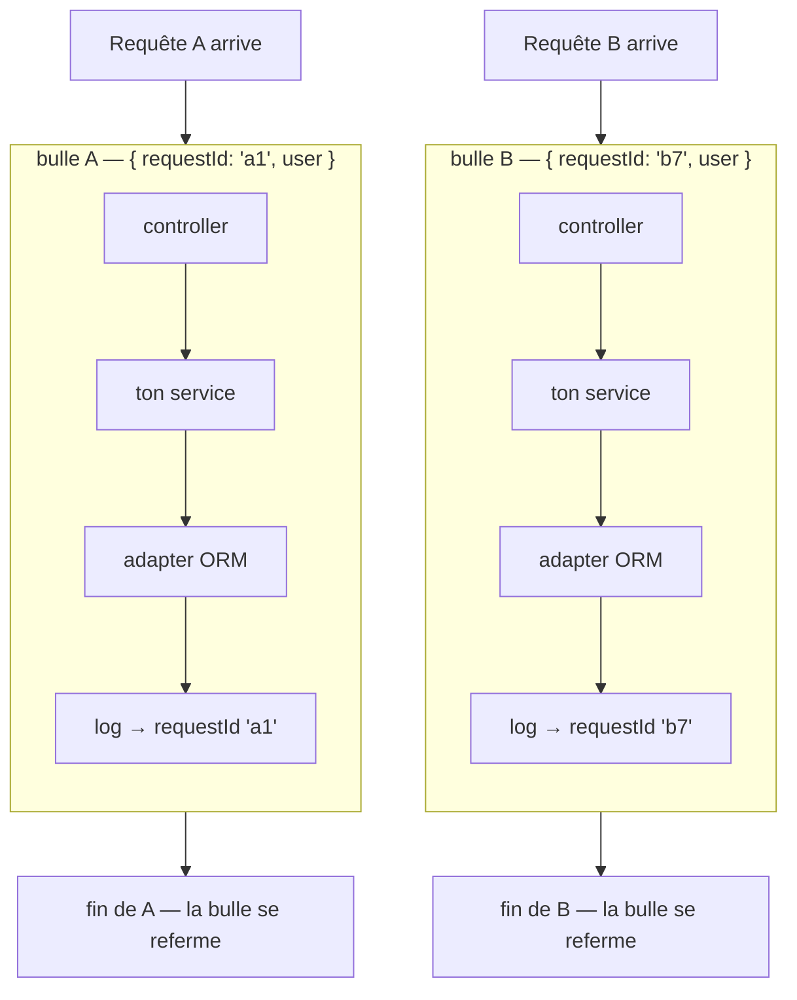
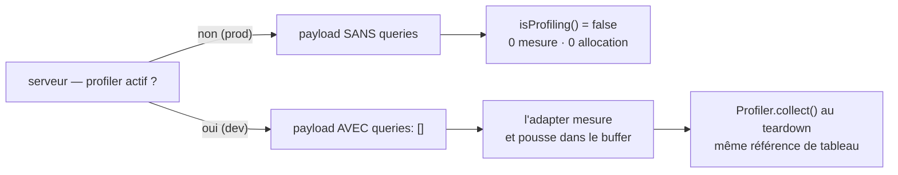

# Contexte de requête (RequestContext)

> `RequestContext` est une **bulle invisible** ouverte autour de chaque requête. Tout ce qui
> s'exécute dedans — ton service, ton adapter ORM, une ligne de log six couches plus bas — peut
> lire `requestId`, l'utilisateur authentifié ou le contexte transport **sans qu'on les lui ait
> passés en argument**. Deux requêtes simultanées ne se mélangent jamais. Ancré sur
> `src/nodefony/src/runtime/RequestContext.ts`.

📍 [Documentation](../../../docs/index.md) › [Cœur — @nodefony/core](index.md) › **Contexte de requête**

## 🧠 Le modèle mental — une bulle, pas une variable globale

Une variable globale serait partagée par **toutes** les requêtes en vol : à 200 requêtes par
seconde, la valeur écrite par l'une serait lue par l'autre. Un argument passé de main en main serait
correct, mais il faudrait le faire traverser **chaque** signature de l'application.

`RequestContext` prend la troisième voie : Node attache un stockage à la **chaîne d'exécution
asynchrone**. Chaque requête ouvre sa propre bulle ; tout ce qu'elle appelle hérite de la sienne, et
d'aucune autre.



Trois idées portent toute la page :

1. **On lit, on ne transporte pas.** Aucun paramètre `requestId` ne traverse tes signatures.
2. **La bulle a des bords nets.** Elle se referme à la fin de la requête ; en dehors, tout rend
   `undefined` — jamais une valeur d'une autre requête.
3. **Ce qui sort de la chaîne asynchrone sort de la bulle.** Un écouteur qui se déclenche plus tard
   n'y est plus, sauf à l'y avoir explicitement rattaché. C'est **le** piège de la page.

## 📖 Lexique

| Terme                    | Sens                                                                                                    |
| ------------------------ | ------------------------------------------------------------------------------------------------------- |
| **ALS**                  | _AsyncLocalStorage_ — le mécanisme Node (`node:async_hooks`) qui attache un store à une chaîne async.   |
| **Bulle** / **scope**    | Une exécution de `run()` : tout ce qu'elle appelle voit le même store.                                  |
| **Store** / **payload**  | L'objet porté par la bulle (`RequestContextPayload`) — `requestId`, `user`, `traceparent`…              |
| **`requestId`**          | Identifiant de corrélation de la requête : il relie toutes les lignes de log d'un même appel.           |
| **`traceparent`**        | En-tête W3C Trace Context — permet de raccorder la trace Nodefony à un collecteur OpenTelemetry.        |
| **Chaîne asynchrone**    | La suite des `await`, promesses et rappels qui descendent d'un appel. L'ALS la suit, et elle seule.     |
| **Callback détaché**     | Un rappel exécuté depuis une autre chaîne (file d'un pool, minuterie, événement de socket).             |
| **`AsyncResource.bind`** | La primitive Node qui **photographie** la bulle au moment du branchement et la restaure à l'appel.      |
| **Seam**                 | _Couture_ : un point d'accroche prévu pour brancher un observateur sans modifier le code observé.       |
| **Profiler**             | L'observateur de développement qui collecte phases et requêtes ORM d'un appel (barre de debug, Studio). |
| **Hot path**             | Le chemin parcouru à **chaque** requête — la moindre allocation y coûte cher.                           |
| **Zero Trust**           | Principe : aucune requête n'est réputée légitime sans preuve d'identité vérifiée à l'entrée.            |
| **Fail-closed**          | En cas de doute, refuser. L'inverse (`fail-open`) laisserait passer sur incertitude.                    |

## Qu'est-ce qu'un contexte de requête — et pourquoi le threader à la main ne tient pas

Un serveur traite **N requêtes en même temps** dans un seul processus. Chacune a des données qui la
caractérisent : son identifiant de corrélation, l'utilisateur authentifié, la trace distribuée. Ces
données sont utiles **partout**, et particulièrement loin du point d'entrée — dans la ligne de log
d'un repository, tout en bas.

La solution évidente — passer la valeur en argument — se dégrade en trois temps :

1. **Elle contamine les signatures.** `save(dto)` devient `save(dto, requestId)`, puis
   `save(dto, requestId, userId)`. Ces paramètres n'ont rien à voir avec le métier de la fonction.
2. **Elle est virale.** Un besoin nouveau (ajouter `traceparent`) oblige à retoucher toutes les
   signatures intermédiaires, y compris celles qui ne s'en servent pas — elles ne font que
   transmettre.
3. **Elle s'arrête au code que tu possèdes.** Un adapter ORM, une bibliothèque tierce ou le logger
   ne peuvent pas recevoir ton argument. Ce sont pourtant eux qui produisent les lignes qu'on veut
   corréler.

Le contexte de requête inverse la charge : la valeur est **déposée à l'entrée** et **lue à la
demande**, par qui en a besoin, sans intermédiaire. Le prix à payer est une lecture implicite : rien
dans la signature d'une fonction ne dit qu'elle dépend du contexte. La suite de cette page dit
exactement où la bulle existe, et où elle n'existe plus.

## La vision Nodefony

`RequestContext` est une **façade statique** au-dessus d'une instance unique d'`AsyncLocalStorage`
par processus (`RequestContext.ts:115`). Quatre décisions de conception en découlent.

- **Allocation paresseuse.** L'instance n'est créée qu'au **premier** `run()` — le getter privé
  `RequestContext.als` (`RequestContext.ts:118`). Importer la classe sans jamais ouvrir de bulle
  (bundle client, script CLI, test unitaire) ne coûte rien.
- **Lecture à sortie rapide.** `RequestContext.get()` (`RequestContext.ts:131`) rend `undefined`
  **sans toucher à l'ALS** quand aucune bulle n'a jamais été ouverte. Le cas « pas de requête » est
  gratuit.
- **Forme ouverte.** `RequestContextPayload` (`RequestContext.ts:37`) déclare les clés connues puis
  laisse une signature d'index : un module ajoute les siennes sans modifier le cœur. C'est ainsi que
  le module de sécurité y dépose son jeton complet, sans que le cœur connaisse son type.
- **Un seul mécanisme pour HTTP et WebSocket.** La même bulle est ouverte des deux côtés — c'est ce
  qui permet à un décorateur de sécurité ou à un adapter ORM d'être écrit **une fois** et de marcher
  sur les deux transports.

Le compromis assumé : le cœur type `user` et `context` en **`unknown`**
(`RequestContext.ts:65`). Le paquet `nodefony` ne connaît ni `@nodefony/security`, ni
`@nodefony/http` — le typage précis serait une dépendance circulaire. Le consommateur rétrécit
lui-même, ou passe par les helpers typés des couches au-dessus (`@CurrentUser`, `Controller.context`).

## 🚀 Démarrage rapide

### Lire le contexte depuis un service — rien à câbler

Dans une app générée par `nodefony create app`, la bulle est **déjà ouverte** autour de chaque
requête par le serveur HTTP. Ton code n'a qu'à lire.

```typescript
// nodefony/services/InvoiceService.ts
import { RequestContext, Service } from "nodefony";

export class InvoiceService extends Service {
  pay(ref: string, amount: number): void {
    // Aucun argument de contexte dans la signature : la valeur vient de la
    // bulle de LA requête en cours. `undefined` si on appelle hors requête.
    const requestId = RequestContext.getRequestId() ?? "hors-requête";

    // `user` est posé par le firewall APRÈS authentification. Typé `unknown`
    // par le cœur (il ne connaît pas les types de la sécurité) → on rétrécit.
    const user = RequestContext.getUser() as { username?: string } | undefined;

    this.log(
      `[${requestId}] ${user?.username ?? "anonyme"} paie ${ref}`,
      "INFO",
    );

    // Raccourci quand seul l'identifiant compte (audit, clé d'idempotence).
    const userId: string | undefined = RequestContext.getUserId();
    if (userId === undefined) {
      this.log("paiement anonyme — aucune zone n'a authentifié", "WARNING");
    }
  }
}
```

### Ouvrir sa propre bulle — un job hors requête

Un traitement planifié, un worker, une commande CLI : **aucune bulle n'est ouverte pour eux**. En
ouvrir une rend leurs logs corrélables exactement comme ceux d'une requête.

```typescript
// nodefony/services/NightlyJob.ts
import { Nodefony, RequestContext, Service } from "nodefony";

export class NightlyJob extends Service {
  async run(): Promise<void> {
    // `run()` RENVOIE ce que renvoie la fonction — ici la promesse du corps.
    // Ne pas oublier le `await` : sans lui, la bulle se referme… mais le
    // travail continue, et les logs suivants perdent le requestId.
    await RequestContext.run(
      { requestId: `job-${Nodefony.generateId()}` },
      async () => {
        this.log("début du recalcul", "INFO");
        await this.recompute();
        this.log("fin du recalcul", "INFO"); // même requestId que ci-dessus
      },
    );
  }

  private async recompute(): Promise<void> {
    // Six couches plus bas, la lecture marche toujours.
    this.log(`en cours (${RequestContext.getRequestId()})`, "DEBUG");
  }
}
```

### Mesurer une opération sans coûter un centime en production

Le patron officiel pour brancher un observateur : lire le buffer **une fois**, dans la bulle, puis
ne plus jamais relire l'ALS. C'est exactement ce que font les adapters ORM livrés.

```typescript
// nodefony/services/measured.ts
import { RequestContext } from "nodefony";
import type { IProfilerQuery } from "nodefony";

export async function measured<T>(
  label: string,
  exec: () => Promise<T>,
): Promise<T> {
  // On capture la RÉFÉRENCE du buffer TANT QU'ON EST dans la bulle.
  const buffer = RequestContext.get()?.queries;

  // Buffer absent = production, ou profiler éteint → ni mesure, ni allocation.
  if (!buffer) return exec();

  const startMs = performance.now();
  const result = await exec();

  const entry: IProfilerQuery = {
    sql: label,
    startMs,
    durationMs: performance.now() - startMs,
  };
  // On pousse dans la référence capturée — surtout PAS une relecture de l'ALS :
  // après un `await` traversant un pool, elle peut être perdue.
  buffer.push(entry);

  return result;
}
```

### Ce qu'on observe

```bash
npx nodefony development
```

```text
INFO    invoice     : [b1f2c3d4-…] alice paie INV-42
DEBUG   drizzle     : select * from invoices where id = ?   (1.4 ms)
INFO    http        : GET /api/invoices/INV-42 200 — 12 ms
```

Les trois lignes portent **le même** `requestId`, bien qu'aucune ne se le soit transmis : le
journal le capte tout seul dans la bulle via `Pdu.requestIdProvider` (`Pdu.ts:169`), branché sur
`RequestContext.getRequestId` par le barrel du cœur (`src/nodefony/src/index.ts:490`). C'est ce qui
rend la trace complète d'un appel rejouable — voir [Journalisation](syslog.md).

## 🧰 API publique

Neuf membres statiques, tous sûrs hors bulle (aucun ne lève). Les signatures exactes vivent dans le
graphe TSDoc (`.ai/symbols.json`) ; ce qui suit est l'usage.

| Appel              | Ancre                   | Rend / fait                                          | Hors bulle  |
| ------------------ | ----------------------- | ---------------------------------------------------- | ----------- |
| `run(payload, fn)` | `RequestContext.ts:126` | ouvre une bulle et **renvoie ce que renvoie `fn`**   | —           |
| `get()`            | `RequestContext.ts:131` | le payload entier (objet **mutable**, par référence) | `undefined` |
| `getRequestId()`   | `RequestContext.ts:137` | l'identifiant de corrélation                         | `undefined` |
| `getUser()`        | `RequestContext.ts:142` | l'utilisateur authentifié, typé `unknown`            | `undefined` |
| `getUserId()`      | `RequestContext.ts:155` | son identifiant sous forme de chaîne                 | `undefined` |
| `getContext<T>()`  | `RequestContext.ts:151` | le contexte transport HTTP/WS, générique             | `undefined` |
| `set(clé, valeur)` | `RequestContext.ts:164` | mute le payload **en place**, sans rouvrir de bulle  | **no-op**   |
| `isProfiling()`    | `RequestContext.ts:179` | `true` si un buffer de profilage est actif           | `false`     |
| `pushQuery(query)` | `RequestContext.ts:189` | ajoute une requête mesurée au buffer                 | **no-op**   |

> [!IMPORTANT]
> `set()` hors bulle ne **lève pas** — il ne fait rien. C'est délibéré (le même code doit tourner en
> requête et en script), mais ça veut dire qu'une écriture peut se perdre en silence. Si l'écriture
> est critique, teste `RequestContext.get()` d'abord.

### Le payload — une forme ouverte

`RequestContextPayload` (`RequestContext.ts:37`) déclare les clés que le cœur connaît, puis autorise
les autres par une signature d'index. Chaque couche y dépose ce qui la concerne.

| Clé               | Posée par               | À quoi elle sert                                                            |
| ----------------- | ----------------------- | --------------------------------------------------------------------------- |
| `requestId`       | le serveur HTTP/WS      | corrélation des logs, en-tête de réponse, suivi de requête                  |
| `scheme`          | le serveur HTTP/WS      | `http`/`https`/`ws`/`wss` — utile aux liens absolus et aux cookies          |
| `traceparent`     | le serveur HTTP/WS      | trace distribuée W3C, honorée si le client l'envoie                         |
| `user` / `userId` | le firewall après auth  | identité résolue — `firewall.ts:774`                                        |
| `token`           | le firewall après auth  | jeton **complet** : rôles, périmètres, attributs — `firewall.ts:674`        |
| `context`         | le serveur HTTP/WS      | contexte transport, pour les contrôleurs sans état (`RequestContext.ts:65`) |
| `queries`         | le serveur, en dev seul | buffer de requêtes ORM du profiler (`RequestContext.ts:57`)                 |
| `invocation`      | le pont WS-RPC          | profil de **la trame** en cours (phases + requêtes ORM)                     |
| `body`            | le pont WS-RPC          | corps d'une mutation — il n'existe aucun corps HTTP parsé sur une trame     |
| `idempotencyKey`  | le pont WS-RPC / HTTP   | déduplication d'un rejeu (`Resolver.ts:494`)                                |
| `renderSink`      | le pont WS-RPC          | puits de capture d'un rendu, pour ne pas écrire de trame hors protocole     |

Les couches supérieures exposent ces clés sous une forme **typée**, à préférer quand elle existe :

| Tu veux…                     | Écris plutôt                                              | Ancre                      |
| ---------------------------- | --------------------------------------------------------- | -------------------------- |
| l'utilisateur, en contrôleur | le paramètre décoré `@CurrentUser()`                      | `routerDecorators.ts:1180` |
| le contexte, en contrôleur   | le getter `Controller.context`                            | `Controller.ts:147`        |
| les droits (rôles, scopes)   | `@IsGranted` / `@RequireScope` — jamais une lecture brute | `Resolver.ts:579`          |

## 🔌 Où la bulle est ouverte

Quatre points d'ouverture, tous dans le cœur du serveur — ton code n'a **jamais** à ouvrir de bulle
pour une requête. Le trajet complet d'une requête (phases, ordre des hooks, teardown) est décrit
dans [Le pipeline d'une requête](../../../docs/architecture/pipeline-requete.md) ; ici, seulement
qui ouvre quoi.

| Transport                | Ouverte par                                                                                       | Ce que la bulle couvre                                        |
| ------------------------ | ------------------------------------------------------------------------------------------------- | ------------------------------------------------------------- |
| HTTP / HTTP2             | `HttpKernel.handleHttp()` (`http-kernel.ts:1174`)                                                 | CORS, routage, firewall, ton action, rendu                    |
| WebSocket — connexion    | `HttpKernel.handleWebsocket()` (`http-kernel.ts:1465`)                                            | poignée de main, firewall, **et toutes les trames**           |
| WebSocket — trame RPC    | `RequestContext.run()` dans `RealtimeController.invokeApiRequest()` (`RealtimeController.ts:766`) | **une** invocation : corps, clé d'idempotence, profil         |
| Fin de réponse (journal) | `Context.log()` (`Context.ts:459`)                                                                | micro-bulle rouverte pour que les logs de fin soient corrélés |

Deux points méritent d'être connus.

**La bulle WebSocket survit aux trames.** Une trame arrive dans un tick d'event-loop bien
postérieur à la poignée de main : elle serait hors bulle. `WebsocketContext.connect()`
(`WebsocketContext.ts:230`) branche donc `message`, `close` et `error` à travers
`AsyncResource.bind` (`WebsocketContext.ts:243`) — la bulle est photographiée au branchement, donc
depuis l'intérieur, et restaurée à chaque appel.

**Le pont WS-RPC rouvre une bulle par invocation.** Le contexte WebSocket vit pour toute la
connexion ; y accumuler le corps, la clé d'idempotence ou les phases d'une trame produirait un
mélange entre trames concurrentes de la **même** socket. Une bulle par invocation supprime le
problème par construction.

## 🔬 Le seam profiler ORM — gratuit en production

C'est l'usage le plus subtil du payload, et le patron à copier pour tout observateur.

Le serveur alloue `queries` (`RequestContext.ts:57`) **uniquement quand le profiler est actif**,
c'est-à-dire en développement (`http-kernel.ts:1213`). En production, la clé est simplement absente.
Cette absence **est** le signal : les adapters ORM n'ont aucun réglage à lire.



Deux lectures possibles, et elles ne sont **pas** équivalentes :

- `RequestContext.isProfiling()` (`RequestContext.ts:179`) + `RequestContext.pushQuery()`
  (`RequestContext.ts:189`) — le chemin simple, quand tout se passe dans la bulle.
- **capturer la référence** du buffer une fois (`RequestContext.get()?.queries`) puis pousser
  dedans — le chemin **robuste**, celui des adapters livrés : `DrizzleRepository.#prof()`
  (`DrizzleRepository.ts:279`) et `MongooseRepository.#prof()` (`MongooseRepository.ts:79`).

> [!WARNING]
> **Ne relis jamais l'ALS après un `await` qui traverse un pool.** Un pilote de base de données peut
> rendre la main depuis sa propre file d'attente : ton code reprend alors dans une chaîne
> asynchrone détachée, où `isProfiling()` vaut `false` et où `pushQuery()` ne fait rien — sans la
> moindre erreur. La mesure disparaît en silence. Capturer la référence **avant** l'`await`
> supprime la dépendance à l'ALS pour la suite de l'opération.

Contrat de sécurité qui accompagne ce seam : un adapter qui pousse du SQL doit d'abord le
**masquer** si le texte peut contenir un identifiant de connexion. Le SQL paramétré (avec
`?`, comme celui de Drizzle) est déjà sans secret ; du SQL interpolé ne l'est pas.

## Isolation — deux requêtes ne se mélangent jamais

La garantie vient de Node lui-même : l'ALS propage le store le long de la **chaîne d'exécution
asynchrone**. Deux appels concurrents à `run()` créent deux stores distincts ; un `await` à
l'intérieur de l'un ne fait jamais basculer sur l'autre.

Ce que ça implique concrètement :

- **Entre requêtes** : aucun partage. La bulle de A est invisible depuis B, même si A et B
  s'entrelacent sur des dizaines de `await`.
- **À l'intérieur d'une requête** : le payload est **un seul objet, partagé par référence**. C'est
  ce qui permet au firewall d'appeler `set("user", …)` en milieu de pipeline (`firewall.ts:774`) et
  de rendre l'identité visible à tout ce qui tourne déjà dans la même bulle, sans rien rouvrir.
- **Après `run()`** : la bulle est refermée. `get()` rend de nouveau `undefined` — pas la valeur
  précédente.

Ces trois propriétés sont exercées par la suite de tests (voir plus bas), dont un cas qui fait
tourner deux bulles concurrentes avec des `await` entrelacés et vérifie qu'aucune ne voit l'autre.

## ⚡ Performance & mémoire

`RequestContext` est sur le chemin de **chaque** requête. Ce qui rend son coût acceptable :

- **Rien tant que rien n'est ouvert.** L'instance d'ALS n'existe qu'après le premier `run()`
  (`RequestContext.ts:118`), et `get()` court-circuite sur une comparaison à `null` tant qu'aucune
  bulle n'a été ouverte (`RequestContext.ts:131`).
- **Une seule allocation par requête** : l'objet payload. Il est construit au point d'entrée avec
  les champs déjà connus, pas enrichi au fil de l'eau.
- **Le buffer ORM est `null` en production.** Pas de tableau alloué « au cas où » ; l'absence de la
  clé suffit à éteindre toute la chaîne de mesure.
- **Les raccourcis ne réallouent rien** : `getRequestId()`, `getUser()`, `getUserId()` sont une
  lecture de store suivie d'un accès de propriété.

Sur les chiffres, la page reste factuelle : la TSDoc du code annonce **~50-100 ns** par `run()` sur
Node 22+ pour l'entrée dans le scope (`RequestContext.ts:115`), et le même ordre de grandeur pour la
lecture du `requestId` par le journal (`Pdu.ts:169`), contre ~5 ns quand le fournisseur n'est pas
branché. **Il n'existe pas de banc dédié à `RequestContext`** dans le dépôt : ces valeurs sont des
ordres de grandeur documentés au code, pas une mesure rejouable. Le coût réel se constate en bout de
chaîne, par le gate mémoire du pipeline (skill `nodefony-check-memory-health`).

> [!WARNING]
> Le vrai risque mémoire n'est pas la bulle, c'est **ce qui la retient**. Un `AsyncResource.bind`
> posé sur un écouteur à vie longue garde le payload — donc l'utilisateur, donc le contexte
> transport — accessible tant que l'écouteur existe. Lier à la bulle uniquement ce qui meurt avec la
> requête ou la connexion.

## 🔐 Sécurité — l'identité vit dans la bulle

Après authentification, le firewall dépose dans le payload l'utilisateur (`firewall.ts:628`) **et le
jeton complet** — rôles, périmètres, attributs (`firewall.ts:632`). Quatre conséquences à assumer.

1. **Tout ce qui tourne dans la bulle peut lire l'identité.** Y compris du code que tu appelles sans
   l'avoir écrit. C'est la contrepartie de la commodité : le payload n'est pas un coffre-fort. On y
   met une identité **déjà vérifiée**, jamais un authentifiant (mot de passe, secret brut).
2. **Lire l'identité n'est pas autoriser.** `getUser()` rend `unknown` : c'est un transport, pas une
   décision. L'autorisation passe par le firewall et ses décorateurs, qui lisent le **jeton**
   (`Resolver.ts:579`) et refusent en `fail-closed` lorsqu'aucune identité n'a été résolue.
3. **Une identité de WebSocket peut vieillir.** La bulle de connexion porte l'identité captée à la
   poignée de main, et la connexion peut durer des heures — alors que la session, elle, peut être
   révoquée entre-temps. C'est pourquoi le pont WS-RPC **revalide** l'identité à chaque invocation
   avant d'ouvrir sa bulle — `RequestContext.run()` (`RealtimeController.ts:810`) — et refuse en
   cas de doute, au lieu de faire confiance à la valeur capturée à la connexion.
   La même logique vaut pour ton code : ne mets pas en cache un `getUser()` au-delà d'une invocation.
4. **Rien ne fuit entre requêtes**, mais tout fuit hors de la bulle si on l'en sort. Ranger un
   `RequestContext.get()` dans une variable de module, un cache applicatif ou une fermeture à vie
   longue, c'est exposer l'identité d'un utilisateur au traitement d'un autre.

## ⚠️ Pièges

Le premier est de loin le plus fréquent, et il ne produit **aucune erreur** — juste des valeurs
`undefined` qui apparaissent tard.

> [!CAUTION]
> **La règle à retenir.** Tout écouteur branché **dans** la bulle mais déclenché **plus tard**
> (`message`, `close`, `finish`, une minuterie, un hook d'après-réponse) et qui doit lire le
> contexte **doit** être enveloppé dans `AsyncResource.bind()` **au moment du branchement**. Sinon
> il s'exécute dans un autre tick d'event-loop, hors bulle, et tout rend `undefined`.

C'est ainsi que le framework le fait pour toi aux deux endroits qui comptent : les événements de
socket dans `WebsocketContext.connect()` (`WebsocketContext.ts:243`) et les rappels d'après-réponse
dans `Context.onAfterResponse()` (`Context.ts:373`). Si tu branches **ton** écouteur sur une socket
ou une minuterie, la règle est à toi de l'appliquer.

| Symptôme                                                           | Cause                                                                                | Correction                                                                           |
| ------------------------------------------------------------------ | ------------------------------------------------------------------------------------ | ------------------------------------------------------------------------------------ |
| `getRequestId()` vaut `undefined` dans un écouteur / une minuterie | le rappel se déclenche dans un tick postérieur, hors bulle                           | `AsyncResource.bind(fn)` **au branchement**, pas à l'appel                           |
| Une mesure ORM disparaît sans erreur                               | ALS relue **après** un `await` traversant un pool → `isProfiling()` faux             | capturer `get()?.queries` **avant** l'`await`, puis pousser dans la référence        |
| `set()` n'a aucun effet                                            | appelé hors bulle : c'est un no-op délibéré (`RequestContext.ts:164`)                | vérifier `get()` d'abord, ou ouvrir une bulle avec `run()`                           |
| `getUser()` vide alors que l'utilisateur est connecté              | la route n'est dans aucune zone du firewall, ou lecture **avant** le firewall        | placer la route dans une zone ; lire dans l'action, pas dans un hook amont           |
| `getUser()` refusé par TypeScript                                  | le cœur type `user` en `unknown` (pas de dépendance vers la sécurité)                | rétrécir soi-même, ou préférer `@CurrentUser()` (`routerDecorators.ts:1180`)         |
| `isProfiling()` faux en développement                              | le profiler n'est pas actif → aucun buffer `queries` alloué (`RequestContext.ts:57`) | comportement normal : la mesure doit rester gratuite quand personne n'observe        |
| Un log de fin de requête sans `requestId`                          | le teardown s'exécute après la fermeture de la bulle                                 | déjà traité pour les contextes (`Context.ts:459`) ; pour ton code, `run()` à nouveau |
| Le travail continue après `run()`, logs décorrélés                 | `run()` renvoie la promesse sans l'attendre                                          | `await RequestContext.run(...)` — la bulle suit l'`await`, pas l'appel               |
| Identité périmée sur une connexion WebSocket longue                | l'identité a été captée à la poignée de main                                         | revalider par invocation (`RealtimeController.ts:810`), ne pas mettre en cache       |
| Fuite mémoire autour d'un écouteur lié                             | `AsyncResource.bind` retient le payload, donc l'utilisateur et le contexte           | ne lier que ce qui meurt avec la requête ou la connexion                             |

## 🧪 Tests & couverture

La brique est couverte par **une** suite unitaire, `src/nodefony/src/tests/RequestContext.test.ts`.
Elle exerce trois familles :

- **Les bords de la bulle** : `get()` hors scope, exposition du payload à l'intérieur, valeur de
  retour de `run()`, survie à un `await`, fermeture après `run()`.
- **La mutation** : `set()` visible immédiatement via `get()`, et `set()` hors scope traité comme un
  no-op sans exception.
- **L'isolation et le seam profiler** : deux bulles concurrentes aux `await` entrelacés qui ne se
  mélangent pas ; `isProfiling()` faux sans buffer et hors scope avec `pushQuery()` inerte ;
  `pushQuery()` qui remplit bien le buffer fourni.

Ce qui **n'est pas couvert** ici, et qu'il faut savoir — la surface transverse de `RequestContext`
est bien plus large que sa suite unitaire :

- **Aucun test unitaire de `getContext()`** dans cette suite, alors que c'est le chemin des
  contrôleurs sans état.
- **La propagation réelle par le serveur** (HTTP, poignée de main WebSocket, trames, après-réponse)
  n'est pas exercée ici : elle relève des suites d'intégration de `@nodefony/http`, qui couvrent la
  bulle WS et les rappels d'après-réponse.
- **Aucun test d'attaque** (`*.attack.test.ts`) sur le cloisonnement de l'identité entre bulles
  concurrentes — le scénario « la requête B lit l'utilisateur de A » mériterait d'être exercé comme
  invariant. Voir le skill `nodefony-security-review`.
- **Aucun banc de charge ni de mémoire dédié** : le coût de l'ALS se constate en bout de pipeline
  (skills `nodefony-load-test` et `nodefony-check-memory-health`).

Couverture : `npm run coverage` dans `src/nodefony`. Les chiffres exacts vivent dans le rapport
vitest, jamais figés ici.

## 🔗 Pour aller plus loin

- ⬆️ **Retour au hub** : [@nodefony/core — vue d'ensemble](index.md) · [Toute la documentation](../../../docs/index.md)
- 🧭 **Pages sœurs** : [Service et événements](service.md) — la classe de base qui expose `log()` ·
  [Journalisation](syslog.md) — où le `requestId` est capté et rejoué ·
  [Kernel et modules](kernel.md) — le boot qui câble tout ça ·
  [Client isomorphe](client.md) — le bundle navigateur, où l'ALS n'existe pas ·
  [Hooks React](react-hooks.md)
- Le trajet complet d'une requête, phase par phase → [Le pipeline d'une requête](../../../docs/architecture/pipeline-requete.md)
- Le scope d'injection par requête, à ne pas confondre avec la bulle → [Injection et portées](../../../docs/architecture/injection-portees.md)
- Qui pose l'utilisateur et le jeton dans le payload → [Firewall](../../packages/@nodefony/security/docs/firewall.md)
- L'identité côté temps réel, revalidée par trame → [Sécurité du temps réel](../../packages/@nodefony/realtime/docs/securite.md)
