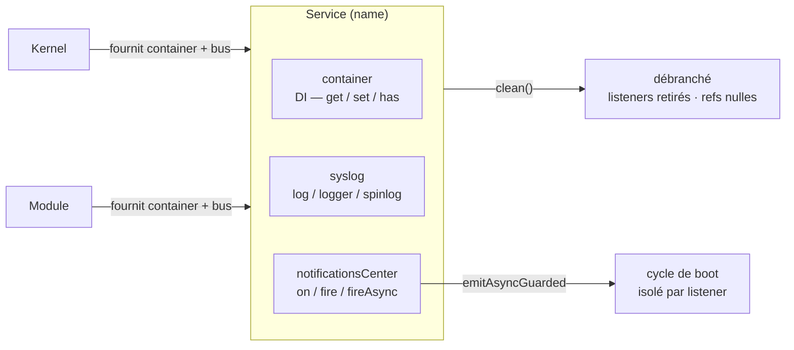
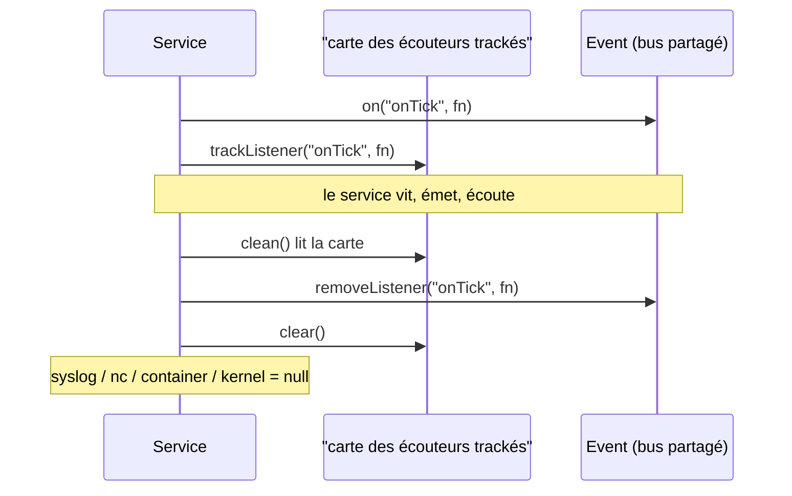

# Service — la brique de base de tout composant

> `Service` est la classe dont **presque tout** hérite dans Nodefony : le `Kernel`, chaque `Module`,
> chaque controller, chaque adapter ORM. Elle branche trois câbles d'un coup — les **dépendances**
> (container DI), le **journal** (`log`) et le **bus d'événements** (`notificationsCenter`) — puis
> garantit qu'ils se débranchent proprement (`clean()`). Ancré sur `src/nodefony/src/Service.ts`,
> `Event.ts` et `Container.ts`.

📍 [Documentation](../../../docs/index.md) › [Cœur — @nodefony/core](index.md) › **Service**

## 🧠 Le modèle mental — une prise à trois broches

Un composant serveur a toujours besoin des trois mêmes choses : trouver ses voisins, dire ce qu'il
fait, réagir à ce qui arrive. `Service` est la **prise murale** qui apporte les trois d'un seul
geste — au lieu que chaque brique se recâble à la main.



Trois idées portent toute la page :

1. **On hérite, on ne recâble pas.** `class MonService extends Service` et les trois broches sont là.
2. **Le bus peut être partagé.** Deux services du même module parlent sur le **même** `Event` — c'est
   ce qui les découple sans les faire se connaître.
3. **Ce qui se branche doit se débrancher.** `Service` **trace** les écouteurs qu'il pose pour que
   `clean()` les retire du bus partagé : sans ça, chaque instance fuirait.

## 📖 Lexique

| Terme                 | Sens                                                                                                                                         |
| --------------------- | -------------------------------------------------------------------------------------------------------------------------------------------- |
| Service               | La classe de base : identité (`name`) + DI + journal + événements.                                                                           |
| Container             | Annuaire d'injection de dépendances (DI) : un nom → une instance. Voir [injection-portees](../../../docs/architecture/injection-portees.md). |
| DI                    | _Dependency Injection_ — on **reçoit** ses dépendances au lieu de les construire soi-même.                                                   |
| `notificationsCenter` | Le bus d'événements d'un service (une instance d'`Event`).                                                                                   |
| Event                 | Bus maison qui étend l'`EventEmitter` de Node avec `emitAsync` et `emitAsyncGuarded`.                                                        |
| Bus partagé           | Un même `Event` passé à plusieurs services (typiquement celui du module ou du kernel).                                                       |
| Bus dédié             | Un `Event` créé pour un seul service — personne d'autre ne l'écoute.                                                                         |
| Écouteur tracké       | Écouteur posé via l'API du service, donc retiré automatiquement par `clean()`.                                                               |
| PDU                   | _Process Data Unit_ — une entrée de journal structurée (RFC 5424). Voir [syslog](syslog.md).                                                 |
| Hot path              | Le chemin parcouru à **chaque** requête HTTP/WS — la moindre allocation y coûte cher.                                                        |
| Microtask             | Unité d'ordonnancement d'une `Promise` : un `await` inutile en alloue une pour rien.                                                         |
| Émission gardée       | `emitAsyncGuarded` — chaque écouteur est isolé (try/catch + délai maximal), les échecs sont collectés.                                       |
| Scope DI              | `singleton` (une instance mémoïsée) ou `transient` (une neuve à chaque résolution).                                                          |
| Tri topologique       | Calcul de l'ordre d'instanciation depuis les dépendances déclarées, au lieu de le lire dans une liste.                                       |
| BootReport            | Bilan de démarrage : ce qui a été chargé, ce qui a été ignoré, pourquoi. Fait dire « boot DÉGRADÉ ».                                         |
| Fail-soft / fail-loud | Continuer malgré la panne / refuser de continuer en silence. Nodefony fait les deux, jamais en cachette.                                     |

## Qu'est-ce qu'un Service — et pourquoi un bus d'événements

Un serveur est un assemblage de composants qui doivent **se parler sans se connaître**. Le kernel
signale « je démarre », un module réagit. Une requête signale « terminée », le profileur collecte.
Un service métier signale « catalogue modifié », un cache s'invalide.

Câbler ces composants en dur (A appelle B qui appelle C) donne une pelote : ajouter un consommateur
oblige à modifier le producteur. Le **bus d'événements** inverse la charge — on émet un signal, et
**qui veut réagir s'abonne**. Le producteur ne connaît plus ses consommateurs.

Nodefony ne se contente pas de fournir un bus quelque part : il le met **dans la classe de base**,
avec l'accès aux dépendances et le journal. Résultat : n'importe quelle brique du framework part avec
le même socle, et tout le monde parle la même langue.

> [!TIP]
> Si tu viens de Symfony : `Service` n'est **pas** l'équivalent d'un service `services.yaml`. C'est
> plutôt « la classe de base que Symfony n'a pas » — un composant y est un POPO, ici il hérite d'un
> socle qui lui donne DI + log + events. Le rapprochement s'arrête là.

## La vision Nodefony

`Service` (`Service.ts:43`) porte cinq membres publics — `name`, `container`, `kernel`, `syslog`,
`options` — et un bus **privé** `#nc` exposé en lecture seule par le getter
`Service.notificationsCenter` (`Service.ts:57`). Toutes les méthodes d'événements passent par un
getter privé gardé `Service.nc` (`Service.ts:62`) : c'est lui, et lui seul, qui lève
`notificationsCenter not initialized` — le test est écrit **une fois** au lieu d'être dupliqué sur
les 18 méthodes déléguées.

Le constructeur (`Service.ts:79`) est volontairement **opportuniste** : il réutilise ce que le
container lui offre (`kernel`, `syslog`) et ne fabrique que ce qui manque. Le bus suit la même
logique — partagé si on lui en passe un, dédié sinon, absent si on passe `false`.

Le bus lui-même, `Event` (`Event.ts:117`), étend l'`EventEmitter` de Node avec exactement deux idées
maison :

- `Event.emitAsync()` (`Event.ts:200`) attend les écouteurs **en séquence**, jamais en `Promise.all` —
  l'ordre des effets de bord est prévisible par construction ;
- `Event.emitAsyncGuarded()` (`Event.ts:257`) isole **chaque** écouteur (try/catch + délai maximal)
  et renvoie `{ results, errors, stopped }` au lieu de laisser le premier rejet faire sauter la suite.

Ce dernier porte tout le cycle de vie du kernel via `Kernel.fireLifecycle()` (`Kernel.ts:2575`) : un
hook de module qui pend ou qui jette ne gèle plus le démarrage du serveur.

Le compromis assumé : `Service` **délègue** massivement (18 méthodes d'événements + 6 méthodes de
container) plutôt que d'exposer ses collaborateurs bruts. C'est un peu de code répétitif dans la
classe de base, contre deux garanties — le suivi des écouteurs pour `clean()`, et une façade DI
tolérante qui rend `null` au lieu d'exploser après destruction.

## 🚀 Démarrage rapide

### Un service d'application, de bout en bout

Dans une app générée par `nodefony create app`, un service se déclare sur le **module** qui le
porte. Voici l'ensemble minimal qui tourne — décoration, construction, journal, événement, wiring :

```typescript
// index.ts — point d'entrée de l'app (`nodefony create app` génère le squelette).
// En vrai, `CatalogService` vivrait dans `nodefony/services/CatalogService.ts` et
// serait importé ici ; les deux sont réunis pour que le bloc soit copiable tel quel.
import { Module, Service, injectable, services } from "nodefony";
import type { Container, Event, Kernel } from "nodefony";

// `@injectable("catalog")` inscrit la CLASSE au registre DI sous le nom "catalog".
@injectable("catalog")
class CatalogService extends Service {
  private items = new Map<string, number>();

  // Le module porteur transmet SES ressources : même container, MÊME bus.
  // C'est ce partage qui permet aux services du module de se parler.
  constructor(module: Module) {
    super(
      "catalog", // clé dans le container — c'est elle qu'on interroge
      module.container as Container,
      module.notificationsCenter as Event,
      module.options.catalog, // sous-section de config du module
    );
  }

  add(ref: string, qty: number): void {
    this.items.set(ref, qty);
    this.log(`ajout ${ref} ×${qty}`, "INFO"); // msgid = "catalog" par défaut
    this.fire("onCatalogChanged", ref, qty); // synchrone, 0 microtask
  }
}

// `@services([...])` déclare les services du module : ils sont instanciés à
// `onPreBoot`, dans l'ordre CALCULÉ depuis leurs dépendances.
@services([CatalogService])
class App extends Module {
  constructor(kernel: Kernel) {
    super("app", kernel, import.meta.url, {});
  }

  override async onKernelReady(): Promise<this> {
    // `this.on(...)` est TRACKÉ → retiré du bus partagé par `clean()`.
    this.on("onCatalogChanged", (ref: string, qty: number) => {
      this.log(`catalogue modifié : ${ref} ×${qty}`, "NOTICE");
    });
    // Le service est au container sous sa clé — jamais un `new` à la main.
    this.get<CatalogService>("catalog")?.add("NF-001", 3);
    return this;
  }
}

export default App;
```

### Ce qu'on observe

```bash
npx nodefony development
```

```text
DEBUG   app          SERVICE ADD : catalog          # Module.addService a posé l'instance
INFO    catalog      ajout NF-001 ×3                # msgid = le nom du service
NOTICE  app          catalogue modifié : NF-001 ×3  # l'écouteur du module a reçu l'événement
```

Le `msgid` de la deuxième ligne est `catalog` sans qu'on l'ait écrit : `Service.log()`
(`Service.ts:209`) prend `this.name` par défaut. La trace `SERVICE ADD` vient de
`Module.addService()` (`Module.ts:313`), qui instancie via l'injecteur puis range l'instance au
container sous `instance.name`.

### Sans kernel ni module — un Service tout seul

Un `Service` n'exige **aucune** infrastructure : il se construit dans un test ou un script. C'est ce
qui rend la classe testable en isolation.

```typescript
import { Service, Container, Event } from "nodefony";

const bus = new Event(); // bus PARTAGÉ, fourni par l'appelant
const container = new Container(); // annuaire DI racine

const producer = new Service("worker-a", container, bus);
const consumer = new Service("worker-b", container, bus);

// Tracké : `clean()` saura le retirer du bus partagé.
consumer.on("onTick", (n: number) => {
  consumer.log(`tick ${n}`, "DEBUG");
});

producer.fire("onTick", 1); // worker-b reçoit — même bus

consumer.clean(); // retire SES écouteurs, détache container/syslog/nc
producer.fire("onTick", 2); // plus personne n'écoute : aucune fuite
```

> [!IMPORTANT]
> Après `clean()`, toute méthode d'événement du service **lève** (`notificationsCenter not
initialized`) et `set()` lève aussi (`container not initialized`) — mais `get()` rend `null` en
> silence. Cette asymétrie est délibérée : lire après destruction est un cas de sortie de route
> tolérable, **écrire** ne l'est pas.

## 🏗️ Architecture interne

### Ce que fait le constructeur, dans l'ordre

`Service.ts:79` exécute cinq étapes, toutes lisibles en 50 lignes :

1. **Identité** — `name` est posé tel quel ; il servira de clé container et de `msgid` syslog.
2. **Container** — celui qu'on fournit, sinon un `new Container()` frais (`Service.ts:86`).
3. **Kernel + syslog** — récupérés depuis le container ; si le syslog manque, un `Syslog` est créé
   avec `moduleName = this.name` puis **posé au container** pour les suivants (`Service.ts:95`).
4. **Bus** — les trois formes ci-dessous (`Service.ts:106`).
5. **Nettoyage des options** — la clé `events` est **supprimée** de `options` après usage
   (`Service.ts:131`).

> [!WARNING]
> L'étape 5 utilise `delete` et **pas** `= undefined`, volontairement : des consommateurs parcourent
> `for (… in this.options)` et appellent `.path` sur chaque valeur — ils supposent la clé **absente**.
> Le gain de _hidden class_ V8 d'un `= undefined` serait annulé par les gardes `if (!v) continue` à
> ajouter partout.

### Les trois formes de bus — trois situations réelles

Le troisième argument du constructeur décide de tout. Choisis-le en fonction de **qui doit entendre**.

| Tu passes…            | Le service obtient…                              | Quand c'est le bon choix                                       |
| --------------------- | ------------------------------------------------ | -------------------------------------------------------------- |
| un `Event` existant   | ce **bus partagé** (`#sharedNc = true`)          | service d'un module / du kernel : il doit parler aux voisins   |
| `undefined` ou `null` | un **bus dédié**, créé pour lui                  | brique autonome, aucun voisin à prévenir                       |
| `false`               | **aucun bus** — les méthodes d'événements lèvent | pur utilitaire, sans signal à émettre : 0 allocation d'`Event` |

**Situation 1 — un service de module.** Le module te tend son bus, tu le transmets : ton service et
tous ceux du module s'entendent, sans se connaître.

```typescript ignore
super(
  "catalog",
  module.container as Container,
  module.notificationsCenter as Event,
);
```

**Situation 2 — une brique isolée.** Rien à prévenir, personne à écouter : laisse le troisième
argument vide. Le bus est créé (`Service.ts:117`) et, s'il n'y a pas de kernel partageant le même
container, il est publié sous la clé `notificationsCenter` pour que d'autres puissent le retrouver
(`Service.ts:121`).

**Situation 3 — un pur utilitaire.** Un helper qui ne signale rien : `false`. Aucun `Event` n'est
alloué, et `options` n'est **pas** fusionné avec les défauts (`Service.ts:88`) — ce que le contre-cas
suivant illustre :

```typescript ignore
new Service("calc", container, false, { foo: "bar" }); // ✅ options.foo conservé, 0 bus
new Service("calc", container, false).fire("x"); // ❌ lève : notificationsCenter not initialized
```

### Écouteurs trackés — la mécanique anti-fuite

C'est **la** raison d'être de la délégation. Chaque écouteur posé par l'API du service
(`Service.on()` (`Service.ts:328`), `once`, `addListener`, `prependListener`…) est enregistré dans la
carte privée `#trackedListeners` (`Service.ts:53`) via `Service.trackListener()` (`Service.ts:242`).



`Service.clean()` (`Service.ts:179`) ne retire les écouteurs que si le bus est **partagé** : sur un
bus dédié, l'objet entier part au ramasse-miettes avec le service, il n'y a rien à décrocher.

### Cycle de vie

| Étape        | Appel                                       | Ce qui se passe                                                       |
| ------------ | ------------------------------------------- | --------------------------------------------------------------------- |
| Naissance    | `new Service(name, container, nc, options)` | câblage des trois broches, écouteurs de config attachés               |
| Journal      | `Service.initSyslog()` (`Service.ts:159`)   | démarre la sortie console (environnement + verbosité + filtres)       |
| Vie          | `log` / `fire` / `on` / `get`               | délégation vers syslog, bus et container                              |
| Destruction  | `Service.clean()` (`Service.ts:179`)        | retire les écouteurs trackés, remet syslog/nc/container/kernel à vide |
| Destruction+ | `clean(true)`                               | appelle en plus `Syslog.reset()` — les transports sont fermés         |

`clean()` est **idempotent** : le rappeler ne lève pas.

## 🧰 API publique

Les signatures exactes vivent dans le graphe TSDoc (`.ai/symbols.json`) ; ce qui suit est l'usage.

### Dépendances — la façade container

| Appel                    | Ancre            | Comportement                                                    |
| ------------------------ | ---------------- | --------------------------------------------------------------- |
| `get<T>(name)`           | `Service.ts:427` | l'instance typée, ou **`null`** si absente ou après `clean()`   |
| `set(name, obj)`         | `Service.ts:435` | enregistre — **lève** si le container est détaché               |
| `remove(name)`           | `Service.ts:447` | si la cible est un `Service`, appelle son `clean()` **d'abord** |
| `has(name)`              | `Service.ts:477` | `false` plutôt qu'une erreur quand le container est détaché     |
| `getParameters(path)`    | `Service.ts:461` | lecture par chemin pointé (`"kernel.environment"`)              |
| `setParameters(path, v)` | `Service.ts:469` | écriture par chemin pointé — **lève** si détaché                |

Cette façade est **tolérante en lecture, stricte en écriture**. Le détail du container lui-même
(scopes par requête, arbre de paramètres, héritage prototypal) est traité dans
[injection-portees](../../../docs/architecture/injection-portees.md) — `Container.enterScope()` (`Container.ts:293`),
`Container.leaveScope()` (`Container.ts:312`) et `Container.scopeCount()` (`Container.ts:330`) pour
les sondes de fuite.

### Journal

| Appel                               | Ancre            | Usage                                             |
| ----------------------------------- | ---------------- | ------------------------------------------------- |
| `log(pci, severity?, msgid?, msg?)` | `Service.ts:209` | le point d'entrée de **tout** log Nodefony        |
| `logger(pci, …)`                    | `Service.ts:226` | raccourci `DEBUG` + `console.debug` formaté       |
| `trace(pci, …)`                     | `Service.ts:231` | idem avec `console.trace` (pile d'appels)         |
| `spinlog(message)`                  | `Service.ts:236` | sévérité `SPINNER` — animation CLI, hors RFC 5424 |

`log()` est **increvable** : sans syslog il fabrique un `Pdu` directement, et toute exception y est
attrapée pour retomber sur `console` (`Service.ts:218`). Un service qui journalise ne peut pas faire
tomber le process à cause du journal. Sévérités et transports : [syslog](syslog.md).

### Événements

| Appel                                 | Ancre            | Note                                                            |
| ------------------------------------- | ---------------- | --------------------------------------------------------------- |
| `fire(name, …)` / `emit(name, …)`     | `Service.ts:272` | synchrone, **0 microtask** — le défaut sur le hot path          |
| `fireAsync(name, …)` / `emitAsync(…)` | `Service.ts:277` | attend les écouteurs asynchrones, **en séquence**               |
| `emitAsyncGuarded(name, options?, …)` | `Service.ts:296` | isole chaque écouteur — **boot / jobs uniquement**              |
| `on` / `once` / `addListener`         | `Service.ts:328` | **trackés** → retirés par `clean()`                             |
| `off` / `removeListener`              | `Service.ts:343` | retirent aussi l'entrée de suivi                                |
| `listen(name, listener)`              | `Service.ts:317` | bind sur `this`, **non tracké** — renvoie un déclencheur        |
| `settingsToListen(settings, ctx)`     | `Service.ts:353` | câble les clés `onXxx` d'un objet de config                     |
| `removeAllListeners(name?)`           | `Service.ts:374` | ⚠️ sur un bus partagé, vide **aussi** les écouteurs des voisins |

Le contrat `EventEmitter` complet (`listenerCount`, `eventNames`, `rawListeners`, `prependListener`,
`setMaxListeners`…) est délégué à l'identique.

### `emitAsyncGuarded` — la garde du cycle de vie

Options purement **mécaniques** (`IGuardedEmitOptions`, `Event.ts:66`) : la **politique** reste à
l'appelant.

| Option            | Effet                                                                                       |
| ----------------- | ------------------------------------------------------------------------------------------- |
| `timeoutMs`       | délai maximal par écouteur. `0`/absent = **aucun timer alloué**                             |
| `warnMs`          | seuil de lenteur. `0`/absent = **aucune mesure** (pas un seul `Date.now`)                   |
| `onListenerError` | appelé sur rejet **ou** dépassement ; renvoyer `true` **arrête** la chaîne (`Event.ts:320`) |
| `onListenerSlow`  | appelé quand un écouteur réussit mais dépasse `warnMs` (`Event.ts:305`)                     |

Le résultat (`IGuardedEmitResult`, `Event.ts:86`) porte `results`, `errors` et `stopped`. En cas de
dépassement, l'erreur remontée est une `Error` explicite (`Event.ts:317`) — jamais la sentinelle
interne `timeoutSentinel` (`Event.ts:33`).

Côté kernel, `Kernel.fireLifecycle()` (`Kernel.ts:2575`) branche la politique : délai issu de
`Kernel.bootTimeoutMs()` (`Kernel.ts:2177`) — 20 s en développement, 60 s en production, surchargeable
par `NODEFONY_BOOT_TIMEOUT_MS` — et seuil de lenteur `Kernel.bootWarnMs()` (`Kernel.ts:2189`), 5 s par
défaut. Un hook lent est **signalé** (NOTICE), un hook qui pend est **coupé**.

## ⚙️ Options du service

Le quatrième argument du constructeur. Toutes les clés non listées sont conservées telles quelles et
restent lisibles via `this.options` — c'est le canal de configuration d'un service.

| Option               | Type                    | Défaut effectif    | Effet                                                                   |
| -------------------- | ----------------------- | ------------------ | ----------------------------------------------------------------------- |
| `events.nbListeners` | `number`                | **10** (Node)      | limite d'écouteurs avant l'avertissement `MaxListeners`                 |
| `syslog`             | `SyslogDefaultSettings` | `moduleName: name` | réglages du `Syslog` **créé** par ce service (ignoré s'il en hérite un) |
| `onXxx`              | `function`              | —                  | écouteur auto-attaché à l'événement `Xxx` (convention `/^on(.+)$/`)     |
| _(toute autre clé)_  | libre                   | —                  | config propre au service, lisible dans `this.options`                   |

> [!WARNING]
> **`events.nbListeners` n'a pas de défaut effectif à 20.** La constante `defaultOptions`
> (`Service.ts:17`) annonce `20`, mais elle n'est jamais appliquée : la propagation lit le paramètre
> **brut** du constructeur (`Service.ts:114` et `Service.ts:119`), pas `this.options` fusionné. Sans
> valeur explicite, la limite reste celle de Node — **10**. Passe-la si un bus partagé dépasse la
> dizaine d'abonnés.

### La convention `onXxx` — et son piège

Une clé d'options qui commence par `on` suivi d'au moins un caractère est câblée comme écouteur. Mais
**pas par le même chemin** selon la forme du bus :

- **bus partagé** → `Service.attachConfiguredListeners()` (`Service.ts:140`) passe par `this.on`,
  donc l'écouteur est **tracké** et `clean()` le retirera ;
- **bus dédié** → c'est le constructeur d'`Event` qui appelle `Event.settingsToListen()`
  (`Event.ts:147`), lequel utilise `Event.listen()` (`Event.ts:171`) : l'écouteur est **bindé, non
  tracké**. Sans conséquence, puisque le bus meurt avec le service.

C'est exactement le correctif qui empêche une fuite d'écouteurs par instance sur un bus partagé.

## 🧩 Extension — déclarer ses services

### Les trois décorateurs

| Décorateur          | Ancre                    | Rôle                                                               |
| ------------------- | ------------------------ | ------------------------------------------------------------------ |
| `@injectable(nom?)` | `kernelDecorator.ts:82`  | inscrit la **classe** au registre DI (défaut : `constructor.name`) |
| `@inject("nom")`    | `kernelDecorator.ts:114` | injecte un service par nom sur un **paramètre** de constructeur    |
| `@services([…])`    | `kernelDecorator.ts:24`  | déclare les services d'un module — instanciés à `onPreBoot`        |

`@injectable` accepte aussi un objet `{ name?, scope? }` où `scope` vaut `singleton` (défaut) ou
`transient` — une instance neuve à chaque résolution (`injector.ts:160`). Il n'existe **ni**
`singleton: true`, **ni** `factory`, **ni** scope `request` : le scope par requête est une notion du
container hiérarchique, pas du DI (voir [injection-portees](../../../docs/architecture/injection-portees.md)).

> [!CAUTION]
> Le décorateur de **propriété** `@Inject` existe dans le code (`kernelDecorator.ts:143`) mais n'est
> **pas ré-exporté** par le paquet `nodefony` : une app ne peut pas l'importer. Injecte par
> **constructeur** (`@inject`), qui est le chemin supporté.

### L'ordre d'écriture ne décide plus du boot

Historiquement, un service devait être listé **avant** ses consommateurs dans `@services([…])` :
déplacer une classe de trois lignes suffisait à casser le serveur au runtime. Aujourd'hui, l'ordre se
**calcule** — `orderServicesByDependencies()` (`serviceOrder.ts:71`), appelé par le décorateur
(`kernelDecorator.ts:48`), fait un tri topologique **stable** depuis les dépendances déclarées
(`@inject` puis `design:paramtypes`). Une liste déjà correcte ressort inchangée.

```typescript ignore
@services([Consumer, Dependency]) // ✅ l'ordre écrit n'a plus d'importance
class MyModule extends Module {}
```

### Deux annuaires, et le pont entre eux

C'est le point qui surprend le plus. `@injectable("Router")` indexe une **classe** ; `super("router", …)`
indexe une **instance** au container. Les deux chaînes n'ont aucune raison d'être égales, et le
décorateur ne peut pas connaître la seconde : il s'exécute au **chargement** de la classe, `super()`
seulement à la **construction**.

Le pont est appris au seul instant où le couple est connu — quand l'instance est posée au container :
`Injector.rememberContainerKey()` (`injector.ts:88`), appelé depuis `Module.addService()`
(`Module.ts:313`). Toute résolution ultérieure passe alors par la classe et retrouve **cette**
instance, au lieu d'en fabriquer une seconde au cache vide.

Les cycles sont détectés à l'instanciation, avec le chemin complet dans le message
(`injector.ts:262`).

### Charger un service depuis un chemin

`Module.loadService()` (`Module.ts:405`) accepte un spécificateur de module (`import()` dynamique) et
délègue à `addService`. Utile pour un service optionnel dont la présence dépend de la configuration.

## 🔐 Intégrité du boot — jamais de dégradation silencieuse

Un service qu'on ne peut pas **construire** suit exactement la même politique qu'un service qu'on ne
peut pas **initialiser** : `Module.handleServiceBootError()` (`Module.ts:365`) délègue au verdict du
kernel, qui tranche selon deux axes.

| Contexte                                            | Verdict                                                         |
| --------------------------------------------------- | --------------------------------------------------------------- |
| Production **+** module critique                    | **fatal** — l'erreur remonte, le boot s'interrompt              |
| Développement **+** module critique                 | fail-soft **ANNONCÉ** : agrégé au BootReport → « boot DÉGRADÉ » |
| `static override critical = false` (`Module.ts:79`) | fail-soft annoncé **même en production**                        |
| Erreur de configuration                             | fatal quel que soit l'environnement                             |

Deux garanties complémentaires, vérifiées par les tests d'attaque : un service dont la construction
échoue **n'est pas** au container (pas de demi-instance), et le message d'erreur est **actionnable** —
il nomme le service manquant, celui qui le réclame, et ce qu'il faut faire (`injector.ts:188`).

> [!IMPORTANT]
> Le scénario que cette politique interdit est vécu : un serveur démarrant « UP », ports à l'écoute,
> et répondant en erreur sur **chaque** requête parce qu'un service manquait. Un boot amputé doit se
> **déclarer** amputé.

## ⚡ Performance & mémoire

`Service` est dans le chemin de **chaque** requête (le contexte HTTP/WS en hérite). Les choix
mesurables :

- **Court-circuit sans abonné** — `emitAsync` (`Event.ts:208`) et `emitAsyncGuarded` (`Event.ts:264`)
  sortent sur `listenerCount() === 0` : **0 allocation, 0 microtask**. Un hook optionnel que personne
  n'écoute ne coûte rien. Le test compte les allocations, pas les intentions : `listenerCount` n'alloue
  pas, là où `rawListeners` **copie** le tableau interne à chaque appel.
- **Pas d'`await` gratuit** — `emitAsync` n'attend que si l'écouteur renvoie réellement un thenable
  (`Event.ts:220`) : un hook synchrone ne paie aucune microtask, et l'ordre séquentiel reste garanti.
- **Timers seulement si demandés** — `emitAsyncGuarded` n'alloue 1 timer + 1 promesse de course par
  écouteur que si `timeoutMs > 0` ; le timer est `unref()` (`Event.ts:291`) et un rejet arrivant après
  la course perdue est neutralisé (`Event.ts:280`) pour ne pas devenir un rejet non géré.
- **Aucune fuite d'écouteurs** — le suivi `#trackedListeners` (`Service.ts:53`) rend `clean()` exact
  sur un bus partagé.
- **Bus optionnel** — `notificationsCenter: false` n'alloue **aucun** `Event`.

> [!WARNING]
> `emitAsyncGuarded` n'a **rien à faire dans le hot path**. Il est dimensionné pour le boot, le cycle
> de vie et les jobs — appelés une poignée de fois par process. Le pipeline HTTP/WS garde `emitAsync`
> nu. Toute modification de `Service.ts` / `Event.ts` passe par le gate mémoire
> (skill `nodefony-check-memory-health`) avant commit.

## 📡 Observabilité — Studio

Les services d'un module sont introspectables sans lire le code :

- **API** — `GET /nodefony/kernel/api/module/{name}` (`KernelAdminApi.ts:1109`) renvoie un tableau
  `services: [{ name, class }]`, construit depuis `Module.getServiceNames()` (`Module.ts:393`) croisé
  avec le container (`KernelAdminApi.ts:1139`).
- **Écran** — la page de détail d'un module (`studio/frontend/src/routes/ModuleDetail.tsx`) affiche
  cette liste à côté de la config, des docs et des symboles du module.
- **Sonde de fuite** — `Container.scopeCount(name)` (`Container.ts:330`) donne le nombre de scopes
  **vivants** : un compteur qui monte sans jamais redescendre signale un `leaveScope` manquant.

## ⚠️ Pièges (symptôme → cause → correction)

| Symptôme                                                | Cause (dans le code)                                                              | Correction                                                                  |
| ------------------------------------------------------- | --------------------------------------------------------------------------------- | --------------------------------------------------------------------------- |
| Fuite d'écouteurs, une de plus par instance             | écouteur posé **directement** sur le bus partagé, hors de l'API du service        | passer par `Service.on()`, qui appelle `trackListener` (`Service.ts:328`)   |
| `off()` ne retire rien                                  | `Service.listen()` (`Service.ts:317`) **bind** — la référence posée diffère       | retirer via le déclencheur renvoyé, jamais l'original                       |
| Les écouteurs des voisins disparaissent                 | `removeAllListeners()` (`Service.ts:374`) agit sur le bus **partagé** en entier   | cibler l'événement, ou retirer écouteur par écouteur                        |
| `notificationsCenter not initialized`                   | bus à `false`, ou appel après `clean()` (`Service.ts:62`)                         | ne pas émettre après destruction ; vérifier le 3ᵉ argument du constructeur  |
| `container not initialized` sur un `set()`              | écriture après `clean()` (`Service.ts:435`)                                       | revoir l'ordre du cycle de vie ; `get()`, lui, rend `null`                  |
| Avertissement `MaxListeners` à 11 abonnés               | le défaut annoncé (20) n'est pas appliqué (`Service.ts:17`)                       | passer `{ events: { nbListeners: N } }` explicitement                       |
| Le déclencheur de `listen()` passe un argument en trop  | `Event.listen()` (`Event.ts:171`) préfixe les arguments par le nom de l'événement | lire le 1ᵉʳ argument comme le nom, ou émettre via `fire()`                  |
| Écouteurs asynchrones exécutés l'un après l'autre       | `emitAsync` est **séquentiel par design** (`Event.ts:200`)                        | comportement attendu ; paralléliser **dans** l'écouteur si besoin           |
| Le service est reconstruit, son cache vide              | clé container ≠ nom `@injectable`, pont non appris (`injector.ts:88`)             | passer par `Module.addService()` — jamais un `new` manuel                   |
| Un service déclaré n'est pas au container après le boot | sa construction a échoué, fail-soft **annoncé** (`Module.ts:365`)                 | lire le BootReport / les ERROR de démarrage ; en prod le boot aurait échoué |
| `options.events` introuvable après construction         | la clé est **supprimée** volontairement (`Service.ts:131`)                        | lire la valeur avant, ou la conserver sous une autre clé                    |

## 🧪 Tests & couverture

Quatre angles couvrent la brique — les chiffres exacts vivent dans la carte de l'aperçu, régénérée
depuis vitest, jamais figés ici :

- **Unitaires — le socle** : `Service.test.ts` couvre construction (les trois formes de bus,
  réutilisation du syslog, suppression de `options.events`), délégation container, les 18 méthodes
  d'événements, le journal sévérité par sévérité, `initSyslog`, l'héritage et le partage de container
  entre deux services.
- **Unitaires — l'anti-fuite** : le cœur de `clean()` est prouvé point par point — retrait sur bus
  partagé, **non**-retrait des écouteurs des autres services, retrait des écouteurs injectés par
  config (`Service.test.ts:731`).
- **Unitaires — le bus** : `Event.test.ts` (construction par settings, `listen`, `fire`, `emitAsync`,
  cas limites, charge) et `EventGuarded.test.ts` (isolation, délai maximal, `stopped`, et la
  non-régression du court-circuit `emitAsync`).
- **Unitaires — l'ordre** : `serviceOrder.test.ts` verrouille le tri topologique stable.
- **Tests d'attaque** : `services.attack.test.ts` attaque l'**intégrité du boot** — construction qui
  échoue en production sur module critique (fatal attendu), fail-soft **annoncé** au BootReport,
  absence du service au container, message d'erreur actionnable, ordre d'écriture inversé, et
  divergence entre nom de classe et clé container.

Ce qui **manque** : aucun banc de charge dédié à `Service`/`Event`. La pression réelle est mesurée en
bout de chaîne, par le gate mémoire du pipeline HTTP/WS (`memory.test.ts`, skill
`nodefony-check-memory-health`) — c'est là qu'une fuite d'écouteurs se voit.

Couverture : `npm run coverage` dans `src/nodefony`.

## 🔗 Pour aller plus loin

- ⬆️ **Retour au hub** : [@nodefony/core — vue d'ensemble](index.md) · [Toute la documentation](../../../docs/index.md)
- 🧭 **Pages sœurs** : [Syslog (PDU, sévérités, transports)](syslog.md) · [Kernel & modules](kernel.md) · [RequestContext (ALS)](request-context.md) · [Client isomorphe](client.md)

- Portées d'injection et cycle des scopes → [injection-portees](../../../docs/architecture/injection-portees.md)
- Qui émet quelle phase, et dans quel ordre → [cycle-boot-kernel](../../../docs/architecture/cycle-boot-kernel.md)
- Où le `Service` se retrouve sur une requête → [pipeline-requete](../../../docs/architecture/pipeline-requete.md)
