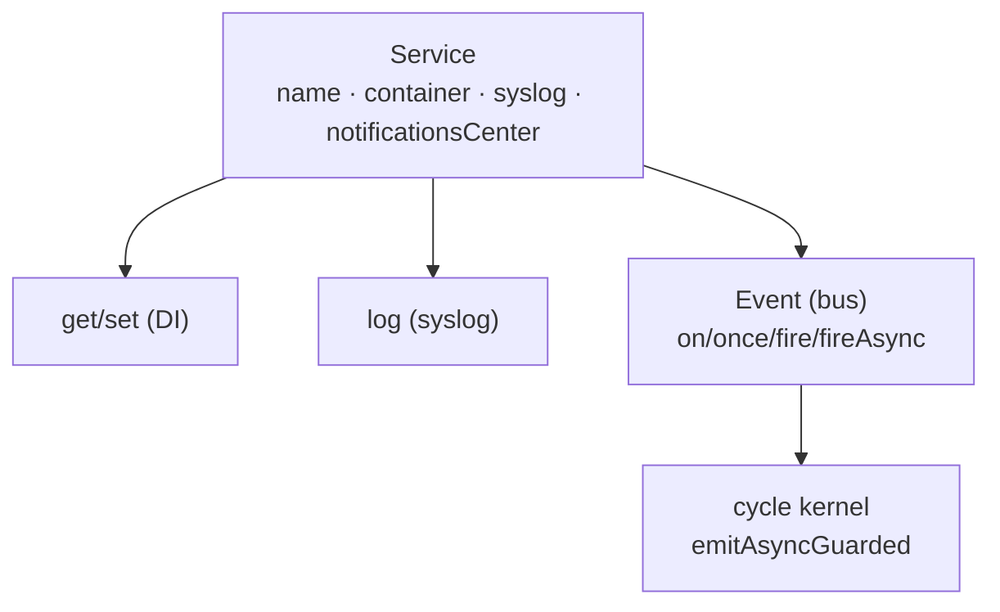

# Service et événements

> `Service` est la brique de base de presque tout dans Nodefony : services, modules, kernels,
> contrôleurs en héritent. Elle apporte trois choses : l'accès au container (DI), un journal (`log`), et
> un bus d'événements. Ancré sur le code (`src/nodefony/src/Service.ts`, `Event.ts`).

## Schéma général



## Lexique

| Terme                | Sens                                                                |
| -------------------- | ------------------------------------------------------------------- |
| Service              | Classe de base : DI + log + événements.                             |
| notificationsCenter  | Le bus d'événements d'un service (`Event`).                         |
| Event                | Émetteur maison au-dessus de `EventEmitter` Node.                   |
| `fire` / `fireAsync` | Émettre un événement (synchrone / en attendant les handlers async). |
| Bus partagé          | Un `Event` transmis à plusieurs services (ex. celui d'un module).   |
| PDU                  | Unité de log structurée produite par `log` (voir syslog).           |

## Qu'est-ce qu'un Service — et pourquoi un bus d'événements

Un serveur est fait de composants qui doivent se parler sans se connaître : le kernel signale « je
démarre », un module réagit ; une requête signale « terminée », le profiler collecte. Coupler ces
composants en dur serait rigide. Le **bus d'événements** découple : on émet un signal, qui veut réagit
s'abonne. `Service` intègre ce bus + l'accès aux dépendances + le log, pour que chaque brique parte
avec le même socle.

## La vision Nodefony

`Service` (`Service.ts:43`) porte `name`, `container` (DI), `kernel`, `syslog`, `options`, et un bus
privé `#nc: Event` exposé en lecture par `notificationsCenter` (`Service.ts:51,57`). Le constructeur
(`Service.ts:79`) réutilise le container fourni ou en crée un, récupère kernel/syslog, et pour le bus :
un `Event` **partagé** si on lui en passe un (`#sharedNc=true`, `:106`), aucun si `false`, sinon un bus
dédié (`:116`). L'accès DI se fait par `get<T>(name)` (→ `null` si absent/détaché, `:427`), avec
`set`/`remove`/`has`/`getParameters`. Le log passe par `log(pci, severity?, msgid?, msg?)` — msgid par
défaut = le nom du service (`:209`).

Le bus `Event` (`Event.ts:117`) étend `EventEmitter` Node : `fire` = `emit` synchrone (`:186`),
`fireAsync`/`emitAsync` attendent les handlers **en séquence** (pas de `Promise.all` — par design,
`:200`), et `emitAsyncGuarded` isole chaque listener (try/catch + timeout optionnel) et collecte
`{results, errors, stopped}` (`:257`). C'est `emitAsyncGuarded` qui porte le cycle de vie du kernel
(un hook lent ou qui throw ne casse pas le boot).

## Cycle de vie d'un service

`new Service(...)` → `initSyslog(...)` démarre le journal (`Service.ts:159`) → le service vit, émet et
écoute → `clean()` retire ses écouteurs **trackés** du bus partagé, vide le suivi et détache
syslog/nc/container/kernel (`:179`). Après `clean()`, toute API héritée jette (garde-fou anti-usage
après destruction). Les écouteurs enregistrés via l'API du service sont suivis dans `#trackedListeners`
(`:53`) → `clean()` ne laisse **aucune** fuite sur un bus partagé.

## Émettre et écouter

```typescript
// écouter (tracké → nettoyé par clean())
this.on("onRequest", (ctx) => {
  /* … */
});

// émettre
this.fire("onRequest", context); // synchrone
await this.fireAsync("onReady"); // attend les handlers async, en séquence
```

Config déclarative : les clés `onXxx` des options sont auto-attachées comme écouteurs
(`attachConfiguredListeners`, `Service.ts:112` ; `Event.settingsToListen`, `Event.ts:147`).

## Performance & mémoire

- `emitAsync`/`emitAsyncGuarded` court-circuitent si `listenerCount() === 0` (**0 alloc**,
  `Event.ts:208,264`) — un hook optionnel sans abonné ne coûte rien.
- `emitAsync` n'`await` que si le handler retourne un thenable (`:218`) → hooks synchrones = 0 microtask.
- `emitAsyncGuarded` : 1 timer + 1 Promise **par listener** uniquement si `timeoutMs > 0` ; timer
  `unref()` ; `catch(()=>{})` anti unhandled-rejection (`:268-290`).
- Écouteurs trackés → `clean()` les retire du bus partagé (anti-fuite, `Service.ts:181`).

## Pièges (symptôme → cause → correction)

| Symptôme                            | Cause                                              | Correction                                                  |
| ----------------------------------- | -------------------------------------------------- | ----------------------------------------------------------- |
| Fuite d'écouteurs à chaque instance | Écouteur config posé direct sur un bus **partagé** | Passer par `this.on` (tracké), pas le bus brut              |
| `off()` ne retire pas l'écouteur    | `listen()` bind le listener (référence différente) | Retirer via le dispatcher renvoyé, pas l'original           |
| Latence sur le hot path             | `emitAsyncGuarded` dans le chemin HTTP/WS          | Réservé au cycle de vie ; hot path = gardes `listenerCount` |
| Handlers async non parallèles       | `emitAsync` est **séquentiel** par design          | Attendu ; paralléliser dans le handler si besoin            |

## Tests & couverture

La brique de base est très couverte : **159 cas** sur 3 fichiers (`src/nodefony/src/tests/`) —
`Service` (106), `Event` (44, le bus) et `EventGuarded` (9, l'isolation par timeout du cycle de vie).
Couverture quasi totale (`Service.ts` ~98 %, `Event.ts` 100 %). Photo régénérée depuis vitest
(`npm run coverage`).

## Pour aller plus loin

- Injection de dépendances → [injection-portees](../../../docs/architecture/injection-portees.md)
- Journalisation (PDU, sévérités) → `src/nodefony/docs/syslog.md`
- Cycle de boot (qui émet les phases) → [cycle-boot-kernel](../../../docs/architecture/cycle-boot-kernel.md)
