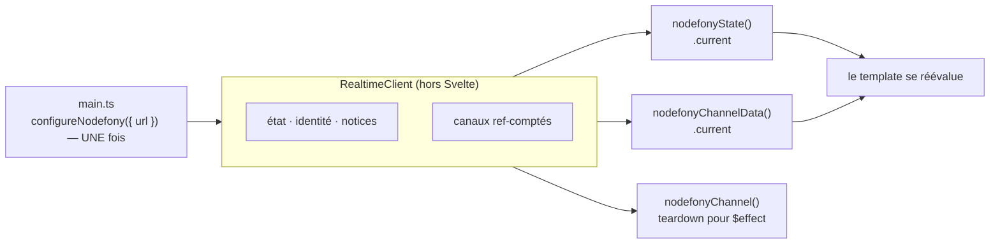

# Réactivité Svelte — `nodefony/svelte`

> Le subpath `nodefony/svelte` branche un composant Svelte 5 sur la socket Nodefony **sans une ligne
> de glue** : une configuration de module au démarrage, puis des valeurs qui se lisent `.current` et
> dont l'abonnement est rendu par le système d'effets. Elles ne gèrent **que** l'abonnement — ouvrir
> et maintenir la connexion reste le travail du client, décrit dans [Client isomorphe](client.md).
> Le pendant exact de [Hooks React](react-hooks.md), [Composables Vue](vue-composables.md) et
> [Injection Angular](angular-services.md) : même surface, mêmes noms, mêmes garanties. Ancré sur
> `src/nodefony/src/client/svelte/index.ts`.

📍 [Documentation](../../../docs/index.md) › [Cœur — @nodefony/core](index.md) › **Réactivité Svelte**

## 🧠 Le modèle mental — une prise, N composants branchés dessus

Un composant vit et meurt au gré de la navigation. Une socket, elle, doit rester ouverte. La liaison
tient les deux bouts : **le fil est unique et long**, **les branchements sont nombreux et courts**.



## 📖 Lexique

| Terme                  | Ce que c'est ici                                                                                             |
| ---------------------- | ------------------------------------------------------------------------------------------------------------ |
| **rune**               | `$state`, `$derived`, `$effect` — une construction du COMPILATEUR, qui n'existe que dans un `.svelte`.       |
| **`.current`**         | La façon dont Svelte 5 lit une source réactive externe (`MediaQuery.current`). Lue dans un effet, elle suit. |
| **`createSubscriber`** | L'API publique de `svelte/reactivity` qui rend un objet ORDINAIRE réactif, sans aucune rune.                 |
| **effet**              | Ce qui relit une valeur quand elle change. Un template EST un effet.                                         |
| **teardown**           | La fonction qu'un `$effect` rend, et que Svelte appelle quand l'effet meurt.                                 |

## 🔴 Pourquoi ce subpath ne publie AUCUNE rune

`$state` et `$effect` **ne sont pas du JavaScript** : ce sont des instructions pour le compilateur de
Svelte, et elles n'existent que dans un fichier `.svelte` ou `.svelte.ts`. Les publier depuis un
paquet npm imposerait que le consommateur compile notre code — or le plugin Svelte **ne compile pas
`node_modules`** par défaut. Il faudrait donc une condition d'export `svelte`, une chaîne
`svelte-package`, et le paquet publié deviendrait sensible aux versions du compilateur. Pour un front
sur quatre.

La liaison passe par **`createSubscriber`** (`svelte/reactivity`), l'API publique faite exactement
pour ce cas : elle intègre un objet ordinaire — écrit en TypeScript, bâti par le même bundler que les
trois autres subpaths — au système d'effets, sans qu'aucune rune ne vive dans la bibliothèque
(`src/nodefony/src/client/svelte/index.ts:228`).

> ⚠️ **Cela ne restreint en rien ton application** : `$state`, `$derived`, `$effect` y fonctionnent
> normalement — c'est le plugin Svelte du builder Nodefony qui les compile. Les exemples ci-dessous
> en emploient.

## 🔴 L'écart à connaître : l'abonnement est PARESSEUX

C'est le **seul** écart de comportement entre les quatre fronts, et il est délibéré.

React, Vue et Angular s'abonnent **au montage**. Ici, l'abonnement est pris **au premier `.current` lu
dans un effet**, et rendu **quand tous les effets qui le lisaient sont détruits**. Une valeur créée
mais jamais affichée ne s'abonne donc jamais.

C'est le contrat de `createSubscriber`, et le comportement des primitives réactives de Svelte
lui-même. Il est **mesuré**, pas supposé : un composant qui ne lit rien ne produit aucune trame
`subscribe` (`src/nodefony/src/tests/clientSvelte.test.ts:1`).

**Quand l'abonnement doit être pris quoi qu'il arrive** — une présence, un effet de bord côté serveur
— prendre {@link nodefonyChannel} dans un `$effect` : cette forme-là n'est pas paresseuse.

Un second écart, en votre faveur celui-là : quand un canal change, Svelte prend le **nouvel**
abonnement avant de rendre l'ancien (`+b` puis `-a`), là où Vue et Angular libèrent d'abord.

## 🚀 Démarrage rapide

### 1. La configuration, au démarrage

```ts
// frontend/src/main.ts
import { mount } from "svelte";
import { configureNodefony } from "nodefony/svelte";
import App from "./App.svelte";

const el = document.getElementById("app");
if (!el) throw new Error("#app not found");

configureNodefony({ url: "/api/live/realtime" });
mount(App, { target: el });
```

Svelte n'a pas de contexte applicatif comparable à React : `setContext` ne se pose qu'à
l'initialisation d'un composant, et ne couvrirait donc pas les liaisons appelées ailleurs. La
politique s'écrit ici comme ce qu'elle est en Svelte — une configuration de module
(`src/nodefony/src/client/svelte/index.ts:171`).

L'adresse est écrite **ici, et nulle part ailleurs**. Sans `url` ni `client`, la configuration refuse :
le framework ne devine aucune adresse, une adresse devinée marche en développement et se trompe en
production.

### 2. La page

```svelte
<script lang="ts">
  import {
    nodefony,
    nodefonyChannelData,
    nodefonyState,
  } from "nodefony/svelte";

  interface Evenement {
    texte: string;
    ts: number;
  }

  const live = nodefony();
  // `.current` se lit tel quel ; `$derived` lui donne un nom local si tu préfères.
  const etat = nodefonyState();
  const dernier = nodefonyChannelData<Evenement>("live:events");

  const dire = (texte: string) => live.emit("live:dire", { texte });
</script>

<p>connexion : {etat.current}</p>
{#if dernier.current}<p>{dernier.current.texte}</p>{/if}
<button onclick={() => dire("bonjour")}>envoyer</button>
```

Il n'y a **rien à libérer** : quand le composant meurt, plus aucun effet ne lit la valeur, et
l'abonnement est rendu. C'est la différence visible avec un câblage à la main, où il fallait tenir une
liste de fonctions de libération et n'en oublier aucune.

### 3. S'abonner sans rien afficher

```svelte
<script lang="ts">
  import { nodefonyChannel } from "nodefony/svelte";

  let messages = $state<string[]>([]);
  // `nodefonyChannel` REND son teardown — exactement ce que `$effect` attend.
  // Forme NON paresseuse : l'abonnement est pris qu'on affiche ou non.
  $effect(() =>
    nodefonyChannel("live:salon", (m) => {
      messages = [...messages, String(m)];
    }),
  );
</script>
```

### 4. Un canal qui change

```svelte
<script lang="ts">
  import { nodefonyChannelData } from "nodefony/svelte";

  let salle = $state("salon:general");
  // L'abonnement SUIT la valeur : le nouveau canal est pris AVANT que l'ancien
  // soit rendu, donc sans le moindre trou.
  const messages = $derived(nodefonyChannelData(salle));
</script>

<p>{messages.current}</p>
```

### 5. Quand l'application possède son cycle de connexion

```ts
// La socket fournie l'emporte sur `url`, et son cycle n'est pas touché :
// ni `connect`, ni `disconnect`.
configureNodefony({ client: maSocket });
```

## 🧰 Les liaisons

Les **valeurs** se lisent `.current` et se libèrent seules. Les trois liaisons à `onMessage` rendent
un **teardown**, à donner à `$effect`.

| Liaison                             | Rend                                 | À quoi ça sert                                               |
| ----------------------------------- | ------------------------------------ | ------------------------------------------------------------ |
| `configureNodefony(opts)`           | —                                    | la politique : socket de la page, connexion lancée           |
| `nodefony()`                        | `RealtimeClient`                     | l'échappatoire : `emit`, `request`, `mutate`, `ping`         |
| `nodefonyState()`                   | `Reactive<RealtimeState>`            | afficher l'état, griser un bouton pendant une reconnexion    |
| `nodefonyIdentity()`                | `Reactive<RealtimeIdentity \| null>` | savoir qui est connecté — sans appeler `/auth/me`            |
| `nodefonyChannel(canal, onMessage)` | `teardown`                           | réagir à chaque message — **non paresseux**                  |
| `nodefonyChannelData<T>(canal)`     | `Reactive<T \| null>`                | la dernière valeur — le cas le plus courant                  |
| `nodefonyAdaptiveChannel(…)`        | `teardown`                           | même chose, en cadence auto-ajustée                          |
| `nodefonyAdaptiveChannelData<T>(…)` | `{ data, intervalMs }`               | la dernière valeur **et** la cadence, les deux réactives     |
| `nodefonyChannelStats(canal)`       | `Reactive<MessageStats \| null>`     | débit et série d'un canal, pour un VU-mètre                  |
| `nodefonySnapshot()`                | `Reactive<SocketSnapshot \| null>`   | ce que la socket sait d'elle-même : canaux, trames, dernière |
| `nodefonySyslog(opts?)`             | `Reactive<unknown[]>`                | le flux de journal, anneau borné et filtre de sévérité       |
| `nodefonyNotifications(onNotice)`   | `teardown`                           | les notices normalisées — à monter **une seule fois**        |
| `nodefonyNoticeLog(opts?)`          | `Reactive<NodefonyNotice[]>`         | l'historique borné des incidents                             |

La déclaration de chacune se lit dans `src/nodefony/src/client/svelte/index.ts:247` et suivantes.

Sont aussi réexportés depuis ce subpath : `rateChannel`, `parseRate`, `isRateChannel` (fabriquer un
nom de canal cadencé), et les types `RealtimeIdentity`, `RealtimeState`, `NodefonyNotice`,
`SocketSnapshot`, `Reactive<T>` — pour qu'un composant puisse **nommer** ce qu'il reçoit.

Les arguments « canal » et « cadence » acceptent une valeur ou une fonction : lue dans un `$derived`,
elle fait suivre l'abonnement.

## 🏗️ Cycle de vie d'un abonnement

```
premier .current lu   → subscribe (si premier consommateur du canal)
message reçu          → .current change → le template se réévalue
canal qui change      → subscribe du NOUVEAU, puis unsubscribe de l'ancien
reconnexion           → le client rejoue TOUS les abonnements, sans rien à faire
plus aucun lecteur    → unsubscribe (si dernier consommateur)
```

Ce qui est **partagé** et ne dépend pas de Svelte — le comptage de références, le rejeu après
reconnexion, l'appariement `on`↔`subscribe` — vit dans le socle agnostique et est prouvé une fois
pour les quatre fronts. Ce qui est **propre à Svelte** — l'instant de l'abonnement, celui de sa
restitution, l'ordre quand un canal change — est prouvé dans
`src/nodefony/src/tests/clientSvelte.test.ts:1`.

La socket, elle, **n'est jamais coupée par un composant**. Elle appartient à la page : la fermer au
démontage trancherait les requêtes en vol des autres consommateurs.

## ⚠️ Pièges (symptôme → cause → correction)

| Symptôme                                                    | Cause                                                                  | Correction                                                                    |
| ----------------------------------------------------------- | ---------------------------------------------------------------------- | ----------------------------------------------------------------------------- |
| `nodefony() : configureNodefony() n'a pas été appelé`       | La configuration manque, ou vient APRÈS `mount()`                      | Appeler `configureNodefony({ url })` avant `mount()` dans `main.ts`           |
| **Rien n'arrive, et aucune trame `subscribe` ne part**      | Personne ne lit `.current` — l'abonnement est paresseux                | Lire la valeur dans le template, ou prendre `nodefonyChannel` dans `$effect`  |
| La configuration lève au démarrage                          | Ni `url` ni `client` fourni — le framework ne devine aucune adresse    | Passer l'URL du serveur temps réel                                            |
| `mount(...) is not available on the server`                 | Svelte a été résolu en construction SERVEUR (test, SSR)                | Résoudre `svelte` en condition `browser` — cf `vitest.config.ts` du cœur      |
| L'état reste `disconnected`                                 | Le serveur n'écoute pas cette adresse, ou la socket a été coupée       | Vérifier l'adresse, et qu'aucun code n'appelle `disconnect()`                 |
| `Module 'nodefony' has no exported member 'RealtimeClient'` | Condition d'export `browser` inactive dans le `tsconfig.json` de l'app | Importer depuis `nodefony/client`, ou ajouter `customConditions: ["browser"]` |
| Notices en double                                           | `nodefonyNotifications` monté dans plusieurs composants                | Un seul appel, au shell de l'application                                      |
| Une exception dans un rappel disparaît sans trace           | Le dispatch du client isole les erreurs de handler                     | Envelopper le corps du rappel dans son propre `try`/`catch`                   |

## 🧪 Tests & couverture

- **Les règles du temps réel** (comptage de références, rejeu après reconnexion, dernier reçu gagne,
  anneaux, filtres) sont prouvées **une fois pour les quatre fronts** dans
  `src/nodefony/src/tests/clientObserve.test.ts`.
- **La traduction Svelte** est prouvée dans `src/nodefony/src/tests/clientSvelte.test.ts`, sur de
  **vrais composants compilés** montés puis démontés : l'instant de l'abonnement, sa restitution au
  démontage (comptée sur les trames émises, seul juge d'une fuite), le comportement paresseux, et
  l'ordre lors d'un changement de canal.
- **Pourquoi des fixtures `.svelte`** : les runes et les effets n'existent qu'après compilation. Un
  harnais qui les imiterait mesurerait le harnais, alors que tout ce qui est en jeu ici est décidé par
  le système d'effets réel.
- **La surface publiée** est tenue par `clientSubpathSurface.types.test.ts` : les quatre subpaths
  parlent des mêmes types, pas de jumeaux.

Couverture : `npm run coverage` dans `src/nodefony`.

## 🔗 Pour aller plus loin

- ⬆️ **Retour au hub** : [@nodefony/core — vue d'ensemble](index.md) · [Toute la documentation](../../../docs/index.md)
- 🧭 **Pages sœurs** : [Client isomorphe](client.md) — la socket, le transport, la reconnexion, les
  rôles · [Hooks React](react-hooks.md) · [Composables Vue](vue-composables.md) ·
  [Injection Angular](angular-services.md) · [Journalisation](syslog.md)
- Le vocabulaire commun aux deux bords du fil → [Vocabulaire de la socket](../../packages/@nodefony/realtime/docs/vocabulaire.md)
- Le module serveur qui pousse les canaux → [@nodefony/realtime](../../packages/@nodefony/realtime/docs/index.md)
- Qui sert et reconstruit ton interface → [@nodefony/frontend](../../packages/@nodefony/frontend/docs/index.md)
