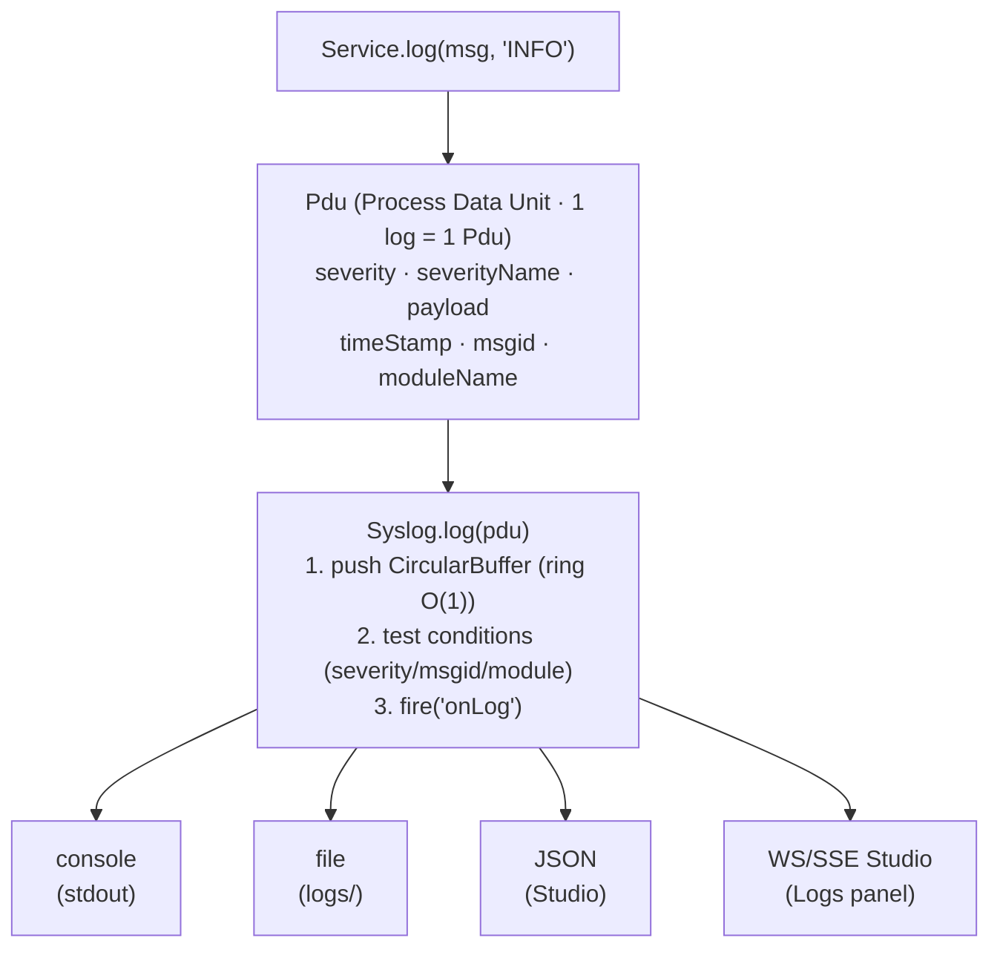

# Syslog — Logging structuré RFC 5424

> Système de logs structurés de Nodefony. Conforme RFC 5424 (BSD syslog). Stockage ring buffer O(1) en mémoire + transports pluggables (console, file, JSON, etc.).

## Vue d'ensemble



## Composants

| Classe | Fichier | Rôle |
|--------|---------|------|
| **`Syslog`** | `src/nodefony/src/syslog/Syslog.ts` | Hub central — buffer + filtrage + dispatch transports |
| **`Pdu`** | `src/nodefony/src/syslog/Pdu.ts` | 1 entrée de log (Process Data Unit) |
| **`CircularBuffer`** | `src/nodefony/src/syslog/CircularBuffer.ts` | Ring buffer FIFO O(1) — taille fixe |
| **Transports** | `src/nodefony/src/syslog/transports/` | Sortie console, file, JSON, formatter |

## Sévérités (RFC 5424 + extension SPINNER)

| # | Nom | Usage typique |
|---|-----|---------------|
| 0 | `EMERGENCY` | Système inutilisable |
| 1 | `ALERT` | Action immédiate requise |
| 2 | **`CRITIC`** (pas CRITICAL) | Conditions critiques |
| 3 | `ERROR` | Erreurs logique applicative |
| 4 | `WARNING` | Conditions d'alerte non bloquantes |
| 5 | `NOTICE` | Normal mais important |
| 6 | `INFO` | Informationnel |
| 7 | `DEBUG` | Debug |
| -1 | `SPINNER` | Animation CLI (non-RFC, extension Nodefony) |

⚠️ C'est `"CRITIC"` PAS `"CRITICAL"` — c'est le nom exact dans l'enum `SysLogSeverity`.

## Pdu — anatomie

```typescript
class Pdu {
  payload: unknown;              // contenu (string, Error, objet)
  severity: number;              // 6 (numérique pour comparaisons)
  severityName: string;          // "INFO" (string pour affichage)
  moduleName: string;            // "MyService" (qui a logué)
  msgid: string;                 // message id (catégorie, ex "AUTH")
  msg: string;                   // optionnel — détail libre
  timeStamp: number;             // Date.now()
  pid: number;                   // process.pid
  date: Date;                    // dérivé de timeStamp
}
```

## Création via `Service.log()`

```typescript
class MyService extends Service {
  doSomething() {
    // Variantes
    this.log("simple message");                            // severity défaut (NOTICE/INFO selon config)
    this.log("info message", "INFO");
    this.log(error, "ERROR", "AUTH", "user login failed"); // 4 args max
    this.spinlog("Chargement...");                          // severity SPINNER
  }
}
```

Toutes ces variantes retournent un `Pdu`. Le Syslog interne du service (`this.syslog`) le stocke + fire l'event `onLog`.

## Transports — branchement

```typescript
const syslog = new Syslog(/* settings */);

// Default settings
syslog.on("onLog", (pdu: Pdu) => {
  // Transport custom : formater + envoyer où on veut
  console.log(`[${pdu.severityName}] ${pdu.payload}`);
});

// Transport intégré : console formatée
syslog.attachConsole();

// Transport file
syslog.attachFile("/var/log/nodefony.log");

// Transport JSON (pour pipeline ELK / Loki / etc.)
syslog.attachJSON("/var/log/nodefony.json.log");
```

## Conditions — filtrage par severity / msgid / module

```typescript
// Ne logger en console QUE les ERROR et au-dessus, sauf module "ROUTER" qui tout
syslog.setConditions({
  console: {
    severity: ["ERROR", "CRITIC", "ALERT", "EMERGENCY"],
    exclude: { moduleName: ["NOISY_MODULE"] },
  },
});
```

Les conditions sont matchées AVANT de fire `onLog`. Économie CPU + bruit log.

## CircularBuffer — ring buffer O(1)

Stocke les N derniers logs en mémoire (configurable, défaut ~1000). Permet de :

- Studio (Phase 10) — afficher les logs récents sans relire les fichiers
- Debug : `kernel.syslog.buffer.toArray()` → snapshot rapide
- SSE Logs panel — stream live (Studio)

**Implémentation** : tableau de taille fixe + head/tail pointers. Push = O(1), pas de shift O(N).

## SSE — Studio Logs panel

Le module `@nodefony/studio` expose un endpoint SSE `/nodefony/api/logs/stream` qui pipe l'event `onLog` vers le frontend React. Cf [`feedback_sse_http2_request_close.md`](../../.claude/projects/.../memory/feedback_sse_http2_request_close.md) (mémoire IA) pour le piège HTTP/2 `req.on("close")` qui a été fixé 2026-05-20.

## Cycle de vie

```typescript
syslog.reset();        // vide le ring buffer + reset compteurs
syslog.clean();        // libère transports + reset
```

À `Service.clean()`, le syslog du service peut être réinitialisé selon le flag :

```typescript
svc.clean();       // syslog conservé
svc.clean(true);   // syslog.reset() appelé
svc.clean(false);  // syslog conservé sans reset
```

## Initialisation par environnement

```typescript
svc.initSyslog("development", true);   // verbose, DEBUG OK
svc.initSyslog("production", false);   // INFO+ seulement
svc.initSyslog("test", false);         // silencieux ou WARN+
```

`initSyslog()` applique les **conditions par défaut** selon l'environnement :
- `dev` : DEBUG visible si `debug=true`
- `prod` : NOTICE / INFO selon config
- `test` : silencieux par défaut pour ne pas polluer les tests

## Pattern type — log + audit log

```typescript
@AuditLog({ action: "USER_CREATE", severity: "INFO" })
async createUser(@Body() dto: CreateUserDto) {
  this.log(`Creating user ${dto.email}`, "INFO");  // log normal
  const user = await this.userService.create(dto);
  // @AuditLog fire automatiquement post-réponse via onAfterResponse hook
  return user;
}
```

⚠️ **BUG-002** (cf BUG_REPORT) : `onAfterResponse` perd la bulle ALS — `@AuditLog` ne voit pas `requestId`/`user`. Fix `AsyncResource.bind` prévu avant P6.

## Format Pdu (depuis 2026-05-17)

Format texte : `HH:MM:SS.mmm SEVERITY MSGID : payload`

Exemple :
```
14:32:01.247 INFO  HTTP-KERNEL : Server Listen on http://127.0.0.1:5151
14:32:01.248 INFO  ROUTER       : route + [GET] /nodefony/test → @test/DefaultController.index
14:32:01.350 ERROR FIREWALL     : Auth failed for user@example.com
```

Tous les filtres `start-nodefony-server` skill fonctionnent sur ce format.

## Gotchas

| Symptôme | Cause | Fix |
|----------|-------|-----|
| `Cannot find "CRITICAL"` | C'est `"CRITIC"` | Utiliser `"CRITIC"` ou `SysLogSeverity.CRITIC` |
| Log perdu après `clean()` | `syslog=null` après clean | Pdu standalone créé en fallback (perdu) — ne pas logger après clean |
| `pdu.severity === "INFO"` false | severity = numérique | Comparer `pdu.severityName === "INFO"` |
| Logs verbeux en prod | initSyslog dev | Bien passer `"production"` au boot |
| ANSI codes pollutent les greps | Console transport ajoute couleurs | `sed 's/\x1b\[[0-9;]*m//g'` sur le tail |

## Liens

- **Code source** : `src/nodefony/src/syslog/Syslog.ts`, `Pdu.ts`, `CircularBuffer.ts`
- **Interface** : `src/nodefony/src/types/ISyslog.ts`
- **MEMORY.md** : `src/nodefony/src/syslog/MEMORY.md`
- **README.md** : `src/nodefony/src/syslog/README.md`
- **Service.log()** : [`service.md`](./service.md)
- **Studio Logs panel** : `@nodefony/studio/frontend/src/pages/Logs.tsx`
- **Graphe symbolique** : `jq '.symbols.Syslog' .ai/symbols.json`, `jq '.symbols.Pdu' .ai/symbols.json`
