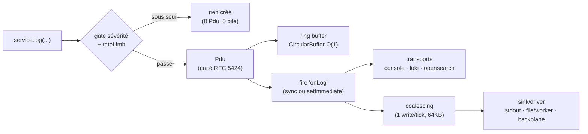

# Journalisation (Syslog)

> Tous les logs de Nodefony passent par un hub unique, `Syslog`, qui produit des unités structurées
> (`Pdu`), les met dans un **ring buffer** O(1), les **coalesce** en une écriture par tick, et les
> diffuse à deux étages distincts : des **transports** (fan-out : console, Loki, OpenSearch…) et un
> **sink/driver** final (stdout, ou un fichier par worker, ou le backplane multi-pod). Les sévérités
> suivent la **RFC 5424**. Ancré sur `src/nodefony/src/syslog/Syslog.ts` et `Pdu.ts`.

## Le modèle mental — un pipeline à étages



Deux idées structurantes à retenir avant tout :

1. **Rien n'est alloué sous le seuil.** La gate de sévérité (et le rateLimit) coupe _avant_ la création
   du `Pdu` — un `log(..., "DEBUG")` en prod ne coûte quasi rien.
2. **Transports ≠ sink.** Les _transports_ sont un fan-out d'observabilité (plusieurs destinations
   nommées). Le _sink/driver_ est l'unique cible d'écriture texte finale, derrière le coalescing. On les
   règle indépendamment.

## Lexique

| Terme             | Sens                                                                          |
| ----------------- | ----------------------------------------------------------------------------- |
| PDU               | _Process Data Unit_ : une entrée de log structurée (`Pdu`).                   |
| Sévérité RFC 5424 | Niveau normalisé (`EMERGENCY=0` … `DEBUG=7`).                                 |
| Transport         | Destination d'observabilité (console, fichier, Loki, syslog, http) — fan-out. |
| Sink / driver     | Cible d'écriture texte finale (stdout, fichier par worker, backplane).        |
| Ring buffer       | Tampon circulaire à taille fixe, O(1) (pas de `Array.shift()` O(n)).          |
| Coalescing        | Regrouper les écritures d'un même tick en un seul `write()`.                  |
| Backplane         | Agrégation des logs de plusieurs process/pods vers un point commun.           |

## Qu'est-ce que la journalisation ici — et pourquoi ça compte

Logger paraît trivial, mais dans un serveur c'est un **point chaud** : appelé à chaque requête, il ne
doit ni allouer inutilement, ni bloquer l'event-loop, ni perdre de lignes, ni tout mélanger en
multi-pod. Et il doit rester **exploitable** : niveaux normalisés, corrélation par requête
(`requestId`), sorties multiples (terminal en dev, Loki/OpenSearch en prod). Chaque choix ci-dessous
répond à l'une de ces contraintes.

## La `Pdu` et les 8 sévérités (RFC 5424)

`Syslog` hérite d'`Event` (`Syslog.ts:628`) ; `log()` crée une `Pdu` (`Pdu.ts`), la pousse dans le ring
et fire `"onLog"`. Les **8 sévérités RFC 5424** sont l'enum `SysLogSeverity` (`Pdu.ts:27-37`) :
`EMERGENCY=0, ALERT=1, CRITIC=2, ERROR=3, WARNING=4, NOTICE=5, INFO=6, DEBUG=7`. Le nom canonique est
**`CRITIC`** (pas `CRITICAL`, `Pdu.ts:19,30`), avec mapping bidirectionnel O(1) et `translateSeverity`
(`Pdu.ts:51`) qui **jette** si le nom est invalide. Le `pid` est le `procid` RFC 5424 (`Pdu.ts:96`) ; le
`requestId` corrèle les lignes d'une même requête.

```typescript
this.log("message"); // INFO par défaut
this.log(err, "ERROR"); // sévérité explicite
this.log(data, "DEBUG", "MON_MSGID"); // msgid personnalisé (défaut = nom du service)
```

Helpers dérivés : `error/warn/info/debug/trace/print`. Format via `wrapper()` :
`HH:MM:SS.mmm SEVERITY MSGID : payload`, colonnes alignées (`SEVERITY_WIDTH=7`, `MSGID_WIDTH=18`),
couleurs ANSI par sévérité **désactivées hors TTY**.

## Le ring buffer — mémoire bornée, relecture O(1)

Le ring est un `CircularBuffer<Pdu>` (`Syslog.ts:273`) de capacité `maxStack` (défaut **100**,
`:367,:722`). Un tampon circulaire donne un push/évincement **O(1)** — là où un `Array.shift()` serait
O(n) à chaque ligne. Le getter `ringStack` rend les Pdu en ordre **FIFO** (plus ancien → plus récent,
`:737`), ce qui alimente le _journal de boot_ (le kernel compte ERROR/WARNING dans le ring) et les
écrans de diagnostic. La capacité est réglable **au boot uniquement** (`setMaxStack`, lu depuis
`config.log.maxStack`, `:793-805`) : la changer à chaud reconstruirait le ring.

## Les transports — le fan-out d'observabilité

Les **transports** (`ITransport`) sont nommés `console/file/loki/syslog/http` et **ajoutables/
retirables à chaud** (`addTransport` `:1415`, `removeTransport` `:1435`) : on branche Loki en prod sans
toucher au reste. À chaque log passé, `_fireTransports(pdu)` les diffuse — mais **seulement s'il y en a**
(`this._transports.length > 0`, `:1248,:1282`). Un abonnement fin est possible via `listenWithConditions`
(`:1378`) : n'écouter que certaines sévérités ou `msgid` (ex. « pousser vers PagerDuty uniquement les
`CRITIC` »).

## Le sink/driver — l'écriture finale (et le levier de perf prouvé)

Derrière le coalescing, un **seul** sink texte reçoit les lignes (`ILogSink`, `Syslog.ts:83`) : quatre
méthodes — `writeOut` (classe-stdout, non bloquant), `writeErr` (classe-stderr, sévérité ≤ 3, durable),
`flushSync` (secours **synchrone** au `process.exit`, jamais async), `close` (libère les fd, idempotent).

- **Défaut : `_stdoutSink`** (`:98`) = comportement historique **exact**, isomorphe (navigateur :
  `console.*` + strip ANSI) → **0 régression** quand rien n'est configuré.
- **`file` par worker** : un fd async **par worker cluster** → **0 lock d'inode partagé**. Le commentaire
  du code le désigne comme _le goulet prouvé_ : **+28 % RPS** une fois levé (`:77-82`). C'est le driver à
  activer sous charge en cluster.
- **`NULL_LOG_SINK`** (`:113`) : noop total, pour les **bancs** (mesurer le plafond sans I/O de log).
- **Mute à chaud** (`:123-134`, `setMuted` `:1699`) : couper la console sans redémarrer ni changer la
  config ; préserve le **nom** du sink (≠ bascule NULL), défaut `false` → surcoût = un test booléen.

Basculer de driver (`_setLogSink`, `:154`) **flush** les lignes en attente **puis** `close` l'ancien
(libère le fd d'un `FileSink`) avant de switcher — jamais de ligne perdue, jamais de fd fuité.

## Performance & mémoire

- **Coalescing** : les écritures d'un même tick sont regroupées en **un seul `write()`** via
  `setImmediate` (un seul par tick quel que soit le nombre de logs, `Syslog.ts:176`), avec un cap
  `FLUSH_BYTES = 64 KB` qui borne la rétention mémoire d'un tick (`:55,:170`). Lossless (flush à chaque
  tick), 0 sampling.
- **Gate d'entrée par sévérité** : sous le seuil, **ni `Pdu` ni pile** ne sont créés (le coût du log
  verbeux disparaît sur le hot path).
- **`rateLimit`/`burstLimit`** (`:1211`, config `:239,:368`) : protection anti-flood (une boucle qui log
  10 k/s ne noie pas la sortie).
- **Mode async** : si activé, `"onLog"` est fire sur `setImmediate()` → libère le hot path de la
  requête, le fan-out se fait au tick suivant (`:1152`).

## Backplane multi-pod (observabilité honnête en cluster)

En cluster/Kubernetes, un driver de vue **local** (memory/file) ne relit que **son** process. Nodefony
ne prétend pas le contraire : le kernel émet un `NOTICE` d'avertissement au boot complet quand une vue
locale est configurée en contexte multi-pod (il ne connaît ni le nombre de replicas, ni la destination
d'agrégation — secret d'infra, 12-factor). Le **backplane** (driver HTTP dédié, testé par
`LogBackplaneHttp.test.ts`) agrège les logs de plusieurs process vers un point commun quand on veut une
vue globale sans dépendre d'un Loki externe.

## Tests & couverture

Le logging est l'un des sous-systèmes les plus testés du cœur : **230 cas** répartis sur 5 fichiers
(`src/nodefony/src/tests/`) — `Syslog.test.ts` (145, le hub), `LogDriver.test.ts` (48, les drivers de
vue), `LogSink.test.ts` (13, sinks/coalescing), `topology.test.ts` (13, câblage multi-transport) et
`LogBackplaneHttp.test.ts` (11, l'agrégation multi-pod). La couverture des deux fichiers cœur est bonne
(voir la carte : `Syslog.ts` ~83 % lignes, `Pdu.ts` ~91 %). Compteurs et couverture ci-dessous sont une
**photo** régénérée depuis vitest — la vérité vit dans `npm run coverage` (cœur `nodefony`).

## Pièges (symptôme → cause → correction)

| Symptôme                                 | Cause                                       | Correction                                              |
| ---------------------------------------- | ------------------------------------------- | ------------------------------------------------------- |
| `"CRITICAL"` non reconnu (throw)         | Le nom canonique est `CRITIC`               | Utiliser `CRITIC` (ou le numéro `2`)                    |
| Couleurs ANSI dans un fichier de log     | Sortie non-TTY mal détectée                 | Les couleurs sont gatées hors TTY (vérifier le driver)  |
| Logs `DEBUG` absents                     | Gate de sévérité sous le seuil configuré    | Baisser le seuil (`config.log`)                         |
| Débit d'écriture qui plafonne en cluster | Sink `stdout` partagé (lock d'inode)        | Driver `file` par worker (+28 % RPS)                    |
| Vue « incomplète » en multi-pod          | Driver de vue **local** (ne lit que ce pod) | Backplane, ou agrégation externe (Loki/OpenSearch)      |
| Lignes perdues à l'arrêt                 | `exit` avant flush                          | `flushSync` du sink est appelé en secours (best-effort) |
| Sortie noyée par une boucle qui log      | Pas de garde de débit                       | Activer `rateLimit`/`burstLimit` (`config.log`)         |

## Pour aller plus loin

- Service & événements (base de Syslog, le bus `onLog`) → [service](./service.md)
- Cycle de boot (le _journal de boot_ lu depuis le ring) → [cycle-boot-kernel](../../../docs/architecture/cycle-boot-kernel.md)
- Observabilité HTTP (profiler, admin, traces) → `src/packages/@nodefony/http/docs/index.md`
