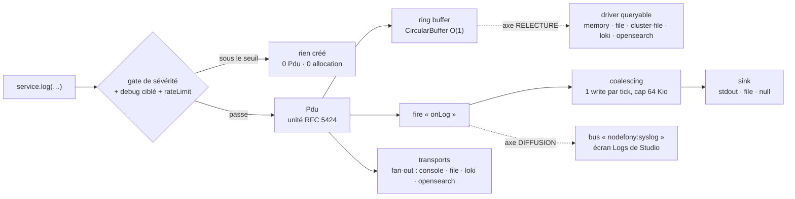

# Journalisation (Syslog)

> Tout ce que Nodefony écrit — boot, requête, erreur, ligne de ton code — passe par **un seul hub**,
> `Syslog`. Il fabrique une unité structurée (`Pdu`, RFC 5424), la range dans un tampon circulaire
> O(1), la diffuse à N destinations d'écriture, et la rend **relisable et filtrable** par un driver
> de requête. Trois axes indépendants : où ça s'écrit, où ça se relit, ce qui part en direct.
> Ancré sur `src/nodefony/src/syslog/`.

📍 [Documentation](../../../docs/index.md) › [@nodefony/core](index.md) › **Journalisation (Syslog)**

## 🧠 Le modèle mental — un log, trois axes

Un logger naïf a une seule question : « où j'écris ? ». Un serveur en a **trois**, et les confondre
est la source de la moitié des malentendus sur les logs :

1. **ÉCRIRE** — la ligne de texte part quelque part (terminal, fichier, nulle part).
2. **RELIRE** — plus tard, un humain cherche « toutes les ERROR de la requête `abc` ».
3. **DIFFUSER** — un écran de supervision veut les lignes **maintenant**, en direct.

Nodefony les traite comme trois axes **orthogonaux** : on peut écrire sur `stdout`, relire depuis
Loki, et diffuser vers Studio — les trois réglages ne se contraignent pas.



Trois idées à retenir avant tout le reste :

- **Rien n'est alloué sous le seuil.** La gate de sévérité coupe **avant** la création du `Pdu` : un
  `log(…, "DEBUG")` en production ne coûte qu'un test d'entier.
- **Écriture = fan-out, relecture = un seul driver.** Une ligne peut partir vers 3 transports à la
  fois ; on ne relit que dans **une** destination à la fois (celle qui est active).
- **Le ring buffer n'est pas un fichier.** C'est une fenêtre glissante en RAM (100 entrées par
  défaut) — parfaite pour « qu'est-ce qui vient de se passer », inutile pour « la semaine dernière ».

## 📖 Lexique

| Terme                 | Sens                                                                                                 |
| --------------------- | ---------------------------------------------------------------------------------------------------- |
| **PDU**               | _Protocol Data Unit_ : une entrée de log structurée (`Pdu`) — payload + sévérité + horodatage + IDs. |
| **Sévérité RFC 5424** | Niveau normalisé de 0 (`EMERGENCY`) à 7 (`DEBUG`). Plus le chiffre est petit, plus c'est grave.      |
| **msgid**             | Catégorie du message (RFC 5424 `MSGID`) — vaut par défaut le **nom du service** émetteur.            |
| **procid**            | Le PID du process émetteur (champ `pid`) — sert à grouper par worker en cluster.                     |
| **requestId**         | Identifiant de la requête en cours, capté depuis l'ALS — corrèle toutes les lignes d'un appel.       |
| **Ring buffer**       | Tampon circulaire de taille fixe, push et éviction en O(1) (jamais de `Array.shift()` O(n)).         |
| **Coalescing**        | Regrouper les écritures d'un même tick d'event-loop en **un seul** appel système `write()`.          |
| **Sink**              | Cible finale de la **ligne de texte**, après coalescing : `stdout`, un fichier, ou rien.             |
| **Transport**         | Destination d'un **Pdu structuré** (console, fichier JSONL, Loki, OpenSearch) — c'est un fan-out.    |
| **Driver (query)**    | Destination **relisable** : celle qu'on interroge pour filtrer l'historique.                         |
| **Backplane**         | _Fond de panier_ : la couche qui rassemble les logs de plusieurs process/pods en une vue.            |
| **JSONL**             | _JSON Lines_ : un objet JSON par ligne — format ingérable tel quel par Promtail/Filebeat.            |
| **ALS**               | _AsyncLocalStorage_ : le stockage Node qui suit une requête à travers ses `await`.                   |
| **TTY**               | Un vrai terminal interactif (≠ un pipe, ≠ un fichier). Décide couleur et bufférisation.              |

## Qu'est-ce que journaliser dans un serveur — et pourquoi c'est un point chaud

Écrire une ligne semble trivial. Dans un serveur, c'est le code **le plus appelé de tout le
programme** : au moins une ligne par requête, souvent dix. Trois pièges classiques en découlent.

- **Le coût par requête.** Un `console.log` fait un appel système synchrone. À 2 000 requêtes par
  seconde, c'est 2 000 appels système par seconde consacrés à… regarder le serveur travailler.
  L'observabilité devient le goulet d'étranglement qu'elle est censée mesurer.
- **La ligne perdue.** Celle qui explique le crash est justement écrite **au moment** du crash. Un
  buffer non vidé à la sortie du process, et c'est la seule ligne qui manque.
- **La vue tronquée.** En cluster ou en Kubernetes, chaque process ne connaît que ses propres
  lignes. Relire « le » log sans agrégation, c'est relire **un pod sur dix** en croyant tout voir.

À cela s'ajoute une exigence de sécurité : un log est du texte qui **sort du process** (fichier,
collecteur, écran d'admin). Un mot de passe qui atterrit dans un `payload` a franchi la frontière.

## La vision Nodefony

Nodefony répond à chacun de ces points par un mécanisme précis, pas par un réglage global.

- **Le coût** : une gate de sévérité à l'ENTRÉE (`Syslog.setSeverityThreshold()`,
  `Syslog.ts:937`) court-circuite le log **avant** toute allocation, et le coalescing regroupe les
  écritures d'un tick en un seul `write()` (`writeOut`, `Syslog.ts:162`).
- **La ligne perdue** : les sévérités graves (≤ 3) contournent le buffer et partent en écriture
  durable immédiate (`FileSink.writeErr()`, `FileSink.ts:115`) ; un filet de sortie vide ce qui reste
  au `exit` du process (`Syslog.ts:192`).
- **La vue tronquée** : le driver `cluster-file` agrège les JSONL de **tous** les workers et les
  trie chronologiquement (`createClusterFileLogDriver()`, `ClusterFileLogDriver.ts:59`).
- **Les secrets** : une passe de masquage défensive (`redactSecrets()`, `redact.ts:52`) s'applique
  avant d'exposer du texte hors du process.

Le tout reste **isomorphe** : le même `Syslog` tourne dans le navigateur (debug bar) — il n'y a pas
de `process` ni de `setImmediate` là-bas, donc pas de bufférisation, et l'ANSI est retiré
(`_stdoutSink`, `Syslog.ts:98`).

Et le compromis assumé : **le ring buffer est volatile et borné**. Nodefony ne prétend pas être une
base de logs. Il garde une fenêtre récente en RAM pour le diagnostic immédiat, et délègue la
rétention longue à une vraie destination (fichier JSONL, Loki, OpenSearch).

## 🚀 Démarrage rapide

### Dans une app `nodefony create app`, le journal est DÉJÀ actif

Rien à installer ni à instancier : chaque `Service` (donc chaque module, contrôleur, kernel) porte
son `syslog` et expose `this.log(…)`. Le scaffold n'écrit que ses **écarts** aux défauts :

```typescript
// nodefony.config.ts (extrait généré par `nodefony create app`)
export default defineConfig((ctx) => ({
  log: {
    // Dev : tout passe (DEBUG compris). Prod : `[]` → gate à INFO, les DEBUG
    // ne sont même pas construits (0 allocation).
    debug: ctx.isProd ? [] : "*",
    // stdout = contrat cloud-native : le collecteur de l'orchestrateur lit le flux.
    driver: "stdout",
    // "auto" = coalesce hors TTY (pipe/fichier = débit), immédiat sur terminal.
    buffered: "auto",
    // "auto" = relecture adaptée au lancement : mono-process → mémoire ;
    // worker de cluster → vue unifiée `cluster-file`.
    queryDriver: "auto",
  },
  modules: [use("@nodefony/http", {}), "@nodefony/framework"],
}));
```

### Ce que TU écris : un service qui journalise

```typescript
// nodefony/service/InvoiceService.ts — complet, compile tel quel
import { Service } from "nodefony";

export class InvoiceService extends Service {
  pay(id: string, amount: number): void {
    // `msgid` non fourni → il vaut le NOM du service (ici « invoice »).
    this.log(`facture ${id} payée (${amount} €)`, "INFO");
    // Un objet est accepté tel quel : il sera inspecté à l'affichage, pas
    // sérialisé au moment du log (le hot path ne fait pas de JSON.stringify).
    this.log({ id, amount }, "DEBUG");
    if (amount <= 0) {
      // Une Error est un payload de première classe (stack conservée).
      this.log(new Error(`montant invalide: ${amount}`), "ERROR", "BILLING");
    }
  }

  audit(rows: unknown[]): void {
    // Pattern « ne jamais FORMATER au-dessus du niveau actif » : la gate coupe
    // déjà le log, mais pas le `JSON.stringify` qui le précède. On le teste.
    if (this.syslog?.severityEnabled("DEBUG")) {
      this.log(JSON.stringify(rows), "DEBUG");
    }
  }
}
```

### Ce qu'on observe

Le format est fixe — `HH:MM:SS.mmm SÉVÉRITÉ MSGID : payload`, colonnes alignées, couleurs
seulement sur un vrai terminal :

```text
14:32:01.247 INFO    invoice            : facture INV-42 payée (120 €)
14:32:01.248 DEBUG   invoice            : { id: 'INV-42', amount: 120 }
14:32:01.310 ERROR   BILLING            : Error: montant invalide: -5
```

Les sévérités `ERROR` et plus graves partent sur **stderr**, le reste sur **stdout** — un
`2>/dev/null` ne masque donc jamais tes erreurs, et l'inverse non plus.

### Passer les logs dans un fichier relisable

Deux réglages, deux axes différents : `driver` dit où part la **ligne de texte**, `queryDriver` dit
où l'on **relit** :

```typescript
// nodefony.config.ts — écrire dans un fichier ET pouvoir le rejouer
export default defineConfig((ctx) => ({
  log: {
    // Axe ÉCRITURE : un fichier `.log` avec un descripteur PAR worker.
    driver: "file",
    file: { sync: true }, // fichier local rapide → l'écriture directe suffit
    // Axe RELECTURE : en prod on interroge le JSONL du worker ; en dev on
    // laisse « auto » (mémoire en mono-process, vue cluster si worker).
    queryDriver: ctx.isProd ? "file" : "auto",
    // Une URL déclarée SUFFIT à basculer la relecture sur Loki (un seul bouton).
    ...(ctx.infra.logs?.lokiUrl
      ? { loki: { url: ctx.infra.logs.lokiUrl } }
      : {}),
  },
}));
```

> [!TIP]
> Besoin de rallumer le `DEBUG` d'**un seul module** en production, sans redéployer ? Lance avec
> `NF__DEBUG=FIREWALL,SESSION:NOTICE` — ou appelle `PATCH /nodefony/kernel/api/log/level` à chaud
> (auto-extinction imposée). Détail plus bas, section Configuration.

## Les sévérités RFC 5424

Huit niveaux normalisés, plus une extension maison pour le CLI. L'enum `SysLogSeverity`
(`Pdu.ts:27`) est la source unique :

| #      | Nom         | Quand l'employer                                        | Sortie |
| ------ | ----------- | ------------------------------------------------------- | ------ |
| 0      | `EMERGENCY` | Le système est inutilisable.                            | stderr |
| 1      | `ALERT`     | Action humaine immédiate requise.                       | stderr |
| 2      | `CRITIC`    | Condition critique (⚠️ **pas** `CRITICAL`).             | stderr |
| 3      | `ERROR`     | Une opération a échoué.                                 | stderr |
| 4      | `WARNING`   | Anomalie tolérée, à surveiller.                         | stdout |
| 5      | `NOTICE`    | Normal mais notable (bascule, reconfiguration).         | stdout |
| 6      | `INFO`      | Déroulé nominal — **le défaut d'un `Service`**.         | stdout |
| 7      | `DEBUG`     | Détail de mise au point.                                | stdout |
| **-1** | `SPINNER`   | Animation CLI (extension hors RFC) — jamais bufférisée. | stdout |

Points de vigilance, tous vérifiables au code :

- **Le nom canonique est `CRITIC`.** `translateSeverity()` (`Pdu.ts:51`) **lève une exception** sur
  un nom inconnu — `"CRITICAL"` compris.
- **Deux champs, deux usages** : `pdu.severity` est le **nombre** (comparaisons rapides),
  `pdu.severityName` la **chaîne** (affichage). La correspondance passe par une map inverse
  précalculée `severityNameMap` (`Pdu.ts:79`), O(1) par Pdu.
- **La classe d'erreur est « ≤ 3 »** : c'est ce seuil qui décide stderr, écriture durable, et
  incrémentation des compteurs de santé (`Syslog.pushStack()`, `Syslog.ts:1133`).
- **Le seuil ne se devine pas côté entrée** : `Syslog.severityFromInput()` (`Syslog.ts:864`) valide
  **strictement** un niveau fourni par un endpoint ou une variable d'environnement et **rejette**
  l'inconnu, là où le hot path reste tolérant.

## 🏗️ Architecture interne — le trajet d'un log

Le parcours du schéma d'ouverture, étape par étape et ancré :

1. **Point d'entrée applicatif** — `Service.log()` (`Service.ts:209`) remplit `msgid` avec le nom du
   service si tu ne le fournis pas, et garantit qu'un log ne lève **jamais** (un logger qui casse la
   requête serait pire que pas de log).
2. **Gate de sévérité** — `Syslog.log()` (`Syslog.ts:1161`) compare la sévérité au seuil effectif
   (global, ou relevé pour ce module) **avant** de construire quoi que ce soit. Sous le seuil : un
   `Pdu` singleton réutilisé est renvoyé pour honorer le contrat de type, rien d'autre n'existe.
3. **Garde de débit** — si `rateLimit` est activé, seuls les `burstLimit` premiers logs de la
   fenêtre passent ; les autres incrémentent `missed` et repartent en `DROPPED`.
4. **Création du `Pdu`** (`Pdu.ts:132`) — horodatage `Date.now()` sans objet `Date`, `uid`
   incrémental, `pid` constant capturé une seule fois au chargement (`Pdu.ts:98`), type du payload
   déduit par un `fastTypeOf()` inline (`Pdu.ts:129`), et `requestId` lu via un fournisseur
   injectable (`Pdu.ts:169`).
5. **Ring buffer** — `pushStack()` (`Syslog.ts:1133`) range le Pdu dans le `CircularBuffer`
   (`Syslog.ts:273`) et incrémente les compteurs de santé (`valid`, `errorTotal`, `criticTotal`).
6. **Diffusion** — `fire("onLog")` alimente les listeners (dont l'impression console) ; le fan-out
   transports n'est parcouru que s'il y en a au moins un (`_fireTransports`, `Syslog.ts:1503`), et
   seulement pour les Pdu `ACCEPTED`.
7. **Écriture** — `Syslog.rawLog()` (`Syslog.ts:1620`) formate la ligne via `Syslog.wrapper()`
   (`Syslog.ts:1530`) puis la remet au coalescing, qui la donne au sink actif.

### Le ring buffer — mémoire bornée, relecture O(1)

Le ring est un `CircularBuffer<Pdu>` (`Syslog.ts:273`) : `push()` écrase la plus vieille entrée et
avance la tête (`Syslog.ts:284`), `toArray()` restitue l'ordre FIFO du plus ancien au plus récent
(`Syslog.ts:311`). Un `Array.shift()` aurait été O(n) **à chaque ligne**.

- Capacité par défaut **100** (`defaultSettings`, `Syslog.ts:364`) ; le Kernel la porte à **2000 en
  développement** pour qu'une requête complète tienne dans la fenêtre malgré le bruit
  (`maxStack` résolu au boot, `Kernel.ts:2242`).
- Redimensionner = **au boot uniquement** : `setMaxStack()` (`Syslog.ts:799`) reconstruit le buffer
  en préservant les Pdu existants.
- Le stockage lui-même se coupe à chaud (`setRingEnabled()`, `Syslog.ts:764`) : les compteurs de
  santé continuent d'être tenus, mais plus rien n'est retenu en RAM.
- Lecture : le getter `ringStack` (`Syslog.ts:737`), et `getLogStack()` (`Syslog.ts:1286`) dont
  l'appel **sans argument** renvoie le dernier Pdu en O(1) sans matérialiser le tableau.

### Le filtrage conditionnel des listeners

Un listener peut n'écouter qu'une partie du flux, via `listenWithConditions()` (`Syslog.ts:1378`,
alias de `filter()`, `Syslog.ts:1367`) : conditions sur `severity`, `msgid` ou `date`, combinées en
`&&` (défaut) ou `||`. C'est ce mécanisme qui branche l'impression console au boot — `init()`
(`Syslog.ts:821`) attache un unique listener « sévérité ≤ 6, ou ≤ 7 si debug », après avoir purgé
les précédents (idempotence).

> [!NOTE]
> Ce filtrage agit **après** la création du Pdu : il choisit qui reçoit, pas ce qui est construit.
> L'économie d'allocation, elle, vient de la gate d'entrée (point 2 ci-dessus). Les deux se
> complètent, ils ne font pas doublon.

## ⚙️ Configuration

Tout tient dans la clé `log` de `nodefony.config.ts`, typée par `LogConfig` (`types.ts:168`) et
validée au boot par le schéma Zod de l'application (`schema.ts:26`).

| Option           | Type                                        | Défaut     | Effet                                                                 | Chaud ? |
| ---------------- | ------------------------------------------- | ---------- | --------------------------------------------------------------------- | :-----: |
| `active`         | `boolean`                                   | `true`     | Interrupteur général — `false` = silence total (bancs, tests).        |   oui   |
| `debug`          | `string \| string[]`                        | `[]`       | `"*"` = tout ; `[]` = rien ; liste = modules ciblés.                  |   oui   |
| `requestFormat`  | `"auto" \| "default" \| "pretty" \| "json"` | `"auto"`   | Format de la ligne de fin de requête HTTP (dev lisible / prod JSON).  |   oui   |
| `buffered`       | `boolean \| "auto"`                         | `"auto"`   | Coalescing par tick. `"auto"` = actif **hors** terminal.              |  boot   |
| `driver`         | `"stdout" \| "file" \| "null"`              | `"stdout"` | Sink d'écriture de la ligne de texte.                                 |  boot   |
| `file.sync`      | `boolean`                                   | `false`    | Écriture directe au lieu du buffer asynchrone (fichier local rapide). |  boot   |
| `queryDriver`    | `string`                                    | `"auto"`   | Destination **relisable**. `"auto"` s'adapte au mode de lancement.    |  boot   |
| `loki.url`       | `string`                                    | —          | Base Loki. Déclarée seule, elle **impose** la relecture Loki.         |  boot   |
| `opensearch.url` | `string`                                    | —          | Base OpenSearch. Même logique de bouton unique.                       |  boot   |

### Comment `queryDriver: "auto"` décide

`resolveQueryDriver()` (`builtinLogDrivers.ts:54`) est une fonction pure, testée seule. Elle
n'intervient **que** sur le défaut — une valeur explicite est toujours respectée :

| Situation                              | Driver retenu  | Pourquoi                                            |
| -------------------------------------- | -------------- | --------------------------------------------------- |
| Une URL Loki déclarée                  | `loki`         | L'URL vaut la décision : un seul bouton à tourner.  |
| Une URL OpenSearch déclarée            | `opensearch`   | Idem.                                               |
| **Les deux** URL, sans choix explicite | **exception**  | Aucun arbitrage silencieux entre deux destinations. |
| Worker d'un cluster                    | `cluster-file` | Vue **unifiée** de tous les workers, pas d'un seul. |
| Mono-process                           | `memory`       | Zéro entrée/sortie : le ring buffer suffit.         |

### Le debug ciblé — relever la verbosité sans redéployer

En production, le seuil global est posé à `INFO` par le Kernel (`Kernel.ts:1932`). Trois leviers
permettent de rouvrir le robinet **sans redémarrer**, du plus opérationnel au plus fin :

1. **Au lancement** — `NF__DEBUG` : `*` lève la gate globale, `FIREWALL` passe ce module en `DEBUG`,
   `SESSION:NOTICE` le passe à un niveau précis. Analysé par `Syslog.parseDebugSpec()`
   (`Syslog.ts:893`), appliqué au boot (`Kernel.ts:1940`).
2. **À chaud, par module** — `setDebugOverride()` (`Syslog.ts:974`) relève le seuil **d'un seul**
   module (clé = son `msgid`). Le joker `*` vaut « tout ». Un `ttlMs` arme une **auto-extinction**
   (minuterie `unref`, ré-armable) : un debug oublié allumé n'existe pas.
3. **Depuis l'admin** — `PATCH /nodefony/kernel/api/log/level` (`KernelAdminApi.ts:1044`), réservé
   au rôle administrateur, **par module uniquement**, niveau validé strictement, durée de vie
   imposée (défaut 15 min, plafond 60) et **auditée**.

> [!WARNING]
> Un override par module n'a **aucun effet** quand il n'y a pas de gate globale (cas du
> développement, seuil `null`) : tout passe déjà. Ce n'est pas une panne — c'est la conséquence
> logique d'un seuil qui ne peut que **relever** la verbosité.

### Réglages non atteignables depuis `nodefony.config.ts`

Le Kernel lit quatre réglages supplémentaires (`log.dir`, `log.maxStack`, `log.file.path`,
`log.queryFile`) qui **ne figurent pas** dans le type public `LogConfig` (`types.ts:168`) : les
écrire dans `nodefony.config.ts` provoque une erreur TypeScript. Leurs valeurs par défaut
s'appliquent donc telles quelles — dossier `logs/`, fichiers `nodefony-<pid>.log` et
`nodefony-<pid>.jsonl`, ring de 100 (2000 en développement).

## 🔌 Axe ÉCRITURE — le sink et les transports

Deux étages, souvent confondus. Le **sink** reçoit une **chaîne de texte** déjà mise en forme et
coalescée ; il y en a **un seul** par process. Les **transports** reçoivent le **Pdu structuré** ;
il y en a autant qu'on veut.

### La coalescence — le vrai levier de débit

C'est le mécanisme qui fait la différence, bien avant le choix du sink. `writeOut()`
(`Syslog.ts:162`) empile les lignes d'un même tick et programme **un seul** `setImmediate` quel
qu'en soit le nombre ; `_flushOut()` (`Syslog.ts:137`) les concatène en **un** appel système. Un
plafond `FLUSH_BYTES` de 64 Kio (`Syslog.ts:55`) borne la rétention d'un tick — au-delà, on vide
tout de suite.

Deux garde-fous complètent le tableau :

- **stderr n'est jamais bufférisé** : `writeErr()` (`Syslog.ts:180`) vide d'abord stdout — pour que
  l'ordre causal tienne dans une sortie fusionnée `2>&1` — puis écrit immédiatement.
- **Filet de sortie** : à l'`exit` et au `beforeExit`, le buffer est vidé puis le sink flushé en
  synchrone (`Syslog.ts:192`). Aucun gestionnaire `SIGINT`/`SIGTERM` n'est posé, délibérément : cela
  casserait le Ctrl+C et masquerait les plantages.

### Les sinks disponibles

| Sink     | Écrit vers                    | Quand le choisir                                          |
| -------- | ----------------------------- | --------------------------------------------------------- |
| `stdout` | `process.stdout` / `stderr`   | Défaut. Contrat cloud-native : le collecteur lit le flux. |
| `file`   | un descripteur **par worker** | Bare-metal/VPS, ou besoin d'un fichier local.             |
| `null`   | nulle part                    | Bancs de charge : mesurer le plafond sans I/O de log.     |

#### `stdout` — le défaut isomorphe

`_stdoutSink` (`Syslog.ts:98`) écrit directement sur les flux du process, sans passer par
`console.*` (zéro surcoût). Côté navigateur, où `process` n'existe pas, il retombe sur `console.*`
en retirant les codes ANSI — c'est ce qui rend le cœur réellement isomorphe.

#### `file` — un descripteur par worker

`FileSink` (`FileSink.ts:50`) ouvre le fichier en **ajout** (`O_APPEND`) et garde le descripteur.
Un fichier par worker signifie **zéro verrou d'inode partagé** entre process. Deux modes :

- **asynchrone** (défaut) : buffer applicatif borné, une seule écriture en vol pour garantir
  l'ordre, abandon borné si le buffer sature (anti-saturation mémoire), et le morceau non confirmé
  est réécrit en synchrone si le process sort avant le retour (`#drain()`, `FileSink.ts:107`).
- **`sync: true`** : écriture directe (`FileSink.ts:59`). Sur un fichier local — où l'écriture se
  compte en microsecondes et où le tick a **déjà** coalescé — c'est le bon réglage : pas de
  threadpool, rien à perdre.

Dans les deux cas, **stderr est toujours durable** : `writeErr()` (`FileSink.ts:115`) écrit en
synchrone même en mode asynchrone, pour qu'une erreur fatale survive à un `SIGKILL`. Compromis
assumé et documenté au code : un morceau stdout encore en vol n'est pas réémis (ce serait un
doublon système non annulable), donc un fatal peut précéder un `INFO` plus ancien — les horodatages
à la milliseconde font foi.

#### `null` — le plafond sans bruit

`NULL_LOG_SINK` (`Syslog.ts:113`) ne fait rien du tout. Sa seule raison d'être : mesurer ce que
coûte réellement le reste du pipeline.

### Basculer et couper à chaud

- **Changer de sink** : `Syslog.setLogSink()` (`Syslog.ts:1674`). La bascule vide d'abord les
  lignes en attente **puis** ferme l'ancien sink (`_setLogSink`, `Syslog.ts:154`) — jamais de ligne
  perdue, jamais de descripteur fuité.
- **Couper sans changer de sink** : `Syslog.setSinkEnabled()` (`Syslog.ts:1697`) coupe l'écriture
  tout en **préservant le nom** du sink (l'interface d'admin sait quoi réafficher). Coût sur le hot
  path : un test booléen.
- **Forcer la bufférisation** : `Syslog.setOutputBuffering()` (`Syslog.ts:1658`) accepte `true`,
  `false` ou `"auto"`.

### Les transports — le fan-out structuré

Un transport reçoit le `Pdu` entier et l'envoie où il veut. Contrat minimal : un `name` et un
`send(pdu): Promise<void>`. Ils sont ajoutés (`addTransport()`, `Syslog.ts:1415`, dédupliqué **par
nom**), listés (`listTransports()`, `Syslog.ts:1463`) et activés/désactivés à chaud
(`setTransportEnabled()`, `Syslog.ts:1487` — un transport désactivé est **retiré** de la boucle,
donc sans surcoût). Une erreur d'envoi déclenche `onTransportError` : elle ne fait jamais tomber la
requête.

| Transport    | Destination               | À quoi il sert                                       |
| ------------ | ------------------------- | ---------------------------------------------------- |
| `console`    | la sortie formatée        | Impression lisible par un humain.                    |
| `file`       | un fichier JSONL ou texte | Persistance locale, ingérable par Promtail/Filebeat. |
| `http`       | un endpoint HTTP(S)       | Webhook maison, collecteur non standard.             |
| `syslog`     | un autre `Syslog`         | Agrégation parent/enfant dans le même process.       |
| `loki`       | Grafana Loki (`/push`)    | Production : envoi **groupé**, une requête par lot.  |
| `opensearch` | OpenSearch (`_bulk`)      | Production : NDJSON groupé.                          |

Les quatre premiers sont directs : `ConsoleTransport` (`ConsoleTransport.ts:5`) délègue l'impression
à `Syslog.normalizeLog()` (`Syslog.ts:1596`) ; `FileTransport` (`FileTransport.ts:10`) écrit **un
objet JSON par ligne**, exactement ce que relit le driver `file` — écriture et relecture sont
branchées **ensemble** par le Kernel, sur le même chemin, ce qui évite le classique « j'écris ici,
je relis là » ; `HttpTransport` (`HttpTransport.ts:12`) fait un `POST` par Pdu, sans regroupement
(volume faible uniquement) ; `SyslogTransport` (`SyslogTransport.ts:7`) réémet le **même** objet
`Pdu` vers un autre `Syslog`, pour qu'un sous-système remonte au journal principal.

### `loki` / `opensearch` — les destinations de production

Les deux étendent `BatchingHttpTransport` (`BatchingHttpTransport.ts:47`), qui mutualise la file
bornée, l'abandon anti-saturation, le déclenchement par seuil ou par intervalle, et le vidage avant
sortie. **Une requête HTTP par lot, jamais par log.**

`LokiTransport` (`LokiTransport.ts:47`) groupe les Pdu par jeu d'étiquettes de **faible
cardinalité** (`app`, `severity`, `module`, `pid`) et convertit l'horodatage en nanosecondes.
Décision importante : le `requestId` **n'est pas une étiquette** — il resterait dans l'index de Loki
et le ferait exploser. Il voyage dans la ligne JSON et se filtre à la requête.

## Axe RELECTURE — le Log Backplane

Le fan-out d'écriture ne dit pas comment **chercher**. C'est le rôle du contrat `ILogDriver`
(`ILogDriver.ts:23`) : un nom, des capacités déclarées (`write` / `query` / `stream`), une méthode
`query()` **asynchrone et froide** — jamais dans le pipeline d'une requête — et une sonde `probe()`
optionnelle pour les destinations distantes.

### Une seule logique de filtrage, cinq façades

`filterPdus()` (`filterPdus.ts:45`) est un **filtre pur** : aucune I/O, aucun état, testable sans
serveur. Tous les drivers finissent par lui — y compris Loki et OpenSearch, qui ne sont que des
**adaptateurs** : le service distant borne le rapatriement (fenêtre de temps, limite, filtre
texte), puis `filterPdus` tranche. Résultat : la même sémantique de recherche partout.

Il travaille sur `IPduLike`, un **sous-ensemble structurel** des champs d'un Pdu — ce qui permet de
filtrer une ligne relue d'un fichier **sans instancier** un `Pdu` (dont le constructeur
incrémenterait un compteur et lirait l'ALS : des effets de bord inacceptables pour une simple
relecture).

Critères disponibles, combinés en ET :

| Critère            | Comportement                                                                        |
| ------------------ | ----------------------------------------------------------------------------------- |
| `requestId`        | Égalité **exacte** — c'est la clé de la trace complète d'un appel.                  |
| `severity`         | Un nom ou une liste (`["ERROR","CRITIC"]`), insensible à la casse.                  |
| `module` / `msgid` | Inclusion, insensible à la casse.                                                   |
| `from` / `to`      | Bornes d'horodatage (epoch ms, incluses).                                           |
| `text`             | Recherche plein texte sur payload chaîne + `msg` + module + msgid.                  |
| `protocol`         | `"ws"` ou `"http"` — classification pure (`pduProtocol()`, `pduProtocol.ts:29`).    |
| `flow`             | Étape du cycle de vie (`pduFlowStep()`, `pduFlow.ts:98`) : `ws-open`, `request-in`… |
| `limit` / `offset` | Pagination — défaut 200, **plafond dur 1000** (`filterPdus.ts:11`).                 |
| `order`            | `"desc"` (défaut, plus récent d'abord) ou `"asc"` (lecture chronologique).          |

L'ordre s'appuie sur l'`uid` du Pdu, un compteur monotone d'émission : la chronologie reste exacte
**même à horodatage égal** (plusieurs logs dans la même milliseconde).

### Les drivers intégrés

| Driver         | Relit                         | Persiste | Quand il est choisi                          |
| -------------- | ----------------------------- | :------: | -------------------------------------------- |
| `memory`       | le ring buffer du process     |   non    | Défaut mono-process. Zéro I/O.               |
| `file`         | le JSONL **de ce worker**     |   oui    | Un process, historique au-delà du ring.      |
| `cluster-file` | **tous** les JSONL du dossier |   oui    | Défaut d'un worker de cluster — vue unifiée. |
| `loki`         | Grafana Loki, en LogQL        |   oui    | Production avec Loki déjà en place.          |
| `opensearch`   | OpenSearch, en `_search`      |   oui    | Production avec la pile OpenSearch.          |

### `memory` — la fenêtre récente, gratuite

`createMemoryLogDriver()` (`MemoryLogDriver.ts:22`) applique `filterPdus` sur `syslog.ringStack`,
lu **paresseusement** à chaque requête. Volatile par construction (`write: false`), isomorphe, et
sans le moindre accès disque. C'est ce qui alimente l'écran Logs en développement.

### `file` — relire un JSONL sans le charger en mémoire

`createFileLogDriver()` (`FileLogDriver.ts:39`) ne lit **jamais** tout le fichier. `scanJsonlTail()`
(`FileLogDriver.ts:68`) ne rapatrie que les derniers octets (8 Mio par défaut,
`FileLogDriver.ts:6`), jette le premier fragment tronqué, parse ligne à ligne, et ignore
silencieusement ce qui n'est pas un enregistrement valide (`coerceRecord()`,
`FileLogDriver.ts:131`). Un fichier de 2 Gio se relit donc au même coût qu'un fichier de 10 Mio.

### `cluster-file` — la vue honnête d'un cluster

`createClusterFileLogDriver()` (`ClusterFileLogDriver.ts:59`) balaie le dossier, scanne chaque
`nodefony-<pid>.jsonl` avec la **même** brique que le driver `file`, fusionne, **trie**, puis
filtre. Le tri est le point délicat : l'`uid` est un compteur **par process**, donc incomparable
entre workers. `byChrono()` (`ClusterFileLogDriver.ts:136`) trie donc par horodatage (partagé),
puis par `pid` (groupe par worker), puis par `uid` (chronologie exacte à l'intérieur d'un worker).

Double garde-fou mémoire : un plafond d'octets **par fichier**, et un plafond du **nombre de
fichiers** (les plus récents par date de modification, `ClusterFileLogDriver.ts:96`). Le coût d'une
requête est donc borné par construction.

### `loki` / `opensearch` — adaptateurs, pas moteurs

`createLokiLogDriver()` (`LokiLogDriver.ts:86`) interroge `query_range` en LogQL ;
`createOpenSearchLogDriver()` (`OpenSearchLogDriver.ts:90`) fait un `_search` filtré et trié. Dans
les deux cas le distant **borne** le rapatriement, puis `filterPdus` fait autorité. Une erreur
réseau ou un 5xx **remonte** (une panne d'infrastructure doit se voir) ; un index absent renvoie une
liste vide. Chacun expose une `probe()` : joignabilité, latence, informations de version.

### Le registre — comment un driver est monté

Aucun `if (nom === …)` dans le Kernel. `registerBuiltinLogDrivers()` (`builtinLogDrivers.ts:86`)
enregistre les cinq fabriques natives ; `Kernel.initializeLog()` (`Kernel.ts:2189`) résout le driver
demandé, monte `memory` en filet de sécurité, et — **en développement seulement** — tente de monter
**tous** les drivers enregistrés pour permettre la bascule à chaud depuis Studio. Chaque fabrique
s'auto-écarte si sa configuration manque (Loki sans URL, par exemple) : zéro I/O « au cas où ». En
production, c'est strictement ce qui est demandé.

Si le driver configuré n'est pas enregistré, le Kernel **ne plante pas** : il retombe sur `memory`
et l'annonce par un `WARNING` (`Kernel.ts:3193`) — le principe « pas de dégradation silencieuse ».

## 🧰 API publique

Les signatures complètes vivent dans le graphe TSDoc (`.ai/symbols.json`) ; voici les usages réels.

### Journaliser depuis un service

```typescript
this.log("message"); // INFO — msgid = nom du service
this.log(err, "ERROR"); // sévérité explicite
this.log(data, "DEBUG", "MON_MSGID"); // catégorie personnalisée
this.spinlog("Chargement…"); // SPINNER — animation CLI, jamais bufférisée
```

Toutes les variantes **renvoient le `Pdu`** — pratique pour un test ou un audit signé.

### Journaliser depuis un `Syslog` direct

```typescript
syslog.error(data); // = log(data, "ERROR")
syslog.warn(data);
syslog.info(data);
syslog.debug(data);
syslog.trace(data); // = NOTICE
syslog.print(a, b); // payload = [a, b] si plusieurs arguments
syslog.logMultiple("ERROR", a, b); // idem, sévérité explicite
```

### Ne pas payer un message qu'on ne verra pas

```typescript
// ❌ le `stringify` s'exécute même si le DEBUG est gaté
this.log(JSON.stringify(hugePayload), "DEBUG");

// ✅ on demande d'abord si ça passerait — `severityEnabled` (Syslog.ts:951)
if (this.syslog?.severityEnabled("DEBUG")) {
  this.log(JSON.stringify(hugePayload), "DEBUG");
}
```

### Interroger l'historique par le code

```typescript
import { filterPdus, getActiveLogDriver } from "nodefony";

// A. Le filtre pur, sur n'importe quel tableau de Pdu (0 I/O, testable seul).
const recent = filterPdus(syslog.ringStack, {
  severity: ["ERROR", "CRITIC"],
  limit: 50,
});

// B. Le driver actif — quel qu'il soit (mémoire, fichier, Loki…).
const driver = getActiveLogDriver();
const trace = await driver?.query?.({ requestId, order: "asc" });
```

### Rejouer les lignes d'une requête

Chaque `Pdu` créé dans une bulle `RequestContext` porte le `requestId` courant, capté via le
fournisseur injectable `Pdu.requestIdProvider` (`Pdu.ts:169`), branché côté Node par le barrel du
cœur. Filtrer là-dessus donne la trace **complète et ordonnée** d'un appel — pipeline HTTP,
firewall, requêtes ORM, code applicatif — d'où l'écran de suivi de requête dans Studio.

Côté navigateur, le fournisseur reste `null` : un test de référence, aucune allocation. C'est ce qui
permet à `Pdu` de rester utilisable dans la debug bar.

### Détourner `console.*` vers le journal

`Syslog.overrideConsole()` (`Syslog.ts:1712`) redirige `log/info/warn/error/debug/table/dir` vers un
`Syslog`. Effet **global au process** : un seul appel, et `restoreConsole()` pour revenir. Les
méthodes natives ont été capturées au chargement du module, ce qui évite toute récursion infinie
lors de l'impression.

## 🔐 Sécurité — le masquage des secrets

`redactSecrets()` (`redact.ts:52`) masque par `***` trois familles de fuites fréquentes : les paires
JSON (`"password": "…"`), les paires texte (`token=…`, `Authorization: …`) et les schémas porteurs
(`Bearer …`, `Basic …`). La liste des clés sensibles couvre mots de passe, jetons, clés d'API,
cookies et clés privées (`redact.ts:20`).

Deux propriétés valent d'être connues :

- **L'ordre compte.** Le motif porteur s'applique **en premier** (`redact.ts:38`) : sinon
  `authorization: Bearer <jwt>` ne verrait masquer que le mot `Bearer`, et le jeton fuirait.
- **La fonction est idempotente** : rejouer le masquage sur une ligne déjà masquée ne change rien.

> [!IMPORTANT]
> C'est une **défense en profondeur, pas un contrôle d'accès**. La règle reste « ne pas journaliser
> de secret ». Le masquage rattrape les fuites résiduelles au moment où le texte **sort** du
> process — par exemple à la lecture d'un fichier de log par l'API d'admin, où il est appliqué par
> défaut et ne se désactive que par un paramètre explicite (`SyslogAdminApi.ts:631`).

Deux autres points de sécurité, plus discrets :

- **Les chemins absolus ne sortent pas** : l'API d'admin expose le dossier de logs en **relatif** au
  répertoire de travail, ou à défaut son seul nom de base — un chemin absolu révélerait
  l'arborescence et le compte système (`SyslogAdminApi.ts:104`).
- **Le pilotage à chaud du niveau de log est audité** et réservé au rôle administrateur : c'est une
  surface active en production, donc traitée comme telle (`KernelAdminApi.ts:1044`).

## ⚡ Performance & mémoire

Les mécanismes, par ordre d'impact décroissant :

1. **La coalescence** est le levier principal. Regrouper les écritures d'un tick divise le nombre
   d'appels système par le nombre de lignes de ce tick. Ce n'est **pas** le descripteur par worker
   qui fait le gros du travail : la contention d'inode ne se paie qu'en régime « une écriture par
   ligne », c'est-à-dire quand la coalescence est désactivée.
2. **La gate d'entrée** supprime intégralement le coût d'un log gaté : ni `Pdu`, ni `push` au ring,
   ni parcours de listeners. Seul un compteur `gated` est incrémenté.
3. **Les allocations paresseuses**, appliquées partout : le tampon de sortie n'existe qu'au premier
   log bufférisé (`Syslog.ts:52`) ; la carte des overrides de debug reste `null` tant qu'aucun debug
   ciblé n'est posé (`Syslog.ts:694`) et **redevient** `null` au dernier retrait ; la carte des
   transports désactivés suit la même règle (`Syslog.ts:653`).
4. **Les constantes captées une fois** : le PID au chargement du module (`Pdu.ts:98`), la décision
   de couleur ANSI au boot (`setLogColor()`, `logColor.ts:86`) — les fonctions de couleur sont
   remplacées par l'identité quand la couleur est coupée, donc **zéro test par ligne**.
5. **Les gardes par test booléen** : mute du sink, activation du ring, activation de la diffusion —
   chacun coûte une comparaison, jamais une allocation.

Ce qui reste **borné par construction** : le ring (capacité fixe), le tampon de tick (64 Kio), le
buffer du sink fichier (abandon compté au-delà), la file des transports groupés, le rapatriement
d'une requête de relecture (octets par fichier × nombre de fichiers), et la fenêtre renvoyée
(plafond dur de 1000 enregistrements).

> [!TIP]
> Pour mesurer le pipeline **sans** le coût du journal, bascule le sink sur `null` : c'est
> exactement à ça qu'il sert.

## 🧩 Extension

### Brancher son propre transport

Le contrat tient en deux membres : un nom, et un `send` asynchrone.

```typescript
import type { ITransport, Pdu } from "nodefony";

class SlackTransport implements ITransport {
  readonly name = "slack";
  async send(pdu: Pdu): Promise<void> {
    if (pdu.severity > 2) return; // uniquement CRITIC et pire
    await fetch(webhook, {
      method: "POST",
      body: JSON.stringify({ text: `${pdu.severityName} ${pdu.msgid}` }),
    });
  }
}

kernel.syslog?.addTransport(new SlackTransport());
```

Une exception levée dans `send` **ne casse rien** : elle est captée et republiée en
`onTransportError` (`Syslog.ts:1503`). Pour un volume réel, étends plutôt
`BatchingHttpTransport` (`BatchingHttpTransport.ts:47`) : la file, l'abandon et le vidage sont déjà
faits.

### Brancher sa propre destination relisable

Une fabrique enregistrée suffit — le Kernel la découvrira sans rien connaître d'elle :

```typescript
import { registerLogDriverFactory, filterPdus } from "nodefony";

registerLogDriverFactory("s3", (ctx) => {
  if (!ctx.logCfg?.queryFile?.path) return null; // config absente → on s'écarte
  return {
    driver: {
      name: "s3",
      capabilities: { write: true, query: true, stream: false },
      query: async (criteria) => filterPdus(await fetchFromS3(), criteria),
    },
    transport: new S3Transport(),
    writeKey: "s3", // déduplique le transport si deux drivers le partagent
  };
});
```

Réutiliser `filterPdus` n'est pas une commodité : c'est ce qui garantit que ton driver **filtre
comme les autres**, avec les mêmes critères et le même ordre.

## 📜 Normes appliquées

| Domaine                    | Norme            | Où c'est dans le code                                  |
| -------------------------- | ---------------- | ------------------------------------------------------ |
| Sévérités 0–7              | RFC 5424 §6.2.1  | `SysLogSeverity` (`Pdu.ts:27`)                         |
| Champ `PROCID`             | RFC 5424         | `pid` capté une fois (`Pdu.ts:98`)                     |
| Champ `MSGID`              | RFC 5424         | `msgid` = nom du service par défaut (`Service.ts:209`) |
| Flux stdout/stderr séparés | 12-factor (logs) | Route par sévérité ≤ 3 (`Syslog.ts:1628`)              |
| Configuration par l'env    | 12-factor        | `NF__DEBUG`, URLs d'infra (`Kernel.ts:1940`)           |
| Couleur désactivable       | NO_COLOR         | Résolue au boot (`setLogColor()`, `logColor.ts:86`)    |
| JSON Lines                 | JSONL            | `FileTransport` format `json` (`FileTransport.ts:10`)  |
| API de requête Loki        | LogQL            | `createLokiLogDriver()` (`LokiLogDriver.ts:86`)        |

## 📡 Observabilité — Studio

L'écran **Logs** (`/nodefony/logs`) explore l'historique via le driver actif ; **Suivi de requête**
(`/nodefony/logs/trace/:requestId`) rejoue toutes les lignes d'un appel dans l'ordre chronologique.

Le flux temps réel passe par le canal `nodefony:syslog`, alimenté par un pont **coalescé**
(`createSyslogBridge()`, `providers.ts:146`) : au lieu d'une trame par Pdu, les logs s'accumulent
dans un ring borné et partent en **une trame agrégée** toutes les 200 ms, avec un compteur de logs
omis en cas de surcharge. L'interface reste lisible au lieu de se figer. La diffusion se coupe à
chaud (`setStreamEnabled()`, `Syslog.ts:784`) sans toucher ni à l'écriture ni à la relecture.

Le plan de données est exposé sous `/nodefony/syslog/api/*` (`SyslogAdminApi.ts:94`) :

| Endpoint                     | Rôle                                                                    |
| ---------------------------- | ----------------------------------------------------------------------- |
| `GET logs`                   | Derniers Pdu via le driver actif (tableau).                             |
| `GET logs/search`            | Requête paginée `{ rows, total, truncated }`.                           |
| `GET backplane`              | Méta : driver de relecture actif, drivers disponibles, sink, compteurs. |
| `GET backplane/ping`         | Sonde de joignabilité/latence d'une destination distante.               |
| `POST backplane/driver`      | Bascule du driver de relecture (développement).                         |
| `POST backplane/transport`   | Activation/désactivation d'un transport à chaud.                        |
| `POST backplane/sink`        | Mute/démute le sink texte.                                              |
| `POST backplane/ring`        | Activation/désactivation du stockage mémoire.                           |
| `POST backplane/stream`      | Activation/désactivation de la diffusion temps réel.                    |
| `GET info`                   | Compteurs : `valid`, `invalid`, `missed`, remplissage du ring.          |
| `GET files` · `files/{name}` | Viewer de fichiers de log (développement), lecture par la fin, masquée. |

À quoi s'ajoute `GET`/`PATCH /nodefony/kernel/api/log/level` (`KernelAdminApi.ts:1044`) pour l'état
et le pilotage du debug ciblé.

## ⚠️ Pièges (symptôme → cause → correction)

| Symptôme                                          | Cause                                                         | Correction                                                                    |
| ------------------------------------------------- | ------------------------------------------------------------- | ----------------------------------------------------------------------------- |
| `"CRITICAL"` fait lever une exception             | Le nom canonique est `CRITIC` (`Pdu.ts:51`)                   | Utiliser `"CRITIC"`, ou le numéro `2`.                                        |
| `pdu.severity === "INFO"` est faux                | `severity` est un **nombre**                                  | Comparer `pdu.severityName`, ou `pdu.severity === 6`.                         |
| Les `DEBUG` n'apparaissent plus en production     | Gate d'entrée posée à `INFO` par le Kernel (`Kernel.ts:1932`) | `NF__DEBUG=MODULE`, ou `PATCH /nodefony/kernel/api/log/level`.                |
| Un override de debug ne change rien               | Pas de gate globale (développement) → tout passe déjà         | Normal. L'override ne fait que **relever** un seuil existant.                 |
| `log.maxStack` refusé par TypeScript              | Absent du type public `LogConfig` (`types.ts:168`)            | Non réglable depuis l'app : 100 par défaut, 2000 en développement.            |
| Codes de couleur dans un fichier de log           | Sortie non-TTY mal détectée                                   | La couleur est résolue au boot ; vérifier `NO_COLOR`/`FORCE_COLOR`.           |
| Vue « incomplète » en cluster                     | Driver de relecture **local** — il ne lit que son process     | `queryDriver: "cluster-file"` (défaut d'un worker), ou Loki/OpenSearch.       |
| Deux fois la même ligne dans le JSONL             | Deux transports de même nom empilés par deux boots successifs | Déjà traité : `addTransport` **remplace** par nom (`Syslog.ts:1415`).         |
| Lignes perdues lors d'un `SIGKILL`                | Le buffer de tick n'est pas vidé (non interceptable)          | Perte bornée à un tick ; les sévérités ≤ 3 sont écrites en durable immédiat.  |
| Boot en erreur : `queryDriver` ambigu             | Loki **et** OpenSearch déclarés sans choix explicite          | Préciser `queryDriver: "loki"` ou `"opensearch"` (`builtinLogDrivers.ts:54`). |
| La sortie est noyée par une boucle qui journalise | Aucune garde de débit                                         | Activer `rateLimit` / `burstLimit` sur le `Syslog` concerné.                  |
| Une requête de relecture renvoie 1000 lignes max  | Plafond dur anti-saturation (`filterPdus.ts:11`)              | Paginer avec `offset`, ou resserrer `from`/`to`.                              |
| Un test « pollue » le test suivant                | Le sink est **global au process**                             | `Syslog.setLogSink(null)` en `afterEach` (libère aussi le descripteur).       |

## 🧪 Tests & couverture

Le journal est l'un des sous-systèmes les plus testés du cœur. Familles présentes :

- **Unitaires — le hub** (`src/nodefony/src/tests/Syslog.test.ts`) : ring buffer et ses limites,
  sévérités, conditions de filtrage (`&&` / `||`), rate limiting aux bornes, `rawLog` et le cas
  `SPINNER`, bufférisation de sortie, détournement de `console`, les quatre transports historiques,
  les compteurs d'erreurs par worker, la corrélation `requestId` via l'ALS, la gate d'entrée et les
  overrides de debug par module.
- **Unitaires — le masquage** (`src/nodefony/src/tests/redact.test.ts`) : les trois familles de
  secrets, l'ordre porteur-avant-paire, l'idempotence.
- **Unitaires — le backplane** (`src/nodefony/src/tests/LogDriver.test.ts`) : `filterPdus`,
  classification protocole et étape, `pduToRecord`, le registre, les drivers `memory`, `file`
  (JSONL) et `cluster-file` (agrégation), et la résolution `auto`.
- **Unitaires — les sinks** (`src/nodefony/src/tests/LogSink.test.ts`) : `FileSink` en mode
  asynchrone et synchrone, le sink nul, la bascule de sink.
- **Intégration réseau simulée** (`src/nodefony/src/tests/LogBackplaneHttp.test.ts`) : drivers et
  transports Loki/OpenSearch, avec `fetch` injecté — donc **sans** infrastructure réelle.

Ce qui **manque** aujourd'hui, et qu'il faut savoir :

- **Pas de banc de charge dédié au journal** dans la suite versionnée — le coût du logging se mesure
  aujourd'hui par des scripts ponctuels. Voir le skill `nodefony-load-test` pour un banc à
  concurrence contrôlée, et `nodefony-check-memory-health` pour les seuils de mémoire.
- **Pas de test d'attaque** (`*.attack.test.ts`) sur la surface d'admin du journal (pilotage du
  niveau, viewer de fichiers) : `nodefony-security-review` couvre ce type de campagne.
- **Pas de banc de contrat partagé** entre drivers : chaque driver est testé pour lui-même, alors
  que la promesse « tous filtrent pareil » gagnerait à être exercée comme un invariant unique.

Couverture : `npm run coverage` dans `src/nodefony` (rapport vitest). Les chiffres exacts vivent
dans la carte de tests régénérée, jamais figés dans cette page.

## 🔗 Pour aller plus loin

- ⬆️ **Retour au hub** : [@nodefony/core — vue d'ensemble](index.md) · [Toute la documentation](../../../docs/index.md)
- 🧭 **Pages sœurs** : [Service et événements](service.md) — la classe qui expose `log()` et le bus
  `onLog` · [Contexte de requête](request-context.md) — l'ALS d'où vient le `requestId` ·
  [Kernel](kernel.md) — qui câble tout ça au boot (`initializeLog`)
- Le pipeline où sont émis les logs de requête → [Pipeline d'une requête](../../../docs/architecture/pipeline-requete.md)
- Le cycle de boot, dont le journal de démarrage lu depuis le ring → [Cycle de boot](../../../docs/architecture/cycle-boot-kernel.md)
