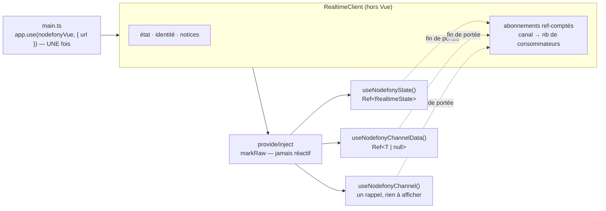

# Composables Vue — `nodefony/vue`

> Le subpath `nodefony/vue` branche un composant Vue 3 sur la socket Nodefony **sans une ligne de
> glue** : un plugin installé sur l'application, puis des composables ciblés qui s'abonnent au
> `setup` et rendent l'abonnement à la mort de la portée. Ils ne gèrent **que** l'abonnement —
> ouvrir et maintenir la connexion reste le travail du client, décrit dans
> [Client isomorphe](client.md). Le pendant exact de [Hooks React](react-hooks.md) : même surface,
> mêmes noms, mêmes garanties. Ancré sur `src/nodefony/src/client/vue/index.ts`.

📍 [Documentation](../../../docs/index.md) › [Cœur — @nodefony/core](index.md) › **Composables Vue**

## 🧠 Le modèle mental — une prise, N composants branchés dessus

Un composant vit et meurt au gré de la navigation. Une socket, elle, doit rester ouverte. La liaison
tient les deux bouts : **le fil est unique et long**, **les branchements sont nombreux et courts**.



## 📖 Lexique

| Terme                  | Ce que c'est ici                                                                                         |
| ---------------------- | -------------------------------------------------------------------------------------------------------- |
| **composable**         | Une fonction appelée dans un `setup` qui installe des effets et rend de l'état réactif. L'idiome de Vue. |
| **plugin**             | Ce qu'on installe sur l'application (`app.use`). C'est là que vit une politique, en Vue.                 |
| **portée d'effet**     | Le contexte qui possède les effets d'un composant. Sa mort libère tout ce qui y a été enregistré.        |
| **`Ref<T>`**           | Une boîte réactive : on lit et on écrit `.value`, et le rendu suit.                                      |
| **`MaybeRefOrGetter`** | « une valeur, une `ref`, ou une fonction qui la calcule » — ce qui rend un argument réactif sans effort. |

## Pourquoi un plugin, et pas un composant enveloppant

React publie un `<NodefonyProvider>` parce qu'en React tout est composant. En Vue, une politique qui
vaut pour l'application entière s'installe sur l'application :

```ts
createApp(App).use(nodefonyVue, { url: "/api/live/realtime" }).mount("#app");
```

Traduire littéralement le fournisseur React aurait donné un composant de plus dans l'arbre, que
personne n'aurait pensé à chercher. **Une liaison idiomatique n'est pas une traduction mot à mot :
c'est la même garantie, dite dans la langue du framework.**

## Les trois règles que Vue impose, et que React ne montre pas

1. **Le client n'entre jamais dans un `ref()`.** Il serait enveloppé dans un proxy réactif profond :
   ses égalités de référence internes casseraient, et chaque accès paierait une interception — pour
   une réactivité dont il n'a aucun besoin, ses changements passant par ses propres `on*`. Le plugin
   le pose `markRaw` (`src/nodefony/src/client/vue/index.ts:155`), et un test le vérifie
   (`isReactive(useNodefony()) === false`).
2. **La libération passe par `onScopeDispose`**, jamais par `onUnmounted` seul : c'est le seul des
   deux qui couvre aussi une portée créée hors composant (`effectScope()`). Un abonnement qui fuit
   **ne se voit pas à l'écran** — la page affiche ce qu'il faut, et le serveur pousse un canal que
   plus personne ne regarde. Le motif commun à tous les composables est unique
   (`src/nodefony/src/client/vue/index.ts:217`) : brancher, rebrancher quand la source change,
   libérer à la mort de la portée.
3. **Un composable appelé hors portée lève** (`src/nodefony/src/client/vue/index.ts:199`), plutôt
   que de fuir en silence. Le message dit le remède : envelopper l'appel dans `effectScope()`.

## 🚀 Démarrage rapide

### 1. Le plugin, sur l'application

```ts
// frontend/src/main.ts
import { createApp } from "vue";
import { nodefonyVue } from "nodefony/vue";
import App from "./App.vue";

const el = document.getElementById("app");
if (!el) throw new Error("#app not found");
createApp(App).use(nodefonyVue, { url: "/api/live/realtime" }).mount(el);
```

L'adresse est écrite **ici, et nulle part ailleurs**. Le framework n'en devine aucune : une adresse
devinée marche en développement et se trompe en production. Sans `url` ni `client`, le plugin refuse
(`src/nodefony/src/client/realtime/observe.ts:126`).

### 2. La page

```vue
<script setup lang="ts">
import {
  useNodefony,
  useNodefonyChannelData,
  useNodefonyState,
} from "nodefony/vue";

interface Evenement {
  texte: string;
  ts: number;
}

const live = useNodefony();
const etat = useNodefonyState();
const dernier = useNodefonyChannelData<Evenement>("live:events");

const dire = (texte: string): void => live.emit("live:dire", { texte });
</script>

<template>
  <p>connexion : {{ etat }}</p>
  <p v-if="dernier">{{ dernier.texte }}</p>
  <button @click="dire('bonjour')">envoyer</button>
</template>
```

Il n'y a **rien à libérer** : la portée du composant rend les abonnements à sa mort. C'est la
différence visible avec un câblage à la main, où il fallait tenir une liste de fonctions de
libération et n'en oublier aucune.

### 3. Quand l'application possède son cycle de connexion

```ts
// La socket fournie l'emporte sur `url`, et son cycle n'est pas touché :
// ni `connect`, ni `disconnect`.
app.use(nodefonyVue, { client: maSocket });
```

### 4. Un canal qui change

```ts
const salle = ref("salon:general");
// L'abonnement SUIT la valeur : l'ancien canal est rendu avant que le
// nouveau soit pris. Aucun tableau de dépendances à tenir.
const messages = useNodefonyChannelData<Message>(() => salle.value);
```

## 🧰 Les composables

Tous rendent une `Ref` en lecture — on lit `.value` (ou rien du tout dans un template, Vue
déballe). La socket, elle, n'est pas réactive : c'est un objet, pas un état.

| Composable                             | Rend                            | À quoi ça sert                                               |
| -------------------------------------- | ------------------------------- | ------------------------------------------------------------ |
| `nodefonyVue`                          | —                               | le plugin : fournit la socket et lance la connexion          |
| `useNodefony()`                        | `RealtimeClient`                | l'échappatoire : `emit`, `request`, `mutate`, `ping`         |
| `useNodefonyState()`                   | `Ref<RealtimeState>`            | afficher l'état, griser un bouton pendant une reconnexion    |
| `useNodefonyIdentity()`                | `Ref<RealtimeIdentity \| null>` | savoir qui est connecté — sans appeler `/auth/me`            |
| `useNodefonyChannel(canal, onMessage)` | —                               | réagir à chaque message (journal, son, animation)            |
| `useNodefonyChannelData<T>(canal)`     | `Ref<T \| null>`                | la dernière valeur — le cas le plus courant                  |
| `useNodefonyAdaptiveChannel(…)`        | `Ref<number>`                   | même chose, en cadence auto-ajustée ; rend la cadence        |
| `useNodefonyAdaptiveChannelData<T>(…)` | `{ data, intervalMs }`          | la dernière valeur **et** la cadence                         |
| `useNodefonyChannelStats(canal)`       | `Ref<MessageStats \| null>`     | débit et série d'un canal, pour un VU-mètre                  |
| `useNodefonySnapshot()`                | `Ref<SocketSnapshot \| null>`   | ce que la socket sait d'elle-même : canaux, trames, dernière |
| `useNodefonySyslog(opts?)`             | `Ref<unknown[]>`                | le flux de journal, anneau borné et filtre de sévérité       |
| `useNodefonyNotifications(onNotice)`   | —                               | les notices normalisées — à monter **une seule fois**        |
| `useNodefonyNoticeLog(opts?)`          | `Ref<NodefonyNotice[]>`         | l'historique borné des incidents                             |

La déclaration de chacun se lit dans `src/nodefony/src/client/vue/index.ts:179` et suivantes.

Sont aussi réexportés depuis ce subpath : `rateChannel`, `parseRate`, `isRateChannel` (fabriquer un
nom de canal cadencé), et les types `RealtimeIdentity`, `RealtimeState`, `NodefonyNotice`,
`SocketSnapshot` — pour qu'un composant puisse **nommer** ce qu'il reçoit.

Les arguments « canal » et « cadence » acceptent une valeur, une `ref` ou une fonction : l'abonnement
suit, sans liste de dépendances.

## 🏗️ Cycle de vie d'un abonnement

```
setup()            → subscribe (si premier consommateur du canal)
message reçu       → .value change → le rendu suit
canal qui change   → unsubscribe de l'ancien, subscribe du nouveau
reconnexion        → le client rejoue TOUS les abonnements, sans rien à faire
fin de portée      → unsubscribe (si dernier consommateur)
```

Ce qui est **partagé** et ne dépend pas de Vue — le comptage de références, le rejeu après
reconnexion, l'appariement `on`↔`subscribe` — vit dans le socle agnostique et est prouvé une fois
pour les quatre fronts. Ce qui est **propre à Vue** — la portée, la réactivité, la non-réactivité du
client — est prouvé dans `src/nodefony/src/tests/clientVue.test.ts:1`.

La socket, elle, **n'est jamais coupée par un composant**. Elle appartient à la page : la fermer au
démontage trancherait les requêtes en vol des autres consommateurs.

## ⚠️ Pièges (symptôme → cause → correction)

| Symptôme                                                     | Cause                                                                  | Correction                                                                    |
| ------------------------------------------------------------ | ---------------------------------------------------------------------- | ----------------------------------------------------------------------------- |
| `useNodefony() : le plugin n'est pas installé`               | Le composable est appelé hors d'une application où `app.use` a eu lieu | Installer `nodefonyVue` dans `main.ts`                                        |
| `… doit être appelé dans un composant (setup) ou une portée` | Appel au niveau d'un module, dans un `setTimeout` ou un gestionnaire   | Appeler au `setup`, ou envelopper dans `effectScope()`                        |
| Le plugin lève à l'installation                              | Ni `url` ni `client` fourni — le framework ne devine aucune adresse    | Passer l'URL du serveur temps réel                                            |
| Rien n'arrive et l'état reste `disconnected`                 | Le serveur n'écoute pas cette adresse, ou la socket a été coupée       | Vérifier l'adresse du plugin, et qu'aucun code n'appelle `disconnect()`       |
| `Module 'nodefony' has no exported member 'RealtimeClient'`  | Condition d'export `browser` inactive dans le `tsconfig.json` de l'app | Importer depuis `nodefony/client`, ou ajouter `customConditions: ["browser"]` |
| Le canal se ré-abonne à chaque frappe                        | Le nom du canal est recalculé à chaque rendu par une fonction          | Ne faire dépendre le getter que de ce qui doit vraiment ré-abonner            |
| Un objet du client semble « ne pas réagir »                  | Il est `markRaw` — c'est voulu                                         | Lire l'état par les composables, pas sur l'objet                              |
| Notices en double                                            | `useNodefonyNotifications` appelé dans plusieurs composants            | Un seul appel, au shell de l'application                                      |
| Une exception dans un rappel disparaît sans trace            | Le dispatch du client isole les erreurs de handler                     | Envelopper le corps du rappel dans son propre `try`/`catch`                   |

## 🧪 Tests & couverture

- **Les règles du temps réel** (comptage de références, rejeu après reconnexion, dernier reçu gagne,
  anneaux, filtres) sont prouvées **une fois pour les quatre fronts** dans
  `src/nodefony/src/tests/clientObserve.test.ts`. Les rejouer à travers Vue mesurerait le socle.
- **La traduction Vue** est prouvée dans `src/nodefony/src/tests/clientVue.test.ts` : portée exigée,
  client non réactif, canal réactif qui déplace l'abonnement, et surtout **le démontage qui rend
  l'abonnement au serveur** — compté sur les trames émises, seul juge d'une fuite.
- **La surface publiée** est tenue par `clientSubpathSurface.types.test.ts` : ce que les composables
  rendent doit pouvoir être **nommé** par un consommateur, et les trois subpaths parlent des mêmes
  types, pas de jumeaux.
- **Aucun test de rendu** ne monte de composant réel : le harnais utilise `app.runWithContext` et
  `effectScope`, qui donnent exactement ce qu'un composant donne à un composable, sans DOM.

Couverture : `npm run coverage` dans `src/nodefony`.

## 🔗 Pour aller plus loin

- ⬆️ **Retour au hub** : [@nodefony/core — vue d'ensemble](index.md) · [Toute la documentation](../../../docs/index.md)
- 🧭 **Pages sœurs** : [Client isomorphe](client.md) — la socket, le transport, la reconnexion, les
  rôles · [Hooks React](react-hooks.md) — la même surface, en React · [Journalisation](syslog.md)
- Le vocabulaire commun aux deux bords du fil → [Vocabulaire de la socket](../../packages/@nodefony/realtime/docs/vocabulaire.md)
- Le module serveur qui pousse les canaux → [@nodefony/realtime](../../packages/@nodefony/realtime/docs/index.md)
- Qui sert et reconstruit ton interface → [@nodefony/frontend](../../packages/@nodefony/frontend/docs/index.md)
