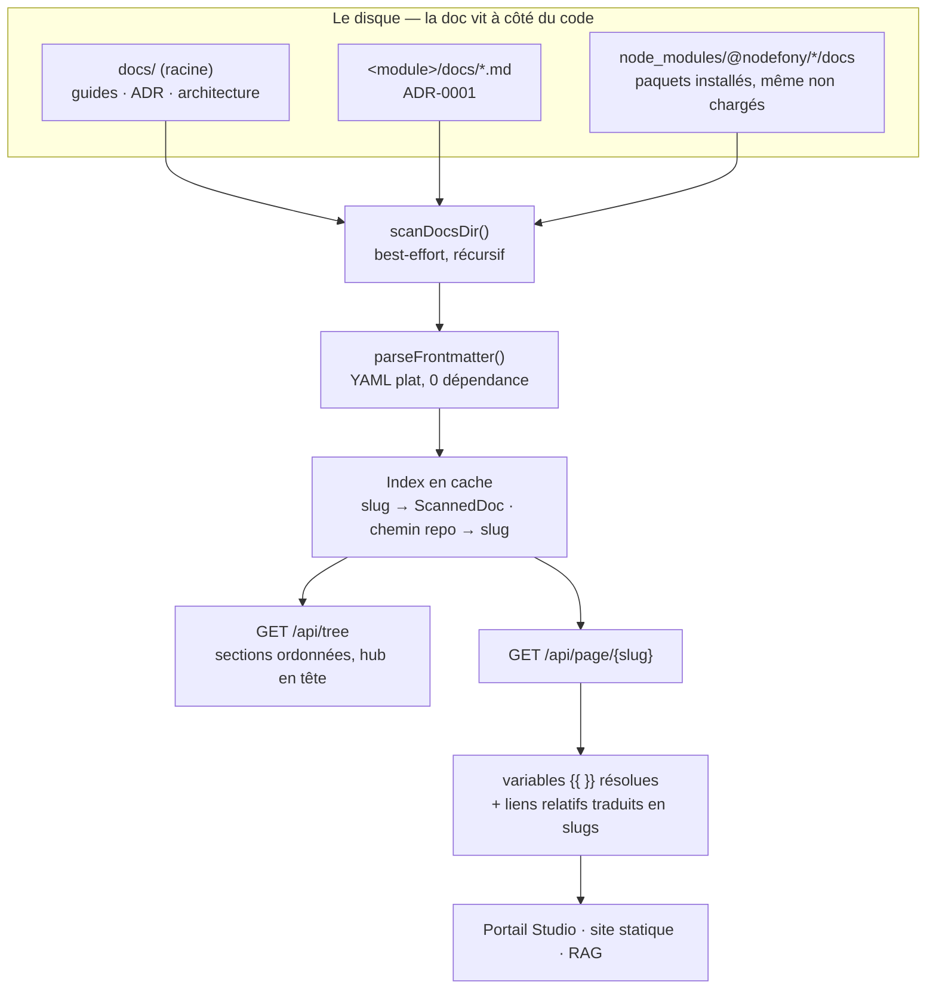

# Architecture — du fichier `.md` au portail navigable

> Tu écris un fichier Markdown à côté de ton code. Quelques secondes plus tard, il est
> dans le portail, rangé dans la bonne section, avec ses liens qui marchent et un bouton
> « voir la source ». Cette page décrit la machinerie entre les deux : ce que le module va
> chercher sur le disque, ce qu'il lit dans ton frontmatter, comment il fabrique une **cote**
> à partir d'un chemin, et pourquoi c'est **le serveur** — pas ton navigateur — qui traduit
> tes liens relatifs. Tout est ancré sur
> `src/packages/@nodefony/documentation/nodefony/`.

📍 [Documentation](../../../../../docs/index.md) › [Documentation (module)](index.md) › **Architecture**

## 🧠 Le modèle mental — un bibliothécaire, un catalogue, une cote

Les livres sont dispersés : certains dans la salle commune (`docs/` à la racine du projet),
la plupart rangés à côté de l'atelier qui les a écrits (`<module>/docs/`). Trois objets
suffisent à comprendre l'ensemble :

- Le **bibliothécaire**, c'est le service. Il fait le tour des étagères une fois, retient
  où chaque livre se trouve **réellement**, et garde ce tour de piste en mémoire.
- Le **catalogue**, c'est l'index. Il ne contient pas les livres, seulement de quoi les
  choisir : titre, section, persona, statut.
- La **cote**, c'est le _slug_. Tu la demandes, on va chercher le livre. Tu ne peux pas
  fabriquer une cote pour un livre qui n'est pas au catalogue — c'est ce qui rend le
  rayonnage inviolable.



Trois règles tiennent tout l'édifice :

1. **Le slug est une clé, jamais un chemin.** On ne reconstruit jamais un chemin de fichier
   à partir de ce que le client envoie.
2. **Le cache porte sur l'index, pas sur le contenu.** Une page est **toujours** relue sur
   le disque — on ne sert jamais un Markdown périmé.
3. **La traduction des liens appartient au serveur.** Lui seul connaît la table
   chemin → slug ; le client n'a aucun moyen de deviner à quoi correspond `../../..`.

## 📖 Lexique

| Terme                   | Sens                                                                                                                                     |
| ----------------------- | ---------------------------------------------------------------------------------------------------------------------------------------- |
| Data plane              | Le plan de **données** : des routes qui rendent du JSON structuré, sans rien afficher. Par opposition au plan de présentation (l'écran). |
| Headless                | « Sans tête » : le module produit de la donnée, jamais du HTML. Le rendu appartient au consommateur.                                     |
| Frontmatter             | Le bloc encadré de `---` en tête d'un `.md`, qui porte les métadonnées de la page (titre, persona, statut, date).                        |
| Slug                    | La **cote** d'une page : un identifiant URL-safe tenant sur un seul segment de route (`mod~security~cors`).                              |
| Allowlist               | Liste blanche : seules les entrées connues du scan sont servables. Tout le reste est refusé, sans discussion.                            |
| Traversée de répertoire | _Path traversal_ : faire lire au serveur un fichier hors du périmètre prévu, en glissant des `..` dans un identifiant.                   |
| Hub                     | La page d'entrée d'une section (`index.md`) : elle oriente au lieu d'expliquer.                                                          |
| ADR                     | _Architecture Decision Record_ : une décision d'architecture écrite, datée et motivée.                                                   |
| ADR-0001                | La décision d'**emplacement hybride** : la doc d'un module vit DANS le module, le transverse reste à la racine.                          |
| TTL                     | _Time To Live_ : durée de fraîcheur. Ici, celle de l'index — passé le délai, le disque est re-parcouru.                                  |
| Real-path               | Le chemin réel d'un fichier, liens symboliques résolus. En dépôt workspace, `node_modules/@nodefony/x` mène à la source.                 |
| POSIX (chemin)          | Forme de chemin à séparateur `/`. Le module normalise tout dessus, y compris ce qui arrive de Windows.                                   |
| YAML plat               | Le sous-ensemble de YAML accepté ici : `clé: valeur`, listes inline `[a, b]`, listes en bloc. Ni objet imbriqué, ni multi-lignes.        |
| Fence typée             | Un bloc de code dont le langage déclare un composant (` ```nodefony-cards `) plutôt qu'un langage de programmation.                      |
| RBAC                    | _Role-Based Access Control_ : qui a le droit, décidé par les rôles portés par l'identité.                                                |
| RAG                     | _Retrieval-Augmented Generation_ : donner à un modèle les documents pertinents avant qu'il réponde. Le Markdown en est la matière.       |
| Cliquet (test)          | Un garde-fou qui n'autorise qu'un sens : une liste de dette connue qui ne peut que **rétrécir**, jamais s'allonger.                      |

## Qu'est-ce qu'un data plane de documentation ?

Le réflexe habituel, pour publier de la doc, c'est un **générateur de site statique** : on
compile le Markdown en HTML, on déploie le résultat. Ça marche — tant que la doc et le code
ne bougent pas ensemble.

Nodefony prend l'autre bout du problème : la doc est **servie par l'application elle-même**,
en direct, depuis les fichiers du dépôt. Le module ne compile rien, ne rend rien, ne cache
aucun contenu. Il répond à deux questions, et à deux seulement :

1. **Qu'est-ce qu'il y a à lire ?** → l'index, avec ses sections et ses pages.
2. **Donne-moi cette page-là.** → le Markdown, métadonnées à part, prêt à afficher.

C'est ce que veut dire **headless** (`Documentation` — `index.ts:31`) : la sortie est du JSON
(`IDocPage`, `IDocumentation.ts:67`), et trois consommateurs très différents s'en servent —
le portail Studio (React), un futur générateur de site, et l'indexation RAG qui réingère le
Markdown brut.

> [!TIP]
> C'est aussi ce qui rend ta doc **vraie**. Un site statique se régénère quand quelqu'un y
> pense ; ici, la page servie est le fichier tel qu'il est sur le disque, à l'instant de la
> requête.

## La vision Nodefony — la doc vit à côté du code, l'index la rassemble

Quatre partis pris expliquent la forme du module.

**La doc appartient au module** (ADR-0001). Tu écris `mon-module/docs/ma-page.md`, tu ne
déclares rien, tu n'inscris rien nulle part : le scan la trouve au prochain passage. La
contrepartie, c'est qu'il faut un **index transverse** pour recoller des dizaines de dossiers
séparés — c'est précisément le travail de ce module.

**Les briques de base sont pures.** Le découpage du frontmatter (`parseFrontmatter()`,
`frontmatter.ts:51`), la fabrication du slug (`pathToSlug()`, `slug.ts:60`), le parcours du
disque (`scanDocsDir()`, `docScanner.ts:55`) et la traduction des liens
(`rewriteInternalLinks()`, `linkResolver.ts:90`) sont des fonctions sans état et sans Kernel.
Elles sont exportées telles quelles, donc réutilisables par un générateur statique ou un
indexeur RAG — et testables sans démarrer un serveur.

**Le slug est une clé d'allowlist, jamais un chemin.** Le module lit des fichiers du disque
sur ordre d'un client : c'est la définition d'une surface de traversée de répertoire. La
parade n'est pas un filtre de caractères, c'est un **changement de nature** — le détail est
plus bas.

**Ce que tu écris reste lisible sur GitHub.** Tes liens sont des chemins relatifs — un lien
markdown dont la cible est `cors.md` — et tes ancres suivent la convention GitHub. Le portail
s'adapte à ton Markdown, pas l'inverse.

**Le compromis, dit franchement** : l'index est un instantané. Un `.md` ajouté n'apparaît
qu'au prochain scan — 30 secondes par défaut, immédiatement si tu mets le cache à zéro.

## 🚀 Démarrage rapide

Le but : publier la doc d'une application créée par `nodefony create app`, et y injecter une
valeur calculée par le serveur.

### 1. Charger le module

```ts
// nodefony.config.ts — l'orchestrateur de l'application
import { defineConfig, use } from "nodefony";

export default defineConfig(() => ({
  modules: [
    "@nodefony/framework",
    use("@nodefony/documentation", {
      // La doc transverse de l'app. Les `<module>/docs/` s'ajoutent tout seuls.
      scan: { rootDir: "docs" },
      // Le lien « voir la source » de chaque page pointe vers TON dépôt.
      repo: { url: "https://github.com/acme/monapp", editPathPrefix: "blob" },
      // 0 = pas de cache : un nouveau `.md` apparaît à la requête suivante.
      cache: { ttlMs: 0 },
    }),
  ],
}));
```

### 2. Écrire une page

Le fichier `docs/prise-en-main.md` de ton application, avec son frontmatter :

```markdown
---
title: "Prise en main"
audience: [developer]
status: stable
updated: 2026-07-19
---

# Prise en main

Besoin d'aide ? Écris à {{ support }}.

Suite : [le sommaire](index.md).
```

Deux détails qui font tout le reste : `{{ support }}` sera remplacé **côté serveur**, et le
lien relatif sera traduit en slug navigable — sans cesser de fonctionner sur GitHub.

### 3. Fournir la variable `{{ support }}`

```ts
// nodefony/modules/glossaire/index.ts — un module de ton application
import { Kernel, Module } from "nodefony";
import type { IDocumentationService } from "@nodefony/documentation";

class Glossaire extends Module {
  constructor(kernel: Kernel) {
    super("glossaire", kernel, import.meta.url, {});
  }

  // `onKernelReady` : tous les modules sont bootés, le service existe.
  override async onKernelReady(): Promise<this> {
    const docs = this.get<IDocumentationService>("documentation");
    // Valeur SÛRE et synchrone : jamais un secret, jamais un chemin absolu.
    docs?.registerVar("support", () => "support@acme.example");
    return this;
  }
}

export default Glossaire;
```

### Ce qu'on observe

L'index annonce la page, rangée dans la section de son dossier :

```bash
curl -s http://127.0.0.1:5151/nodefony/documentation/api/tree | head -20
# {
#   "generatedAt": "2026-07-19T10:12:03.114Z",
#   "audiences": [{ "key": "developer", "label": "Développeur", "desc": "…" }, …],
#   "sections": [
#     { "id": "root-racine", "label": "docs/ (racine)",
#       "pages": [{ "slug": "root~prise-en-main", "title": "Prise en main",
#                   "audience": ["developer"], "isHub": false, "status": "stable" }] }
#   ]
# }
```

Puis la page elle-même, variable résolue et lien traduit :

```bash
curl -s http://127.0.0.1:5151/nodefony/documentation/api/page/root~prise-en-main
# {
#   "slug": "root~prise-en-main", "title": "Prise en main",
#   "version": "doc", "status": "stable", "updated": "2026-07-19",
#   "source": "docs/prise-en-main.md",
#   "sourceUrl": "https://github.com/acme/monapp/blob/main/docs/prise-en-main.md",
#   "markdown": "\n# Prise en main\n\nBesoin d'aide ? Écris à support@acme.example.\n…"
# }
```

Le `markdown` rendu ne porte plus ni frontmatter, ni `{{ }}`, ni chemin relatif : la cible
`index.md` du lien y est devenue `root~index.md`. Trois transformations, une seule lecture de
fichier.

## 🏗️ Architecture interne — trois couches

Chaque couche ne connaît que sa voisine du dessous, et la plus volatile est la plus mince.

| Couche        | Qui                                                    | Sa seule responsabilité                              | Ce qu'elle ignore                    |
| ------------- | ------------------------------------------------------ | ---------------------------------------------------- | ------------------------------------ |
| Contrôleur    | `DocumentationController` — sans état                  | traduire un résultat (ou une erreur) en réponse HTTP | comment l'index est construit        |
| Service       | `DocumentationService` — le seul stateful              | scanner, cacher, indexer, résoudre                   | qui l'appelle, et par quel transport |
| Briques pures | `frontmatter` · `slug` · `docScanner` · `linkResolver` | une transformation, sans état ni Kernel              | qu'un serveur existe                 |

Le contrôleur est **réinstancié à chaque requête** : il ne peut donc rien retenir, et c'est
voulu. Le service est un singleton par process ; il porte l'index caché (`#cache`,
`DocumentationService.ts:104`) et le registre des variables (`#vars`,
`DocumentationService.ts:106`), tous deux à `null` tant que personne n'a rien demandé.

### Le scan — trois sources, et une qui surprend

`#scanAll()` (`DocumentationService.ts:231`) interroge le disque dans cet ordre :

| Source                    | Où                                             | Pourquoi                                                                        |
| ------------------------- | ---------------------------------------------- | ------------------------------------------------------------------------------- |
| La doc transverse         | `docs/` à la racine du projet                  | guides, ADR, architecture — ce qui n'appartient à aucun module                  |
| Les modules **chargés**   | `<module>/docs/` de chaque module du manifeste | ADR-0001 : la doc vit à côté du code qu'elle décrit                             |
| Les paquets **installés** | `node_modules/@nodefony/*/docs` + `nodefony`   | lire la doc d'un module **avant** de l'activer — c'est justement à ce moment-là |

La troisième mérite l'explication. Un module qu'on n'a pas encore activé est précisément
celui dont on lit la doc : pour décider de l'activer. `#installedDocDirs()`
(`DocumentationService.ts:293`) parcourt donc le scope npm et **dédoublonne** avec les
modules déjà chargés. Ses chemins sont résolus en real-path : en dépôt workspace,
`node_modules/@nodefony/x` est un lien vers la source, et c'est la source qui doit indexer —
sinon un même fichier aurait deux chemins, et les liens entre pages ne se résoudraient plus.

Le parcours lui-même, `scanDocsDir()` (`docScanner.ts:55`), est **best-effort** par
construction : un dossier absent rend une liste vide au lieu de lever une erreur. C'est ce
qui permet de balayer les `docs/` de modules qui n'en ont pas, sans que rien ne plante. Un
fichier illisible garde un titre dérivé de son nom (`humanizeFilename()`, `docScanner.ts:29`)
et un frontmatter vide.

L'exclusion (`isExcluded()`, `docScanner.ts:38`) compare **par segment de chemin**, pas par
préfixe : `node_modules` exclut le dossier, jamais un fichier nommé `node_modules-guide.md`.

### Le frontmatter — ce que le module lit vraiment

`parseFrontmatter()` (`frontmatter.ts:51`) est un parseur maison de **YAML plat**. Pas de
`gray-matter` : la doc n'utilise qu'un sous-ensemble minuscule, et on ne paie pas des
dépendances transitives pour ça.

| Tu écris               | Tu obtiens             |
| ---------------------- | ---------------------- |
| `title: Mon titre`     | une chaîne             |
| `title: "Mon titre"`   | idem (guillemets ôtés) |
| `audience: [a, b]`     | une liste              |
| `audience:` puis `- a` | une liste              |
| `audience:` (seul)     | une liste **vide**     |
| `# commentaire`        | ignoré                 |

**Non supporté, volontairement** : objets imbriqués, multi-lignes `|` / `>`, ancres YAML.
Une ligne mal formée est simplement sautée — elle ne fait jamais échouer la page.

Le service ne consomme ensuite qu'une poignée de clés (`getPage()`,
`DocumentationService.ts:151`) : `title`, `version` (défaut `"doc"`), `status`, `updated`,
`source`, plus `audience` pour l'index. **Toutes les autres clés sont conservées dans le
fichier et ignorées** — elles servent au RAG et aux outils, pas au portail.

Deux valeurs sont **contraintes**, et le hors-piste est silencieusement écarté :

| Clé        | Valeurs retenues                                                                                       | Sinon                                                                      |
| ---------- | ------------------------------------------------------------------------------------------------------ | -------------------------------------------------------------------------- |
| `audience` | `developer` · `devops` · `supervisor` · `admin` (`DocAudience`, `IDocumentation.ts:10`)                | la valeur est filtrée (`#toPageRef()`, `DocumentationService.ts:367`)      |
| `status`   | `stable` · `draft` · `temporary` · `experimental` · `deprecated` (`DocStatus`, `IDocumentation.ts:13`) | le champ devient absent (`#coerceStatus()`, `DocumentationService.ts:395`) |

> [!WARNING]
> Une `audience: [human, ai]` ne provoque **aucune erreur** : les deux valeurs sont
> écartées, la page se retrouve avec une liste vide — c'est-à-dire « visible par toutes les
> personas ». L'inverse de ce que l'auteur croyait écrire. Le vocabulaire exact est celui de
> `AUDIENCES` (`DocumentationService.ts:37`), qui porte aussi les libellés affichés par le
> sélecteur de vue.

Et un point à ne pas confondre : **l'audience n'est pas un contrôle d'accès**. Elle n'existe
que dans l'index, comme filtre de vue ; `getPage()` sert n'importe quelle page indexée quel
que soit le persona du lecteur. Le vrai garde est le RBAC posé sur les routes.

### Le slug — une cote, jamais un chemin

`pathToSlug()` (`slug.ts:60`) transforme un chemin en identifiant d'un seul segment :

| Fichier                           | Slug                         |
| --------------------------------- | ---------------------------- |
| `docs/index.md`                   | `root~index`                 |
| `docs/architecture/pipeline.md`   | `root~architecture~pipeline` |
| `@nodefony/security/docs/cors.md` | `mod~security~cors`          |

La recette : normaliser les `\` en `/`, retirer `.md`, remplacer chaque `/` par `~`, préfixer
par l'origine. Le nom du module perd son scope npm et tout caractère exotique
(`sanitizeSegment()`, `slug.ts:71`) — un module nommé n'importe comment produit quand même un
slug sûr.

Pourquoi `~` : le slug doit tenir dans **un** segment de route (`/api/page/{slug}`), donc il
ne peut pas contenir de `/`. Et la transformation est **à sens unique** : rien, nulle part,
ne reconstruit un chemin depuis un slug.

> [!IMPORTANT]
> Ne confonds pas deux slugs qui n'ont rien à voir. Celui-ci nomme une **page**
> (`mod~security~cors`). Les ancres de titre — celles de la forme `#pièges` — suivent une
> tout autre règle, celle de **GitHub** : accents **conservés**, ponctuation et emoji retirés, espaces en
> tirets — `slugifyHeading()` (`DocToc.tsx:54`). Retirer les accents côté portail rendait
> morts des liens qui marchaient sur GitHub. Toute divergence entre le portail et le gate
> `anchor-inpage` casse les sommaires **en silence**.

### La résolution des liens — pourquoi c'est le serveur qui traduit

Tes pages se lient par **chemin relatif**, parce que c'est ce qui les rend lisibles partout :
sur GitHub, dans ton éditeur, dans une revue de diff. Mais le portail ne navigue pas par
chemin — il navigue par slug.

Le pont, c'est une table `chemin repo → slug` construite au scan (`#ensureCache()`,
`DocumentationService.ts:205`) et appliquée à la lecture par `#resolveLinks()`
(`DocumentationService.ts:189`). **Seul le serveur peut le faire** : le client reçoit
`../../../../../docs/index.md` sans le moindre moyen de savoir à quel fichier ça correspond —
il ne connaît ni l'arborescence du dépôt, ni le point de départ de la page.

`rewriteInternalLinks()` (`linkResolver.ts:90`) applique quatre règles :

1. **Seules les cibles `.md` internes** sont touchées (`MD_LINK`, `linkResolver.ts:31`). Les
   URL absolues, les `mailto:`, les ancres pures `#section`, les images et les `.ts` restent
   intacts.
2. **Le chemin est résolu contre le dossier de la page** (`resolveRelative()`,
   `linkResolver.ts:43`), en saturant à la racine : une remontée excessive ne peut pas sortir
   du dépôt.
3. **Une cible non indexée reste telle quelle.** Mieux vaut un lien inerte qu'un slug inventé
   qui produirait un 404.
4. **Les fences typées aussi.** Un catalogue de hub porte ses cibles dans du JSON
   (`"href": "cors.md"`) : sans traduction, `JSON_HREF` (`linkResolver.ts:40`), les cards
   d'un hub renverraient dans le vide.

L'ancre de section est **préservée** : `pipeline.md#etapes` devient `root~…~pipeline.md#etapes`.
Et le `.md` est conservé après réécriture — c'est à cette extension que le rendu reconnaît un
lien interne.

### L'ordre des pages — le hub ouvre sa section

Un tri purement alphabétique enterre `index.md` au milieu de ses propres pages : pour la
sécurité, entre `headers` et `lexique`. Le point d'entrée devient invisible.

`#orderPages()` (`DocumentationService.ts:357`) trie donc en deux temps : le hub d'abord, le
reste par titre. Un hub est reconnu à son nom de fichier — `index.md`, à n'importe quelle
profondeur — et le drapeau `isHub` (`IDocPageRef`, `IDocumentation.ts:24`) remonte jusqu'à
l'interface, où le portail s'en sert pour choisir la page d'atterrissage d'une section.

Les sections elles-mêmes (`#buildSections()`, `DocumentationService.ts:317`) viennent du
**dossier parent** du fichier, jamais d'une clé `section` du frontmatter. Les racines connues
reçoivent un libellé soigné (`ROOT_GROUP_LABELS`, `DocumentationService.ts:66`) ; les autres
sont auto-capitalisées (`#rootLabel()`, `DocumentationService.ts:382`). Les sections de module
sont préfixées `mod-`, celles de la racine `root-`.

### Le cache — l'index, pas le contenu

`#ensureCache()` (`DocumentationService.ts:205`) sert son instantané tant qu'il est dans le
TTL, et rescanne sinon. Ce qui est caché tient dans `CacheEntry`
(`DocumentationService.ts:79`) : l'arbre, l'index `slug → doc`, et la table `chemin → slug`.

Le **contenu d'une page ne l'est jamais**. Chaque `getPage()` relit le fichier. La raison est
simple : le coût est celui d'une lecture froide sur un chemin d'administration, et la
contrepartie serait de servir un Markdown périmé à quelqu'un qui vient justement de le
corriger.

`invalidate()` (`DocumentationService.ts:143`) remet le cache à `null` — c'est la porte de
sortie quand un outil sait, lui, que le disque a bougé.

## ⚙️ Configuration

Table dérivée du schéma Zod (`documentationConfigSchema`, `config.ts:134`), qui est la source
unique des défauts.

<!-- prettier-ignore -->
| Clé | Type | Défaut | Effet |
| --- | --- | --- | --- |
| `enabled` | booléen | `true` | drapeau d'activation déclaré au schéma (`config.ts:136`) |
| `scan.rootDir` | chaîne | `"docs"` | dossier transverse, relatif à la racine du projet |
| `scan.includeModules` | booléen | `true` | ajoute les `<module>/docs/` des modules chargés |
| `scan.includeInstalled` | booléen | `true` | ajoute les paquets installés non chargés (`config.ts:64`) |
| `scan.exclude` | liste de chaînes | `["session-retros", "node_modules", "dist"]` | segments de chemin ignorés (`config.ts:75`) |
| `repo.url` | chaîne | dépôt nodefony-core | base du lien « voir la source » |
| `repo.branch` | chaîne (option.) | — → branche git réelle, sinon `main` | branche du lien source |
| `repo.editPathPrefix` | `edit` \| `blob` \| `tree` | `"edit"` | segment GitHub : éditeur web, lecture, ou dossier |
| `cache.ttlMs` | entier ≥ 0 | `30000` | fraîcheur de l'index ; `0` = rescan à chaque requête (`config.ts:120`) |

Deux variables d'environnement écrasent la config, appliquées **après** le parse pour que le
schéma reste pur et sérialisable (`defineDocumentationConfig()`, `defineModuleConfig.ts:32`) :

| Variable           | Écrase        | Quand c'est utile                                        |
| ------------------ | ------------- | -------------------------------------------------------- |
| `DOCS_REPO_URL`    | `repo.url`    | image de conteneur partagée entre plusieurs dépôts       |
| `DOCS_REPO_BRANCH` | `repo.branch` | CI ou production détachée de git (pas de `.git` lisible) |

La validation a lieu au `onKernelRegister` (`index.ts:50`), **avant** l'instanciation du
service : une config invalide arrête le démarrage avec un message qui nomme le champ fautif,
plutôt qu'un `undefined.x` trois phases plus loin. Le JSON Schema publié par
`configSchema()` (`index.ts:40`) alimente le panneau de configuration Studio.

Enfin, le module est déclaré **non critique** (`index.ts:33`) : son échec ne tue jamais le
process — une application ne tombe pas parce que sa documentation est indisponible.

## 🔌 Data plane — deux routes, deux formes

`DocumentationController` (`DocumentationController.ts:31`) est monté sur `/nodefony` et
respecte la convention d'administration : jamais de route mono-segment, toujours
`/nodefony/<module>/api/*`.

| Route                                         | Rend                                | Contrat                             |
| --------------------------------------------- | ----------------------------------- | ----------------------------------- |
| `GET /nodefony/documentation/api/tree`        | l'index complet, sections ordonnées | `IDocTree` (`IDocumentation.ts:57`) |
| `GET /nodefony/documentation/api/page/{slug}` | une page résolue                    | `IDocPage` (`IDocumentation.ts:67`) |

Les deux exigent un rôle (`@IsGranted`, `DocumentationController.ts:48`) : `ROLE_DEV` ou
`ROLE_SUPERVISOR`. C'est de la doc technique de framework — architecture, internals — pas du
contenu destiné à l'utilisateur final d'une application.

Les réponses d'erreur sont **génériques par principe** :

| Situation                | Statut | Corps                                               | Journal serveur   |
| ------------------------ | ------ | --------------------------------------------------- | ----------------- |
| slug inconnu             | 404    | `{ slug, error: "Document inconnu." }`              | `DOC_NOT_FOUND`   |
| slug rejeté par la garde | 404    | `{ slug, error: "Document inconnu." }`              | `DOC_UNSAFE_SLUG` |
| lecture impossible       | 500    | `{ slug, error: "Lecture de la page impossible." }` | l'erreur complète |
| index indisponible       | 500    | `{ error: "Index de documentation indisponible." }` | l'erreur complète |

Les deux premiers cas rendent **la même chose au client**, volontairement : lui dire qu'un
slug a été « rejeté » plutôt qu'« introuvable », c'est lui confirmer que sa tentative a été
détectée — et lui apprendre où chercher. Le détail vit côté serveur, porté par un code machine
stable (`docCode`, `DocumentationError.ts:19`).

## 🔐 Sécurité — la traversée de répertoire, bloquée deux fois

Le module lit des fichiers sur ordre d'un client. C'est la définition d'une surface de
traversée de répertoire — et un filtre de caractères ne suffit jamais à la fermer (encodages,
double-encodage, normalisation Unicode…).

La parade est un **changement de nature**, doublé d'un garde :

1. **Allowlist par construction.** `getPage()` (`DocumentationService.ts:151`) cherche une
   entrée par **égalité de slug** dans l'index, puis lit l'`absPath` mémorisé au scan
   (`ScannedDoc`, `docScanner.ts:11`). Le slug n'est jamais concaténé à un chemin. Un slug
   inconnu ne mène nulle part, quelle que soit sa forme.
2. **Défense en profondeur, avant même la recherche.** `isSafeSlug()` (`slug.ts:39`) rejette
   la chaîne vide, la longueur au-delà de 512 (`MAX_SLUG_LENGTH`, `slug.ts:28`), l'octet nul,
   tout caractère hors du charset autorisé (`SAFE_SLUG`, `slug.ts:25`) et tout segment `..`,
   même déguisé en séparateur `~`.

Le charset exclut `%`, donc `%2e%2e` est refusé comme n'importe quel autre caractère
inattendu — la question du double-décodage ne se pose pas.

Une troisième règle protège une surface différente : les variables `{{ }}` sont résolues par
des fournisseurs enregistrés côté serveur (`DocVarProvider`, `IDocumentation.ts:89`), et ne
doivent rendre que des valeurs **sûres** — version, identité git, information publique. Jamais
un secret, jamais un chemin absolu. Une variable inconnue est **laissée telle quelle**
(`#resolveVars()`, `DocumentationService.ts:404`), ce qui signale à l'auteur qu'il manque un
fournisseur au lieu de masquer le trou. Un fournisseur qui lève une exception ne casse pas le
rendu.

Enfin, le lien « voir la source » est assemblé depuis un chemin **relatif au dépôt**
(`#buildSourceUrl()`, `DocumentationService.ts:423`) : aucun chemin du système de fichiers ne
sort jamais du serveur.

## ⚡ Performance & mémoire

Le module vit sur un chemin **froid** — un humain qui lit de la doc, pas dix mille requêtes
par seconde. La discipline reste la même.

- **Tout est alloué paresseusement.** L'index (`#cache`, `DocumentationService.ts:104`) et le
  registre de variables (`#vars`, `DocumentationService.ts:106`) valent `null` jusqu'au
  premier usage. Une application qui charge le module sans jamais ouvrir la doc ne paie ni un
  objet, ni une lecture disque.
- **Le scan est mutualisé.** Les modules sont parcourus en parallèle, et le résultat sert
  toutes les requêtes de la fenêtre de TTL. Le coût du disque suit le nombre de rescans, pas
  le nombre de lecteurs.
- **Aucun écouteur, aucun minuteur.** L'expiration est calculée à la lecture (une
  comparaison de dates), pas par un `setInterval` qui tournerait au repos.
- **Une seule lecture par page servie.** Frontmatter, variables et liens sont traités sur la
  même chaîne, en un passage chacun.
- **Rien n'est retenu entre deux requêtes HTTP.** Le contrôleur est réinstancié et sans état ;
  la mémoire du module est bornée par la taille de l'index, pas par le trafic.

Le seul vrai facteur de coût est le **nombre de fichiers scannés**, multiplié par la fréquence
des rescans. En développement, `cache.ttlMs: 0` échange ce coût contre l'immédiateté ; en
production, les 30 secondes par défaut le rendent négligeable.

## 📡 Observabilité — Studio

- **Le portail** (`/nodefony/documentation`) consomme les deux routes : arbre à gauche,
  sommaire à droite, page au centre. C'est le premier endroit où vérifier qu'une nouvelle page
  est bien indexée, bien rangée, et que ses liens cliquent.
- **La carte du module** (`/nodefony/modules/documentation`) montre sa doc, ses symboles, ses
  tests et sa configuration validée — le formulaire y est dérivé du JSON Schema publié par
  `configSchema()` (`index.ts:40`), jamais écrit à la main.
- **Le journal** nomme chaque refus avec son code stable (`DOC_NOT_FOUND`, `DOC_UNSAFE_SLUG`).
  Une page qui « n'apparaît pas » se diagnostique là, en une ligne.

Le module n'expose **rien de plus** : pas de compteur, pas de sonde. Ce qu'il fait est déjà
entièrement lisible dans ses deux réponses.

## 🧩 Extension — trois points d'accroche

**1. Une variable `{{ }}`** — le point d'extension du contenu. `registerVar()`
(`DocumentationService.ts:138`) accepte un fournisseur **synchrone** qui rend une chaîne
(l'exemple du Démarrage rapide). Le module en enregistre trois lui-même au `onKernelReady`
(`index.ts:70`) : `version`, `branch`, `commit`.

**2. Les briques pures** — le point d'extension de l'outillage. `parseFrontmatter()`,
`scanDocsDir()`, `pathToSlug()`, `isSafeSlug()` sont exportées par le paquet et n'ont besoin
ni de Kernel ni de conteneur. Un générateur de site statique, un indexeur RAG ou un script de
vérification les réutilisent directement, avec exactement la sémantique du portail.

**3. Le data plane lui-même** — le point d'extension de l'affichage. Le module étant headless,
tout consommateur capable de lire du JSON peut se substituer au portail Studio sans qu'une
ligne change côté serveur.

## ⚠️ Pièges

| Symptôme                                                      | Cause                                                                                          | Correction                                                              |
| ------------------------------------------------------------- | ---------------------------------------------------------------------------------------------- | ----------------------------------------------------------------------- |
| Une nouvelle page n'apparaît pas                              | l'index est encore dans son TTL (30 s par défaut)                                              | attendre, ou poser `cache.ttlMs: 0` en développement                    |
| Une page reste introuvable même après rescan                  | son dossier porte un segment exclu (`node_modules`, `dist`, `session-retros`)                  | déplacer la page, ou ajuster `scan.exclude` (`config.ts:75`)            |
| `audience` sans effet, page visible par tous                  | valeur hors `DocAudience` — silencieusement filtrée (`#toPageRef()`)                           | n'utiliser que `developer` · `devops` · `supervisor` · `admin`          |
| `status` absent de l'arbre alors qu'il est écrit              | valeur hors `DocStatus` — ramenée à « absent » (`#coerceStatus()`)                             | s'en tenir aux cinq statuts du contrat                                  |
| La date de la page ne s'affiche pas                           | clé `last-updated` au lieu de `updated` — le service ne lit que `updated`                      | renommer la clé en `updated`                                            |
| Un lien relatif reste inerte dans le portail                  | la cible n'est pas indexée (`CLAUDE.md`, `MEMORY.md`, fichier supprimé) → laissée telle quelle | lier une page de doc, ou accepter le lien inerte                        |
| Un lien de card ne mène nulle part                            | `href` d'une fence typée mal compté (le JSON est traduit comme le markdown, mais pas deviné)   | vérifier le chemin relatif ; le banc de corpus l'attrape                |
| Une ancre `#section` marche sur GitHub, morte dans le portail | divergence entre `slugifyHeading()` (`DocToc.tsx:54`) et le gate `anchor-inpage`               | garder les deux implémentations identiques — accents conservés          |
| Le bouton « voir la source » pointe vers un mauvais fichier   | le frontmatter `source:` **écrase** le chemin réel dans `#buildSourceUrl()`                    | tenir `source:` à jour, ou l'omettre pour laisser le chemin réel gagner |
| Le lien source pointe vers une branche absente en production  | pas de `.git` lisible dans le conteneur → repli sur `main`                                     | poser `DOCS_REPO_BRANCH` (ou `repo.branch`)                             |
| Une clé de frontmatter n'a aucun effet                        | seules `title` · `audience` · `version` · `status` · `updated` · `source` sont consommées      | comportement voulu : les autres clés servent au RAG                     |
| Un frontmatter multi-lignes (`                                | `) casse le titre                                                                              | non supporté par le parseur plat (`frontmatter.ts:51`)                  | rester en YAML plat : scalaire ou liste |

## 🧪 Tests & couverture

Cinq fichiers, tous **unitaires** : les briques pures se testent sans serveur, sans Kernel et
sans conteneur — c'est précisément la raison de les avoir isolées. Les compteurs exacts vivent
dans la carte de l'aperçu, régénérés depuis les résultats réels.

| Banc                   | Ce qui est réellement exercé                                                                             |
| ---------------------- | -------------------------------------------------------------------------------------------------------- |
| `frontmatter.test.ts`  | scalaires, guillemets, listes inline et en bloc, clé vide, commentaires, BOM, CRLF, ligne mal formée     |
| `slug.test.ts`         | forme des slugs racine et module, et surtout les **refus** : vide, > 512, octet nul, `/`, `\`, `..`, `%` |
| `docScanner.test.ts`   | dossier absent → `[]`, filtre `.md`, segments exclus, tri, groupe, titre humanisé, tag de source         |
| `linkResolver.test.ts` | lien plat, remontée profonde, module voisin, ancre préservée, cible non indexée, fences typées           |
| `corpusLinks.test.ts`  | le **corpus réel** du dépôt : liens morts, unicité des slugs, hubs atteignables                          |

Le dernier mérite qu'on s'y arrête. Les autres travaillent sur un index fabriqué ; celui-là
parcourt les vraies pages et attrape ce qu'aucun double ne peut voir : un `../` mal compté,
une page renommée, un lien vers un fichier supprimé (`analyze()`, `corpusLinks.test.ts:120`).

Il porte un **cliquet** : `LEGACY_BROKEN_LINKS` (`corpusLinks.test.ts:147`) liste les pages
pas encore reprises au standard, qui traînent des liens faux hérités. Deux assertions
l'encadrent — les pages hors liste ne doivent avoir **aucun** lien mort, et une page de la
liste qui a été réparée doit en **sortir**. Sans cette seconde garde, la liste se relâcherait
en silence et une régression future passerait inaperçue. La règle est simple : cette liste ne
peut que rétrécir.

**Ce qui n'est pas couvert, et qu'il faut savoir :**

- **Ni le service ni le contrôleur n'ont de test unitaire** : ils dépendent du Kernel et du
  conteneur. Le cache, le dédoublonnage des paquets installés, la résolution des variables et
  les réponses HTTP sont vérifiés en **intégration sur serveur réel** (`curl` sur les deux
  routes), pas par cette suite.
- **Pas de banc de charge ni de test mémoire dédiés** — le module vit sur un chemin froid.
  Pour dimensionner, le skill `nodefony-load-test` ; pour la mémoire du pipeline,
  `nodefony-check-memory-health`.
- **Pas de test d'attaque** (`*.attack.test.ts`) : les refus de slug sont couverts par les
  tests unitaires de `isSafeSlug()`, pas par une campagne offensive.

Couverture : `npm run coverage` dans `@nodefony/documentation`.

## 🔗 Pour aller plus loin

- ⬆️ **Retour au hub** : [Documentation — vue d'ensemble](index.md) · [Toute la documentation](../../../../../docs/index.md)
- 📐 **La décision fondatrice** : [ADR-0001 — emplacement hybride de la doc](../../../../../docs/adr/0001-docs-modules-emplacement-hybride.md)
- 🖥️ **Le consommateur** : [Studio — l'application d'administration](../../studio/docs/index.md)
- 🧰 **Écrire le contrôleur qui consomme le data plane** : [Controller](../../framework/docs/controller.md)
- 🔐 **Le rôle exigé par les deux routes** : [Autorisation](../../security/docs/authorization.md)
- ⚙️ **Où la config du module est validée** : [Configuration](../../../../../docs/architecture/configuration.md) ·
  [cycle de démarrage du kernel](../../../../../docs/architecture/cycle-boot-kernel.md)
- Les signatures exactes ne sont jamais recopiées ici : elles vivent dans le graphe symbolique
  `.ai/symbols.json`, régénéré depuis les TSDoc du code.
