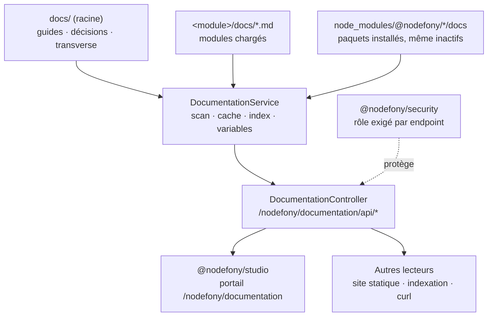

# @nodefony/documentation — la doc de tes modules, servie par ton serveur

> Chaque module range sa documentation à côté de son code, dans son propre dossier `docs/`. Ce
> module fait le tour de tous ces dossiers — les tiens, ceux du framework, et même ceux des paquets
> installés mais pas encore activés — en dresse un **catalogue unique**, et le sert en JSON sous
> `/nodefony/documentation/api/*`. Il ne rend aucune page : il produit de la donnée, que le portail
> de Studio (ou ton propre générateur de site) transforme en pages. C'est ce qui permet à la doc
> d'un module d'arriver **avec le paquet npm**, sans site à déployer ni index à tenir à jour.

📍 [Documentation](../../../../../docs/index.md) › **@nodefony/documentation**

## 🧭 Par où commencer

Trois parcours selon ce que tu viens faire. L'ordre compte : chaque étape suppose la précédente.

**J'écris la documentation de mon module** — la doc qui voyagera avec le paquet.

1. [ADR-0001 — où poser un fichier](../../../../../docs/adr/0001-docs-modules-emplacement-hybride.md) —
   dans le module ou à la racine. C'est la première décision, et celle qu'on défait le plus mal :
   déplacer une page change son identifiant, donc tous les liens qui y menaient.
2. [Démarrage rapide](#-démarrage-rapide) — déclarer le module, écrire la page, la voir apparaître.
   L'étape 2 porte le **contrat de frontmatter** : les six clés réellement lues par le serveur.
3. [Ce que le module apporte](#-ce-que-le-module-apporte) — les quatre propriétés qui expliquent
   pourquoi une page atterrit où elle atterrit, et pourquoi un `index.md` ouvre toujours sa section.
4. [Architecture interne](./architecture.md) — le trajet complet du fichier au portail, si tu veux
   comprendre plutôt que suivre la recette.

**Je publie la documentation de mon application** — un portail interne, sans déployer de site.

1. [Démarrage rapide](#-démarrage-rapide) — le module se déclare comme n'importe quel autre, et
   **avant** Studio : le portail consomme son data plane.
2. [Configuration](#-configuration) — ce qui est scanné (`docs/` racine, modules chargés, paquets
   installés) et vers quel dépôt pointe le lien « Modifier » de chaque page.
3. [Observabilité — Studio](#-observabilité--studio) — les deux portes du data plane et le rôle
   qu'il faut porter pour les ouvrir. Elles répondent aussi en `curl`, sans interface.
4. [`@nodefony/studio`](../../studio/docs/index.md) — la surface qui rend ces pages ; elle ne fait
   que consommer ce que le module publie.

**Un lien tombe à côté, une page reste introuvable** — le dépannage le plus fréquent.

1. [Ce que le module apporte](#-ce-que-le-module-apporte), propriété « tes liens relatifs restent
   valides des deux côtés » — un lien non traduit signifie presque toujours une cible **hors de
   l'index**, pas un bug de rendu.
2. [Architecture interne](./architecture.md) — la table chemin → identifiant, seule à savoir à quoi
   correspond un `../index.md`, et pourquoi elle vit côté serveur.
3. [Tests & couverture](#-tests--couverture) — un banc rejoue la navigation sur le corpus **réel**
   du dépôt : il attrape le `../` en trop qu'aucune relecture ne voit.

## 🗂️ Les pages à lire

Le tableau pour choisir en cinq secondes ; les cards en dessous pour savoir ce qu'on y trouve. Ce
module est volontairement mince : une seule page de brique, plus deux repères transverses qui
décident **où** ta doc doit vivre.

| Page                                                                                                | Ce qu'elle résout                                      | Tu en as besoin quand…                           |
| --------------------------------------------------------------------------------------------------- | ------------------------------------------------------ | ------------------------------------------------ |
| [Architecture interne](./architecture.md)                                                           | le trajet d'un `.md` : scan, cache, identifiant, liens | une page manque, ou tu branches un autre lecteur |
| [ADR-0001 — emplacement des docs](../../../../../docs/adr/0001-docs-modules-emplacement-hybride.md) | module ou racine : la règle de placement, et pourquoi  | tu crées la documentation d'un module            |
| [Le portail général](../../../../../docs/index.md)                                                  | le catalogue de toute la doc, rangé par type           | tu cherches une page dont tu ignores le module   |

```nodefony-cards
[
  { "icon": "🏗️", "title": "architecture", "href": "architecture.md",
    "desc": "Le scan des sources, le cache d'index et sa durée de vie, la fabrication de l'identifiant de page, la traduction des liens relatifs, et la garde anti-traversée qui protège la lecture de fichiers. À ouvrir quand le portail ne montre pas ce que tu attends : elle explique à quel étage la chose s'est perdue.",
    "meta": "une page manque, ou tu branches un autre lecteur" },
  { "icon": "🏛️", "title": "ADR-0001 — emplacement des docs", "href": "../../../../../docs/adr/0001-docs-modules-emplacement-hybride.md",
    "desc": "La décision d'architecture qui fonde ce module : la doc d'un module vit dans le module, le transverse reste à la racine. Elle dit aussi comment une page est versionnée — frontmatter et git.",
    "meta": "à lire avant de créer ton premier docs/, pas après" },
  { "icon": "🗂️", "title": "le portail général", "href": "../../../../../docs/index.md",
    "desc": "L'accueil de toute la documentation Nodefony, en cards par famille : fondations, cœur, sécurité, données, temps réel, interface. C'est ce que ce module sert, vu depuis le lecteur.",
    "meta": "tu cherches une page dont tu ignores le module" }
]
```

## 🧩 Ce que le module apporte

Quatre propriétés, toutes vérifiables dans le code — c'est ce qui distingue ce module d'un
`readFile` sur un dossier.

**La doc voyage avec le code qu'elle décrit.** Le service scanne le `docs/` racine du projet **et**
le `docs/` de chaque module chargé (`DocumentationService.#scanAll()`, `DocumentationService.ts:231`).
Pour ton module, la seule condition est d'avoir déclaré `docs` dans le champ `files` de son
`package.json` — sans quoi npm ne publie pas le dossier, et la doc disparaît à l'installation.
Le regroupement en sections ne se déclare nulle part : il est **calculé depuis le dossier parent**
du fichier (`group`, `docScanner.ts:76`), et l'`index.md` d'un dossier est présenté en premier
(`DocumentationService.#orderPages()`, `DocumentationService.ts:357`) — un point d'entrée trié
alphabétiquement se retrouverait au milieu de ses propres pages.

**La doc d'un module non activé est lisible quand même.** Les paquets présents dans
`node_modules/@nodefony/*` sont scannés même s'ils ne figurent pas dans le manifeste de
l'application (`DocumentationService.#installedDocDirs()`, `DocumentationService.ts:457`). C'est
précisément le moment où on lit la doc d'un module : pour décider de l'activer. Les chemins sont
résolus en lien réel, donc un dépôt en espace de travail indexe la source, jamais le lien
symbolique — sinon le même fichier existerait sous deux chemins, et ses liens ne résoudraient plus.

**Un identifiant de page est une clé, jamais un chemin.** Servir une page consiste à retrouver son
entrée par **égalité d'identifiant** dans le catalogue scanné, puis à ouvrir le chemin absolu déjà
connu (`DocumentationService.getPage()`, `DocumentationService.ts:151`). Le `mod~http~index` reçu du
client n'est jamais concaténé à un chemin de système de fichiers. Une garde en défense de profondeur
(`isSafeSlug()`, `slug.ts:39`) rejette en plus tout identifiant suspect — segment `..`, séparateur,
octet nul, hors jeu de caractères — **avant** même la recherche.

**Tes liens relatifs restent valides des deux côtés.** Une page se lie à ses voisines par chemin
relatif (`[Architecture](./architecture.md)`), ce qui la rend lisible sur GitHub et dans l'éditeur ;
le portail, lui, navigue par identifiant. La traduction est faite au service
(`rewriteInternalLinks()`, `linkResolver.ts:90`), seul à connaître la table chemin → identifiant.
Une cible **absente de l'index** est laissée intacte plutôt que réécrite au hasard : mieux vaut un
lien inerte qu'un identifiant inventé.

> [!IMPORTANT]
> **Le module ne rend aucun HTML.** Il produit deux formes de données, `IDocTree`
> (`IDocumentation.ts:57`) et `IDocPage` (`IDocumentation.ts:67`), et s'arrête là. Conséquence
> pratique : tout ce que montre le portail est aussi lisible en `curl`, en script, ou par un agent —
> et le même data plane alimentera un générateur de site statique ou une indexation documentaire
> sans qu'une ligne du module change. Le rendu appartient au lecteur, jamais au serveur.

Le module se déclare par ailleurs **non critique** (`Documentation.critical`, `index.ts:33`) : un
échec de son démarrage n'emporte jamais le processus. On perd le catalogue, jamais l'application.

## 🚀 Démarrage rapide

Vu depuis une application créée par `nodefony create app`, qui veut publier sa propre documentation
interne.

### 1. Déclarer le module

```ts
// nodefony.config.ts — l'orchestrateur de l'application
export default defineConfig(() => ({
  modules: [
    "@nodefony/http",
    "@nodefony/framework",
    // Le data plane est protégé par rôle : sans pare-feu, personne ne porte
    // le rôle qui ouvre /nodefony/documentation/api/*.
    "@nodefony/security",
    use("@nodefony/documentation", {
      // `docs/` à la racine du projet = la doc transverse de TON application.
      scan: { rootDir: "docs", includeModules: true, includeInstalled: true },
      // Le lien « Modifier » de chaque page pointera vers TON dépôt.
      repo: { url: "https://github.com/acme/boutique", editPathPrefix: "blob" },
      // 0 = rescan à chaque appel : un nouveau `.md` apparaît sans redémarrer.
      // En production, garder le défaut (30 s) — le scan touche le disque.
      cache: { ttlMs: 0 },
    }),
    // Studio APRÈS : son portail consomme le data plane déclaré au-dessus.
    "@nodefony/studio",
  ],
}));
```

### 2. Écrire une page

Un fichier `.md` dans `docs/` (ou `<ton-module>/docs/`), ouvert par un bloc de métadonnées. Le
parseur est un **YAML plat** volontairement restreint (`parseFrontmatter()`, `frontmatter.ts:51`) :
clé/valeur, liste en ligne `[a, b]` ou liste en bloc. Ni objets imbriqués, ni valeurs multilignes.

```yaml
---
title: "Facturation — cycle d'une facture"
audience: [developer]
status: stable
updated: 2026-07-19
version: "1.4.0"
source: "docs/facturation.md"
---
```

Six clés seulement sont **consommées** par le serveur ; les autres (`tags`, `topic`, `module`…) sont
conservées telles quelles, sans effet sur le catalogue — elles servent à l'indexation documentaire.

| Clé        | Ce qu'elle change                                     | À défaut                                     |
| ---------- | ----------------------------------------------------- | -------------------------------------------- |
| `title`    | le titre affiché dans le catalogue et en tête de page | le nom de fichier, humanisé                  |
| `audience` | les personas qui voient la page (filtre de vue)       | vide = visible par toutes                    |
| `status`   | le badge de maturité affiché à côté du titre          | aucun badge                                  |
| `version`  | la version montrée pour la page                       | `"doc"`                                      |
| `updated`  | la date de fraîcheur affichée                         | aucune date                                  |
| `source`   | le chemin dépôt qui construit le lien « Modifier »    | le chemin réel du fichier, relatif au projet |

Les valeurs de `audience` et de `status` sont des énumérations fermées, `DocAudience`
(`IDocumentation.ts:10`) et `DocStatus` (`IDocumentation.ts:13`) : toute valeur hors liste est
**silencieusement écartée**, jamais affichée telle quelle.

> [!WARNING]
> **Deux pièges coûtent une page mal rangée.** La date se déclare `updated` — un `last-updated`
> n'est pas lu, et la page paraît sans fraîcheur. Et une clé `section` dans le frontmatter ne
> regroupe rien : le regroupement vient du **dossier parent** du fichier (`group`,
> `docScanner.ts:76`). Pour ranger une page ailleurs, on la déplace ; on ne la renomme pas.

### 3. La lire

```bash
# L'index complet : sections, pages, personas. Un compte porteur du rôle suffit.
curl -k --cookie-jar /tmp/j -b /tmp/j \
  https://127.0.0.1:5152/nodefony/documentation/api/tree

# Une page précise, markdown résolu + lien « Modifier » assemblé côté serveur.
curl -k -b /tmp/j \
  https://127.0.0.1:5152/nodefony/documentation/api/page/root~facturation
```

Ce qu'on observe : `…/api/tree` renvoie les sections dans l'ordre — la racine d'abord, puis un
groupe par module — chaque section ouverte par son `index.md`. `…/api/page/{slug}` renvoie le
markdown **sans son bloc de métadonnées**, variables résolues et liens internes traduits. Un
identifiant inconnu ou rejeté répond un 404 volontairement muet (`{slug, error}`) : le détail reste
dans les journaux du serveur. La même page s'affiche dans Studio sur `/nodefony/documentation`.

## 🏛️ Place dans le framework



Le module s'appuie sur `@nodefony/framework` pour le routage et sur `@nodefony/http` pour le
contexte de requête ; il n'impose aucune base de données et n'écrit rien. La flèche ne part jamais
dans l'autre sens : aucun module ne dépend de lui pour fonctionner, et Studio n'en est qu'un
consommateur parmi d'autres.

## 🧰 Surface publique

Côté serveur, le module expose `DocumentationService` — sa méthode `getTree()`
(`DocumentationService.ts:185`) construit le catalogue, `getPage()`
(`DocumentationService.ts:315`) sert une page, `invalidate()` (`DocumentationService.ts:181`) force
un rescan immédiat, et `registerVar()` (`DocumentationService.ts:138`) branche une variable
dynamique.

Les variables sont la seule extension du module. Une page écrit `{{ nom }}` ; le serveur substitue
la valeur au moment de servir (`DocumentationService.#resolveVars()`,
`DocumentationService.ts:612`). Trois variables sont fournies d'office — version du noyau, branche
et empreinte git — enregistrées quand tous les modules sont montés
(`Documentation.onKernelReady()`, `index.ts:70`). Ton module peut ajouter les siennes :

```ts
// Dans le hook onKernelReady de ton module : tous les services existent.
const docs = this.get<IDocumentationService>("documentation");
docs?.registerVar("tarif-socle", () => "29 € / mois");
```

Une variable sans fournisseur est **laissée telle quelle** dans la page : l'auteur voit qu'il manque
un branchement, au lieu d'un trou silencieux. Un fournisseur qui échoue ne casse jamais le rendu.

Le module publie aussi ses briques pures, utilisables hors serveur — `parseFrontmatter()`,
`scanDocsDir()` (`docScanner.ts:55`), `isSafeSlug()` et `pathToSlug()` (`slug.ts:60`) — de quoi
écrire un générateur de site qui range les fichiers exactement comme le portail. Les signatures
exactes vivent dans le graphe généré (`jq '.symbols.DocumentationService' .ai/symbols.json`), jamais
recopiées ici : elles divergeraient en silence.

## ⚙️ Configuration

Un seul point d'entrée : `use("@nodefony/documentation", { … })` dans `nodefony.config.ts`, validé
au démarrage contre le schéma du module (`documentationConfigSchema`,
`nodefony/config/config.ts:134`). Quatre blocs :

| Bloc      | Ce qu'il décide                                                                       | Défaut d'usine                  |
| --------- | ------------------------------------------------------------------------------------- | ------------------------------- |
| `enabled` | active le data plane ; `false` = module chargé mais inerte                            | `true`                          |
| `scan`    | les sources indexées : dossier racine, modules chargés, paquets installés, exclusions | `docs` · tout activé            |
| `repo`    | le dépôt visé par le lien « Modifier » d'une page, et la forme du lien                | dépôt Nodefony · segment `edit` |
| `cache`   | la durée de vie du catalogue ; `0` = rescan à chaque appel                            | `30000` ms                      |

Deux réglages se surchargent par l'environnement, appliqués **après** la validation
(`defineDocumentationConfig()`, `defineModuleConfig.ts:32`) : `DOCS_REPO_URL` et `DOCS_REPO_BRANCH`.
Le second sert en conteneur, où le dépôt git n'est pas embarqué — sans lui, la branche est lue au
runtime dans le dépôt réel, et retombe sur `main` s'il n'y en a pas.

> [!TIP]
> **Le cache ne porte que le catalogue, jamais le contenu.** Une page est relue à chaque demande
> (`DocumentationService.#ensureCache()`, `DocumentationService.ts:205`) : corriger une phrase se
> voit au rafraîchissement. C'est **ajouter ou supprimer un fichier** qui attend l'expiration — d'où
> `ttlMs: 0` en développement, et le défaut en production.

## 📡 Observabilité — Studio

Le portail vit sur `/nodefony/documentation` : l'arbre des sections à gauche, la page rendue au
centre, le sommaire et le lien « Modifier » à droite. La page du module,
`/nodefony/modules/documentation`, montre par ailleurs sa configuration résolue, ses routes et ses
symboles.

Deux portes composent le data plane, toutes deux réservées aux rôles de développement et de
supervision (`DocumentationController.ts:48`) — la documentation technique n'est pas une page
publique :

| Route                                  | Ce qu'elle renvoie                                                         |
| -------------------------------------- | -------------------------------------------------------------------------- |
| `GET /nodefony/documentation/api/tree` | le catalogue : sections, pages, personas (`DocumentationController.ts:50`) |
| `GET …/api/page/{slug}`                | une page résolue + son lien source (`DocumentationController.ts:65`)       |

Le lien « Modifier » est assemblé côté serveur à partir d'un chemin **relatif** au dépôt
(`DocumentationService.#buildSourceUrl()`, `DocumentationService.ts:631`) : aucun chemin absolu de
système de fichiers ne sort jamais du serveur.

## 🧪 Tests & couverture

Les compteurs sont régénérés depuis vitest, jamais figés dans cette prose. Ce qui mérite d'être dit
ici, c'est **ce que les suites prouvent** — et la frontière volontaire de ce qu'elles ne couvrent pas.

| Type                 | Où                                         | Ce qui est prouvé                                                      |
| -------------------- | ------------------------------------------ | ---------------------------------------------------------------------- |
| Métadonnées          | `nodefony/tests/unit/frontmatter.test.ts`  | YAML plat : listes, quotes, absence de bloc, clés déclarées vides      |
| Identifiants         | `nodefony/tests/unit/slug.test.ts`         | fabrication et garde anti-traversée, jeu de caractères, bornes         |
| Découverte           | `nodefony/tests/unit/docScanner.test.ts`   | dossier absent, exclusions par segment, titre déduit du nom de fichier |
| Traduction des liens | `nodefony/tests/unit/linkResolver.test.ts` | remontées relatives, ancres, cibles hors index laissées intactes       |
| Navigation du corpus | `nodefony/tests/unit/corpusLinks.test.ts`  | les liens des **vraies** pages du dépôt résolvent tous                 |

Le dernier est le plus utile au quotidien : il rejoue la navigation sur le corpus réel plutôt que
sur un index fabriqué, et attrape ce qu'aucun test à double ne voit — un `../` en trop, une page
renommée, une cible supprimée. La frontière est délibérée : le service et le contrôleur dépendent du
noyau et du conteneur, ils relèvent donc de l'intégration sur serveur vivant, pas du run unitaire.

```bash
cd src/packages/@nodefony/documentation
npm test          # suite unitaire, sans serveur
npm run coverage  # + rapport lisible dans l'onglet Couverture de Studio
```

## 🔗 Pour aller plus loin

- ⬆️ **Remonter** : [Toute la documentation](../../../../../docs/index.md)
- 📄 **La page du module** : [Architecture interne — du fichier au portail](./architecture.md)
- 🧭 **Modules voisins** : [`@nodefony/studio`](../../studio/docs/index.md) (le portail qui rend ces
  pages) · [`@nodefony/framework`](../../framework/docs/index.md) (routage et décorateurs) ·
  [`@nodefony/security`](../../security/docs/index.md) (les rôles qui ouvrent le data plane) ·
  [`nodefony`](../../../../../src/nodefony/docs/index.md) (le noyau, ses modules et son cycle de vie)
- 🏛️ **Transverse** :
  [ADR-0001 — emplacement des docs](../../../../../docs/adr/0001-docs-modules-emplacement-hybride.md) ·
  [vue d'ensemble du framework](../../../../../docs/architecture/vue-ensemble.md) ·
  [configuration](../../../../../docs/architecture/configuration.md)
- 📖 [Lexique général](../../../../../docs/lexique.md) du framework.
