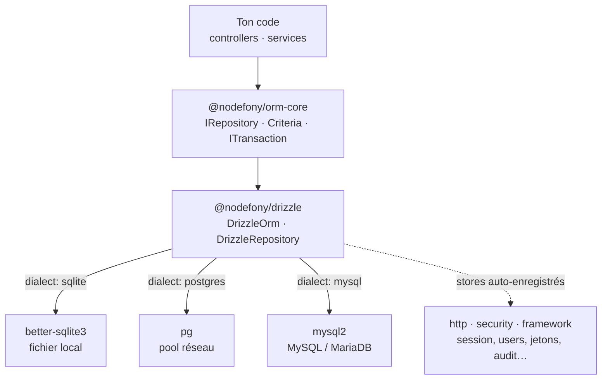
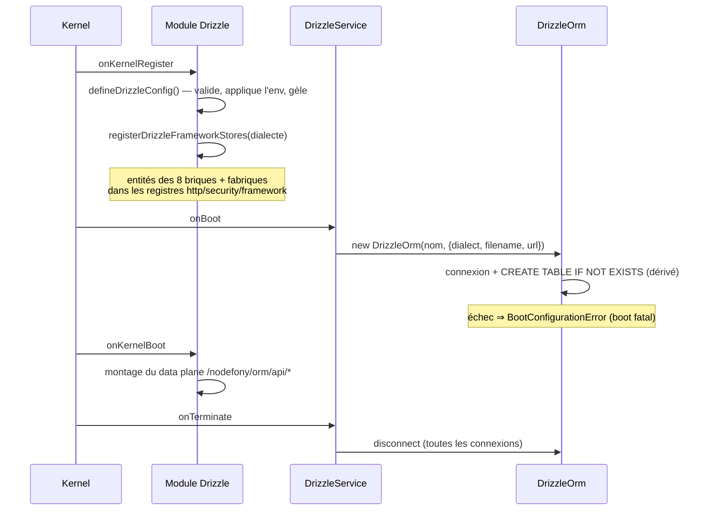

# @nodefony/drizzle — l'ORM SQL par défaut

> Le module que rencontre **toute application Nodefony** : il ouvre les connexions SQL, sert les
> repositories de tes entités, et fournit au framework les **huit briques durables** (session,
> utilisateurs, jetons, passkeys, 2FA, audit, webhooks, idempotence) sans que tu écrives une ligne de
> câblage. Un seul code applicatif, **trois dialectes** — SQLite en développement, PostgreSQL ou
> MySQL/MariaDB en production. C'est le **driver SQL** des contrats de
> [`@nodefony/orm-core`](../../orm-core/docs/index.md).

📍 [Documentation](../../../../../docs/index.md) › **Drizzle — ORM SQL**

## 🧠 Le modèle mental — trois étages, une seule vérité

Drizzle occupe l'étage du **driver**. Au-dessus, `@nodefony/orm-core` définit les contrats portables
(`IOrm`, `IRepository`, `ITransaction`) que ton code métier consomme ; en dessous, un driver natif par
dialecte. Changer de base = changer une URL, pas ton code.



Deux flux à distinguer, et c'est toute la lecture de cette page :

1. **Le flux applicatif** (trait plein) — tes entités, tes repositories, tes transactions.
2. **Le flux framework** (pointillés) — les briques durables que le module **déclare tout seul** au
   démarrage, décrites dans [les huit stores](#les-huit-stores-du-framework--la-persistance-clé-en-main).

## 📖 Lexique

| Terme           | Sens                                                                                               |
| --------------- | -------------------------------------------------------------------------------------------------- |
| ORM             | _Object-Relational Mapping_ : traduit des lignes de table en objets, et l'inverse.                 |
| Dialecte        | La variante de SQL d'un moteur (`sqlite`, `postgres`, `mysql`) — types et syntaxe diffèrent.       |
| Connecteur      | Une connexion nommée (`default`, `analytics`…). Clé de lookup dans le registre des ORM.            |
| Repository      | L'objet qui lit/écrit une entité (`find`, `create`, `updateOne`…), sans SQL visible.               |
| Entité          | Le nom logique d'une table + son schéma, déclaré à l'application (`defineEntity`).                 |
| Schema-as-code  | Le schéma **est** du code TypeScript typé, pas un fichier de description séparé.                   |
| DDL             | _Data Definition Language_ : le SQL qui crée/modifie les tables (`CREATE TABLE`, `ALTER`).         |
| Store           | **Où vivent des données** (session, jetons, audit…). À ne pas confondre avec `driver` = transport. |
| Dialecte porté  | Un dialecte sur lequel une entité framework sait se construire — sinon le store est indisponible.  |
| Criteria        | Le filtre portable d'orm-core (`{ age: { $gte: 18 } }`), traduit en SQL par le driver.             |
| Trappe SQL brut | L'accès direct au moteur pour ce que l'abstraction ne couvre pas (CTE, fenêtres, `JOIN` libres).   |
| E2E             | _End-to-end_ : un test qui parle à une **vraie** base, pas à un double.                            |
| Idempotence     | Rejouer une mutation sans la ré-exécuter (double-clic, reconnexion) — pas de double effet.         |
| PAT             | _Personal Access Token_ : une clé d'API opaque, révocable côté serveur.                            |
| GC              | _Garbage collection_ : la purge périodique des lignes expirées (pas de TTL natif en SQL).          |

## Qu'est-ce que c'est, et pourquoi c'est le défaut

Une application a besoin d'une base **dès la première minute** : une session à retenir, un compte à
créer. Le réflexe habituel — « on branchera une vraie base plus tard » — coûte cher : le code s'écrit
contre un stockage en mémoire, puis tout est à reprendre quand la persistance arrive.

Nodefony prend le problème dans l'autre sens. **Charger `@nodefony/drizzle` suffit** : une base SQLite
locale apparaît sous `var/databases/`, et toutes les briques durables du framework s'y installent
d'elles-mêmes. Le jour où tu déclares `NF_DATABASE_URL=postgres://…`, **rien ne change dans ton code**
— le même module ouvre un pool PostgreSQL et recrée les mêmes tables dans les types du dialecte.

Le nom du paquet dit le moteur choisi : [Drizzle ORM](https://orm.drizzle.team). Trois raisons l'ont
fait retenir comme référence SQL du framework :

- **Type-safe-first** — un schéma est du TypeScript ; une colonne renommée casse à la compilation, pas
  en production ;
- **léger** — pas de couche de métadonnées à l'exécution, le SQL émis reste lisible ;
- **jamais bloquant** — la trappe `sql` du moteur reste accessible pour tout ce que l'abstraction ne
  couvre pas.

> [!NOTE]
> **Le défaut n'est pas une obligation.** `@nodefony/mongoose` sert le même contrat pour MongoDB, et
> ton code métier ne fait la différence nulle part : c'est précisément la valeur d'orm-core. Voir
> [le guide de persistance](../../../../../docs/guides/persistence.md) pour arbitrer.

### La vision Nodefony — ce que le module fait différemment

Un adapter ORM classique s'arrête à « je traduis un repository en SQL ». Celui-ci va deux pas plus
loin, et ces deux pas expliquent la taille de cette page.

**1. Il porte le framework, pas seulement ton métier.** Les huit briques durables (session, users,
jetons, passkeys, TOTP, audit, webhooks, idempotence) ont leurs tables **dans le module**, déclarées
au démarrage par `registerDrizzleFrameworkStores()` (`registerStores.ts:149`). Aucune application
n'écrit de `registerXStore(...)`.

**2. Il reconstruit la portabilité que Drizzle n'offre pas.** Drizzle est schema-as-code
**dialect-spécifique** : `sqliteTable` n'est pas `pgTable`, les types de colonnes diffèrent. On ne peut
donc pas « juste changer le dialecte ». Le module rétablit cette abstraction au niveau du framework —
une spécification logique par entité, traduite dans le bon dialecte par le `colKit`
(`buildFrameworkTable()`, `colKit.ts:437`). Le coût est assumé (une fabrique par entité framework),
la contrepartie est la type-safety intégrale.

> [!IMPORTANT]
> Le `colKit` est **interne** : il n'est pas exporté. Tes entités d'application écrivent du **Drizzle
> natif** du dialecte que tu vises — c'est ce que produit `nodefony create entity`. Exposer le kit
> serait promettre une API à maintenir pour un besoin que le scaffold couvre déjà.

## 🧭 Par où commencer

Le module n'a qu'une page — celle-ci — mais plusieurs façons de la lire. Choisis ton entrée ; chaque
parcours suit un ordre qui a une raison.

**Je démarre une application** — le chemin le plus court vers des données qui survivent au redémarrage.

1. [Démarrage rapide](#-démarrage-rapide) — la config, une entité, une requête. Copie-colle, ça marche.
2. [Configuration](#-configuration) — ce que tu peux régler, et ce qui se résout tout seul.
3. [Les huit stores](#les-huit-stores-du-framework--la-persistance-clé-en-main) — pourquoi tu n'as
   rien câblé et que la session persiste quand même.
4. [Le tutoriel d'entité d'orm-core](../../orm-core/docs/tutorial-entity.md) — pour aller au-delà d'une table.

**Je passe en production** — l'ordre compte : le dialecte d'abord, le schéma ensuite.

1. [Dialectes](#dialectes--une-base-par-déploiement-un-seul-code) — ce qui change vraiment entre
   SQLite, PostgreSQL et MySQL.
2. [Migrations et création des tables](#migrations--ce-que-le-module-fait-et-ce-quil-ne-fait-pas) —
   **à lire avant le premier déploiement**, le DDL dérivé ne fait pas d'`ALTER`.
3. [Pièges](#-pièges) — les symptômes qu'on rencontre en changeant de base.
4. [Tests](#-tests--couverture) — comment prouver ton dialecte, au lieu de le supposer.

**J'écris des requêtes** — de la plus portable à la plus spécifique.

1. [Repository](#-api-publique--du-repository-au-sql-brut) — le CRUD portable et les opérateurs riches.
2. [Transactions](#transactions--une-connexion-dédiée-jamais-le-pool) — et pourquoi elles s'écrivent
   ainsi et pas autrement.
3. [Trappe SQL brut](#trappe-sql-brut--quand-labstraction-ne-suffit-plus) — CTE, fenêtres, jointures libres.
4. [Les contrats d'orm-core](../../orm-core/docs/index.md) — la référence de `Criteria` et des opérateurs.

**Je supervise ce qui tourne.**

1. [Observabilité Studio](#-observabilité--studio) — les écrans, le graphe d'entités, le data plane.
2. [Performance & mémoire](#-performance--mémoire) — le plafond connu de SQLite, et pourquoi.

## 🗂️ Ce que le module apporte

Le tableau pour situer en cinq secondes ; les cards en dessous pour savoir où lire.

| Brique                                                                    | Ce qu'elle résout                                 | Tu en as besoin quand…                       |
| ------------------------------------------------------------------------- | ------------------------------------------------- | -------------------------------------------- |
| [Connecteurs](#-configuration)                                            | ouvrir une ou plusieurs bases, par dialecte       | toujours — c'est le point d'entrée           |
| [Dialectes](#dialectes--une-base-par-déploiement-un-seul-code)            | SQLite, PostgreSQL, MySQL/MariaDB au même contrat | tu quittes le poste de développement         |
| [Entités](#-démarrage-rapide)                                             | déclarer une table et son nom logique             | tu as des données à toi                      |
| [Repository](#-api-publique--du-repository-au-sql-brut)                   | CRUD portable, opérateurs riches, pagination      | à chaque requête                             |
| [Transactions](#transactions--une-connexion-dédiée-jamais-le-pool)        | tout-ou-rien sur plusieurs écritures              | une opération ne doit jamais rester à moitié |
| [Trappe SQL](#trappe-sql-brut--quand-labstraction-ne-suffit-plus)         | CTE, fenêtres, jointures arbitraires              | l'abstraction ne couvre pas ton besoin       |
| [Les 8 stores](#les-huit-stores-du-framework--la-persistance-clé-en-main) | session, users, jetons, audit… durables           | jamais : c'est déjà branché                  |
| [Migrations](#migrations--ce-que-le-module-fait-et-ce-quil-ne-fait-pas)   | créer et faire évoluer les tables                 | avant le premier déploiement                 |
| [Studio](#-observabilité--studio)                                         | voir les connexions, les entités, le graphe       | tu veux comprendre ce qui tourne             |

```nodefony-cards
[
  { "icon": "⚙️", "title": "connecteurs", "href": "#-configuration",
    "desc": "Un connecteur = une base. `default` est celui que tout le framework utilise ; tu peux en déclarer d'autres — `analytics`, une fixture — sur leur propre fichier ou serveur. Le dialecte et la cible se déduisent de l'infra déclarée (`NF_DATABASE_URL`), sinon de ta config.",
    "meta": "commence ici — tout le reste suppose un connecteur ouvert" },
  { "icon": "🧱", "title": "entités", "href": "#-démarrage-rapide",
    "desc": "Une table Drizzle ordinaire plus un descripteur `defineEntity` qui lui donne un nom logique : aucune couche à contourner, tous les types du moteur restent accessibles. `nodefony create entity` écrit le reste — ligne typée, schémas de validation, service CRUD, controller REST/WebSocket et tests.",
    "meta": "tu as des données à toi" },
  { "icon": "🧰", "title": "repository", "href": "#-api-publique--du-repository-au-sql-brut",
    "desc": "`find`, `create`, `updateOne`, `upsert`, `increment`, `count`, la pagination — et des filtres portables (`views: { $gte: 10 }`) traduits en SQL par le driver. Le même code tourne sur les trois dialectes, prouvé par un banc de parité qui rejoue la même suite sur chacun.",
    "meta": "à chaque requête" },
  { "icon": "🔒", "title": "transactions", "href": "#transactions--une-connexion-dédiée-jamais-le-pool",
    "desc": "Ce qui réussit ensemble est commité ensemble, une exception annule tout. La section explique pourquoi une transaction emprunte une connexion dédiée au pool, et pourquoi seul `repo.withTransaction(tx)` y entre réellement — l'erreur classique coûte l'atomicité sans prévenir.",
    "meta": "une opération ne doit jamais rester à moitié" },
  { "icon": "📦", "title": "stores", "href": "#les-huit-stores-du-framework--la-persistance-clé-en-main",
    "desc": "Session, utilisateurs, jetons, passkeys, TOTP, audit, webhooks, idempotence : leurs tables vivent dans le module, leurs fabriques s'inscrivent seules dans les registres de `http`, `security` et `framework`. Rien à écrire.",
    "meta": "à lire pour savoir où sont tes données, ou pour couper la déclaration" },
  { "icon": "🗃️", "title": "dialectes", "href": "#dialectes--une-base-par-déploiement-un-seul-code",
    "desc": "Ce qui reste identique (les noms de colonnes, le contrat du repository) et ce qui diverge, avec la raison : types epoch/date/JSON, absence de `RETURNING` en MySQL, `OFFSET` sans `LIMIT`.",
    "meta": "à lire avant de changer de base, pas après le premier incident" },
  { "icon": "🚧", "title": "migrations", "href": "#migrations--ce-que-le-module-fait-et-ce-quil-ne-fait-pas",
    "desc": "En développement, les tables sont créées au démarrage par un DDL dérivé de tes schémas. Ce DDL ne fait aucun `ALTER`, n'émet ni `DEFAULT` SQL ni index : la section dit ce que ça implique en production, et ce que le framework ne fournit pas encore.",
    "meta": "le point à ne pas rater avant le premier déploiement" }
]
```

## 🚀 Démarrage rapide

Vu depuis une application créée par `nodefony create app`. Trois fichiers, et des données qui
survivent au redémarrage.

### 1. Déclarer le module

Le manifeste `modules` de `nodefony.config.ts` est **ordonné** : Drizzle vient avant les modules qui
consomment ses stores, parce qu'il déclare leur schéma au moment où le kernel enregistre les modules.

```ts
// nodefony.config.ts — l'orchestrateur de l'application
export default defineConfig(() => ({
  modules: [
    // Drizzle EN PREMIER : il déclare le schéma des briques durables (session,
    // users, jetons…) AVANT que http/security/framework ne résolvent leurs stores.
    use("@nodefony/drizzle", {
      connectors: {
        // `filename` est facultatif : omis, il est résolu au boot vers
        // <app>/var/databases/nodefony-drizzle.db — un seul dossier à sauvegarder.
        default: { dialect: "sqlite", filename: "var/databases/app.db" },
      },
    }),
    "@nodefony/http",
    "@nodefony/framework",
  ],
}));
```

### 2. Déclarer une entité

La table est du **Drizzle natif** — pas une couche Nodefony. `defineEntity` ne fait que lui attacher un
nom logique ; c'est le décorateur `@entities([...])` posé sur ton module qui l'inscrit au démarrage,
avant toute connexion.

```ts
// nodefony/entity/Post.ts + index.ts du module, réunis ici pour l'exemple
import { integer, sqliteTable, text } from "drizzle-orm/sqlite-core";
import { defineEntity, entities } from "@nodefony/orm-core";
import { Kernel, Module } from "nodefony";

export const postTable = sqliteTable("Post", {
  id: text("id")
    .primaryKey()
    .$defaultFn(() => crypto.randomUUID()),
  title: text("title").notNull(),
  // ⚠️ TOUJOURS `$defaultFn` (défaut posé côté JS), JAMAIS `.default()` (SQL) :
  // le DDL dérivé n'émet pas de DEFAULT — une colonne NOT NULL casserait l'INSERT.
  views: integer("views")
    .notNull()
    .$defaultFn(() => 0),
});

/** Une ligne de `Post`, telle que la rend le repository. */
export interface PostRow {
  id: string;
  title: string;
  views: number;
}

export const PostEntity = defineEntity({
  name: "Post", // le nom logique passé à getRepository()
  module: "blog",
  schema: postTable,
});

// Le connecteur n'est PAS figé dans l'entité : c'est une donnée de configuration,
// résolue au démarrage (défaut `default`).
@entities([PostEntity])
class Blog extends Module {
  constructor(kernel: Kernel) {
    super("blog", kernel, import.meta.url, {});
  }
}

export default Blog;
```

### 3. Lire et écrire

Le repository se récupère par le **nom logique** de l'entité, sur le connecteur voulu. Les filtres sont
portables : le même code tournera tel quel sur PostgreSQL.

```ts
// nodefony/service/PostService.ts (extrait)
import { ormRegistry } from "@nodefony/orm-core";

// Dans l'application : `import type { PostRow } from "../entity/Post";`
interface PostRow {
  id: string;
  title: string;
  views: number;
}

export async function popularPosts(): Promise<PostRow[]> {
  const posts = ormRegistry.get("default").getRepository<PostRow>("Post");

  await posts.create({ title: "Bonjour" }); // id et views posés par $defaultFn
  await posts.increment({ title: "Bonjour" }, { views: 1 });

  return posts.find(
    { views: { $gte: 10 } }, // opérateur riche portable
    { order: [["views", "DESC"]], limit: 5 },
  );
}
```

### Ce qu'on observe

```bash
# Au démarrage : le connecteur s'ouvre et annonce sa cible
# INFO  Drizzle ORM "default" connected (sqlite: var/databases/app.db)

# La base est là, la table aussi (créée au connect depuis ton schéma)
sqlite3 var/databases/app.db '.tables'
# Post  audit_event  idempotency_key  session  User  access_token  …

# Et le data plane d'administration voit le modèle
curl -s http://localhost:5151/nodefony/orm/api/entities | head -20
```

> [!TIP]
> Tu n'as déclaré **aucun** store. Les tables `session`, `User`, `access_token`… apparaissent quand
> même : c'est l'[auto-enregistrement](#les-huit-stores-du-framework--la-persistance-clé-en-main).

## ⚙️ Configuration

### La convention à deux fichiers — drizzle est la référence du dépôt

Tout module Nodefony qui expose une configuration suit **exactement** cette structure, et c'est celle
de drizzle qui sert de modèle. Deux fichiers, mêmes noms partout, aucune question à se poser :

| Fichier                                 | Rôle           | Contenu                                                                       |
| --------------------------------------- | -------------- | ----------------------------------------------------------------------------- |
| `nodefony/config/config.ts`             | **le QUOI**    | schéma Zod commenté = source **unique** des défauts, matérialisés `parse({})` |
| `nodefony/config/defineModuleConfig.ts` | **le COMMENT** | builder **pur** : parse → surcharge d'environnement → gel                     |

Concrètement : `drizzleConfigSchema` (`config.ts:79`) porte chaque `.default()` et chaque
`.describe()` — changer un défaut du module, c'est éditer **là et nulle part ailleurs**. Le builder
`defineDrizzleConfig()` (`defineModuleConfig.ts:58`) ne retape jamais une valeur : il valide, applique
l'environnement, gèle. Et `drizzleConfigJsonSchema()` (`defineModuleConfig.ts:69`) expose le tout en
JSON Schema pour l'écran de configuration de Studio.

Le schéma reste **pur** : il ne lit ni `process.env` ni le kernel. C'est ce qui rend le module
importable et testable sans serveur.

### Les options

| Option                    | Type                                | Défaut             | Effet                                                                  |
| ------------------------- | ----------------------------------- | ------------------ | ---------------------------------------------------------------------- |
| `connectors`              | `Record<string, Connector>`         | `{ default: {…} }` | Les connexions, indexées par nom (= clé du registre des ORM).          |
| `connectors.<n>.dialect`  | `"sqlite" \| "postgres" \| "mysql"` | `"sqlite"`         | Choisit le driver (`better-sqlite3` / `pg` / `mysql2`).                |
| `connectors.<n>.filename` | `string`                            | _résolu au boot_   | Fichier SQLite. `:memory:` = base éphémère. Ignoré hors `sqlite`.      |
| `connectors.<n>.url`      | `string`                            | —                  | Chaîne de connexion `postgres://…` / `mysql://…`. **Porte un secret.** |
| `frameworkEntities`       | `boolean`                           | `true`             | Déclare (ou non) le schéma des huit briques durables sur `default`.    |

Table dérivée de `drizzleConfigSchema` (`config.ts:79`) et de `SQL_DIALECTS` (`config.ts:37`).

**`filename` est volontairement sans défaut.** Le chemin dépend du kernel, qui n'existe pas quand le
schéma est évalué. Il est résolu **au démarrage** par `DrizzleService.#defaultFilename()`
(`DrizzleService.ts:95`) vers `<app>/var/databases/nodefony-<connecteur>.db` — sous `var/`, le dossier
commun des données runtime : « où sont mes données ? » a une réponse unique, un seul chemin à
sauvegarder et à ignorer dans git.

### Trois façons de désigner sa base

L'ordre de précédence est croissant : le défaut, puis ta config, puis l'environnement.

**Situation 1 — je développe.** Rien à écrire. Charger le module suffit : dialecte `sqlite`, fichier
sous `var/databases/`, tables créées au démarrage.

**Situation 2 — je déploie, l'infra est déclarée par l'orchestrateur.** C'est le chemin normal en
conteneur : une seule variable, et le module en déduit **tout**.

```bash
NF_DATABASE_URL=postgres://app:secret@db:5432/prod   # dialecte + cible déduits
NF_DATABASE_URL=mysql://app:secret@db:3306/prod
NF_DATABASE_URL=sqlite:/var/lib/app/prod.db
```

`applyEnvOverrides()` (`defineModuleConfig.ts:20`) lit l'infra, en déduit le dialecte depuis le
_scheme_, et pose `filename` ou `url` sur le connecteur primaire. Une URL `mongodb://` est **ignorée
ici** : elle appartient alors à `@nodefony/mongoose`.

**Situation 3 — plusieurs bases.** Un connecteur par base. Seul `default` porte le schéma du framework ;
les autres sont à toi.

```ts ignore
use("@nodefony/drizzle", {
  connectors: {
    default: { dialect: "postgres", url: process.env.NF_DATABASE_URL },
    analytics: { dialect: "sqlite", filename: "var/databases/analytics.db" },
  },
});
```

> [!WARNING]
> Une URL de connexion **porte un mot de passe**. Le module ne la journalise jamais telle quelle :
> `redactUrl()` (`DrizzleService.ts:15`) remplace le mot de passe par `***` avant tout log de
> démarrage, et la sonde d'administration applique la même règle.

### Quand la connexion échoue, le démarrage échoue

Un connecteur **déclaré** qui ne se connecte pas lève une `BootConfigurationError`
(`DrizzleService.ts:129`) — en développement **comme** en production. Ce n'est pas une sévérité
gratuite : une infrastructure déclarée mais injoignable ne se répare pas en continuant. Un serveur qui
démarrerait « vivant » avec ses stores morts accepterait des requêtes pour échouer plus tard, la cause
noyée dans un avertissement. Le message d'erreur nomme le connecteur, le dialecte, la cible rédigée et
la piste à vérifier.

Pour les dialectes réseau, la connexion fait un **ping réel** au démarrage : les pools `pg` et `mysql2`
sont paresseux, sans ce `SELECT 1` une base morte « se connecterait » et n'échouerait qu'à la première
requête métier (`#connectPostgres()`, `DrizzleOrm.ts:418` · `#connectMysql()`, `DrizzleOrm.ts:502`).

## Dialectes — une base par déploiement, un seul code

Trois dialectes au même contrat. Le tableau dit ce qu'il faut installer et ce qu'on obtient.

| Dialecte   | Driver           | Statut du paquet           | Cible                                      | Configuration |
| ---------- | ---------------- | -------------------------- | ------------------------------------------ | ------------- |
| `sqlite`   | `better-sqlite3` | **dépendance** (fournie)   | développement, tests, production mono-nœud | `filename`    |
| `postgres` | `pg`             | dépendance **optionnelle** | production multi-pod (recommandé)          | `url`         |
| `mysql`    | `mysql2`         | dépendance **optionnelle** | production — **MySQL 8.4 et MariaDB 11.4** | `url`         |

Les drivers réseau sont chargés **paresseusement** au moment de la connexion : une application SQLite
ne paie ni l'installation ni le chargement de `pg`/`mysql2`.

### Ce qui ne change pas

- **Les noms de colonnes**, identiques sur les trois dialectes — c'est ce qui rend les stores et les
  repositories agnostiques ;
- **le contrat `IRepository`** en entier, prouvé par un banc de parité qui rejoue la **même** suite sur
  les trois moteurs — un écart de comportement y est un bug du framework, par construction ;
- **ton code applicatif**. C'est tout l'objet de l'exercice.

### Ce qui diverge, et pourquoi

Ces divergences sont **encapsulées** dans le module. Elles sont listées ici pour que tu saches quoi
regarder si un comportement te surprend.

| Sujet                     | SQLite                   | PostgreSQL         | MySQL / MariaDB                | Raison                                                       |
| ------------------------- | ------------------------ | ------------------ | ------------------------------ | ------------------------------------------------------------ |
| Horodatage epoch (ms)     | `integer`                | `bigint`           | `bigint`                       | `integer` est 32 bits en PG/MySQL : un epoch ms déborde.     |
| Date JS                   | `integer` (timestamp ms) | `timestamptz(3)`   | `datetime(3)`                  | `timestamp` MySQL est borné à 2038 et dépend de la timezone. |
| JSON                      | `text` (mode json)       | `jsonb`            | type JSON compatible MariaDB   | MariaDB rend une chaîne (LONGTEXT), MySQL un objet.          |
| Booléen                   | `integer`                | `boolean`          | `boolean` (alias `tinyint(1)`) | SQLite n'a pas de type booléen.                              |
| Texte indexé / PK         | `text`                   | `text`             | `varchar(512)`                 | InnoDB n'indexe pas `TEXT` sans préfixe.                     |
| Retour d'une ligne écrite | `RETURNING`              | `RETURNING`        | **absent** → relecture par PK  | MySQL n'a pas de `RETURNING`.                                |
| `OFFSET` sans `LIMIT`     | fragment `-1`            | rien (valide seul) | `LIMIT` sentinelle             | Chaque moteur refuse une forme différente.                   |

Toute cette traduction vit à **un seul endroit**, le `colKit` (`buildFrameworkTable()`,
`colKit.ts:437` ; variante MySQL : `mysqlColumn()`, `colKit.ts:335`). Ajouter un dialecte, c'est
étendre le kit — jamais retoucher les entités.

En MySQL, les verbes « qui rendent la ligne écrite » (`create`, `updateOne`, `upsert`,
`findOneAndDelete`) se décomposent en sélection de la cible → mutation bornée par la clé primaire **avec
le critère revérifié dans le `WHERE`** → relecture. Deux à trois allers-retours au lieu d'un : c'est le
prix du dialecte, payé **uniquement** en MySQL. Une course perdue rend `null`, jamais une mutation hors
critère (`#mysqlInsertReturning()`, `DrizzleRepository.ts:897`).

Le SQL brut nécessaire aux entités du framework est lui aussi routé par dialecte, dans un seul fichier
(`queryKit.ts`) : recherche dans une colonne JSON (`findUserIdBySocialProvider()`, `queryKit.ts:76`),
réservation atomique d'idempotence en MySQL (`reserveIdempotencyKeyMysql()`, `queryKit.ts:152`),
pagination des utilisateurs (`listUserIdsPage()`, `queryKit.ts:352`). Toutes ces requêtes sont
**paramétrées** — jamais de concaténation.

## 🏗️ Architecture interne

### Le trajet du démarrage



L'ordre est ce qui rend l'auto-enregistrement possible : **les entités sont déclarées avant la
connexion**, donc leurs tables sont créées au moment où l'ORM s'ouvre.

### Les pièces

| Pièce                  | Rôle                                                                   | Ancre                                                        |
| ---------------------- | ---------------------------------------------------------------------- | ------------------------------------------------------------ |
| `Drizzle` (le module)  | valide la config, déclare le schéma framework, monte le data plane     | `index.ts` du module                                         |
| `DrizzleService`       | ouvre un ORM par connecteur au boot, ferme tout à l'arrêt              | `connectAll()`, `DrizzleService.ts:79`                       |
| `DrizzleOrm`           | la connexion : DDL dérivé, repositories, transactions, sonde           | `DrizzleOrm.ts:115`                                          |
| `DrizzleRepository<T>` | le CRUD portable, les opérateurs riches, l'eager-load                  | `DrizzleRepository.ts:115`                                   |
| `DrizzleTransaction`   | `BEGIN`/`COMMIT`/`ROLLBACK` pilotés à la main, sur les trois dialectes | `DrizzleTransaction.ts:70`                                   |
| `colKit` (interne)     | une spécification logique → la table du dialecte demandé               | `colKit.ts:437`                                              |
| `queryKit` (interne)   | le SQL brut des entités framework, émis **et exécuté** par dialecte    | `findUserIdBySocialProvider()` (`queryKit.ts:76`)            |
| `registerStores`       | l'auto-enregistrement des huit briques                                 | `registerDrizzleFrameworkStores()` (`registerStores.ts:149`) |

### Le DDL dérivé — comment les tables apparaissent

Drizzle ne « synchronise » pas un schéma. L'adapter dérive lui-même un `CREATE TABLE IF NOT EXISTS`
depuis chaque table déclarée (`#buildCreateTable()`, `DrizzleOrm.ts:218`) et l'exécute à la connexion.
Trois conséquences à connaître **avant** de dépendre de ce mécanisme :

1. il **crée**, il ne **modifie** pas — aucun `ALTER` n'est émis ;
2. il n'émet **ni `DEFAULT` SQL ni index** — d'où la règle des défauts en `$defaultFn` ;
3. il ne connaît que les colonnes, les clés primaires, `NOT NULL` et `UNIQUE`.

C'est un confort de développement, pas un outil de migration. La suite est dans
[Migrations](#migrations--ce-que-le-module-fait-et-ce-quil-ne-fait-pas).

## 🧰 API publique — du repository au SQL brut

Les signatures exactes vivent dans le graphe généré (`jq '.symbols.DrizzleRepository' .ai/symbols.json`)
— jamais recopiées ici, elles divergeraient. Ce qui suit montre **l'usage**.

### Le repository

```ts ignore
const posts = ormRegistry.get("default").getRepository<PostRow>("Post");

// Lecture — égalité, opérateurs riches, tri, pagination, eager-load
await posts.find({ title: "Bonjour" });
await posts.find({ views: { $gte: 10, $lt: 1000 } }); // plusieurs opérateurs = AND
await posts.find({ id: { $in: ids } });
await posts.find({ title: { $like: "Bon%" } }); // sémantique SQL (`%`, `_`)
await posts.find({ title: { $like: escapeLikeTerm("100%") } }); // `%` littéral
await posts.find({}, { order: [["views", "DESC"]], limit: 20, offset: 40 });
await posts.find({}, { relations: ["comments"] }); // associations déclarées

// Écriture
await posts.create({ title: "Neuf" });
await posts.createMany([{ title: "a" }, { title: "b" }]);
await posts.updateOne({ id }, { title: "Corrigé" }); // rend la ligne, ou null
await posts.upsert({ id }, { title: "Neuf" });
await posts.increment({ id }, { views: 1 }); // compteur atomique
await posts.deleteOne({ id });
await posts.count({ views: { $gte: 10 } });
```

Les opérateurs (`$eq $ne $gt $gte $lt $lte $in $nin $like`) sont **ceux d'orm-core**, identiques sur
tous les drivers ; la traduction en `eq()`/`inArray()` se fait dans `#where()`
(`DrizzleRepository.ts:331`). Leur référence complète est dans
[la page d'orm-core](../../orm-core/docs/index.md).

`$like` est émis avec sa clause `ESCAPE '\'` (`likeSql.ts`), ce qui rend un `%` ou un `_` **littéral**
exprimable : passez le fragment par `escapeLikeTerm` (orm-core) plutôt que de composer le motif à la
main. Sans cette clause — c'était le cas — un antislash valait échappement en PostgreSQL et MySQL, et
lui-même en SQLite : le même critère ne rendait pas les mêmes lignes selon la base.

Deux points de comportement qui évitent des surprises :

- **« au plus une ligne »** est garanti par construction pour `updateOne`/`deleteOne`/`increment` :
  la mutation est bornée par la clé primaire découverte de la table, jamais par un `LIMIT` sur un
  `UPDATE` (`#pickOne()`, `DrizzleRepository.ts:213`). C'est ce qui rend ces verbes portables — MySQL
  interdit la forme naïve.
- **l'eager-load est manuel** : une requête `IN (…)` par relation déclarée, puis regroupement en
  mémoire (`#populate()`, `DrizzleRepository.ts:442`). Choix assumé — pas de couche de relations à
  déclarer une seconde fois, et le comportement est le même sur les trois dialectes.

### Transactions — une connexion dédiée, jamais le pool

```ts ignore
await orm.transaction(async (tx) => {
  // withTransaction(tx) est le SEUL moyen d'entrer dans la transaction
  const author = await users.withTransaction(tx).create({ email: "x@y.z" });
  await posts.withTransaction(tx).create({ title: "…", authorId: author.id });
  // une exception ⇒ ROLLBACK de tout ; sinon COMMIT automatique
});
```

Le module pilote `BEGIN`/`COMMIT`/`ROLLBACK` **à la main** plutôt que d'utiliser l'aide du moteur, pour
une raison précise : `better-sqlite3` est **synchrone**, son helper commite au `return` — donc _avant_
les `await` d'un contrat asynchrone. Le pilotage manuel rétablit la sémantique attendue
(`DrizzleTransaction`, `DrizzleTransaction.ts:70`).

> [!WARNING]
> **`getRepository()` écrit HORS transaction.** Un repository obtenu normalement passe par le pool ;
> seul `repo.withTransaction(tx)` emprunte la connexion de la transaction. C'est l'erreur la plus
> coûteuse du domaine : sur PostgreSQL/MySQL, le `BEGIN` et les écritures partiraient sur des
> connexions différentes — **aucune atomicité**, et un `BEGIN` orphelin recyclé dans le pool.

Le mécanisme diffère par dialecte, sans que ton code le voie : en PostgreSQL/MySQL la transaction
emprunte une connexion **dédiée** au pool, rendue au commit — et **détruite** si celui-ci échoue,
jamais recyclée dans un état inconnu. En SQLite la connexion est unique, donc c'est un pool de taille 1 :
les transactions concurrentes sont **sérialisées par une file d'attente** (`#sqliteTxGate`,
`DrizzleOrm.ts:149`), sinon deux requêtes HTTP simultanées émettraient deux `BEGIN` sur la même
connexion et la seconde échouerait.

Les points de sauvegarde sont disponibles (`savepoint()`, `DrizzleTransaction.ts:123`) ; le nom est
validé et cité selon le dialecte — en MySQL/MariaDB, `"x"` est une **chaîne**, pas un identifiant.

### Trappe SQL brut — quand l'abstraction ne suffit plus

Toute requête que le repository ne couvre pas s'écrit directement, avec le moteur :

```ts ignore
import { sql } from "drizzle-orm";

const db = orm.getNativeConnection<DrizzleDb>();
const rows = await db.all(sql`
  WITH ranked AS (
    SELECT id, title, views,
           ROW_NUMBER() OVER (PARTITION BY authorId ORDER BY views DESC) AS rk
    FROM Post
  )
  SELECT * FROM ranked WHERE rk = 1
`);
```

C'est l'**anti-blocage** du modèle Repository (`getNativeConnection()`, `DrizzleOrm.ts:768`) : CTE,
fonctions de fenêtre, sous-requêtes corrélées, jointures arbitraires. Deux contreparties assumées :
ce SQL n'est plus portable entre dialectes, et il **ne passe pas** par la sonde de profilage des
requêtes.

## Les huit stores du framework — la persistance clé en main

C'est la partie qui distingue ce module d'un simple adapter : **charger `@nodefony/drizzle` rend huit
briques durables disponibles**, sans aucun câblage.

| Brique       | Table(s)                                           | Contrat servi              | Ce que ça rend durable                  |
| ------------ | -------------------------------------------------- | -------------------------- | --------------------------------------- |
| Session      | `session`                                          | `ISessionStorage` (http)   | les sessions survivent au redémarrage   |
| Utilisateurs | `User`                                             | `IUserRepository` (user)   | l'annuaire des comptes                  |
| Jetons       | `access_token`, `denied_jti`, `subject_revocation` | `ITokenStore` (security)   | PAT, denylist JWT, révocation par sujet |
| Passkeys     | `webauthn_credential`                              | `IWebAuthnCredentialStore` | les clés WebAuthn enrôlées              |
| 2FA (TOTP)   | `totp_secret`                                      | `ITotpSecretStore`         | les secrets 2FA (chiffrés en amont)     |
| Audit        | `audit_event`                                      | `IAuditStore`              | le journal de sécurité, append-only     |
| Webhooks     | `webhook_endpoint`                                 | `IWebhookStore`            | le registre des destinataires           |
| Idempotence  | `idempotency_key`                                  | `IIdempotencyStore` (core) | la dédup des mutations, **partagée**    |

Les huit sont portées sur les **trois** dialectes. Chaque table est déclarée par une spécification
logique traduite par le colKit — par exemple la session (`SESSION_TABLE_SPEC`, `sessionEntity.ts:25`)
ou l'idempotence (`createIdempotencyTable`, `idempotencyEntity.ts:85`).

### Comment ça s'active — la réponse est : tout seul

Chaque brique choisit son backend par une option `store`, dont le **défaut est `"auto"`**. La
résolution automatique (`resolveAutoStore()`, `infra.ts:241`) applique cette préférence :

1. une infra `database` déclarée (`NF_DATABASE_URL`) → **`drizzle`** (ou `mongoose` si l'URL est Mongo) ;
2. sinon, un backend local persistant réellement chargé → **`drizzle`**, c'est-à-dire SQLite ;
3. sinon seulement, repli en mémoire (volatil), **annoncé** dans les journaux.

Autrement dit : le simple fait de charger ce module fait basculer session, jetons, audit, passkeys,
2FA, webhooks et idempotence sur une base **persistante**. Le journal de démarrage dit toujours quel
backend a été retenu **et pourquoi** — `audit.store "auto" → "drizzle" (aucune infra déclarée — backend
local persistant "drizzle" (mono-nœud))`.

Tu peux évidemment forcer :

```ts ignore
use("@nodefony/http", { session: { store: "drizzle" } });
use("@nodefony/security", {
  audit: { store: "drizzle" },
  tokenStore: { store: "drizzle" },
});
```

> [!IMPORTANT]
> **Les TSDoc de deux fichiers du module décrivent une « approche B » où l'application câblerait
> elle-même la fabrique et l'entité d'idempotence** (`DrizzleIdempotencyStore.ts:97` ·
> `idempotencyEntity.ts:32`). Ce n'est plus le comportement : le module inscrit lui-même la fabrique
> via `registerIdempotencyStore()` (`registerStores.ts:316`). **Le code exécuté fait autorité** —
> ces commentaires sont périmés.

### Le mécanisme, et comment garder la main

`registerDrizzleFrameworkStores()` (`registerStores.ts:149`) est appelé à l'enregistrement du module,
avec le dialecte du connecteur `default`. Pour chaque brique, il déclare l'entité puis inscrit la
fabrique du store dans le registre de son propriétaire (`http`, `security` ou `framework`). Deux
garde-fous préservent ta liberté :

- **entité déjà enregistrée par l'application** → elle est respectée, jamais écrasée ;
- **fabrique déjà posée** → elle garde la main (premier arrivé, premier servi).

Et deux garde-fous protègent de l'incohérence :

- une brique **non portée** sur le dialecte configuré n'est ni déclarée ni fabricable — la
  sélectionner échoue franchement au démarrage plutôt que de produire une table fantôme ;
- la fabrique **capture le dialecte** de son enregistrement : elle refuse un ORM d'un autre dialecte
  (`resolveConnectedOrm()`, `registerStores.ts:112`).

Pour tout couper — module « données seulement », aucune entité ni fabrique framework :

```ts ignore
use("@nodefony/drizzle", { frameworkEntities: false });
```

Le bilan de l'opération (déclarées / laissées à l'application / non portées) est **journalisé**, jamais
silencieux.

### Deux comportements à connaître

**La résolution du handle est paresseuse.** Les stores ne capturent pas la connexion à leur
construction : ils la résolvent à chaque appel. C'est nécessaire parce que l'ordre n'est pas garanti —
le framework résout ses stores avant que l'ORM ne soit connecté — et parce que l'ORM se **déconnecte à
l'arrêt** avant que les serveurs HTTP n'aient fini de vider leurs requêtes en vol. Handle absent =
dégradation annoncée, pas un plantage : le `SessionStorage` rend une session vide et ignore les
écritures (`#repo()`, `SessionStorage.ts:65`), le store d'idempotence laisse passer la mutation sans
dédup (`begin()`, `DrizzleIdempotencyStore.ts:200`).

**SQL n'a pas de TTL.** Contrairement à Redis, rien n'expire tout seul : chaque store expose un `gc()`
applicatif qui supprime les lignes échues, déclenché par un minuteur hors du chemin chaud —
sessions (`SessionStorage.ts:166`), jetons (`DrizzleTokenStore.ts:297`), idempotence
(`DrizzleIdempotencyStore.ts:318`), audit selon la rétention configurée (`DrizzleAuditStore.ts:231`).

### Deux détails de conception qui valent la lecture

**L'idempotence** est une **réservation atomique** : un `INSERT … ON CONFLICT(key) DO UPDATE … WHERE
expiré` dont le `RETURNING` ne rend une ligne que si l'insertion (clé neuve) ou le vol d'une entrée
morte a réellement eu lieu. C'est l'équivalent SQL du `SET NX PX` de Redis, en une instruction — et
c'est ce qui interdit de conclure « nouvelle mutation » hors d'une réservation gagnée. En MySQL, où ni
`RETURNING` ni `WHERE` ne sont disponibles sur un `ON DUPLICATE KEY UPDATE`, la même garantie s'obtient
en deux instructions au verdict non ambigu (`reserveIdempotencyKeyMysql()`, `queryKit.ts:152`).

**Le journal d'audit** pagine par un curseur **composite auto-portant** `<horodatage>:<id>` sur un ordre
total, plutôt que par un identifiant seul (`listPage()`, `DrizzleAuditStore.ts:154`). Deux gains : plus
d'aller-retour pour résoudre le curseur, et une pagination qui ne rembobine pas à la première page si
l'événement de référence a été purgé entre deux appels.

Le détail fonctionnel de ces briques vit chez leur propriétaire :
[audit](../../security/docs/audit.md) · [jetons](../../security/docs/tokens.md) ·
[passkeys](../../security/docs/webauthn.md) · [TOTP](../../security/docs/totp.md) ·
[webhooks](../../security/docs/webhooks.md) · [idempotence](../../framework/docs/idempotence.md) ·
[stockage de session](../../../../../docs/guides/session-storage.md).

## Migrations — ce que le module fait, et ce qu'il ne fait pas

**Ce qu'il fait** : en développement et en test, chaque table déclarée est créée à la connexion par un
`CREATE TABLE IF NOT EXISTS` dérivé de ton schéma. Tu n'as rien à lancer, la base part de zéro et
fonctionne.

**Ce qu'il ne fait pas**, et c'est le point à ne pas découvrir en production :

| Attente                               | Réalité                                                                  |
| ------------------------------------- | ------------------------------------------------------------------------ |
| « je modifie ma table, ça suit »      | **Non** — aucun `ALTER`. Une table existante n'est jamais retouchée.     |
| « mes `.default()` SQL s'appliquent » | **Non** — le DDL dérivé ne les émet pas. Utilise `$defaultFn` (côté JS). |
| « mes index sont créés »              | **Non** — ils ne sortent que via `drizzle-kit`.                          |
| « `nodefony orm:migrate` existe »     | **Non** — la commande n'existe pas encore. Le scaffold le dit lui-même.  |

**En développement**, faire évoluer une table = supprimer le fichier SQLite (ou la table) et laisser le
démarrage la recréer. **En production**, les migrations passent par `drizzle-kit`, l'outil du moteur :
il lit tes schémas — y compris les index et les `DEFAULT` SQL que le DDL dérivé ignore — et produit des
migrations versionnées par dialecte.

> [!CAUTION]
> Ne compte pas sur le DDL dérivé pour un déploiement. Il est conçu pour qu'une base **neuve**
> fonctionne, pas pour faire évoluer une base **existante**. Un schéma modifié sur une base déjà créée
> échouera à l'écriture, pas au démarrage — le pire des moments.

## 📡 Observabilité — Studio

Le module monte le **data plane d'administration ORM** au démarrage — un branchement global, idempotent,
que chaque driver déclenche à l'identique (orm-core étant une bibliothèque pure, il ne peut pas le
faire lui-même).

| Route                                   | Contenu                                  |
| --------------------------------------- | ---------------------------------------- |
| `GET /nodefony/orm/api/orms`            | les ORM et connecteurs, avec leur santé  |
| `GET /nodefony/orm/api/entities`        | les entités (`?connector=` pour filtrer) |
| `GET /nodefony/orm/api/entity/{name}`   | une entité et ses colonnes normalisées   |
| `GET /nodefony/orm/api/graph`           | le graphe complet du modèle de données   |
| `GET /nodefony/orm/api/export/{format}` | export du schéma (`dbml`)                |

Côté écrans : **Database**, **ORM (vue d'ensemble et par entité)** et **Stores** — ce dernier répond à
la question « où sont écrites mes données ? » pour chaque brique.

La sonde d'un connecteur s'adapte au dialecte (`probe()`, `DrizzleOrm.ts:813`) :

- **SQLite** → `storage` : taille du fichier, mode de journal, pages libres (lus par `PRAGMA`) ;
- **PostgreSQL / MySQL** → `pool` : taille, connexions libres, empruntées, en attente — **compteurs en
  mémoire, aucune requête émise**.

La taille d'une base **serveur** n'est délibérément **pas** sondée : la mesurer coûterait une requête à
chaque appel, pour une donnée que l'administration du SGBD expose déjà. Ne rien promettre vaut mieux
que promettre en silence — c'est le principe « superviser sans peser sur la production ».

Chaque store expose aussi son **emplacement physique** pour l'écran Stores : le chemin du fichier
SQLite, relativisé (anti-fuite d'information), et `undefined` pour un backend réseau — dont
l'emplacement **est** l'infra déclarée, déjà affichée ailleurs (`location`, `DrizzleOrm.ts:190`).

## ⚡ Performance & mémoire

**La sonde de requêtes ne coûte rien quand elle est éteinte.** Chaque exécution passe par un point de
mesure unique (`#prof()`, `DrizzleRepository.ts:279`) qui alimente deux consommateurs — le profileur
par requête (barre de debug) et l'agrégat de flux. Les deux sont gardés par un drapeau : si aucun n'est
actif, la fonction rend le constructeur de requête tel quel, sans allocation. Le flux est **désactivé
en production** par défaut.

La sérialisation du SQL n'est faite que sur le **chemin lent** (au-delà du seuil de requête lente),
jamais au cas nominal — et le SQL journalisé est la forme **paramétrée** (`?`), jamais les valeurs.

**Le plafond de SQLite est structurel, pas un défaut.** `better-sqlite3` est synchrone et
mono-connexion : les écritures sont sérialisées. Sur un banc de session en HTTP/2, cela donne un
plafond stable autour de **400 requêtes/s** avec 100 % de réponses correctes et zéro session perdue ;
augmenter la concurrence augmente la latence, pas le débit. PostgreSQL ou MySQL paralléliseraient. Si
tu vises plus haut, ce n'est pas le module qu'il faut changer, c'est le dialecte.

Les bancs de charge du module (`npm run test:load`) mesurent l'insertion, le balayage, les gros `$in`,
et vérifient l'absence de fuite mémoire sur des dizaines de milliers de cycles et des centaines de
connexions. Les chiffres vivent dans la sortie du banc, pas ici — ils dépendent de la machine.

## ⚠️ Pièges

| Symptôme                                                             | Cause                                                                      | Correction                                                                |
| -------------------------------------------------------------------- | -------------------------------------------------------------------------- | ------------------------------------------------------------------------- |
| Une écriture dans `transaction()` n'est pas annulée                  | repository obtenu par `getRepository()` → passe par le **pool**, hors tx   | `repo.withTransaction(tx)` — le seul moyen d'entrer dans la transaction   |
| `NOT NULL constraint failed` sur une colonne pourtant « par défaut » | `.default()` SQL : le DDL dérivé ne l'émet pas                             | poser le défaut côté JS : `$defaultFn(() => …)`                           |
| Colonne ajoutée, table inchangée                                     | le DDL dérivé **ne fait aucun `ALTER`**                                    | supprimer la base de dev, ou passer par `drizzle-kit`                     |
| Index déclaré, absent en base                                        | les index ne sortent que via `drizzle-kit`                                 | migration `drizzle-kit` en production                                     |
| Le démarrage échoue sur le connecteur                                | infra déclarée injoignable → `BootConfigurationError` (voulu)              | corriger l'URL / démarrer la base / retirer le connecteur                 |
| `cannot start a transaction within a transaction` (SQLite)           | deux `BEGIN` concurrents sur la connexion unique                           | rien à faire : la file d'attente interne les sérialise                    |
| Une entité fonctionne en SQLite, échoue en PostgreSQL                | table Drizzle **figée** sur un dialecte, posée sur le connecteur `default` | fixer l'entité sur son propre connecteur SQLite, ou la porter au dialecte |
| `store inconnu` au démarrage                                         | brique non portée sur le dialecte, ou `frameworkEntities: false`           | vérifier le dialecte configuré et le bilan journalisé de l'auto-register  |
| La session repart vide à chaque redémarrage                          | store résolu en `memory` (aucun backend persistant chargé)                 | charger `@nodefony/drizzle` ; le journal dit toujours le store retenu     |
| Débit bloqué autour de 400 req/s en écriture                         | SQLite est synchrone et mono-connexion — pas un bug                        | passer en `postgres`/`mysql` via `NF_DATABASE_URL`                        |
| Le SQL brut n'apparaît pas dans le profileur                         | les requêtes de la trappe native ne passent pas par le point de mesure     | attendu ; utiliser le repository si la mesure compte                      |

## 🧪 Tests & couverture

Le module est couvert par plusieurs familles complémentaires — les compteurs exacts sont **régénérés**
depuis vitest, jamais figés dans ce texte :

- **intégration** — la config Zod, le banc orm-core, la jointure très complexe (CTE, fenêtres,
  sous-requêtes corrélées via la trappe native), le stockage de session, l'entité `User`, et chacun
  des huit stores ;
- **bancs de contrat partagés** — les invariants que **tous** les backends doivent tenir, importés de
  leur module propriétaire (session et pagination depuis `http`, pagination d'audit depuis `security`)
  et rejoués ici ;
- **banc de parité `IRepository`** — la **même** suite exécutée sur les trois dialectes ; c'est lui qui
  a attrapé un `LIMIT` négatif silencieusement ignoré par le moteur ;
- **E2E sur base réelle** — une suite par brique pour PostgreSQL et pour MySQL/MariaDB, plus la preuve
  d'atomicité **inter-pods** de l'idempotence (deux pools concurrents, un seul gagnant par tour) ;
- **charge et mémoire** — `npm run test:load` : débit, grands `$in`, absence de fuite.

### ⚠️ Un `npm test` vert ne prouve que SQLite

C'est le piège le plus important de cette page, et il a été vécu sur **ce module** : les suites E2E se
**skippent** silencieusement sans leur base, et un test skippé compte comme vert. Une exécution sans
variables laisse **des centaines de tests non exécutés — soit les deux dialectes de production** — et
annonce quand même un succès.

Le module rend donc ce silence audible : ses gates d'infrastructure sont déclarées dans
`vitest.gates.ts` à la racine (source **unique** du dépôt), et un rapporteur nomme en fin d'exécution
les cibles **non exercées**, avec la commande exacte pour les activer.

```bash
# Ne prouve QUE sqlite — lire le bloc de fin de run avant de conclure
npm test

# PostgreSQL réellement exercé
docker compose -f docker/docker-compose.yml --profile postgres up -d postgres
NF_PG_URL=postgres://… npm test

# MySQL / MariaDB réellement exercés
docker compose -f docker/docker-compose.yml --profile mariadb up -d mariadb
NF_MYSQL_URL=mysql://… npm test

npm run coverage    # couverture (vitest)
npm run test:load   # charge, limites, mémoire
```

> [!CAUTION]
> N'affirme jamais qu'un dialecte est « prouvé » sur la foi d'un compteur vert. **PostgreSQL exige
> `NF_PG_URL`, MySQL/MariaDB exigent `NF_MYSQL_URL`** — sans elles, ces dialectes ne sont pas testés,
> ils sont sautés. Les commandes exactes sont affichées par le rapporteur, jamais recopiées à la main.

## 🔗 Pour aller plus loin

- ⬆️ **Retour** : [Toute la documentation](../../../../../docs/index.md) ·
  [Démarrer avec Nodefony](../../../../../docs/demarrer.md)
- 🧭 **L'abstraction au-dessus** : [`@nodefony/orm-core`](../../orm-core/docs/index.md) — contrats
  `IOrm`/`IRepository`/`ITransaction`, `Criteria` et opérateurs riches, registres. À lire pour tout ce
  qui est **portable** ; cette page-ci ne documente que le driver SQL.
- 📗 **Tutoriel** : [créer une entité pas à pas](../../orm-core/docs/tutorial-entity.md)
- 🧩 **L'autre driver** : [`@nodefony/mongoose`](../../mongoose/docs/index.md) — même contrat, MongoDB.
- 🗄️ **Guides transverses** : [choisir sa persistance](../../../../../docs/guides/persistence.md) ·
  [stockage de session](../../../../../docs/guides/session-storage.md) ·
  [configuration d'une application](../../../../../docs/guides/configuration.md)
- 🔐 **Les briques servies** : [`@nodefony/security`](../../security/docs/index.md) (jetons, audit,
  passkeys, TOTP, webhooks) · [`@nodefony/user`](../../user/docs/index.md) (l'annuaire) ·
  [`@nodefony/http`](../../http/docs/index.md) (sessions) ·
  [`@nodefony/framework`](../../framework/docs/index.md) (idempotence)
- 🏛️ **Décision d'architecture** :
  [ADR-0003 — abstraction Repository multi-ORM](../../../../../docs/adr/0003-orm-core-abstraction-repository-multi-orm.md)
- 📖 [Lexique général](../../../../../docs/lexique.md) du framework.
