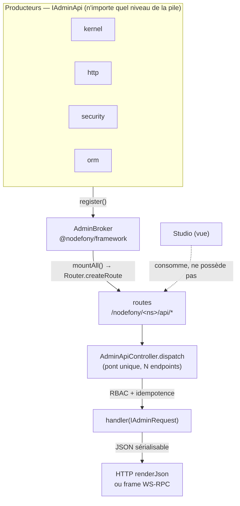
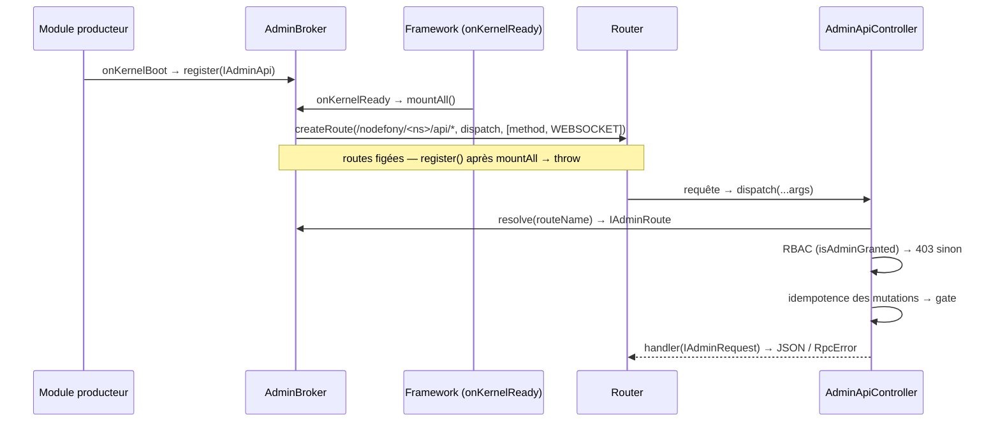

# Data plane d'administration — le pont `/nodefony/<ns>/api/*`

> N'importe quel module (et le kernel lui-même) peut exposer sa donnée d'admin — statistiques,
> introspection, actions — de façon **cohérente CLI ↔ Web**. Chaque module DÉCLARE ce qu'il expose
> (`IAdminApi`) ; un service unique, l'`AdminBroker`, COLLECTE ces déclarations au boot et MONTE les
> routes `/nodefony/<namespace>/api/*`. Studio n'est qu'un lecteur de ce plan de données : il ne le
> possède pas. Tout est ancré sur `nodefony/service/AdminBroker.ts` et le contrat core
> `IAdminApi.ts`.

📍 [Documentation](../../../../../docs/index.md) › [Framework](index.md) › **Data plane admin**

## 🧠 Le modèle mental — un annuaire qui monte des routes

Sépare **qui produit** la donnée (un module, sans rien savoir du transport) de **qui la transporte**
(le broker, seul à posséder le Router). C'est une **inversion de dépendance** : le contrat producteur
vit au plus bas niveau (le core), le montage vit dans le framework.



Trois idées à retenir :

1. **Le producteur ne connaît pas le transport** — un handler lit un `IAdminRequest`
   (`IAdminApi.ts:33`) et rend du JSON. Il ne touche jamais au socket ni à la `Response`.
2. **Un seul controller pont** — toutes les routes admin pointent vers
   `AdminApiController.dispatch()` (`AdminApiController.ts:60`). Pas de génération dynamique de
   classes ; chaque route reste une vraie `Route` (404/405 du Router intacts).
3. **Le broker possède le Router, pas le kernel** — c'est pourquoi il vit dans `@nodefony/framework`,
   niveau qui monte les routes, alors que le contrat producteur vit dans le core.

## 📖 Lexique

| Terme                 | Sens (dans cette page)                                                                                     |
| --------------------- | ---------------------------------------------------------------------------------------------------------- |
| Data plane (admin)    | Le **plan de données** d'admin : l'ensemble des routes `/nodefony/<ns>/api/*` qui exposent l'état/actions. |
| `AdminBroker`         | Le service qui collecte les `IAdminApi` et monte leurs routes. Le _transporteur_.                          |
| `IAdminApi`           | Le contrat qu'un module implémente pour DÉCLARER son admin (namespace + endpoints). Le _producteur_.       |
| Namespace             | Segment d'identité d'un producteur → `/nodefony/<namespace>/api/*` (ex. `http`, `security`, `kernel`).     |
| Endpoint              | Une action déclarée (`IAdminEndpoint`) : chemin relatif, méthode, rôle, handler.                           |
| `IAdminRequest`       | Projection normalisée du contexte HTTP/WS passée au handler (params, query, body, user, roles).            |
| `IAdminResponse`      | Enveloppe optionnelle du retour d'un handler (`status`, `headers`, `body`).                                |
| RBAC                  | _Role-Based Access Control_ : l'accès dépend des rôles de l'appelant.                                      |
| `ROLE_NODEFONY_*`     | Rôles de la **plateforme** (admin du framework), distincts des rôles applicatifs `ROLE_*` d'un tenant.     |
| Pont / dispatch       | Le controller unique qui, à chaque requête, retrouve l'endpoint et exécute son handler.                    |
| API souveraine        | Toute action admin déclare AUSSI le transport WebSocket → invocable par le pont WS-RPC `api.request`.      |
| Duplex                | Une même action servie sur HTTP **et** WebSocket (le différenciateur Nodefony).                            |
| Catalogue / discovery | La liste des producteurs + endpoints, exposée en JSON pour que Studio bâtisse sa navigation.               |
| Playground            | La console dev qui joue n'importe quel controller depuis le navigateur (`/nodefony/playground`).           |
| BFF                   | _Backend-For-Frontend_ : la session cookie opaque qui authentifie Studio en amont du RBAC.                 |
| Fail-closed           | En cas de doute (rôle absent, endpoint non trouvé) → on REFUSE. Jamais d'ouverture par défaut.             |

## Qu'est-ce que c'est ? — un data plane, pas une vue

**Le problème.** Un framework doit s'administrer : lister ses routes, ses sessions, son firewall,
relancer une tâche. Sans convention, chaque module invente son URL, sa forme de réponse, sa garde —
et l'admin Web diverge de la CLI. Le résultat est une nébuleuse d'endpoints hétérogènes, impossibles
à découvrir automatiquement.

**La réponse.** Le data plane admin est une **convention unique** : tout ce qui s'administre s'expose
sous `/nodefony/<module>/api/*`, avec la même projection de requête, la même garde RBAC et la même
sérialisation JSON. Un module ne code jamais une route d'admin à la main — il **déclare** sa donnée,
le broker la monte.

> [!TIP]
> « Data plane » se lit **plan de données** : la couche qui transporte l'état et les actions d'admin,
> par opposition au **plan de contrôle** (l'UI de Studio qui décide _quoi_ afficher). Studio consomme
> le data plane ; il ne le contient pas — le même plan existe même si Studio n'est pas chargé.

## La vision Nodefony — le contrat au plus bas, le montage au bon niveau

Nodefony sépare **deux rôles** par inversion de dépendance :

- **Producteur** (`IAdminApi`, dans le core `IAdminApi.ts:212`) : un module dit _quoi_ il expose —
  son `adminNamespace` et ses `adminEndpoints()` — **sans importer `@nodefony/framework`**. Le
  contrat vit au plus bas niveau commun pour qu'un adapter ORM, un service IA ou le kernel lui-même
  puissent l'implémenter.
- **Transporteur** (`AdminBroker`, dans le framework `AdminBroker.ts:21`) : lui seul possède le
  Router. Il collecte les producteurs et monte `/nodefony/<ns>/api/*`.

Pour s'enregistrer sans dépendre du framework, un producteur récupère le broker via sa **vue
minimale** `IAdminRegistry` (`IAdminApi.ts:243`) — juste `register()` — depuis le container. Le
kernel n'étant **pas** un `Module`, c'est le framework qui construit et enregistre l'`IAdminApi` du
kernel à sa place (`createKernelAdminApi()`, cité plus bas).

Le compromis assumé : **un seul controller pont** (`AdminApiController.ts:31`) sert les N endpoints.
On y gagne zéro génération de classe, un dispatch O(1), et une garde RBAC + idempotence appliquée au
même endroit pour tout le monde.

## 🚀 Démarrage rapide

Objectif : exposer `GET /nodefony/shop/api/stats` et `POST /nodefony/shop/api/reindex` depuis un
module « shop » d'une app générée par `nodefony create app`. Le producteur déclare, le module
enregistre, le broker monte.

```typescript
// modules/shop/index.ts — le producteur ET son enregistrement, vus d'une app.
import { Module, Kernel } from "nodefony";
import type {
  Container,
  IAdminApi,
  IAdminEndpoint,
  IAdminRequest,
  IAdminResponse,
  IAdminRegistry,
} from "nodefony";

/** Service métier « shop » — résolu du container, jamais importé par le broker. */
interface ShopService {
  stats(full: boolean): Promise<{ orders: number; revenue?: number }>;
  reindex(): Promise<{ jobId: string }>;
}

/**
 * Producteur admin du module « shop » → monté sous `/nodefony/shop/api/*`.
 * Un handler lit un `IAdminRequest` (projection du contexte) et rend du JSON :
 * zéro socket, zéro `Response`. C'est ce découplage qui rend la même action
 * invocable en HTTP ET par le pont WebSocket `api.request`.
 */
function createShopAdminApi(shop: ShopService): IAdminApi {
  const endpoints: IAdminEndpoint[] = [
    {
      // GET /nodefony/shop/api/stats — rôle par défaut ROLE_NODEFONY_ADMIN.
      // Gradation par rôle : le détail (CA) n'est rendu qu'à un admin.
      path: "stats",
      summary: "Compteurs de la boutique (commandes, CA)",
      handler: (req: IAdminRequest) =>
        shop.stats(req.roles.includes("ROLE_NODEFONY_ADMIN")),
    },
    {
      // POST /nodefony/shop/api/reindex — mutation : le broker impose une clé
      // Idempotency-Key côté WebSocket (rejeu de socket), optionnelle en HTTP.
      path: "reindex",
      method: "POST",
      role: "ROLE_NODEFONY_ADMIN",
      summary: "Relance l'indexation du catalogue",
      handler: async (): Promise<IAdminResponse<{ jobId: string }>> => {
        const { jobId } = await shop.reindex();
        return { status: 202, body: { jobId } };
      },
    },
  ];
  return {
    adminNamespace: "shop",
    adminDescriptor: () => ({
      label: "Shop",
      icon: "shopping-cart",
      order: 50,
    }),
    adminEndpoints: () => endpoints,
  };
}

/**
 * Le module enregistre son producteur au `onKernelBoot` — AVANT que le framework
 * ne monte les routes (`onKernelReady` → `broker.mountAll()`). Le broker n'est
 * présent que si `@nodefony/framework` est chargé : sinon, no-op silencieux
 * (le module reste utilisable sans data plane admin).
 */
class ShopModule extends Module {
  constructor(kernel: Kernel) {
    super("shop", kernel, import.meta.url, {});
  }

  override async onKernelBoot(): Promise<this> {
    const container = this.kernel?.container as Container | undefined;
    const registry = container?.get("adminBroker") as
      IAdminRegistry | undefined;
    if (registry && container && !registry.has("shop")) {
      const shop = container.get("shop") as ShopService;
      registry.register(createShopAdminApi(shop));
    }
    return this;
  }
}

export default ShopModule;
```

### Ce qu'on observe

```bash
# 1) Sans session Studio (BFF) : la zone firewall `nodefony-admin` verrouille → 401
curl -si http://localhost:5151/nodefony/shop/api/stats | head -1
# HTTP/1.1 401 Unauthorized

# 2) Authentifié en admin (cookie de session BFF) → 200 + l'identité du pod qui a répondu
curl -s -b /tmp/jar http://localhost:5151/nodefony/shop/api/stats
# {"orders":128,"revenue":48213}

# 3) La mutation → 202, corps porté par le `return` du handler
curl -si -b /tmp/jar -X POST http://localhost:5151/nodefony/shop/api/reindex | head -1
# HTTP/1.1 202 Accepted

# 4) Le catalogue : ce que Studio lit pour bâtir sa navigation admin
curl -s -b /tmp/jar http://localhost:5151/nodefony/framework/api/admin | head -c 160
# {"producers":[{"namespace":"kernel",…},{"namespace":"shop","label":"Shop",…}]}
```

> [!NOTE]
> Chaque réponse HTTP porte un en-tête `x-nodefony-instance` (`AdminApiController.ts:76`) : en
> multi-pod, il dit **quel process** a répondu (le data plane est per-instance).

## 🏗️ Architecture interne — register → mountAll → dispatch

Deux temps : un **montage** au boot (une fois), un **dispatch** par requête (O(1)).



| #   | Étape                                     | Où                                                         |
| --- | ----------------------------------------- | ---------------------------------------------------------- |
| 1   | Le producteur s'enregistre                | `AdminBroker.register()` (`AdminBroker.ts:45`)             |
| 2   | Le framework monte tout                   | `AdminBroker.mountAll()` (`AdminBroker.ts:104`)            |
| 3   | Une route par endpoint (nom déterministe) | `Router.createRoute()` (`AdminBroker.ts:124`)              |
| 4   | Le controller pont estampillé une fois    | `Router.setController()` idempotent (`AdminBroker.ts:146`) |
| 5   | Dispatch : lookup de la route             | `AdminBroker.resolve()` (`AdminApiController.ts:94`)       |
| 6   | Projection du contexte en requête admin   | `buildRequest()` (`AdminApiController.ts:175`)             |
| 7   | Normalisation du retour                   | `normalizeAdminResult()` (`executeAdmin.ts:90`)            |

Points de conception saillants :

- **Le montage FIGE les routes.** Après `mountAll()`, tout `register()` lève
  (`AdminBroker.ts:46`) : on ne monte pas une route à chaud (Zero surprise en prod). Le broker garde
  la trace via son drapeau `mounted`.
- **Le nom de route est déterministe** : `admin.<ns>.<method>.<path>` (`AdminBroker.ts:114`) — c'est
  la clé du lookup O(1) que le pont refait à chaque requête.
- **`Router.setController` n'est appelé qu'une fois** par process (`AdminBroker.ts:146`) : il pose
  une propriété non réinscriptible sur le prototype ; une garde `hasOwnProperty` rend l'appel
  idempotent (multi-broker en test, re-boot).
- **Le catalogue se construit à la volée** depuis `AdminBroker.list()` + `AdminBroker.routes()`
  (`AdminBroker.ts:100`) — jamais un état retenu.

> [!IMPORTANT]
> Convention de route **figée** : le data plane est toujours en **≥ 3 segments**
> `/nodefony/<module>/api/*` (`IAdminBroker.ts:42`). Jamais une route admin mono-segment
> `/nodefony/<module>` — elle entrerait en collision avec le fallback SPA de Studio. Le chemin
> relatif d'un endpoint a **≥ 1 segment** (`types/IAdminApi.ts:155`) : la racine `/nodefony/<ns>/api` est
> réservée.

## 🔐 RBAC — autorisation du data plane

Deux gardes se succèdent, dans cet ordre :

1. **Le firewall AUTHENTIFIE en amont.** La zone `nodefony-admin` (`config.ts:137`) couvre
   `^/nodefony/[^/]+/api(/|$)` (`config.ts:141`) avec l'authenticator `session` (cookie BFF) : sans
   session, c'est **401** avant même le controller.
2. **Le broker tranche le RÔLE.** À l'exécution, le pont compare le rôle exigé aux rôles de
   l'appelant via la fonction pure `isAdminGranted()` (`adminRbac.ts:24`). Rôle absent → **403**.
   Le refus est prononcé au CŒUR (`executeAdmin.ts`), pas dans le controller HTTP : c'est ce
   qui fait que les deux chemins d'appel — la route et le pont MCP — refusent à l'identique.

La décision est **fail-closed** : un authentifié **sans** le rôle requis — y compris `roles=[]`
(compte non doté) — est **rejeté** (`adminRbac.ts:27`). C'était l'ex-fail-open historique (un
`roles.length > 0 &&` héritait du « mode mock » d'avant l'auth) : l'absence de rôle ne vaut pas
laissez-passer.

- **Rôle par défaut** : sans `role` explicite, un endpoint exige `ROLE_NODEFONY_ADMIN`
  (`AdminBroker.ts:112` ; défaut du champ `IAdminEndpoint.role`, `IAdminApi.ts:152`).
- **Endpoint public** : `public: true` (`IAdminApi.ts:152`) → le RBAC du broker est court-circuité
  (`role === ""`, `adminRbac.ts:26`). À réserver aux sondes cloud-native (liveness/readiness) et à
  placer hors d'une zone fermée — sinon le firewall verrouille en amont. Exemple réel :
  `GET /nodefony/kernel/api/livez` (`KernelAdminApi.ts:615`), sorti de `nodefony-admin` par la zone
  publique `nodefony-liveness` (`config.ts:132`).

> [!TIP]
> `ROLE_NODEFONY_*` = rôles de la **plateforme** (administrer le framework), distincts des rôles
> applicatifs `ROLE_*` d'un tenant. Un endpoint peut exiger un rôle plus fin (`role: "ROLE_…"`) ou
> graduer l'information **dans** son handler en lisant `request.roles`.

## 🔌 HTTP et WebSocket — la même action (API souveraine)

Toute action admin déclare **aussi** le transport `WEBSOCKET` (`AdminBroker.ts:123`) : la route est
montée avec `[method, "WEBSOCKET"]`. Elle devient donc invocable par le pont WS-RPC `api.request`
(`WebsocketContext.ts:354`) — même action, même handler, même réponse. Seul l'emballage diffère :

- **HTTP** : `renderJson` + statut + en-tête `x-nodefony-instance` (`AdminApiController.ts:74`).
- **WS-RPC** : la valeur **nue** (le pont l'enveloppe `{id, result}`) ; un statut ≥ 400 devient un
  `RpcError` avec `data.status`/`data.body` (`AdminApiController.ts:66`), symétrie d'un `fetch` qui
  expose son statut.

Les **mutations** sont pontables par socket. La sécurité d'écriture repose alors sur l'**idempotence**
(`idempotencyGate()`, `AdminApiController.ts:158`) : la clé `Idempotency-Key` est **obligatoire en
WS** (une socket reconnecte et rejoue), **optionnelle en HTTP** (`required: false`,
`AdminApiController.ts:184`). Un `GET` n'est jamais idempotenté (`AdminApiController.ts:149`) ; la
porte est évaluée **après** le RBAC (un 403 ne consomme aucune entrée). Le helper est le **même** que
le seam `@Idempotent` des controllers userland — voir [Idempotence](idempotence.md).

## 🧩 Extension — déclarer l'API d'admin de son module

Trois pas, du point de vue d'un module :

1. **Écrire un `IAdminApi`** : `adminNamespace` (url-safe, stable), `adminDescriptor()` (sidebar
   Studio, `IAdminApi.ts:220`) et `adminEndpoints()` (`IAdminApi.ts:222`). Un endpoint peut renvoyer
   la donnée brute (assumée `{status:200, body}`) ou une `IAdminResponse` pour piloter statut/en-têtes
   (`IAdminApi.ts:67`).
2. **S'enregistrer au `onKernelBoot`** via `IAdminRegistry.register()` (`IAdminApi.ts:249`), récupéré
   par `container.get("adminBroker")`. Rendre l'appel **idempotent** (`registry.has(ns)` avant
   `register`) — modèle de tous les producteurs.
3. **Laisser le framework monter** : à `onKernelReady`, `Framework.onKernelReady()` enregistre les
   producteurs internes puis appelle `broker.mountAll()` (`index.ts:369`).

**Handlers lazy** : résous tes services **dans** le handler (à la requête), jamais au montage — un
service désactivable renvoie alors `503` proprement au lieu de casser le boot.

### Les producteurs réels (à imiter, sans les redocumenter)

Le broker lui-même est déclaré comme service du framework (`index.ts:144`). Les producteurs internes
sont enregistrés au `onKernelReady` du framework :

| Namespace   | Producteur                                            | Rôle                                              |
| ----------- | ----------------------------------------------------- | ------------------------------------------------- |
| `kernel`    | `createKernelAdminApi` (`KernelAdminApi.ts:468`)      | modules, process, uptime, `livez`                 |
| `framework` | `createFrameworkAdminApi` (`FrameworkAdminApi.ts:40`) | dump du Router + **catalogue** + Playground (dev) |
| `syslog`    | `createSyslogAdminApi` (`SyslogAdminApi.ts:95`)       | viewer de logs (dev)                              |

Les modules externes s'enregistrent depuis leur propre `onKernelBoot` :

| Namespace  | Module               | Enregistrement                                      |
| ---------- | -------------------- | --------------------------------------------------- |
| `http`     | `@nodefony/http`     | `createHttpAdminApi` (`http/index.ts:121`)          |
| `security` | `@nodefony/security` | `registerSecurityAdminApi` (`security/index.ts:94`) |
| `user`     | `@nodefony/user`     | `adminNamespace` (`UserAdminApi.ts:879`)            |
| `orm`      | `@nodefony/orm-core` | `adminNamespace` (`OrmAdminApi.ts:537`)             |

Pour le détail de chacun, se reporter à la doc de son module — le broker reste agnostique de leur
contenu.

## 🧰 API publique

Depuis une app : `AdminBroker` (le service) et les types `IAdminApi`, `IAdminEndpoint`,
`IAdminRequest`, `IAdminResponse`, `IAdminRegistry`, `IAdminDescriptor` — tous exportés par
`@nodefony/framework` et `nodefony`. Les signatures exactes vivent dans `.ai/symbols.json` — jamais
recopiées ici (elles s'y périmeraient).

| Membre (`IAdminBroker`)  | Rôle                                                     | Ancre                |
| ------------------------ | -------------------------------------------------------- | -------------------- |
| `register(api)`          | Enregistre un producteur (throw si namespace pris/monté) | `AdminBroker.ts:45`  |
| `unregister(ns)`         | Retire un producteur (et ses routes si montées)          | `AdminBroker.ts:61`  |
| `has(ns)` / `getApi(ns)` | Interrogation du registre                                | `AdminBroker.ts:79`  |
| `list()`                 | Producteurs enregistrés (immuable)                       | `AdminBroker.ts:87`  |
| `resolvePath(ns, path)`  | Chemin absolu d'un endpoint sans le monter               | `AdminBroker.ts:91`  |
| `mountAll()`             | Monte toutes les routes (idempotent)                     | `AdminBroker.ts:104` |
| `resolve(routeName)`     | Lookup O(1) d'une route montée (utilisé par le pont)     | `AdminBroker.ts:96`  |
| `routes()`               | Introspection des routes montées (source du catalogue)   | `AdminBroker.ts:100` |

## 📡 Observabilité — Studio

- **Catalogue / discovery** : `GET /nodefony/framework/api/admin` (`FrameworkAdminApi.ts:203`) —
  producteurs + descriptors + endpoints. C'est ce que Studio lit pour générer sa navigation admin.
- **Routes** : `GET /nodefony/framework/api/routes` (`FrameworkAdminApi.ts:122`) — l'équivalent web
  de `nodefony router:dump` ; une variante paginée serveur `routes/page` (`FrameworkAdminApi.ts:129`).
- **Playground** (`/nodefony/playground`, **dev only**) : `buildPlaygroundSnapshot()`
  (`PlaygroundAdminApi.ts:167`) sérialise controllers + actions + transports + params + gardes — la
  page Studio bâtit ses formulaires depuis ces métadonnées, **sans code généré**. Le montage est
  conditionné à l'environnement (`index.ts:342`). Le pont admin lui-même est **exclu** du snapshot
  (`PlaygroundAdminApi.ts:180`) pour ne pas noyer les controllers applicatifs.
- Les écrans admin de Studio (Routes, Sessions, Firewall, Users…) sont des vues qui consomment ces
  data planes — voir le [module Studio](../../studio/docs/index.md).

## ⚠️ Pièges (symptôme → cause → correction)

| Symptôme                                         | Cause (dans le code)                                                               | Correction                                                                           |
| ------------------------------------------------ | ---------------------------------------------------------------------------------- | ------------------------------------------------------------------------------------ |
| `register()` throw « routes figées »             | Appel **après** `mountAll()` (`AdminBroker.ts:46`)                                 | Enregistrer au `onKernelBoot`, pas plus tard                                         |
| `register()` throw « namespace déjà enregistré » | Deux producteurs sur le même `adminNamespace` (`AdminBroker.ts:51`)                | Namespace unique ; garder `register()` idempotent (`has(ns)` avant)                  |
| 401 sur toute route `/nodefony/<ns>/api/*`       | Zone `nodefony-admin` : pas de session BFF (`config.ts:141`)                       | S'authentifier (login BFF) ; pour une sonde publique → `public: true` + zone anonyme |
| 403 alors qu'on est connecté                     | Rôle manquant, `isAdminGranted` fail-closed (`adminRbac.ts:24`)                    | Doter le compte du rôle requis (défaut `ROLE_NODEFONY_ADMIN`)                        |
| WS : mutation refusée `400` clé requise          | Idempotence : clé obligatoire par socket (`AdminApiController.ts:184`)             | Fournir `Idempotency-Key` sur la mutation WS                                         |
| Route admin injoignable / collision Studio       | Endpoint mono-segment `/nodefony/<module>` (`IAdminBroker.ts:42`)                  | Toujours `≥ 3` segments `/nodefony/<ns>/api/<path>`                                  |
| 500 « Admin endpoint not registered »            | `adminRoute` absent du registre — incohérence interne (`AdminApiController.ts:96`) | Vérifier que le producteur a bien été enregistré avant `mountAll()`                  |

## 🧪 Tests & couverture

Deux familles couvrent la brique — les **chiffres exacts vivent dans la carte de l'aperçu**
(régénérée depuis vitest, jamais figée ici) :

- **unit** — `AdminBroker.test.ts` (register/mount/resolve/unregister, idempotence du montage) ;
  `adminRbac.test.ts` (la fonction pure `isAdminGranted` : fail-closed, endpoint public,
  `roles=[]`) ; `PlaygroundAdminApi.test.ts` (sérialisation des métadonnées d'actions) ;
- **intégration** — `admin-dataplane.test.ts` : le data plane bout-en-bout (montage réel, RBAC,
  catalogue, idempotence des mutations, duplex HTTP/WS).

Ce qui **manque** aujourd'hui : aucun banc de charge/mémoire dédié au broker seul — le coût est mesuré
au niveau du pipeline complet (`memory.test.ts` de `@nodefony/http` + suites de charge). Pour ces
axes, voir les skills `nodefony-load-test` et `nodefony-check-memory-health`.

Couverture : `npm run coverage` dans `@nodefony/framework`.

## 🔗 Pour aller plus loin

- ⬆️ **Retour au hub** : [Framework — vue d'ensemble](index.md) · [Toute la documentation](../../../../../docs/index.md)
- 🧭 **Pages sœurs** : [Contrôleurs](controller.md) (ce dont hérite le pont) · [Routage](routing.md) (comment les routes admin sont montées) · [Idempotence](idempotence.md) (la porte des mutations)
- Qui authentifie en amont du RBAC → [Firewall](../../security/docs/firewall.md)
- Les écrans qui consomment ce data plane → [module Studio](../../studio/docs/index.md)
- Où le data plane s'insère dans le pipeline → [pipeline de requête](../../../../../docs/architecture/pipeline-requete.md)
- Signatures exactes des membres publics → graphe symbolique `.ai/symbols.json`
