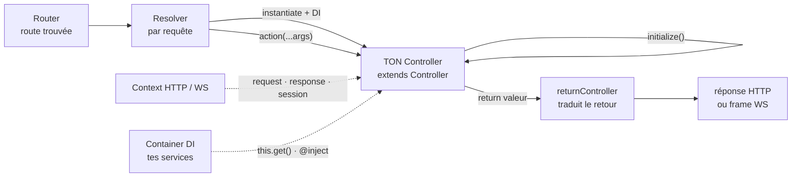
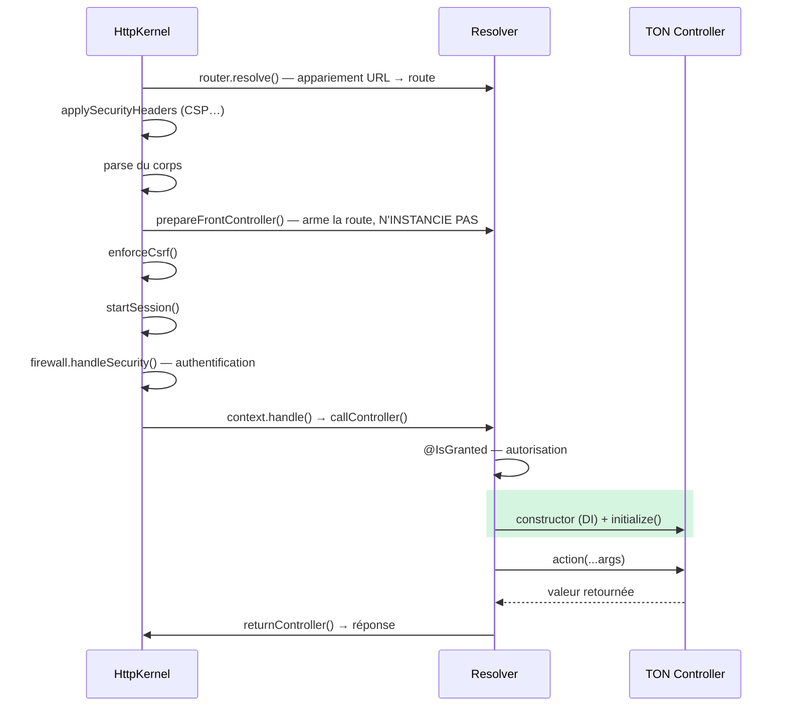

# Controller — le code de ta route

> Une fois la route trouvée, quelqu'un doit **faire le travail** : c'est le contrôleur. Nodefony
> l'instancie par requête (DI compris), appelle ton action, puis traduit ce que tu **retournes** en
> réponse HTTP ou en frame WebSocket. Cette page décrit ce qui se passe **dans** le contrôleur : de
> quoi il hérite, son cycle de vie réel (dont `initialize()`), d'où viennent `request`/`response`/
> `session`, comment répondre, comment échouer proprement. Tout est ancré sur le code.

📍 [Documentation](../../../../../docs/index.md) › [Framework](index.md) › **Controller**

## 🧠 Le modèle mental — un objet jetable entre deux mondes

Un contrôleur n'est **pas** un serveur ni un service partagé : par défaut c'est un **objet jetable**,
construit pour UNE requête et abandonné à la fin. Il vit entre deux mondes qu'il ne connaît pas :
le **transport** (le contexte HTTP ou WebSocket, fourni par `@nodefony/http`) et le **container**
(tes services, fournis par le DI).



Trois idées à retenir :

1. **Tu hérites de `Service`** — `Controller` étend `Service` (`Controller.ts:112`). Tu récupères
   donc gratuitement le container (`this.get()`), les logs (`this.log()`) et les événements.
2. **Tu ne construis rien toi-même** — le `Resolver` instancie ta classe via l'injecteur
   (`Resolver.newController()`, `Resolver.ts:236`), jamais un `new` direct.
3. **Ton `return` EST la réponse** — `Resolver.returnController()` (`Resolver.ts:697`) traduit la
   valeur retournée : objet → JSON, string → corps brut, `void` → « j'ai répondu moi-même ».

## 📖 Lexique

| Terme              | Sens (dans cette page)                                                                              |
| ------------------ | --------------------------------------------------------------------------------------------------- |
| Action             | La méthode de ton contrôleur associée à une route (`read()`, `create()`…).                          |
| Contexte           | L'objet transport de la requête courante (`HttpContext` ou `WebsocketContext`).                     |
| Resolver           | L'objet **par requête** qui trouve l'action, instancie le contrôleur et l'appelle.                  |
| DI                 | _Dependency Injection_ : le container qui fabrique et fournit tes services par leur nom.            |
| ALS                | _AsyncLocalStorage_ : le « porte-documents » Node qui suit une requête à travers tous ses `await`.  |
| Hot path           | Le chemin parcouru par **chaque** requête — ce qu'on y met est payé des millions de fois.           |
| Auto-JSON          | Le fait qu'un objet retourné par l'action devienne une réponse `application/json` sans le demander. |
| Handshake          | La poignée de main d'ouverture d'une connexion WebSocket (avant tout message).                      |
| Frame              | Un message WebSocket individuel, une fois la connexion ouverte.                                     |
| Scope (contrôleur) | `"request"` (une instance par requête, défaut) ou `"singleton"` (une instance partagée).            |
| `waitAsync`        | Drapeau posé quand le framework conclut « l'action enverra la réponse elle-même, plus tard ».       |

## 🚀 Démarrage rapide

Dans une app générée par `nodefony create app`, un contrôleur est une **classe décorée**. Voici un
contrôleur complet — il répond en JSON, consomme un service injecté et gère une erreur métier.

```typescript
// nodefony/controllers/CatalogController.ts
import {
  Controller,
  controller,
  Get,
  Post,
  Param,
  Body,
  HttpCode,
} from "@nodefony/framework";
import type { ContextType } from "@nodefony/http";
import { nodefonyError } from "nodefony";

/** Ton service métier, enregistré dans le container sous le nom "catalog". */
interface CatalogService {
  find(id: string): Promise<{ id: string; label: string } | null>;
  create(input: { label: string }): Promise<{ id: string; label: string }>;
}

@controller("/api/catalog")
class CatalogController extends Controller {
  // Champ per-requête : sûr ici, car le scope par défaut est UNE instance par requête.
  private catalog: CatalogService | null = null;

  // Le contexte de la requête est le SEUL argument obligatoire ; le nom passé à
  // `super()` est celui du service (il apparaît dans les logs).
  constructor(context: ContextType) {
    super("catalog", context);
  }

  // Hook optionnel, appelé à CHAQUE requête juste après l'instanciation.
  // Voir « Le cycle de vie » : ici, ni session ni utilisateur ne sont encore résolus.
  async initialize(): Promise<this> {
    this.catalog = this.get<CatalogService>("catalog");
    return this;
  }

  // `return item` suffit : un objet devient une réponse JSON (auto-JSON).
  @Get("/{id}")
  async read(@Param("id") id: string) {
    const item = await this.catalog?.find(id);
    if (!item) {
      // Une erreur levée est traduite en réponse : 404 JSON, jamais de fuite de stack en prod.
      throw new nodefonyError(`Article ${id} introuvable`, 404);
    }
    return item;
  }

  @Post("/")
  @HttpCode(201)
  async create(@Body("label") label: string) {
    if (!label) {
      throw new nodefonyError("Le champ `label` est requis", 422);
    }
    return this.catalog!.create({ label });
  }
}

export default CatalogController;
```

**Le câblage** tient en une ligne dans le `index.ts` de l'app : `@controllers([CatalogController])`
sur ta classe `Module` — c'est ce décorateur qui enregistre les routes au boot du kernel
(`nodefony create controller` l'ajoute pour toi). Le service `catalog`, lui, se déclare avec
`@services([CatalogService])` sur ce même module.

### Ce qu'on observe

```bash
# 1) Lecture d'un article existant → auto-JSON, 200, application/json SANS charset (RFC 8259 §11)
curl -si http://localhost:5151/api/catalog/42
# HTTP/1.1 200 OK
# Content-Type: application/json
# {"id":"42","label":"Cordage 12mm"}

# 2) Article absent → l'erreur levée devient une réponse structurée
curl -s http://localhost:5151/api/catalog/999 | head -c 120
# {"code":404,"message":"Article 999 introuvable","result":null,"error":{…},"nodefony":{…}}

# 3) Création → le 201 vient de @HttpCode, le corps de ton `return`
curl -si -X POST -H 'Content-Type: application/json' \
  -d '{"label":"Bosse d amarrage"}' http://localhost:5151/api/catalog/
# HTTP/1.1 201 Created
```

> [!TIP]
> Tu n'as écrit **aucun** appel d'envoi : ni `res.json()`, ni `send()`. Le contrat de Nodefony est
> « retourne une valeur, le framework la rend ». Les helpers `render*` restent disponibles quand tu
> veux piloter l'envoi toi-même (fichiers, flux, vues) — voir plus bas.

## 🏗️ Le cycle de vie d'une action — l'ordre RÉEL

C'est la section à lire en entier : elle dit **quand** ton contrôleur naît, donc ce que tu as le
droit d'écrire dans `initialize()`.



Le tableau ci-dessous donne la séquence exacte, avec l'ancre qui la prouve :

| #   | Étape                                   | Où                                                  |
| --- | --------------------------------------- | --------------------------------------------------- |
| 1   | Appariement de la route                 | `router.resolve()` (`http-kernel.ts:1324`)          |
| 2   | En-têtes de sécurité applicatifs        | `applySecurityHeaders()` (`http-kernel.ts:1334`)    |
| 3   | Parse du corps (sauf `@Body({stream})`) | `http-kernel.ts:1316`                               |
| 4   | Armement de la route (sans instance)    | `prepareFrontController()` (`http-kernel.ts:767`)   |
| 5   | CSRF                                    | `firewall.enforceCsrf()` (`http-kernel.ts:1290`)    |
| 6   | Session (reprise ou ouverture)          | `HttpKernel.startSession()` (`http-kernel.ts:1131`) |
| 7   | Firewall — **authentification**         | `firewall.handleSecurity()` (`http-kernel.ts:1301`) |
| 8   | Autorisation `@IsGranted`               | `Resolver.executeAction()` (`Resolver.ts:334`)      |
| 9   | **Instanciation DI + `initialize()`**   | `Resolver.executeAction()` (`Resolver.ts:349`)      |
| 10  | **Ton action**                          | `controller[methodKey]()` (`Resolver.ts:382`)       |

> [!IMPORTANT]
> **Rien de ton contrôleur ne s'exécute pour une requête qui sera refusée.** L'appariement de route
> est précoce — il pose l'intention de session et l'exemption de firewall que les étapes 5 à 7
> lisent — mais l'**instanciation** attend l'étape 9 : après CSRF, session, authentification et
> autorisation. Un appelant qui repart en **401** ou en **403** ne fait donc payer ni la résolution
> DI ni ton `initialize()`. Verrouillé par `pipeline-order.test.ts` (`@nodefony/http`), qui frappe
> une zone protégée en anonyme puis avec un rôle insuffisant, et exige un mouchard resté à zéro.

### `initialize()` — le constructeur asynchrone de ton contrôleur

C'est **sa raison d'être** : un `constructor` ne peut pas être `async`, et la résolution DI est
synchrone. Tout ce qui demande un `await` à la mise en place de l'instance n'a pas d'autre endroit
où aller. Le hook est **optionnel** — le Resolver ne l'appelle que s'il existe
(`Resolver._createController()`, `Resolver.ts:269`). Son contrat est décrit par
`ControllerWithInitialize` (`Resolver.ts:72`) : aucun argument, retour `Promise<this>`.

```typescript
async initialize(): Promise<this> {
  this.setContextJson();                                   // forme de la réponse
  const user = RequestContext.getUser();                   // identité déjà résolue
  this.prefs = await this.get<Prefs>("prefs").load(user.identifier);
  return this;                                             // toujours rendre `this`
}
```

| Dans `initialize()`, tu peux…                                                            | Ce qui n'a rien à y faire                                                                                  |
| ---------------------------------------------------------------------------------------- | ---------------------------------------------------------------------------------------------------------- |
| Un `await` de mise en place : charger des préférences, ouvrir une ressource, précalculer | Une **décision d'autorisation** — c'est `@IsGranted`, évalué avant, et un 403 n'arrive jamais jusqu'ici    |
| Résoudre des services (`this.get("catalog")`)                                            | Un travail qu'**une seule action sur cinq** utilise : il serait payé par toutes → fais-le dans l'action    |
| Lire l'identité (`RequestContext.getUser()`) — le firewall est passé                     | Un effet de bord **par requête** qu'un rechargement ferait deux fois (compteur, envoi) sans idempotence    |
| Poser un cookie ou un en-tête (`this.context?.setCookie()`) — rien n'est encore écrit    | Une écriture longue qui bloque : la phase `initialize` est chronométrée, elle apparaîtra dans la debug bar |
| Choisir un mode de rendu (`this.setContextHtml()`)                                       | Lire `this.session` sans l'avoir demandée : elle reste **lazy** (`@UseSession`, cf plus bas)               |

> [!NOTE]
> **La session ne s'ouvre pas ici.** Nodefony a un point d'activation **unique**
> (`HttpKernel.startSession()`, étape 6), piloté par l'intention posée au match depuis `@UseSession`
> ou un paramètre `@Session`. Pour « une session sur tout ce contrôleur », décore la **classe** —
> l'appeler à la main dans `initialize()` doublerait le mécanisme, et le ferait avant le CSRF.

### Une erreur dans `initialize()` ne pend pas

Si ton `initialize()` lève, l'exception remonte le pipeline et sort en réponse d'erreur cohérente :
**500 JSON**, serveur toujours sain. C'est prouvé par une sonde dédiée du dépôt
(`LifecycleController.initialize()`, `LifecycleController.ts:21`, exercée par
`lifecycle-init-crash.test.ts`). Aucune requête pendue, aucun timeout muet.

### Les phases mesurées

Chaque étape est chronométrée sous le nom d'une **phase**, lisible dans la debug bar et le profileur :
`resolve` · `initialize` (DI + ton hook) · `parse` · `firewall` · `action` · `render` · `send`.
La phase `initialize` existe précisément pour que le temps passé dans ton hook et dans la résolution
DI **soit imputé à quelqu'un** au lieu de disparaître dans le bloc `action` (`Resolver.ts:281`).

## 🔌 HTTP et WebSocket — le même contrôleur

C'est le différenciateur de Nodefony : **une classe, deux transports, les mêmes décorateurs**. Une
route WS se déclare avec `requirements: { methods: ["WEBSOCKET"] }` ; l'action est une méthode
ordinaire du même contrôleur.

```typescript
@controller("/chat")
class ChatController extends Controller {
  constructor(context: ContextType) {
    super("chat", context);
  }

  // Appelée UNE fois au handshake (message absent), puis à CHAQUE frame reçue.
  @route("chat-room", {
    path: "/room",
    requirements: { methods: ["WEBSOCKET"] },
  })
  async room(message?: string | Buffer) {
    if (!message) {
      return { type: "welcome" }; // handshake : l'objet retourné part en frame JSON
    }
    return { type: "echo", payload: message.toString() };
  }
}
```

### Ce qui change entre les deux transports

<!-- prettier-ignore -->
| Aspect | HTTP | WebSocket |
| --- | --- | --- |
| Durée de vie du contexte | Une requête | **Toute la connexion** |
| Instance du contrôleur | Une par requête | **Une par connexion**, réutilisée à chaque frame |
| Nombre d'appels d'action | 1 | 1 au handshake (`WebsocketContext.handle()`, `WebsocketContext.ts:265`) + 1 par frame (`handleMessage()`, `WebsocketContext.ts:479`) |
| Argument de l'action | Variables de route (ou paramètres décorés) | Idem + **le message** en dernier argument (`WebsocketContext.ts:508`) |
| Rendu d'un `return` | Corps de la réponse | Frame envoyée sur la socket |
| Échec | Statut HTTP + corps d'erreur | **Code de fermeture** RFC 6455 (401/403 → 1008, 5xx → 1011, autre → 4004) |
| `initialize()` | À chaque requête | **Une seule fois**, au handshake |

La réutilisation de l'instance vient du cache posé sur le container du contexte
(`Resolver.newController()`, `Resolver.ts:262`) : le contexte WS étant partagé par la connexion, le
contrôleur l'est aussi. Un garde-fou vérifie que l'instance cachée est bien de la classe de la route
courante et la reconstruit sinon (`Resolver.ts:344-347`) — sans quoi un message invoquant une autre
action se tromperait d'objet.

> [!WARNING]
> **Sur une connexion WS, `this` survit aux frames.** Un champ écrit à la frame 1 est encore là à la
> frame 2 — pratique pour un état de conversation, piège si tu comptais sur une instance neuve. En
> HTTP, l'inverse : chaque requête repart d'une instance vierge.

Côté WebSocket, l'ordre est encore plus marqué : `HttpKernel.onConnect()` (`http-kernel.ts:1659`)
appelle `handleFrontController()` (donc `initialize()`) **avant** `startSession()`
(`http-kernel.ts:1131`), avant l'acceptation de la socket, et avant le firewall
(`http-kernel.ts:1457`).

## 🧠 D'où viennent `request`, `response`, `session`

Ton contrôleur expose des raccourcis vers le transport. Ils ne sont **pas** des copies figées : ce
sont des accesseurs qui dérivent du contexte **vivant**, selon le motif `champ ?? dérivation`.

| Raccourci        | Ce que tu obtiens                                  | Ancre               |
| ---------------- | -------------------------------------------------- | ------------------- |
| `this.context`   | Le contexte transport de la requête courante       | `Controller.ts:146` |
| `this.route`     | La route matchée                                   | `Controller.ts:158` |
| `this.request`   | La requête (HTTP, HTTP/2 ou WS)                    | `Controller.ts:162` |
| `this.response`  | La réponse du transport                            | `Controller.ts:169` |
| `this.method`    | La méthode HTTP (ou `WEBSOCKET`)                   | `Controller.ts:178` |
| `this.queryGet`  | Les paramètres de la query string                  | `Controller.ts:187` |
| `this.queryPost` | Le corps parsé                                     | `Controller.ts:214` |
| `this.body`      | Le corps parsé — alias de `queryPost`              | `Controller.ts:229` |
| `this.queryFile` | Les fichiers uploadés                              | `Controller.ts:205` |
| `this.session`   | La session **ou `null`** si elle n'est pas activée | `Controller.ts:229` |

Pourquoi des accesseurs plutôt que des champs recopiés au constructeur : **la fraîcheur et le coût**.
Une valeur recopiée vieillit dès que le pipeline modifie le contexte, et recopier quatre structures
par requête, c'est quatre allocations payées sur le hot path. L'accesseur lit la source de vérité,
gratuitement.

### La session est **lazy** — elle n'existe que si tu la demandes

`this.session` est un simple getter sur `context.session` (`Controller.ts:229`). Il n'y a **pas** de
`startSession()` à appeler depuis un contrôleur : l'activation se déclare sur la route, avec
`@UseSession()` (ou un paramètre `@Session()`, qui vaut déclaration implicite), et le pipeline
l'exécute à son point unique. Sans déclaration et sans cookie de session entrant, **aucune session
n'est créée** — donc aucun coût de stockage.

Deux corollaires :

- Dans `initialize()`, `this.session` vaut `null` (l'activation vient plus tard — étape 6 du cycle).
- `this.getSession()` (`Controller.ts:394`) ne « démarre » rien : il retourne la session existante,
  ou `undefined`.

Les messages flash s'appuient dessus : `setFlashBag()`/`addFlash()` (`Controller.ts:420`) et
`getFlashBag()` (`Controller.ts:412`) journalisent une **erreur** et retournent `null` si aucune
session n'est active — pas de crash, mais rien n'est mémorisé.

### Contrôleur `singleton` — quand `this` n'est plus à toi

Par défaut, `Controller.scope` vaut `"request"` (`Controller.ts:119`). Un contrôleur **sans état**
peut passer en instance unique partagée :

```typescript
@Scope("singleton")
@controller("/api/health")
class HealthController extends Controller {
  /* … */
}
```

Ce que ça change, concrètement :

- **une seule instance** pour tout le process, bindée au container du **kernel**, pas à celui de la
  requête (`Controller.ts:244-252`) — capturer le container de requête serait fatal, il est nettoyé
  au teardown ;
- **`initialize()` n'est appelé qu'une fois**, à la création (sémantique « boot ») ;
- le contexte n'est plus posé sur l'objet : `this.context` **retombe sur l'ALS**
  (`RequestContext.getContext()`, `Controller.ts:147`) et retrouve donc la requête réellement en
  cours, jamais celle d'une requête concurrente.

> [!WARNING]
> Un champ mutable par requête sur un contrôleur `singleton` est une **fuite de données entre
> utilisateurs** silencieuse (requête A lit ce qu'a écrit requête B). N'utilise `@Scope("singleton")`
> que si toutes tes données passent par les arguments décorés et l'ALS. Le défaut per-requête reste
> le choix sûr — le gain mesuré du singleton est dans le bruit de mesure.

## 🧰 Répondre — ce que ton `return` déclenche

Le traducteur unique est `Resolver.returnController()` (`Resolver.ts:697`). Il regarde le **type**
de ce que tu as retourné :

<!-- prettier-ignore -->
| Tu retournes… | Ce qui se passe | Ancre |
| --- | --- | --- |
| Une `Promise` / un thenable | Déballée puis re-traitée (récursif) | `Resolver.ts:700-710` |
| Une `string` | Envoyée telle quelle en corps | `Resolver.ts:711` |
| Un objet simple ou un tableau | **Auto-JSON** : `application/json` + sérialisation | `Resolver.ts:760` |
| Un `number` / un `boolean` | Auto-JSON scalaire (RFC 8259 §2 : `42`, `true` sont des documents valides) | `Resolver.ts:734` |
| Un `Buffer` | Envoyé brut | `Resolver.ts:723` |
| Une `Response` (via un `render*`) | Retournée telle quelle — l'envoi a déjà eu lieu | `Resolver.ts:716` |
| `void`/`null` **et** statut 204/205/304 | Réponse **vide envoyée** (RFC 9110 : ces statuts n'ont pas de corps) | `NO_BODY_STATUS` (`Resolver.ts:798`) |
| `void`/`null` avec tout autre statut | `waitAsync` : « l'action enverra plus tard » | `Resolver.ts:801` |
| Une instance de classe (entité ORM, DTO) | **Non sérialisée** → `waitAsync` (le teardown avertit du blocage) | `Resolver.ts:770-777` |

> [!WARNING]
> **Le piège n° 1 : `return null` sur un statut à corps.** Le framework l'interprète comme « je
> répondrai moi-même » et attend — jusqu'au timeout. La distinction se fait sur le **statut** :
> `NO_BODY_STATUS` (`Resolver.ts:817`) contient 204, 205 et 304. Donc un `@Delete` qui fait
> `@HttpCode(204)` puis `return null` répond bien 204 vide ; le même `return null` sans `@HttpCode`
> laisse la requête pendue.

Même règle pour une **instance de classe** (une entité ORM renvoyée telle quelle) : elle n'est
volontairement pas passée à `JSON.stringify`. Retourne un objet simple — ou appelle `renderJson()`.

### Les helpers de rendu

Quand tu veux piloter l'envoi plutôt que retourner une valeur :

| Helper                                       | Pour…                                                    | Ancre               |
| -------------------------------------------- | -------------------------------------------------------- | ------------------- |
| `renderJson(obj, status?, headers?)`         | JSON explicite avec statut/en-têtes                      | `Controller.ts:379` |
| `render(data, encoding?, status?, headers?)` | Envoyer un corps quelconque via le contexte              | `Controller.ts:273` |
| `renderView(path, params, status?)`          | Rendre un template **Eta** (avec les helpers frontend)   | `Controller.ts:308` |
| `renderResponse(data, encoding?, …)`         | Poser statut + en-têtes, puis envoyer                    | `Controller.ts:290` |
| `redirect(url, status?, headers?)`           | Rediriger                                                | `Controller.ts:382` |
| `forward("module:controller:action")`        | Déléguer à une autre action **sans** aller-retour réseau | `Controller.ts:432` |
| `setContextJson()` / `setContextHtml()`      | Choisir le type de contenu avant d'envoyer               | `Controller.ts:282` |

`renderView()` mesure sa propre phase `render` et injecte automatiquement les aides frontend
(`frontendTags`, `frontendDocument`, `asset`) dans les variables du template
(`withFrontendLocals()`, `Controller.ts:345`) — tes propres valeurs restent prioritaires.

`forward()` re-résout un contrôleur sur le **même** contexte et rappelle son action
(`Controller.ts:445`) : c'est une délégation interne, la requête cliente reste unique.

> [!TIP]
> **Redirection : le code par défaut est 302** (Found), pas 301. Un statut absent ou hors de la liste
> RFC 9110 §15.4 (301, 302, 303, 307, 308) retombe sur 302 avec un log d'avertissement
> (`Response.redirect()`, `Response.ts:595`). Un 301 par défaut piégeait : les navigateurs le mettent
> en cache de façon quasi irréversible.

## 📁 Servir un fichier — téléchargement et flux média

Deux besoins distincts, deux helpers.

### Téléchargement — `renderFileDownload()`

`renderFileDownload(file, options?, headers?)` (`Controller.ts:473`) pose
`Content-Disposition: attachment`, `Content-Length`, le type MIME du fichier, puis délègue au moteur
de flux. Le fichier est résolu **sans bloquer l'event loop** (`getFileAsync()`, `Controller.ts:497`) ;
la variante synchrone `getFile()` existe encore mais est marquée obsolète — elle appelle `lstatSync`
et gèle le process le temps du stat.

### Lecture en continu — `renderMediaStream()`

`renderMediaStream(file, headers?, options?)` (`Controller.ts:609`) implémente les **requêtes par
plage** (RFC 9110 §14), ce qui permet à un lecteur vidéo de sauter dans le flux :

| Le client envoie…                             | Réponse                                                         |
| --------------------------------------------- | --------------------------------------------------------------- |
| Pas de `Range`                                | 200 + fichier complet, `Accept-Ranges: bytes`                   |
| `Range: bytes=0-499`                          | **206** + `Content-Range`, bornes clampées à la taille réelle   |
| `Range: bytes=-500` (suffixe)                 | 206 sur les 500 derniers octets                                 |
| Plage hors fichier                            | **416** + `Content-Range: bytes */<taille>` (RFC 9110 §15.5.17) |
| Syntaxe invalide, multi-plage, unité inconnue | En-tête **ignoré** → 200 complet (jamais un 500)                |

La logique est isolée dans une fonction pure exportée, `parseByteRange()` (`Controller.ts:73`) —
donc testable sans serveur.

### Ce que `streamFile()` garantit

`streamFile()` (`Controller.ts:580`) est le moteur commun. Sa subtilité n'est pas le pipe, c'est le
**nettoyage** : le flux est ouvert avec `autoClose: false`, et un client qui raccroche en plein
téléchargement laisserait sinon un descripteur de fichier ouvert et une promesse pendue à jamais. Un
écouteur `close` sur la réponse détruit le flux, ce qui déclenche la fermeture du descripteur et
résout la promesse (`Controller.ts:553-558`), puis se retire lui-même (`Controller.ts:574`). Un
téléchargement interrompu ne coûte donc **rien** en ressource retenue.

## ⚠️ Erreurs — lever, rendre, observer

La règle est simple : **on lève, on ne rend pas d'erreur à la main.**

```typescript
import { nodefonyError } from "nodefony";
import { HttpError } from "@nodefony/http";

throw new nodefonyError("Article introuvable", 404); // statut porté par l'erreur
throw new HttpError("Not Found", 404, this.context); // variante enrichie du contexte
```

L'exception remonte jusqu'à `HttpKernel.onError()` (`http-kernel.ts:874`), qui délègue la mise en
forme au rendeur d'erreurs. Ce qui en sort :

- **statut normalisé** — un code absent (ou l'ancien quirk `200`) devient **500**
  (`normalizeHttpStatus()`, `error-renderer.ts:355`) ;
- **corps structuré** : `{ code, message, result: null, error: {…}, nodefony: {…} }`, l'enveloppe
  `nodefony` portant l'environnement, l'URL et l'**identifiant de requête** — de quoi retrouver la
  trace complète dans les logs ;
- **course gérée** : si le client est déjà parti (contexte terminé ou réponse envoyée), le framework
  ne tente pas de rendre — il journalise et s'arrête (`http-kernel.ts:770-775`).

En **WebSocket**, il n'y a pas de statut : l'erreur devient un **code de fermeture** RFC 6455
(`renderWebsocket()`, `error-renderer.ts:264`) — 401/403 → 1008 (violation de politique),
5xx → 1011 (erreur interne), le reste → 4004 (plage privée). Si la socket n'est pas encore acceptée,
c'est un **rejet** de handshake.

> [!NOTE]
> Les erreurs de ton action remontent **seules** : le Resolver n'enveloppe pas l'appel dans un
> `try/catch` inutile (`Resolver.ts:405-406`). Inutile d'attraper pour re-lever — sauf si tu veux
> vraiment traduire l'erreur en un autre statut.

## 🧩 Services injectés — trois façons

Un contrôleur étant un `Service`, il a accès au container. Trois styles, du plus simple au plus
explicite :

### 1. Résolution par nom — `this.get()`

```typescript
const catalog = this.get<CatalogService>("catalog"); // null si absent ou container nettoyé
```

`Service.get()` (`Service.ts:472`) est une **façade sûre** : elle retourne `null` au lieu de lever si
le container a déjà été détaché. C'est le style à privilégier dans `initialize()`.

### 2. Injection par le constructeur — `@inject`

```typescript
import { inject, Fetch } from "nodefony";

@controller("/nodefony/demo")
class DemoController extends Controller {
  constructor(
    context: ContextType,
    @inject("Fetch") private fetchService: Fetch,
  ) {
    super("DemoController", context);
  }
}
```

L'injecteur lit les noms déclarés par `@inject` et résout chaque dépendance dans le container avant
de construire (`Injector._instantiateWithStack()`, `injector.ts:254`). Le **contexte n'est pas une
dépendance** : il est passé en argument par le Resolver, et les paramètres non annotés le reçoivent
dans l'ordre (`injector.ts:309`). Les **dépendances circulaires sont détectées** et signalées avec le
chemin complet (`injector.ts:262-266`), jamais silencieusement.

### 3. Depuis le contexte — pour un service optionnel

```typescript
const svc = this.context?.container?.get("frontend");
```

Utile quand le service peut légitimement être absent (module non chargé) et que tu veux dégrader
proprement plutôt que d'échouer à la construction.

## ⚡ Performance & mémoire

Un contrôleur est sur le **hot path** : ce qu'il alloue est multiplié par le nombre de requêtes. Le
code du framework applique — et attend de toi — les règles suivantes :

- **Zéro recopie au constructeur** : l'état per-requête vit en champs privés `null` par défaut, et
  les accesseurs dérivent du contexte (`Controller.ts:126-134`). Quatre allocations par requête ont
  disparu de cette façon.
- **Zéro écouteur résiduel** : plus aucun `once("onRequestEnd")` n'est posé pour ré-échantillonner
  l'état. Le seul écouteur restant est celui du flux de fichiers, explicitement retiré
  (`Controller.ts:574`).
- **Métadonnées d'action figées** : `@HttpCode`, `@Header`, les paramètres décorés et l'intention de
  session sont calculés **une fois** par route puis mémorisés, au lieu d'être relus par `Reflect` à
  chaque requête (`resolveActionMeta()` appelé en `Resolver.ts:402`).
- **Gardes payées seulement si présentes** : sans `@IsGranted`, la vérification d'autorisation est
  un test de nullité (`Resolver.ts:334`) — 0 lookup, 0 `await`, 0 allocation.
- **Ta part du contrat** : pas de structure allouée « au cas où » dans le constructeur ni dans
  `initialize()`. Une valeur utile à 5 % des requêtes s'alloue à la demande.

## 📜 Normes appliquées

| Domaine                          | Norme                    | Comment le code s'y conforme                                   |
| -------------------------------- | ------------------------ | -------------------------------------------------------------- |
| Statuts sans corps (204/205/304) | RFC 9110 §15.3.5/§15.4.5 | `NO_BODY_STATUS` (`Resolver.ts:817`)                           |
| Requêtes par plage               | RFC 9110 §14.1.2, §14.2  | `parseByteRange()` (`Controller.ts:73`)                        |
| Plage insatisfiable → 416        | RFC 9110 §15.5.17        | `renderResponse()` avec 416 (`Controller.ts:304`)              |
| Redirections                     | RFC 9110 §15.4           | Liste blanche + repli 302 (`Response.ts:534`)                  |
| Média JSON sans `charset`        | RFC 8259 §11             | Auto-JSON (`Resolver.ts:760`), vérifié par le banc `auto-json` |
| Scalaire JSON de premier niveau  | RFC 8259 §2              | `number`/`boolean` rendus (`Resolver.ts:734`)                  |
| Codes de fermeture WebSocket     | RFC 6455 §7.4            | `renderWebsocket()` (`error-renderer.ts:264`)                  |

## 📡 Observabilité — Studio

- **Playground** (`/nodefony/playground`, développement uniquement) : la liste de tes contrôleurs et
  de leurs actions, avec formulaire d'appel généré — transports acceptés, paramètres décorés, gardes
  (`@IsGranted`, `@Idempotent`, CSRF, intention de session). Aucun code à écrire pour essayer une
  route.
- **Routes** : le dump du routeur (data plane `GET /nodefony/framework/api/routes`).
- **Debug bar** : les phases d'une requête (`resolve`, `initialize`, `parse`, `firewall`, `action`,
  `render`, `send`) — c'est là qu'on voit si le temps part dans ton `initialize()` ou dans le rendu.

## ⚠️ Pièges (symptôme → cause → correction)

<!-- prettier-ignore -->
| Symptôme | Cause (dans le code) | Correction |
| --- | --- | --- |
| La requête pend puis expire, alors que l'action a bien tourné | `return null`/`undefined` avec un statut à corps → `waitAsync` (`Resolver.ts:801`) | Retourner une valeur, ou poser `@HttpCode(204)` |
| Réponse vide alors qu'on retourne une entité ORM | Instance de classe **non** sérialisée → `waitAsync` (`Resolver.ts:775`) | Retourner un objet simple, ou `renderJson(entity.toJSON())` |
| `Route Action not found` | L'action porte un nom déjà utilisé par un membre de `Controller` | Renommer : `session`, `request`, `response`, `context`, `route`, `method`, `query*`, `get`, `set`, `render*`, `redirect`, `forward` sont réservés |
| `this.session` est `null` dans `initialize()` | La session est activée **après** (`http-kernel.ts:1142`) | Lire la session dans l'action, pas dans le hook |
| Effet de bord exécuté pour une requête finalement 401 | `initialize()` tourne avant `firewall.handleSecurity()` (`http-kernel.ts:1294`) | Déplacer l'effet de bord dans l'action |
| Redirection permanente non voulue | Un statut invalide retombe sur 302, un `301` explicite reste 301 | Passer le code voulu : `this.redirect(url, 302)` |
| WS : l'état d'une frame « bave » sur la suivante | L'instance est partagée par toute la connexion (`Resolver.ts:262`) | Réinitialiser l'état en tête d'action, ou le porter par message |
| WS : l'action n'est jamais appelée | Route sans transport `WEBSOCKET` déclaré | `requirements: { methods: ["WEBSOCKET"] }` |
| Contrôleur `singleton` : données d'un autre utilisateur | Champ mutable per-requête sur une instance partagée | Retirer `@Scope("singleton")`, ou passer par les arguments décorés |
| Event loop figé sur une route de fichier | `getFile()` synchrone (`lstatSync`, `Controller.ts:457`) | Utiliser `getFileAsync()` (`Controller.ts:472`) |

## 🧪 Tests & couverture

Trois familles couvrent la brique — les **chiffres exacts vivent dans la carte de tests** de la page
(régénérée depuis vitest, jamais figée dans le texte) :

- **unitaires** — `Controller.test.ts` : chaque helper isolé (`setContext`, `renderJson`, `render`,
  `renderResponse`, `renderView`, `setRoute`/`getSession`, getter `session`, `redirect`, messages
  flash, `forward`, `getFile`/`getFileAsync`, `renderFileDownload`, `renderMediaStream`) ;
  `controller-als.test.ts` : le repli sur l'ALS quand le contexte n'est pas porté par l'instance ;
  `Resolver.test.ts` : le hook `initialize()`, la traduction des retours (HTTP **et** WS), les
  statuts sans corps, la résolution `module:controller:action`.
- **intégration** (serveur réel) — `auto-json.test.ts` (conformité du retour automatique : statut,
  type de média sans `charset`, longueur en octets), `errors.test.ts` (forme du corps d'erreur),
  `body-content-types.test.ts` (corps parsé selon le type de contenu), `fileStream.test.ts` (flux et
  plages, dont 416 et le repli sur 200).
- **sondes de cycle de vie** — `lifecycle-init-crash.test.ts` : un `initialize()` qui lève donne un
  500 cohérent et laisse le serveur sain.

Ce qui **manque** aujourd'hui : aucun banc de charge ni de mémoire dédié au contrôleur seul (le coût
est mesuré au niveau du pipeline complet, via `memory.test.ts` de `@nodefony/http` et les suites de
charge). Pour ces axes, voir les skills `nodefony-load-test` et `nodefony-check-memory-health`.

Couverture : `npm run coverage` dans `@nodefony/framework`.

## 🔗 Pour aller plus loin

- ⬆️ **Retour au hub** : [Framework — vue d'ensemble](index.md) · [Toute la documentation](../../../../../docs/index.md)
- 🧭 **Pages sœurs** : [Routage](routing.md) (comment l'URL trouve ta route) · [Décorateurs](decorateurs.md) (`@Get`, `@Body`, `@IsGranted`…) · [Idempotence](idempotence.md) (mutations rejouées)
- Où le contrôleur s'insère dans le pipeline → [pipeline de requête](../../../../../docs/architecture/pipeline-requete.md)
- Qui authentifie avant ton action → [Firewall](../../security/docs/firewall.md)
- Signatures exactes des membres publics → graphe symbolique `.ai/symbols.json`
